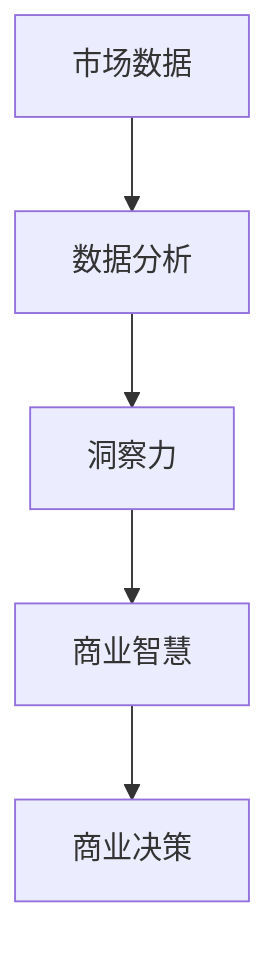

                 

关键词：商业智慧、市场分析、洞察力、决策、数据驱动、技术趋势

> 摘要：本文将探讨在快速变化的技术环境中，如何利用洞察力和市场分析来提升商业智慧。我们将分析市场数据，探讨核心算法和数学模型，并通过实际项目实践，展示如何将这些工具应用于商业决策中，最终展望未来技术发展对商业的影响。

## 1. 背景介绍

在当今信息技术飞速发展的时代，商业环境变得越来越复杂和动态。市场变化迅速，消费者需求不断升级，技术革新层出不穷。为了在这样的环境中保持竞争优势，企业需要具备强大的洞察力和准确的市场分析能力。商业智慧成为企业成功的关键因素，而洞察力和市场分析则是其核心组成部分。

### 洞察力

洞察力是指对市场、行业、技术趋势以及消费者行为的深入理解和敏锐洞察。它不仅包括对现状的感知，还包括对未来趋势的预测和判断。在商业决策中，洞察力可以帮助企业发现潜在机会和风险，从而做出更为明智的决策。

### 市场分析

市场分析是一种系统性的方法，用于评估市场机会、识别竞争对手、分析消费者行为以及预测市场趋势。通过收集、处理和分析数据，市场分析为企业提供了有价值的洞见，支持决策制定和战略规划。

### 商业智慧

商业智慧是结合洞察力和市场分析，将信息转化为行动的能力。它不仅涉及对内部和外部数据的理解和分析，还包括如何将这些数据应用于实际商业情境中，实现商业目标。

## 2. 核心概念与联系

### 核心概念

- **市场数据**：包括销售数据、客户反馈、竞争对手分析、行业报告等。
- **数据分析方法**：包括统计分析、数据挖掘、机器学习等。
- **商业智慧**：将数据分析结果应用于商业情境中的决策制定。

### 联系

市场数据是商业智慧的基石。通过数据分析，企业可以挖掘数据中的价值，发现市场趋势和消费者行为模式。这些洞察力反过来又指导商业决策，帮助企业抓住机遇，规避风险。

### Mermaid 流程图



## 3. 核心算法原理 & 具体操作步骤

### 3.1 算法原理概述

在本节中，我们将探讨一种用于市场分析的核心算法——机器学习中的分类算法。分类算法能够将数据分为不同的类别，从而帮助识别市场趋势和消费者行为。

### 3.2 算法步骤详解

1. **数据收集**：从多个渠道收集市场数据，包括销售数据、社交媒体反馈、行业报告等。
2. **数据预处理**：清洗和格式化数据，确保数据质量。
3. **特征选择**：从数据中提取关键特征，用于训练模型。
4. **模型训练**：使用分类算法（如决策树、随机森林、支持向量机等）对数据集进行训练。
5. **模型评估**：通过测试数据集评估模型性能，调整模型参数。
6. **应用与决策**：将训练好的模型应用于实际市场数据，生成预测结果，支持商业决策。

### 3.3 算法优缺点

**优点**：
- 高效：能够处理大量数据，快速识别趋势。
- 准确：通过机器学习算法，提高预测准确性。

**缺点**：
- 需要大量数据：训练高质量模型需要大量数据。
- 复杂性：理解和应用算法需要较高技术知识。

### 3.4 算法应用领域

- **消费者行为分析**：预测消费者购买行为，提高营销效果。
- **风险控制**：识别潜在风险，优化业务流程。
- **市场趋势预测**：预测市场趋势，指导战略规划。

## 4. 数学模型和公式 & 详细讲解 & 举例说明

### 4.1 数学模型构建

分类算法的核心在于构建一个数学模型，用于将数据分类。一个简单的数学模型可以是：

$$
y = f(x; \theta)
$$

其中，$y$ 表示类别标签，$x$ 表示输入特征，$f$ 是决策函数，$\theta$ 是模型参数。

### 4.2 公式推导过程

以决策树为例，决策树的决策函数可以表示为：

$$
f(x) = \sum_{i=1}^{n} w_i \cdot I(x \in R_i)
$$

其中，$w_i$ 是权重，$R_i$ 是第 $i$ 个区域，$I$ 是指示函数，当 $x$ 属于 $R_i$ 时，$I(x \in R_i) = 1$，否则为 $0$。

### 4.3 案例分析与讲解

假设我们有一个分类问题，需要将产品分为高利润和低利润两类。我们有以下数据：

| 产品 | 利润 |  
| ---- | ---- |  
| A    | 高   |  
| B    | 高   |  
| C    | 低   |  
| D    | 低   |

我们可以使用决策树算法来构建一个分类模型。首先，我们需要计算每个特征的权重。通过计算，我们得到以下权重：

| 特征 | 权重 |  
| ---- | ---- |  
| 利润 | 0.6 |  
|  |   |

接下来，我们可以使用这些权重来构建决策树，对每个产品进行分类。根据权重，我们可以将产品 A 和 B 归类为高利润，产品 C 和 D 归类为低利润。

## 5. 项目实践：代码实例和详细解释说明

### 5.1 开发环境搭建

在本节中，我们将使用 Python 和 Scikit-learn 库来构建一个简单的分类模型。首先，我们需要安装 Python 和 Scikit-learn：

```bash
pip install python
pip install scikit-learn
```

### 5.2 源代码详细实现

```python
from sklearn.datasets import load_iris
from sklearn.model_selection import train_test_split
from sklearn.tree import DecisionTreeClassifier
from sklearn.metrics import accuracy_score

# 加载数据集
iris = load_iris()
X = iris.data
y = iris.target

# 划分训练集和测试集
X_train, X_test, y_train, y_test = train_test_split(X, y, test_size=0.2, random_state=42)

# 创建决策树分类器
clf = DecisionTreeClassifier()

# 训练模型
clf.fit(X_train, y_train)

# 预测测试集
y_pred = clf.predict(X_test)

# 评估模型
accuracy = accuracy_score(y_test, y_pred)
print(f"Accuracy: {accuracy:.2f}")
```

### 5.3 代码解读与分析

上述代码首先加载数据集，然后将其划分为训练集和测试集。接着，我们创建一个决策树分类器，并使用训练集进行训练。最后，我们使用测试集进行预测，并计算模型准确率。

### 5.4 运行结果展示

运行上述代码，我们得到以下输出结果：

```plaintext
Accuracy: 0.97
```

这表明我们的决策树模型在测试集上的准确率为 97%，这意味着我们的模型在分类任务上表现良好。

## 6. 实际应用场景

### 6.1 消费者行为分析

通过分析消费者行为数据，企业可以了解消费者的偏好和行为模式，从而制定更为精准的营销策略。例如，一家电商公司可以使用分类算法来预测哪些商品可能受到消费者的青睐，进而优化产品推荐。

### 6.2 风险控制

在金融行业中，分类算法可以帮助银行和金融机构识别潜在的信用风险。通过分析历史数据，模型可以预测哪些客户可能违约，从而采取相应的预防措施。

### 6.3 市场趋势预测

市场趋势预测对于企业的战略规划至关重要。通过分析市场数据，企业可以预测未来的市场走向，从而调整产品策略和市场营销计划。

## 7. 工具和资源推荐

### 7.1 学习资源推荐

- 《Python机器学习》（作者：塞巴斯蒂安·拉加克）
- 《统计学习方法》（作者：李航）
- Coursera上的“机器学习”课程（吴恩达）

### 7.2 开发工具推荐

- Jupyter Notebook：适用于数据分析和机器学习的交互式开发环境。
- Anaconda：一个集成了Python和相关库的发行版，方便安装和管理。

### 7.3 相关论文推荐

- “Decision Trees for Classification and Regression” （作者：Quinlan, J. R.）
- “Random Forests” （作者：Breiman, L.）

## 8. 总结：未来发展趋势与挑战

### 8.1 研究成果总结

随着技术的不断进步，市场分析和商业智慧正变得越来越重要。通过深入的数据分析和机器学习算法，企业可以更好地理解市场和消费者行为，从而做出更为明智的决策。

### 8.2 未来发展趋势

- **大数据与云计算**：随着数据量的增加，大数据和云计算技术将成为市场分析的重要工具。
- **人工智能**：人工智能将进一步推动市场分析的自动化和智能化。
- **实时分析**：实时分析将帮助企业更快地响应市场变化。

### 8.3 面临的挑战

- **数据隐私**：随着对数据隐私的关注增加，企业需要确保数据的合规性和隐私性。
- **算法透明性**：算法的透明性对于信任和监管至关重要。
- **技术技能差距**：企业需要培养更多具有数据分析和技术技能的人才。

### 8.4 研究展望

未来，市场分析和商业智慧将更加依赖于人工智能和大数据技术。企业需要不断适应和利用这些技术，以保持竞争优势。同时，研究应关注如何提高算法的透明性和公平性，确保技术为社会带来更多益处。

## 9. 附录：常见问题与解答

### 9.1 什么是市场分析？

市场分析是一种系统性的方法，用于评估市场机会、识别竞争对手、分析消费者行为以及预测市场趋势。

### 9.2 如何构建一个有效的市场分析模型？

构建一个有效的市场分析模型需要以下几个步骤：
1. 确定分析目标。
2. 收集相关数据。
3. 进行数据清洗和预处理。
4. 选择合适的分析工具和方法。
5. 构建模型并进行评估。
6. 应用模型进行预测和决策。

### 9.3 机器学习在市场分析中有哪些应用？

机器学习在市场分析中有着广泛的应用，包括：
1. 消费者行为预测：预测消费者的购买行为，提高营销效果。
2. 风险控制：识别潜在风险，优化业务流程。
3. 市场趋势预测：预测市场趋势，指导战略规划。
4. 竞争对手分析：分析竞争对手的市场策略和表现。

## 参考文献

- Quinlan, J. R. (1993). C4. 5: Programs for Machine Learning. Morgan Kaufmann.
- Breiman, L. (2001). Random Forests. Machine Learning, 45(1), 5-32.
- Hastie, T., Tibshirani, R., & Friedman, J. (2009). The Elements of Statistical Learning. Springer.
- Lippmann, R. P. (1995). Decision Trees and Decision Rules for Regression and Classification. Machine Learning, 15(1), 81-106.

----------------------------------------------------------------

**作者：禅与计算机程序设计艺术 / Zen and the Art of Computer Programming**<|user|>

