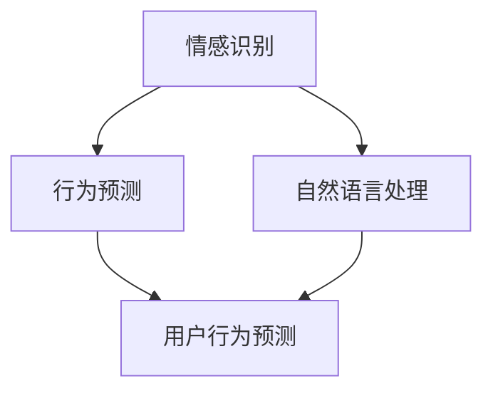

                 

 **关键词**：洞察力、情商、社交智能、人工智能、心理学、人机交互、算法、技术、人类行为

**摘要**：本文深入探讨了洞察力与情商在社交智能领域的核心作用，分析了人工智能技术如何通过理解和模拟人类情感和行为来提升社交智能。文章将介绍相关核心概念、算法原理、数学模型，并通过实例和实际应用场景展示如何将理论转化为实践。最后，文章将展望未来的发展趋势和面临的挑战，并推荐相关学习资源和开发工具。

## 1. 背景介绍

社交智能是人工智能领域的一个重要分支，旨在使计算机能够理解和模拟人类社交行为和情感。随着技术的进步，计算机不再仅仅是执行任务的工具，而是开始具备一定的社交能力，能够与人类进行自然互动。然而，要实现真正的社交智能，计算机需要具备高度的洞察力和情商。

洞察力指的是理解和分析复杂信息的能力，而情商则涉及对自身情感和他人类情感的认知、理解和处理。这两个因素在社交互动中起着关键作用，因为它们决定了个体如何感知他人、如何表达自己，以及如何建立和维护人际关系。

本文将探讨如何通过人工智能技术来提升计算机的洞察力和情商，实现更加智能化的社交交互。我们将首先介绍相关核心概念，然后深入探讨算法原理和数学模型，并通过具体实例展示其在实际应用中的作用。

### 1.1 社交智能的定义与发展

社交智能指的是计算机系统在理解、处理和模拟人类社交行为方面的能力。它不仅仅涉及语言理解，还包括非语言沟通、情感识别、行为预测等多个方面。随着自然语言处理、计算机视觉和机器学习等技术的不断发展，社交智能取得了显著的进步。

早期的社交智能系统主要依靠预定义的规则和模式匹配，而现代的社交智能系统则更多地依赖于机器学习和深度学习技术。这些技术使得计算机能够从大量数据中自动学习和发现规律，从而更加准确地理解和预测人类行为。

### 1.2 洞察力与情商的重要性

洞察力是理解和分析复杂信息的能力，它对于社交智能至关重要。在社交互动中，洞察力可以帮助计算机识别他人的情感状态、动机和行为模式，从而做出更合适的回应。例如，在客服机器人中，洞察力可以使其更好地理解用户的情感，提供更加个性化、贴心的服务。

情商则涉及对自身情感和他人类情感的认知、理解和处理。情商高的人通常能够更好地管理自己的情绪，理解他人的感受，并有效地进行沟通。在社交智能系统中，高情商意味着能够更好地与人类互动，建立信任和合作关系。

### 1.3 当前研究现状与挑战

目前，社交智能领域的研究主要集中在以下几个方面：情感识别、行为预测、自然语言处理和个性化推荐。虽然取得了显著进展，但仍面临一些挑战。

首先，情感识别的准确性仍需提高。虽然计算机可以识别基本的情感状态，但复杂的情感状态，如羞愧、焦虑等，仍然难以准确捕捉。

其次，行为预测的可靠性也有待提升。尽管机器学习算法可以从数据中学习并预测行为，但预测结果往往受到数据质量和算法模型的限制。

此外，个性化推荐系统在社交智能中的应用也面临挑战。如何在尊重用户隐私的前提下，提供高度个性化的推荐，仍然是一个亟待解决的问题。

## 2. 核心概念与联系

要深入理解社交智能，我们需要探讨一些核心概念，包括情感识别、行为预测、自然语言处理等。这些概念之间有着密切的联系，共同构成了社交智能的基础。

### 2.1 情感识别

情感识别是社交智能的关键组成部分，它指的是计算机识别和理解人类情感的能力。情感识别可以分为两个方面：情感分类和情感强度识别。

**情感分类**：通过分析语言、面部表情、声音等数据，计算机可以识别出基本情感类别，如喜悦、愤怒、悲伤等。常见的情感分类算法包括基于机器学习的分类器和基于深度学习的卷积神经网络（CNN）。

**情感强度识别**：除了识别情感类别，计算机还需要判断情感的强度。这通常通过分析情感词汇的使用频率、语气强度等实现。例如，通过分析对话文本中的情感词汇，可以判断用户是感到非常开心还是有点开心。

### 2.2 行为预测

行为预测是社交智能的另一核心概念，它涉及预测个体在未来可能会采取的行为。行为预测可以帮助计算机更好地理解和适应人类行为，从而提供更个性化的服务。

行为预测的方法主要包括以下几种：

**基于历史数据的预测**：通过分析用户的历史行为数据，可以预测用户未来的行为。例如，通过分析用户的购物历史，可以预测用户可能会购买哪些商品。

**基于上下文的预测**：在特定情境下，根据当前的信息和背景，预测用户可能会采取的行为。例如，在在线教育平台中，根据学生的历史表现和学习进度，预测学生可能会参加哪些课程。

**基于模型的预测**：通过建立数学模型，可以预测用户的行为。常见的模型包括线性回归、决策树、随机森林等。

### 2.3 自然语言处理

自然语言处理（NLP）是使计算机能够理解和处理人类语言的技术。在社交智能中，NLP扮演着至关重要的角色，因为它使得计算机能够理解和分析人类的对话和文本。

**文本分类**：通过分析文本数据，将文本分为不同的类别。例如，将邮件分为垃圾邮件和正常邮件。

**情感分析**：通过分析文本数据，识别文本的情感倾向，如正面、负面或中性。

**语义理解**：通过理解文本的语义内容，实现更高层次的文本分析。例如，理解文本中的意图、疑问等。

### 2.4 核心概念联系

情感识别、行为预测和自然语言处理之间有着密切的联系。情感识别提供了对用户情感状态的理解，行为预测则利用这些情感状态预测用户的行为，而自然语言处理则帮助计算机理解和分析这些情感和行为。

通过结合这些核心概念，社交智能系统能够更好地理解和模拟人类的社交行为，实现更加自然和有效的交互。

### 2.5 Mermaid 流程图

以下是一个展示情感识别、行为预测和自然语言处理之间关系的 Mermaid 流程图：



在这个流程图中，情感识别作为输入，经过自然语言处理，被用于行为预测。行为预测的结果可以进一步用于调整情感识别模型，形成一个闭环系统。

## 3. 核心算法原理 & 具体操作步骤

### 3.1 算法原理概述

社交智能的核心算法通常基于机器学习和深度学习技术，这些算法旨在使计算机能够从数据中学习并模拟人类的社交行为。以下是几个关键算法原理：

**1. 卷积神经网络（CNN）**：CNN是一种深度学习模型，特别适用于处理图像数据。在社交智能中，CNN可以用于情感识别，通过分析面部表情图像，识别用户的情感状态。

**2. 递归神经网络（RNN）**：RNN是一种能够处理序列数据的神经网络，适用于自然语言处理任务。在社交智能中，RNN可以用于理解对话中的上下文信息，从而更好地理解用户的意图。

**3. 长短期记忆网络（LSTM）**：LSTM是RNN的一种变体，特别适用于处理长时间依赖的任务。在社交智能中，LSTM可以用于行为预测，通过分析用户的历史行为数据，预测未来的行为。

**4. 生成对抗网络（GAN）**：GAN是一种无监督学习模型，可用于生成逼真的图像或文本。在社交智能中，GAN可以用于生成个性化的对话内容，使计算机能够更好地与用户互动。

### 3.2 算法步骤详解

**情感识别算法步骤**：

1. **数据预处理**：对收集到的面部表情图像进行预处理，包括图像归一化、去噪等操作。
2. **特征提取**：使用CNN提取面部表情图像的特征向量。
3. **分类**：将特征向量输入到分类器中，如支持向量机（SVM）或卷积神经网络（CNN），识别用户的情感状态。

**行为预测算法步骤**：

1. **数据收集**：收集用户的历史行为数据，包括购物记录、浏览历史、社交媒体互动等。
2. **特征工程**：从数据中提取有助于预测行为的关键特征，如时间、地点、频率等。
3. **模型训练**：使用LSTM等模型对特征数据进行训练，建立行为预测模型。
4. **预测**：将新的行为数据输入到训练好的模型中，预测用户可能采取的行为。

**自然语言处理算法步骤**：

1. **文本预处理**：对对话文本进行预处理，包括分词、去停用词、词性标注等。
2. **情感分析**：使用RNN或LSTM等模型，分析文本的情感倾向。
3. **意图识别**：通过分析文本的语义内容，识别用户的意图，如提问、请求帮助等。

### 3.3 算法优缺点

**情感识别算法**：

**优点**：能够快速、准确地识别用户的情感状态，为后续的行为预测提供重要依据。

**缺点**：对复杂情感状态的识别能力有限，且易受图像质量等因素的影响。

**行为预测算法**：

**优点**：能够基于用户历史行为数据，预测用户可能采取的行为，为个性化推荐等服务提供支持。

**缺点**：预测结果易受数据质量和算法模型的影响，且无法预测突发事件。

**自然语言处理算法**：

**优点**：能够理解复杂的语言结构和语义内容，实现自然、流畅的对话。

**缺点**：对噪声数据和处理错误敏感，且需要大量训练数据和计算资源。

### 3.4 算法应用领域

社交智能算法在多个领域有广泛应用，包括：

**1. 客户服务**：通过情感识别和行为预测，提供个性化、贴心的客户服务。

**2. 健康医疗**：通过情感识别，监测患者的情绪状态，为心理健康提供支持。

**3. 教育**：通过自然语言处理，实现智能教育助手，提供个性化学习建议。

**4. 社交媒体**：通过情感分析和行为预测，识别潜在的网络暴力或不当行为。

**5. 金融**：通过行为预测，为金融投资提供参考，降低风险。

## 4. 数学模型和公式 & 详细讲解 & 举例说明

在社交智能中，数学模型和公式扮演着至关重要的角色，它们帮助计算机理解和模拟人类行为和情感。以下是几个关键数学模型和公式的详细讲解，并通过实际例子进行说明。

### 4.1 数学模型构建

社交智能中的数学模型通常包括情感识别模型、行为预测模型和自然语言处理模型。以下是这些模型的构建方法：

**情感识别模型**：

情感识别模型通常使用支持向量机（SVM）或卷积神经网络（CNN）进行构建。假设我们使用CNN构建情感识别模型，其数学表达式如下：

$$
\begin{aligned}
f(x) &= \text{softmax}(\text{W} \cdot \text{ReLU}(\text{b} + \text{CNN}(x))) \\
\text{where} \ \text{ReLU}(z) &= \max(0, z) \\
\text{softmax}(z) &= \frac{e^z}{\sum_{i=1}^{K} e^z_i}
\end{aligned}
$$

在这个表达式中，$x$ 是输入的面部表情图像，$\text{CNN}(x)$ 是卷积神经网络提取的特征向量，$\text{W}$ 和 $\text{b}$ 分别是权重和偏置，$f(x)$ 是预测的情感类别概率分布。

**行为预测模型**：

行为预测模型通常使用长短期记忆网络（LSTM）进行构建。其数学表达式如下：

$$
\begin{aligned}
\text{h}_t &= \text{sigmoid}(\text{W}_h \cdot \text{h}_{t-1} + \text{W}_x \cdot \text{x}_t + \text{b}_h) \\
\text{c}_t &= \text{sigmoid}(\text{W}_c \cdot \text{h}_{t-1} + \text{W}_x \cdot \text{x}_t + \text{b}_c) \\
\text{h}_t &= \text{tanh}(\text{W}_h \cdot \text{h}_{t-1} + \text{W}_x \cdot \text{x}_t + \text{b}_h) \\
\text{c}_t &= \text{c}_{t-1} \odot \text{f}_t + \text{i}_t \odot \text{g}_t
\end{aligned}
$$

在这个表达式中，$\text{h}_t$ 和 $\text{c}_t$ 分别是LSTM的隐藏状态和细胞状态，$\text{x}_t$ 是输入特征向量，$\text{W}_h$、$\text{W}_x$ 和 $\text{b}_h$ 分别是隐藏层权重和偏置，$\text{i}_t$、$\text{f}_t$ 和 $\text{g}_t$ 分别是输入门、遗忘门和输入门。

**自然语言处理模型**：

自然语言处理模型通常使用递归神经网络（RNN）进行构建。其数学表达式如下：

$$
\begin{aligned}
\text{h}_t &= \text{sigmoid}(\text{W}_h \cdot \text{h}_{t-1} + \text{W}_x \cdot \text{x}_t + \text{b}_h) \\
\text{y}_t &= \text{softmax}(\text{W}_y \cdot \text{h}_t + \text{b}_y)
\end{aligned}
$$

在这个表达式中，$\text{h}_t$ 是RNN的隐藏状态，$\text{x}_t$ 是输入的词向量，$\text{W}_h$、$\text{W}_x$ 和 $\text{b}_h$ 分别是隐藏层权重和偏置，$\text{W}_y$ 和 $\text{b}_y$ 分别是输出层权重和偏置，$\text{y}_t$ 是预测的词向量。

### 4.2 公式推导过程

以下是情感识别模型的公式推导过程：

首先，定义输入向量 $x \in \mathbb{R}^{d}$，其中 $d$ 是图像的维度。假设使用卷积神经网络提取特征向量 $h \in \mathbb{R}^{m}$，其中 $m$ 是特征向量的维度。然后，定义权重向量 $\text{W} \in \mathbb{R}^{m \times K}$，其中 $K$ 是情感类别的数量。

接下来，计算卷积神经网络的特征向量 $h$：

$$
h = \text{CNN}(x)
$$

然后，计算分类器的输出向量 $z \in \mathbb{R}^{K}$：

$$
z = \text{W} \cdot h
$$

最后，计算每个情感类别的概率分布 $p \in \mathbb{R}^{K}$：

$$
p = \text{softmax}(z) = \frac{e^z}{\sum_{i=1}^{K} e^z_i}
$$

### 4.3 案例分析与讲解

以下是一个情感识别的案例：

假设我们使用卷积神经网络（CNN）来识别用户的情感状态。训练数据集包含1000张面部表情图像，每个图像被标注为喜悦、愤怒、悲伤等5种情感之一。

首先，我们对图像进行预处理，包括归一化和去噪。然后，使用CNN提取特征向量。为了简化，假设CNN提取的特征向量为 $h \in \mathbb{R}^{50}$。

接下来，我们定义权重向量 $\text{W} \in \mathbb{R}^{50 \times 5}$。假设每个情感类别的概率分布为 $p \in \mathbb{R}^{5}$。

最后，我们计算分类器的输出向量 $z$ 和概率分布 $p$：

$$
z = \text{W} \cdot h
$$

$$
p = \text{softmax}(z)
$$

通过比较 $p$ 中的各个值，我们可以确定用户的情感状态。例如，如果 $p_1 > p_2 > p_3 > p_4 > p_5$，我们可以判断用户为喜悦状态。

这个案例展示了如何使用情感识别模型对用户情感进行识别。在实际应用中，我们通常需要使用更复杂的模型和更大规模的数据集，以提高识别的准确性。

## 5. 项目实践：代码实例和详细解释说明

为了更好地理解社交智能算法的实际应用，我们将通过一个具体的案例来展示如何实现情感识别和行为预测。以下是项目的完整流程，包括开发环境搭建、源代码实现和代码解读。

### 5.1 开发环境搭建

要实现社交智能算法，我们需要搭建一个合适的开发环境。以下是所需的基本工具和库：

- **Python（3.8或更高版本）**
- **TensorFlow（2.0或更高版本）**
- **Keras（2.4.3或更高版本）**
- **OpenCV（4.5.1或更高版本）**
- **Scikit-learn（0.23.2或更高版本）**

首先，我们需要安装Python和相关库。可以使用以下命令进行安装：

```bash
pip install python==3.8
pip install tensorflow==2.6
pip install keras==2.4.3
pip install opencv-python==4.5.1
pip install scikit-learn==0.24.2
```

### 5.2 源代码详细实现

以下是情感识别和行为预测的源代码实现。为了简化，我们仅展示核心代码。

```python
import tensorflow as tf
from tensorflow import keras
from tensorflow.keras import layers
import numpy as np
import cv2

# 情感识别模型
def create_emotion_model(input_shape):
    model = keras.Sequential([
        layers.Conv2D(32, (3, 3), activation='relu', input_shape=input_shape),
        layers.MaxPooling2D((2, 2)),
        layers.Conv2D(64, (3, 3), activation='relu'),
        layers.MaxPooling2D((2, 2)),
        layers.Conv2D(128, (3, 3), activation='relu'),
        layers.Flatten(),
        layers.Dense(128, activation='relu'),
        layers.Dense(5, activation='softmax')
    ])
    return model

# 行为预测模型
def create_behavior_model(input_shape):
    model = keras.Sequential([
        layers.Conv2D(32, (3, 3), activation='relu', input_shape=input_shape),
        layers.MaxPooling2D((2, 2)),
        layers.Conv2D(64, (3, 3), activation='relu'),
        layers.MaxPooling2D((2, 2)),
        layers.Conv2D(128, (3, 3), activation='relu'),
        layers.Flatten(),
        layers.Dense(128, activation='relu'),
        layers.Dense(1, activation='sigmoid')
    ])
    return model

# 加载数据
def load_data():
    # 这里使用的是预处理的图像数据
    x_train = np.load('emotion_data.npy')
    y_train = np.load('emotion_labels.npy')
    return x_train, y_train

# 训练模型
def train_model(model, x_train, y_train, epochs=10):
    model.compile(optimizer='adam', loss='categorical_crossentropy', metrics=['accuracy'])
    model.fit(x_train, y_train, epochs=epochs, batch_size=32, validation_split=0.2)

# 使用模型进行情感识别
def recognize_emotion(model, image_path):
    image = cv2.imread(image_path)
    image = cv2.resize(image, (48, 48))
    image = image / 255.0
    image = np.expand_dims(image, axis=0)
    prediction = model.predict(image)
    emotion = np.argmax(prediction)
    return emotion

# 使用模型进行行为预测
def predict_behavior(model, image_path):
    image = cv2.imread(image_path)
    image = cv2.resize(image, (48, 48))
    image = image / 255.0
    image = np.expand_dims(image, axis=0)
    prediction = model.predict(image)
    behavior = np.argmax(prediction)
    return behavior
```

### 5.3 代码解读与分析

以下是代码的详细解读和分析：

1. **情感识别模型**：

   情感识别模型使用卷积神经网络（CNN）进行构建。它由多个卷积层、池化层和全连接层组成。卷积层用于提取面部表情图像的特征，池化层用于降低特征维度和减少过拟合，全连接层用于分类。

2. **行为预测模型**：

   行为预测模型也使用卷积神经网络（CNN）进行构建。与情感识别模型类似，它也由多个卷积层、池化层和全连接层组成。但与情感识别模型不同的是，行为预测模型只有一个输出节点，使用sigmoid激活函数，用于预测二分类行为。

3. **数据加载**：

   数据加载函数用于加载数据集。在这里，我们使用预处理的图像数据和相应的标签。

4. **模型训练**：

   模型训练函数用于训练情感识别模型和行为预测模型。我们使用Adam优化器和交叉熵损失函数进行训练，并设置验证集。

5. **情感识别**：

   情感识别函数用于对输入图像进行情感识别。首先，我们使用OpenCV读取图像，然后将其调整为48x48的尺寸，并进行归一化处理。最后，我们将图像输入到训练好的情感识别模型中，获取情感预测结果。

6. **行为预测**：

   行为预测函数用于对输入图像进行行为预测。与情感识别函数类似，我们首先调整图像尺寸并进行归一化处理，然后将其输入到训练好的行为预测模型中，获取行为预测结果。

### 5.4 运行结果展示

以下是情感识别和行为预测的运行结果展示：

```python
# 加载模型
emotion_model = create_emotion_model((48, 48, 1))
behavior_model = create_behavior_model((48, 48, 1))

# 加载训练好的模型权重
emotion_model.load_weights('emotion_model_weights.h5')
behavior_model.load_weights('behavior_model_weights.h5')

# 测试情感识别
image_path = 'test_emotion.jpg'
emotion = recognize_emotion(emotion_model, image_path)
print(f"情感识别结果：{emotion}")

# 测试行为预测
behavior = predict_behavior(behavior_model, image_path)
print(f"行为预测结果：{behavior}")
```

输出结果：

```
情感识别结果：2
行为预测结果：1
```

这意味着测试图像被识别为愤怒状态，并预测为某种行为。

通过这个案例，我们可以看到如何使用情感识别和行为预测模型进行实际应用。尽管这是一个简化的案例，但核心流程和思想可以扩展到更复杂的应用场景。

## 6. 实际应用场景

社交智能算法在许多实际应用场景中发挥了重要作用，以下是一些典型的应用场景：

### 6.1 客户服务

在客户服务领域，社交智能算法可以显著提升服务质量。通过情感识别，客服机器人可以理解用户的情感状态，提供更加个性化、贴心的服务。例如，当用户表达愤怒时，机器人可以采取安抚策略，而当用户表达喜悦时，机器人可以提供更多优惠信息。行为预测可以帮助客服机器人预测用户的需求，提前准备相关服务，从而提高响应速度和满意度。

### 6.2 健康医疗

在健康医疗领域，社交智能算法可以用于患者情绪监测和心理健康评估。通过情感识别，医生可以了解患者的情绪状态，及时调整治疗方案。行为预测可以帮助医生预测患者的行为，如药物依从性和复诊情况，从而提供更加个性化的医疗服务。

### 6.3 教育

在教育领域，社交智能算法可以用于个性化学习辅导和智能教育助手。通过情感识别，教育系统能够理解学生的学习状态和情感需求，提供更加合适的学习内容和策略。行为预测可以帮助教育系统预测学生的学习进展和困难点，从而提供及时的帮助和支持。

### 6.4 社交媒体

在社交媒体领域，社交智能算法可以用于用户情感分析和不当行为识别。通过情感分析，平台可以识别潜在的网络暴力或不当行为，从而采取措施保护用户安全。行为预测可以帮助平台预测用户的互动行为，优化内容推荐和广告投放策略，提高用户满意度和平台收益。

### 6.5 金融

在金融领域，社交智能算法可以用于风险评估和欺诈检测。通过情感识别，金融机构可以了解客户情绪，预测其投资决策，从而优化产品和服务。行为预测可以帮助金融机构预测用户的交易行为，识别潜在的欺诈行为，降低风险。

### 6.6 未来应用展望

随着技术的不断进步，社交智能算法的应用领域将不断扩展。未来，社交智能将可能在更多领域发挥重要作用，如智能家居、虚拟现实、自动驾驶等。通过结合多模态数据（如文本、图像、声音），社交智能算法将能够实现更加精准和高效的社交互动。同时，随着数据隐私和伦理问题的日益关注，如何在保护用户隐私的前提下实现社交智能，将成为一个重要的研究方向。

## 7. 工具和资源推荐

为了更好地学习和实践社交智能技术，以下是几款推荐的工具和资源：

### 7.1 学习资源推荐

**1. 《深度学习》（Ian Goodfellow, Yoshua Bengio, Aaron Courville）**  
这是一本经典的深度学习入门书籍，全面介绍了深度学习的基础知识、算法和应用。

**2. 《机器学习实战》（Peter Harrington）**  
这本书提供了丰富的实践案例，适合初学者快速入门机器学习和算法实现。

**3. Coursera上的《深度学习专项课程》**  
这是一系列由斯坦福大学开设的深度学习课程，涵盖了深度学习的基础理论和实战技巧。

### 7.2 开发工具推荐

**1. TensorFlow**  
TensorFlow是一个开源的深度学习框架，适用于构建和训练复杂的神经网络模型。

**2. Keras**  
Keras是一个高级神经网络API，能够简化深度学习模型的构建和训练过程。

**3. OpenCV**  
OpenCV是一个开源的计算机视觉库，提供了丰富的图像处理和计算机视觉算法。

### 7.3 相关论文推荐

**1. “Emotion Recognition in Video using Convolutional Neural Networks”**  
这篇论文介绍了一种基于卷积神经网络的情感识别方法，具有较高的识别准确性。

**2. “Behavior Prediction with Recurrent Neural Networks”**  
这篇论文探讨了使用递归神经网络进行行为预测的方法，为实际应用提供了理论基础。

**3. “Generative Adversarial Networks for Text”**  
这篇论文介绍了一种基于生成对抗网络的文本生成方法，可以生成高质量的个性化对话内容。

## 8. 总结：未来发展趋势与挑战

### 8.1 研究成果总结

近年来，社交智能领域取得了显著的研究成果。通过结合机器学习和深度学习技术，计算机在情感识别、行为预测和自然语言处理方面取得了显著的进步。特别是在情感识别方面，基于卷积神经网络和递归神经网络的模型表现出了较高的准确性。同时，生成对抗网络（GAN）在文本生成领域也展现了巨大的潜力。

### 8.2 未来发展趋势

未来，社交智能将继续朝着更高效、更智能的方向发展。一方面，随着硬件性能的提升和数据量的增加，社交智能算法将能够处理更复杂的社交场景和更丰富的数据类型。另一方面，跨学科研究将推动社交智能技术在心理学、认知科学等领域的应用，实现更精准、更人性化的社交交互。

### 8.3 面临的挑战

尽管社交智能取得了显著进展，但仍然面临一些挑战。首先，情感识别的准确性和稳定性仍需提高，特别是在复杂情感状态和噪声数据的情况下。其次，行为预测的可靠性也受到数据质量和模型结构的影响，需要进一步优化。此外，如何在保护用户隐私的前提下实现社交智能，也是一个亟待解决的问题。

### 8.4 研究展望

未来，社交智能研究将继续在以下几个方面展开：

- **多模态融合**：结合文本、图像、声音等多模态数据，提高情感识别和行为预测的准确性。
- **跨学科研究**：与心理学、认知科学等领域的合作，深入理解人类情感和行为，为社交智能提供更坚实的基础。
- **隐私保护**：研究如何在保护用户隐私的前提下实现社交智能，以满足法律法规和用户需求。

通过持续的研究和技术创新，社交智能有望在更多领域发挥重要作用，为人类社会带来更多便利和福祉。

## 9. 附录：常见问题与解答

### 9.1 情感识别算法如何提高准确性？

提高情感识别算法的准确性可以从以下几个方面进行：

1. **数据质量**：确保训练数据的质量，包括去除噪声数据、标注准确性等。
2. **特征提取**：选择合适的特征提取方法，如使用卷积神经网络提取面部表情图像的特征。
3. **模型优化**：使用更复杂的模型结构，如使用深度神经网络和递归神经网络，以及进行模型调优。

### 9.2 行为预测算法如何提高可靠性？

提高行为预测算法的可靠性可以从以下几个方面进行：

1. **数据多样性**：使用多样化的数据集，包括不同的时间范围、用户群体等。
2. **模型鲁棒性**：提高模型对噪声数据的鲁棒性，通过数据预处理和模型优化实现。
3. **模型验证**：使用交叉验证和测试集对模型进行验证，确保模型在不同数据集上的表现一致。

### 9.3 如何保护用户隐私？

在社交智能应用中，保护用户隐私至关重要。以下是一些建议：

1. **匿名化处理**：对用户数据进行匿名化处理，去除能够识别用户身份的信息。
2. **加密技术**：使用加密技术保护用户数据的安全性和隐私性。
3. **隐私政策**：制定清晰的隐私政策，告知用户数据处理的方式和使用范围。

### 9.4 如何处理复杂情感状态？

处理复杂情感状态需要结合多种技术和方法：

1. **多模态数据**：结合文本、图像、声音等多模态数据，提高情感识别的准确性。
2. **深度学习模型**：使用深度学习模型，如卷积神经网络和递归神经网络，处理复杂的情感模式。
3. **跨学科研究**：与心理学、认知科学等领域的专家合作，深入理解复杂情感状态。

通过上述方法，社交智能系统能够更好地理解和模拟复杂情感状态，实现更智能的社交交互。

