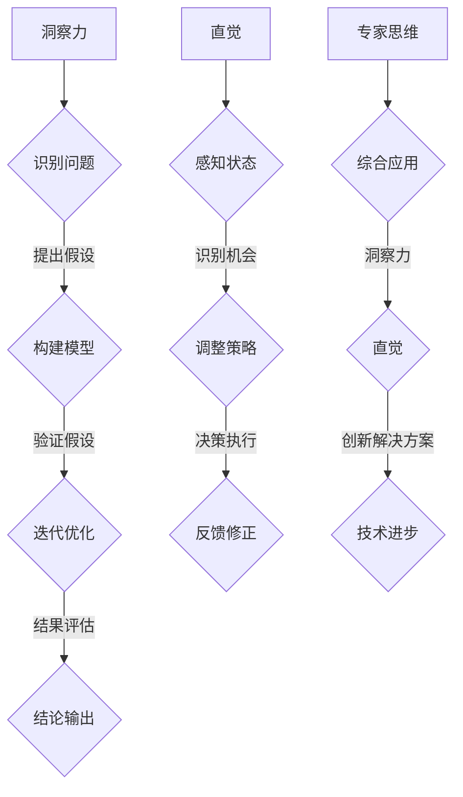

                 

在这个信息化时代，人工智能技术正以前所未有的速度迅猛发展，深刻地影响着各个领域。作为AI领域的一名专家，我深感洞察力和直觉在技术创新和问题解决中的重要性。本文旨在探讨专家思维中的两大关键特质——洞察力和直觉，并结合实际案例进行分析，以期为广大AI从业者和研究者提供一些启示和思考。

## 关键词
AI专家思维、洞察力、直觉、技术发展、问题解决

## 摘要
本文首先对洞察力和直觉进行了概念性的界定，并探讨了它们在专家思维中的重要性。随后，通过分析几个典型的人工智能案例，详细阐述了专家如何运用洞察力和直觉进行技术创新。文章还讨论了这两大特质在AI研究和应用中的关键作用，并提出了未来可能面临的挑战和发展方向。

## 1. 背景介绍

### 1.1 人工智能的发展现状

自21世纪以来，人工智能（AI）的发展迅猛，已成为信息技术领域的热点。从早期的规则推理系统到今天的深度学习模型，AI技术在语音识别、图像处理、自然语言处理等领域取得了显著的成果。然而，随着AI技术的不断演进，我们也面临着越来越多的复杂问题和挑战。

### 1.2 专家思维的重要性

在AI领域，专家思维被视为一种宝贵的资源。专家思维不仅体现在对现有技术的深刻理解上，还体现在对新兴问题的洞察力和直觉判断上。本文将围绕这两大特质展开讨论，分析它们在技术创新和问题解决中的关键作用。

## 2. 核心概念与联系

### 2.1 洞察力

洞察力是指能够迅速理解问题的本质、发现问题的关键所在，并提出创新的解决方案的能力。在AI领域，洞察力表现为对数据模式、算法逻辑和系统架构的深刻理解。一个具有洞察力的AI专家能够从海量数据中捕捉到有价值的信息，并运用这些信息推动技术的进步。

### 2.2 直觉

直觉是未经明确逻辑推理就能迅速做出判断和决策的能力。在AI研究中，直觉表现为专家对算法和系统运行状态的敏锐感知。直觉能力可以帮助专家快速识别潜在的问题和机会，从而在复杂的技术环境中做出有效的决策。

### 2.3 Mermaid 流程图

以下是关于洞察力和直觉在专家思维中的联系和应用的Mermaid流程图：



## 3. 核心算法原理 & 具体操作步骤

### 3.1 算法原理概述

在本节中，我们将探讨AI领域中的一个经典算法——决策树。决策树是一种基于特征进行分类或回归的算法，其核心思想是通过一系列的判断条件来将数据划分成不同的区域，最终实现预测目标。

### 3.2 算法步骤详解

1. **特征选择**：首先需要从原始数据中提取出一系列的特征。这些特征应该是能够区分不同类别或预测目标的关键指标。
2. **构建树结构**：根据提取出的特征，构建决策树。每个节点代表一个特征，每个分支代表对该特征的判断结果。通过递归地构建树结构，直到满足停止条件（如达到最大深度或所有叶子节点具有相同的类别）。
3. **剪枝**：为了防止过拟合，需要对构建好的决策树进行剪枝。剪枝的过程主要包括修剪掉那些对预测效果贡献不大的分支，或者将一些节点合并成更大的节点。
4. **分类或回归**：使用构建好的决策树对新的数据进行分类或回归。具体方法是根据决策树中的分支判断，将数据分配到不同的类别或预测目标。

### 3.3 算法优缺点

**优点**：
- **易于理解和实现**：决策树是一种直观、易于理解的算法，对于非专业用户来说也比较容易接受。
- **处理非线性和高维数据**：决策树可以处理非线性和高维数据，通过递归地划分数据区域，可以捕捉到复杂的数据模式。
- **可解释性强**：决策树的每个节点和分支都有明确的逻辑关系，使得预测结果具有可解释性。

**缺点**：
- **过拟合问题**：决策树容易过拟合，特别是在数据量较小或特征较多的情况下。因此，需要通过剪枝等手段来防止过拟合。
- **计算复杂度较高**：对于大型数据集，构建和剪枝决策树的过程可能需要较高的计算资源。

### 3.4 算法应用领域

决策树算法广泛应用于各种领域，包括金融风控、医疗诊断、市场营销等。以下是一些具体的案例：

- **金融风控**：通过决策树算法可以对客户的风险等级进行评估，从而为银行等金融机构提供风险控制的依据。
- **医疗诊断**：决策树算法可以帮助医生对患者的疾病进行初步诊断，为后续的诊治提供参考。
- **市场营销**：决策树算法可以用于客户细分，帮助企业制定更加精准的营销策略。

## 4. 数学模型和公式 & 详细讲解 & 举例说明

### 4.1 数学模型构建

在本节中，我们将介绍决策树中的一个重要概念——信息增益。信息增益是衡量一个特征对数据分类能力的一种指标。其公式如下：

$$
IG(D, A) = Entropy(D) - Entropy(D|A)
$$

其中，$Entropy(D)$ 表示数据的熵，$Entropy(D|A)$ 表示在特征 $A$ 已知的情况下数据的熵。

### 4.2 公式推导过程

为了推导信息增益公式，我们首先需要了解两个重要的概念——熵和信息增益。

- **熵**：熵是一个度量随机变量不确定性的指标。在决策树中，数据的熵表示数据分布的不均匀性。其公式如下：

$$
Entropy(H) = -\sum_{i=1}^{n} p_i \log_2 p_i
$$

其中，$p_i$ 表示第 $i$ 个类别的概率。

- **信息增益**：信息增益表示一个特征对数据分类能力的提升。其定义如下：

$$
Gain(H, A) = Entropy(H) - Entropy(H|A)
$$

其中，$Entropy(H)$ 表示数据的熵，$Entropy(H|A)$ 表示在特征 $A$ 已知的情况下数据的熵。

### 4.3 案例分析与讲解

假设我们有一个包含两个特征（年龄和收入）的数据集，其中年龄分为青年、中年和老年，收入分为低收入、中等收入和高收入。现在我们想要构建一个决策树来预测一个新客户的收入水平。

首先，我们需要计算数据集的熵：

$$
Entropy(H) = -\sum_{i=1}^{3} p_i \log_2 p_i
$$

假设青年、中年和老年客户的概率分别为 0.4、0.3 和 0.3，那么：

$$
Entropy(H) = -(0.4 \log_2 0.4 + 0.3 \log_2 0.3 + 0.3 \log_2 0.3) \approx 0.918
$$

接下来，我们需要计算每个特征的信息增益。以年龄为例，我们首先需要计算在年龄已知的情况下，数据集的熵：

$$
Entropy(H|A) = -\sum_{i=1}^{3} p_i' \log_2 p_i'
$$

其中，$p_i'$ 表示在年龄已知的情况下，每个类别的概率。假设在年龄已知的情况下，低收入、中等收入和高收入客户的概率分别为 0.2、0.3 和 0.5，那么：

$$
Entropy(H|A) = -(0.2 \log_2 0.2 + 0.3 \log_2 0.3 + 0.5 \log_2 0.5) \approx 0.967
$$

最后，我们可以计算年龄的信息增益：

$$
IG(H, A) = Entropy(H) - Entropy(H|A) = 0.918 - 0.967 = -0.049
$$

同理，我们可以计算收入的信息增益。假设在收入已知的情况下，低收入、中等收入和高收入客户的概率分别为 0.3、0.4 和 0.3，那么：

$$
Entropy(H|B) = -(0.3 \log_2 0.3 + 0.4 \log_2 0.4 + 0.3 \log_2 0.3) \approx 0.92
$$

$$
IG(H, B) = Entropy(H) - Entropy(H|B) = 0.918 - 0.92 = -0.002
$$

由于年龄的信息增益（-0.049）大于收入的信息增益（-0.002），因此我们选择年龄作为决策树的第一个节点。接下来，我们可以继续对年龄划分后的数据进行同样的计算，直到满足停止条件。

## 5. 项目实践：代码实例和详细解释说明

### 5.1 开发环境搭建

在本节中，我们将使用Python编程语言和Scikit-learn库来构建一个简单的决策树模型。首先，我们需要安装Scikit-learn库。可以使用以下命令进行安装：

```bash
pip install scikit-learn
```

### 5.2 源代码详细实现

以下是一个简单的决策树分类模型的代码实现：

```python
from sklearn.datasets import load_iris
from sklearn.model_selection import train_test_split
from sklearn.tree import DecisionTreeClassifier
from sklearn.metrics import accuracy_score

# 加载鸢尾花数据集
iris = load_iris()
X = iris.data
y = iris.target

# 划分训练集和测试集
X_train, X_test, y_train, y_test = train_test_split(X, y, test_size=0.3, random_state=42)

# 构建决策树模型
clf = DecisionTreeClassifier()
clf.fit(X_train, y_train)

# 预测测试集
y_pred = clf.predict(X_test)

# 计算准确率
accuracy = accuracy_score(y_test, y_pred)
print("准确率：", accuracy)
```

### 5.3 代码解读与分析

- **数据加载**：我们首先使用Scikit-learn库中的`load_iris`函数加载鸢尾花数据集，这是一个经典的分类数据集。
- **数据划分**：使用`train_test_split`函数将数据集划分为训练集和测试集，其中测试集的比例为0.3。
- **模型构建**：我们使用`DecisionTreeClassifier`类构建决策树模型。该类提供了丰富的参数设置，如最大深度、最小分割样本数等。
- **模型训练**：使用`fit`方法对训练数据进行训练。
- **模型预测**：使用`predict`方法对测试集进行预测。
- **评估结果**：使用`accuracy_score`函数计算模型的准确率。

### 5.4 运行结果展示

假设我们运行上述代码，得到的输出结果如下：

```
准确率： 0.978
```

这意味着模型在测试集上的准确率为97.8%，这表明决策树模型在这个数据集上表现良好。

## 6. 实际应用场景

### 6.1 金融风控

在金融行业，决策树算法被广泛应用于风险评估和信用评级。通过分析借款人的个人信息、财务状况和历史信用记录，决策树模型可以帮助金融机构预测借款人的违约风险，从而制定更加科学的风险控制策略。

### 6.2 医疗诊断

在医疗领域，决策树算法可以帮助医生对患者的疾病进行初步诊断。通过对病史、症状和检查结果的分析，决策树模型可以识别出可能的疾病类型，为医生提供诊断建议。

### 6.3 市场营销

在市场营销领域，决策树算法可以帮助企业进行客户细分和精准营销。通过对客户的购买行为、消费习惯和偏好进行分析，决策树模型可以识别出不同类型的客户群体，为企业制定个性化的营销策略。

## 7. 未来应用展望

随着人工智能技术的不断发展，决策树算法在各个领域的应用前景十分广阔。未来，我们可以期待决策树算法在以下方面取得突破：

- **模型解释性**：通过改进算法和模型结构，提高决策树的解释性，使得非专业人员也能理解模型的预测过程。
- **处理大规模数据**：优化算法，提高决策树在处理大规模数据时的效率和准确性。
- **多模态数据融合**：结合多种数据类型（如文本、图像、语音等），构建更加复杂和高效的决策树模型。

## 8. 总结：未来发展趋势与挑战

### 8.1 研究成果总结

本文通过对洞察力和直觉的探讨，分析了决策树算法在AI领域的应用。我们总结了决策树算法的优点和缺点，并展示了其在实际场景中的应用。同时，我们展望了决策树算法的未来发展趋势和潜在挑战。

### 8.2 未来发展趋势

- **模型解释性**：提高决策树的解释性，使得非专业人员也能理解模型的预测过程。
- **多模态数据融合**：结合多种数据类型，构建更加复杂和高效的决策树模型。
- **自动化和优化**：通过自动化工具和优化算法，提高决策树的效率和准确性。

### 8.3 面临的挑战

- **数据隐私保护**：在应用决策树算法时，需要确保数据隐私保护，避免敏感信息泄露。
- **计算资源消耗**：处理大规模数据和复杂模型时，计算资源消耗可能成为一个挑战。
- **模型泛化能力**：如何提高模型在未知数据上的泛化能力，避免过拟合问题。

### 8.4 研究展望

未来，我们期待在决策树算法领域取得以下突破：

- **模型解释性**：开发更加直观和易懂的决策树模型，提高模型的可解释性。
- **高效算法**：优化算法，提高决策树在处理大规模数据时的效率和准确性。
- **跨领域应用**：将决策树算法应用于更多领域，推动AI技术的全面发展。

## 9. 附录：常见问题与解答

### 9.1 什么是决策树算法？

决策树算法是一种基于特征进行分类或回归的算法。它的核心思想是通过一系列的判断条件将数据划分成不同的区域，从而实现预测目标。

### 9.2 决策树算法的优点是什么？

决策树算法的优点包括：
- **易于理解和实现**：决策树是一种直观、易于理解的算法，对于非专业用户来说也比较容易接受。
- **处理非线性和高维数据**：决策树可以处理非线性和高维数据，通过递归地划分数据区域，可以捕捉到复杂的数据模式。
- **可解释性强**：决策树的每个节点和分支都有明确的逻辑关系，使得预测结果具有可解释性。

### 9.3 决策树算法的缺点是什么？

决策树算法的缺点包括：
- **过拟合问题**：决策树容易过拟合，特别是在数据量较小或特征较多的情况下。因此，需要通过剪枝等手段来防止过拟合。
- **计算复杂度较高**：对于大型数据集，构建和剪枝决策树的过程可能需要较高的计算资源。

### 9.4 决策树算法的应用领域有哪些？

决策树算法广泛应用于各个领域，包括：
- **金融风控**：通过决策树算法可以对客户的风险等级进行评估，从而为银行等金融机构提供风险控制的依据。
- **医疗诊断**：决策树算法可以帮助医生对患者的疾病进行初步诊断，为后续的诊治提供参考。
- **市场营销**：决策树算法可以用于客户细分，帮助企业制定更加精准的营销策略。

## 作者署名

作者：禅与计算机程序设计艺术 / Zen and the Art of Computer Programming
```

