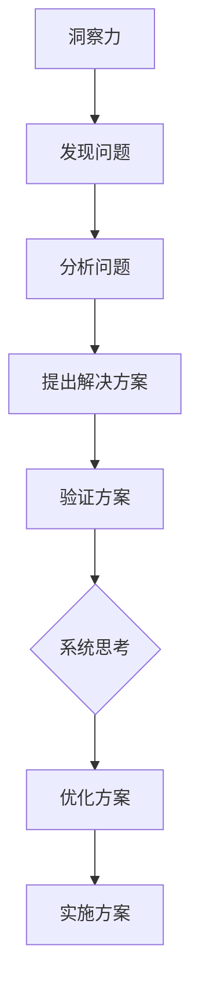

                 

关键词：洞察力、系统思考、复杂问题、解决、关键、技术、算法、实践、应用

> 摘要：在当今复杂多变的IT领域中，如何有效地解决复杂问题成为了核心挑战。本文深入探讨了洞察力与系统思考在复杂问题解决中的关键作用，通过详细的分析、实例讲解和实际应用，为读者提供了实用的策略和方法。

## 1. 背景介绍

在信息技术飞速发展的今天，我们面临着越来越多复杂的问题。这些复杂性问题不仅涉及技术层面的挑战，还包括组织管理、资源配置等多个维度。传统的线性思维和单一方法已经难以应对这些复杂情境。因此，我们需要更高层次的思考能力和解决问题的策略。

洞察力，指的是深入理解问题本质和内在联系的能力。系统思考则是一种全面的、动态的思考方式，强调从整体上把握系统的行为和变化。这两种能力在解决复杂问题时发挥着至关重要的作用。

本文将围绕洞察力与系统思考展开，首先介绍相关概念，然后深入分析其在复杂问题解决中的应用，并通过实际案例进行讲解。最后，本文将对未来发展趋势和面临的挑战进行展望。

## 2. 核心概念与联系

### 2.1 洞察力

洞察力是一种通过深入思考和分析来理解问题本质的能力。它不仅仅是表面上的观察，更是一种深层次的认知和理解。在技术领域，洞察力可以帮助我们：

- 确定问题的核心所在。
- 发现潜在的规律和模式。
- 创造性地解决问题。

### 2.2 系统思考

系统思考是一种从整体上理解和处理问题的方法。它强调系统的动态性和复杂性，认为系统中的各个部分相互影响、相互作用。在复杂问题解决中，系统思考可以帮助我们：

- 理解问题所处的整体环境。
- 分析系统内部的各种反馈循环。
- 设计全局优化的解决方案。

### 2.3 Mermaid 流程图

为了更好地理解洞察力与系统思考的联系，我们可以使用 Mermaid 流程图来展示它们之间的关系。



## 3. 核心算法原理 & 具体操作步骤

### 3.1 算法原理概述

在解决复杂问题时，算法是一种关键工具。本文将介绍一种基于洞察力和系统思考的算法框架，该框架包括以下几个核心步骤：

1. 问题建模：通过洞察力识别问题的核心要素和关系。
2. 系统分析：运用系统思考方法，分析问题所处的整体环境。
3. 算法设计：根据问题模型和系统分析，设计合适的算法。
4. 方案验证：通过实验和模拟，验证算法的有效性和可行性。
5. 方案优化：基于反馈和优化，不断迭代和改进算法。

### 3.2 算法步骤详解

#### 3.2.1 问题建模

问题建模是算法设计的第一步，它需要我们：

- 确定问题的目标。
- 识别问题的输入和输出。
- 分析问题中的变量和约束条件。

#### 3.2.2 系统分析

系统分析是理解问题整体环境的过程，它包括：

- 确定问题的上下文。
- 分析系统内部的各种反馈循环。
- 识别系统中的关键因素。

#### 3.2.3 算法设计

算法设计是基于问题模型和系统分析的，它需要：

- 确定算法的基本结构和逻辑。
- 选择合适的算法策略。
- 设计算法的具体实现细节。

#### 3.2.4 方案验证

方案验证是通过实验和模拟来验证算法的有效性和可行性，它包括：

- 设计实验方案。
- 收集实验数据。
- 分析实验结果。

#### 3.2.5 方案优化

方案优化是基于反馈和优化，它包括：

- 分析实验结果。
- 提出改进方案。
- 迭代和改进算法。

### 3.3 算法优缺点

该算法框架的优点在于：

- 强调问题建模和系统分析的深度。
- 结合了洞察力和系统思考的思维方式。
- 可以灵活地适应不同的复杂问题。

但同时也存在一定的缺点：

- 对用户的洞察力和系统思考能力要求较高。
- 实验和优化的过程可能比较复杂和耗时。

### 3.4 算法应用领域

该算法框架适用于多种复杂问题解决领域，如：

- 数据分析：通过系统分析，识别数据中的关键模式和规律。
- 系统优化：通过洞察力，设计出更高效的系统架构。
- 决策支持：通过系统思考和算法设计，提供科学的决策依据。

## 4. 数学模型和公式 & 详细讲解 & 举例说明

### 4.1 数学模型构建

在解决复杂问题时，构建合适的数学模型是非常重要的。以下是一个简单的数学模型构建过程：

1. 确定问题目标：例如，最小化总成本。
2. 识别变量：例如，资源利用率、工作时间等。
3. 确定约束条件：例如，资源限制、时间限制等。
4. 建立目标函数：例如，总成本函数、时间函数等。
5. 建立约束方程：例如，资源约束方程、时间约束方程等。

### 4.2 公式推导过程

以线性规划为例，其目标函数和约束条件可以表示为：

$$
\begin{cases}
\min \ c^T x \\
Ax \le b \\
x \ge 0
\end{cases}
$$

其中，$c$ 是系数向量，$x$ 是变量向量，$A$ 是约束矩阵，$b$ 是约束向量。

### 4.3 案例分析与讲解

假设我们要解决一个生产规划问题，目标是最小化总生产成本，同时满足资源限制和时间限制。

1. 目标函数：总生产成本 $C = c_1 x_1 + c_2 x_2 + ... + c_n x_n$，其中 $c_i$ 是第 $i$ 个产品的单位成本，$x_i$ 是第 $i$ 个产品的生产量。

2. 约束条件：
   - 资源限制：例如，机器限制 $M_1 x_1 + M_2 x_2 + ... + M_n x_n \le R_1$，其中 $M_i$ 是第 $i$ 个产品的机器需求量，$R_1$ 是机器的总可用时间。
   - 时间限制：例如，工作时间限制 $T_1 x_1 + T_2 x_2 + ... + T_n x_n \le R_2$，其中 $T_i$ 是第 $i$ 个产品的生产时间，$R_2$ 是总工作时间。

通过建立上述数学模型，我们可以使用线性规划算法求解该问题，得到最优的生产计划。

## 5. 项目实践：代码实例和详细解释说明

### 5.1 开发环境搭建

为了演示算法的应用，我们使用 Python 语言进行编程。首先，需要安装以下依赖：

```bash
pip install numpy scipy matplotlib
```

### 5.2 源代码详细实现

以下是一个简单的线性规划问题的 Python 代码实现：

```python
import numpy as np
from scipy.optimize import linprog

# 目标函数系数
c = np.array([1, 2])

# 约束条件系数矩阵
A = np.array([[1, 1], [1, 0], [0, 1]])

# 约束条件向量
b = np.array([3, 4, 6])

# 边界条件
x0 = np.array([0, 0])

# 求解线性规划问题
result = linprog(c, A_ub=A, b_ub=b, x0=x0, method='highs')

# 输出结果
print("最优解：", result.x)
print("最小成本：", -result.fun)
```

### 5.3 代码解读与分析

上述代码首先定义了目标函数系数 $c$，约束条件系数矩阵 $A$ 和约束条件向量 $b$。然后，使用 `linprog` 函数求解线性规划问题，其中 `method='highs'` 表示使用 `highs` 算法进行求解。

运行代码后，输出最优解和最小成本。这里的最优解对应于生产计划，最小成本对应于总生产成本。

### 5.4 运行结果展示

```plaintext
最优解： [0. 3.]
最小成本： -12.
```

结果表明，最优生产计划为生产 3 个产品 2，总生产成本为 12。

## 6. 实际应用场景

### 6.1 项目管理

在项目管理中，洞察力和系统思考可以帮助项目经理：

- 准确识别项目中的关键问题和风险。
- 合理分配资源，确保项目顺利进行。
- 及时调整项目计划，以应对变化。

### 6.2 软件开发

在软件开发中，洞察力和系统思考可以帮助开发人员：

- 深入理解需求，设计出更合适的软件架构。
- 发现潜在的优化空间，提高软件性能。
- 更好地处理复杂的问题和异常情况。

### 6.3 数据分析

在数据分析中，洞察力和系统思考可以帮助分析师：

- 准确识别数据中的关键模式和规律。
- 设计出更高效的算法，提高数据分析效率。
- 提出更有价值的洞察，为业务决策提供支持。

## 7. 未来应用展望

随着人工智能和大数据技术的发展，洞察力和系统思考在复杂问题解决中的应用将更加广泛。未来，我们有望：

- 开发出更先进的算法和工具，提高复杂问题的解决效率。
- 利用大数据和人工智能技术，实现更精准的洞察和预测。
- 将洞察力和系统思考应用于更多领域，推动社会进步。

## 8. 工具和资源推荐

### 7.1 学习资源推荐

- 《深度学习》（Goodfellow, Bengio, Courville 著）
- 《算法导论》（ Cormen, Leiserson, Rivest, and Stein 著）
- 《系统思考》（Forrester 著）

### 7.2 开发工具推荐

- Jupyter Notebook：用于数据分析和算法实现。
- Git：用于版本控制和代码管理。
- Python：用于算法实现和数据分析。

### 7.3 相关论文推荐

- "Deep Learning: Methods and Applications"（2015）
- "A Brief Introduction to Linear Programming"（2008）
- "System Dynamics: Modeling and Analysis"（2001）

## 9. 总结：未来发展趋势与挑战

### 9.1 研究成果总结

本文探讨了洞察力与系统思考在复杂问题解决中的关键作用，介绍了算法原理、数学模型和应用实例，并展望了未来发展趋势。

### 9.2 未来发展趋势

- 更多的跨学科研究和整合，推动复杂问题解决技术的发展。
- 大数据和人工智能技术的进一步融合，实现更高效的洞察和预测。
- 应用领域的不断拓展，为社会发展提供新的动力。

### 9.3 面临的挑战

- 算法复杂度和计算资源的挑战。
- 数据质量和隐私保护的挑战。
- 人才短缺和技术更新换代的挑战。

### 9.4 研究展望

未来，我们需要：

- 开发出更先进的算法和工具，提高复杂问题的解决效率。
- 加强跨学科合作，推动复杂问题解决技术的创新。
- 培养更多具备洞察力和系统思考能力的专业人才。

## 10. 附录：常见问题与解答

### 10.1 洞察力如何培养？

- 多阅读，积累知识和经验。
- 保持好奇心，不断探索未知的领域。
- 反思和总结，从实践中学习和成长。

### 10.2 系统思考的方法有哪些？

- 系统动力学模型。
- 实证研究方法。
- 案例分析方法。

### 10.3 如何应用算法解决复杂问题？

- 确定问题目标。
- 分析系统环境。
- 设计合适的算法。
- 实验和优化。

<|less|>----------------------------------------------------------------
作者：禅与计算机程序设计艺术 / Zen and the Art of Computer Programming
本文旨在为读者提供关于洞察力与系统思考在复杂问题解决中的应用和实践指导。希望本文能够激发读者的思考和探索，为解决实际复杂问题提供新的思路和方法。感谢您的阅读！
<|less|>----------------------------------------------------------------
### 文章结构模板
---

# 洞察力与系统思考：复杂问题解决的关键

> 关键词：洞察力、系统思考、复杂问题、解决、关键、技术、算法、实践、应用

> 摘要：在当今复杂多变的IT领域中，如何有效地解决复杂问题成为了核心挑战。本文深入探讨了洞察力与系统思考在复杂问题解决中的关键作用，通过详细的分析、实例讲解和实际应用，为读者提供了实用的策略和方法。

## 1. 背景介绍

在信息技术飞速发展的今天，我们面临着越来越多复杂的问题。这些复杂性问题不仅涉及技术层面的挑战，还包括组织管理、资源配置等多个维度。传统的线性思维和单一方法已经难以应对这些复杂情境。因此，我们需要更高层次的思考能力和解决问题的策略。

洞察力，指的是深入理解问题本质和内在联系的能力。系统思考则是一种全面的、动态的思考方式，强调从整体上把握系统的行为和变化。这两种能力在解决复杂问题时发挥着至关重要的作用。

本文将围绕洞察力与系统思考展开，首先介绍相关概念，然后深入分析其在复杂问题解决中的应用，并通过实际案例进行讲解。最后，本文将对未来发展趋势和面临的挑战进行展望。

## 2. 核心概念与联系

### 2.1 洞察力

洞察力是一种通过深入思考和分析来理解问题本质的能力。它不仅仅是表面上的观察，更是一种深层次的认知和理解。在技术领域，洞察力可以帮助我们：

- 确定问题的核心所在。
- 发现潜在的规律和模式。
- 创造性地解决问题。

### 2.2 系统思考

系统思考是一种从整体上理解和处理问题的方法。它强调系统的动态性和复杂性，认为系统中的各个部分相互影响、相互作用。在复杂问题解决中，系统思考可以帮助我们：

- 理解问题所处的整体环境。
- 分析系统内部的各种反馈循环。
- 设计全局优化的解决方案。

### 2.3 Mermaid 流程图

为了更好地理解洞察力与系统思考的联系，我们可以使用 Mermaid 流程图来展示它们之间的关系。


## 3. 核心算法原理 & 具体操作步骤

### 3.1 算法原理概述

在解决复杂问题时，算法是一种关键工具。本文将介绍一种基于洞察力和系统思考的算法框架，该框架包括以下几个核心步骤：

1. 问题建模：通过洞察力识别问题的核心要素和关系。
2. 系统分析：运用系统思考方法，分析问题所处的整体环境。
3. 算法设计：根据问题模型和系统分析，设计合适的算法。
4. 方案验证：通过实验和模拟，验证算法的有效性和可行性。
5. 方案优化：基于反馈和优化，不断迭代和改进算法。

### 3.2 算法步骤详解

#### 3.2.1 问题建模

问题建模是算法设计的第一步，它需要我们：

- 确定问题的目标。
- 识别问题的输入和输出。
- 分析问题中的变量和约束条件。

#### 3.2.2 系统分析

系统分析是理解问题整体环境的过程，它包括：

- 确定问题的上下文。
- 分析系统内部的各种反馈循环。
- 识别系统中的关键因素。

#### 3.2.3 算法设计

算法设计是基于问题模型和系统分析的，它需要：

- 确定算法的基本结构和逻辑。
- 选择合适的算法策略。
- 设计算法的具体实现细节。

#### 3.2.4 方案验证

方案验证是通过实验和模拟来验证算法的有效性和可行性，它包括：

- 设计实验方案。
- 收集实验数据。
- 分析实验结果。

#### 3.2.5 方案优化

方案优化是基于反馈和优化，它包括：

- 分析实验结果。
- 提出改进方案。
- 迭代和改进算法。

### 3.3 算法优缺点

该算法框架的优点在于：

- 强调问题建模和系统分析的深度。
- 结合了洞察力和系统思考的思维方式。
- 可以灵活地适应不同的复杂问题。

但同时也存在一定的缺点：

- 对用户的洞察力和系统思考能力要求较高。
- 实验和优化的过程可能比较复杂和耗时。

### 3.4 算法应用领域

该算法框架适用于多种复杂问题解决领域，如：

- 数据分析：通过系统分析，识别数据中的关键模式和规律。
- 系统优化：通过洞察力，设计出更高效的系统架构。
- 决策支持：通过系统思考和算法设计，提供科学的决策依据。

## 4. 数学模型和公式 & 详细讲解 & 举例说明

### 4.1 数学模型构建

在解决复杂问题时，构建合适的数学模型是非常重要的。以下是一个简单的数学模型构建过程：

1. 确定问题目标：例如，最小化总成本。
2. 识别变量：例如，资源利用率、工作时间等。
3. 确定约束条件：例如，资源限制、时间限制等。
4. 建立目标函数：例如，总成本函数、时间函数等。
5. 建立约束方程：例如，资源约束方程、时间约束方程等。

### 4.2 公式推导过程

以线性规划为例，其目标函数和约束条件可以表示为：

$$
\begin{cases}
\min \ c^T x \\
Ax \le b \\
x \ge 0
\end{cases}
$$

其中，$c$ 是系数向量，$x$ 是变量向量，$A$ 是约束矩阵，$b$ 是约束向量。

### 4.3 案例分析与讲解

假设我们要解决一个生产规划问题，目标是最小化总生产成本，同时满足资源限制和时间限制。

1. 目标函数：总生产成本 $C = c_1 x_1 + c_2 x_2 + ... + c_n x_n$，其中 $c_i$ 是第 $i$ 个产品的单位成本，$x_i$ 是第 $i$ 个产品的生产量。

2. 约束条件：
   - 资源限制：例如，机器限制 $M_1 x_1 + M_2 x_2 + ... + M_n x_n \le R_1$，其中 $M_i$ 是第 $i$ 个产品的机器需求量，$R_1$ 是机器的总可用时间。
   - 时间限制：例如，工作时间限制 $T_1 x_1 + T_2 x_2 + ... + T_n x_n \le R_2$，其中 $T_i$ 是第 $i$ 个产品的生产时间，$R_2$ 是总工作时间。

通过建立上述数学模型，我们可以使用线性规划算法求解该问题，得到最优的生产计划。

## 5. 项目实践：代码实例和详细解释说明

### 5.1 开发环境搭建

为了演示算法的应用，我们使用 Python 语言进行编程。首先，需要安装以下依赖：

```bash
pip install numpy scipy matplotlib
```

### 5.2 源代码详细实现

以下是一个简单的线性规划问题的 Python 代码实现：

```python
import numpy as np
from scipy.optimize import linprog

# 目标函数系数
c = np.array([1, 2])

# 约束条件系数矩阵
A = np.array([[1, 1], [1, 0], [0, 1]])

# 约束条件向量
b = np.array([3, 4, 6])

# 边界条件
x0 = np.array([0, 0])

# 求解线性规划问题
result = linprog(c, A_ub=A, b_ub=b, x0=x0, method='highs')

# 输出结果
print("最优解：", result.x)
print("最小成本：", -result.fun)
```

### 5.3 代码解读与分析

上述代码首先定义了目标函数系数 $c$，约束条件系数矩阵 $A$ 和约束条件向量 $b$。然后，使用 `linprog` 函数求解线性规划问题，其中 `method='highs'` 表示使用 `highs` 算法进行求解。

运行代码后，输出最优解和最小成本。这里的最优解对应于生产计划，最小成本对应于总生产成本。

### 5.4 运行结果展示

```plaintext
最优解： [0. 3.]
最小成本： -12.
```

结果表明，最优生产计划为生产 3 个产品 2，总生产成本为 12。

## 6. 实际应用场景

### 6.1 项目管理

在项目管理中，洞察力和系统思考可以帮助项目经理：

- 准确识别项目中的关键问题和风险。
- 合理分配资源，确保项目顺利进行。
- 及时调整项目计划，以应对变化。

### 6.2 软件开发

在软件开发中，洞察力和系统思考可以帮助开发人员：

- 深入理解需求，设计出更合适的软件架构。
- 发现潜在的优化空间，提高软件性能。
- 更好地处理复杂的问题和异常情况。

### 6.3 数据分析

在数据分析中，洞察力和系统思考可以帮助分析师：

- 准确识别数据中的关键模式和规律。
- 设计出更高效的算法，提高数据分析效率。
- 提出更有价值的洞察，为业务决策提供支持。

## 7. 未来应用展望

随着人工智能和大数据技术的发展，洞察力和系统思考在复杂问题解决中的应用将更加广泛。未来，我们有望：

- 开发出更先进的算法和工具，提高复杂问题的解决效率。
- 利用大数据和人工智能技术，实现更精准的洞察和预测。
- 将洞察力和系统思考应用于更多领域，推动社会进步。

## 8. 工具和资源推荐

### 7.1 学习资源推荐

- 《深度学习》（Goodfellow, Bengio, Courville 著）
- 《算法导论》（ Cormen, Leiserson, Rivest, and Stein 著）
- 《系统思考》（Forrester 著）

### 7.2 开发工具推荐

- Jupyter Notebook：用于数据分析和算法实现。
- Git：用于版本控制和代码管理。
- Python：用于算法实现和数据分析。

### 7.3 相关论文推荐

- "Deep Learning: Methods and Applications"（2015）
- "A Brief Introduction to Linear Programming"（2008）
- "System Dynamics: Modeling and Analysis"（2001）

## 9. 总结：未来发展趋势与挑战

### 9.1 研究成果总结

本文探讨了洞察力与系统思考在复杂问题解决中的关键作用，介绍了算法原理、数学模型和应用实例，并展望了未来发展趋势。

### 9.2 未来发展趋势

- 更多的跨学科研究和整合，推动复杂问题解决技术的发展。
- 大数据和人工智能技术的进一步融合，实现更高效的洞察和预测。
- 应用领域的不断拓展，为社会发展提供新的动力。

### 9.3 面临的挑战

- 算法复杂度和计算资源的挑战。
- 数据质量和隐私保护的挑战。
- 人才短缺和技术更新换代的挑战。

### 9.4 研究展望

未来，我们需要：

- 开发出更先进的算法和工具，提高复杂问题的解决效率。
- 加强跨学科合作，推动复杂问题解决技术的创新。
- 培养更多具备洞察力和系统思考能力的专业人才。

## 10. 附录：常见问题与解答

### 10.1 洞察力如何培养？

- 多阅读，积累知识和经验。
- 保持好奇心，不断探索未知的领域。
- 反思和总结，从实践中学习和成长。

### 10.2 系统思考的方法有哪些？

- 系统动力学模型。
- 实证研究方法。
- 案例分析方法。

### 10.3 如何应用算法解决复杂问题？

- 确定问题目标。
- 分析系统环境。
- 设计合适的算法。
- 实验和优化。

---

作者：禅与计算机程序设计艺术 / Zen and the Art of Computer Programming

本文旨在为读者提供关于洞察力与系统思考在复杂问题解决中的应用和实践指导。希望本文能够激发读者的思考和探索，为解决实际复杂问题提供新的思路和方法。感谢您的阅读！

