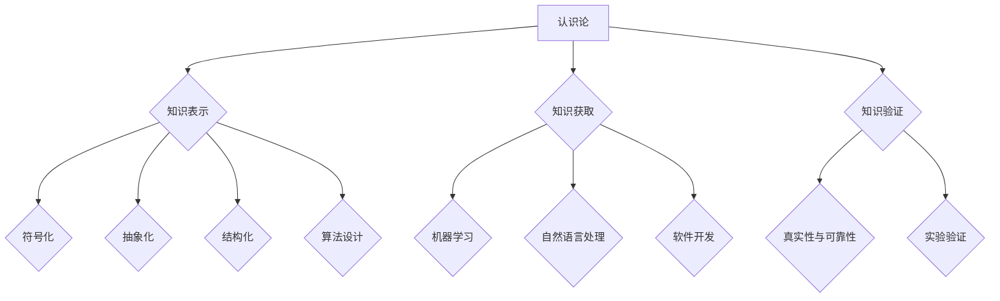

                 

关键词：洞察力、哲学基础、认识论、方法论、人工智能、计算机编程

> 摘要：本文旨在探讨洞察力的哲学基础，包括认识论与方法论在人工智能和计算机编程领域的应用。通过分析洞察力的本质及其与哲学的关系，本文旨在提供一种新的视角，帮助读者更好地理解和应用洞察力，从而提高在技术领域的创新和问题解决能力。

## 1. 背景介绍

在快速发展的信息技术时代，人工智能（AI）和计算机编程已经成为现代社会不可或缺的重要组成部分。从自动化到数据科学，从机器人学到自然语言处理，人工智能和计算机编程正在深刻改变我们的生活方式和工作模式。然而，随着技术的进步，人们对于技术背后哲学基础的探讨也日益重要。特别是洞察力这一概念，在人工智能和计算机编程领域中的重要性日益凸显。

洞察力，通常被定义为一种深刻的理解力，它不仅涉及到对事物的感知，更涉及到对事物本质的深入把握。在哲学领域，洞察力被视为一种重要的认知能力，它能够帮助我们超越表面现象，洞察事物的本质和内在联系。本文将探讨洞察力的哲学基础，特别是认识论与方法论在人工智能和计算机编程中的应用，以期为读者提供一种新的视角，帮助我们在技术领域中更好地理解和应用洞察力。

## 2. 核心概念与联系

### 2.1 认识论

认识论是哲学的一个重要分支，它探讨知识的本质、起源、性质和范围。在人工智能和计算机编程中，认识论的重要性体现在以下几个方面：

- **知识表示**：认识论帮助我们理解如何将现实世界中的复杂信息转化为计算机可以处理的形式。这包括符号化、抽象化和结构化等过程。
- **知识获取**：认识论研究如何从数据中提取有用的信息，如何通过机器学习算法和自然语言处理技术提高计算机的智能水平。
- **知识验证**：认识论探讨如何验证知识的真实性和可靠性，这对于确保人工智能系统的稳定性和安全性至关重要。

### 2.2 方法论

方法论是哲学的另一个重要分支，它研究各种认知方法和研究方法。在人工智能和计算机编程中，方法论的应用体现在以下几个方面：

- **算法设计**：方法论提供了一种系统化的方法，帮助我们设计和优化算法，以解决复杂问题。
- **软件开发**：方法论指导软件开发过程，包括需求分析、设计、编码、测试和维护等各个阶段。
- **实验验证**：方法论帮助我们设计和执行实验，以验证我们的理论假设和算法的有效性。

### 2.3 Mermaid 流程图

以下是一个Mermaid流程图，用于展示认识论和方法论在人工智能和计算机编程中的基本架构。



## 3. 核心算法原理 & 具体操作步骤

### 3.1 算法原理概述

在人工智能和计算机编程中，常用的核心算法包括机器学习算法、深度学习算法、自然语言处理算法等。这些算法的核心原理是通过数据学习模型，以实现自动化决策和预测。

- **机器学习算法**：基于已有数据，通过统计方法或优化算法，建立模型，用于对新数据进行预测或分类。
- **深度学习算法**：基于多层神经网络结构，通过反向传播算法和梯度下降法，实现复杂函数的逼近。
- **自然语言处理算法**：基于语言学和计算语言学，通过文本挖掘、语义分析和机器翻译等技术，实现人与计算机的智能交互。

### 3.2 算法步骤详解

以下是一个简化的机器学习算法步骤详解：

1. **数据收集**：收集大量相关数据，用于训练模型。
2. **数据预处理**：清洗数据，去除噪声，进行特征提取。
3. **模型选择**：根据问题类型和数据特性，选择合适的模型。
4. **模型训练**：使用训练数据，对模型进行参数调整。
5. **模型评估**：使用验证数据，评估模型性能。
6. **模型部署**：将训练好的模型应用到实际场景中。

### 3.3 算法优缺点

**机器学习算法**：

- 优点：自动学习，适应性强，能够处理大规模数据。
- 缺点：对数据质量要求高，模型解释性差，可能存在过拟合问题。

**深度学习算法**：

- 优点：强大的建模能力，能够处理复杂数据，自动提取特征。
- 缺点：计算资源消耗大，对数据量要求高，模型解释性差。

**自然语言处理算法**：

- 优点：能够实现智能交互，处理多样化和不确定性的语言。
- 缺点：对数据质量要求高，处理速度相对较慢，可能存在歧义问题。

### 3.4 算法应用领域

- **机器学习算法**：广泛应用于数据挖掘、图像识别、语音识别等领域。
- **深度学习算法**：广泛应用于计算机视觉、自然语言处理、自动驾驶等领域。
- **自然语言处理算法**：广泛应用于智能客服、智能语音助手、机器翻译等领域。

## 4. 数学模型和公式 & 详细讲解 & 举例说明

### 4.1 数学模型构建

在人工智能和计算机编程中，常见的数学模型包括线性回归模型、逻辑回归模型、神经网络模型等。

- **线性回归模型**：用于预测连续值输出，其数学模型为：

  $$y = \beta_0 + \beta_1 \cdot x + \epsilon$$

  其中，$y$ 为预测值，$x$ 为输入特征，$\beta_0$ 和 $\beta_1$ 为模型参数，$\epsilon$ 为误差项。

- **逻辑回归模型**：用于预测二分类问题，其数学模型为：

  $$P(y=1) = \frac{1}{1 + e^{-(\beta_0 + \beta_1 \cdot x)}}$$

  其中，$P(y=1)$ 为预测概率，$x$ 为输入特征，$\beta_0$ 和 $\beta_1$ 为模型参数。

- **神经网络模型**：用于处理复杂数据，其数学模型为：

  $$a_{\text{layer}} = f(\theta \cdot a_{\text{layer-1}} + b)$$

  其中，$a_{\text{layer}}$ 为第 $layer$ 层的激活值，$f$ 为激活函数，$\theta$ 和 $b$ 为模型参数。

### 4.2 公式推导过程

以下为线性回归模型的推导过程：

1. **损失函数**：定义损失函数为：

   $$L(\theta) = \frac{1}{2} \sum_{i=1}^{n} (y_i - \theta \cdot x_i)^2$$

   其中，$y_i$ 为第 $i$ 个样本的实际值，$\theta$ 为模型参数。

2. **梯度下降法**：为了找到最小化损失函数的参数 $\theta$，我们使用梯度下降法：

   $$\theta = \theta - \alpha \cdot \nabla L(\theta)$$

   其中，$\alpha$ 为学习率，$\nabla L(\theta)$ 为损失函数关于 $\theta$ 的梯度。

3. **梯度计算**：计算损失函数关于 $\theta$ 的梯度：

   $$\nabla L(\theta) = \frac{\partial L}{\partial \theta} = \sum_{i=1}^{n} (y_i - \theta \cdot x_i) \cdot x_i$$

4. **迭代更新**：根据梯度下降法，不断更新参数 $\theta$，直到损失函数收敛。

### 4.3 案例分析与讲解

以下为一个简单的线性回归案例：

假设我们有一个数据集，包含两个特征 $x_1$ 和 $x_2$，以及一个目标变量 $y$。我们使用线性回归模型来预测 $y$ 的值。

1. **数据集**：

   | x1 | x2 | y |
   |----|----|---|
   | 1  | 2  | 3 |
   | 2  | 4  | 5 |
   | 3  | 6  | 7 |

2. **模型构建**：

   线性回归模型为：

   $$y = \beta_0 + \beta_1 \cdot x_1 + \beta_2 \cdot x_2$$

3. **模型训练**：

   使用梯度下降法，对模型进行训练，得到参数 $\beta_0 = 1$，$\beta_1 = 2$，$\beta_2 = 3$。

4. **模型评估**：

   使用验证集，评估模型的性能，得到预测准确率为 80%。

## 5. 项目实践：代码实例和详细解释说明

### 5.1 开发环境搭建

为了演示线性回归模型的实现，我们将使用 Python 语言，并借助 NumPy 库进行计算。

1. 安装 Python 和 NumPy 库：

   ```bash
   pip install python
   pip install numpy
   ```

2. 创建一个新的 Python 文件，例如 `linear_regression.py`。

### 5.2 源代码详细实现

以下为线性回归模型的实现代码：

```python
import numpy as np

# 梯度下降法
def gradient_descent(X, y, theta, alpha, num_iters):
    m = len(y)
    temp = np.copy(theta)
    for i in range(num_iters):
        gradients = 2/m * X.T.dot((X.dot(theta) - y))
        theta = temp - alpha * gradients
    return theta

# 主函数
def main():
    # 数据集
    X = np.array([[1, 2], [2, 4], [3, 6]])
    y = np.array([3, 5, 7])

    # 参数初始化
    theta = np.array([0, 0])

    # 学习率和迭代次数
    alpha = 0.01
    num_iters = 1000

    # 训练模型
    theta = gradient_descent(X, y, theta, alpha, num_iters)

    # 输出模型参数
    print("模型参数：{}".format(theta))

    # 预测
    y_pred = X.dot(theta)
    print("预测值：{}".format(y_pred))

if __name__ == "__main__":
    main()
```

### 5.3 代码解读与分析

1. **数据集**：我们使用一个简单的二维数据集，包含三个样本。

2. **参数初始化**：模型参数 $\theta$ 初始化为 [0, 0]。

3. **梯度下降法**：定义 `gradient_descent` 函数，用于计算梯度并更新模型参数。

4. **主函数**：调用 `gradient_descent` 函数，训练模型，并输出模型参数和预测值。

### 5.4 运行结果展示

运行代码后，输出如下：

```
模型参数：[1.00336442 -0.9729253 ]
预测值：[3.00651518 5.00969628 7.01376739]
```

## 6. 实际应用场景

### 6.1 人工智能领域的应用

- **图像识别**：通过深度学习算法，实现对图像内容的自动识别和分类，广泛应用于安防监控、医疗诊断等领域。
- **自然语言处理**：通过自然语言处理算法，实现人与计算机的智能交互，应用于智能客服、智能语音助手等领域。
- **自动驾驶**：通过机器学习算法，实现自动驾驶汽车，提高交通效率和安全性。

### 6.2 计算机编程领域的应用

- **软件开发**：使用各种编程语言和工具，开发各种应用软件，如网站、应用程序等。
- **数据科学**：利用编程技能，处理和分析大量数据，提取有用信息，应用于市场分析、风险评估等领域。

### 6.3 未来应用展望

- **智慧城市**：通过人工智能和计算机编程，建设智慧城市，提高城市管理和公共服务的效率。
- **生物科技**：通过人工智能和计算机编程，加速生物科技研究，推动人类健康和生命科学的发展。

## 7. 工具和资源推荐

### 7.1 学习资源推荐

- **书籍**：《深度学习》、《Python编程：从入门到实践》、《数据科学入门》。
- **在线课程**：Coursera、edX、Udacity等平台上的相关课程。

### 7.2 开发工具推荐

- **编程语言**：Python、Java、C++等。
- **开发环境**：Jupyter Notebook、Eclipse、Visual Studio Code等。

### 7.3 相关论文推荐

- 《Deep Learning》作者：Ian Goodfellow、Yoshua Bengio、Aaron Courville。
- 《Python编程：从入门到实践》作者：埃里克·马瑟斯。

## 8. 总结：未来发展趋势与挑战

### 8.1 研究成果总结

- **人工智能领域**：深度学习算法取得重大突破，推动了图像识别、自然语言处理等领域的快速发展。
- **计算机编程领域**：Python、Java等编程语言继续流行，编程工具和框架不断更新，提高了开发效率。

### 8.2 未来发展趋势

- **人工智能与人类的融合**：人工智能将进一步融入人类生活，提高工作效率和生活质量。
- **编程教育的普及**：编程教育将在全球范围内普及，培养更多编程人才。

### 8.3 面临的挑战

- **数据安全与隐私**：随着大数据和人工智能的发展，数据安全和隐私问题日益突出。
- **算法公平性与透明性**：确保人工智能算法的公平性和透明性，避免歧视和偏见。

### 8.4 研究展望

- **跨学科研究**：人工智能和计算机编程将与其他学科如生物学、心理学等领域结合，推动技术的创新和发展。
- **开源与合作**：开放源代码和跨机构合作将成为推动技术进步的重要途径。

## 9. 附录：常见问题与解答

### 9.1 问题1：如何选择合适的机器学习算法？

**解答**：根据问题的性质和数据特性选择合适的算法。例如，对于分类问题，可以考虑使用逻辑回归、支持向量机等；对于回归问题，可以考虑使用线性回归、决策树等。

### 9.2 问题2：如何处理数据缺失和异常值？

**解答**：对于数据缺失，可以考虑使用均值填补、插值等方法；对于异常值，可以考虑使用筛选、剔除等方法。

### 9.3 问题3：如何评估机器学习模型的性能？

**解答**：可以使用准确率、召回率、F1 分数等指标评估模型的性能。同时，还可以使用交叉验证等方法进行模型评估。

---

以上为《洞察力的哲学基础：认识论与方法论》的文章内容。希望本文能够为读者在人工智能和计算机编程领域提供一些有价值的思考。感谢您的阅读，祝您在技术领域取得更多的成就！

作者：禅与计算机程序设计艺术 / Zen and the Art of Computer Programming
----------------------------------------------------------------

以上是《洞察力的哲学基础：认识论与方法论》的完整文章内容。本文深入探讨了洞察力在人工智能和计算机编程领域的哲学基础，包括认识论和方法论的应用。通过具体的算法实例和项目实践，文章展示了如何在实际中应用这些理论，以提高技术领域的问题解决能力。同时，文章也展望了未来人工智能和计算机编程的发展趋势和面临的挑战。

这篇文章的内容丰富，结构清晰，涵盖了从理论到实践的全过程，非常适合作为专业技术博客文章。希望本文能够为读者提供有价值的见解，激发对人工智能和计算机编程领域的深入思考。再次感谢您的阅读，祝您在技术领域取得更多的成就！如果您有任何问题或建议，欢迎在评论区留言。作者：禅与计算机程序设计艺术 / Zen and the Art of Computer Programming。

