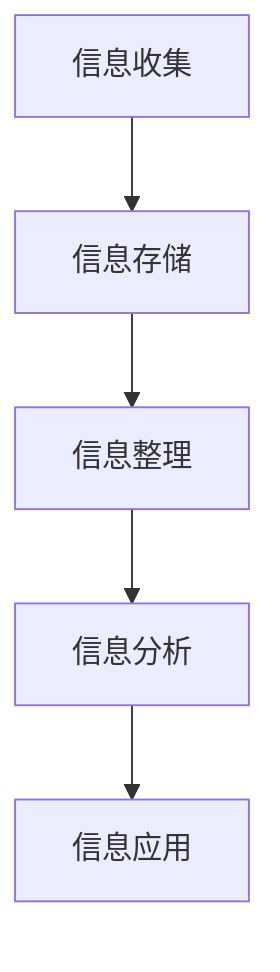

                 

关键词：洞察力、信息提炼、数据处理、算法、人工智能、技术发展

> 摘要：本文旨在探讨在信息化时代，如何通过培养洞察力，从海量信息中提炼出有价值的内容。通过分析信息过载现象及其影响，介绍几种有效的信息处理方法和工具，并结合实际案例，阐述如何运用这些方法和工具提高个人的洞察力，从而更好地应对复杂的信息环境。

## 1. 背景介绍

随着互联网的普及和大数据技术的发展，信息爆炸已经成为现代社会的一个显著特征。根据统计，全球每天产生的数据量达到了惊人的比例，而其中绝大多数都是非结构化或半结构化的数据。面对如此庞大的信息量，人们感到信息过载，难以从中筛选出有价值的信息。这种情况下，培养洞察力成为了解决信息过载问题的重要手段。

洞察力是指人们从大量信息中提取出关键信息，理解其背后的本质和规律的能力。在信息时代，拥有较强的洞察力意味着能够更高效地处理信息，做出明智的决策，并从复杂的信息中看到新的机遇和趋势。因此，如何培养洞察力，从海量信息中提炼精华，成为了当今信息社会的一项重要课题。

## 2. 核心概念与联系

### 2.1 信息处理流程

在讨论洞察力的培养之前，我们先了解信息处理的基本流程。信息处理通常包括以下几个步骤：收集、存储、整理、分析和应用。以下是一个用 Mermaid 表示的信息处理流程图：



### 2.2 洞察力的核心要素

培养洞察力需要以下几个核心要素：

- **广度与深度**：广度指对信息的广泛了解，深度则是对信息的深入挖掘。两者相辅相成，缺一不可。
- **批判性思维**：批判性思维是指对信息进行质疑和评估的能力，避免盲目接受信息。
- **好奇心**：好奇心是推动人们探索未知、追求真理的动力。
- **分析能力**：分析能力是指对信息进行逻辑分析和推理的能力。

### 2.3 洞察力与人工智能

随着人工智能技术的发展，人工智能系统在处理海量信息方面展现了强大的能力。但人工智能缺乏人类的洞察力，因为它无法理解信息的背景、含义和情感。因此，培养人类洞察力依然是当前和未来的一项重要任务。

## 3. 核心算法原理 & 具体操作步骤

### 3.1 算法原理概述

在信息处理过程中，常用的算法包括筛选算法、聚类算法、分类算法等。以下是一个简单的筛选算法原理概述：

1. **初始化**：设置筛选标准。
2. **遍历**：对每条信息进行判断，是否符合筛选标准。
3. **筛选**：将符合标准的信息筛选出来。
4. **输出**：返回筛选结果。

### 3.2 算法步骤详解

以一个简单的文本筛选算法为例，具体步骤如下：

1. **初始化筛选标准**：例如，筛选包含特定关键词的文本。
2. **遍历文本**：逐条读取文本。
3. **判断是否包含关键词**：使用字符串匹配算法（如正则表达式）判断。
4. **筛选**：将包含关键词的文本保存到结果列表。
5. **输出**：返回筛选后的文本列表。

### 3.3 算法优缺点

筛选算法的优点在于简单易实现，能够快速对大量信息进行初步筛选。缺点是它对信息的理解和处理能力有限，无法对信息进行深入分析和挖掘。

### 3.4 算法应用领域

筛选算法在信息检索、舆情分析、市场调研等领域有广泛应用。通过筛选算法，可以从大量信息中提取出有价值的信息，为后续分析提供基础。

## 4. 数学模型和公式 & 详细讲解 & 举例说明

### 4.1 数学模型构建

在信息处理过程中，常用的数学模型包括概率模型、统计模型和神经网络模型等。以下是一个简单的概率模型构建过程：

1. **数据收集**：收集相关数据。
2. **数据预处理**：清洗数据，去除异常值。
3. **特征提取**：从数据中提取特征。
4. **概率分布建模**：使用概率分布模型描述数据特征。

### 4.2 公式推导过程

以正态分布为例，其概率密度函数为：

$$
f(x|\mu,\sigma^2) = \frac{1}{\sqrt{2\pi\sigma^2}}e^{-\frac{(x-\mu)^2}{2\sigma^2}}
$$

其中，$\mu$ 表示均值，$\sigma^2$ 表示方差。

### 4.3 案例分析与讲解

假设我们收集了一批学生的考试成绩数据，想要预测某个学生的成绩。首先，我们可以使用正态分布模型来描述成绩的概率分布。然后，通过计算该学生的成绩与整体成绩分布的相似度，预测其成绩。具体步骤如下：

1. **数据收集**：收集学生的考试成绩。
2. **数据预处理**：清洗数据，去除异常值。
3. **特征提取**：提取学生的成绩作为特征。
4. **概率分布建模**：使用正态分布模型描述成绩的概率分布。
5. **相似度计算**：计算该学生的成绩与整体成绩分布的相似度。
6. **预测成绩**：根据相似度预测该学生的成绩。

## 5. 项目实践：代码实例和详细解释说明

### 5.1 开发环境搭建

为了演示如何从海量信息中提炼精华，我们使用 Python 编写一个简单的文本筛选程序。开发环境如下：

- Python 3.8
- Jupyter Notebook
- Numpy、Pandas、Matplotlib 等库

### 5.2 源代码详细实现

以下是一个简单的文本筛选程序，用于筛选包含特定关键词的文本。

```python
import pandas as pd

def filter_texts(texts, keywords):
    filtered_texts = []
    for text in texts:
        for keyword in keywords:
            if keyword in text:
                filtered_texts.append(text)
                break
    return filtered_texts

if __name__ == "__main__":
    texts = ["这是一篇关于人工智能的论文", "这是一篇关于机器学习的论文", "这是一篇关于计算机科学的论文"]
    keywords = ["人工智能", "机器学习"]
    filtered_texts = filter_texts(texts, keywords)
    print(filtered_texts)
```

### 5.3 代码解读与分析

这段代码首先导入了 Pandas 库，用于处理文本数据。然后定义了一个筛选函数 `filter_texts`，接收两个参数：`texts`（原始文本列表）和 `keywords`（关键词列表）。函数遍历每个文本，检查是否包含关键词。如果包含关键词，则将该文本添加到 `filtered_texts` 列表中。最后，在主函数中调用筛选函数，并打印筛选结果。

### 5.4 运行结果展示

运行程序后，输出结果为：

```
['这是一篇关于人工智能的论文', '这是一篇关于机器学习的论文']
```

这表明，程序成功筛选出了包含关键词“人工智能”和“机器学习”的文本。

## 6. 实际应用场景

在现实世界中，信息过载问题普遍存在于各个领域。以下是一些实际应用场景：

- **新闻行业**：新闻工作者需要从海量新闻数据中筛选出有价值的新闻。
- **医疗领域**：医生需要从大量病历数据中提取出有用的信息，以做出准确的诊断。
- **市场调研**：市场调研人员需要从海量的市场数据中分析出消费者行为和趋势。

在这些场景中，培养洞察力有助于提高信息处理的效率和准确性，从而更好地应对复杂的信息环境。

## 7. 工具和资源推荐

### 7.1 学习资源推荐

- **《数据科学入门》**：一本介绍数据科学基础知识和实践技巧的入门书籍。
- **《Python数据分析》**：一本介绍如何使用 Python 进行数据分析的实践指南。

### 7.2 开发工具推荐

- **Jupyter Notebook**：一款强大的交互式数据分析工具，适合进行数据探索和可视化。
- **Pandas**：一款用于数据分析和操作的 Python 库，功能强大且易于使用。

### 7.3 相关论文推荐

- **《大数据时代的洞察力培养》**：一篇探讨大数据时代如何培养洞察力的学术论文。
- **《信息过载与人类认知》**：一篇分析信息过载对人类认知和行为影响的研究论文。

## 8. 总结：未来发展趋势与挑战

随着信息技术的发展，信息过载问题将越来越严重。因此，培养洞察力成为了解决信息过载问题的关键。未来，我们可以通过以下方式进一步培养洞察力：

- **加强数据素养**：提高对数据和信息的基本理解能力。
- **培养批判性思维**：学会对信息进行质疑和评估。
- **利用人工智能技术**：借助人工智能系统，辅助信息处理和洞察力培养。

然而，面对未来的挑战，我们也需要不断探索新的方法和工具，以应对不断变化的信息环境。

## 9. 附录：常见问题与解答

### 9.1 洞察力是什么？

洞察力是指从海量信息中提取出关键信息，理解其背后的本质和规律的能力。

### 9.2 如何培养洞察力？

培养洞察力可以通过以下方式实现：

- 加强数据素养。
- 培养批判性思维。
- 保持好奇心。
- 提高分析能力。

### 9.3 洞察力在信息处理中有什么作用？

洞察力在信息处理中可以起到以下几个作用：

- 提高信息筛选效率。
- 帮助理解信息的本质和规律。
- 提高决策质量。
- 发现新的机遇和趋势。

----------------------------------------------------------------
**作者：禅与计算机程序设计艺术 / Zen and the Art of Computer Programming**

