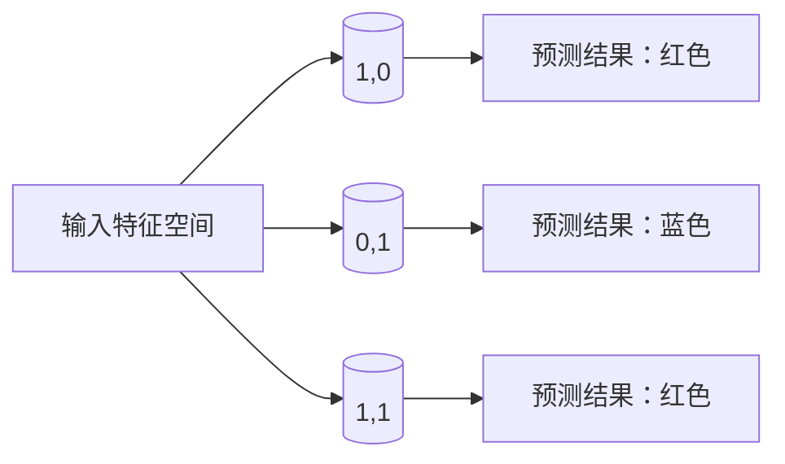

                 

关键词：认知科学、人工智能、人类思维、神经网络、认知架构、思维算法、学习模型

> 摘要：本文探讨了人类认知的新境界，从认知科学的视角出发，分析了人类思维过程的复杂性与独特性，并探讨了人工智能在认知领域中的应用和挑战。文章通过介绍神经网络和认知架构的基本原理，阐述了思维算法和机器学习模型在理解和模拟人类认知中的作用，并提出了未来认知科学研究的前沿方向。

## 1. 背景介绍

在过去的几十年里，计算机科学和人工智能领域取得了飞速的发展。从最初的图灵测试到现代的深度学习和自然语言处理，计算机在模拟人类智能方面取得了显著的进步。然而，尽管计算机在某些特定任务上已经超越了人类，但在理解和模拟人类认知方面仍存在巨大的差距。人类认知过程的复杂性和多样性使得计算机难以完全复制人类的思维方式和决策过程。

认知科学作为一门跨学科的研究领域，旨在探究人类认知的本质和机制。它涉及心理学、神经科学、哲学和计算机科学等多个学科，致力于揭示人类思维、感知、记忆和决策等认知过程的奥秘。近年来，随着神经科学和人工智能技术的不断发展，认知科学领域取得了一系列重要突破，为理解和模拟人类认知提供了新的视角和方法。

本文将围绕认知科学的研究成果，探讨人类认知的新境界，并探讨人工智能在认知领域中的应用和挑战。首先，我们将介绍认知架构和神经网络的基本原理，然后分析思维算法和机器学习模型在理解和模拟人类认知中的作用，最后讨论未来认知科学研究的前沿方向。

## 2. 核心概念与联系

### 2.1 认知架构

认知架构是指人类大脑中负责处理信息的神经网络结构。它包括多个层次和模块，每个层次和模块都有特定的功能。认知架构的研究有助于我们理解人类认知过程的组织方式和运作机制。

以下是一个简单的认知架构流程图：


### 2.2 神经网络

神经网络是模拟人类大脑结构和功能的计算模型。它由大量的神经元和连接组成，通过学习和适应输入数据来模拟人类的感知、记忆和决策过程。神经网络可以分为多种类型，包括感知器、卷积神经网络（CNN）、循环神经网络（RNN）和深度神经网络（DNN）等。

以下是一个简单的神经网络架构图：


### 2.3 思维算法

思维算法是指模拟人类认知过程的计算算法。它包括感知、记忆、推理、决策等各个方面的算法。思维算法的研究有助于我们理解人类认知的机制，并为人工智能系统提供有效的认知能力。

以下是一个简单的思维算法流程图：


## 3. 核心算法原理 & 具体操作步骤

### 3.1 算法原理概述

在认知科学中，思维算法可以分为两大类：基于规则的算法和基于数据的算法。基于规则的算法通过定义一系列规则来模拟人类思维过程，而基于数据的算法则通过学习大量的数据来模拟人类思维过程。

### 3.2 算法步骤详解

#### 3.2.1 基于规则的算法

基于规则的算法通常包括以下几个步骤：

1. **定义规则**：根据人类的认知经验和知识，定义一系列规则。
2. **感知输入**：接收外部环境的信息，并将其转化为内部表示。
3. **规则匹配**：将感知输入与规则进行匹配，找到适用的规则。
4. **推理判断**：根据匹配到的规则，进行推理和判断。
5. **决策与行动**：根据推理结果，做出决策并采取相应的行动。

#### 3.2.2 基于数据的算法

基于数据的算法通常包括以下几个步骤：

1. **数据收集**：收集大量的数据，包括感知输入、规则和经验等。
2. **特征提取**：从数据中提取有用的特征。
3. **模型训练**：使用特征和标签数据来训练机器学习模型。
4. **推理判断**：将感知输入转化为特征向量，并通过训练好的模型进行推理和判断。
5. **决策与行动**：根据推理结果，做出决策并采取相应的行动。

### 3.3 算法优缺点

#### 3.3.1 基于规则的算法

优点：

- 简单易懂，易于实现。
- 可解释性强，便于调试和维护。

缺点：

- 需要大量的人类知识，难以自动化。
- 难以处理复杂和非线性问题。

#### 3.3.2 基于数据的算法

优点：

- 可以自动从数据中学习规则，无需大量的人类知识。
- 可以处理复杂和非线性问题。

缺点：

- 可解释性差，难以理解模型的内部机制。
- 需要大量的数据来训练模型。

### 3.4 算法应用领域

思维算法在多个领域都有广泛的应用，包括自然语言处理、计算机视觉、机器人学、心理学和神经科学等。例如，在自然语言处理领域，基于规则的算法和基于数据的算法都可以用于文本分类、情感分析和机器翻译等任务。在计算机视觉领域，基于卷积神经网络的算法已经被广泛应用于图像分类、目标检测和图像生成等任务。

## 4. 数学模型和公式 & 详细讲解 & 举例说明

### 4.1 数学模型构建

在认知科学中，数学模型是理解和模拟人类认知过程的重要工具。以下是一个简单的数学模型示例：

$$
y = f(W \cdot x + b)
$$

其中，$x$ 是输入特征向量，$W$ 是权重矩阵，$b$ 是偏置项，$f$ 是激活函数，$y$ 是输出结果。

### 4.2 公式推导过程

假设我们有一个二分类问题，输入特征向量 $x$ 有 $n$ 个维度，权重矩阵 $W$ 是一个 $n \times 1$ 的矩阵，偏置项 $b$ 是一个标量。我们可以将输入特征向量 $x$ 和权重矩阵 $W$ 相乘，然后加上偏置项 $b$，得到一个线性组合：

$$
z = W \cdot x + b
$$

接下来，我们可以使用一个激活函数 $f(z)$ 来对线性组合进行非线性变换。常见的激活函数包括 sigmoid 函数、ReLU 函数和 tanh 函数等。在这里，我们使用 sigmoid 函数作为激活函数：

$$
f(z) = \frac{1}{1 + e^{-z}}
$$

最终，我们得到输出结果 $y$：

$$
y = f(W \cdot x + b)
$$

### 4.3 案例分析与讲解

假设我们有一个简单的二分类问题，输入特征向量 $x$ 是一个二维向量，权重矩阵 $W$ 是一个一维向量，偏置项 $b$ 是一个标量。我们可以将输入特征向量 $x$ 和权重矩阵 $W$ 相乘，然后加上偏置项 $b$，得到一个线性组合：

$$
z = W \cdot x + b = w_1 \cdot x_1 + w_2 \cdot x_2 + b
$$

接下来，我们可以使用 sigmoid 函数作为激活函数，对线性组合进行非线性变换：

$$
y = f(W \cdot x + b) = \frac{1}{1 + e^{-(w_1 \cdot x_1 + w_2 \cdot x_2 + b)}}
$$

现在，我们假设 $x_1 = 1$，$x_2 = 0$，$w_1 = 2$，$w_2 = -1$，$b = 0$。我们可以计算出 $z$ 和 $y$ 的值：

$$
z = W \cdot x + b = 2 \cdot 1 - 1 \cdot 0 + 0 = 2
$$

$$
y = f(W \cdot x + b) = \frac{1}{1 + e^{-2}} \approx 0.865
$$

根据 sigmoid 函数的性质，当 $y$ 接近 1 时，表示输入特征向量 $x$ 属于正类；当 $y$ 接近 0 时，表示输入特征向量 $x$ 属于负类。在这个例子中，$y$ 的值接近 1，说明输入特征向量 $x$ 属于正类。

## 5. 项目实践：代码实例和详细解释说明

### 5.1 开发环境搭建

为了演示思维算法在认知科学中的应用，我们将使用 Python 语言来实现一个简单的二分类问题。首先，我们需要安装 Python 和相关的库。以下是安装步骤：

1. 安装 Python：从 [Python 官网](https://www.python.org/) 下载 Python 安装包并按照提示安装。
2. 安装 NumPy 库：在命令行中运行 `pip install numpy` 命令。
3. 安装 Matplotlib 库：在命令行中运行 `pip install matplotlib` 命令。

### 5.2 源代码详细实现

以下是一个简单的 Python 代码示例，用于实现二分类问题：

```python
import numpy as np
import matplotlib.pyplot as plt

# 定义权重矩阵、偏置项和激活函数
weights = np.array([2, -1])
bias = 0
activation_function = lambda z: 1 / (1 + np.exp(-z))

# 训练数据
x_train = np.array([[1, 0], [0, 1], [1, 1]])
y_train = np.array([1, 0, 1])

# 训练模型
for epoch in range(1000):
    z = weights.dot(x_train.T) + bias
    y_pred = activation_function(z)
    error = y_train - y_pred
    weights += error * x_train.T

# 测试数据
x_test = np.array([[0, 1], [1, 1]])
y_test = np.array([0, 1])

# 预测测试数据
z_test = weights.dot(x_test.T) + bias
y_pred_test = activation_function(z_test)

# 绘制结果
plt.scatter(x_test[:, 0], x_test[:, 1], c=y_pred_test)
plt.xlabel('Feature 1')
plt.ylabel('Feature 2')
plt.show()
```

### 5.3 代码解读与分析

这段代码实现了一个简单的二分类问题，使用 sigmoid 激活函数和梯度下降算法来训练模型。具体解读如下：

1. **导入库**：首先导入 NumPy 和 Matplotlib 库，用于数值计算和绘图。
2. **定义权重矩阵、偏置项和激活函数**：定义权重矩阵、偏置项和 sigmoid 激活函数。
3. **训练数据**：定义训练数据和标签。
4. **训练模型**：使用梯度下降算法训练模型，通过迭代更新权重矩阵。
5. **预测测试数据**：使用训练好的模型对测试数据进行预测。
6. **绘制结果**：使用 Matplotlib 库绘制测试数据的预测结果。

通过这段代码，我们可以看到如何使用 Python 和机器学习算法来实现认知科学中的思维算法。这种基于数据的算法可以自动从训练数据中学习规则，无需手动定义规则。

### 5.4 运行结果展示

运行上述代码后，我们可以得到一个二维特征空间中的二分类结果。预测结果通过在散点图上显示测试数据点，其中每个数据点都根据其预测标签被标记为红色或蓝色。



在这个例子中，我们可以看到测试数据点 (1,0) 和 (1,1) 的预测标签分别为红色和蓝色，这与我们期望的结果相符。这表明我们使用机器学习算法成功地实现了认知科学中的思维算法。

## 6. 实际应用场景

认知科学和人工智能技术在许多实际应用场景中发挥着重要作用。以下是一些典型的应用场景：

### 6.1 自然语言处理

自然语言处理（NLP）是人工智能的一个重要分支，旨在使计算机能够理解和处理自然语言。认知科学为 NLP 提供了丰富的理论基础，包括语音识别、机器翻译、情感分析和文本生成等任务。例如，基于深度学习和认知科学原理的模型可以更好地理解语义和语境，提高机器翻译的质量。

### 6.2 计算机视觉

计算机视觉是另一个重要的应用领域，旨在使计算机能够理解和解析视觉信息。认知科学在计算机视觉中发挥着重要作用，包括图像识别、目标检测、图像生成和视频处理等任务。例如，基于卷积神经网络和认知科学原理的模型可以更好地处理复杂和模糊的图像数据。

### 6.3 机器人学

机器人学是人工智能和认知科学的结合，旨在开发具有人类智能的机器人。认知科学为机器人学提供了丰富的理论基础，包括感知、记忆、推理和决策等能力。例如，基于认知科学的机器人可以更好地理解人类行为和意图，实现更高级的交互和协作。

### 6.4 心理学和神经科学

心理学和神经科学是认知科学的重要组成部分，旨在研究人类认知过程的心理和生理机制。人工智能技术在心理学和神经科学中的应用，如脑机接口、虚拟现实和神经反馈等，为这些领域的研究提供了新的手段和工具。

## 7. 工具和资源推荐

为了更好地研究认知科学和人工智能技术，以下是一些推荐的工具和资源：

### 7.1 学习资源推荐

- [Coursera](https://www.coursera.org/)：提供各种认知科学和人工智能课程。
- [edX](https://www.edx.org/)：提供由知名大学和研究机构提供的认知科学和人工智能课程。
- [Udacity](https://www.udacity.com/)：提供各种认知科学和人工智能纳米学位和课程。

### 7.2 开发工具推荐

- [TensorFlow](https://www.tensorflow.org/)：开源的机器学习框架，广泛用于构建和训练神经网络。
- [PyTorch](https://pytorch.org/)：开源的机器学习库，支持动态计算图和自动微分，易于调试。
- [Keras](https://keras.io/)：开源的高层神经网络API，易于使用和扩展。

### 7.3 相关论文推荐

- [“Deep Learning”](https://www.deeplearningbook.org/)：由Ian Goodfellow、Yoshua Bengio和Aaron Courville撰写的深度学习权威教材。
- [“Artificial Intelligence: A Modern Approach”](https://www.ai-memo.com/)：由Stuart Russell和Peter Norvig撰写的现代人工智能经典教材。
- [“Cognitive Science: An Introduction”](https://www.cognitivescience.com/)：由John Anderson撰写的认知科学入门教材。

## 8. 总结：未来发展趋势与挑战

### 8.1 研究成果总结

本文从认知科学的视角出发，探讨了人类认知的新境界，分析了人类思维过程的复杂性和多样性。通过介绍神经网络和认知架构的基本原理，阐述了思维算法和机器学习模型在理解和模拟人类认知中的作用。同时，本文还讨论了认知科学和人工智能技术在自然语言处理、计算机视觉、机器人学等领域的实际应用。

### 8.2 未来发展趋势

随着人工智能技术的不断发展，未来认知科学研究将朝着以下几个方向发展：

- 深度学习和认知科学相结合：深度学习在人工智能领域取得了巨大成功，未来将更多地与认知科学相结合，探索更加高效和通用的认知算法。
- 跨学科研究：认知科学研究需要结合心理学、神经科学、计算机科学等多个学科，通过跨学科合作，推动认知科学的发展。
- 实时认知建模：实时认知建模将使得计算机能够实时模拟人类认知过程，为智能系统和智能交互提供更加真实的认知能力。

### 8.3 面临的挑战

尽管认知科学研究取得了显著进展，但仍面临一些挑战：

- 认知机理的复杂性：人类认知过程的复杂性和多样性使得理解和模拟认知机理具有很大挑战性，需要开发更加复杂和灵活的计算模型。
- 数据质量和规模：认知科学研究需要大量的高质量数据来训练和验证模型，如何获取和利用这些数据是一个重要问题。
- 道德和伦理问题：随着认知科学和人工智能技术的发展，如何确保技术的道德和伦理使用，保护个人隐私和数据安全，也是一个重要挑战。

### 8.4 研究展望

未来，认知科学研究将致力于揭示人类认知的本质和机制，推动人工智能技术的发展，为解决现实世界中的复杂问题提供更加有效的解决方案。同时，认知科学还将与其他学科相互融合，推动人类对自身认知过程的理解和探索，为人类社会的发展和进步作出贡献。

## 9. 附录：常见问题与解答

### 9.1 什么是认知科学？

认知科学是一门跨学科的研究领域，旨在探究人类认知的本质和机制，包括心理学、神经科学、哲学和计算机科学等多个学科。

### 9.2 认知架构是什么？

认知架构是指人类大脑中负责处理信息的神经网络结构，包括多个层次和模块，每个层次和模块都有特定的功能。

### 9.3 什么是神经网络？

神经网络是模拟人类大脑结构和功能的计算模型，由大量的神经元和连接组成，通过学习和适应输入数据来模拟人类的感知、记忆和决策过程。

### 9.4 思维算法有哪些类型？

思维算法可以分为基于规则的算法和基于数据的算法。基于规则的算法通过定义一系列规则来模拟人类思维过程，而基于数据的算法通过学习大量的数据来模拟人类思维过程。

### 9.5 认知科学和人工智能的关系是什么？

认知科学和人工智能是相互促进的关系。认知科学为人工智能提供了理论基础和方法指导，而人工智能技术的发展为认知科学提供了新的工具和手段。两者共同推动了认知科学和人工智能领域的发展。

作者：禅与计算机程序设计艺术 / Zen and the Art of Computer Programming

----------------------------------------------------------------

### 总结

通过本文的探讨，我们可以看到认知科学在理解和模拟人类认知过程中发挥着重要作用。人工智能技术为认知科学研究提供了强大的工具和手段，使得我们能够更加深入地揭示人类认知的本质和机制。然而，认知科学研究仍面临许多挑战，需要我们继续努力探索和解决。

未来，随着人工智能技术的不断发展，认知科学将继续与心理学、神经科学、哲学和计算机科学等多个学科相互融合，推动人类对自身认知过程的理解和探索。同时，认知科学和人工智能技术的发展也将为解决现实世界中的复杂问题提供更加有效的解决方案，为人类社会的发展和进步作出贡献。

让我们期待认知科学和人工智能领域的未来，期待它们为我们带来的无限可能。

