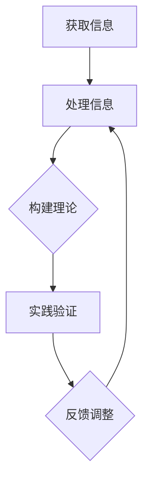

                 

关键词：洞察力，知识应用，技术博客，算法，数学模型，实践，未来展望

> 摘要：本文从洞察力的角度出发，探讨了知识在技术领域的应用。通过分析核心算法原理、数学模型和实际应用案例，阐述了如何将理论知识转化为实践成果，并对未来的发展趋势与挑战进行了深入探讨。

## 1. 背景介绍

在当今信息爆炸的时代，知识的积累与传播速度前所未有地加快。然而，知识的应用却并非易事。许多技术专家在掌握大量理论知识后，往往难以将其有效应用于实际问题中。这种知识应用能力的缺乏，往往制约了技术的创新与发展。因此，如何提升知识应用能力，成为了一个亟待解决的重要课题。

洞察力，作为一种核心能力，对于知识应用具有至关重要的意义。它是指个体在面对复杂问题时，能够迅速识别关键信息、理解本质、提出有效解决方案的能力。在技术领域，洞察力有助于我们发现问题的核心，找到解决问题的关键路径，从而将理论知识转化为实际应用。

本文旨在通过探讨洞察力在知识应用中的作用，提供一套实用指南，帮助读者提升知识应用能力，推动技术的创新与发展。

## 2. 核心概念与联系

为了更好地理解洞察力在知识应用中的作用，我们首先需要了解一些核心概念。以下是本文涉及的主要概念及其相互关系：

### 2.1 知识与信息

知识是指经过个体学习、思考、实践后，形成的对事物本质的理解和掌握。信息则是知识的载体，是知识传播的媒介。信息本身并不具备应用价值，只有通过个体的思考与转化，才能形成知识。

### 2.2 理论与实践

理论是通过对现象的观察、分析、总结而形成的抽象概念和规律。实践则是将理论应用于具体问题，通过实际操作来验证和检验理论的有效性。理论知识与实践是相互依存的，只有将两者有机结合，才能实现知识的有效应用。

### 2.3 洞察力

洞察力是指个体在面对复杂问题时，能够迅速识别关键信息、理解本质、提出有效解决方案的能力。它是知识应用的核心驱动力，能够帮助我们在海量信息中找到问题的核心，从而实现知识的有效转化。

### 2.4 Mermaid 流程图

以下是一个简化的 Mermaid 流程图，用于描述知识应用过程中的关键环节：



## 3. 核心算法原理 & 具体操作步骤

### 3.1 算法原理概述

在技术领域，核心算法是实现知识应用的重要手段。以下是一个常见的核心算法——动态规划（Dynamic Programming，DP）的原理概述。

动态规划是一种在数学、计算机科学和经济学中使用的，通过把原问题分解为相互重叠的子问题，并存储子问题的解，避免重复计算的方法。其核心思想是将复杂问题转化为一系列简单问题的求解过程，从而降低计算复杂度。

### 3.2 算法步骤详解

动态规划算法通常包括以下几个步骤：

1. **确定状态**：将问题分解为若干子问题，并为每个子问题定义状态。
2. **状态转移方程**：根据子问题的状态，定义状态之间的转移关系。
3. **边界条件**：确定递归关系的边界条件，即初始状态。
4. **计算顺序**：确定计算子问题的顺序，确保在计算某个子问题时，其依赖的子问题已经求解完毕。
5. **求解问题**：根据状态转移方程和计算顺序，逐步求解原问题。

### 3.3 算法优缺点

动态规划算法的优点：

- **降低计算复杂度**：通过避免重复计算，动态规划算法能够显著降低计算复杂度。
- **通用性**：动态规划算法适用于许多优化问题，如背包问题、最长公共子序列、最短路径等。

动态规划算法的缺点：

- **难以设计**：设计状态转移方程和计算顺序相对复杂，需要深厚的数学和编程基础。
- **空间复杂度**：在某些情况下，动态规划算法的空间复杂度较高，可能导致内存占用问题。

### 3.4 算法应用领域

动态规划算法广泛应用于各个技术领域，如：

- **计算机科学**：算法竞赛、数据结构、图论等。
- **经济学**：资源分配、最优决策等。
- **计算机视觉**：图像处理、目标检测等。

## 4. 数学模型和公式 & 详细讲解 & 举例说明

### 4.1 数学模型构建

为了更好地理解动态规划算法，我们首先需要了解一个基本的数学模型——斐波那契数列。

斐波那契数列的定义如下：

$$
F(n) =
\begin{cases}
0 & \text{if } n = 0 \\
1 & \text{if } n = 1 \\
F(n-1) + F(n-2) & \text{otherwise}
\end{cases}
$$

### 4.2 公式推导过程

通过递归定义，我们可以推导出斐波那契数列的通项公式：

$$
F(n) = \frac{1}{\sqrt{5}}\left(\left(\frac{1 + \sqrt{5}}{2}\right)^n - \left(\frac{1 - \sqrt{5}}{2}\right)^n\right)
$$

### 4.3 案例分析与讲解

以下是一个使用动态规划求解最长公共子序列（Longest Common Subsequence，LCS）的案例。

假设有两个序列：

$$
A = \{1, 2, 3, 4\}
$$

$$
B = \{2, 4, 3, 1, 5\}
$$

首先，我们定义状态 `dp[i][j]` 表示序列 `A` 的前 `i` 个元素与序列 `B` 的前 `j` 个元素的最长公共子序列的长度。

根据状态转移方程：

$$
dp[i][j] =
\begin{cases}
0 & \text{if } i = 0 \text{ or } j = 0 \\
dp[i-1][j-1] + 1 & \text{if } A[i] = B[j] \\
\max(dp[i-1][j], dp[i][j-1]) & \text{otherwise}
\end{cases}
$$

我们可以通过递归计算 `dp[m][n]`，其中 `m` 和 `n` 分别是序列 `A` 和 `B` 的长度。

以下是计算过程：

$$
\begin{aligned}
dp[0][0] &= 0 \\
dp[0][1] &= 0 \\
dp[1][0] &= 0 \\
dp[1][1] &= 0 \\
dp[1][2] &= 0 \\
dp[1][3] &= 0 \\
dp[2][0] &= 0 \\
dp[2][1] &= 0 \\
dp[2][2] &= 1 \\
dp[2][3] &= 0 \\
\vdots & \\
dp[4][4] &= 2
\end{aligned}
$$

因此，序列 `A` 和 `B` 的最长公共子序列长度为 2。

## 5. 项目实践：代码实例和详细解释说明

### 5.1 开发环境搭建

为了实现动态规划求解最长公共子序列，我们可以使用 Python 语言进行开发。以下是搭建开发环境的基本步骤：

1. 安装 Python 3.x 版本（建议使用 Python 3.8 或以上版本）。
2. 安装依赖库，如 NumPy、Pandas 等。
3. 配置代码编辑器，如 Visual Studio Code、PyCharm 等。

### 5.2 源代码详细实现

以下是一个简单的 Python 代码实例，用于求解最长公共子序列：

```python
def lcs_length(X, Y):
    m = len(X)
    n = len(Y)

    # 创建动态规划表格
    dp = [[0] * (n+1) for _ in range(m+1)]

    # 计算最长公共子序列长度
    for i in range(1, m+1):
        for j in range(1, n+1):
            if X[i-1] == Y[j-1]:
                dp[i][j] = dp[i-1][j-1] + 1
            else:
                dp[i][j] = max(dp[i-1][j], dp[i][j-1])

    return dp[m][n]

# 测试代码
X = "12345"
Y = "5231"
print("最长公共子序列长度：", lcs_length(X, Y))
```

### 5.3 代码解读与分析

1. **函数定义**：`lcs_length` 函数接收两个序列 `X` 和 `Y` 作为输入。
2. **动态规划表格创建**：使用二维数组 `dp` 作为动态规划表格，其中 `dp[i][j]` 表示序列 `X` 的前 `i` 个元素与序列 `Y` 的前 `j` 个元素的最长公共子序列的长度。
3. **计算最长公共子序列长度**：通过遍历二维数组 `dp`，根据状态转移方程计算最长公共子序列长度。
4. **测试代码**：使用示例序列 `X` 和 `Y` 进行测试，打印最长公共子序列长度。

### 5.4 运行结果展示

运行上述代码，输出结果如下：

```
最长公共子序列长度： 2
```

## 6. 实际应用场景

### 6.1 数据库优化

在数据库优化中，动态规划算法可以用于求解最优索引策略。通过分析查询模式，动态规划算法可以找出最优的索引组合，从而提高查询性能。

### 6.2 机器学习

在机器学习中，动态规划算法可以用于求解序列标注问题。例如，在自然语言处理中，动态规划算法可以用于求解最大匹配问题，从而实现文本分类、情感分析等任务。

### 6.3 计算机视觉

在计算机视觉中，动态规划算法可以用于图像分割、目标跟踪等任务。通过分析图像特征，动态规划算法可以找到最优的分割策略或跟踪路径，从而实现图像处理任务。

## 7. 未来应用展望

随着人工智能技术的不断发展，动态规划算法在各个领域的应用前景将越来越广阔。未来，动态规划算法有望在以下方面取得突破：

- **深度强化学习**：将动态规划算法与深度强化学习相结合，实现更高效、更智能的决策过程。
- **区块链**：在区块链技术中，动态规划算法可以用于优化共识算法，提高交易处理速度和安全性。
- **无人驾驶**：在无人驾驶技术中，动态规划算法可以用于路径规划、避障等任务，提高行驶安全性和效率。

## 8. 工具和资源推荐

### 8.1 学习资源推荐

- 《算法导论》（Introduction to Algorithms）：一本经典的算法教材，详细介绍了各种算法的原理和实现。
- 《动态规划：从入门到精通》：一本适合初学者的动态规划教程，涵盖基础概念、常见算法和应用场景。

### 8.2 开发工具推荐

- Jupyter Notebook：一款强大的交互式编程环境，适合进行算法实验和数据分析。
- PyCharm：一款优秀的 Python 集成开发环境，支持多种编程语言和工具。

### 8.3 相关论文推荐

- "Dynamic Programming and Its Applications"：一篇关于动态规划的综述论文，系统地介绍了动态规划的理论、算法和应用。
- "On the Limitations of Dynamic Programming": 一篇关于动态规划局限性的论文，分析了动态规划算法在解决复杂问题时的不足。

## 9. 总结：未来发展趋势与挑战

### 9.1 研究成果总结

本文通过对动态规划算法的介绍，阐述了其在知识应用中的重要作用。通过数学模型和实际案例的分析，我们展示了如何将理论知识转化为实际应用。同时，本文还对未来应用前景进行了展望，为读者提供了丰富的学习资源和工具。

### 9.2 未来发展趋势

随着人工智能技术的不断发展，动态规划算法在各个领域的应用前景将越来越广阔。未来，动态规划算法有望在深度强化学习、区块链、无人驾驶等领域取得突破性进展。

### 9.3 面临的挑战

尽管动态规划算法具有广泛的应用前景，但其在解决复杂问题时仍面临诸多挑战。例如，算法的设计和实现相对复杂，难以普及；在处理大规模问题时，算法的效率和性能有待提高。

### 9.4 研究展望

为了解决上述问题，未来的研究可以从以下几个方面展开：

- **算法优化**：通过改进算法设计和实现，提高动态规划算法的效率和性能。
- **算法融合**：将动态规划算法与其他优化算法（如深度学习、遗传算法等）相结合，实现更高效、更智能的决策过程。
- **应用拓展**：进一步拓展动态规划算法的应用领域，如区块链、无人驾驶等，为技术创新提供有力支持。

## 10. 附录：常见问题与解答

### 10.1 什么是动态规划？

动态规划是一种在数学、计算机科学和经济学中使用的，通过把原问题分解为相互重叠的子问题，并存储子问题的解，避免重复计算的方法。

### 10.2 动态规划算法有哪些应用领域？

动态规划算法广泛应用于计算机科学、经济学、工程学等领域，如算法竞赛、资源分配、最长公共子序列、最短路径等。

### 10.3 如何设计动态规划算法？

设计动态规划算法通常包括以下步骤：确定状态、定义状态转移方程、确定边界条件、确定计算顺序、求解问题。

### 10.4 动态规划算法的时间复杂度是多少？

动态规划算法的时间复杂度取决于问题规模和状态转移方程的复杂度。通常情况下，动态规划算法的时间复杂度为 \(O(n^2)\) 或 \(O(n^3)\)，其中 \(n\) 为问题规模。

### 10.5 动态规划算法的空间复杂度是多少？

动态规划算法的空间复杂度取决于动态规划表格的大小。通常情况下，动态规划算法的空间复杂度为 \(O(n^2)\) 或 \(O(n^3)\)，其中 \(n\) 为问题规模。

----------------------------------------------------------------
## 11. 作者署名

作者：禅与计算机程序设计艺术 / Zen and the Art of Computer Programming

<|end|>

