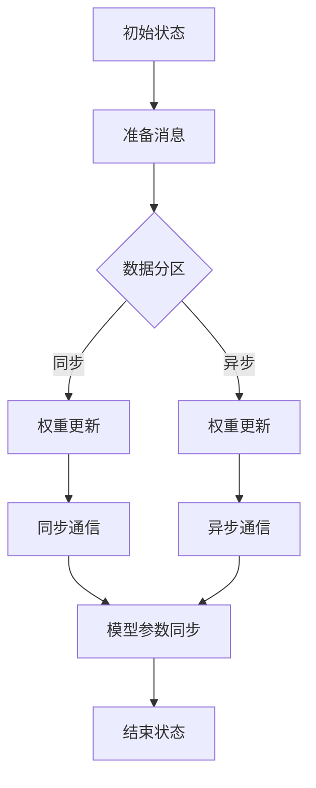

                 

关键词：神经网络，消息传递，深度学习，LLM，计算机架构，信息传递模型

> 摘要：本文深入探讨消息传递机制在大型语言模型（LLM）系统神经网络中的作用与重要性，分析其架构原理、算法实现、数学模型，并结合实际应用实例，展望未来的发展趋势与挑战。

## 1. 背景介绍

随着深度学习技术的不断发展，神经网络已经成为了现代人工智能的核心技术之一。特别是在自然语言处理（NLP）领域，大型语言模型（Large Language Models，简称LLM）如BERT、GPT等取得了显著的突破，极大地推动了AI在文本生成、翻译、问答等任务中的应用。

然而，随着神经网络模型的复杂度和规模不断增长，如何高效地进行消息传递和计算优化成为了研究的热点。传统的神经网络结构往往存在信息传递瓶颈，难以满足大规模模型的需求。因此，消息传递机制应运而生，成为提升神经网络性能和计算效率的关键因素。

本文旨在深入探讨消息传递机制在LLM系统神经网络中的应用，分析其核心原理、算法实现和数学模型，并结合实际应用实例，探讨未来的发展趋势与挑战。

## 2. 核心概念与联系

### 2.1 消息传递机制的基本概念

消息传递机制是一种在分布式系统中，通过消息传递来协调不同组件或进程之间的通信方式。在神经网络中，消息传递机制主要用于解决大规模模型训练过程中数据流和控制流的同步与传递问题。

### 2.2 神经网络与消息传递的关系

神经网络中的消息传递机制主要应用于以下几个方面：

1. **权重更新同步**：在分布式训练中，不同节点（或GPU）上的神经网络会分别处理不同部分的数据。通过消息传递机制，节点之间可以同步各自的权重更新，实现全局优化。

2. **梯度聚合**：在多GPU训练过程中，不同GPU上的梯度需要进行聚合。消息传递机制可以高效地实现梯度在各GPU之间的传递和聚合，提高训练效率。

3. **数据流控制**：在分布式训练中，数据流需要在不同节点之间传递。消息传递机制可以有效地控制数据流，避免节点之间的数据竞争和传输瓶颈。

### 2.3 消息传递机制的架构

消息传递机制在神经网络中通常采用如下架构：

1. **全局同步**：所有节点都参与到全局同步过程中，确保各个节点的模型参数和梯度保持一致。

2. **部分同步**：在某些情况下，部分节点之间进行同步，以减少通信开销。

3. **异步通信**：在异步通信模式下，节点之间可以独立地更新模型参数，但需要在一定时间范围内保证全局一致性。

## 2.4 Mermaid流程图



## 3. 核心算法原理 & 具体操作步骤

### 3.1 算法原理概述

消息传递机制的核心算法主要包括以下几个方面：

1. **数据分区**：将训练数据划分成多个子集，分别分配给不同节点进行训练。

2. **权重更新**：节点根据局部梯度更新模型参数，并通过消息传递机制与其他节点同步。

3. **梯度聚合**：将各个节点的梯度进行聚合，得到全局梯度。

4. **模型参数同步**：将全局梯度应用于模型参数，实现模型更新。

### 3.2 算法步骤详解

1. **数据分区**：

   - 将训练数据集划分为多个子集，每个子集包含部分训练样本。
   - 将子集分配给不同节点，每个节点负责处理一个子集。

2. **权重更新**：

   - 各节点根据局部梯度更新模型参数。
   - 更新过程包括前向传播、计算梯度、反向传播和参数更新。

3. **梯度聚合**：

   - 各节点将自己的梯度发送给主节点。
   - 主节点将各节点的梯度进行聚合，得到全局梯度。

4. **模型参数同步**：

   - 主节点将全局梯度发送给各节点。
   - 各节点根据全局梯度更新模型参数。

### 3.3 算法优缺点

#### 优点：

1. **高效计算**：通过分布式计算，可以加速模型训练过程。
2. **资源利用**：可以充分利用多个GPU或其他计算资源，提高计算效率。
3. **灵活扩展**：可以支持大规模模型的训练，适应不同的硬件环境。

#### 缺点：

1. **通信开销**：分布式训练过程中存在通信开销，可能导致性能下降。
2. **一致性保证**：在异步通信模式下，一致性保证较为困难，可能影响模型性能。

### 3.4 算法应用领域

消息传递机制在深度学习领域具有广泛的应用，主要包括以下几个方面：

1. **大规模模型训练**：如BERT、GPT等大型语言模型的训练。
2. **分布式计算**：在多GPU、多节点环境下进行模型训练和推理。
3. **边缘计算**：在资源受限的边缘设备上进行模型训练和推理。

## 4. 数学模型和公式 & 详细讲解 & 举例说明

### 4.1 数学模型构建

在消息传递机制中，主要涉及以下数学模型：

1. **局部梯度计算**：  
   $$\text{local\_gradient} = \frac{\partial L}{\partial \theta}$$  
   其中，$L$ 表示损失函数，$\theta$ 表示模型参数。

2. **全局梯度聚合**：  
   $$\text{global\_gradient} = \frac{1}{N} \sum_{i=1}^{N} \text{local\_gradient}_i$$  
   其中，$N$ 表示节点数量，$\text{local\_gradient}_i$ 表示第 $i$ 个节点的局部梯度。

3. **模型参数更新**：  
   $$\theta_{\text{new}} = \theta_{\text{old}} - \alpha \cdot \text{global\_gradient}$$  
   其中，$\alpha$ 表示学习率。

### 4.2 公式推导过程

假设有一个包含 $N$ 个节点的分布式神经网络，每个节点处理一部分数据。我们首先对单个节点的局部梯度进行计算：

$$\text{local\_gradient}_i = \frac{\partial L}{\partial \theta}$$

然后，将局部梯度发送给主节点，主节点进行全局梯度聚合：

$$\text{global\_gradient} = \frac{1}{N} \sum_{i=1}^{N} \text{local\_gradient}_i$$

最后，主节点将全局梯度发送给各个节点，节点根据全局梯度更新模型参数：

$$\theta_{\text{new}} = \theta_{\text{old}} - \alpha \cdot \text{global\_gradient}$$

### 4.3 案例分析与讲解

假设我们有一个包含3个节点的神经网络，每个节点处理1/3的训练数据。使用SGD算法进行模型训练，学习率为0.1。

1. **数据分区**：

   - 节点1处理前1/3的训练数据。  
   - 节点2处理中间1/3的训练数据。  
   - 节点3处理后1/3的训练数据。

2. **局部梯度计算**：

   - 节点1的局部梯度：  
     $$\text{local\_gradient}_1 = \frac{\partial L}{\partial \theta}$$  
   - 节点2的局部梯度：  
     $$\text{local\_gradient}_2 = \frac{\partial L}{\partial \theta}$$  
   - 节点3的局部梯度：  
     $$\text{local\_gradient}_3 = \frac{\partial L}{\partial \theta}$$

3. **全局梯度聚合**：

   $$\text{global\_gradient} = \frac{1}{3} (\text{local\_gradient}_1 + \text{local\_gradient}_2 + \text{local\_gradient}_3)$$

4. **模型参数更新**：

   $$\theta_{\text{new}} = \theta_{\text{old}} - 0.1 \cdot \text{global\_gradient}$$

通过上述步骤，我们可以实现分布式神经网络的训练。

## 5. 项目实践：代码实例和详细解释说明

### 5.1 开发环境搭建

在本文中，我们将使用Python和PyTorch框架来实现消息传递机制的神经网络训练。以下为开发环境的搭建步骤：

1. 安装Python（3.8及以上版本）
2. 安装PyTorch（根据系统环境选择CPU或GPU版本）
3. 安装其他依赖库（如numpy、torchvision等）

### 5.2 源代码详细实现

以下是一个简单的示例代码，展示了消息传递机制的神经网络训练过程：

```python
import torch
import torch.nn as nn
import torch.optim as optim

# 定义神经网络模型
class NeuralNetwork(nn.Module):
    def __init__(self):
        super(NeuralNetwork, self).__init__()
        self.fc1 = nn.Linear(10, 5)
        self.fc2 = nn.Linear(5, 2)

    def forward(self, x):
        x = torch.relu(self.fc1(x))
        x = self.fc2(x)
        return x

# 创建模型实例
model = NeuralNetwork()

# 定义损失函数和优化器
criterion = nn.CrossEntropyLoss()
optimizer = optim.SGD(model.parameters(), lr=0.1)

# 准备数据集
x_train = torch.randn(100, 10)
y_train = torch.randint(0, 2, (100,))

# 分布式训练
device = torch.device("cuda" if torch.cuda.is_available() else "cpu")
model.to(device)
x_train = x_train.to(device)
y_train = y_train.to(device)

for epoch in range(10):
    # 前向传播
    outputs = model(x_train)

    # 计算损失
    loss = criterion(outputs, y_train)

    # 反向传播和优化
    optimizer.zero_grad()
    loss.backward()
    optimizer.step()

    print(f"Epoch {epoch+1}, Loss: {loss.item()}")

# 保存模型参数
torch.save(model.state_dict(), "model_params.pth")
```

### 5.3 代码解读与分析

上述代码实现了一个简单的神经网络模型，并使用SGD优化器进行分布式训练。具体分析如下：

1. **模型定义**：

   - 使用PyTorch框架定义了一个简单的神经网络模型，包含一个线性层（fc1）和一个全连接层（fc2）。

2. **损失函数和优化器**：

   - 使用交叉熵损失函数（CrossEntropyLoss）计算模型预测和实际标签之间的差距。
   - 使用SGD优化器（SGD）进行模型参数的更新。

3. **数据准备**：

   - 使用随机生成的数据集进行训练，模拟分布式训练场景。

4. **分布式训练**：

   - 将模型和数据移动到GPU设备上，以便进行加速训练。
   - 在每个epoch中，执行前向传播、计算损失、反向传播和优化过程。

5. **模型保存**：

   - 将训练完成的模型参数保存到本地文件，以便后续加载和使用。

## 6. 实际应用场景

消息传递机制在深度学习领域具有广泛的应用，以下列举几个典型的应用场景：

1. **大规模语言模型训练**：如BERT、GPT等，使用消息传递机制进行分布式训练，提高训练效率。
2. **图像识别与分类**：在计算机视觉任务中，使用消息传递机制实现分布式图像处理和分类。
3. **语音识别**：在语音识别任务中，使用消息传递机制进行分布式语音信号处理和识别。
4. **自然语言处理**：在文本生成、机器翻译、问答系统中，使用消息传递机制实现分布式文本处理。

## 7. 未来应用展望

随着深度学习技术的不断发展，消息传递机制在神经网络中的应用将越来越广泛。以下是对未来发展趋势的展望：

1. **优化消息传递效率**：研究更高效的消息传递算法，降低通信开销，提高训练效率。
2. **异构计算**：结合CPU、GPU、TPU等异构计算资源，实现更高效的分布式训练。
3. **自适应消息传递**：根据训练数据和模型规模，自适应调整消息传递策略，提高训练性能。
4. **边缘计算**：在资源受限的边缘设备上，使用消息传递机制实现分布式训练和推理。

## 8. 工具和资源推荐

### 8.1 学习资源推荐

1. 《深度学习》（Goodfellow、Bengio、Courville 著）：介绍深度学习的基本原理和应用。
2. 《神经网络与深度学习》（邱锡鹏 著）：深入讲解神经网络和深度学习的算法原理。
3. 《PyTorch官方文档》：学习PyTorch框架的使用和API。

### 8.2 开发工具推荐

1. PyTorch：开源深度学习框架，支持多种神经网络结构和分布式训练。
2. TensorFlow：开源深度学习框架，支持多种神经网络结构和分布式训练。
3. GPU：用于加速深度学习模型的训练和推理，支持CUDA和GPU并行计算。

### 8.3 相关论文推荐

1. "DistBelief: Large Scale Distributed Deep Network Training Through Hadoop MapReduce"（Dean et al., 2012）
2. "Large Scale Distributed Deep Networks"（Dean et al., 2013）
3. "Learning Representations for Visual Recognition with Deep Neural Networks"（Krizhevsky et al., 2012）

## 9. 总结：未来发展趋势与挑战

随着深度学习技术的不断发展，消息传递机制在神经网络中的应用将越来越广泛。未来发展趋势包括优化消息传递效率、异构计算、自适应消息传递和边缘计算。然而，消息传递机制也面临一些挑战，如通信开销、一致性保证和模型稳定性。针对这些挑战，需要深入研究更高效的算法和优化策略。

### 附录：常见问题与解答

1. **什么是消息传递机制？**
   消息传递机制是一种在分布式系统中，通过消息传递来协调不同组件或进程之间的通信方式。在神经网络中，主要用于解决大规模模型训练过程中数据流和控制流的同步与传递问题。

2. **消息传递机制在神经网络中有哪些应用？**
   消息传递机制在神经网络中的应用主要包括权重更新同步、梯度聚合、数据流控制等方面。可以用于大规模模型训练、分布式计算、边缘计算等场景。

3. **为什么需要消息传递机制？**
   随着深度学习模型的规模不断扩大，传统的同步训练方式难以满足高效训练的需求。消息传递机制可以提高训练效率，降低通信开销，优化模型性能。

4. **消息传递机制有哪些优缺点？**
   消息传递机制的优点包括高效计算、资源利用和灵活扩展。缺点包括通信开销和一致性保证问题。

### 作者署名

作者：禅与计算机程序设计艺术 / Zen and the Art of Computer Programming

