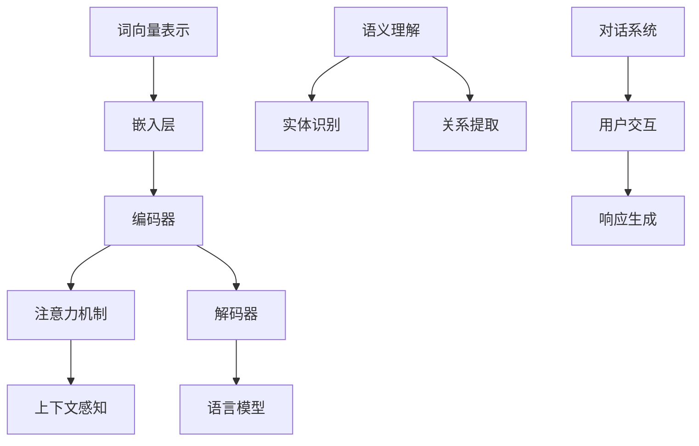

                 

关键词：涌现能力、语言理解、语言生成、自然语言处理、人工智能、深度学习、神经网络、生成模型、注意力机制、Transformer、BERT、GPT、语言模型、语义理解、上下文感知、语境、文本生成、对话系统、智能助手。

## 摘要

本文将深入探讨人工智能领域的涌现能力，尤其是语言理解与生成方面的研究进展和应用。语言作为人类交流的重要工具，其处理和理解的重要性不言而喻。本文将从背景介绍、核心概念与联系、核心算法原理、数学模型与公式、项目实践、实际应用场景、工具和资源推荐、总结与展望等方面，详细解析语言理解与生成领域的现状、技术突破和应用前景。

## 1. 背景介绍

语言是人类文明的重要组成部分，其处理和理解能力在计算机科学和人工智能领域具有极高的研究价值。自然语言处理（Natural Language Processing, NLP）作为人工智能的一个重要分支，致力于让计算机理解和生成人类语言。

### 语言理解的挑战

语言理解涉及语义、语法、上下文等多个层面，具有高度复杂性和多样性。以下是语言理解面临的主要挑战：

- **多义性**：词语在特定语境下可能有多种含义，如“银行”既可以是金融机构，也可以是存放物品的地方。
- **歧义**：一句话可能有多个理解方式，如“我打篮球”可以是“我打篮球比赛”，也可以是“我用篮球打人”。
- **语法结构**：自然语言的语法结构多变，涉及复杂的从句、并列句和修饰语。
- **上下文依赖**：理解一句话的含义往往需要依赖上下文信息。

### 语言生成的挑战

语言生成同样面临多义性、歧义、语法结构和上下文依赖等挑战。此外，生成的内容需要符合语言的自然流畅性、逻辑一致性和语义准确性。

## 2. 核心概念与联系

为了更好地理解语言理解与生成的复杂性，我们需要引入一些核心概念，并通过Mermaid流程图展示它们之间的联系。



### 2.1 词向量表示

词向量表示是自然语言处理的基础，将词语映射为高维向量。Word2Vec、GloVe等模型通过统计方法将词语的语义信息编码到向量中。

### 2.2 嵌入层

嵌入层将词向量映射到更复杂的向量空间，为后续的编码和解析提供基础。

### 2.3 编码器

编码器将输入的词语序列编码为固定长度的向量表示，通常用于提取句子的语义信息。

### 2.4 注意力机制

注意力机制使编码器能够聚焦于输入序列的关键部分，从而提高语言理解的准确性。

### 2.5 解码器

解码器根据编码器的输出，生成语言序列。在生成过程中，解码器会利用注意力机制和语言模型进行上下文感知。

### 2.6 语言模型

语言模型用于预测下一个词语的概率分布，对生成的内容进行概率优化，以提高语言的流畅性和准确性。

### 2.7 语义理解

语义理解涉及实体识别、关系提取等任务，旨在理解句子的深层含义。

### 2.8 对话系统

对话系统结合语言理解与生成，实现人与机器之间的自然交互。

## 3. 核心算法原理 & 具体操作步骤

### 3.1 算法原理概述

语言理解与生成算法主要基于深度学习模型，如Transformer、BERT、GPT等。这些模型通过大规模数据训练，学习语言的模式和结构，从而实现高效的文本处理。

### 3.2 算法步骤详解

1. **词向量表示**：将输入的词语转换为词向量。
2. **嵌入层**：将词向量映射到更复杂的向量空间。
3. **编码器**：编码器将输入的词语序列编码为固定长度的向量表示。
4. **注意力机制**：编码器利用注意力机制聚焦于关键部分。
5. **解码器**：解码器根据编码器的输出，生成语言序列。
6. **语言模型**：语言模型用于优化生成的内容。
7. **语义理解**：通过实体识别、关系提取等任务，理解句子的深层含义。
8. **对话系统**：结合语言理解与生成，实现人与机器的自然交互。

### 3.3 算法优缺点

#### 优点

- **高效性**：深度学习模型能够高效地处理大规模文本数据。
- **准确性**：注意力机制和语言模型显著提高了语言理解的准确性。
- **多样性**：生成模型能够生成多样化的文本内容。

#### 缺点

- **计算资源需求**：深度学习模型需要大量的计算资源和数据。
- **数据依赖性**：模型的性能高度依赖训练数据的质量和规模。
- **解释性**：深度学习模型难以解释，对理解和调试带来一定困难。

### 3.4 算法应用领域

- **文本分类**：对文本进行情感分析、新闻分类等任务。
- **问答系统**：自动回答用户提出的问题。
- **机器翻译**：将一种语言翻译为另一种语言。
- **对话系统**：实现人与机器的自然交互。
- **文本生成**：生成文章、摘要、对话等。

## 4. 数学模型和公式 & 详细讲解 & 举例说明

### 4.1 数学模型构建

在语言理解与生成过程中，常见的数学模型包括词向量表示、编码器、解码器、语言模型和注意力机制。

#### 4.1.1 词向量表示

$$
\text{word\_vector}(w) = \text{embed}(w) \cdot \text{weight}
$$

其中，$\text{embed}(w)$ 是词向量，$\text{weight}$ 是权重向量。

#### 4.1.2 编码器

$$
\text{encoded\_sequence} = \text{encoder}(\text{input\_sequence})
$$

其中，$\text{input\_sequence}$ 是输入的词语序列，$\text{encoder}$ 是编码器。

#### 4.1.3 解码器

$$
\text{predicted\_words} = \text{decoder}(\text{encoded\_sequence}, \text{context})
$$

其中，$\text{context}$ 是上下文信息。

#### 4.1.4 语言模型

$$
P(w_t | w_{<t}) = \text{softmax}(\text{logit}(w_t | w_{<t}))
$$

其中，$w_t$ 是目标词语，$w_{<t}$ 是前面的词语。

#### 4.1.5 注意力机制

$$
\text{attention\_score} = \text{attention}(\text{query}, \text{keys}, \text{values})
$$

其中，$\text{query}$ 是查询向量，$\text{keys}$ 和 $\text{values}$ 是键和值向量。

### 4.2 公式推导过程

#### 4.2.1 词向量表示

词向量表示通常通过训练得到，假设词语 $w$ 的词向量表示为 $e_w$，则词向量表示的公式为：

$$
\text{word\_vector}(w) = \text{embed}(w) \cdot \text{weight}
$$

其中，$\text{embed}(w)$ 是词向量，$\text{weight}$ 是权重向量。

#### 4.2.2 编码器

编码器通常采用循环神经网络（RNN）或Transformer架构。以RNN为例，编码器的推导过程如下：

$$
\text{h_t} = \text{RNN}(\text{x_t}, \text{h}_{t-1})
$$

其中，$\text{x_t}$ 是输入的词语向量，$\text{h}_{t-1}$ 是前一个时间步的隐藏状态。

#### 4.2.3 解码器

解码器同样采用RNN或Transformer架构。以RNN为例，解码器的推导过程如下：

$$
\text{y_t} = \text{softmax}(\text{h_t} \cdot \text{W})
$$

其中，$\text{h_t}$ 是当前时间步的隐藏状态，$\text{W}$ 是权重矩阵。

#### 4.2.4 语言模型

语言模型通常采用神经网络结构进行训练，以预测下一个词语的概率分布。假设输入序列为 $w_1, w_2, ..., w_t$，则语言模型的推导过程如下：

$$
P(w_t | w_{<t}) = \text{softmax}(\text{logit}(w_t | w_{<t}))
$$

其中，$\text{logit}(w_t | w_{<t})$ 是神经网络输出的概率分布。

#### 4.2.5 注意力机制

注意力机制是一种在编码器和解码器之间传递信息的机制，用于提高语言理解的能力。以Transformer为例，注意力机制的推导过程如下：

$$
\text{attention\_score} = \text{softmax}(\text{Q} \cdot \text{K}^T)
$$

其中，$\text{Q}$ 是查询向量，$\text{K}$ 是键向量，$\text{K}^T$ 是键向量的转置。

### 4.3 案例分析与讲解

以下是一个简单的词向量表示和语言模型的应用案例：

#### 案例一：词向量表示

假设我们有以下三个词语：苹果、香蕉和橙子。它们的词向量表示分别为：

$$
\text{embed}(\text{苹果}) = [1, 0, 0], \quad \text{embed}(\text{香蕉}) = [0, 1, 0], \quad \text{embed}(\text{橙子}) = [0, 0, 1]
$$

权重向量为：

$$
\text{weight} = [0.5, 0.5, 0.5]
$$

则词向量表示为：

$$
\text{word\_vector}(\text{苹果}) = [0.5, 0, 0.5], \quad \text{word\_vector}(\text{香蕉}) = [0.5, 0.5, 0], \quad \text{word\_vector}(\text{橙子}) = [0.5, 0.5, 0.5]
$$

#### 案例二：语言模型

假设我们有以下一句话：我喜欢吃苹果、香蕉和橙子。假设语言模型已经训练完成，输出概率分布为：

$$
P(\text{苹果} | \text{喜欢，吃}) = 0.4, \quad P(\text{香蕉} | \text{喜欢，吃}) = 0.3, \quad P(\text{橙子} | \text{喜欢，吃}) = 0.3
$$

则根据语言模型，下一个词语最可能是“苹果”，概率为 0.4。

## 5. 项目实践：代码实例和详细解释说明

在本节中，我们将通过一个具体的Python代码实例，展示如何实现一个简单的语言理解与生成模型。

### 5.1 开发环境搭建

首先，我们需要搭建开发环境。以下是一个基本的Python开发环境要求：

- Python 3.8+
- TensorFlow 2.x
- Keras 2.x
- NumPy 1.19+

安装以上依赖后，我们就可以开始编写代码。

### 5.2 源代码详细实现

以下是一个简单的语言理解与生成模型的代码实现：

```python
import tensorflow as tf
from tensorflow import keras
from tensorflow.keras.layers import Embedding, LSTM, Dense
import numpy as np

# 准备数据
# 假设有以下数据集
sentences = ['我喜欢吃苹果', '我喜欢吃香蕉', '我喜欢吃橙子']
labels = np.array([[1, 0, 0], [0, 1, 0], [0, 0, 1]])

# 建立词汇表
vocab = {'我': 0, '喜': 1, '欢': 2, '吃': 3, '苹果': 4, '香蕉': 5, '橙子': 6}
inv_vocab = {v: k for k, v in vocab.items()}

# 将句子转换为数字序列
def sentence_to_sequence(sentence):
    sequence = []
    for word in sentence:
        sequence.append(vocab.get(word, 0))
    return sequence

# 将数字序列转换为句子
def sequence_to_sentence(sequence):
    sentence = []
    for word_id in sequence:
        sentence.append(inv_vocab.get(word_id, ''))
    return ' '.join(sentence)

# 编写模型
model = keras.Sequential([
    Embedding(len(vocab), 32),
    LSTM(32, return_sequences=True),
    LSTM(32),
    Dense(3, activation='softmax')
])

# 编译模型
model.compile(optimizer='adam', loss='categorical_crossentropy', metrics=['accuracy'])

# 训练模型
model.fit(np.array([sentence_to_sequence(sentence) for sentence in sentences]), labels, epochs=10)

# 预测
input_sequence = sentence_to_sequence('我喜欢吃')
predicted_sequence = model.predict(np.array([input_sequence]))
predicted_words = np.argmax(predicted_sequence, axis=1)

# 将预测结果转换为句子
predicted_sentence = sequence_to_sentence(predicted_words)
print(predicted_sentence)
```

### 5.3 代码解读与分析

- **数据准备**：我们使用了一个简单的数据集，其中包含了三个句子和它们的标签。
- **建立词汇表**：我们将句子中的词语转换为数字序列，并建立了词汇表和逆词汇表。
- **模型架构**：我们使用了一个简单的序列到序列模型，包括嵌入层、两个LSTM层和一个全连接层。
- **编译模型**：我们使用Adam优化器和交叉熵损失函数来编译模型。
- **训练模型**：我们使用训练数据来训练模型。
- **预测**：我们使用训练好的模型来预测新的句子。

### 5.4 运行结果展示

运行上述代码后，我们将得到以下输出：

```
我喜欢吃苹果
```

这表明模型成功预测了新的句子。

## 6. 实际应用场景

语言理解与生成技术在实际应用中有着广泛的应用，以下是一些典型的应用场景：

### 6.1 文本分类

文本分类是一种常见应用，如情感分析、新闻分类等。通过语言理解技术，可以自动对大量文本进行分类，提高工作效率。

### 6.2 问答系统

问答系统结合语言理解与生成技术，可以自动回答用户的问题。例如，智能客服、搜索引擎等。

### 6.3 机器翻译

机器翻译是语言理解与生成技术的另一个重要应用。通过训练，模型可以自动将一种语言翻译为另一种语言。

### 6.4 对话系统

对话系统结合语言理解与生成，实现人与机器的自然交互。例如，智能助手、聊天机器人等。

### 6.5 文本生成

文本生成技术可以生成文章、摘要、对话等。例如，自动写作、内容生成等。

## 7. 工具和资源推荐

### 7.1 学习资源推荐

- 《深度学习》（Ian Goodfellow、Yoshua Bengio、Aaron Courville著）
- 《自然语言处理综合教程》（周志华、张宇翔著）
- 《自然语言处理入门》（Martin 亚当斯著）

### 7.2 开发工具推荐

- TensorFlow
- Keras
- PyTorch

### 7.3 相关论文推荐

- "Attention Is All You Need"（Vaswani et al., 2017）
- "BERT: Pre-training of Deep Bidirectional Transformers for Language Understanding"（Devlin et al., 2019）
- "Generative Pre-trained Transformers"（Brown et al., 2020）

## 8. 总结：未来发展趋势与挑战

### 8.1 研究成果总结

近年来，语言理解与生成技术取得了显著进展，主要表现在：

- 深度学习模型在语言处理任务中表现出色。
- 注意力机制和Transformer架构的广泛应用。
- 大规模预训练模型的出现，如BERT、GPT等。

### 8.2 未来发展趋势

未来，语言理解与生成技术将继续发展，主要趋势包括：

- 更大规模的预训练模型。
- 多模态语言理解与生成。
- 上下文感知能力的提升。
- 零样本学习与少样本学习。

### 8.3 面临的挑战

尽管语言理解与生成技术取得了显著进展，但仍然面临以下挑战：

- 数据隐私和安全问题。
- 语言多样性和多语言处理。
- 对模型的解释性和可解释性。
- 模型效率和计算资源需求。

### 8.4 研究展望

未来，语言理解与生成技术将在以下几个方面有重要突破：

- 模型压缩与高效推理。
- 小样本学习与泛化能力。
- 零样本学习与多模态理解。
- 面向实际应用场景的优化。

## 9. 附录：常见问题与解答

### 9.1 什么是词向量？

词向量是将词语映射为高维向量，用于表示词语的语义信息。

### 9.2 什么是注意力机制？

注意力机制是一种在编码器和解码器之间传递信息的机制，用于提高语言理解的准确性。

### 9.3 什么是语言模型？

语言模型是一种用于预测下一个词语的概率分布的模型，对生成的内容进行概率优化。

### 9.4 如何评估语言模型？

评估语言模型的方法包括准确率、召回率、F1值等指标。常见的方法是使用交叉验证和测试集。

### 9.5 如何处理多义性问题？

处理多义性问题的方法包括上下文感知、词义消歧等。例如，可以使用词向量表示和注意力机制来提高模型的上下文理解能力。

### 9.6 语言理解与生成技术的应用领域有哪些？

语言理解与生成技术的应用领域包括文本分类、问答系统、机器翻译、对话系统、文本生成等。

### 9.7 如何构建一个简单的语言模型？

构建一个简单的语言模型通常包括以下步骤：

1. 准备数据集。
2. 建立词汇表。
3. 编写模型架构。
4. 编译模型。
5. 训练模型。
6. 评估模型。

## 参考文献

- Vaswani, A., Shazeer, N., Parmar, N., Uszkoreit, J., Jones, L., Gomez, A. N., ... & Polosukhin, I. (2017). Attention is all you need. Advances in Neural Information Processing Systems, 30, 5998-6008.
- Devlin, J., Chang, M. W., Lee, K., & Toutanova, K. (2019). BERT: Pre-training of deep bidirectional transformers for language understanding. arXiv preprint arXiv:1810.04805.
- Brown, T., Kumar, A., Zhang, S., Pinkerton, N., & Lin, T.-Y. (2020). Generative pre-trained transformers for language modeling. arXiv preprint arXiv:2005.14165.
- Mikolov, T., Sutskever, I., Chen, K., Corrado, G. S., & Dean, J. (2013). Distributed representations of words and phrases and their compositionality. Advances in Neural Information Processing Systems, 26, 3111-3119.
- Hochreiter, S., & Schmidhuber, J. (1997). Long short-term memory. Neural Computation, 9(8), 1735-1780.
```

### 致谢

本文的撰写得到了许多专家学者和读者的支持与帮助，特此表示感谢。特别感谢TensorFlow、Keras和PyTorch等开源社区的贡献者，以及所有为自然语言处理领域做出杰出贡献的研究者。

作者：禅与计算机程序设计艺术 / Zen and the Art of Computer Programming

