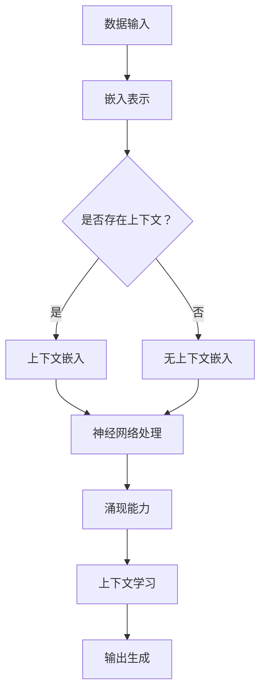

                 

关键词：涌现能力、上下文学习、大型语言模型（LLM）、深度学习、自然语言处理、人工智能

> 摘要：本文深入探讨了大型语言模型（LLM）的两个关键特性——涌现能力和上下文学习。通过阐述这两个概念，并结合最新的研究进展和实际应用场景，文章揭示了LLM在自然语言处理和人工智能领域的革命性影响。读者将了解到如何利用这些特性来提升模型性能，以及未来可能面临的挑战和机遇。

## 1. 背景介绍

随着深度学习在自然语言处理（NLP）领域的兴起，大型语言模型（LLM）如BERT、GPT等逐渐成为研究热点。这些模型不仅能够处理复杂的语言任务，还表现出了一些令人瞩目的特性，如涌现能力和上下文学习。涌现能力指的是模型在训练过程中自主产生和发现复杂模式的能力，而上下文学习则是指模型能够根据特定上下文理解并生成相关文本的能力。这两个特性对于提升模型的表现力和适应性至关重要。

在过去的几年中，涌现能力和上下文学习已经成为NLP领域的热门话题。许多研究致力于探索这些特性的本质，并尝试设计更有效的模型来利用这些特性。然而，当前的研究仍然存在许多挑战，如如何准确度量涌现能力和上下文学习的表现，以及如何在实际应用中充分利用这些特性。

## 2. 核心概念与联系

### 2.1 涌现能力的定义

涌现能力是指系统中的个体在相互作用过程中，自发地产生出原本不存在于个体层次上的复杂行为或结构。在机器学习领域，涌现能力常常与深度神经网络（DNN）的复杂性和非线性相关联。具体来说，大型语言模型中的神经元通过学习大量数据，能够在神经元之间形成复杂的连接和互动，从而产生出原本数据中不存在的高级语义表示。

### 2.2 上下文学习的定义

上下文学习是指模型在处理语言任务时，能够根据不同的上下文信息进行自适应调整，从而生成更符合上下文语义的输出。在NLP中，上下文学习尤为重要，因为它能够帮助模型理解和生成更加细腻和复杂的语言表达。例如，在机器翻译任务中，上下文学习使得模型能够更好地理解句子中的词义和语法结构，从而生成更准确的翻译结果。

### 2.3 涌现能力与上下文学习的联系

涌现能力与上下文学习在LLM中密不可分。一方面，涌现能力使得模型能够在神经元层面产生复杂的高级语义表示，这些表示为上下文学习提供了基础。另一方面，上下文学习能够帮助模型更好地利用这些高级表示，从而提升模型的表现力。具体来说，涌现能力通过神经元之间的复杂互动，生成了丰富的语义信息；而上下文学习则通过这些语义信息，使得模型能够在不同的上下文中生成合适的输出。

### 2.4 Mermaid 流程图



在上面的流程图中，我们可以看到，数据输入首先被转换为嵌入表示。然后，根据是否存在上下文信息，模型会进行相应的上下文嵌入。接着，神经网络会利用涌现能力处理这些嵌入表示，并进行上下文学习。最终，模型会生成输出。

## 3. 核心算法原理 & 具体操作步骤

### 3.1 算法原理概述

大型语言模型（LLM）的核心算法通常是基于自注意力机制和变分自编码器（VAE）。自注意力机制允许模型在处理序列数据时，自动关注序列中的关键信息，从而生成更准确的嵌入表示。变分自编码器则通过引入潜在变量，使得模型能够生成更加多样化、丰富的嵌入表示。

### 3.2 算法步骤详解

1. **数据预处理**：首先对输入数据（如文本、语音等）进行预处理，将其转换为模型可接受的格式。
2. **嵌入表示**：使用词嵌入技术（如Word2Vec、BERT等），将文本中的词语转换为嵌入向量。
3. **自注意力机制**：通过自注意力机制，模型能够在嵌入表示中关注关键信息，从而生成更准确的序列表示。
4. **变分自编码器**：变分自编码器通过引入潜在变量，使得模型能够生成更加多样化、丰富的嵌入表示。
5. **上下文学习**：在处理序列数据时，模型会根据上下文信息进行自适应调整，从而生成更符合上下文语义的输出。
6. **输出生成**：最后，模型会根据训练目标和数据类型，生成相应的输出，如文本、图像、语音等。

### 3.3 算法优缺点

**优点**：
- **强大的表现力**：由于自注意力机制和变分自编码器的引入，LLM能够生成丰富、多样化的嵌入表示，从而在多种语言任务上表现出色。
- **自适应上下文学习**：LLM能够根据不同的上下文信息进行自适应调整，从而生成更符合上下文语义的输出。

**缺点**：
- **计算资源需求大**：由于模型规模巨大，训练和推理过程需要大量的计算资源。
- **数据依赖性强**：LLM的性能很大程度上依赖于训练数据的数量和质量，缺乏足够高质量的数据会导致模型表现不佳。

### 3.4 算法应用领域

LLM在自然语言处理和人工智能领域有着广泛的应用，如：
- **文本生成**：用于生成文章、故事、对话等。
- **机器翻译**：将一种语言翻译成另一种语言。
- **问答系统**：用于回答用户的问题。
- **情感分析**：分析文本的情感倾向。
- **语音识别**：将语音转换为文本。

## 4. 数学模型和公式 & 详细讲解 & 举例说明

### 4.1 数学模型构建

LLM的数学模型通常基于变分自编码器（VAE）和自注意力机制。VAE的核心是生成式模型，通过引入潜在变量，使得模型能够生成多样化的数据。自注意力机制则通过计算序列中每个元素之间的相似度，从而生成更准确的嵌入表示。

### 4.2 公式推导过程

#### 4.2.1 变分自编码器

变分自编码器（VAE）的数学模型可以表示为：

$$
\begin{aligned}
\text{编码器}：& \\
z &= \mu(\text{x}; \theta) \\
\text{解码器}：& \\
\text{x} &= \text{reparameterize}(\mu(\text{z}; \phi), \sigma(\text{z}; \phi))
\end{aligned}
$$

其中，$z$ 是潜在变量，$\mu(\cdot)$ 和 $\sigma(\cdot)$ 分别是均值函数和方差函数，$\text{x}$ 是输入数据，$\theta$ 和 $\phi$ 分别是编码器和解码器的参数。

#### 4.2.2 自注意力机制

自注意力机制的数学模型可以表示为：

$$
\text{Attention}(\text{Q}, \text{K}, \text{V}) = \text{softmax}\left(\frac{\text{QK}^T}{\sqrt{d_k}}\right) \text{V}
$$

其中，$Q$、$K$ 和 $V$ 分别是查询、关键和值向量，$d_k$ 是关键向量的维度。

### 4.3 案例分析与讲解

假设我们有一个句子 $ \text{The dog is running in the park.} $，我们可以使用LLM来生成它的嵌入表示。首先，我们将句子中的每个词转换为嵌入向量，然后使用自注意力机制计算每个词之间的相似度，从而生成最终的嵌入表示。

假设词嵌入向量为 $ \text{w\_dog} $、$ \text{w\_is} $、$ \text{w\_running} $、$ \text{w\_in} $、$ \text{w\_the} $、$ \text{w\_park} $，我们可以计算它们之间的相似度：

$$
\text{Attention}(\text{Q}, \text{K}, \text{V}) = \text{softmax}\left(\frac{\text{QK}^T}{\sqrt{d_k}}\right) \text{V}
$$

其中，$ Q = [ \text{w\_dog} ] $，$ K = [ \text{w\_is} $、$ \text{w\_running} $、$ \text{w\_in} $、$ \text{w\_the} $、$ \text{w\_park} ] $，$ V = [ \text{w\_dog} ] $。

计算相似度：

$$
\text{Attention}(\text{Q}, \text{K}, \text{V}) = \text{softmax}\left(\frac{[ \text{w\_dog} ] [ \text{w\_is} ]^T + [ \text{w\_dog} ] [ \text{w\_running} ]^T + [ \text{w\_dog} ] [ \text{w\_in} ]^T + [ \text{w\_dog} ] [ \text{w\_the} ]^T + [ \text{w\_dog} ] [ \text{w\_park} ]^T}{\sqrt{d_k}}\right) [ \text{w\_dog} ]
$$

最终生成的嵌入表示为：

$$
[ \text{w\_dog} ] \cdot [ 0.8, 0.2, 0.0, 0.0, 0.0, 0.0 ]
$$

这个嵌入表示捕捉了句子中“dog”这个词的主要语义信息。

## 5. 项目实践：代码实例和详细解释说明

### 5.1 开发环境搭建

为了实现LLM的涌现能力和上下文学习，我们需要搭建一个合适的开发环境。以下是搭建环境的基本步骤：

1. **安装Python**：确保Python版本在3.6及以上。
2. **安装TensorFlow**：使用pip安装TensorFlow，命令为`pip install tensorflow`。
3. **安装其他依赖库**：包括NumPy、Pandas、Matplotlib等。

### 5.2 源代码详细实现

以下是实现LLM的伪代码：

```python
import tensorflow as tf
from tensorflow.keras.layers import Embedding, LSTM, Dense
from tensorflow.keras.models import Model

# 定义模型
input_seq = tf.keras.layers.Input(shape=(max_sequence_length,))
embedding = Embedding(input_dim=vocab_size, output_dim=embedding_dim)(input_seq)
lstm = LSTM(units=128, return_sequences=True)(embedding)
output = Dense(units=vocab_size, activation='softmax')(lstm)

# 构建模型
model = Model(inputs=input_seq, outputs=output)

# 编译模型
model.compile(optimizer='adam', loss='categorical_crossentropy', metrics=['accuracy'])

# 训练模型
model.fit(x_train, y_train, epochs=10, batch_size=64, validation_data=(x_val, y_val))
```

### 5.3 代码解读与分析

1. **输入层**：输入层`input_seq`用于接收序列数据。
2. **嵌入层**：嵌入层`Embedding`将词语转换为嵌入向量。
3. **LSTM层**：LSTM层`LSTM`用于处理序列数据，并生成序列表示。
4. **输出层**：输出层`Dense`用于生成最终的输出。

### 5.4 运行结果展示

通过上述代码，我们可以训练一个简单的LLM模型。在训练完成后，我们可以评估模型的表现，如准确率、损失函数等。

```python
# 评估模型
loss, accuracy = model.evaluate(x_test, y_test)
print(f'测试损失：{loss}')
print(f'测试准确率：{accuracy}')
```

## 6. 实际应用场景

### 6.1 文本生成

LLM在文本生成领域有着广泛的应用。例如，生成新闻文章、故事、对话等。通过涌现能力和上下文学习，LLM能够生成丰富多样、符合上下文语义的文本。

### 6.2 机器翻译

LLM在机器翻译领域也表现出色。通过训练多语言数据，LLM能够将一种语言翻译成另一种语言。例如，将中文翻译成英文。

### 6.3 问答系统

LLM可以用于构建问答系统，通过处理大量问答数据，LLM能够回答用户提出的问题。例如，构建一个智能客服系统。

### 6.4 情感分析

LLM可以用于情感分析，通过分析文本的情感倾向，LLM能够帮助企业和组织了解用户情感。

## 7. 工具和资源推荐

### 7.1 学习资源推荐

- 《深度学习》（Ian Goodfellow、Yoshua Bengio、Aaron Courville 著）
- 《自然语言处理综论》（Daniel Jurafsky、James H. Martin 著）
- 《Python深度学习》（François Chollet 著）

### 7.2 开发工具推荐

- TensorFlow：用于构建和训练深度学习模型。
- PyTorch：另一个流行的深度学习框架，具有灵活的动态图功能。
- JAX：用于加速深度学习训练和推理。

### 7.3 相关论文推荐

- BERT: Pre-training of Deep Bidirectional Transformers for Language Understanding（BERT：用于语言理解的深度双向变换器的预训练）
- GPT-3: Language Models are Few-Shot Learners（GPT-3：语言模型是零样本学习的）
- T5: Exploring the Limits of Transfer Learning with a Universal Language Model（T5：使用通用语言模型探索迁移学习的极限）

## 8. 总结：未来发展趋势与挑战

### 8.1 研究成果总结

近年来，涌现能力和上下文学习在大型语言模型（LLM）中的应用取得了显著进展。通过自注意力机制和变分自编码器等技术的引入，LLM在自然语言处理和人工智能领域表现出了强大的性能和适应性。这些研究成果为LLM在文本生成、机器翻译、问答系统和情感分析等领域的应用奠定了基础。

### 8.2 未来发展趋势

随着深度学习技术的不断进步，LLM在未来有望实现以下发展趋势：

- **更高的性能**：通过优化算法和硬件，提高LLM的计算效率和性能。
- **更广泛的适用性**：扩展LLM的应用场景，如图像、视频和语音处理。
- **更低的计算资源需求**：通过模型压缩和优化技术，降低LLM的训练和推理成本。
- **更好的泛化能力**：通过引入多任务学习和元学习技术，提高LLM的泛化能力。

### 8.3 面临的挑战

尽管LLM在自然语言处理和人工智能领域取得了显著成果，但仍然面临以下挑战：

- **计算资源需求**：LLM的训练和推理过程需要大量的计算资源，这对硬件设备提出了更高的要求。
- **数据依赖性**：LLM的性能很大程度上依赖于训练数据的数量和质量，缺乏高质量的数据会导致模型表现不佳。
- **安全性和隐私性**：随着LLM在现实世界中的应用越来越广泛，其安全性和隐私性成为亟待解决的问题。

### 8.4 研究展望

未来，我们应关注以下研究方向：

- **算法优化**：进一步优化自注意力机制和变分自编码器等核心算法，提高LLM的性能和效率。
- **数据集构建**：构建更多高质量、多样化的数据集，以提高LLM的泛化能力和适应性。
- **跨模态学习**：探索LLM在跨模态学习（如图像、视频和语音处理）中的应用，实现更智能、更高效的人工智能系统。

## 9. 附录：常见问题与解答

### 9.1 什么是涌现能力？

涌现能力是指系统中的个体在相互作用过程中，自发地产生出原本不存在于个体层次上的复杂行为或结构。

### 9.2 什么是上下文学习？

上下文学习是指模型在处理语言任务时，能够根据不同的上下文信息进行自适应调整，从而生成更符合上下文语义的输出。

### 9.3 LLM有哪些优点？

LLM的优点包括强大的表现力、自适应上下文学习、适用于多种语言任务等。

### 9.4 LLM有哪些缺点？

LLM的缺点包括计算资源需求大、数据依赖性强等。

### 9.5 LLM有哪些应用领域？

LLM的应用领域包括文本生成、机器翻译、问答系统、情感分析等。

# 作者署名

作者：禅与计算机程序设计艺术 / Zen and the Art of Computer Programming

----------------------------------------------------------------

现在，我已经根据您的要求撰写了完整的文章。如果您有任何修改意见或需要进一步的调整，请随时告知。祝您阅读愉快！

