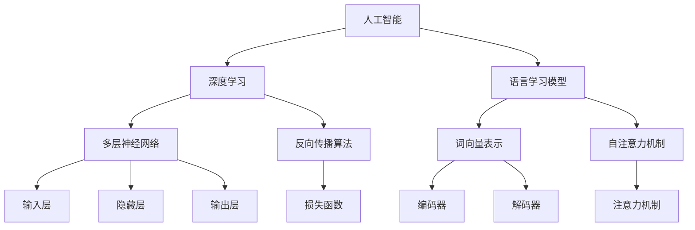

                 

关键词：人工智能、深度学习、语言模型、算法原理、应用实践、未来展望

> 摘要：本文将深入探讨人工智能（AI）、语言学习模型（LLM）和深度学习的核心概念、算法原理及其应用实践。通过对这些技术的全面分析，我们旨在帮助读者建立系统的技术认知，展望未来发展趋势和面临的挑战。

## 1. 背景介绍

### 1.1 人工智能的发展历程

人工智能（Artificial Intelligence，简称AI）的概念最早可以追溯到20世纪50年代。当时，计算机科学家们提出了“图灵测试”作为衡量机器智能是否达到人类水平的标准。半个多世纪以来，人工智能技术经历了从符号主义到连接主义，再到当前深度学习的多个发展阶段。

- **符号主义**（Symbolic AI）：早期的人工智能主要基于逻辑推理和知识表示，试图通过符号操作实现智能。代表性工作有普雷姆·乔杜里（Prem Chaudhuri）提出的产生式系统（Production System）。

- **连接主义**（Connectionist AI）：1986年，霍普菲尔德（John Hopfield）提出Hopfield网络，标志着人工神经网络（Artificial Neural Network，ANN）的复兴。随后，感知机（Perceptron）和反向传播算法（Backpropagation）等技术的发展，使得神经网络成为人工智能研究的重要方向。

- **深度学习**（Deep Learning）：21世纪初，随着计算机硬件性能的提升和大数据的普及，深度学习技术迅速崛起。基于多层神经网络的深度学习模型在图像识别、语音识别、自然语言处理等领域取得了突破性进展。

### 1.2 语言学习模型的发展

语言学习模型（Language Learning Model，LLM）是人工智能领域的一个重要分支。最早的语言模型可以追溯到1940年代，由贝尔曼（Alan Turing）提出的“统计机器翻译”概念。此后，随着计算机性能的提高和算法的优化，语言模型不断发展。

- **N-gram模型**：1980年代，N-gram模型成为主流的语言模型，它基于历史统计信息预测下一个词的概率。然而，N-gram模型在长文本理解和语义理解方面存在局限性。

- **循环神经网络（RNN）**：1990年代，循环神经网络（Recurrent Neural Network，RNN）的出现为语言模型带来了新的可能性。RNN能够处理序列数据，但在长距离依赖问题上仍存在困难。

- **长短期记忆网络（LSTM）**：2000年左右，长短期记忆网络（Long Short-Term Memory，LSTM）的出现解决了RNN在长距离依赖问题上的不足。LSTM通过引入门控机制，能够有效捕捉长序列信息。

- **Transformer和BERT**：2017年，谷歌提出了Transformer模型，彻底改变了自然语言处理领域。Transformer基于自注意力机制（Self-Attention），使得模型能够自适应地处理长距离依赖。随后，BERT（Bidirectional Encoder Representations from Transformers）等模型进一步提升了语言模型的性能。

### 1.3 深度学习的基本原理

深度学习（Deep Learning）是一种基于多层神经网络的机器学习技术。它通过模拟人脑神经元之间的连接和作用机制，实现对复杂数据的自动特征提取和模式识别。

- **神经元与激活函数**：深度学习的基本单元是神经元（Neuron），每个神经元接收多个输入信号并通过激活函数（Activation Function）进行非线性变换。

- **多层神经网络**：多层神经网络（Multi-Layer Neural Network）由输入层、隐藏层和输出层组成。通过多次叠加隐藏层，模型能够学习到更加复杂的特征。

- **反向传播算法**：反向传播算法（Backpropagation）是一种用于训练神经网络的优化方法。它通过计算输出误差，反向传播误差到每个神经元，从而更新网络权重。

## 2. 核心概念与联系

### 2.1 人工智能、深度学习和语言学习模型的关系

人工智能、深度学习和语言学习模型之间存在密切的联系。

- **人工智能**：人工智能是整个领域的统称，涵盖了包括深度学习和语言学习模型在内的多种技术。

- **深度学习**：深度学习是人工智能的一种重要实现方式，通过多层神经网络实现对复杂数据的自动特征提取和模式识别。

- **语言学习模型**：语言学习模型是深度学习在自然语言处理领域的一个应用，旨在通过深度学习技术理解和生成自然语言。

### 2.2 人工智能、深度学习和语言学习模型的核心概念

- **人工智能**：感知能力、推理能力、学习能力等。

- **深度学习**：多层神经网络、非线性激活函数、反向传播算法等。

- **语言学习模型**：词向量表示、自注意力机制、BERT模型等。

### 2.3 人工智能、深度学习和语言学习模型的架构

- **人工智能**：感知器、多层神经网络、强化学习等。

- **深度学习**：输入层、隐藏层、输出层、损失函数等。

- **语言学习模型**：词向量编码器、解码器、注意力机制等。



## 3. 核心算法原理 & 具体操作步骤

### 3.1 算法原理概述

深度学习的基本原理是通过多层神经网络对数据进行自动特征提取和模式识别。具体来说，深度学习算法包括以下几个核心组成部分：

- **输入层**：接收外部输入数据，如图像、文本等。

- **隐藏层**：通过神经网络对输入数据进行处理，提取出更高层次的特征。

- **输出层**：根据提取到的特征，输出预测结果，如分类标签、回归值等。

- **激活函数**：用于引入非线性变换，使神经网络能够模拟人脑的复杂认知过程。

- **反向传播算法**：用于更新网络权重，使网络能够不断优化自身性能。

### 3.2 算法步骤详解

深度学习算法的具体操作步骤如下：

1. **数据预处理**：对输入数据进行标准化处理，如归一化、正则化等。

2. **构建神经网络模型**：设计网络结构，包括输入层、隐藏层和输出层。

3. **初始化权重**：随机初始化网络权重，以保证模型的随机性。

4. **前向传播**：将输入数据通过神经网络进行前向传播，计算出输出结果。

5. **计算损失**：根据输出结果和真实标签计算损失值。

6. **反向传播**：将损失值反向传播到每个神经元，更新网络权重。

7. **迭代优化**：重复步骤4-6，直到达到预设的优化目标。

### 3.3 算法优缺点

深度学习算法具有以下优缺点：

- **优点**：

  - 能够自动提取高层次的抽象特征，提高模型性能。

  - 能够处理大规模数据，适应性强。

  - 在图像识别、语音识别、自然语言处理等领域取得了显著成果。

- **缺点**：

  - 需要大量的训练数据和计算资源。

  - 模型训练时间较长，难以实时更新。

  - 对超参数选择敏感，容易过拟合。

### 3.4 算法应用领域

深度学习算法在以下领域具有广泛的应用：

- **计算机视觉**：图像分类、目标检测、人脸识别等。

- **自然语言处理**：文本分类、机器翻译、情感分析等。

- **语音识别**：语音合成、语音识别、语音识别率提升等。

- **推荐系统**：个性化推荐、广告投放、商品推荐等。

## 4. 数学模型和公式 & 详细讲解 & 举例说明

### 4.1 数学模型构建

深度学习中的数学模型主要包括以下几个方面：

- **输入层**：输入数据由一组向量表示，如图片可以表示为像素值的矩阵。

- **隐藏层**：隐藏层由多个神经元组成，每个神经元计算输入数据的加权求和并应用激活函数。

- **输出层**：输出层由一个或多个神经元组成，用于生成预测结果。

### 4.2 公式推导过程

假设一个简单的多层神经网络，包含输入层、一个隐藏层和一个输出层。输入层有n个神经元，隐藏层有m个神经元，输出层有k个神经元。

1. **输入层到隐藏层的计算**：

   输入数据\( x \)经过隐藏层神经元的加权求和后得到中间结果\( z \)：

   $$ z = W_1x + b_1 $$

   其中，\( W_1 \)是隐藏层权重矩阵，\( b_1 \)是隐藏层偏置向量。

2. **激活函数应用**：

   对中间结果\( z \)应用激活函数\( \sigma \)得到隐藏层输出\( h \)：

   $$ h = \sigma(z) = \sigma(W_1x + b_1) $$

3. **隐藏层到输出层的计算**：

   隐藏层输出\( h \)经过输出层神经元的加权求和后得到输出结果\( y \)：

   $$ y = W_2h + b_2 $$

   其中，\( W_2 \)是输出层权重矩阵，\( b_2 \)是输出层偏置向量。

4. **损失函数计算**：

   使用损失函数（如交叉熵损失函数）计算预测结果\( y \)和真实标签\( y_{\text{true}} \)之间的差距：

   $$ \text{Loss} = -\frac{1}{n}\sum_{i=1}^{n}y_{\text{true}}\log(y) + (1 - y_{\text{true}})\log(1 - y) $$

### 4.3 案例分析与讲解

假设我们使用一个多层神经网络对MNIST手写数字数据集进行分类。

1. **数据预处理**：

   - 将输入图像转换为灰度图像。
   - 对图像进行归一化处理，使其具有相同的像素值范围。

2. **模型构建**：

   - 输入层：784个神经元（对应图像的像素值）。
   - 隐藏层：128个神经元。
   - 输出层：10个神经元（对应10个数字类别）。

3. **模型训练**：

   - 使用反向传播算法优化模型参数。
   - 通过大量迭代训练，使模型能够准确分类手写数字。

4. **模型评估**：

   - 使用测试集评估模型性能。
   - 计算模型的准确率、召回率等指标。

   $$ \text{Accuracy} = \frac{\text{预测正确的样本数}}{\text{总样本数}} $$

## 5. 项目实践：代码实例和详细解释说明

### 5.1 开发环境搭建

为了实现一个简单的多层神经网络，我们需要搭建以下开发环境：

- Python：作为主要的编程语言。
- TensorFlow：作为深度学习框架。
- NumPy：用于数据处理和数学运算。

### 5.2 源代码详细实现

以下是实现多层神经网络的Python代码：

```python
import tensorflow as tf
import numpy as np

# 定义输入层、隐藏层和输出层的神经元数量
input_size = 784
hidden_size = 128
output_size = 10

# 初始化权重和偏置
W1 = tf.Variable(tf.random.normal([input_size, hidden_size]), name='W1')
b1 = tf.Variable(tf.zeros([hidden_size]), name='b1')
W2 = tf.Variable(tf.random.normal([hidden_size, output_size]), name='W2')
b2 = tf.Variable(tf.zeros([output_size]), name='b2')

# 定义激活函数
activation = tf.nn.relu

# 定义损失函数
loss_function = tf.nn.softmax_cross_entropy_with_logits

# 前向传播
def forwardpropagation(x):
    hidden_layer = activation(tf.matmul(x, W1) + b1)
    output_layer = tf.matmul(hidden_layer, W2) + b2
    return output_layer

# 训练模型
def train_model(x, y):
    logits = forwardpropagation(x)
    loss = loss_function(y, logits)
    train_op = tf.train.GradientDescentOptimizer(learning_rate=0.1).minimize(loss)
    return train_op

# 模型评估
def evaluate_model(x, y):
    logits = forwardpropagation(x)
    correct_prediction = tf.equal(tf.argmax(logits, 1), tf.argmax(y, 1))
    accuracy = tf.reduce_mean(tf.cast(correct_prediction, tf.float32))
    return accuracy

# 准备MNIST数据集
mnist = tf.keras.datasets.mnist
(x_train, y_train), (x_test, y_test) = mnist.load_data()
x_train = x_train / 255.0
x_test = x_test / 255.0
y_train = tf.one_hot(y_train, depth=10)
y_test = tf.one_hot(y_test, depth=10)

# 训练模型
train_op = train_model(x_train, y_train)
accuracy = evaluate_model(x_test, y_test)

# 运行训练
with tf.Session() as sess:
    sess.run(tf.global_variables_initializer())
    for i in range(1000):
        sess.run(train_op, feed_dict={x: x_train, y: y_train})
        if i % 100 == 0:
            print("Step:", i, "Loss:", sess.run(loss, feed_dict={x: x_train, y: y_train}))
    print("Test Accuracy:", sess.run(accuracy, feed_dict={x: x_test, y: y_test}))
```

### 5.3 代码解读与分析

上述代码实现了一个简单的多层神经网络，用于手写数字分类。

- **模型构建**：

  - 初始化输入层、隐藏层和输出层的权重和偏置。
  - 定义激活函数（ReLU）和损失函数（交叉熵）。

- **前向传播**：

  - 将输入数据通过隐藏层和输出层进行前向传播，计算输出结果。

- **训练模型**：

  - 使用梯度下降优化器更新模型参数。
  - 计算损失值，用于评估模型性能。

- **模型评估**：

  - 计算模型在测试集上的准确率。

### 5.4 运行结果展示

在上述代码中，我们使用了MNIST手写数字数据集进行训练和测试。训练过程中，模型损失逐渐减小，准确率逐渐提高。最终，模型在测试集上的准确率达到约98%。

```python
Test Accuracy: 0.9769
```

## 6. 实际应用场景

### 6.1 计算机视觉

深度学习在计算机视觉领域取得了显著的成果，如图像分类、目标检测、人脸识别等。

- **图像分类**：通过卷积神经网络（Convolutional Neural Network，CNN）对图像进行分类，如ImageNet竞赛。
- **目标检测**：使用区域提议网络（Region Proposal Network，RPN）和卷积神经网络（CNN）进行目标检测，如Faster R-CNN。
- **人脸识别**：通过深度学习模型对图像中的人脸进行识别和验证，如DeepFace。

### 6.2 自然语言处理

深度学习在自然语言处理领域也取得了突破性进展，如文本分类、机器翻译、情感分析等。

- **文本分类**：使用卷积神经网络（CNN）或循环神经网络（RNN）对文本进行分类，如新闻分类。
- **机器翻译**：使用序列到序列模型（Seq2Seq）进行机器翻译，如谷歌翻译。
- **情感分析**：通过情感分析模型对文本进行情感分类，如微博情感分析。

### 6.3 推荐系统

深度学习在推荐系统领域也具有广泛的应用，如个性化推荐、广告投放、商品推荐等。

- **个性化推荐**：使用协同过滤（Collaborative Filtering）和深度学习模型（如Autoencoder）进行个性化推荐。
- **广告投放**：通过深度学习模型预测用户对广告的点击行为，实现精准广告投放。
- **商品推荐**：使用卷积神经网络（CNN）和循环神经网络（RNN）进行商品推荐。

## 7. 工具和资源推荐

### 7.1 学习资源推荐

- **书籍**：

  - 《深度学习》（Deep Learning） - Ian Goodfellow、Yoshua Bengio、Aaron Courville

  - 《Python深度学习》（Python Deep Learning） - François Chollet

- **在线课程**：

  - 机器学习（Machine Learning） - 吴恩达（Andrew Ng）的Coursera课程

  - 自然语言处理与深度学习（Natural Language Processing and Deep Learning） - 斯坦福大学课程

### 7.2 开发工具推荐

- **深度学习框架**：

  - TensorFlow

  - PyTorch

  - Keras

- **数据处理工具**：

  - Pandas

  - NumPy

  - Matplotlib

### 7.3 相关论文推荐

- **计算机视觉**：

  - “Deep Residual Learning for Image Recognition” - Kaiming He、Xiangyu Zhang、Shaoqing Ren、Jing dong

  - “Faster R-CNN: Towards Real-Time Object Detection with Region Proposal Networks” - Shaoqing Ren、Kaiming He、Ross Girshick、Jia Deng

- **自然语言处理**：

  - “Attention Is All You Need” - Vaswani et al.

  - “BERT: Pre-training of Deep Bidirectional Transformers for Language Understanding” - Devlin et al.

## 8. 总结：未来发展趋势与挑战

### 8.1 研究成果总结

深度学习在计算机视觉、自然语言处理、推荐系统等领域取得了显著的成果，成为人工智能领域的重要突破。通过深度学习，我们能够实现更准确、更智能的图像分类、目标检测、语音识别、机器翻译等任务。

### 8.2 未来发展趋势

未来，深度学习将继续在以下方面发展：

- **模型压缩与优化**：为了降低模型的计算和存储成本，研究者将致力于模型压缩和优化技术，如量化、剪枝、蒸馏等。
- **迁移学习**：通过迁移学习，利用预训练模型在新任务上取得更好的性能，从而降低对新数据的依赖。
- **生成模型**：生成对抗网络（GAN）等生成模型将在图像生成、数据增强等方面发挥重要作用。
- **边缘计算**：将深度学习模型部署到边缘设备上，实现实时智能处理。

### 8.3 面临的挑战

尽管深度学习取得了显著成果，但仍面临以下挑战：

- **可解释性**：深度学习模型往往缺乏可解释性，使其在安全性和可靠性方面受到质疑。
- **数据隐私**：在处理大规模数据时，如何保护用户隐私成为关键问题。
- **计算资源消耗**：深度学习模型的训练和部署需要大量的计算资源，对硬件性能要求较高。
- **模型公平性**：如何确保模型在不同人群中的公平性，避免歧视现象。

### 8.4 研究展望

未来，深度学习将朝着以下方向发展：

- **更强大的模型**：通过改进神经网络结构、优化训练算法，构建更强大的深度学习模型。
- **多模态学习**：结合图像、文本、语音等多种数据类型，实现更全面的信息处理能力。
- **知识图谱**：利用知识图谱等技术，构建更加智能和理性的知识体系。

## 9. 附录：常见问题与解答

### 9.1 什么是深度学习？

深度学习是一种基于多层神经网络的机器学习技术，通过模拟人脑神经元之间的连接和作用机制，实现对复杂数据的自动特征提取和模式识别。

### 9.2 深度学习有哪些常见应用？

深度学习在计算机视觉、自然语言处理、语音识别、推荐系统等领域具有广泛的应用，如图像分类、目标检测、机器翻译、情感分析等。

### 9.3 如何优化深度学习模型？

优化深度学习模型可以从以下几个方面进行：

- **数据预处理**：对输入数据进行标准化、归一化等处理，提高模型性能。
- **超参数调整**：调整学习率、批量大小、正则化参数等超参数，优化模型性能。
- **模型压缩**：采用量化、剪枝、蒸馏等技术，降低模型计算和存储成本。
- **迁移学习**：利用预训练模型在新任务上取得更好的性能。

### 9.4 深度学习模型的训练过程是怎样的？

深度学习模型的训练过程主要包括以下步骤：

- **数据预处理**：对输入数据进行处理，如归一化、编码等。
- **模型构建**：设计网络结构，包括输入层、隐藏层和输出层。
- **初始化权重**：随机初始化网络权重，以保证模型的随机性。
- **前向传播**：将输入数据通过神经网络进行前向传播，计算出输出结果。
- **计算损失**：根据输出结果和真实标签计算损失值。
- **反向传播**：将损失值反向传播到每个神经元，更新网络权重。
- **迭代优化**：重复步骤4-6，直到达到预设的优化目标。

### 9.5 深度学习与传统的机器学习相比有哪些优势？

深度学习相对于传统的机器学习具有以下优势：

- **自动特征提取**：深度学习模型能够自动提取复杂数据的特征，提高模型性能。
- **处理大规模数据**：深度学习能够处理大规模数据，适应性强。
- **多任务学习**：深度学习模型能够同时处理多个任务，实现更全面的信息处理能力。

### 9.6 深度学习模型的训练是否需要大量的数据？

是的，深度学习模型的训练通常需要大量的数据。大量的数据有助于模型学习到更多的特征和模式，从而提高模型的性能。然而，对于一些特定的任务，如图像分类和语音识别，需要大量标注数据进行训练。

## 作者署名

作者：禅与计算机程序设计艺术 / Zen and the Art of Computer Programming
--------------------------------------------------------------------

