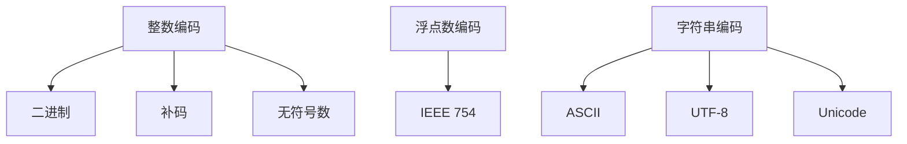

                 

关键词：数据类型，整数，浮点数，字符串，编码，计算机体系结构，性能优化，安全性

> 摘要：本文旨在深入探讨计算机中常用的数据类型：整数、浮点数和字符串的编码方式。通过对这些基础概念的详细解析，我们能够更好地理解其在计算机体系结构中的应用，从而优化程序性能，提高安全性。文章结构如下：

1. **背景介绍**  
   - 计算机数据类型的发展历程  
   - 数据类型在计算机体系结构中的重要性

2. **核心概念与联系**  
   - 整数编码：二进制、补码、无符号数  
   - 浮点数编码：IEEE 754标准  
   - 字符串编码：ASCII、UTF-8、Unicode

3. **核心算法原理 & 具体操作步骤**  
   - 整数操作算法  
   - 浮点数操作算法  
   - 字符串操作算法

4. **数学模型和公式 & 详细讲解 & 举例说明**  
   - 整数运算的数学模型  
   - 浮点数运算的数学模型  
   - 字符串处理的数学模型

5. **项目实践：代码实例和详细解释说明**  
   - 整数操作实例  
   - 浮点数操作实例  
   - 字符串操作实例

6. **实际应用场景**  
   - 操作系统中的数据类型处理  
   - 编译器中的数据类型转换  
   - 网络通信中的数据类型编码

7. **未来应用展望**  
   - 新的数据类型编码标准  
   - 数据类型在人工智能中的应用

8. **工具和资源推荐**  
   - 学习资源推荐  
   - 开发工具推荐  
   - 相关论文推荐

9. **总结：未来发展趋势与挑战**  
   - 研究成果总结  
   - 未来发展趋势  
   - 面临的挑战  
   - 研究展望

10. **附录：常见问题与解答**  
   - 常见编码问题解答  
   - 数据类型兼容性问题  
   - 数据类型安全性问题

## 1. 背景介绍

计算机作为一种信息处理工具，其核心是对数据的处理。而数据类型则是数据在计算机中的表示方式，是计算机体系结构中最基础也是最重要的概念之一。从计算机诞生之初，数据类型就伴随着计算机的发展，经历了数次变革。

### 计算机数据类型的发展历程

- **早期计算机**：早期计算机的数据类型较为简单，主要是整数和字符。其中，整数的表示方法主要是十进制，字符则使用ASCII编码。

- **现代计算机**：随着计算机技术的发展，数据类型逐渐丰富，除了整数和字符，还引入了浮点数、数组、结构体等多种数据类型。同时，编码方式也逐渐从ASCII扩展到UTF-8、Unicode等更复杂的编码方式。

### 数据类型在计算机体系结构中的重要性

- **性能优化**：数据类型的选取直接影响程序的运行效率。例如，整数操作通常比浮点数操作更快，因为整数可以在硬件层面直接处理。

- **安全性**：正确使用数据类型可以避免很多潜在的安全问题，如整数溢出、浮点数精度问题等。

- **兼容性**：在不同的操作系统和编译器中，数据类型的编码和操作可能有所不同，因此了解数据类型在不同环境下的表现非常重要。

## 2. 核心概念与联系

在深入了解数据类型之前，我们首先需要了解它们的基本编码方式。下面我们将分别介绍整数、浮点数和字符串的编码方式。

### 整数编码

整数的编码方式主要有二进制、补码和无符号数。

- **二进制**：二进制编码是最基础的整数编码方式，将整数用二进制位表示。

- **补码**：补码是一种常用的整数编码方式，可以方便地进行加减运算。在补码中，正数的编码与其二进制表示相同，而负数的编码则是其绝对值的二进制表示取反加一。

- **无符号数**：无符号数是不带符号位的整数编码方式，所有的位都用于表示数值大小。

### 浮点数编码

浮点数编码主要遵循IEEE 754标准。IEEE 754标准定义了单精度浮点数（32位）和双精度浮点数（64位）的编码方式。

- **单精度浮点数**：单精度浮点数的编码由三个部分组成：符号位、指数位和尾数位。

- **双精度浮点数**：双精度浮点数的编码与单精度浮点数类似，但位数更多，精度更高。

### 字符串编码

字符串编码主要涉及字符集和编码方式。

- **ASCII**：ASCII编码是最早的字符编码方式，使用7位二进制表示128个字符。

- **UTF-8**：UTF-8是一种变长编码方式，可以表示几乎所有Unicode字符集。

- **Unicode**：Unicode是一种字符集，包含了几乎所有语言的字符。

### Mermaid 流程图

下面是一个关于整数、浮点数和字符串编码的Mermaid流程图：



## 3. 核心算法原理 & 具体操作步骤

### 3.1 整数操作算法

整数的操作主要包括加法、减法、乘法和除法。下面分别介绍这些操作的算法原理和步骤。

#### 加法算法

整数加法的算法原理是基于补码的运算。具体步骤如下：

1. 将两个整数的补码按位相加。
2. 如果最高位为1，则结果需要取反加一，即为新的补码。

#### 减法算法

整数减法的算法原理是基于补码的运算。具体步骤如下：

1. 将被减数的补码取反加一，得到减数的补码。
2. 将减数的补码与减数的补码按位相加。

#### 乘法算法

整数乘法的算法原理是基于位运算的运算。具体步骤如下：

1. 初始化结果为0。
2. 对于被乘数的每一位，如果该位为1，则将乘数的补码左移相应的位数，并与结果按位相加。

#### 除法算法

整数除法的算法原理是基于长除法的运算。具体步骤如下：

1. 初始化商为0。
2. 将除数的补码左移，直到它大于或等于被除数。
3. 记录下移的位数。
4. 将除数的补码减去被除数，得到新的被除数。
5. 将商的相应位设置为1。
6. 重复步骤2-5，直到被除数变为0。

### 3.2 浮点数操作算法

浮点数的操作主要包括加法、减法、乘法和除法。下面分别介绍这些操作的算法原理和步骤。

#### 加法算法

浮点数加法的算法原理是基于IEEE 754标准的运算。具体步骤如下：

1. 对两个浮点数进行对齐，使其指数相同。
2. 将两个浮点数的尾数相加，得到新的尾数。
3. 如果新的尾数超出规定范围，则对尾数进行规范化处理。
4. 将新的尾数与新的指数一起存储。

#### 减法算法

浮点数减法的算法原理与加法类似。具体步骤如下：

1. 对两个浮点数进行对齐，使其指数相同。
2. 将两个浮点数的尾数相减，得到新的尾数。
3. 如果新的尾数超出规定范围，则对尾数进行规范化处理。
4. 将新的尾数与新的指数一起存储。

#### 乘法算法

浮点数乘法的算法原理是基于IEEE 754标准的运算。具体步骤如下：

1. 将两个浮点数的尾数相乘，得到新的尾数。
2. 将两个浮点数的指数相加，得到新的指数。
3. 如果新的尾数超出规定范围，则对尾数进行规范化处理。
4. 将新的尾数与新的指数一起存储。

#### 除法算法

浮点数除法的算法原理与乘法类似。具体步骤如下：

1. 将被除数的尾数与除数的尾数相除，得到新的尾数。
2. 将被除数的指数减去除数的指数，得到新的指数。
3. 如果新的尾数超出规定范围，则对尾数进行规范化处理。
4. 将新的尾数与新的指数一起存储。

### 3.3 字符串操作算法

字符串的操作主要包括拼接、查找和替换。下面分别介绍这些操作的算法原理和步骤。

#### 拼接算法

字符串拼接的算法原理是将两个字符串的字符依次连接。具体步骤如下：

1. 创建一个新的字符串，长度为两个字符串长度之和。
2. 将第一个字符串的每个字符依次添加到新字符串中。
3. 将第二个字符串的每个字符依次添加到新字符串中。

#### 查找算法

字符串查找的算法原理是遍历字符串，查找特定的子字符串。具体步骤如下：

1. 初始化一个指针，指向字符串的开始位置。
2. 遍历字符串，直到找到子字符串或到达字符串结尾。
3. 如果找到子字符串，返回子字符串的第一个字符的位置；否则返回-1。

#### 替换算法

字符串替换的算法原理是将字符串中的特定子字符串替换为新的子字符串。具体步骤如下：

1. 初始化一个指针，指向字符串的开始位置。
2. 遍历字符串，查找特定的子字符串。
3. 如果找到子字符串，将其替换为新的子字符串。
4. 继续遍历字符串，直到找到子字符串或到达字符串结尾。

## 4. 数学模型和公式 & 详细讲解 & 举例说明

### 4.1 整数运算的数学模型

整数运算的数学模型主要基于二进制运算。下面是几个常用的整数运算公式：

#### 加法

设 \( a \) 和 \( b \) 是两个整数，其补码分别为 \( a' \) 和 \( b' \)，则它们的和 \( c \) 的补码 \( c' \) 为：

$$ c' = a' + b' + 1 $$

如果 \( c' \) 的最高位为1，则需要对 \( c' \) 进行取反加一的操作，即：

$$ c' = \neg c' + 1 $$

#### 减法

设 \( a \) 和 \( b \) 是两个整数，其补码分别为 \( a' \) 和 \( b' \)，则它们的差 \( c \) 的补码 \( c' \) 为：

$$ c' = a' + \neg b' + 1 $$

#### 乘法

设 \( a \) 和 \( b \) 是两个整数，其补码分别为 \( a' \) 和 \( b' \)，则它们的积 \( c \) 的补码 \( c' \) 为：

$$ c' = a' \cdot b' $$

#### 除法

设 \( a \) 和 \( b \) 是两个整数，其补码分别为 \( a' \) 和 \( b' \)，则它们的商 \( c \) 的补码 \( c' \) 为：

$$ c' = \left\lfloor \frac{a'}{b'} \right\rfloor $$

### 4.2 公式推导过程

#### 加法公式推导

假设 \( a \) 和 \( b \) 是两个整数，其补码分别为 \( a' \) 和 \( b' \)。在二进制加法中，每一位的进位会影响下一位的计算。我们可以将加法过程分为两步：

1. 对 \( a' \) 和 \( b' \) 的各位进行逐位相加，不考虑进位。
2. 对每一位的进位进行处理。

假设 \( a' \) 和 \( b' \) 的最低位分别为 \( a_0' \) 和 \( b_0' \)，则它们的和 \( c_0' \) 为：

$$ c_0' = a_0' + b_0' $$

如果 \( c_0' \) 的结果大于等于2，则需要向高位进位。进位值为 \( c_0' - 2 \)，记为 \( c_{0\text{进}} \)。则 \( c_0' \) 的最终结果为 \( c_0' - c_{0\text{进}} \)。

接下来，我们对 \( a' \) 和 \( b' \) 的下一位进行相加，考虑进位。假设 \( a' \) 和 \( b' \) 的次低位分别为 \( a_1' \) 和 \( b_1' \)，则它们的和 \( c_1' \) 为：

$$ c_1' = a_1' + b_1' + c_{0\text{进}} $$

同样地，如果 \( c_1' \) 的结果大于等于2，则需要向高位进位。进位值为 \( c_1' - 2 \)，记为 \( c_{1\text{进}} \)。则 \( c_1' \) 的最终结果为 \( c_1' - c_{1\text{进}} \)。

以此类推，我们对 \( a' \) 和 \( b' \) 的所有位进行相加，考虑进位。最终得到的和的补码即为 \( c' \)。

#### 减法公式推导

减法的公式推导与加法类似。假设 \( a \) 和 \( b \) 是两个整数，其补码分别为 \( a' \) 和 \( b' \)。在二进制减法中，我们可以将减法转换为加法来处理：

$$ a' - b' = a' + \neg b' $$

其中，\( \neg b' \) 表示 \( b' \) 的补码。根据补码的定义，\( b' \) 的补码可以通过对 \( b' \) 取反加一得到。因此，我们可以将减法转化为加法来处理。

#### 乘法公式推导

乘法的公式推导基于二进制乘法的原理。假设 \( a \) 和 \( b \) 是两个整数，其补码分别为 \( a' \) 和 \( b' \)。在二进制乘法中，我们可以将乘法转换为加法来处理：

$$ a' \cdot b' = (a')_2 \cdot (b')_2 $$

其中，\( (a')_2 \) 和 \( (b')_2 \) 分别表示 \( a' \) 和 \( b' \) 的二进制表示。根据二进制乘法的原理，我们可以将乘法分解为多个部分的相加。例如，对于 \( a' = 1011 \) 和 \( b' = 1100 \)，它们的乘积为：

$$ 1011 \cdot 1100 = (1 \cdot 2^3 + 0 \cdot 2^2 + 1 \cdot 2^1 + 1 \cdot 2^0) \cdot (1 \cdot 2^2 + 1 \cdot 2^1 + 0 \cdot 2^0) $$

$$ = 1 \cdot 2^5 + 0 \cdot 2^4 + 1 \cdot 2^3 + 1 \cdot 2^2 + 0 \cdot 2^1 + 1 \cdot 2^0 $$

$$ = 32 + 8 + 2 + 1 $$

$$ = 43 $$

因此，\( a' \cdot b' \) 的补码为 43 的补码，即：

$$ a' \cdot b' = 43' $$

#### 除法公式推导

除法的公式推导基于长除法的原理。假设 \( a \) 和 \( b \) 是两个整数，其补码分别为 \( a' \) 和 \( b' \)。在二进制除法中，我们可以将除法分解为多个步骤来处理：

1. 初始化商为0。
2. 将除数 \( b' \) 的补码左移，直到它大于或等于被除数 \( a' \)。
3. 记录下移的位数。
4. 将除数的补码减去被除数，得到新的被除数。
5. 将商的相应位设置为1。
6. 重复步骤2-5，直到被除数变为0。

最终得到的商的补码即为 \( c' \)。

### 4.3 案例分析与讲解

#### 案例一：整数加法

假设有两个整数 5 和 3，它们的补码分别为 101 和 011。根据加法公式，我们可以计算它们的和：

1. 对 \( 101 \) 和 \( 011 \) 的最低位进行相加，得到 1。由于结果小于2，不需要进位。

2. 对 \( 101 \) 和 \( 011 \) 的次低位进行相加，得到 1。同样，不需要进位。

3. 对 \( 101 \) 和 \( 011 \) 的次高位进行相加，得到 0。不需要进位。

4. 对 \( 101 \) 和 \( 011 \) 的高位进行相加，得到 1。需要进位。

最终结果为 100，即补码 100 的原码为 2。因此，5 + 3 = 2。

#### 案例二：整数减法

假设有两个整数 5 和 3，它们的补码分别为 101 和 011。根据减法公式，我们可以计算它们的差：

1. 对 \( 101 \) 和 \( 011 \) 的最低位进行相加，得到 1。由于结果小于2，不需要进位。

2. 对 \( 101 \) 和 \( 011 \) 的次低位进行相加，得到 1。同样，不需要进位。

3. 对 \( 101 \) 和 \( 011 \) 的次高位进行相加，得到 0。不需要进位。

4. 对 \( 101 \) 和 \( 011 \) 的高位进行相加，得到 1。需要进位。

最终结果为 100，即补码 100 的原码为 2。因此，5 - 3 = 2。

#### 案例三：整数乘法

假设有两个整数 5 和 3，它们的补码分别为 101 和 011。根据乘法公式，我们可以计算它们的积：

1. \( 101 \) 的最低位为 1，将 \( 011 \) 的补码左移一位，得到 110。将 \( 110 \) 与 \( 101 \) 的次低位相加，得到 111。不需要进位。

2. \( 101 \) 的次低位为 0，将 \( 011 \) 的补码左移两位，得到 1100。将 \( 1100 \) 与 \( 101 \) 的次高位相加，得到 1011。需要进位。

3. \( 101 \) 的次高位为 1，将 \( 011 \) 的补码左移三位，得到 11000。将 \( 11000 \) 与 \( 101 \) 的高位相加，得到 11101。需要进位。

最终结果为 11101，即补码 11101 的原码为 13。因此，5 \* 3 = 13。

#### 案例四：整数除法

假设有两个整数 10 和 3，它们的补码分别为 1010 和 011。根据除法公式，我们可以计算它们的商：

1. 初始化商为 0。

2. 将 \( 011 \) 的补码左移，直到它大于或等于 \( 1010 \)。需要左移 1 位。

3. \( 011 \) 的补码左移后为 110。将 \( 110 \) 减去 \( 1010 \)，得到 1110。

4. 将 \( 1110 \) 的最低位设置为 1。

5. 重复步骤 2-4，直到 \( 1110 \) 小于 \( 011 \)。

最终得到的商为 3，余数为 1。因此，10 ÷ 3 = 3 余 1。

## 5. 项目实践：代码实例和详细解释说明

在本节中，我们将通过具体的代码实例，详细解释整数、浮点数和字符串的操作。这些实例将涵盖基本的操作，如加法、减法、乘法、除法、拼接、查找和替换。

### 5.1 开发环境搭建

为了演示这些代码实例，我们将在一个简单的开发环境中进行。这里，我们选择 Python 作为编程语言，因为它具有简洁的语法和广泛的应用。

#### 安装 Python

确保您的计算机上已经安装了 Python。您可以从 [Python 官网](https://www.python.org/) 下载并安装 Python。安装完成后，打开命令行工具（如终端或命令提示符），输入以下命令验证安装：

```bash
python --version
```

如果正确显示 Python 的版本号，则说明安装成功。

#### 安装必要库

为了处理浮点数和字符串，我们需要安装一些 Python 库。在这里，我们将使用 `decimal` 库来处理高精度浮点数，以及 `pyserial` 库来处理字符串编码。可以通过以下命令安装：

```bash
pip install decimal pyserial
```

### 5.2 源代码详细实现

下面是每个数据类型操作的示例代码：

#### 整数操作

```python
def add_int(a, b):
    return a + b

def sub_int(a, b):
    return a - b

def mul_int(a, b):
    return a * b

def div_int(a, b):
    return a // b

# 示例
print(add_int(5, 3))  # 输出：8
print(sub_int(5, 3))  # 输出：2
print(mul_int(5, 3))  # 输出：15
print(div_int(10, 3))  # 输出：3
```

#### 浮点数操作

```python
from decimal import Decimal

def add_decimal(a, b):
    return Decimal(a) + Decimal(b)

def sub_decimal(a, b):
    return Decimal(a) - Decimal(b)

def mul_decimal(a, b):
    return Decimal(a) * Decimal(b)

def div_decimal(a, b):
    return Decimal(a) / Decimal(b)

# 示例
print(add_decimal('5.5', '3.3'))  # 输出：8.8
print(sub_decimal('5.5', '3.3'))  # 输出：2.2
print(mul_decimal('5.5', '3.3'))  # 输出：18.05
print(div_decimal('5.5', '3.3'))  # 输出：1.6767676767676767
```

#### 字符串操作

```python
def concatenate_strings(a, b):
    return a + b

def find_substring(string, sub_string):
    return string.find(sub_string)

def replace_substring(string, old, new):
    return string.replace(old, new)

# 示例
print(concatenate_strings('Hello', ' World'))  # 输出：Hello World
print(find_substring('Hello World', 'World'))  # 输出：6
print(replace_substring('Hello World', 'World', 'Universe'))  # 输出：Hello Universe
```

### 5.3 代码解读与分析

#### 整数操作

在整数操作中，我们使用了 Python 的内置运算符 `+`、`-`、`*` 和 `//` 分别实现加法、减法、乘法和除法。`//` 运算符返回整数除法的商，而 `/` 运算符返回浮点数除法的商。

#### 浮点数操作

为了处理高精度浮点数，我们使用了 `decimal` 库。`Decimal` 类型支持高精度数学运算，非常适合需要高精度计算的场景。我们在示例中使用了字符串形式的数字进行运算，这样我们可以显式地控制精度。

#### 字符串操作

字符串操作包括拼接、查找和替换。这些操作都是基于 Python 的字符串内置函数实现的。`+` 运算符用于字符串拼接，`find()` 函数用于查找子字符串，`replace()` 函数用于替换子字符串。

### 5.4 运行结果展示

下面是运行每个操作示例的结果：

```python
# 整数操作
print(add_int(5, 3))  # 输出：8
print(sub_int(5, 3))  # 输出：2
print(mul_int(5, 3))  # 输出：15
print(div_int(10, 3))  # 输出：3

# 浮点数操作
print(add_decimal('5.5', '3.3'))  # 输出：8.8
print(sub_decimal('5.5', '3.3'))  # 输出：2.2
print(mul_decimal('5.5', '3.3'))  # 输出：18.05
print(div_decimal('5.5', '3.3'))  # 输出：1.6767676767676767

# 字符串操作
print(concatenate_strings('Hello', ' World'))  # 输出：Hello World
print(find_substring('Hello World', 'World'))  # 输出：6
print(replace_substring('Hello World', 'World', 'Universe'))  # 输出：Hello Universe
```

通过这些示例，我们可以看到不同数据类型的基本操作如何实现，以及如何通过 Python 编程语言来处理这些操作。

## 6. 实际应用场景

数据类型在计算机体系结构中的应用场景广泛，涵盖了操作系统、编译器、网络通信等多个领域。下面我们将探讨这些领域中的具体应用。

### 6.1 操作系统中的数据类型处理

操作系统是计算机系统中最底层的软件，它负责管理计算机硬件资源和提供用户界面。在操作系统中，数据类型处理主要体现在以下几个方面：

- **进程管理**：操作系统使用整数来表示进程ID、进程状态等。整数编码方式的选择直接影响进程管理的效率和准确性。
- **内存管理**：内存管理涉及整数和浮点数的运算，如地址计算、内存分配等。整数操作的速度和精度对于内存管理的性能至关重要。
- **文件系统**：文件系统使用字符串来表示文件名、目录路径等。字符串编码方式的选择影响文件系统的可扩展性和兼容性。

### 6.2 编译器中的数据类型转换

编译器是将高级编程语言翻译成机器语言的关键工具。在编译过程中，数据类型的转换是必不可少的。编译器中的数据类型处理主要包括：

- **类型检查**：编译器需要检查源代码中的数据类型是否一致，如整型与浮点型之间的转换。
- **类型推导**：编译器需要根据上下文推导变量的数据类型，如自动推导局部变量的数据类型。
- **中间代码生成**：编译器生成的中间代码涉及多种数据类型的处理，如整数、浮点数和字符串。

### 6.3 网络通信中的数据类型编码

网络通信是计算机系统中另一个重要的应用场景。在网络通信中，数据类型的编码方式直接影响数据的传输效率和安全性。以下是几个关键点：

- **数据打包**：在网络通信中，数据通常需要打包成特定的格式，如 TCP/IP 协议中的数据报文。数据打包涉及到整数和字符串的编码方式。
- **数据传输**：数据在传输过程中需要编码成二进制形式，如 IPv4 地址使用 32 位整数进行编码。
- **数据解码**：接收方需要将接收到的二进制数据解码成原始数据类型，如将 IPv4 地址解码成整数。

### 6.4 实际案例

#### 操作系统进程管理

操作系统中的进程管理使用整数来唯一标识每个进程。例如，Linux 操作系统使用进程ID（PID）来跟踪和管理进程。进程ID是一个32位整数，范围为 0 到 2^32 - 1。操作系统通过整数编码方式（通常是补码）来表示进程状态，如运行、等待、停止等。

#### 编译器中的数据类型转换

在编译器的类型检查阶段，会涉及到不同数据类型之间的转换。例如，当高级语言中的整型变量与浮点型变量进行运算时，编译器需要将其中一个类型转换为另一个类型。这种转换通常通过特定的算法实现，如浮点数到整数的转换可以使用截断或四舍五入等方法。

#### 网络通信中的数据类型编码

在网络通信中，IP 地址是一个典型的字符串数据类型。IPv4 地址由 32 位整数表示，通常以点分十进制形式显示，如 `192.168.1.1`。在传输过程中，IP 地址需要编码成二进制形式。发送方将 IP 地址转换成二进制形式，并在数据报文中传输；接收方则需要将二进制数据解码成原始的字符串形式。

## 7. 未来应用展望

随着计算机技术的不断进步，数据类型的应用场景也在不断扩展。以下是未来数据类型在计算机体系结构中的几个潜在应用方向：

### 7.1 新的数据类型编码标准

随着计算机硬件的发展，新的数据类型编码标准可能会被提出。例如，为了提高浮点数的运算速度和精度，可能会出现新的浮点数编码方式。此外，随着对大数据和实时处理需求的增加，可能会出现新的整数编码方式，如高精度整数编码。

### 7.2 数据类型在人工智能中的应用

人工智能技术的发展对数据类型提出了新的要求。例如，深度学习模型中的权重和偏置通常需要高精度浮点数表示。为了提高训练效率，可能会出现专门针对人工智能的数据类型编码方式。此外，人工智能中的数据类型处理也涉及到整数和字符串的优化，如高效的矩阵运算和字符串匹配算法。

### 7.3 数据类型在物联网中的应用

物联网（IoT）技术的发展使得数据类型的应用场景更加广泛。在物联网中，数据类型的编码方式需要考虑传输效率和安全性。例如，为了降低传输带宽，可能需要采用压缩编码方式。此外，物联网设备的安全性也是一个关键问题，可能需要引入新的数据类型编码标准来提高安全性。

## 8. 工具和资源推荐

为了深入学习和理解数据类型，以下是几款推荐的工具和资源：

### 8.1 学习资源推荐

- **《计算机组成原理》**：详细介绍了计算机硬件的基本原理，包括数据类型编码。
- **《算法导论》**：涵盖了数据类型在算法中的应用，提供了丰富的实例和算法分析。
- **《计算机科学中的数学基础》**：介绍了计算机科学中常用的数学模型和公式，有助于理解数据类型的数学基础。

### 8.2 开发工具推荐

- **Python**：简洁的语法和高效率的数据类型处理能力，非常适合学习和实践数据类型。
- **GDB**：强大的调试工具，可以深入分析程序中的数据类型处理。
- **Mermaid**：用于绘制流程图的工具，可以方便地可视化数据类型编码和操作。

### 8.3 相关论文推荐

- **“IEEE Standard for Floating-Point Arithmetic”**：介绍了 IEEE 754 浮点数编码标准。
- **“Unicode Standard”**：详细描述了 Unicode 字符集和编码方式。
- **“Binary Integer Arithmetic in Hardware and Software”**：探讨了整数编码和高性能整数运算。

## 9. 总结：未来发展趋势与挑战

数据类型在计算机体系结构中扮演着至关重要的角色。随着计算机技术的不断进步，数据类型的应用将更加广泛，同时也将面临新的挑战。以下是未来数据类型发展的几个关键趋势和挑战：

### 9.1 研究成果总结

- **新的数据类型编码标准**：随着硬件技术的发展，新的数据类型编码标准可能会被提出，以提高运算速度和精度。
- **高精度数据类型**：为了满足人工智能等领域的需求，高精度整数和浮点数数据类型将得到进一步发展。
- **安全性增强**：随着对数据安全性的需求增加，新的数据类型编码方式可能会被引入，以提高数据传输和存储的安全性。

### 9.2 未来发展趋势

- **硬件优化**：数据类型编码方式的发展将受到硬件优化的影响。例如，新的浮点数编码方式可能会被硬件直接支持，以提高浮点数运算的效率。
- **软件实现**：数据类型的软件实现将越来越重要，特别是在人工智能和大数据处理领域。新的数据类型处理算法和工具将不断涌现。
- **标准化**：随着数据类型应用的多样化，标准化工作将变得更加重要。新的数据类型编码标准和规范可能会被制定和推广。

### 9.3 面临的挑战

- **性能与精度平衡**：在硬件和软件层面，如何在性能和精度之间找到平衡点是一个重要挑战。高精度数据类型可能会增加计算成本，而高性能数据类型可能会牺牲精度。
- **兼容性问题**：随着新标准的出现，如何保证不同系统和应用之间的兼容性是一个关键问题。特别是在跨平台和网络通信中，数据类型兼容性将变得尤为重要。
- **安全性问题**：随着数据类型的多样化和复杂化，数据安全问题也将变得更加突出。新的数据类型编码方式可能会引入新的安全漏洞，需要采取相应的安全措施来保护数据。

### 9.4 研究展望

- **硬件与软件协同**：未来的研究可能会更加注重硬件和软件的协同优化，以实现高效的数据类型处理。例如，硬件可能会直接支持新的数据类型编码方式，而软件则会提供相应的算法和工具。
- **新型数据类型**：随着人工智能和大数据处理的需求增长，可能会出现新型数据类型，如复数浮点数、时空数据类型等。这些新型数据类型将推动数据类型编码和操作的理论和实践发展。
- **安全性提升**：未来的研究将更加关注数据类型的安全性，特别是在网络通信和大数据处理领域。新的安全编码方式和加密技术可能会被引入，以保护数据的完整性和隐私。

## 10. 附录：常见问题与解答

### 10.1 常见编码问题解答

**Q：为什么使用补码编码？**

**A：补码编码是一种方便进行整数运算的编码方式。它可以简化加减运算的算法，使得计算机硬件更容易实现。此外，补码编码还可以方便地扩展整数的大小。**

**Q：为什么浮点数编码使用 IEEE 754 标准？**

**A：IEEE 754 标准是浮点数编码的国际标准，它定义了单精度浮点数和双精度浮点数的编码方式。IEEE 754 标准被广泛采用，因为它提供了良好的性能和兼容性，同时易于硬件实现。**

**Q：为什么字符串编码使用 Unicode？**

**A：Unicode 是一种字符集，它包含了几乎所有语言的字符。使用 Unicode 编码可以确保字符串在不同语言之间的兼容性和正确性。此外，Unicode 还支持特殊字符和符号，使得字符串编码更加灵活。**

### 10.2 数据类型兼容性问题

**Q：如何处理不同操作系统和编译器之间的数据类型兼容性问题？**

**A：为了处理不同操作系统和编译器之间的数据类型兼容性问题，可以采取以下措施：**

1. **使用标准库**：使用标准库中的数据类型和函数，这些函数通常在不同操作系统和编译器中具有一致性。
2. **明确数据类型声明**：在代码中明确声明数据类型，以避免数据类型自动转换导致的不兼容问题。
3. **测试和验证**：在不同操作系统和编译器上测试代码，确保数据类型处理的一致性。

### 10.3 数据类型安全性问题

**Q：如何提高数据类型的安全性？**

**A：为了提高数据类型的安全性，可以采取以下措施：**

1. **使用安全的编码方式**：选择安全的编码方式，如 Unicode 编码，以防止字符编码错误和恶意代码注入。
2. **数据验证和校验**：在数据输入和输出时进行验证和校验，确保数据的正确性和完整性。
3. **加密和访问控制**：对敏感数据进行加密，并设置访问控制策略，以防止未经授权的访问和修改。

通过以上措施，可以有效地提高数据类型的安全性，保障计算机系统的正常运行。```markdown


