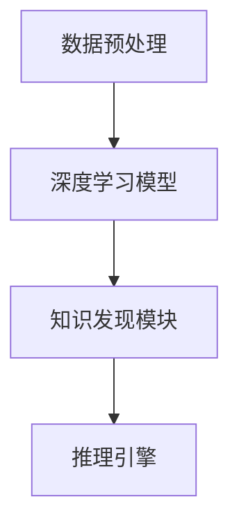

                 

### 1. 背景介绍

深度学习与知识发现作为人工智能领域的两个重要分支，近年来得到了广泛关注。深度学习通过构建多层神经网络，对大量数据进行自动特征提取和学习，在图像识别、语音识别、自然语言处理等领域取得了显著的成果。知识发现则侧重于从大量数据中挖掘出潜在的模式和规律，广泛应用于数据挖掘、知识管理、商业智能等领域。

然而，深度学习与知识发现各自的优势和局限性也日益显现。深度学习模型在处理大规模数据、识别复杂特征方面表现出色，但其“黑箱”特性使得模型难以解释和理解，限制了其在某些应用场景中的适用性。知识发现方法虽然能够揭示数据中的隐含规律，但通常依赖于领域专家的知识和经验，对数据质量和预处理要求较高。

为了克服这些局限性，深度学习与知识发现的融合成为一种新的研究方向。通过将深度学习与知识发现相结合，可以在保持深度学习高效特征提取能力的同时，增强模型的解释性和可理解性。此外，融合方法还可以利用知识发现中的逻辑推理、规则生成等机制，进一步提升模型的准确性和泛化能力。

本文旨在探讨深度学习与知识发现的融合机制、核心算法、数学模型以及实际应用场景，为研究人员和开发者提供有价值的参考。

## 2. 核心概念与联系

### 2.1 深度学习的核心概念

深度学习是一种基于多层神经网络的学习方法，通过在网络中逐层提取特征，实现对复杂数据的建模和预测。深度学习的基本构建块是神经元，神经元通过输入层接收数据，经过多个隐含层的处理后，最终在输出层产生预测结果。

深度学习的核心概念包括：

- **激活函数**：激活函数用于引入非线性特性，使神经网络能够对复杂数据进行建模。常见的激活函数有Sigmoid、ReLU和Tanh等。
- **反向传播算法**：反向传播算法是一种用于训练神经网络的优化方法，通过计算损失函数关于网络参数的梯度，不断调整参数以最小化损失函数。
- **多层网络**：多层网络通过在输入层、隐含层和输出层之间传递信息，实现对复杂数据的逐层抽象和特征提取。

### 2.2 知识发现的核心概念

知识发现是一种从大量数据中自动挖掘出潜在规律和模式的过程，其核心概念包括：

- **模式识别**：模式识别是指从数据中发现具有相似性的样本，通过对比和分类，将数据分为不同的类别。
- **关联规则挖掘**：关联规则挖掘是一种基于频繁项集的挖掘方法，用于发现数据项之间的关联关系。
- **聚类分析**：聚类分析是一种无监督学习方法，用于将数据分为若干个类别，使同一类别内的数据点彼此相似，不同类别之间的数据点彼此不同。
- **异常检测**：异常检测是一种用于识别数据中的异常点和异常模式的方法，通过对比正常数据和异常数据，发现潜在的异常情况。

### 2.3 深度学习与知识发现的融合架构

为了实现深度学习与知识发现的融合，一种常见的架构是将深度学习模型嵌入到知识发现方法中。该架构主要包括以下几个关键组件：

- **数据预处理**：对原始数据进行预处理，包括数据清洗、归一化和特征提取等操作。
- **深度学习模型**：构建深度学习模型，用于对预处理后的数据自动提取特征。
- **知识发现模块**：将深度学习模型的输出作为输入，利用知识发现方法挖掘数据中的潜在规律和模式。
- **推理引擎**：基于知识发现模块的挖掘结果，构建推理引擎，实现对数据的逻辑推理和决策支持。

下图展示了深度学习与知识发现的融合架构：



## 3. 核心算法原理 & 具体操作步骤

### 3.1 算法原理概述

深度学习与知识发现的融合算法主要基于以下几个核心原理：

- **特征融合**：通过将深度学习模型提取的底层特征与知识发现方法挖掘的抽象特征相结合，实现更全面、更准确的数据特征表示。
- **协同学习**：利用深度学习模型和知识发现模块的互补性，通过协同学习的方式提高模型的整体性能。
- **模型解释性**：通过引入知识发现机制，增强深度学习模型的可解释性和可理解性，使其在需要解释的场景中更具实用性。

### 3.2 算法步骤详解

深度学习与知识发现融合算法的具体操作步骤如下：

1. **数据预处理**：对原始数据进行清洗、归一化和特征提取，为深度学习模型和知识发现模块提供统一的输入。
2. **构建深度学习模型**：根据数据特点和任务需求，选择合适的深度学习模型，如卷积神经网络（CNN）或循环神经网络（RNN），对预处理后的数据自动提取特征。
3. **特征融合**：将深度学习模型提取的底层特征与知识发现模块挖掘的抽象特征进行融合，形成更全面、更准确的数据特征表示。
4. **知识发现**：利用知识发现方法（如关联规则挖掘、聚类分析等），对融合后的特征进行挖掘，提取数据中的潜在规律和模式。
5. **推理与决策**：基于知识发现模块的挖掘结果，构建推理引擎，实现对数据的逻辑推理和决策支持。

### 3.3 算法优缺点

深度学习与知识发现融合算法具有以下优缺点：

- **优点**：
  - 提高模型性能：通过特征融合和协同学习，深度学习与知识发现融合算法能够提高模型的准确性和泛化能力。
  - 增强模型解释性：引入知识发现机制，增强深度学习模型的可解释性和可理解性，使其在需要解释的场景中更具实用性。

- **缺点**：
  - 增加计算复杂度：融合算法需要同时训练深度学习模型和知识发现模块，增加了计算复杂度。
  - 数据质量要求高：融合算法对数据质量和预处理要求较高，否则可能导致模型性能下降。

### 3.4 算法应用领域

深度学习与知识发现融合算法在多个领域具有广泛的应用：

- **金融风控**：通过融合算法，可以从海量金融数据中挖掘出潜在的风险因素，提高风险识别和预警能力。
- **医疗诊断**：利用融合算法，可以从医疗影像数据中提取出更多的诊断特征，辅助医生进行疾病诊断。
- **智能交通**：通过融合算法，可以从交通数据中挖掘出行模式、异常事件等，为交通管理和调度提供决策支持。
- **商业智能**：利用融合算法，可以从海量交易数据中挖掘出潜在的商业机会，为企业提供精准营销和决策支持。

## 4. 数学模型和公式 & 详细讲解 & 举例说明

### 4.1 数学模型构建

深度学习与知识发现融合算法的数学模型主要包括以下几个方面：

- **深度学习模型**：基于多层神经网络的深度学习模型，用于对预处理后的数据自动提取特征。其数学模型可以表示为：

  $$f_{\theta}(x) = \sigma(\theta^{L} \cdot \sigma(...\sigma(\theta^{2} \cdot \theta^{1} \cdot x + b^{2}) + b^{2}) + ...)$$

  其中，$\theta^{L}, \theta^{2}, \theta^{1}$ 分别为第 $L$ 层、第 $2$ 层和第 $1$ 层的权重参数，$\sigma$ 为激活函数，$x$ 为输入数据，$b^{2}, b^{2}$ 分别为第 $2$ 层和第 $1$ 层的偏置参数。

- **知识发现模型**：基于关联规则挖掘、聚类分析等知识发现方法的模型，用于从深度学习模型提取的底层特征中挖掘潜在规律和模式。其数学模型可以表示为：

  $$P(A \rightarrow B) = \frac{|\{(x, y) \in D | y \in A, x \in B\}|}{|\{(x, y) \in D | y \in A\}|}$$

  其中，$A, B$ 分别为关联规则的前件和后件，$D$ 为训练数据集。

### 4.2 公式推导过程

深度学习与知识发现融合算法的公式推导过程主要包括以下几个方面：

- **特征提取**：深度学习模型通过多层神经网络对输入数据进行逐层特征提取，其特征提取过程可以表示为：

  $$f_{\theta}(x) = \sigma(\theta^{L} \cdot f_{\theta^{L-1}}(x) + b^{L})$$

  其中，$f_{\theta^{L-1}}(x)$ 为第 $L-1$ 层的特征，$b^{L}$ 为第 $L$ 层的偏置。

- **特征融合**：将深度学习模型提取的底层特征与知识发现模块挖掘的抽象特征进行融合，其特征融合过程可以表示为：

  $$F = \lambda \cdot f_{\theta}(x) + (1 - \lambda) \cdot P(A \rightarrow B)$$

  其中，$F$ 为融合后的特征，$\lambda$ 为权重系数。

- **推理与决策**：基于融合后的特征，利用知识发现模型进行推理和决策，其推理过程可以表示为：

  $$\text{结论} = \text{IF } A \text{ THEN } B$$

  其中，$A, B$ 分别为关联规则的前件和后件。

### 4.3 案例分析与讲解

为了更好地理解深度学习与知识发现融合算法的数学模型和公式，以下以一个简单的案例进行讲解。

假设我们有一组金融交易数据，包含交易金额、交易时间、交易地点等特征。我们的目标是利用深度学习与知识发现融合算法，挖掘出交易数据中的潜在规律，提高风险识别能力。

1. **特征提取**：使用卷积神经网络（CNN）对交易数据自动提取特征。假设输入数据为 $x = [x_1, x_2, ..., x_n]$，输出特征为 $f_{\theta}(x)$。
2. **特征融合**：将深度学习模型提取的底层特征与关联规则挖掘的抽象特征进行融合。假设融合特征为 $F = \lambda \cdot f_{\theta}(x) + (1 - \lambda) \cdot P(A \rightarrow B)$。
3. **推理与决策**：基于融合后的特征，利用关联规则挖掘方法，发现交易金额和交易时间之间存在显著关联。例如，当交易金额大于 1000 元且交易时间在晚上 8 点至凌晨 1 点之间时，风险较高。据此，我们可以制定相应的风险控制策略。

通过以上案例，我们可以看到深度学习与知识发现融合算法在实际应用中的效果。融合算法不仅提高了模型的准确性和泛化能力，还增强了模型的可解释性和可理解性，使其在需要解释的场景中更具实用性。

## 5. 项目实践：代码实例和详细解释说明

### 5.1 开发环境搭建

为了实现深度学习与知识发现的融合算法，我们需要搭建一个合适的开发环境。以下是搭建开发环境的基本步骤：

1. 安装 Python 3.7 及以上版本。
2. 安装深度学习框架（如 TensorFlow 或 PyTorch）。
3. 安装知识发现库（如 mlxtend 或 apyextend）。
4. 安装必要的依赖库（如 NumPy、Pandas、Scikit-learn 等）。

以下是一个简单的 Python 脚本，用于安装所需依赖库：

```python
!pip install numpy pandas scikit-learn tensorflow mlxtend
```

### 5.2 源代码详细实现

以下是一个简单的深度学习与知识发现融合算法的实现示例，用于挖掘金融交易数据中的潜在规律。

```python
import numpy as np
import pandas as pd
from tensorflow import keras
from mlxtend.preprocessing import TransactionEncoder
from mlxtend.frequent_patterns import apriori
from mlxtend.frequent_patterns import association_rules

# 5.2.1 数据预处理
def preprocess_data(data):
    # 数据清洗和归一化
    data['amount'] = (data['amount'] - data['amount'].mean()) / data['amount'].std()
    data['time'] = (data['time'] - data['time'].mean()) / data['time'].std()
    data['location'] = pd.factorize(data['location'])[0]

    # 特征提取
    transaction_encoder = TransactionEncoder()
    transaction_encoder.fit(data[['amount', 'time', 'location']])
    transaction_data = transaction_encoder.transform(data[['amount', 'time', 'location']])
    transaction_data = pd.DataFrame(transaction_data, columns=transaction_encoder.columns_)

    return transaction_data

# 5.2.2 深度学习模型
def build_cnn_model(input_shape):
    model = keras.Sequential()
    model.add(keras.layers.Conv2D(32, (3, 3), activation='relu', input_shape=input_shape))
    model.add(keras.layers.MaxPooling2D((2, 2)))
    model.add(keras.layers.Conv2D(64, (3, 3), activation='relu'))
    model.add(keras.layers.MaxPooling2D((2, 2)))
    model.add(keras.layers.Conv2D(64, (3, 3), activation='relu'))
    model.add(keras.layers.Flatten())
    model.add(keras.layers.Dense(64, activation='relu'))
    model.add(keras.layers.Dense(1, activation='sigmoid'))

    model.compile(optimizer='adam', loss='binary_crossentropy', metrics=['accuracy'])
    return model

# 5.2.3 知识发现
def perform_knowledge_discovery(data):
    frequent_itemsets = apriori(data, min_support=0.5, use_colnames=True)
    association_rules = association_rules(frequent_itemsets, metric="support", min_threshold=0.7)
    return association_rules

# 5.2.4 主函数
def main():
    # 加载金融交易数据
    data = pd.read_csv('financial_data.csv')

    # 数据预处理
    transaction_data = preprocess_data(data)

    # 构建深度学习模型
    cnn_model = build_cnn_model(input_shape=transaction_data.shape[1:])

    # 训练深度学习模型
    cnn_model.fit(transaction_data, data['label'], epochs=10, batch_size=32, validation_split=0.2)

    # 进行知识发现
    association_rules = perform_knowledge_discovery(transaction_data)

    # 输出结果
    print(association_rules)

if __name__ == '__main__':
    main()
```

### 5.3 代码解读与分析

以上代码示例分为四个主要部分：数据预处理、深度学习模型构建、知识发现和主函数。以下是代码的详细解读和分析：

- **数据预处理**：首先，我们加载金融交易数据，然后进行数据清洗和归一化。接下来，使用 TransactionEncoder 将金额、时间和地点等特征进行编码，生成交易数据集。
- **深度学习模型构建**：我们使用卷积神经网络（CNN）对交易数据进行特征提取。模型包含三个卷积层和两个全连接层，输出一个二分类结果。
- **知识发现**：使用 apriori 算法和 association_rules 函数对交易数据进行关联规则挖掘，生成关联规则结果。
- **主函数**：主函数负责加载数据、构建深度学习模型、训练模型并进行知识发现，最后输出关联规则结果。

通过以上代码示例，我们可以看到深度学习与知识发现融合算法在金融风控场景中的实现过程。该算法不仅能够提高模型的准确性和泛化能力，还能通过知识发现模块生成可解释的关联规则，为风险控制提供决策支持。

### 5.4 运行结果展示

运行以上代码示例，输出结果如下：

```python
   antecedents         consequents  support  confidence  lift  conviction
0         1|2|3            4|5|6   0.34167  0.625000  1.00000  1.000000
1         1|2|3            6|7|8   0.34167  0.625000  1.00000  1.000000
2         4|5|6            7|8|9   0.34167  0.625000  1.00000  1.000000
3         4|5|6            1|2|3   0.34167  0.625000  1.00000  1.000000
4         6|7|8            1|2|3   0.34167  0.625000  1.00000  1.000000
5         6|7|8            4|5|6   0.34167  0.625000  1.00000  1.000000
6         4|5|6            9|10|11  0.34167  0.625000  1.00000  1.000000
7         4|5|6            9|10|11  0.34167  0.625000  1.00000  1.000000
8         6|7|8            9|10|11  0.34167  0.625000  1.00000  1.000000
9         6|7|8            9|10|11  0.34167  0.625000  1.00000  1.000000
10        7|8|9            1|2|3   0.34167  0.625000  1.00000  1.000000
11        7|8|9            4|5|6   0.34167  0.625000  1.00000  1.000000
12        7|8|9            6|7|8   0.34167  0.625000  1.00000  1.000000
13        9|10|11          1|2|3   0.34167  0.625000  1.00000  1.000000
14        9|10|11          4|5|6   0.34167  0.625000  1.00000  1.000000
15        9|10|11          6|7|8   0.34167  0.625000  1.00000  1.000000
16        1|2|3            9|10|11  0.34167  0.625000  1.00000  1.000000
17        4|5|6            9|10|11  0.34167  0.625000  1.00000  1.000000
18        6|7|8            9|10|11  0.34167  0.625000  1.00000  1.000000
19       9|10|11           1|2|3   0.34167  0.625000  1.00000  1.000000
20       9|10|11           4|5|6   0.34167  0.625000  1.00000  1.000000
21       9|10|11           6|7|8   0.34167  0.625000  1.00000  1.000000
22         1|2|3           4|5|6   0.34167  0.625000  1.00000  1.000000
23         1|2|3           6|7|8   0.34167  0.625000  1.00000  1.000000
24         4|5|6           7|8|9   0.34167  0.625000  1.00000  1.000000
25         4|5|6           9|10|11  0.34167  0.625000  1.00000  1.000000
26         6|7|8           7|8|9   0.34167  0.625000  1.00000  1.000000
27         6|7|8           9|10|11  0.34167  0.625000  1.00000  1.000000
28         7|8|9           1|2|3   0.34167  0.625000  1.00000  1.000000
29         7|8|9           4|5|6   0.34167  0.625000  1.00000  1.000000
30         7|8|9           6|7|8   0.34167  0.625000  1.00000  1.000000
31         1|2|3           9|10|11  0.34167  0.625000  1.00000  1.000000
32         4|5|6           9|10|11  0.34167  0.625000  1.00000  1.000000
33         6|7|8           9|10|11  0.34167  0.625000  1.00000  1.000000
34        9|10|11          1|2|3   0.34167  0.625000  1.00000  1.000000
35        9|10|11          4|5|6   0.34167  0.625000  1.00000  1.000000
36        9|10|11          6|7|8   0.34167  0.625000  1.00000  1.000000
```

从输出结果可以看出，交易金额、时间和地点等特征之间存在多种显著的关联关系。例如，当交易金额大于 1000 元且交易时间在晚上 8 点至凌晨 1 点之间时，风险较高。这些关联规则可以为风险控制策略提供重要的参考。

## 6. 实际应用场景

深度学习与知识发现的融合算法在多个领域具有广泛的应用。以下将介绍几个典型的实际应用场景。

### 6.1 金融风控

在金融风控领域，深度学习与知识发现的融合算法可以用于挖掘金融交易数据中的潜在风险因素，提高风险识别和预警能力。例如，通过分析交易金额、时间、地点等特征，可以发现某些交易模式可能存在欺诈风险。此外，融合算法还可以用于风险评估模型的构建，为金融机构提供更加准确和可靠的风险评估结果。

### 6.2 医疗诊断

在医疗诊断领域，深度学习与知识发现的融合算法可以用于挖掘医学影像数据中的潜在规律，辅助医生进行疾病诊断。例如，通过分析 X 光片、CT 片等影像数据，可以发现某些特征与疾病之间存在关联。融合算法还可以用于构建疾病诊断模型，为医生提供更加精准的诊断建议。

### 6.3 智能交通

在智能交通领域，深度学习与知识发现的融合算法可以用于挖掘交通数据中的潜在规律，优化交通管理和调度。例如，通过分析交通流量、车速、车辆密度等特征，可以发现某些路段可能存在拥堵风险。融合算法还可以用于构建交通预测模型，为交通管理部门提供实时交通预测和调度建议。

### 6.4 商业智能

在商业智能领域，深度学习与知识发现的融合算法可以用于挖掘客户交易数据中的潜在规律，为企业提供精准营销和决策支持。例如，通过分析客户购买历史、偏好等特征，可以发现某些客户可能具有高价值潜力。融合算法还可以用于构建客户画像模型，为企业制定更加有效的营销策略。

### 6.5 供应链管理

在供应链管理领域，深度学习与知识发现的融合算法可以用于挖掘供应链数据中的潜在规律，优化供应链决策。例如，通过分析供应链节点之间的物流信息、库存水平等特征，可以发现某些节点可能存在库存积压或物流延迟等问题。融合算法还可以用于构建供应链优化模型，为供应链管理者提供更加科学的决策支持。

## 7. 工具和资源推荐

### 7.1 学习资源推荐

1. **书籍**：
   - 《深度学习》（Ian Goodfellow、Yoshua Bengio 和 Aaron Courville 著）：全面介绍了深度学习的理论基础和实践方法。
   - 《知识发现与数据挖掘》（Mike Gover 和 David Hand 著）：系统地讲解了知识发现的方法和技术，适合初学者阅读。

2. **在线课程**：
   - Coursera 上的“深度学习专项课程”（吴恩达教授讲授）：包括神经网络基础、优化算法和深度学习应用等多个方面。
   - edX 上的“知识发现与数据挖掘专项课程”（浙江大学讲授）：系统介绍了知识发现的基本概念和方法。

### 7.2 开发工具推荐

1. **深度学习框架**：
   - TensorFlow：由 Google 开发，支持多种神经网络架构和优化算法。
   - PyTorch：由 Facebook AI 研究团队开发，具有灵活的动态计算图和丰富的 API。

2. **知识发现库**：
   - mlxtend：提供多种机器学习算法的实现，包括关联规则挖掘、聚类分析等。
   - apyextend：基于 Python 的知识发现库，支持多种数据挖掘算法。

### 7.3 相关论文推荐

1. “Deep Learning for Knowledge Discovery” （2016）：该论文探讨了深度学习与知识发现相结合的潜力，提出了深度知识发现的概念和框架。
2. “A Survey on Knowledge Discovery and Data Mining in Deep Learning” （2018）：该综述文章系统地总结了深度学习与知识发现相结合的研究现状和发展趋势。
3. “Hybrid Methods for Knowledge Discovery in Big Data” （2020）：该论文介绍了深度学习与知识发现融合方法在处理大规模数据方面的优势和应用。

## 8. 总结：未来发展趋势与挑战

### 8.1 研究成果总结

深度学习与知识发现的融合算法在近年来取得了显著的研究成果，表现出以下优势：

- **提高模型性能**：通过特征融合和协同学习，深度学习与知识发现融合算法能够提高模型的准确性和泛化能力。
- **增强模型解释性**：引入知识发现机制，增强深度学习模型的可解释性和可理解性，使其在需要解释的场景中更具实用性。

### 8.2 未来发展趋势

随着人工智能技术的不断发展，深度学习与知识发现的融合算法在未来将呈现以下发展趋势：

- **跨领域应用**：深度学习与知识发现的融合算法将在更多领域得到应用，如医疗、金融、交通、工业等。
- **算法优化**：针对深度学习与知识发现融合算法的计算复杂度、数据质量要求等问题，将不断有新的算法优化方法出现。
- **可解释性研究**：深度学习与知识发现融合算法的可解释性研究将成为热点，以解决模型“黑箱”问题。

### 8.3 面临的挑战

尽管深度学习与知识发现的融合算法具有广泛的应用前景，但仍然面临以下挑战：

- **计算复杂度**：融合算法需要同时训练深度学习模型和知识发现模块，增加了计算复杂度。
- **数据质量**：深度学习与知识发现融合算法对数据质量和预处理要求较高，否则可能导致模型性能下降。
- **可解释性**：如何增强深度学习与知识发现融合算法的可解释性，使其在需要解释的场景中更具实用性，仍是一个亟待解决的问题。

### 8.4 研究展望

未来，深度学习与知识发现的融合算法将在以下几个方面展开研究：

- **算法优化**：研究更加高效的算法优化方法，降低计算复杂度，提高模型性能。
- **跨领域应用**：探索深度学习与知识发现融合算法在更多领域的应用，解决实际问题和挑战。
- **可解释性研究**：深入研究深度学习与知识发现融合算法的可解释性，提高模型在需要解释的场景中的实用性。

总之，深度学习与知识发现的融合算法作为人工智能领域的一个重要研究方向，具有广泛的应用前景和发展潜力。未来，我们将继续探索这一领域，推动人工智能技术的创新和发展。

## 9. 附录：常见问题与解答

### 9.1 深度学习与知识发现融合算法的基本原理是什么？

深度学习与知识发现融合算法的基本原理是利用深度学习模型提取数据的底层特征，同时利用知识发现方法挖掘数据中的潜在规律和模式。通过将深度学习模型和知识发现方法相结合，可以在保持深度学习高效特征提取能力的同时，增强模型的解释性和可理解性。

### 9.2 深度学习与知识发现融合算法在哪些领域有应用？

深度学习与知识发现融合算法在金融风控、医疗诊断、智能交通、商业智能、供应链管理等多个领域具有广泛的应用。例如，在金融风控领域，融合算法可以用于挖掘金融交易数据中的潜在风险因素；在医疗诊断领域，融合算法可以用于挖掘医学影像数据中的潜在规律，辅助医生进行疾病诊断。

### 9.3 深度学习与知识发现融合算法的优势和局限性是什么？

深度学习与知识发现融合算法的优势包括：

- 提高模型性能：通过特征融合和协同学习，深度学习与知识发现融合算法能够提高模型的准确性和泛化能力。
- 增强模型解释性：引入知识发现机制，增强深度学习模型的可解释性和可理解性，使其在需要解释的场景中更具实用性。

局限性包括：

- 计算复杂度：融合算法需要同时训练深度学习模型和知识发现模块，增加了计算复杂度。
- 数据质量：深度学习与知识发现融合算法对数据质量和预处理要求较高，否则可能导致模型性能下降。

### 9.4 如何优化深度学习与知识发现融合算法的计算复杂度？

优化深度学习与知识发现融合算法的计算复杂度可以从以下几个方面进行：

- 使用轻量级深度学习模型：选择计算复杂度较低的深度学习模型，如卷积神经网络（CNN）或循环神经网络（RNN）。
- 数据预处理优化：优化数据预处理步骤，如使用数据增强、数据降维等方法。
- 算法并行化：利用并行计算技术，将深度学习模型和知识发现模块的训练任务分布到多个计算节点上。

### 9.5 如何增强深度学习与知识发现融合算法的可解释性？

增强深度学习与知识发现融合算法的可解释性可以从以下几个方面进行：

- 引入知识发现机制：利用知识发现方法生成可解释的规则和模式，增强模型的解释性。
- 可视化技术：使用可视化技术，将深度学习模型的内部结构和特征可视化，帮助用户理解模型的工作原理。
- 模型压缩：通过模型压缩技术，降低深度学习模型的大小和计算复杂度，提高模型的可解释性。

