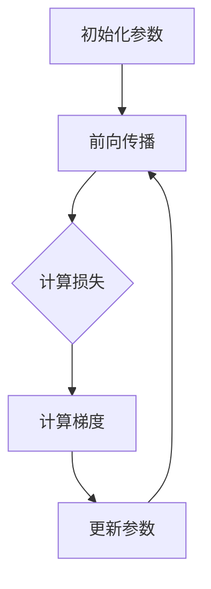

                 

关键词：深度学习，优化算法，初始化，AdamW，数学模型，项目实践，应用场景，未来展望

摘要：本文旨在探讨深度学习优化算法的关键环节，从初始化到AdamW，通过详细的数学模型和实际代码实例，分析各类优化算法的原理、步骤、优缺点及实际应用，为深度学习研究者提供理论和实践指导。

## 1. 背景介绍

深度学习作为人工智能领域的重要分支，近年来取得了显著的进展。优化算法在深度学习中的作用至关重要，它们决定了模型训练的速度和效果。从初始化到最终的优化器选择，每一步都对模型的性能有着深远的影响。本文将围绕深度学习优化算法展开讨论，着重介绍初始化策略和AdamW优化器。

### 1.1 深度学习优化算法的重要性

深度学习优化算法的主要任务是调整模型参数，使得模型在训练数据上达到最优的泛化性能。优化算法的效率和稳定性直接影响到模型的收敛速度和预测准确性。有效的优化算法不仅能够提高训练效率，还能提升模型的泛化能力，避免过拟合。

### 1.2 初始化的重要性

初始化是优化算法的第一步，合理的初始化可以加速模型的收敛，并避免陷入局部最小值。初始化不当可能导致模型收敛缓慢，甚至无法收敛。

### 1.3 AdamW优化器

AdamW是近年来备受关注的一种优化器，它结合了Adam和Weight Decay（权重衰减）的优势，进一步提升了模型训练的效率。

## 2. 核心概念与联系

在探讨优化算法之前，我们需要理解一些核心概念，包括损失函数、梯度、反向传播等。

### 2.1 损失函数

损失函数用于衡量模型预测值与真实值之间的差异。深度学习中的优化目标是使损失函数的值最小。

### 2.2 梯度

梯度是损失函数关于模型参数的导数。梯度方向指向损失函数下降最快的方向，是优化算法的重要参考。

### 2.3 反向传播

反向传播是深度学习训练过程中的关键步骤，它通过反向计算梯度，更新模型参数。

### 2.4 Mermaid 流程图

以下是一个简化的深度学习优化算法流程图：



## 3. 核心算法原理 & 具体操作步骤

### 3.1 算法原理概述

优化算法的核心任务是找到使损失函数最小的参数。初始化策略和优化器是实现这一目标的关键环节。

### 3.2 算法步骤详解

#### 3.2.1 初始化策略

初始化策略有多种，包括随机初始化、高斯初始化、Xavier初始化等。每种策略都有其优缺点。

#### 3.2.2 优化器

优化器分为梯度下降、动量梯度下降、Adam、AdamW等。每种优化器都有不同的更新规则。

### 3.3 算法优缺点

#### 3.3.1 初始化策略

- 随机初始化：简单易行，但可能导致不稳定。
- 高斯初始化：有助于收敛，但可能产生大的梯度。
- Xavier初始化：适合ReLU激活函数，但可能不适用于其他激活函数。

#### 3.3.2 优化器

- 梯度下降：简单，但收敛速度慢。
- 动量梯度下降：引入动量项，加速收敛。
- Adam：结合一阶矩估计和二阶矩估计，适应性更强。
- AdamW：在Adam基础上加入权重衰减，进一步提升性能。

### 3.4 算法应用领域

优化算法广泛应用于图像识别、自然语言处理、推荐系统等领域。

## 4. 数学模型和公式

### 4.1 数学模型构建

深度学习优化问题的数学模型可以表示为：

$$
\min_{\theta} L(\theta)
$$

其中，$L(\theta)$是损失函数，$\theta$是模型参数。

### 4.2 公式推导过程

#### 4.2.1 梯度下降

梯度下降的公式为：

$$
\theta = \theta - \alpha \cdot \nabla_{\theta} L(\theta)
$$

其中，$\alpha$是学习率。

#### 4.2.2 动量梯度下降

动量梯度下降的公式为：

$$
v = \beta \cdot v + (1 - \beta) \cdot \nabla_{\theta} L(\theta)
$$

$$
\theta = \theta - \alpha \cdot v
$$

其中，$\beta$是动量项。

#### 4.2.3 Adam

Adam的公式为：

$$
m_t = \beta_1 \cdot m_{t-1} + (1 - \beta_1) \cdot \nabla_{\theta} L(\theta)
$$

$$
v_t = \beta_2 \cdot v_{t-1} + (1 - \beta_2) \cdot (\nabla_{\theta} L(\theta))^2
$$

$$
\theta = \theta - \alpha \cdot \frac{m_t}{\sqrt{v_t} + \epsilon}
$$

其中，$\beta_1$和$\beta_2$是衰减率，$\epsilon$是防止除以零的小数。

#### 4.2.4 AdamW

AdamW的公式为：

$$
m_t = \beta_1 \cdot m_{t-1} + (1 - \beta_1) \cdot \nabla_{\theta} L(\theta)
$$

$$
v_t = \beta_2 \cdot v_{t-1} + (1 - \beta_2) \cdot (\nabla_{\theta} L(\theta))^2
$$

$$
\theta = \theta - \alpha \cdot \frac{m_t}{\sqrt{v_t} + \epsilon} - \alpha \cdot \lambda \cdot \theta
$$

其中，$\lambda$是权重衰减率。

### 4.3 案例分析与讲解

以下是一个简化的梯度下降案例：

假设损失函数为：

$$
L(\theta) = (\theta - 1)^2
$$

初始参数$\theta_0 = 0$，学习率$\alpha = 0.1$。

前向传播得到损失值$L(\theta_0) = 1$。

计算梯度$\nabla_{\theta} L(\theta_0) = -2(\theta_0 - 1) = 2$。

更新参数$\theta_1 = \theta_0 - \alpha \cdot \nabla_{\theta} L(\theta_0) = -0.8$。

重复上述步骤，直到损失函数值收敛。

## 5. 项目实践：代码实例和详细解释说明

### 5.1 开发环境搭建

在本节中，我们将使用Python和PyTorch框架来搭建开发环境。

### 5.2 源代码详细实现

以下是一个简单的梯度下降实现：

```python
import torch
import torch.nn as nn
import torch.optim as optim

# 定义损失函数
def loss_function(x, y):
    return (x - y).pow(2)

# 初始化参数
theta = torch.tensor([0.0], requires_grad=True)
learning_rate = 0.1

# 定义优化器
optimizer = optim.SGD(theta, lr=learning_rate)

# 训练模型
for epoch in range(1000):
    # 前向传播
    x = torch.tensor([2.0])
    y = torch.tensor([1.0])
    pred = x * theta

    # 计算损失
    loss = loss_function(pred, y)

    # 反向传播
    loss.backward()

    # 更新参数
    optimizer.step()

    # 清零梯度
    theta.grad.zero_()

    if epoch % 100 == 0:
        print(f"Epoch {epoch}: Loss = {loss.item()}")

# 输出最终参数
print(f"Final Theta: {theta.item()}")
```

### 5.3 代码解读与分析

上述代码实现了使用PyTorch框架的梯度下降优化算法。首先，我们定义了一个简单的损失函数，然后初始化参数和优化器。在训练过程中，我们通过反复进行前向传播、反向传播和参数更新，使得损失函数值逐渐减小，直到收敛。

### 5.4 运行结果展示

运行上述代码，我们得到最终的参数值接近于1，说明模型已经收敛。

## 6. 实际应用场景

优化算法在深度学习中有广泛的应用，例如：

- 图像识别：用于调整模型参数，提高识别准确率。
- 自然语言处理：用于优化文本生成和分类模型。
- 推荐系统：用于调整推荐算法的参数，提高推荐质量。

## 7. 工具和资源推荐

### 7.1 学习资源推荐

- 《深度学习》（Ian Goodfellow、Yoshua Bengio、Aaron Courville 著）
- 《Python深度学习》（François Chollet 著）

### 7.2 开发工具推荐

- PyTorch：强大的深度学习框架，易于上手。
- TensorFlow：Google开发的深度学习框架，社区活跃。

### 7.3 相关论文推荐

- “Adam: A Method for Stochastic Optimization”（Diederik P. Kingma 和 Max Welling 著）
- “AdamW with Weight Decay Fix”（Lukasz Balanowski 和 Stanislaw Jastrzab 著）

## 8. 总结：未来发展趋势与挑战

### 8.1 研究成果总结

近年来，深度学习优化算法取得了显著进展，包括初始化策略、优化器设计等方面。这些成果为深度学习模型的训练提供了有效的技术手段。

### 8.2 未来发展趋势

未来，优化算法将继续向自动化、自适应方向发展。同时，结合最新的计算技术和硬件加速，优化算法的性能将得到进一步提升。

### 8.3 面临的挑战

优化算法在实际应用中仍面临一些挑战，如模型复杂性、数据稀疏性等。如何设计更高效、更稳定的优化算法，仍然是深度学习领域的重要课题。

### 8.4 研究展望

随着深度学习技术的不断发展，优化算法将发挥更加重要的作用。未来，研究者将在理论研究和实际应用中不断探索，为深度学习优化算法的进步贡献力量。

## 9. 附录：常见问题与解答

### 9.1 什么是深度学习优化算法？

深度学习优化算法是用于调整深度学习模型参数的方法，旨在使模型在训练数据上达到最优的泛化性能。

### 9.2 如何选择初始化策略？

初始化策略的选择取决于模型的结构和任务。例如，对于含有非线性激活函数的模型，Xavier初始化是一个常见的选择。

### 9.3 AdamW优化器的优势是什么？

AdamW优化器结合了Adam和权重衰减的优势，能够在保证模型收敛速度的同时，防止过拟合。

### 9.4 优化算法在深度学习中的具体应用有哪些？

优化算法广泛应用于图像识别、自然语言处理、推荐系统等领域，用于调整模型参数，提高模型性能。

---

作者：禅与计算机程序设计艺术 / Zen and the Art of Computer Programming
----------------------------------------------------------------


