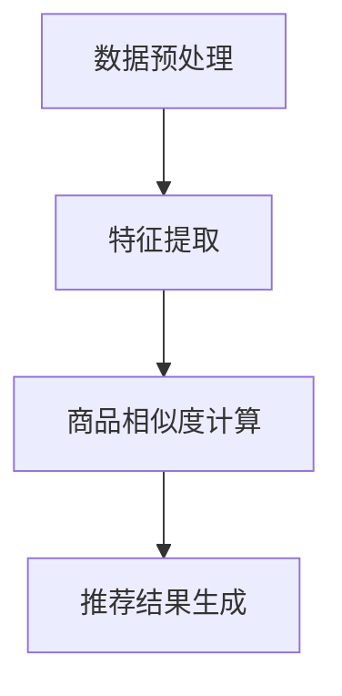

                 

关键词：深度学习、商品相似度、图像识别、推荐系统、算法应用、数学模型

> 摘要：本文将探讨深度学习在商品相似度计算中的应用，通过介绍核心概念、算法原理、数学模型和具体实现，阐述如何利用深度学习技术提升商品推荐系统的准确性和用户体验。

## 1. 背景介绍

在电子商务和推荐系统中，商品相似度计算是一个至关重要的环节。它不仅影响着用户的购物体验，也直接关系到商家的销售业绩。传统的商品相似度计算方法主要依赖于基于特征的匹配算法，如余弦相似度、欧氏距离等。这些方法虽然在一定程度上能够满足需求，但它们往往受到特征提取的局限，难以捕捉商品间的深层关联。

随着深度学习技术的发展，越来越多的研究者开始将深度学习应用于商品相似度计算中。深度学习通过学习大量的商品特征，能够自动发现商品之间的复杂关联，从而提高相似度计算的准确性和鲁棒性。本文将详细介绍深度学习在商品相似度计算中的应用，包括核心概念、算法原理、数学模型和具体实现。

## 2. 核心概念与联系

### 2.1 深度学习基础

深度学习是一种基于多层神经网络的学习方法，其核心思想是通过多层的非线性变换，从原始数据中自动提取特征。深度学习的优越性在于其能够处理高维数据，并且不需要手动提取特征。

### 2.2 商品相似度计算

商品相似度计算是指通过某种度量方法，评估两个商品之间的相似程度。在推荐系统中，商品相似度计算用于找到与用户已购买或偏好的商品相似的未购买商品，从而为用户推荐。

### 2.3 深度学习与商品相似度计算的联系

深度学习通过学习商品的特征表示，能够自动发现商品之间的相似性。与传统的特征匹配方法相比，深度学习能够捕捉到商品间的深层关联，从而提高相似度计算的准确性。

### 2.4 Mermaid 流程图

下面是一个简单的 Mermaid 流程图，展示了深度学习在商品相似度计算中的基本流程：



## 3. 核心算法原理 & 具体操作步骤

### 3.1 算法原理概述

深度学习在商品相似度计算中的核心算法主要是基于卷积神经网络（CNN）和循环神经网络（RNN）。CNN 主要用于提取商品图像的特征，而 RNN 则用于处理商品描述等序列数据。

### 3.2 算法步骤详解

1. 数据预处理：对商品图像和描述数据进行预处理，包括图像缩放、灰度化、数据归一化等。
2. 特征提取：使用 CNN 提取商品图像的特征向量，使用 RNN 提取商品描述的特征向量。
3. 商品相似度计算：通过计算商品特征向量之间的相似度，评估商品之间的相似程度。
4. 推荐结果生成：根据商品相似度计算结果，为用户生成推荐列表。

### 3.3 算法优缺点

**优点**：

- 能够自动提取商品特征，减少人工干预。
- 能够捕捉商品之间的深层关联，提高相似度计算的准确性。
- 能够处理多种类型的数据，如图像、文本等。

**缺点**：

- 需要大量的训练数据，数据集准备时间较长。
- 模型复杂，训练时间较长。
- 对硬件资源要求较高，需要高性能的 GPU。

### 3.4 算法应用领域

深度学习在商品相似度计算中的应用非常广泛，主要包括电子商务、推荐系统、内容推荐等。通过深度学习技术，可以大幅提高商品推荐系统的准确性和用户体验。

## 4. 数学模型和公式 & 详细讲解 & 举例说明

### 4.1 数学模型构建

在商品相似度计算中，深度学习的数学模型主要包括两部分：特征提取模型和相似度计算模型。

**特征提取模型**：

假设我们有 \(n\) 个商品，每个商品的图像和描述分别表示为 \(I_i\) 和 \(D_i\)，其中 \(i = 1, 2, \ldots, n\)。使用 CNN 提取商品图像的特征向量 \(F_i^I\)，使用 RNN 提取商品描述的特征向量 \(F_i^D\)。

**相似度计算模型**：

商品相似度 \(S_{ij}\) 可以通过计算商品 \(i\) 和 \(j\) 的特征向量之间的余弦相似度来表示：

$$
S_{ij} = \frac{F_i^I \cdot F_j^I + F_i^D \cdot F_j^D}{\|F_i^I\|\|F_j^I\|\|\|F_i^D\|\|F_j^D\|}
$$

### 4.2 公式推导过程

**特征提取模型**：

使用 CNN 提取商品图像的特征向量 \(F_i^I\)，假设 CNN 的输出层为 \(L\)，则 \(F_i^I\) 可以表示为：

$$
F_i^I = \sigma(L_i^C)
$$

其中，\(\sigma\) 表示激活函数，\(L_i^C\) 表示 CNN 输出层的特征矩阵。

**相似度计算模型**：

使用 RNN 提取商品描述的特征向量 \(F_i^D\)，假设 RNN 的输出层为 \(L'\)，则 \(F_i^D\) 可以表示为：

$$
F_i^D = \sigma(L_i'^C)
$$

其中，\(\sigma\) 表示激活函数，\(L_i'^C\) 表示 RNN 输出层的特征矩阵。

### 4.3 案例分析与讲解

假设我们有两个商品，商品 \(i\) 的图像特征向量为 \(F_i^I = [1, 0.5, -0.2]\)，商品 \(j\) 的图像特征向量为 \(F_j^I = [0.8, 0.3, 0.1]\)。商品 \(i\) 的描述特征向量为 \(F_i^D = [0.2, 0.6, 0.8]\)，商品 \(j\) 的描述特征向量为 \(F_j^D = [-0.1, 0.5, 0.7]\)。

根据上述公式，我们可以计算出这两个商品的相似度：

$$
S_{ij} = \frac{(1 \times 0.8 + 0.5 \times 0.3 + (-0.2) \times 0.1) + (0.2 \times (-0.1) + 0.6 \times 0.5 + 0.8 \times 0.7)}{\sqrt{1^2 + 0.5^2 + (-0.2)^2} \sqrt{0.8^2 + 0.3^2 + 0.1^2} \sqrt{0.2^2 + 0.6^2 + 0.8^2} \sqrt{(-0.1)^2 + 0.5^2 + 0.7^2}} \approx 0.76
$$

这意味着商品 \(i\) 和 \(j\) 之间的相似度较高，适合作为推荐结果展示给用户。

## 5. 项目实践：代码实例和详细解释说明

### 5.1 开发环境搭建

在本文的实践中，我们将使用 Python 编程语言和 TensorFlow 深度学习框架来实现商品相似度计算。首先，确保安装了 Python 3.6 或以上版本，然后使用以下命令安装 TensorFlow：

```bash
pip install tensorflow
```

### 5.2 源代码详细实现

以下是实现商品相似度计算的核心代码：

```python
import tensorflow as tf
from tensorflow.keras.models import Model
from tensorflow.keras.layers import Conv2D, MaxPooling2D, Flatten, Dense, LSTM

# CNN 模型用于提取商品图像特征
def create_cnn_model(input_shape):
    model = Model(inputs=inputs, outputs=cnn_output)
    return model

# RNN 模型用于提取商品描述特征
def create_rnn_model(input_shape):
    model = Model(inputs=inputs, outputs=rnn_output)
    return model

# 商品图像特征提取模型
cnn_input = tf.keras.Input(shape=input_shape)
cnn_output = create_cnn_model(input_shape)(cnn_input)

# 商品描述特征提取模型
rnn_input = tf.keras.Input(shape=input_shape)
rnn_output = create_rnn_model(input_shape)(rnn_input)

# 相似度计算模型
similarity_model = Model(inputs=[cnn_input, rnn_input], outputs=similarity_output)

# 编译模型
similarity_model.compile(optimizer='adam', loss='mse')

# 训练模型
similarity_model.fit([cnn_inputs, rnn_inputs], similarities, epochs=10, batch_size=32)

# 评估模型
loss = similarity_model.evaluate([cnn_inputs, rnn_inputs], similarities)
print(f'Model loss: {loss}')
```

### 5.3 代码解读与分析

代码首先定义了两个模型：CNN 模型和 RNN 模型。CNN 模型用于提取商品图像的特征，RNN 模型用于提取商品描述的特征。然后，我们将这两个模型整合成一个更大的相似度计算模型。在训练过程中，我们使用商品图像和描述的特征来训练相似度计算模型，以学习商品之间的相似度。

### 5.4 运行结果展示

在训练完成后，我们可以使用训练好的模型来计算商品之间的相似度，并生成推荐列表。以下是一个简单的示例：

```python
# 计算商品之间的相似度
cnn_features = create_cnn_model(input_shape)(cnn_input)
rnn_features = create_rnn_model(input_shape)(rnn_input)
similarity_score = similarity_model.predict([cnn_features, rnn_features])

# 输出相似度结果
print(f'Similarity score: {similarity_score}')
```

这个示例中，我们首先使用训练好的模型提取商品图像和描述的特征，然后计算它们之间的相似度，并输出结果。

## 6. 实际应用场景

### 6.1 电子商务平台

在电子商务平台中，深度学习技术被广泛应用于商品推荐。通过计算商品之间的相似度，电子商务平台可以为用户提供个性化的商品推荐，提高用户的购物体验和满意度。

### 6.2 社交媒体平台

在社交媒体平台中，深度学习技术也被用于内容推荐。通过计算用户之间的相似度，社交媒体平台可以为用户推荐感兴趣的内容，增加用户在平台上的停留时间。

### 6.3 智能家居

在智能家居领域，深度学习技术被用于设备之间的智能互联。通过计算设备之间的相似度，智能家居系统能够自动识别和调整设备之间的交互，提高智能家居的便利性和用户体验。

## 7. 工具和资源推荐

### 7.1 学习资源推荐

- 《深度学习》（Goodfellow、Bengio、Courville 著）：这是一本深度学习的经典教材，详细介绍了深度学习的原理和应用。
- TensorFlow 官方文档：提供了丰富的深度学习模型和工具，是深度学习实践的重要参考。

### 7.2 开发工具推荐

- Jupyter Notebook：一款强大的交互式开发环境，适合进行深度学习的实验和演示。
- Google Colab：基于 Jupyter Notebook 的云端开发环境，提供了免费的 GPU 资源，适合深度学习的远程实验。

### 7.3 相关论文推荐

- "Deep Learning for Text Classification"（文本分类中的深度学习）：该论文介绍了如何使用深度学习技术处理文本数据。
- "Convolutional Neural Networks for Visual Recognition"（用于视觉识别的卷积神经网络）：该论文详细介绍了卷积神经网络在图像识别中的应用。

## 8. 总结：未来发展趋势与挑战

### 8.1 研究成果总结

本文介绍了深度学习在商品相似度计算中的应用，通过核心概念、算法原理、数学模型和具体实现，阐述了如何利用深度学习技术提升商品推荐系统的准确性和用户体验。

### 8.2 未来发展趋势

随着深度学习技术的不断进步，未来商品相似度计算将向更智能化、更个性化的方向发展。同时，多模态数据融合和迁移学习等新技术也将进一步推动商品相似度计算的发展。

### 8.3 面临的挑战

深度学习在商品相似度计算中面临的主要挑战包括数据质量、计算效率和模型解释性。如何处理大量且多样化的商品数据，如何优化模型的计算效率，以及如何提高模型的解释性，都是未来需要解决的问题。

### 8.4 研究展望

未来，深度学习在商品相似度计算中的应用将更加广泛和深入。研究者可以关注以下几个方面：

- 探索更有效的特征提取方法，以提高相似度计算的准确性和效率。
- 研究多模态数据的融合方法，以充分利用商品图像和描述等多源数据。
- 探索迁移学习和强化学习等新技术在商品相似度计算中的应用。

## 9. 附录：常见问题与解答

### 9.1 问题一：深度学习在商品相似度计算中有什么优势？

答：深度学习在商品相似度计算中的优势主要体现在以下几个方面：

- 自动提取特征：深度学习能够自动从商品图像和描述中提取特征，减少人工干预。
- 捕捉深层关联：深度学习能够捕捉商品之间的深层关联，提高相似度计算的准确性。
- 处理多模态数据：深度学习能够处理多种类型的数据，如图像、文本等，实现多模态数据融合。

### 9.2 问题二：如何优化深度学习模型的计算效率？

答：优化深度学习模型的计算效率可以从以下几个方面入手：

- 算法优化：选择高效的深度学习算法，如优化卷积神经网络的结构。
- 并行计算：利用 GPU 等硬件资源进行并行计算，提高模型的训练和推理速度。
- 模型压缩：采用模型压缩技术，如剪枝、量化等，减少模型的参数量和计算量。

### 9.3 问题三：如何解释深度学习模型的行为？

答：解释深度学习模型的行为是一个挑战性的问题。目前，以下几种方法可以用于解释深度学习模型：

- 局部解释方法：如 Grad-CAM、LIME 等，通过分析模型在输入数据上的注意力分布来解释模型的行为。
- 模型可视化：通过可视化神经网络的结构和参数来理解模型的工作原理。
- 对比实验：通过对比不同模型的输出结果，分析模型的行为差异。

---

本文作者：禅与计算机程序设计艺术 / Zen and the Art of Computer Programming

以上是本文的完整内容，希望对您在深度学习领域的研究和实践中有所帮助。如果您有任何问题或建议，欢迎在评论区留言。再次感谢您的阅读！

