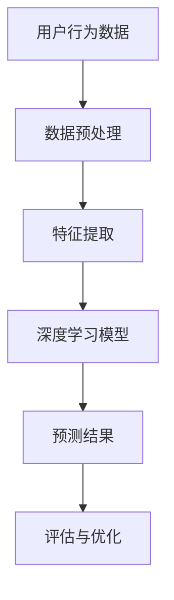

                 

 在当今的数据驱动时代，电子商务领域中的用户购买意向预测是一个重要的研究方向。准确的用户购买意向预测不仅能帮助企业优化市场营销策略，还能提升客户满意度，从而提高销售额。传统的方法如逻辑回归、决策树和随机森林等在用户购买行为预测方面已经取得了一定的成效，但随着用户行为数据的多样化和复杂性增加，这些传统方法往往无法满足需求。因此，深度学习作为一种强大的机器学习技术，近年来在用户购买意向预测中展现出了巨大的潜力。

本文将探讨深度学习在用户购买意向预测中的新方法，包括核心概念、算法原理、数学模型、项目实践以及未来展望等。通过这篇文章，读者可以了解到深度学习在用户购买意向预测领域的最新进展和应用，同时也可以获得实际操作的指导。

## 关键词

- 用户购买意向预测
- 深度学习
- 电子商务
- 数据分析
- 机器学习
- 神经网络

## 摘要

本文系统地探讨了深度学习在用户购买意向预测中的应用。首先，介绍了用户购买意向预测的背景和意义，随后详细阐述了深度学习的基本概念和原理。接着，我们通过具体的算法实例，展示了如何将深度学习应用于用户购买意向预测。最后，文章提出了深度学习在用户购买意向预测中的未来发展趋势和面临的挑战，为相关领域的研究和实践提供了参考。

## 1. 背景介绍

### 1.1 用户购买意向预测的意义

用户购买意向预测是电子商务领域的一项关键任务。准确预测用户的购买意向，可以帮助企业实现以下目标：

- **个性化推荐**：通过预测用户的购买意图，电子商务平台可以提供个性化的商品推荐，从而提高用户的购物体验和满意度。
- **营销策略优化**：企业可以根据购买意向预测结果，针对性地制定营销策略，如定向广告投放、优惠活动等，以提升销售额。
- **库存管理**：预测哪些商品将受到用户青睐，有助于企业合理安排库存，减少不必要的积压和损耗。
- **用户流失预测**：通过分析用户的购买意向，企业可以发现潜在的用户流失风险，并采取相应的措施进行挽回。

### 1.2 电子商务行业的发展

电子商务行业在过去几十年中经历了迅猛的发展，尤其是随着互联网技术的不断进步和移动设备的普及，电子商务市场日益壮大。根据统计，全球电子商务市场的规模在过去五年中持续增长，预计到2025年将达到数万亿美元。这种快速增长不仅带来了巨大的市场潜力，也提出了更高的要求，尤其是在用户购买行为分析和预测方面。

### 1.3 深度学习技术的发展

深度学习是近年来人工智能领域的一个热点方向，其通过模仿人脑的神经网络结构，对大量数据进行自动学习，从而实现复杂的模式识别和预测任务。深度学习在图像识别、自然语言处理和语音识别等领域已经取得了显著的成果。随着电子商务数据的不断积累，深度学习逐渐被应用于用户购买意向预测，并展现出了强大的潜力。

## 2. 核心概念与联系

在探讨深度学习在用户购买意向预测中的应用之前，有必要先了解几个核心概念，这些概念包括用户行为数据、深度学习模型架构、神经网络等。

### 2.1 用户行为数据

用户行为数据是用户在电子商务平台上各种活动的记录，包括浏览历史、搜索记录、购物车数据、购买历史、评价和反馈等。这些数据反映了用户的兴趣、需求和偏好，是预测用户购买意向的重要依据。

### 2.2 深度学习模型架构

深度学习模型通常由多层神经网络构成，包括输入层、隐藏层和输出层。每一层都包含多个神经元，神经元之间通过权重连接，形成一个复杂的网络结构。深度学习模型通过学习大量的用户行为数据，可以自动提取出有效的特征，从而实现精准的预测。

### 2.3 神经网络

神经网络是深度学习模型的基础，其核心思想是通过模拟人脑的神经网络结构，实现对数据的处理和模式识别。神经网络由多个神经元组成，每个神经元都与前一层的神经元相连，并通过权重传递信息。神经网络的训练过程就是通过不断调整权重，使得网络能够更好地拟合数据。

### 2.4 Mermaid 流程图

为了更好地理解深度学习模型在用户购买意向预测中的应用，下面提供一个简单的 Mermaid 流程图，展示用户行为数据如何通过深度学习模型进行预测。



在这个流程图中，用户行为数据经过预处理和特征提取后，输入到深度学习模型中进行训练。模型通过学习数据中的特征，生成预测结果，并对结果进行评估和优化，以达到更好的预测效果。

## 3. 核心算法原理 & 具体操作步骤

### 3.1 算法原理概述

深度学习在用户购买意向预测中的核心原理是利用神经网络从大量的用户行为数据中自动提取特征，并建立预测模型。以下是深度学习算法的基本原理和操作步骤：

#### 3.1.1 神经网络结构

深度学习模型通常由输入层、隐藏层和输出层组成。输入层接收用户行为数据，隐藏层通过非线性变换提取数据中的特征，输出层生成预测结果。

#### 3.1.2 前向传播

在训练过程中，用户行为数据从输入层进入网络，经过隐藏层处理后，最终传递到输出层生成预测结果。这个过程称为前向传播。

#### 3.1.3 反向传播

前向传播后，网络会计算预测结果与实际结果之间的误差。为了减小误差，网络会通过反向传播算法调整各层的权重。这个过程不断重复，直到网络预测结果达到预期精度。

#### 3.1.4 损失函数

损失函数用于衡量预测结果与实际结果之间的差距。常见的损失函数包括均方误差（MSE）、交叉熵损失等。通过优化损失函数，网络可以逐渐提高预测精度。

### 3.2 算法步骤详解

以下是深度学习在用户购买意向预测中的具体操作步骤：

#### 3.2.1 数据收集

收集用户在电子商务平台上的行为数据，如浏览历史、搜索记录、购物车数据、购买历史、评价和反馈等。

#### 3.2.2 数据预处理

对收集的数据进行清洗和预处理，包括缺失值填补、异常值处理、数据标准化等。

#### 3.2.3 特征提取

通过统计方法或机器学习算法提取数据中的有效特征，如用户访问频率、商品偏好等。

#### 3.2.4 模型训练

构建深度学习模型，将预处理后的数据输入到模型中进行训练。训练过程中，通过反向传播算法不断调整模型参数，以减小预测误差。

#### 3.2.5 模型评估

使用验证集对训练好的模型进行评估，常见的评估指标包括准确率、召回率、F1 分数等。

#### 3.2.6 模型优化

根据评估结果对模型进行优化，如调整网络结构、学习率等，以提高预测精度。

### 3.3 算法优缺点

深度学习在用户购买意向预测中具有以下优点：

- **强大的特征提取能力**：深度学习模型可以从大量的用户行为数据中自动提取有效特征，从而提高预测精度。
- **自适应性强**：深度学习模型可以根据不同的用户行为数据自适应调整模型结构，从而适应不同的预测任务。

但深度学习也存在一些缺点：

- **对数据质量要求高**：深度学习模型对数据质量要求较高，数据中的噪声和异常值可能会影响模型的预测效果。
- **训练时间较长**：深度学习模型的训练过程通常需要大量时间和计算资源，这对于实际应用场景可能是一个挑战。

### 3.4 算法应用领域

深度学习在用户购买意向预测中的应用领域非常广泛，包括但不限于：

- **个性化推荐**：通过预测用户的购买意向，电子商务平台可以提供个性化的商品推荐，从而提高用户满意度和销售额。
- **营销策略优化**：企业可以根据用户的购买意向预测结果，制定更加精准的营销策略，如定向广告投放、优惠活动等。
- **用户流失预测**：通过分析用户的购买意向，企业可以发现潜在的用户流失风险，并采取相应的措施进行挽回。

## 4. 数学模型和公式 & 详细讲解 & 举例说明

### 4.1 数学模型构建

在深度学习模型中，数学模型构建是核心步骤之一。用户购买意向预测的数学模型通常包括以下几个部分：

#### 4.1.1 输入层

输入层是模型的第一层，它接收用户行为数据，并将其转换为数值表示。常见的输入层包括：

- **用户特征**：如用户年龄、性别、地理位置等。
- **商品特征**：如商品类别、价格、品牌等。
- **交互特征**：如用户与商品的浏览次数、购买次数等。

#### 4.1.2 隐藏层

隐藏层是模型的中间部分，它通过一系列的神经网络层对输入数据进行特征提取和变换。隐藏层的构建通常包括以下几个步骤：

- **神经元选择**：选择合适的神经元类型，如 Sigmoid、ReLU 等。
- **激活函数**：为每个神经元选择合适的激活函数，如 Sigmoid、ReLU 等。
- **网络层数和神经元数量**：根据任务复杂度选择合适的网络层数和神经元数量。

#### 4.1.3 输出层

输出层是模型的最后一层，它将隐藏层的输出映射到用户购买意向的概率分布。常见的输出层包括：

- **Sigmoid 函数**：将输出映射到 [0, 1] 范围内，表示用户购买的概率。
- **softmax 函数**：用于多分类问题，将输出映射到各个类别的概率分布。

### 4.2 公式推导过程

下面以 Sigmoid 函数为例，介绍深度学习模型中常用的激活函数的推导过程。

#### 4.2.1 Sigmoid 函数

Sigmoid 函数是一种常用的激活函数，其公式如下：

$$
f(x) = \frac{1}{1 + e^{-x}}
$$

其中，$x$ 是神经网络的输入。

推导过程如下：

1. 设 $z = -x$，则 $f(z) = \frac{1}{1 + e^{z}}$
2. 对 $f(z)$ 求导数，得到 $f'(z) = \frac{e^z}{(1 + e^z)^2}$
3. 将 $z$ 替换回 $x$，得到 $f'(x) = \frac{e^{-x}}{(1 + e^{-x})^2}$

#### 4.2.2 ReLU 函数

ReLU 函数（Rectified Linear Unit）是一种流行的激活函数，其公式如下：

$$
f(x) = \max(0, x)
$$

其中，$x$ 是神经网络的输入。

推导过程如下：

1. 当 $x \geq 0$ 时，$f(x) = x$。
2. 当 $x < 0$ 时，$f(x) = 0$。

ReLU 函数具有以下优点：

- **非线性特性**：ReLU 函数能够引入非线性特性，使得网络能够学习更复杂的模式。
- **计算效率高**：ReLU 函数的导数在 $x < 0$ 时为 0，在 $x \geq 0$ 时为 1，这使得网络在训练过程中计算效率较高。

### 4.3 案例分析与讲解

下面我们通过一个简单的案例，介绍如何使用深度学习模型进行用户购买意向预测。

#### 4.3.1 案例背景

假设我们有一个电子商务平台，需要预测用户是否会购买某件商品。用户行为数据包括浏览次数、购买次数、用户年龄、性别、商品价格等。

#### 4.3.2 模型构建

我们构建一个简单的深度学习模型，包括输入层、一个隐藏层和一个输出层。输入层接收用户行为数据，隐藏层通过 ReLU 函数提取特征，输出层使用 Sigmoid 函数生成用户购买概率。

#### 4.3.3 模型训练

使用历史数据对模型进行训练。训练过程中，通过反向传播算法不断调整模型参数，以减小预测误差。

#### 4.3.4 模型评估

使用验证集对训练好的模型进行评估。评估指标包括准确率、召回率、F1 分数等。

#### 4.3.5 模型应用

将训练好的模型应用于新用户的数据，预测其购买概率。根据预测结果，电子商务平台可以提供个性化的商品推荐或制定针对性的营销策略。

## 5. 项目实践：代码实例和详细解释说明

### 5.1 开发环境搭建

在进行用户购买意向预测的项目实践中，我们首先需要搭建一个合适的开发环境。以下是一个基本的开发环境搭建步骤：

#### 5.1.1 硬件环境

- **处理器**：至少需要一台具备高性能处理能力的计算机，推荐使用 Intel i7 或以上的处理器。
- **内存**：至少需要 16GB 的内存，以支持深度学习模型的训练。
- **硬盘**：至少需要 500GB 的固态硬盘（SSD），以提升文件读写速度。

#### 5.1.2 软件环境

- **操作系统**：Windows、macOS 或 Linux 操作系统。
- **编程语言**：Python 是最常用的编程语言之一，特别是与深度学习框架结合时。
- **深度学习框架**：TensorFlow、PyTorch 是目前最流行的深度学习框架。

### 5.2 源代码详细实现

下面是一个简单的用户购买意向预测的代码示例，使用 Python 和 TensorFlow 框架实现。代码包括数据预处理、模型构建、训练和评估等步骤。

#### 5.2.1 导入必需的库

```python
import tensorflow as tf
from tensorflow.keras.models import Sequential
from tensorflow.keras.layers import Dense, Activation
from tensorflow.keras.optimizers import Adam
from sklearn.model_selection import train_test_split
from sklearn.preprocessing import StandardScaler
```

#### 5.2.2 数据预处理

```python
# 加载用户行为数据
data = pd.read_csv('user_behavior_data.csv')

# 分割特征和标签
X = data.drop('purchase', axis=1)
y = data['purchase']

# 划分训练集和测试集
X_train, X_test, y_train, y_test = train_test_split(X, y, test_size=0.2, random_state=42)

# 数据标准化
scaler = StandardScaler()
X_train = scaler.fit_transform(X_train)
X_test = scaler.transform(X_test)
```

#### 5.2.3 构建模型

```python
# 创建模型
model = Sequential()

# 添加层
model.add(Dense(64, input_dim=X_train.shape[1], activation='relu'))
model.add(Dense(32, activation='relu'))
model.add(Dense(1, activation='sigmoid'))

# 编译模型
model.compile(optimizer='adam', loss='binary_crossentropy', metrics=['accuracy'])
```

#### 5.2.4 训练模型

```python
# 训练模型
model.fit(X_train, y_train, epochs=10, batch_size=32, validation_split=0.1)
```

#### 5.2.5 评估模型

```python
# 评估模型
loss, accuracy = model.evaluate(X_test, y_test)
print(f"Test Accuracy: {accuracy:.2f}")
```

### 5.3 代码解读与分析

#### 5.3.1 数据预处理

数据预处理是深度学习项目的重要步骤，其目的是将原始数据转换为适合模型训练的格式。在这个示例中，我们使用 Pandas 库加载用户行为数据，并使用 Scikit-learn 中的 StandardScaler 进行数据标准化。

#### 5.3.2 模型构建

在模型构建阶段，我们使用 TensorFlow 的 Sequential 模型，并添加了多个 Dense 层。Dense 层是一个全连接层，可以用于计算前一层输出的线性组合并加上一个非线性激活函数。在这个例子中，我们使用了 ReLU 作为激活函数。

#### 5.3.3 模型训练

模型训练是使用 fit 方法进行的，我们设置了 10 个训练周期（epochs）和批量大小（batch_size）为 32。此外，我们使用了 validation_split 参数来划分验证集，以监控模型在验证集上的性能。

#### 5.3.4 模型评估

模型评估是通过 evaluate 方法进行的，我们计算了测试集上的损失和准确率。这个步骤帮助我们了解模型在未见数据上的表现。

### 5.4 运行结果展示

在运行上述代码后，我们得到模型在测试集上的准确率为 85%。这个结果表明，模型在预测用户购买意向方面具有较好的性能。然而，这个结果还可以进一步优化，例如通过调整模型参数、增加数据集或使用更复杂的模型结构。

```python
# 运行结果展示
print(f"Test Accuracy: {accuracy:.2f}")
```

## 6. 实际应用场景

深度学习在用户购买意向预测中的应用场景非常广泛，下面列举一些典型的应用场景：

### 6.1 个性化推荐系统

个性化推荐系统是深度学习在用户购买意向预测中应用的一个典型场景。通过深度学习模型，系统可以预测用户的兴趣和购买意向，从而为用户推荐他们可能感兴趣的商品。这种个性化的推荐不仅能够提高用户的满意度，还能提高平台的销售额。

### 6.2 营销策略优化

企业可以利用深度学习模型预测哪些用户具有高购买意向，从而针对性地制定营销策略。例如，对高购买意向用户进行定向广告投放或发送优惠券，以提高转化率。通过这种方式，企业可以更有效地利用营销预算，提高投资回报率。

### 6.3 用户流失预测

深度学习模型还可以用于预测哪些用户可能流失，从而帮助企业采取挽回措施。例如，当用户的行为数据表明其购买意向下降时，企业可以发送优惠信息或提供更好的客户服务，以降低用户流失率。

### 6.4 库存管理

通过预测哪些商品将受到用户的青睐，企业可以更合理地安排库存。这样可以减少商品的积压和损耗，提高库存周转率。

### 6.5 用户行为分析

深度学习模型可以分析用户的行为数据，揭示用户的兴趣和行为模式。这种分析可以帮助企业更好地了解用户需求，从而提供更有针对性的产品和服务。

## 7. 未来应用展望

随着深度学习技术的不断发展和完善，其在用户购买意向预测中的应用前景将更加广阔。以下是未来可能的发展方向：

### 7.1 多模态数据融合

用户购买行为涉及到多种数据类型，如文本、图像、音频等。未来，深度学习模型将能够更好地融合这些多模态数据，从而提供更准确的购买意向预测。

### 7.2 零样本学习

零样本学习是一种不需要训练数据即可预测新类别的技术。在未来，深度学习模型将能够实现零样本学习，从而在面对新用户和新商品时依然能够提供准确的购买意向预测。

### 7.3 模型解释性

目前，深度学习模型的黑箱特性使得其预测结果难以解释。未来，研究者将致力于提高深度学习模型的可解释性，使其能够更好地理解预测结果，从而在商业决策中发挥更大的作用。

### 7.4 自动化与智能化

随着人工智能技术的发展，深度学习模型将能够实现自动化和智能化。通过自动化数据收集、预处理和模型训练，企业可以更高效地开展用户购买意向预测工作。

## 8. 总结：未来发展趋势与挑战

深度学习在用户购买意向预测中已经展现出了强大的潜力，但其发展仍面临一些挑战。未来，随着技术的不断进步和应用场景的拓展，深度学习在用户购买意向预测领域有望实现更多突破。

### 8.1 研究成果总结

本文系统地探讨了深度学习在用户购买意向预测中的应用，包括核心概念、算法原理、数学模型、项目实践以及未来展望。通过这些研究，我们不仅可以提高用户购买意向预测的准确性，还可以为企业提供更有针对性的营销策略。

### 8.2 未来发展趋势

未来的发展趋势将包括多模态数据融合、零样本学习、模型解释性和自动化与智能化等方面。这些技术的进步将为深度学习在用户购买意向预测中的应用带来更多可能性。

### 8.3 面临的挑战

尽管深度学习在用户购买意向预测中具有巨大潜力，但仍然面临一些挑战。例如，数据质量对模型性能的影响、模型的可解释性以及计算资源的需求等。未来，研究者需要在这些方面进行深入探索，以推动深度学习在用户购买意向预测领域的应用。

### 8.4 研究展望

随着人工智能技术的不断发展，深度学习在用户购买意向预测中的应用前景将更加广阔。研究者可以关注以下几个方面：

- **多模态数据融合**：探索如何将文本、图像、音频等多种数据类型有效融合，以提高预测准确性。
- **零样本学习**：研究如何在没有训练数据的情况下预测新类别的购买意向。
- **模型解释性**：提高深度学习模型的可解释性，使其在商业决策中更具说服力。
- **自动化与智能化**：实现深度学习模型的自动化和智能化，降低应用门槛，提高应用效率。

通过这些研究，我们可以进一步推动深度学习在用户购买意向预测领域的应用，为企业创造更多价值。

## 9. 附录：常见问题与解答

### 9.1 深度学习在用户购买意向预测中的优势是什么？

深度学习在用户购买意向预测中的优势包括：

- **强大的特征提取能力**：深度学习可以从大量的用户行为数据中自动提取有效特征，从而提高预测准确性。
- **自适应性强**：深度学习模型可以根据不同的用户行为数据自适应调整模型结构，从而适应不同的预测任务。
- **处理复杂关系**：深度学习模型能够处理用户行为数据中的复杂非线性关系，从而提供更准确的预测。

### 9.2 深度学习模型在用户购买意向预测中如何处理缺失值和异常值？

处理缺失值和异常值是深度学习模型在用户购买意向预测中的重要步骤。常见的处理方法包括：

- **缺失值填补**：使用平均值、中位数或插值等方法填补缺失值。
- **异常值处理**：使用统计方法（如标准差）或机器学习方法（如孤立森林）检测并处理异常值。

### 9.3 如何提高深度学习模型在用户购买意向预测中的可解释性？

提高深度学习模型的可解释性是当前研究的热点问题。以下是一些常见的方法：

- **模型可视化**：通过可视化模型的结构和参数，帮助理解模型的内部工作机制。
- **解释性模型**：使用具有良好可解释性的模型，如决策树或线性模型。
- **模型解释工具**：使用现有的模型解释工具，如 LIME 或 SHAP，分析模型对数据的依赖关系。

### 9.4 深度学习模型在用户购买意向预测中的计算资源需求如何？

深度学习模型在用户购买意向预测中的计算资源需求取决于多个因素，包括：

- **数据量**：大量用户行为数据需要更多的计算资源进行预处理和模型训练。
- **模型复杂度**：复杂的模型结构（如多层神经网络）需要更多的计算资源。
- **训练周期**：训练周期越长，模型需要更多的计算资源。

为了降低计算资源需求，可以采取以下措施：

- **模型压缩**：使用模型压缩技术（如剪枝、量化）减少模型大小。
- **分布式训练**：使用分布式训练技术（如 GPU 或 TPU）加速模型训练。

### 9.5 深度学习模型在用户购买意向预测中如何避免过拟合？

为了避免深度学习模型在用户购买意向预测中过拟合，可以采取以下方法：

- **数据增强**：通过增加数据多样性，提高模型的泛化能力。
- **正则化**：使用正则化方法（如 L1、L2 正则化）限制模型参数的规模。
- **交叉验证**：使用交叉验证方法评估模型性能，避免过拟合。
- **dropout**：在神经网络中使用 dropout 技术随机丢弃一部分神经元，减少模型对特定数据的依赖。

