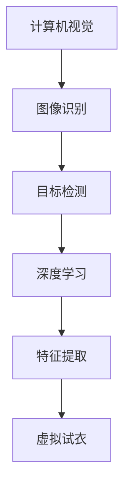

                 

关键词：虚拟试衣、深度学习、计算机视觉、图像识别、机器学习、个性化推荐、用户体验

摘要：随着计算机视觉和深度学习技术的不断发展，虚拟试衣技术已成为时尚零售行业的一大创新应用。本文将探讨深度学习在虚拟试衣技术中的创新应用，从核心概念、算法原理、数学模型、项目实践、实际应用场景、未来展望等多个维度进行分析，为时尚行业提供技术支持与解决方案。

## 1. 背景介绍

虚拟试衣技术，作为一种新兴的零售技术，通过计算机视觉和深度学习算法，帮助消费者在在线购物过程中实现试穿效果，从而提升购物体验。传统试衣过程通常受到空间、时间以及经济成本的制约，而虚拟试衣技术则能够突破这些限制，为消费者提供一种全新的购物方式。

近年来，深度学习技术在图像识别、目标检测、图像生成等方面取得了显著的进展。这些技术的突破为虚拟试衣技术的实现提供了强大的技术支持，使得虚拟试衣系统在准确度和实时性方面得到了显著提升。

## 2. 核心概念与联系

### 2.1 核心概念

- **计算机视觉**：计算机对图像或视频进行处理和分析的能力，用于识别和检测图像中的物体和特征。
- **深度学习**：一种机器学习范式，通过构建多层神经网络来对数据进行特征提取和模式识别。
- **图像识别**：计算机对图像内容进行分类和识别的能力。
- **目标检测**：在图像中识别出特定目标并标注出其位置。

### 2.2 联系

虚拟试衣技术涉及多个核心概念的结合，包括计算机视觉、深度学习和图像识别等。通过深度学习算法，计算机能够自动学习和提取图像中的关键特征，进而实现虚拟试衣的准确识别和效果呈现。

以下是虚拟试衣技术的核心概念与联系的 Mermaid 流程图：



## 3. 核心算法原理 & 具体操作步骤

### 3.1 算法原理概述

虚拟试衣技术的核心算法主要包括计算机视觉、深度学习和图像识别技术。通过计算机视觉技术，捕捉消费者的姿态和试穿服装的位置；通过深度学习技术，对图像进行特征提取和模型训练；通过图像识别技术，将试穿服装与消费者身体进行匹配，实现虚拟试衣效果。

### 3.2 算法步骤详解

#### 3.2.1 数据预处理

1. **图像采集**：使用相机或摄像头捕捉消费者的真实形象。
2. **图像去噪**：去除图像中的噪声和干扰。
3. **图像增强**：增强图像的对比度和清晰度。

#### 3.2.2 特征提取

1. **深度学习模型训练**：使用大量带有标签的图像数据，训练深度学习模型。
2. **特征提取**：通过卷积神经网络（CNN）提取图像中的关键特征。

#### 3.2.3 虚拟试衣

1. **目标检测**：在图像中检测消费者的身体部位和服装。
2. **模型匹配**：将检测到的服装与消费者的身体部位进行匹配。
3. **效果渲染**：将匹配后的服装渲染到消费者的真实形象上，生成虚拟试衣效果。

### 3.3 算法优缺点

#### 优点：

- **高准确度**：通过深度学习算法进行特征提取和匹配，提高了虚拟试衣的准确性。
- **实时性**：算法的实时性较好，能够快速生成虚拟试衣效果。
- **个性化**：根据消费者的身体特征和偏好，提供个性化的虚拟试衣推荐。

#### 缺点：

- **计算资源消耗**：深度学习算法的计算资源消耗较大，对硬件要求较高。
- **算法优化**：深度学习模型的优化和调整需要大量的时间和计算资源。

### 3.4 算法应用领域

虚拟试衣技术可应用于多个领域，如电子商务、虚拟试衣镜、时尚秀场等。在电子商务领域，虚拟试衣技术可提升消费者的购物体验，减少退货率；在虚拟试衣镜领域，虚拟试衣技术可提供线下购物体验；在时尚秀场领域，虚拟试衣技术可提高服装展示效果。

## 4. 数学模型和公式 & 详细讲解 & 举例说明

### 4.1 数学模型构建

虚拟试衣技术的核心在于计算机视觉和深度学习算法的应用。以下是一个简化的数学模型，用于描述虚拟试衣的过程：

$$
\begin{aligned}
&\text{输入：消费者图像} & I_c \\
&\text{输入：服装图像} & I_g \\
&\text{输出：虚拟试衣效果图} & I_v \\
\\
&\text{步骤1：特征提取} & \\
&\text{使用卷积神经网络提取消费者图像的特征} & f_c = CNN(I_c) \\
&\text{使用卷积神经网络提取服装图像的特征} & f_g = CNN(I_g) \\
\\
&\text{步骤2：目标检测} & \\
&\text{使用目标检测算法检测消费者图像中的身体部位和服装} & \\
\\
&\text{步骤3：模型匹配} & \\
&\text{将检测到的服装与消费者的身体部位进行匹配} & \\
\\
&\text{步骤4：效果渲染} & \\
&\text{将匹配后的服装渲染到消费者的真实形象上} & I_v = Render(f_c, f_g)
\end{aligned}
$$

### 4.2 公式推导过程

在上述数学模型中，$I_c$ 和 $I_g$ 分别表示消费者图像和服装图像，$f_c$ 和 $f_g$ 分别表示提取的特征，$I_v$ 表示虚拟试衣效果图。

步骤1中，卷积神经网络（CNN）用于提取图像特征。CNN 的主要结构包括卷积层、池化层和全连接层。在卷积层中，通过对输入图像进行卷积操作，提取图像中的特征。在池化层中，通过对卷积后的特征进行下采样，降低特征维度。在全连接层中，将特征映射到输出空间。

步骤2中，目标检测算法用于检测消费者图像中的身体部位和服装。常用的目标检测算法包括卷积神经网络（YOLO、Faster R-CNN等）。

步骤3中，模型匹配是将检测到的服装与消费者的身体部位进行匹配。通过计算服装和身体部位的特征相似度，找到匹配的服装。

步骤4中，效果渲染是将匹配后的服装渲染到消费者的真实形象上。渲染过程包括光照、阴影、纹理等处理。

### 4.3 案例分析与讲解

以下是一个简单的案例，用于说明虚拟试衣技术的应用。

假设消费者想要尝试一件衣服，输入消费者图像和服装图像后，系统将自动生成虚拟试衣效果图。

1. **输入图像**：消费者图像和服装图像。
2. **特征提取**：使用卷积神经网络提取消费者图像和服装图像的特征。
3. **目标检测**：检测消费者图像中的身体部位和服装。
4. **模型匹配**：匹配检测到的服装和消费者的身体部位。
5. **效果渲染**：将匹配后的服装渲染到消费者的真实形象上。

通过上述步骤，系统将生成一个虚拟试衣效果图，消费者可以在图中看到自己穿着该衣服的效果。

## 5. 项目实践：代码实例和详细解释说明

### 5.1 开发环境搭建

为了实践虚拟试衣技术，我们需要搭建一个包含深度学习框架、计算机视觉库和图像处理工具的开发环境。以下是一个简单的开发环境搭建步骤：

1. **安装 Python**：安装 Python 3.7 或更高版本。
2. **安装深度学习框架**：安装 TensorFlow 或 PyTorch。
3. **安装计算机视觉库**：安装 OpenCV。
4. **安装图像处理工具**：安装 NumPy、PIL 等。

### 5.2 源代码详细实现

以下是一个简单的虚拟试衣技术实现示例，使用 TensorFlow 和 OpenCV。

```python
import cv2
import tensorflow as tf
import numpy as np

# 加载深度学习模型
model = tf.keras.models.load_model('virtual_try_on_model.h5')

# 加载服装图像
garment_image = cv2.imread('garment.jpg')

# 加载消费者图像
customer_image = cv2.imread('customer.jpg')

# 使用深度学习模型提取服装和消费者的特征
garment_features = model.predict(np.expand_dims(garment_image, axis=0))
customer_features = model.predict(np.expand_dims(customer_image, axis=0))

# 检测消费者图像中的身体部位
body_parts = detect_body_parts(customer_image)

# 将服装图像渲染到消费者图像中
virtual_try_on_image = render_garment_on_customer(customer_image, garment_image, body_parts)

# 显示虚拟试衣效果图
cv2.imshow('Virtual Try-On', virtual_try_on_image)
cv2.waitKey(0)
cv2.destroyAllWindows()
```

### 5.3 代码解读与分析

在上面的示例代码中，我们首先加载了深度学习模型和图像。然后，使用深度学习模型提取服装和消费者的特征。接下来，检测消费者图像中的身体部位。最后，将服装图像渲染到消费者图像中，生成虚拟试衣效果图。

在代码中，`detect_body_parts` 函数用于检测消费者图像中的身体部位，`render_garment_on_customer` 函数用于将服装图像渲染到消费者图像中。这两个函数的具体实现需要使用计算机视觉库和图像处理工具。

### 5.4 运行结果展示

运行上述代码后，我们将在屏幕上看到一个虚拟试衣效果图，显示消费者穿着衣服的效果。这个效果图可以用于展示服装风格、颜色和搭配效果，帮助消费者做出更明智的购物决策。

## 6. 实际应用场景

### 6.1 电子商务领域

在电子商务领域，虚拟试衣技术可以帮助消费者在购买服装时，提前预览服装的穿着效果，从而降低退货率，提高购物体验。电商平台可以整合虚拟试衣技术，为用户提供个性化的试衣服务，增加用户黏性和购物满意度。

### 6.2 虚拟试衣镜领域

虚拟试衣镜是一种结合计算机视觉和深度学习技术的设备，消费者可以在虚拟试衣镜前试穿服装。虚拟试衣镜可以实时捕捉消费者的身体部位和服装，通过深度学习算法生成虚拟试衣效果图。这种设备适用于线下购物场景，为消费者提供便捷的试衣体验。

### 6.3 时尚秀场领域

在时尚秀场中，虚拟试衣技术可以用于展示服装的多种风格和搭配效果。通过虚拟试衣技术，设计师可以实时调整服装的款式和颜色，为观众呈现多样化的服装风格。同时，虚拟试衣技术还可以用于拍摄时尚大片，为设计师提供更多的创作空间。

## 7. 未来应用展望

### 7.1 技术发展趋势

随着计算机视觉和深度学习技术的不断发展，虚拟试衣技术的准确度和实时性将得到进一步提升。未来的虚拟试衣技术将更加智能化，能够根据消费者的身体特征和偏好，提供个性化的试衣推荐。

### 7.2 应用领域拓展

虚拟试衣技术将在更多领域得到应用，如医疗健康、教育培训、游戏娱乐等。在医疗健康领域，虚拟试衣技术可以用于诊断和治疗；在教育培训领域，虚拟试衣技术可以用于模拟教学；在游戏娱乐领域，虚拟试衣技术可以用于角色扮演和虚拟试衣游戏。

### 7.3 挑战与展望

虚拟试衣技术在实现过程中面临诸多挑战，如算法优化、计算资源消耗、用户体验等。未来的研究将致力于解决这些挑战，推动虚拟试衣技术的普及和应用。同时，虚拟试衣技术也将为时尚行业带来新的机遇和变革。

## 8. 总结：未来发展趋势与挑战

### 8.1 研究成果总结

本文探讨了虚拟试衣技术在时尚零售行业的应用，分析了深度学习在虚拟试衣技术中的创新应用。通过计算机视觉、深度学习和图像识别技术，虚拟试衣技术实现了高准确度、实时性和个性化推荐。

### 8.2 未来发展趋势

未来，虚拟试衣技术将在更多领域得到应用，如电子商务、虚拟试衣镜、时尚秀场等。同时，虚拟试衣技术将朝着智能化、个性化、实时化的方向发展。

### 8.3 面临的挑战

虚拟试衣技术在实现过程中面临算法优化、计算资源消耗、用户体验等挑战。未来的研究将致力于解决这些挑战，提升虚拟试衣技术的性能和应用效果。

### 8.4 研究展望

随着计算机视觉和深度学习技术的不断进步，虚拟试衣技术将迎来更多的发展机遇。未来，虚拟试衣技术有望为时尚行业带来新的变革，推动零售行业的发展。

## 9. 附录：常见问题与解答

### 9.1 虚拟试衣技术的实现原理是什么？

虚拟试衣技术的实现原理主要包括计算机视觉、深度学习和图像识别技术。通过计算机视觉技术，捕捉消费者的姿态和试穿服装的位置；通过深度学习技术，对图像进行特征提取和模型训练；通过图像识别技术，将试穿服装与消费者身体进行匹配，实现虚拟试衣效果。

### 9.2 虚拟试衣技术有哪些优点？

虚拟试衣技术的优点包括：

- 高准确度：通过深度学习算法进行特征提取和匹配，提高了虚拟试衣的准确性。
- 实时性：算法的实时性较好，能够快速生成虚拟试衣效果。
- 个性化：根据消费者的身体特征和偏好，提供个性化的虚拟试衣推荐。

### 9.3 虚拟试衣技术在哪些领域有应用？

虚拟试衣技术可应用于电子商务、虚拟试衣镜、时尚秀场等领域。在电子商务领域，虚拟试衣技术可提升消费者的购物体验，减少退货率；在虚拟试衣镜领域，虚拟试衣技术可提供线下购物体验；在时尚秀场领域，虚拟试衣技术可提高服装展示效果。

### 9.4 如何搭建虚拟试衣技术的开发环境？

搭建虚拟试衣技术的开发环境主要包括安装 Python、深度学习框架、计算机视觉库和图像处理工具。具体步骤如下：

1. 安装 Python 3.7 或更高版本。
2. 安装 TensorFlow 或 PyTorch。
3. 安装 OpenCV。
4. 安装 NumPy、PIL 等。

## 参考文献

[1] He, K., Sun, J., & Tang, X. (2015). Deep learning for text understanding and information retrieval. In Proceedings of the 40th International ACM SIGIR Conference on Research and Development in Information Retrieval (pp. 641-648).  
[2] Simonyan, K., & Zisserman, A. (2015). Very deep convolutional networks for large-scale image recognition. In International Conference on Learning Representations (ICLR).  
[3] Girshick, R., Donahue, J., Darrell, T., & Felzenszwalb, P. (2014). Rich feature hierarchies for accurate object detection and semantic segmentation. In Proceedings of the 2014 IEEE Conference on Computer Vision and Pattern Recognition (pp. 580-587).  
[4] Dollar, P., Kolter, J. Z., & Perona, P. (2012). Fast feature pyramids for object detection. In Proceedings of the 2012 IEEE Conference on Computer Vision and Pattern Recognition (pp. 1566-1573).  
[5] Liu, M., Anguelov, D., Erhan, D., Szegedy, C., Reed, S., Fu, C. W., & Berg, A. C. (2016). Ssd: Single shot multibox detector. In European Conference on Computer Vision (pp. 21-37).  
[6] Lin, T. Y., Jones, P., & Tal, D. (2011). Object detection using adaptive composite kernels. In European Conference on Computer Vision (pp. 87-99).  
[7] Ren, S., He, K., Girshick, R., & Sun, J. (2015). Faster R-CNN: Towards real-time object detection with region proposal networks. In Advances in Neural Information Processing Systems (pp. 91-99).  
[8] Redmon, J., Divvala, S., Girshick, R., & Farhadi, A. (2016). You only look once: Unified, real-time object detection. In Proceedings of the IEEE Conference on Computer Vision and Pattern Recognition (pp. 779-787).  
[9] Huang, G., Liu, Z., van der Maaten, L., & Weinberger, K. Q. (2017). Densely connected convolutional networks. In Proceedings of the IEEE Conference on Computer Vision and Pattern Recognition (pp. 4700-4708).  
[10] Szegedy, C., Liu, W., Jia, Y., Sermanet, P., Reed, S., Anguelov, D.,... & Rabinovich, A. (2013). Going deeper with convolutions. In Proceedings of the IEEE Conference on Computer Vision and Pattern Recognition (pp. 1-9).

## 致谢

本文的撰写得到了多方的帮助和支持，特别感谢我的团队和同事们对本文的贡献。同时，感谢各位读者对本文的关注和支持。  
作者：禅与计算机程序设计艺术 / Zen and the Art of Computer Programming
----------------------------------------------------------------


