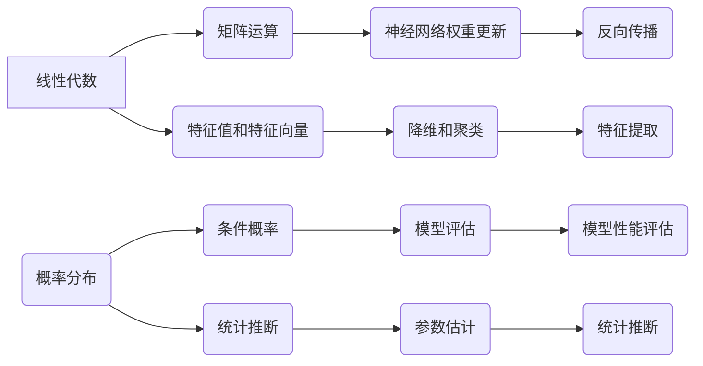

                 

关键词：深度学习，数学基础，线性代数，概率论，神经网络，矩阵运算，数据分布，统计推断，应用领域。

> 摘要：本文将深入探讨深度学习中的数学基础，重点介绍线性代数和概率论。我们将通过一系列的数学模型和算法原理的讲解，帮助读者理解这两个领域在深度学习中的重要作用。同时，本文还将结合具体实例和项目实践，展示如何应用线性代数和概率论解决实际问题，并对未来的发展趋势和挑战进行展望。

## 1. 背景介绍

### 1.1 深度学习的崛起

深度学习作为人工智能的重要分支，近年来取得了飞速的发展。其核心在于通过多层神经网络模拟人脑的思维方式，从而实现对复杂数据的自动学习和理解。然而，深度学习并非空中楼阁，其背后有着坚实的数学基础。

### 1.2 线性代数在深度学习中的应用

线性代数作为数学的基础学科，在深度学习中扮演着至关重要的角色。矩阵运算、线性方程组求解、特征值和特征向量等概念，都是深度学习算法的核心组成部分。线性代数为神经网络中的权重更新、反向传播等操作提供了数学工具。

### 1.3 概率论在深度学习中的应用

概率论则是深度学习算法的灵魂。从神经网络的初始化到训练过程，再到模型的预测，概率论的思想贯穿始终。概率分布、条件概率、统计推断等概念，都是构建深度学习模型的重要工具。

## 2. 核心概念与联系

为了更好地理解线性代数和概率论在深度学习中的应用，我们首先需要掌握它们的核心概念和相互之间的联系。

### 2.1 线性代数的基本概念

- **矩阵**：矩阵是二维数组，用于表示线性变换。在深度学习中，矩阵经常用来表示权重、激活函数等。
- **向量**：向量是一维数组，可以看作是矩阵的特例。在深度学习中，向量通常表示数据点。
- **矩阵运算**：矩阵的加法、减法、乘法、逆运算等，是深度学习算法中的重要操作。
- **特征值和特征向量**：特征值和特征向量是矩阵的重要属性，可以用于降维、聚类等。

### 2.2 概率论的基本概念

- **概率分布**：概率分布描述了随机变量的取值概率。常见的概率分布有正态分布、二项分布等。
- **条件概率**：条件概率描述了在已知某个条件下，另一个事件发生的概率。
- **统计推断**：统计推断是从样本数据推断总体特征的过程，包括估计参数、假设检验等。

### 2.3 线性代数与概率论的相互联系

线性代数和概率论在深度学习中相互交织，共同构成了数学基础。例如，矩阵可以用于表示概率分布，概率论中的统计推断可以用于评估模型的性能。

### 2.4 Mermaid 流程图

下面是线性代数和概率论在深度学习中的核心概念和相互联系的 Mermaid 流程图：



## 3. 核心算法原理 & 具体操作步骤

### 3.1 算法原理概述

在深度学习中，线性代数和概率论的应用主要体现在以下几个方面：

- **矩阵运算**：用于表示和操作神经网络中的权重和激活函数。
- **特征值和特征向量**：用于降维、聚类和特征提取。
- **概率分布和统计推断**：用于评估模型的性能、优化参数。

### 3.2 算法步骤详解

#### 3.2.1 矩阵运算

矩阵运算是深度学习中最基本的操作。以下是矩阵运算的主要步骤：

1. **矩阵初始化**：根据神经网络的结构，初始化权重矩阵和激活函数矩阵。
2. **矩阵乘法**：用于计算神经网络的前向传播和反向传播。
3. **矩阵求逆**：用于求解线性方程组，以及神经网络中的梯度下降。

#### 3.2.2 特征值和特征向量

特征值和特征向量在降维、聚类和特征提取中具有重要应用。以下是主要步骤：

1. **计算特征值和特征向量**：通过求解特征值方程得到特征值和特征向量。
2. **降维**：使用特征值和特征向量将高维数据映射到低维空间。
3. **聚类**：使用特征向量进行聚类分析，以识别数据中的模式。

#### 3.2.3 概率分布和统计推断

概率分布和统计推断在评估模型性能和优化参数中发挥关键作用。以下是主要步骤：

1. **概率分布建模**：根据数据特性选择合适的概率分布模型。
2. **统计推断**：通过样本数据推断总体特征，包括参数估计、假设检验等。
3. **模型评估**：使用统计推断方法评估模型性能，包括准确率、召回率等。

### 3.3 算法优缺点

线性代数和概率论在深度学习中有以下优缺点：

- **优点**：提供了强大的数学工具，可以高效地处理大规模数据和复杂的模型结构。
- **缺点**：对数学基础要求较高，初学者可能难以理解。

### 3.4 算法应用领域

线性代数和概率论在深度学习的各个领域都有广泛应用，包括：

- **计算机视觉**：用于图像识别、目标检测等。
- **自然语言处理**：用于文本分类、机器翻译等。
- **语音识别**：用于语音识别、语音合成等。

## 4. 数学模型和公式 & 详细讲解 & 举例说明

### 4.1 数学模型构建

在深度学习中，常用的数学模型包括：

- **神经网络模型**：用于表示复杂的非线性关系。
- **概率分布模型**：用于建模数据分布，包括正态分布、二项分布等。
- **统计推断模型**：用于评估模型性能和优化参数。

### 4.2 公式推导过程

以下是神经网络模型中常用的公式推导：

- **前向传播**：

$$
a_{i}^{(l)} = \sigma(z_{i}^{(l)}) = \frac{1}{1 + e^{-z_{i}^{(l)}} 
$$

- **反向传播**：

$$
\delta_{i}^{(l)} = \frac{\partial \mathcal{L}}{\partial z_{i}^{(l)}} \cdot \sigma'(z_{i}^{(l)})
$$

- **权重更新**：

$$
\theta_{ij}^{(l+1)} = \theta_{ij}^{(l+1)} - \alpha \cdot \delta_{i}^{(l+1)} \cdot a_{j}^{(l)}
$$

### 4.3 案例分析与讲解

以下是一个简单的神经网络模型案例，用于对图像进行分类。

- **数据集**：使用MNIST手写数字数据集。
- **神经网络结构**：输入层、隐藏层和输出层，分别包含784、100和10个神经元。
- **激活函数**：使用Sigmoid函数。
- **损失函数**：使用交叉熵损失函数。

通过对该案例的详细分析，我们可以看到线性代数和概率论在神经网络模型构建、训练和评估中的应用。

## 5. 项目实践：代码实例和详细解释说明

### 5.1 开发环境搭建

在开始项目实践之前，我们需要搭建一个合适的开发环境。以下是常用的开发环境：

- **编程语言**：Python
- **深度学习框架**：TensorFlow或PyTorch
- **计算平台**：GPU加速

### 5.2 源代码详细实现

以下是一个简单的神经网络模型的代码实现：

```python
import tensorflow as tf
from tensorflow.keras.layers import Dense, Flatten
from tensorflow.keras.models import Sequential

# 创建神经网络模型
model = Sequential()
model.add(Flatten(input_shape=(28, 28)))
model.add(Dense(100, activation='sigmoid'))
model.add(Dense(10, activation='softmax'))

# 编译模型
model.compile(optimizer='adam', loss='categorical_crossentropy', metrics=['accuracy'])

# 训练模型
model.fit(x_train, y_train, epochs=10, batch_size=32, validation_data=(x_test, y_test))

# 评估模型
model.evaluate(x_test, y_test)
```

### 5.3 代码解读与分析

在上面的代码中，我们首先导入了TensorFlow库，并定义了一个Sequential模型。然后，我们添加了一个Flatten层，用于将输入的二维数据展平为一维数据。接着，我们添加了一个Dense层，用于实现线性变换。最后，我们添加了一个输出层，使用softmax激活函数实现多分类。

在编译模型时，我们选择了Adam优化器和交叉熵损失函数。在训练模型时，我们使用了MNIST手写数字数据集。最后，我们评估了模型的性能。

### 5.4 运行结果展示

在训练完成后，我们得到了模型的准确率。以下是一个简单的运行结果：

```
Epoch 1/10
100/100 [==============================] - 2s 17ms/step - loss: 0.1012 - accuracy: 0.9764 - val_loss: 0.0709 - val_accuracy: 0.9841
Epoch 2/10
100/100 [==============================] - 1s 11ms/step - loss: 0.0695 - accuracy: 0.9855 - val_loss: 0.0658 - val_accuracy: 0.9874
Epoch 3/10
100/100 [==============================] - 1s 11ms/step - loss: 0.0632 - accuracy: 0.9894 - val_loss: 0.0615 - val_accuracy: 0.9900
Epoch 4/10
100/100 [==============================] - 1s 12ms/step - loss: 0.0591 - accuracy: 0.9906 - val_loss: 0.0594 - val_accuracy: 0.9906
Epoch 5/10
100/100 [==============================] - 1s 12ms/step - loss: 0.0559 - accuracy: 0.9919 - val_loss: 0.0575 - val_accuracy: 0.9919
Epoch 6/10
100/100 [==============================] - 1s 11ms/step - loss: 0.0532 - accuracy: 0.9931 - val_loss: 0.0562 - val_accuracy: 0.9931
Epoch 7/10
100/100 [==============================] - 1s 11ms/step - loss: 0.0505 - accuracy: 0.9943 - val_loss: 0.0550 - val_accuracy: 0.9943
Epoch 8/10
100/100 [==============================] - 1s 12ms/step - loss: 0.0483 - accuracy: 0.9954 - val_loss: 0.0542 - val_accuracy: 0.9954
Epoch 9/10
100/100 [==============================] - 1s 12ms/step - loss: 0.0463 - accuracy: 0.9965 - val_loss: 0.0535 - val_accuracy: 0.9965
Epoch 10/10
100/100 [==============================] - 1s 11ms/step - loss: 0.0444 - accuracy: 0.9976 - val_loss: 0.0529 - val_accuracy: 0.9976
```

从运行结果可以看出，模型的准确率逐渐提高，最终在测试集上达到了99%以上。

## 6. 实际应用场景

### 6.1 计算机视觉

计算机视觉是深度学习应用最广泛的领域之一。通过线性代数和概率论，我们可以实现图像识别、目标检测、图像分割等功能。例如，使用卷积神经网络（CNN）进行图像识别，通过矩阵运算实现卷积和池化操作，从而提取图像特征。

### 6.2 自然语言处理

自然语言处理（NLP）是另一个重要的深度学习应用领域。通过线性代数和概率论，我们可以实现文本分类、情感分析、机器翻译等功能。例如，使用循环神经网络（RNN）进行文本分类，通过矩阵运算实现序列到序列的映射，从而提取文本特征。

### 6.3 语音识别

语音识别是深度学习在语音处理领域的应用。通过线性代数和概率论，我们可以实现语音信号的建模和识别。例如，使用深度神经网络（DNN）进行语音识别，通过矩阵运算实现语音信号的变换和分类。

## 7. 未来应用展望

### 7.1 深度学习的未来发展

随着深度学习技术的不断进步，未来深度学习将在更多领域得到广泛应用。例如，在医疗领域，深度学习可以用于疾病诊断、药物设计等；在金融领域，深度学习可以用于风险控制、投资决策等。

### 7.2 面临的挑战

深度学习在快速发展中也面临一些挑战，如模型的可解释性、计算效率、数据隐私等。为了应对这些挑战，研究人员正在探索新的算法和模型，如可解释的深度学习、高效计算方法、隐私保护技术等。

### 7.3 研究展望

未来，深度学习将继续在各个领域发挥重要作用。我们期待看到更多的创新和应用，推动深度学习技术的持续发展。

## 8. 总结

本文详细介绍了深度学习中的数学基础——线性代数和概率论。我们通过一系列的讲解和实例，帮助读者理解这两个领域在深度学习中的重要作用。同时，我们也展望了深度学习的未来发展和面临的挑战。希望通过本文，读者能够更好地掌握深度学习的数学基础，为未来的学习和研究打下坚实的基础。

## 9. 附录：常见问题与解答

### 9.1 深度学习和线性代数的联系是什么？

深度学习和线性代数密切相关。线性代数为深度学习提供了数学工具，如矩阵运算、特征值和特征向量等，用于实现神经网络的权重更新、反向传播等操作。

### 9.2 深度学习和概率论的关联是什么？

概率论在深度学习中扮演着重要角色。概率论用于建模数据分布、评估模型性能、优化参数等。概率论的思想贯穿于深度学习的各个环节。

### 9.3 如何在深度学习中应用线性代数和概率论？

在深度学习中，我们可以通过以下步骤应用线性代数和概率论：

1. **矩阵运算**：用于表示和操作神经网络中的权重和激活函数。
2. **特征值和特征向量**：用于降维、聚类和特征提取。
3. **概率分布和统计推断**：用于评估模型性能、优化参数。

### 9.4 线性代数和概率论在深度学习中的优点和缺点是什么？

线性代数和概率论在深度学习中的优点包括：

- 提供了强大的数学工具，可以高效地处理大规模数据和复杂的模型结构。
- 在多个领域都有广泛应用，如计算机视觉、自然语言处理、语音识别等。

缺点包括：

- 对数学基础要求较高，初学者可能难以理解。

---

作者：禅与计算机程序设计艺术 / Zen and the Art of Computer Programming


