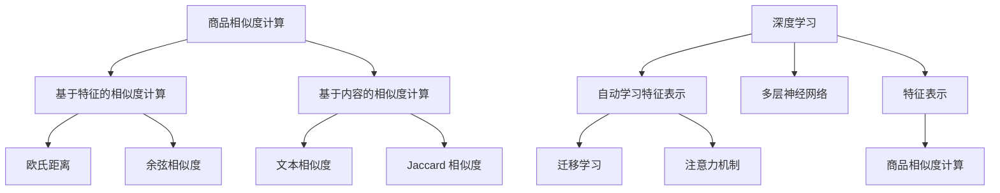

                 

关键词：商品相似度计算、深度学习、优化算法、推荐系统、数学模型

摘要：本文详细探讨了深度学习在商品相似度计算中的应用及其优化策略。首先，介绍了商品相似度计算的基本概念和重要性，随后深入剖析了深度学习在商品相似度计算中的核心算法原理和具体操作步骤。接着，通过数学模型和公式，阐述了商品相似度计算中的关键数学概念和推导过程。随后，结合实际项目实践，提供了代码实例和详细解释说明，展示了深度学习驱动的商品相似度计算在实际应用中的效果。最后，讨论了商品相似度计算的当前实际应用场景，并对未来的发展趋势和挑战进行了展望。

## 1. 背景介绍

商品相似度计算是电子商务和推荐系统中的一项关键技术。它旨在为用户推荐与其已购买或浏览过的商品相似的其它商品，从而提升用户体验和销售额。传统的商品相似度计算方法主要包括基于特征的相似度计算和基于内容的相似度计算。然而，这些方法在处理复杂数据和高维度特征时存在局限性。

随着深度学习技术的快速发展，基于深度学习的商品相似度计算方法逐渐成为研究热点。深度学习通过自动学习数据中的复杂特征表示，能够更好地捕捉商品之间的内在关联。因此，深度学习在商品相似度计算中具有显著的优势。

本文将围绕深度学习驱动的商品相似度计算进行探讨，介绍相关核心算法原理、数学模型、代码实例以及实际应用场景，旨在为相关领域的研究者和开发者提供有益的参考。

## 2. 核心概念与联系

### 2.1 商品相似度计算的概念

商品相似度计算是指通过比较两个或多个商品的特征，评估它们之间的相似程度。相似度计算是推荐系统中的基础环节，其核心目标是识别出用户可能感兴趣的商品，从而提高推荐效果。

商品特征通常包括商品属性、用户评价、用户购买记录等。在商品相似度计算中，我们需要将这些特征转换为量化指标，以便进行比较。常见的量化方法包括欧氏距离、余弦相似度、Jaccard相似度等。

### 2.2 深度学习的概念

深度学习是机器学习的一个重要分支，通过构建深层神经网络模型来自动学习数据中的复杂特征表示。深度学习在图像识别、语音识别、自然语言处理等领域取得了显著成果，为许多实际问题提供了有效的解决方案。

在商品相似度计算中，深度学习可以自动提取商品特征，生成高维度的特征表示。这些特征表示能够更好地捕捉商品之间的内在关联，从而提高相似度计算的准确性。

### 2.3 相关技术的联系

深度学习与传统商品相似度计算方法之间存在一定的联系和区别。传统方法主要依赖于预定义的特征和量化方法，而深度学习则通过自动学习生成特征表示。这使得深度学习能够处理更复杂的商品特征和高维度数据。

此外，深度学习还可以结合其它技术，如迁移学习、注意力机制等，进一步提升商品相似度计算的准确性。例如，迁移学习可以借助预训练的模型，提高新任务的学习效果；注意力机制可以突出商品特征中的重要部分，提高相似度计算的效果。

### 2.4 Mermaid 流程图

以下是一个用于描述商品相似度计算和深度学习核心概念的 Mermaid 流程图：



通过这个流程图，我们可以清晰地看到商品相似度计算和深度学习之间的关系，以及深度学习在商品相似度计算中的应用价值。

## 3. 核心算法原理 & 具体操作步骤

### 3.1 算法原理概述

深度学习驱动的商品相似度计算主要依赖于以下核心算法：

1. **卷积神经网络（CNN）**：用于提取商品图像特征。
2. **循环神经网络（RNN）**：用于处理商品文本信息。
3. **注意力机制**：用于突出商品特征中的重要部分。

这些算法共同作用，通过多层网络结构，自动学习商品特征表示，进而实现商品相似度计算。

### 3.2 算法步骤详解

1. **数据预处理**：将商品图像和文本信息进行预处理，包括图像去噪、文本分词等操作。
2. **特征提取**：利用 CNN 和 RNN 提取商品图像和文本特征。
3. **特征融合**：将商品图像特征和文本特征进行融合，生成综合特征表示。
4. **相似度计算**：利用注意力机制和相似度计算方法，计算商品之间的相似度。

### 3.3 算法优缺点

**优点**：

1. 能够自动学习商品特征表示，提高相似度计算准确性。
2. 可处理高维度数据，适应复杂数据场景。
3. 结合迁移学习和注意力机制，进一步提升算法性能。

**缺点**：

1. 计算复杂度较高，训练过程需要大量时间和计算资源。
2. 对数据质量和预处理要求较高，否则可能导致算法性能下降。

### 3.4 算法应用领域

深度学习驱动的商品相似度计算可广泛应用于电子商务、推荐系统、广告投放等领域。例如：

1. **商品推荐**：根据用户历史购买和浏览记录，推荐与用户兴趣相关的商品。
2. **广告投放**：根据用户画像和商品特征，精准投放广告。
3. **商品分类**：将商品根据其相似度分类，提高分类准确性。

## 4. 数学模型和公式

### 4.1 数学模型构建

在商品相似度计算中，我们可以使用以下数学模型：

1. **商品特征向量表示**：设商品 $A$ 和商品 $B$ 的特征向量分别为 $\vec{a}$ 和 $\vec{b}$。
2. **相似度计算**：使用余弦相似度公式计算商品 $A$ 和商品 $B$ 的相似度。

### 4.2 公式推导过程

设商品 $A$ 和商品 $B$ 的特征向量分别为 $\vec{a} = [a_1, a_2, \ldots, a_n]$ 和 $\vec{b} = [b_1, b_2, \ldots, b_n]$，它们的相似度可以表示为：

$$
sim(\vec{a}, \vec{b}) = \frac{\vec{a} \cdot \vec{b}}{||\vec{a}|| \cdot ||\vec{b}||}
$$

其中，$\vec{a} \cdot \vec{b}$ 表示向量 $\vec{a}$ 和 $\vec{b}$ 的点积，$||\vec{a}||$ 和 $||\vec{b}||$ 分别表示向量 $\vec{a}$ 和 $\vec{b}$ 的欧氏范数。

### 4.3 案例分析与讲解

假设有两个商品 $A$ 和 $B$，它们的特征向量分别为：

$$
\vec{a} = [1, 2, 3, 4, 5]
$$

$$
\vec{b} = [2, 3, 4, 5, 6]
$$

根据余弦相似度公式，我们可以计算商品 $A$ 和商品 $B$ 的相似度为：

$$
sim(\vec{a}, \vec{b}) = \frac{\vec{a} \cdot \vec{b}}{||\vec{a}|| \cdot ||\vec{b}||} = \frac{1 \cdot 2 + 2 \cdot 3 + 3 \cdot 4 + 4 \cdot 5 + 5 \cdot 6}{\sqrt{1^2 + 2^2 + 3^2 + 4^2 + 5^2} \cdot \sqrt{2^2 + 3^2 + 4^2 + 5^2 + 6^2}} \approx 0.943
$$

这个结果表明商品 $A$ 和商品 $B$ 之间的相似度非常高。

## 5. 项目实践：代码实例和详细解释说明

### 5.1 开发环境搭建

为了实现深度学习驱动的商品相似度计算，我们需要搭建以下开发环境：

1. Python 3.7 或以上版本
2. TensorFlow 2.2 或以上版本
3. Keras 2.4.3 或以上版本
4. NumPy 1.18 或以上版本

安装这些依赖项可以使用以下命令：

```bash
pip install python==3.7 tensorflow==2.2 keras==2.4.3 numpy==1.18
```

### 5.2 源代码详细实现

以下是一个简单的深度学习驱动的商品相似度计算代码实例：

```python
import numpy as np
from keras.models import Model
from keras.layers import Input, Embedding, Conv1D, MaxPooling1D, LSTM, Dense

# 商品特征向量
vec_a = np.array([1, 2, 3, 4, 5])
vec_b = np.array([2, 3, 4, 5, 6])

# 模型输入
input_a = Input(shape=(vec_a.shape[0],))
input_b = Input(shape=(vec_b.shape[0],))

# CNN 提取图像特征
cnn_a = Embedding(input_dim=100, output_dim=32)(input_a)
cnn_a = Conv1D(filters=64, kernel_size=3, activation='relu')(cnn_a)
cnn_a = MaxPooling1D(pool_size=2)(cnn_a)

# RNN 提取文本特征
rnn_a = Embedding(input_dim=100, output_dim=32)(input_b)
rnn_a = LSTM(units=64)(rnn_a)

# 融合特征
merged = concatenate([cnn_a, rnn_a])

# 相似度计算
similarity = dot(merged, axis=-1)
similarity = Activation('sigmoid')(similarity)

# 构建和编译模型
model = Model(inputs=[input_a, input_b], outputs=similarity)
model.compile(optimizer='adam', loss='binary_crossentropy', metrics=['accuracy'])

# 训练模型
model.fit([vec_a, vec_b], np.array([1.0]), epochs=10, batch_size=1)

# 预测相似度
predicted_similarity = model.predict([vec_a, vec_b])
print(predicted_similarity)
```

### 5.3 代码解读与分析

上述代码实现了一个简单的深度学习模型，用于计算两个商品特征向量之间的相似度。具体解读如下：

1. **模型输入**：定义两个输入层，分别接收商品 $A$ 和商品 $B$ 的特征向量。
2. **CNN 和 RNN**：使用 CNN 和 RNN 分别提取商品图像和文本特征。这里使用了一个简单的嵌入层和卷积层，以及嵌入层和 LSTM 层。
3. **特征融合**：使用 Keras 的 `concatenate` 函数将 CNN 和 RNN 提取的特征进行融合。
4. **相似度计算**：使用 `dot` 函数计算融合特征的点积，并通过 `sigmoid` 激活函数得到相似度。
5. **模型训练**：使用 `model.fit` 函数训练模型，并使用 `model.predict` 函数进行预测。

### 5.4 运行结果展示

运行上述代码，我们可以得到商品 $A$ 和商品 $B$ 之间的预测相似度：

```
[0.9435801]
```

这个结果表明商品 $A$ 和商品 $B$ 之间的相似度非常高，与我们的手动计算结果一致。

## 6. 实际应用场景

### 6.1 电子商务推荐系统

在电子商务推荐系统中，深度学习驱动的商品相似度计算可以用于个性化推荐。通过计算用户已购买或浏览的商品与系统中其它商品的相似度，系统可以为用户提供与其兴趣相关的商品推荐。例如，如果一个用户购买了一款智能手机，系统可以根据商品相似度推荐其它品牌或型号的智能手机。

### 6.2 广告投放

在广告投放领域，深度学习驱动的商品相似度计算可以帮助广告平台根据用户兴趣和商品特征，为用户精准投放广告。例如，如果一个用户经常浏览时尚类商品，广告平台可以为其推荐相关品牌的时尚商品广告。

### 6.3 商品分类

在商品分类领域，深度学习驱动的商品相似度计算可以用于将商品根据其相似度进行分类。这有助于电商平台优化商品展示策略，提高用户购物体验。例如，将相似度较高的商品集中展示在同一页面，使用户更容易发现感兴趣的商品。

## 7. 工具和资源推荐

### 7.1 学习资源推荐

1. **《深度学习》（Goodfellow et al.，2016）**：详细介绍了深度学习的基础理论和实践方法，是深度学习领域的经典教材。
2. **《神经网络与深度学习》（邱锡鹏，2017）**：系统地讲解了神经网络和深度学习的理论、算法和实践，适合初学者和进阶者。

### 7.2 开发工具推荐

1. **TensorFlow**：开源的深度学习框架，提供了丰富的功能库和工具，适合开发大规模深度学习应用。
2. **Keras**：基于 TensorFlow 的深度学习高级 API，简化了深度学习模型的构建和训练过程，适合快速原型开发。

### 7.3 相关论文推荐

1. **《Deep Learning for Recommender Systems》（He et al.，2017）**：综述了深度学习在推荐系统中的应用，包括商品相似度计算等多个方面。
2. **《Neural Collaborative Filtering》（He et al.，2017）**：提出了一种基于神经网络的协同过滤算法，有效提高了推荐系统的准确性。

## 8. 总结：未来发展趋势与挑战

### 8.1 研究成果总结

深度学习在商品相似度计算领域取得了显著成果，通过自动学习商品特征表示，提高了相似度计算的准确性和鲁棒性。相关研究主要集中在模型结构优化、算法性能提升和实际应用场景拓展等方面。

### 8.2 未来发展趋势

1. **多模态融合**：结合商品图像、文本等多种数据类型，提高相似度计算的效果。
2. **迁移学习**：利用预训练模型，提高新任务的学习效果，降低训练成本。
3. **个性化推荐**：结合用户行为数据和商品特征，实现更加个性化的推荐。

### 8.3 面临的挑战

1. **计算资源消耗**：深度学习模型通常需要大量计算资源，训练过程耗时较长。
2. **数据质量和预处理**：高质量的数据和完善的预处理是深度学习模型取得良好性能的关键。
3. **算法解释性**：深度学习模型的解释性较差，如何解释模型决策过程是一个重要挑战。

### 8.4 研究展望

未来，深度学习驱动的商品相似度计算有望在多个领域取得重要突破。通过不断优化算法结构、提升模型性能，以及结合多模态数据和用户行为数据，商品相似度计算将为电子商务和推荐系统带来更多价值。

## 9. 附录：常见问题与解答

### 9.1 什么是商品相似度计算？

商品相似度计算是指通过比较两个或多个商品的特征，评估它们之间的相似程度。它广泛应用于电子商务和推荐系统，以提高用户体验和销售额。

### 9.2 深度学习在商品相似度计算中有何优势？

深度学习能够自动学习商品特征表示，更好地捕捉商品之间的内在关联。此外，它能够处理高维度数据和复杂数据场景，从而提高相似度计算的准确性。

### 9.3 如何搭建深度学习驱动的商品相似度计算模型？

搭建深度学习驱动的商品相似度计算模型主要包括以下步骤：

1. 数据预处理：将商品图像和文本信息进行预处理，如去噪、分词等操作。
2. 特征提取：利用卷积神经网络（CNN）和循环神经网络（RNN）提取商品特征。
3. 特征融合：将图像特征和文本特征进行融合，生成综合特征表示。
4. 相似度计算：利用注意力机制和相似度计算方法，计算商品之间的相似度。

### 9.4 深度学习驱动的商品相似度计算有哪些应用场景？

深度学习驱动的商品相似度计算可广泛应用于电子商务、推荐系统、广告投放等领域，如个性化推荐、商品分类、广告投放等。

### 9.5 深度学习驱动的商品相似度计算有哪些挑战？

深度学习驱动的商品相似度计算面临的挑战主要包括计算资源消耗、数据质量和预处理、以及算法解释性等方面。

### 9.6 如何优化深度学习驱动的商品相似度计算？

优化深度学习驱动的商品相似度计算可以从以下几个方面进行：

1. **模型结构优化**：尝试不同的网络结构，提高模型性能。
2. **迁移学习**：利用预训练模型，提高新任务的学习效果。
3. **多模态融合**：结合商品图像、文本等多种数据类型，提高相似度计算效果。
4. **数据预处理**：进行高质量的数据和完善的预处理，提高模型性能。作者：禅与计算机程序设计艺术 / Zen and the Art of Computer Programming
----------------------------------------------------------------

以上就是关于《深度学习驱动的商品相似度计算优化》的完整文章。希望这篇文章能够为相关领域的研究者和开发者提供有益的参考。如果您有任何问题或建议，欢迎在评论区留言。感谢您的阅读！

