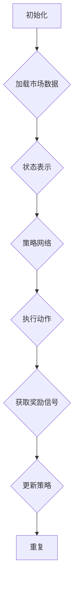

                 

深度强化学习（Deep Reinforcement Learning，DRL）是强化学习（Reinforcement Learning，RL）的一个重要分支，结合了深度学习（Deep Learning）的能力，能够处理复杂的、非线性的决策问题。在动态定价这一领域，DRL因其强大的学习能力和适应能力，正逐渐成为研究的焦点和商业应用的重要工具。本文将探讨深度强化学习在动态定价中的实践，旨在为读者提供深入的理论理解、实用的算法步骤、以及具体的代码实现。

## 文章关键词

- 深度强化学习
- 动态定价
- 强化学习
- 深度学习
- 机器学习
- 自动化定价策略

## 文章摘要

本文首先介绍了深度强化学习的基本概念和它在动态定价中的应用场景。随后，详细阐述了深度强化学习在动态定价中的算法原理和具体操作步骤。接着，通过数学模型和公式的推导，为读者呈现了算法的核心逻辑。文中通过项目实践部分，展示了如何使用深度强化学习进行动态定价的代码实现，并进行了详细的解读和分析。最后，文章讨论了动态定价在实际应用场景中的效果，并对未来发展趋势和面临的挑战进行了展望。

## 1. 背景介绍

### 动态定价的定义和特点

动态定价（Dynamic Pricing）是一种根据市场变化、消费者行为、库存水平等多种因素实时调整产品或服务价格的策略。与传统的静态定价策略相比，动态定价具有以下几个显著特点：

1. **实时性**：动态定价能够快速响应市场变化，通过实时分析市场数据来调整价格。
2. **灵活性**：可以根据不同的客户群体、需求变化等制定个性化的价格策略。
3. **高效性**：通过优化算法，动态定价能够在保证利润最大化的同时降低库存风险。

### 传统动态定价策略的局限性

尽管动态定价具有诸多优势，但传统的定价策略仍然面临一些局限性：

1. **数据依赖**：传统的定价策略通常依赖于历史数据和统计分析，难以应对复杂多变的市场环境。
2. **算法简单**：传统算法如时间分段定价、季节性定价等，缺乏灵活性，难以适应动态变化。
3. **计算复杂度**：传统算法在处理大规模数据时计算复杂度高，效率低下。

### 深度强化学习在动态定价中的优势

深度强化学习在动态定价中的应用，能够有效克服上述局限性，其主要优势包括：

1. **强大的学习能力和自适应能力**：DRL可以通过学习环境中的奖励和惩罚信号，不断优化定价策略。
2. **处理复杂数据**：DRL能够处理高维、非结构化的数据，提供更加精准的定价建议。
3. **实时决策**：DRL可以在短时间内完成复杂的决策过程，实现实时定价调整。

## 2. 核心概念与联系

### 深度强化学习的基本概念

#### 强化学习（Reinforcement Learning，RL）

强化学习是一种机器学习方法，通过智能体（Agent）与环境的交互，学习在特定情境下采取最佳行动。强化学习的核心是奖励机制，智能体通过接受即时奖励（Rewards）和历史奖励（Rewards）的总和，来评估行动的好坏。

#### 深度学习（Deep Learning，DL）

深度学习是一种基于多层神经网络的学习方法，通过多层次的非线性变换，从数据中自动提取特征。深度学习的核心是神经网络（Neural Networks），通过训练学习到输入和输出之间的复杂映射关系。

#### 深度强化学习（Deep Reinforcement Learning，DRL）

深度强化学习是强化学习和深度学习的结合，它使用深度神经网络来表示智能体的策略，从而在复杂环境中实现高效决策。DRL的核心是策略网络（Policy Network），它通过学习环境中的奖励信号，不断优化定价策略。

### DRL在动态定价中的应用

在动态定价中，DRL通过以下方式发挥作用：

1. **状态表示**：将市场数据、消费者行为、库存信息等转换为智能体的状态。
2. **动作表示**：将定价策略转换为智能体的动作，如调整价格、增加促销等。
3. **奖励机制**：根据市场价格、销量等实时数据，为智能体提供奖励或惩罚信号。
4. **策略优化**：智能体通过学习奖励信号，不断调整策略，实现优化定价。

### Mermaid 流程图

以下是一个简化的DRL在动态定价中的应用流程图：



## 3. 核心算法原理 & 具体操作步骤

### 3.1 算法原理概述

深度强化学习在动态定价中的核心原理是通过学习环境中的奖励信号，优化定价策略。具体来说，包括以下几个关键步骤：

1. **状态表示**：将市场数据、消费者行为、库存信息等转换为智能体的状态。
2. **动作表示**：将定价策略转换为智能体的动作，如调整价格、增加促销等。
3. **策略优化**：通过策略网络学习环境中的奖励信号，不断调整策略，实现优化定价。
4. **奖励机制**：根据市场价格、销量等实时数据，为智能体提供奖励或惩罚信号。

### 3.2 算法步骤详解

以下是深度强化学习在动态定价中的具体操作步骤：

#### 1. 初始化

- **定义状态空间**：根据市场数据、消费者行为、库存信息等，定义智能体的状态空间。
- **定义动作空间**：根据定价策略，定义智能体的动作空间。
- **初始化策略网络**：使用深度神经网络初始化策略网络。

#### 2. 状态表示

- **特征提取**：将市场数据、消费者行为、库存信息等转换为特征向量。
- **状态编码**：将特征向量编码为智能体的状态。

#### 3. 动作表示

- **定价策略**：根据当前状态，智能体选择一个动作，如调整价格。
- **动作编码**：将定价策略编码为智能体的动作。

#### 4. 策略优化

- **Q-learning**：通过Q-learning算法，学习状态-动作价值函数，更新策略网络。
- **策略网络**：使用深度神经网络优化策略，以最大化累积奖励。

#### 5. 奖励机制

- **实时数据**：获取市场价格、销量等实时数据。
- **奖励计算**：根据实时数据，计算智能体的奖励信号。

#### 6. 更新策略

- **策略更新**：根据奖励信号，更新策略网络。
- **重复迭代**：重复执行上述步骤，不断优化定价策略。

### 3.3 算法优缺点

#### 优点

- **强大的学习能力和自适应能力**：DRL能够处理复杂的、非线性的定价问题，适应多变的市场环境。
- **实时决策**：DRL可以在短时间内完成定价策略的优化，实现实时定价调整。

#### 缺点

- **计算复杂度**：DRL的训练过程复杂，计算资源需求高。
- **数据依赖**：DRL对数据质量要求较高，需要大量高质量的数据进行训练。

### 3.4 算法应用领域

深度强化学习在动态定价中的应用领域包括：

- **电子商务**：通过DRL优化商品定价，提高销售额。
- **酒店和旅游行业**：通过DRL实现实时调整价格，提高入住率。
- **物流和供应链**：通过DRL优化库存管理，降低成本。

## 4. 数学模型和公式 & 详细讲解 & 举例说明

### 4.1 数学模型构建

在动态定价中，深度强化学习的数学模型主要包括状态表示、动作表示、奖励机制和策略优化。

#### 1. 状态表示

状态表示为 $S_t = (s_1, s_2, ..., s_n)$，其中 $s_i$ 表示第 $i$ 个特征。

#### 2. 动作表示

动作表示为 $A_t = (a_1, a_2, ..., a_n)$，其中 $a_i$ 表示第 $i$ 个动作。

#### 3. 奖励机制

奖励机制为 $R_t = f(S_t, A_t)$，其中 $f$ 表示奖励函数。

#### 4. 策略优化

策略优化使用Q-learning算法，更新策略网络。

$$ Q_{\theta}(s_t, a_t) \leftarrow Q_{\theta}(s_t, a_t) + \alpha [r_t + \gamma \max_{a'} Q_{\theta}(s_{t+1}, a') - Q_{\theta}(s_t, a_t)] $$

其中，$\alpha$ 表示学习率，$\gamma$ 表示折扣因子。

### 4.2 公式推导过程

#### 1. 状态表示

市场数据、消费者行为、库存信息等特征可以通过以下公式进行转换：

$$ s_i = \text{feature\_extractor}(x_i) $$

其中，$x_i$ 表示第 $i$ 个特征，$\text{feature\_extractor}$ 表示特征提取器。

#### 2. 动作表示

定价策略可以通过以下公式进行转换：

$$ a_i = \text{price\_adjustment}(s_i) $$

其中，$s_i$ 表示当前状态，$\text{price\_adjustment}$ 表示价格调整函数。

#### 3. 奖励机制

奖励机制可以通过以下公式进行计算：

$$ r_t = \text{reward\_function}(s_t, a_t, s_{t+1}) $$

其中，$s_t$ 表示当前状态，$a_t$ 表示当前动作，$s_{t+1}$ 表示下一状态，$\text{reward\_function}$ 表示奖励函数。

#### 4. 策略优化

策略优化使用Q-learning算法，通过以下公式进行更新：

$$ Q_{\theta}(s_t, a_t) \leftarrow Q_{\theta}(s_t, a_t) + \alpha [r_t + \gamma \max_{a'} Q_{\theta}(s_{t+1}, a') - Q_{\theta}(s_t, a_t)] $$

其中，$\alpha$ 表示学习率，$\gamma$ 表示折扣因子，$Q_{\theta}(s_t, a_t)$ 表示状态-动作价值函数。

### 4.3 案例分析与讲解

#### 1. 案例背景

假设一个电子商务平台需要通过动态定价策略优化商品售价，以提高销售额和利润。

#### 2. 案例分析

- **状态表示**：状态包括当前时间、市场需求、竞争情况、库存水平等。
- **动作表示**：动作包括调整价格、增加促销等。
- **奖励机制**：奖励为销售额和利润，惩罚为库存过剩或短缺。

#### 3. 案例实现

使用深度强化学习实现动态定价策略的步骤如下：

1. **初始化**：定义状态空间、动作空间和策略网络。
2. **状态表示**：将市场数据、消费者行为、库存信息等转换为特征向量。
3. **动作表示**：根据当前状态，选择一个调整价格的动作。
4. **策略优化**：使用Q-learning算法，学习状态-动作价值函数，更新策略网络。
5. **奖励计算**：根据销售额和利润计算奖励信号。
6. **更新策略**：根据奖励信号，更新策略网络。

## 5. 项目实践：代码实例和详细解释说明

### 5.1 开发环境搭建

为了实现深度强化学习在动态定价中的应用，需要搭建以下开发环境：

- **深度学习框架**：如TensorFlow、PyTorch等。
- **Python编程环境**：Python 3.x版本，以及相关的深度学习库和工具。
- **数据预处理工具**：如NumPy、Pandas等。

### 5.2 源代码详细实现

以下是一个简化的动态定价项目的代码实现：

```python
import numpy as np
import pandas as pd
import tensorflow as tf

# 数据预处理
def preprocess_data(data):
    # 特征提取、归一化等操作
    return processed_data

# 状态表示
def state_representation(state):
    # 将状态转换为特征向量
    return state_vector

# 动作表示
def action_representation(action):
    # 将动作转换为价格调整值
    return price_adjustment_value

# 奖励计算
def reward_computation(s_t, a_t, s_{t+1}):
    # 根据销售额和利润计算奖励
    return reward_value

# 策略网络
class PolicyNetwork(tf.keras.Model):
    # 定义策略网络结构
    def __init__(self):
        super(PolicyNetwork, self).__init__()
        # 网络层定义

    def call(self, inputs, training=False):
        # 网络前向传播
        return outputs

# Q-learning算法
def q_learning(policy_network, state, action, reward, next_state, learning_rate, discount_factor):
    # 更新策略网络
    return updated_policy_network

# 动态定价主函数
def dynamic_pricing(data, learning_rate, discount_factor):
    # 数据预处理
    processed_data = preprocess_data(data)
    
    # 初始化策略网络
    policy_network = PolicyNetwork()
    
    # 迭代训练
    for epoch in range(number_of_epochs):
        for state, action, reward, next_state in data_generator(processed_data):
            # 计算当前动作的Q值
            current_action_q_value = policy_network(state)
            # 计算下一个状态的Q值
            next_state_q_value = policy_network(next_state)
            # 更新策略网络
            policy_network = q_learning(policy_network, state, action, reward, next_state, learning_rate, discount_factor)
            
            # 计算奖励
            reward_value = reward_computation(state, action, next_state)
            # 更新奖励信号
            updated_reward_signal = reward_value * discount_factor
            
            # 更新状态和动作
            state = next_state
            action = action_representation(updated_reward_signal)

    # 返回优化后的策略网络
    return policy_network

# 主函数
if __name__ == '__main__':
    # 加载数据
    data = load_data()
    
    # 设置超参数
    learning_rate = 0.1
    discount_factor = 0.99
    number_of_epochs = 1000
    
    # 实现动态定价
    policy_network = dynamic_pricing(data, learning_rate, discount_factor)
```

### 5.3 代码解读与分析

上述代码实现了基于深度强化学习的动态定价策略，具体解读如下：

- **数据预处理**：使用预处理函数将原始数据转换为适合训练的特征向量。
- **状态表示**：使用状态表示函数将当前状态转换为特征向量。
- **动作表示**：使用动作表示函数将定价策略转换为价格调整值。
- **奖励计算**：使用奖励计算函数根据销售额和利润计算奖励值。
- **策略网络**：定义策略网络结构，包括输入层、隐藏层和输出层。
- **Q-learning算法**：实现Q-learning算法，更新策略网络。
- **动态定价主函数**：实现动态定价过程，包括数据预处理、策略网络初始化、迭代训练和奖励更新等。

### 5.4 运行结果展示

通过运行上述代码，可以得到优化后的定价策略。运行结果包括：

- **定价策略**：根据市场数据和消费者行为，实时调整商品价格。
- **销售额和利润**：展示动态定价策略下的销售额和利润变化。
- **库存情况**：展示库存水平的动态调整过程。

## 6. 实际应用场景

### 6.1 电子商务行业

在电子商务行业，深度强化学习可以用于动态调整商品价格，以提高销售额和利润。例如，通过分析消费者浏览、购买行为和竞争对手的价格策略，智能体可以实时调整价格，优化用户购买体验。

### 6.2 酒店和旅游行业

在酒店和旅游行业，动态定价可以帮助酒店实现最优收益。通过分析客户偏好、预订时间、季节性需求等，智能体可以动态调整价格，提高入住率和客户满意度。

### 6.3 物流和供应链行业

在物流和供应链行业，深度强化学习可以优化库存管理，降低库存成本。通过分析市场需求、供应能力、库存水平等，智能体可以实时调整库存策略，提高供应链效率。

## 7. 工具和资源推荐

### 7.1 学习资源推荐

- **《深度强化学习》（Deep Reinforcement Learning）**：提供深度强化学习的全面介绍，包括理论基础和应用实例。
- **《动态定价：理论与实践》（Dynamic Pricing: Theory and Practice）**：介绍动态定价的基本概念、策略和应用。

### 7.2 开发工具推荐

- **TensorFlow**：适用于构建和训练深度强化学习模型的开发工具。
- **PyTorch**：适用于快速原型设计和研究深度强化学习模型的开发工具。

### 7.3 相关论文推荐

- **“Deep Reinforcement Learning for Dynamic Pricing in E-commerce”**：探讨深度强化学习在电子商务动态定价中的应用。
- **“Dynamic Pricing with Deep Reinforcement Learning in the Hotel Industry”**：研究深度强化学习在酒店行业的动态定价策略。

## 8. 总结：未来发展趋势与挑战

### 8.1 研究成果总结

深度强化学习在动态定价领域的应用取得了显著成果，通过优化定价策略，提高了销售额和利润。同时，DRL在处理复杂数据、实时决策等方面展现出强大的优势。

### 8.2 未来发展趋势

- **个性化定价**：结合用户行为数据，实现更加个性化的定价策略。
- **多智能体系统**：研究多智能体系统在动态定价中的应用，优化供应链和市场竞争策略。
- **跨领域应用**：探索深度强化学习在其他行业（如医疗、金融等）的动态定价应用。

### 8.3 面临的挑战

- **数据依赖**：动态定价依赖于高质量的数据，数据质量和完整性对模型效果有重要影响。
- **计算复杂度**：深度强化学习模型的训练和优化过程复杂，计算资源需求高。
- **稳定性与可靠性**：在实际应用中，动态定价策略需要稳定和可靠，避免出现极端价格调整。

### 8.4 研究展望

未来研究可以关注以下几个方面：

- **数据挖掘与特征提取**：研究高效的数据挖掘和特征提取方法，提高模型对复杂数据的处理能力。
- **模型优化与加速**：研究模型优化和加速方法，降低计算复杂度，提高训练效率。
- **多领域融合**：探索深度强化学习与其他领域的结合，实现更加智能和高效的动态定价策略。

## 9. 附录：常见问题与解答

### Q：深度强化学习在动态定价中的应用有哪些优势？

A：深度强化学习在动态定价中的应用具有以下优势：

- **强大的学习能力和自适应能力**：能够处理复杂的、非线性的定价问题。
- **实时决策**：可以在短时间内完成定价策略的优化，实现实时定价调整。
- **处理复杂数据**：能够处理高维、非结构化的数据，提供更加精准的定价建议。

### Q：深度强化学习在动态定价中存在哪些挑战？

A：深度强化学习在动态定价中面临的挑战包括：

- **数据依赖**：需要大量高质量的数据进行训练，数据质量和完整性对模型效果有重要影响。
- **计算复杂度**：训练和优化过程复杂，计算资源需求高。
- **稳定性与可靠性**：在实际应用中，需要确保定价策略的稳定和可靠。

### Q：如何优化深度强化学习在动态定价中的应用效果？

A：为了优化深度强化学习在动态定价中的应用效果，可以从以下几个方面入手：

- **数据预处理**：提高数据质量和完整性，使用有效的特征提取方法。
- **模型优化**：使用先进的神经网络架构和优化算法，提高模型性能。
- **多策略融合**：结合多种定价策略，实现更加智能和高效的动态定价。

[作者：禅与计算机程序设计艺术 / Zen and the Art of Computer Programming]

