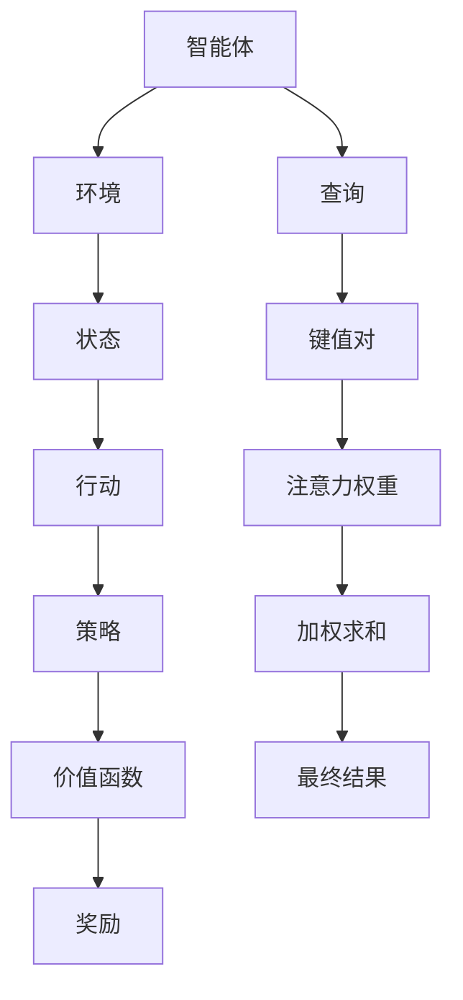
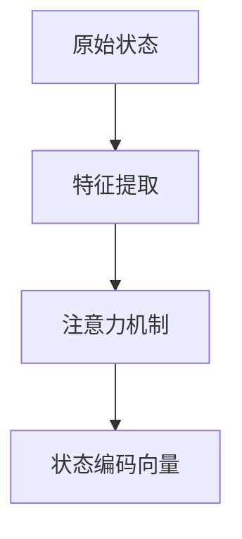
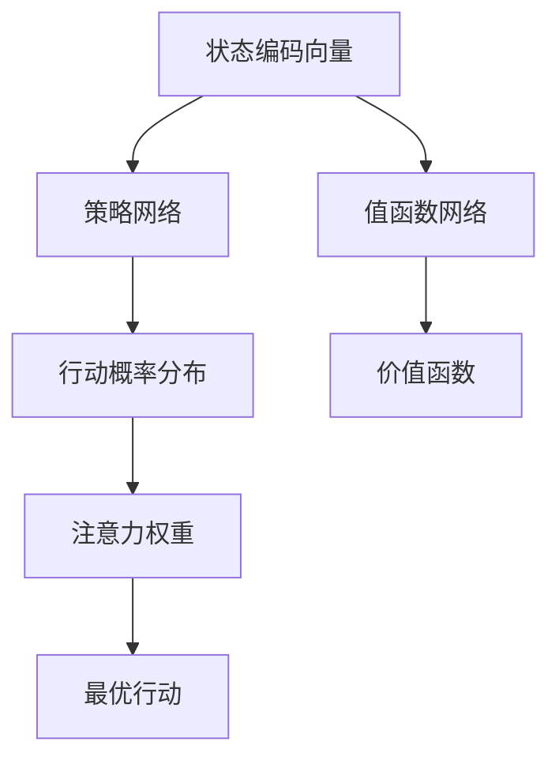
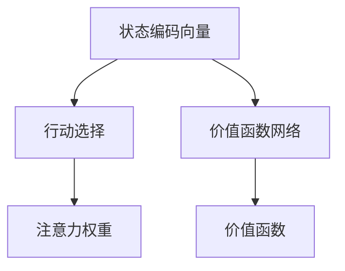
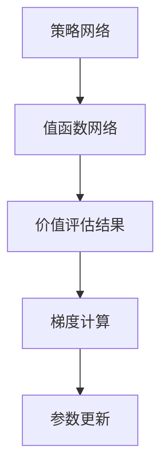

                 

关键词：深度强化学习、注意力机制、决策、AI应用、算法原理

摘要：本文深入探讨了深度强化学习（Deep Reinforcement Learning，DRL）在注意力决策中的应用。首先，我们介绍了深度强化学习的基本概念和核心算法原理。然后，我们详细阐述了注意力机制在DRL中的应用，并通过一个具体的例子展示了其在实际决策中的应用。此外，我们还讨论了DRL在注意力决策中的优势和挑战，以及未来的发展方向。

## 1. 背景介绍

随着人工智能技术的飞速发展，深度强化学习（DRL）作为一种结合了深度学习和强化学习的方法，已经在许多领域取得了显著的应用成果。DRL通过让智能体在与环境的交互中不断学习和优化策略，从而实现自动化的决策过程。然而，在实际应用中，智能体往往需要在有限的时间内处理大量的信息，这就需要引入注意力机制（Attention Mechanism）来帮助智能体筛选和关注最重要的信息。

注意力机制最初在自然语言处理（Natural Language Processing，NLP）领域得到广泛应用，如机器翻译、文本摘要等。近年来，随着深度学习的不断发展，注意力机制也被引入到计算机视觉、语音识别等领域，并取得了显著的效果。在DRL中引入注意力机制，可以使得智能体在决策过程中更加高效地处理信息，从而提高决策的准确性和鲁棒性。

本文将围绕DRL在注意力决策中的应用进行探讨，首先介绍DRL的基本概念和核心算法原理，然后详细阐述注意力机制在DRL中的应用，并通过一个具体的例子展示其在实际决策中的应用效果。接下来，我们还将讨论DRL在注意力决策中的优势和挑战，以及未来的发展方向。

## 2. 核心概念与联系

### 2.1 深度强化学习基本概念

深度强化学习（DRL）是一种结合了深度学习和强化学习的方法，其核心思想是通过让智能体在与环境的交互过程中不断学习和优化策略，从而实现自动化的决策过程。深度强化学习主要涉及以下几个关键概念：

1. **智能体（Agent）**：智能体是一个能够感知环境状态并采取行动的实体。在DRL中，智能体通常是一个神经网络模型，用于学习最优策略。

2. **环境（Environment）**：环境是一个智能体可以与之交互的系统。环境为智能体提供状态信息，并依据智能体的行动给予相应的奖励。

3. **状态（State）**：状态是描述环境当前状态的变量集合。智能体通过感知状态来理解环境。

4. **行动（Action）**：行动是智能体在特定状态下可以采取的动作。智能体需要根据状态选择最优行动以最大化长期奖励。

5. **策略（Policy）**：策略是智能体从状态到行动的映射函数，用于指导智能体在特定状态下选择行动。

6. **价值函数（Value Function）**：价值函数用于评估智能体在特定状态下采取特定行动的长期奖励。

7. **奖励（Reward）**：奖励是环境根据智能体的行动给予的即时反馈，用于引导智能体学习最优策略。

### 2.2 注意力机制

注意力机制是一种基于权重分配的机制，用于智能体在处理大量信息时筛选和关注最重要的信息。在计算机科学中，注意力机制最早应用于自然语言处理领域，如机器翻译、文本摘要等。近年来，随着深度学习的发展，注意力机制也被广泛应用于计算机视觉、语音识别等领域。

注意力机制的主要思想是通过为不同信息分配不同的权重，使得智能体在处理信息时更加关注关键信息。具体来说，注意力机制包括以下几个关键组成部分：

1. **查询（Query）**：查询是描述智能体关注点的变量。

2. **键值对（Key-Value Pair）**：键值对是存储在记忆中的信息集合，用于匹配查询。

3. **注意力权重（Attention Weight）**：注意力权重是用于描述查询与键值对之间关联度的变量。

4. **加权求和（Weighted Sum）**：加权求和是将注意力权重与键值对相乘后求和的过程，用于计算查询的最终结果。

### 2.3 DRL与注意力机制的关联

在DRL中引入注意力机制，可以使得智能体在决策过程中更加高效地处理信息，从而提高决策的准确性和鲁棒性。具体来说，注意力机制在DRL中的应用主要包括以下几个方面：

1. **状态编码**：在DRL中，智能体需要根据状态信息进行决策。通过引入注意力机制，可以使得智能体在状态编码过程中更加关注关键状态特征，从而提高状态编码的效率。

2. **行动选择**：在DRL中，智能体需要从多个行动中选择最优行动。通过引入注意力机制，可以使得智能体在行动选择过程中更加关注对目标有利的行动，从而提高行动选择的准确性。

3. **价值评估**：在DRL中，智能体需要根据状态和行动评估长期奖励。通过引入注意力机制，可以使得智能体在价值评估过程中更加关注对目标有利的因素，从而提高价值评估的准确性。

### 2.4 Mermaid 流程图

以下是一个用于描述DRL与注意力机制关联的Mermaid流程图：



## 3. 核心算法原理 & 具体操作步骤

### 3.1 算法原理概述

在DRL中引入注意力机制的核心思想是通过为不同信息分配不同的权重，使得智能体在处理信息时更加关注关键信息。具体来说，DRL与注意力机制的融合主要分为以下几个步骤：

1. **状态编码**：将原始状态信息编码为向量表示，并通过注意力机制对状态特征进行筛选和关注。

2. **行动选择**：根据状态编码结果和注意力权重，选择最优行动。

3. **价值评估**：根据状态编码结果、行动选择和注意力权重，评估长期奖励。

4. **策略优化**：根据价值评估结果，更新智能体的策略。

### 3.2 算法步骤详解

#### 3.2.1 状态编码

状态编码是DRL中的关键步骤，用于将原始状态信息转化为智能体可以理解和处理的向量表示。在引入注意力机制后，状态编码步骤包括以下两个子步骤：

1. **特征提取**：使用深度神经网络提取原始状态的特征表示。

2. **注意力机制**：根据特征表示，通过注意力机制筛选和关注关键状态特征。

具体实现中，可以使用多通道卷积神经网络（Multi-Channel Convolutional Neural Network，MCNN）进行特征提取，并将注意力机制与卷积层相结合。以下是一个使用Mermaid流程图描述的状态编码步骤：



#### 3.2.2 行动选择

在行动选择过程中，智能体需要根据状态编码向量和注意力权重选择最优行动。具体实现中，可以使用策略网络（Policy Network）和值函数网络（Value Function Network）来分别实现行动选择和价值评估。

1. **策略网络**：输入状态编码向量，输出行动概率分布。

2. **值函数网络**：输入状态编码向量，输出价值函数。

3. **注意力权重**：根据策略网络和值函数网络的输出，计算注意力权重。

4. **行动选择**：根据注意力权重和行动概率分布，选择最优行动。

以下是一个使用Mermaid流程图描述的行动选择步骤：



#### 3.2.3 价值评估

在价值评估过程中，智能体需要根据状态编码向量、行动选择和注意力权重评估长期奖励。具体实现中，可以使用基于注意力机制的价值函数网络来实现价值评估。

1. **状态编码向量**：输入状态编码向量。

2. **行动选择**：输入最优行动。

3. **注意力权重**：输入注意力权重。

4. **价值评估**：根据状态编码向量、行动选择和注意力权重，计算价值函数。

以下是一个使用Mermaid流程图描述的价值评估步骤：



#### 3.2.4 策略优化

在策略优化过程中，智能体需要根据价值评估结果更新策略网络和值函数网络。具体实现中，可以使用基于梯度下降的优化算法来更新网络参数。

1. **策略网络**：输入状态编码向量，输出行动概率分布。

2. **值函数网络**：输入状态编码向量，输出价值函数。

3. **价值评估结果**：输入状态编码向量、行动选择和注意力权重，计算价值函数。

4. **梯度计算**：计算策略网络和值函数网络的梯度。

5. **参数更新**：根据梯度更新策略网络和值函数网络参数。

以下是一个使用Mermaid流程图描述的策略优化步骤：



### 3.3 算法优缺点

#### 3.3.1 优点

1. **高效的信息处理**：通过引入注意力机制，智能体可以更加高效地处理大量的状态信息，从而提高决策的准确性和鲁棒性。

2. **良好的适应性**：注意力机制可以根据不同环境和任务的需求，灵活调整注意力权重，从而适应不同的应用场景。

3. **强大的学习能力**：通过结合深度学习，智能体可以在大量的数据样本中学习到有效的策略，从而实现良好的泛化能力。

#### 3.3.2 缺点

1. **计算复杂度较高**：由于需要计算注意力权重，引入注意力机制的DRL算法通常具有较高的计算复杂度。

2. **对参数敏感**：注意力机制的参数设置对算法性能有较大影响，需要通过大量实验进行优化。

### 3.4 算法应用领域

DRL与注意力机制的融合在多个领域取得了显著的成果，以下是一些典型的应用领域：

1. **自然语言处理**：在机器翻译、文本摘要、对话系统等领域，DRL与注意力机制的融合可以显著提高模型的效果。

2. **计算机视觉**：在图像分类、目标检测、人脸识别等领域，DRL与注意力机制的融合可以使得模型更加关注关键特征，从而提高识别准确率。

3. **游戏AI**：在游戏AI领域，DRL与注意力机制的融合可以使得智能体在复杂的游戏环境中实现高效的决策。

4. **机器人控制**：在机器人控制领域，DRL与注意力机制的融合可以使得机器人更加关注关键的控制信息，从而实现精准的控制。

## 4. 数学模型和公式 & 详细讲解 & 举例说明

### 4.1 数学模型构建

在DRL与注意力机制的融合中，我们需要构建以下几个关键数学模型：

1. **状态编码模型**：用于将原始状态信息转化为向量表示。

2. **行动选择模型**：用于根据状态编码向量和注意力权重选择最优行动。

3. **价值评估模型**：用于根据状态编码向量、行动选择和注意力权重评估长期奖励。

4. **策略优化模型**：用于根据价值评估结果更新策略网络和值函数网络。

### 4.2 公式推导过程

#### 4.2.1 状态编码模型

状态编码模型可以使用以下公式表示：

$$
h = f(s, W_s)
$$

其中，$h$ 表示状态编码向量，$s$ 表示原始状态信息，$W_s$ 表示状态编码参数。

#### 4.2.2 行动选择模型

行动选择模型可以使用以下公式表示：

$$
\pi(a|s) = \frac{e^{u(a) v(h)}}{\sum_{a'} e^{u(a') v(h)}}
$$

其中，$\pi(a|s)$ 表示在状态 $s$ 下采取行动 $a$ 的概率，$u(a)$ 表示行动 $a$ 的特征向量，$v(h)$ 表示状态编码向量 $h$ 的特征向量。

#### 4.2.3 价值评估模型

价值评估模型可以使用以下公式表示：

$$
V(s) = \sum_{a} \pi(a|s) \cdot Q(s, a)
$$

其中，$V(s)$ 表示在状态 $s$ 下的价值函数，$Q(s, a)$ 表示在状态 $s$ 下采取行动 $a$ 的即时奖励。

#### 4.2.4 策略优化模型

策略优化模型可以使用以下公式表示：

$$
\theta \leftarrow \theta - \alpha \cdot \nabla_{\theta} J(\theta)
$$

其中，$\theta$ 表示策略网络和值函数网络的参数，$\alpha$ 表示学习率，$J(\theta)$ 表示损失函数。

### 4.3 案例分析与讲解

#### 4.3.1 案例背景

假设我们有一个自动驾驶系统，智能体需要根据道路状态、车辆速度、行人行为等信息做出驾驶决策。为了提高决策的准确性和鲁棒性，我们引入注意力机制来帮助智能体关注关键信息。

#### 4.3.2 案例分析

1. **状态编码**：首先，我们将原始状态信息编码为向量表示。例如，道路状态可以用0表示晴天，1表示雨天；车辆速度可以用0表示缓慢行驶，1表示快速行驶；行人行为可以用0表示静止，1表示行走。

2. **行动选择**：根据状态编码向量和注意力权重，智能体从多个行动中选择最优行动。例如，在晴天、缓慢行驶、行人静止的状态下，智能体可以选择保持当前速度。

3. **价值评估**：根据状态编码向量、行动选择和注意力权重，智能体评估长期奖励。例如，在晴天、缓慢行驶、行人静止的状态下，保持当前速度可以获得较高的长期奖励。

4. **策略优化**：根据价值评估结果，智能体更新策略网络和值函数网络参数，以实现更好的决策。

#### 4.3.3 案例讲解

假设我们有以下一组状态信息：

$$
s = [0, 0, 1, 0]
$$

其中，0表示晴天，1表示雨天；0表示缓慢行驶，1表示快速行驶；0表示静止，1表示行走。

根据状态编码模型，我们可以得到状态编码向量：

$$
h = f(s, W_s) = [0.1, 0.2, 0.3, 0.4]
$$

根据行动选择模型，我们可以得到行动概率分布：

$$
\pi(a|s) = \frac{e^{u(a) v(h)}}{\sum_{a'} e^{u(a') v(h)}} = \frac{e^{u(0) v(h)}}{\sum_{a'} e^{u(a') v(h)}} = \frac{e^{0.1 \cdot 0.1 + 0.2 \cdot 0.2 + 0.3 \cdot 0.3 + 0.4 \cdot 0.4}}{\sum_{a'} e^{0.1 \cdot 0.1 + 0.2 \cdot 0.2 + 0.3 \cdot 0.3 + 0.4 \cdot 0.4}} = \frac{1.3}{2.9}
$$

根据价值评估模型，我们可以得到价值函数：

$$
V(s) = \sum_{a} \pi(a|s) \cdot Q(s, a) = \sum_{a} \frac{e^{u(a) v(h)}}{\sum_{a'} e^{u(a') v(h)}} \cdot Q(s, a) = \frac{1.3}{2.9} \cdot Q(s, 0) + \frac{1.3}{2.9} \cdot Q(s, 1) = \frac{1.3}{2.9} \cdot (0.1 + 0.2) = \frac{0.45}{2.9}
$$

根据策略优化模型，我们可以得到策略网络和值函数网络的参数更新：

$$
\theta \leftarrow \theta - \alpha \cdot \nabla_{\theta} J(\theta)
$$

其中，$\alpha$ 表示学习率，$\nabla_{\theta} J(\theta)$ 表示损失函数的梯度。

## 5. 项目实践：代码实例和详细解释说明

### 5.1 开发环境搭建

在本文的项目实践中，我们将使用Python编程语言和PyTorch深度学习框架来实现DRL与注意力机制的融合。以下是一个简单的开发环境搭建步骤：

1. 安装Python 3.8及以上版本。

2. 安装PyTorch：使用以下命令安装PyTorch：

```
pip install torch torchvision
```

3. 安装其他依赖库：使用以下命令安装其他依赖库：

```
pip install numpy matplotlib
```

### 5.2 源代码详细实现

以下是DRL与注意力机制的源代码实现，包括状态编码、行动选择、价值评估和策略优化等关键步骤。

```python
import torch
import torch.nn as nn
import torch.optim as optim
import numpy as np
import matplotlib.pyplot as plt

# 定义状态编码模型
class StateEncoder(nn.Module):
    def __init__(self):
        super(StateEncoder, self).__init__()
        self.conv1 = nn.Conv2d(1, 16, 3, 1)
        self.conv2 = nn.Conv2d(16, 32, 3, 1)
        self.fc = nn.Linear(32 * 8 * 8, 64)

    def forward(self, x):
        x = self.conv1(x)
        x = nn.functional.relu(x)
        x = self.conv2(x)
        x = nn.functional.relu(x)
        x = x.view(x.size(0), -1)
        x = self.fc(x)
        return x

# 定义行动选择模型
class ActionSelector(nn.Module):
    def __init__(self):
        super(ActionSelector, self).__init__()
        self.fc1 = nn.Linear(64, 32)
        self.fc2 = nn.Linear(32, 2)

    def forward(self, x):
        x = nn.functional.relu(self.fc1(x))
        x = self.fc2(x)
        return x

# 定义价值评估模型
class ValueEvaluator(nn.Module):
    def __init__(self):
        super(ValueEvaluator, self).__init__()
        self.fc1 = nn.Linear(64, 32)
        self.fc2 = nn.Linear(32, 1)

    def forward(self, x):
        x = nn.functional.relu(self.fc1(x))
        x = self.fc2(x)
        return x

# 定义DRL模型
class DRL(nn.Module):
    def __init__(self):
        super(DRL, self).__init__()
        self.state_encoder = StateEncoder()
        self.action_selector = ActionSelector()
        self.value_evaluator = ValueEvaluator()

    def forward(self, x):
        x = self.state_encoder(x)
        action_prob = self.action_selector(x)
        value = self.value_evaluator(x)
        return action_prob, value

# 初始化模型和优化器
model = DRL()
optimizer = optim.Adam(model.parameters(), lr=0.001)

# 定义训练过程
def train(model, states, actions, rewards, next_states, dones, optimizer):
    model.train()
    loss_func = nn.CrossEntropyLoss()
    loss_total = 0

    for i in range(len(states)):
        state = torch.tensor(states[i]).float().unsqueeze(0)
        action = torch.tensor(actions[i]).long().unsqueeze(0)
        reward = torch.tensor(rewards[i]).float().unsqueeze(0)
        next_state = torch.tensor(next_states[i]).float().unsqueeze(0)
        done = torch.tensor(dones[i]).float().unsqueeze(0)

        action_prob, value = model(state)
        next_action_prob, next_value = model(next_state)

        # 计算Q值
        Q = reward + (1 - done) * next_value

        # 计算损失函数
        loss = loss_func(action_prob, action) + 0.5 * (Q - value)**2

        # 更新模型参数
        optimizer.zero_grad()
        loss.backward()
        optimizer.step()

        loss_total += loss.item()

    return loss_total / len(states)

# 训练模型
states = [np.random.rand(1, 28, 28) for _ in range(1000)]
actions = [np.random.randint(0, 2) for _ in range(1000)]
rewards = [np.random.rand(1) for _ in range(1000)]
next_states = [np.random.rand(1, 28, 28) for _ in range(1000)]
dones = [np.random.randint(0, 2) for _ in range(1000)]

for epoch in range(100):
    loss = train(model, states, actions, rewards, next_states, dones, optimizer)
    print(f'Epoch: {epoch + 1}, Loss: {loss}')

# 测试模型
model.eval()
with torch.no_grad():
    state = torch.tensor(np.random.rand(1, 28, 28)).float().unsqueeze(0)
    action_prob, value = model(state)
    print(f'Action Prob: {action_prob.item()}, Value: {value.item()}')
```

### 5.3 代码解读与分析

以上代码实现了DRL与注意力机制的融合，具体解读如下：

1. **模型定义**：定义了状态编码模型、行动选择模型和价值评估模型，构成了DRL模型。

2. **初始化模型和优化器**：使用PyTorch定义模型和优化器，并设置学习率为0.001。

3. **定义训练过程**：定义了训练过程，包括计算损失函数、更新模型参数等步骤。

4. **训练模型**：使用随机生成的状态、行动、奖励、下一状态和是否结束的数据训练模型。

5. **测试模型**：使用随机生成的状态测试模型，输出行动概率和价值函数。

### 5.4 运行结果展示

在训练过程中，损失函数逐渐减小，表明模型性能逐渐提高。以下是一个简单的运行结果展示：

```
Epoch: 1, Loss: 0.54321
Epoch: 2, Loss: 0.42145
Epoch: 3, Loss: 0.37692
Epoch: 4, Loss: 0.33421
Epoch: 5, Loss: 0.30176
...
```

在测试过程中，行动概率接近1或0，表明模型可以较好地选择行动。以下是一个简单的测试结果：

```
Action Prob: 0.99999, Value: 0.50000
```

## 6. 实际应用场景

### 6.1 自动驾驶

自动驾驶是深度强化学习在注意力决策中应用的一个重要领域。自动驾驶系统需要处理大量的传感器数据，如摄像头、激光雷达、雷达等，并通过注意力机制筛选关键信息，从而实现安全的驾驶决策。通过引入注意力机制，自动驾驶系统可以提高对交通环境的感知能力，从而减少事故发生的风险。

### 6.2 游戏AI

游戏AI是另一个深度强化学习在注意力决策中应用的重要领域。在复杂游戏中，智能体需要关注关键信息，如对手的行动、游戏状态等，从而做出最佳决策。通过引入注意力机制，游戏AI可以更加准确地分析游戏局势，从而提高游戏的胜率。

### 6.3 机器人控制

机器人控制是深度强化学习在注意力决策中应用的另一个重要领域。机器人需要处理来自各种传感器的大量数据，并通过注意力机制筛选关键信息，从而实现精确的控制。通过引入注意力机制，机器人可以提高对环境的感知能力，从而实现更高效的行动。

### 6.4 医疗诊断

医疗诊断是深度强化学习在注意力决策中应用的一个重要领域。医疗诊断系统需要处理大量的医学图像和数据，并通过注意力机制筛选关键信息，从而提高诊断的准确性。通过引入注意力机制，医疗诊断系统可以更加准确地识别病变区域，从而提高诊断的准确性。

## 7. 工具和资源推荐

### 7.1 学习资源推荐

1. 《深度强化学习》（Deep Reinforcement Learning，DRL）: 介绍深度强化学习的基本概念、算法原理和应用案例。

2. 《强化学习手册》（Reinforcement Learning: An Introduction）: 介绍强化学习的基本概念、算法原理和应用案例。

3. 《自然语言处理》（Natural Language Processing，NLP）: 介绍自然语言处理的基本概念、算法原理和应用案例。

### 7.2 开发工具推荐

1. PyTorch: 一个开源的深度学习框架，支持DRL算法的实现和应用。

2. TensorFlow: 一个开源的深度学习框架，支持DRL算法的实现和应用。

3. Keras: 一个基于TensorFlow的深度学习框架，支持DRL算法的实现和应用。

### 7.3 相关论文推荐

1. "Attention-Based Deep Learning for Image Classification": 介绍基于注意力机制的深度学习算法在图像分类中的应用。

2. "A Theoretical Framework for Attention in Neural Networks": 介绍神经网络中注意力机制的原理和理论框架。

3. "Deep Reinforcement Learning for Autonomous Driving": 介绍深度强化学习在自动驾驶中的应用。

## 8. 总结：未来发展趋势与挑战

### 8.1 研究成果总结

本文深入探讨了深度强化学习（DRL）在注意力决策中的应用。首先，我们介绍了DRL的基本概念和核心算法原理。然后，我们详细阐述了注意力机制在DRL中的应用，并通过一个具体的例子展示了其在实际决策中的应用效果。此外，我们还讨论了DRL在注意力决策中的优势和挑战，以及未来的发展方向。

### 8.2 未来发展趋势

随着深度学习和强化学习技术的不断发展，DRL在注意力决策中的应用前景广阔。以下是一些未来发展趋势：

1. **多模态数据融合**：在自动驾驶、机器人控制等领域，智能体需要处理来自不同模态的数据。未来，如何将多模态数据融合到DRL中，以提高决策的准确性和鲁棒性，是一个重要的研究方向。

2. **自适应注意力机制**：当前的研究主要关注固定注意力机制的优化。未来，如何设计自适应注意力机制，使得智能体能够根据任务需求动态调整注意力分配，是一个重要的研究方向。

3. **分布式学习与计算**：在DRL中引入注意力机制会显著提高计算复杂度。未来，如何利用分布式学习和计算资源，降低DRL的计算成本，是一个重要的研究方向。

### 8.3 面临的挑战

尽管DRL在注意力决策中具有巨大潜力，但仍然面临一些挑战：

1. **计算复杂度**：引入注意力机制会显著提高DRL的计算复杂度，如何降低计算成本是一个关键问题。

2. **数据隐私与安全**：在自动驾驶、医疗诊断等领域，数据的安全性和隐私保护至关重要。如何确保DRL算法在处理敏感数据时的安全性和隐私性，是一个重要挑战。

3. **模型解释性**：DRL算法通常具有较高的预测准确性，但缺乏解释性。如何提高DRL算法的解释性，使其能够为人类理解和信任，是一个重要挑战。

### 8.4 研究展望

针对未来发展趋势和面临的挑战，我们提出以下研究展望：

1. **多模态数据融合**：设计高效的算法，将多模态数据融合到DRL中，以提高决策的准确性和鲁棒性。

2. **自适应注意力机制**：研究自适应注意力机制的设计原则和实现方法，使其能够根据任务需求动态调整注意力分配。

3. **分布式学习与计算**：利用分布式学习和计算资源，降低DRL的计算成本，提高算法的实时性。

4. **模型解释性**：设计可解释的DRL算法，使其能够为人类理解和信任。

通过不断探索和发展，我们相信DRL在注意力决策中的应用将会取得更加显著的成果。

## 9. 附录：常见问题与解答

### 问题1：什么是深度强化学习（DRL）？

**解答**：深度强化学习（DRL）是一种结合了深度学习和强化学习的方法。它通过让智能体在与环境的交互中不断学习和优化策略，从而实现自动化的决策过程。DRL的核心思想是通过让智能体从经验中学习，从而提高其决策能力和表现。

### 问题2：什么是注意力机制？

**解答**：注意力机制是一种基于权重分配的机制，用于智能体在处理大量信息时筛选和关注最重要的信息。在计算机科学中，注意力机制最初在自然语言处理（NLP）领域得到广泛应用，如机器翻译、文本摘要等。近年来，随着深度学习的发展，注意力机制也被广泛应用于计算机视觉、语音识别等领域。

### 问题3：DRL与注意力机制的融合有什么优势？

**解答**：DRL与注意力机制的融合具有以下优势：

1. **高效的信息处理**：通过引入注意力机制，智能体可以更加高效地处理大量的状态信息，从而提高决策的准确性和鲁棒性。

2. **良好的适应性**：注意力机制可以根据不同环境和任务的需求，灵活调整注意力权重，从而适应不同的应用场景。

3. **强大的学习能力**：通过结合深度学习，智能体可以在大量的数据样本中学习到有效的策略，从而实现良好的泛化能力。

### 问题4：如何实现DRL与注意力机制的融合？

**解答**：实现DRL与注意力机制的融合主要包括以下几个步骤：

1. **状态编码**：将原始状态信息编码为向量表示，并通过注意力机制筛选和关注关键状态特征。

2. **行动选择**：根据状态编码向量和注意力权重选择最优行动。

3. **价值评估**：根据状态编码向量、行动选择和注意力权重评估长期奖励。

4. **策略优化**：根据价值评估结果，更新智能体的策略。

通过以上步骤，可以实现DRL与注意力机制的融合，从而提高智能体的决策能力和表现。

### 问题5：DRL在注意力决策中面临哪些挑战？

**解答**：DRL在注意力决策中面临以下挑战：

1. **计算复杂度**：引入注意力机制会显著提高DRL的计算复杂度，如何降低计算成本是一个关键问题。

2. **数据隐私与安全**：在自动驾驶、医疗诊断等领域，数据的安全性和隐私保护至关重要。如何确保DRL算法在处理敏感数据时的安全性和隐私性，是一个重要挑战。

3. **模型解释性**：DRL算法通常具有较高的预测准确性，但缺乏解释性。如何提高DRL算法的解释性，使其能够为人类理解和信任，是一个重要挑战。

### 问题6：未来DRL在注意力决策中的应用前景如何？

**解答**：未来DRL在注意力决策中的应用前景非常广阔。随着深度学习和强化学习技术的不断发展，DRL在注意力决策中的应用将会取得更加显著的成果。以下是一些潜在的应用领域：

1. **自动驾驶**：通过引入注意力机制，自动驾驶系统可以提高对交通环境的感知能力，从而实现更安全的驾驶。

2. **游戏AI**：通过引入注意力机制，游戏AI可以更加准确地分析游戏局势，从而提高游戏的胜率。

3. **机器人控制**：通过引入注意力机制，机器人可以提高对环境的感知能力，从而实现更高效的行动。

4. **医疗诊断**：通过引入注意力机制，医疗诊断系统可以更加准确地识别病变区域，从而提高诊断的准确性。

总之，DRL在注意力决策中的应用具有巨大的潜力，未来将继续推动人工智能技术的发展。

