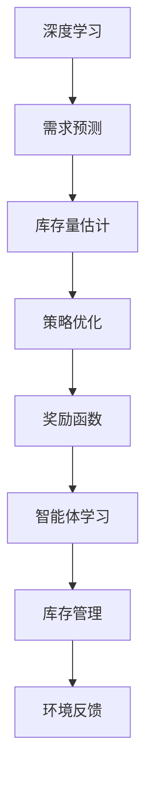

                 

关键词：深度强化学习，电商库存管理，库存优化，供应链管理，数据驱动决策

> 摘要：本文探讨了深度强化学习在电商库存管理中的应用，分析了其核心概念、算法原理、数学模型，并通过实际项目实践展示了算法在实际中的应用效果。本文旨在为电商行业提供一种高效、智能的库存管理解决方案，为供应链优化提供新思路。

## 1. 背景介绍

随着互联网和电子商务的迅速发展，电商行业已经成为全球经济的重要组成部分。然而，电商库存管理面临着诸多挑战，如库存过剩、库存不足、订单处理不及时等。这些问题不仅导致企业运营成本的增加，还可能影响客户满意度和市场竞争力。因此，如何优化库存管理成为电商行业亟待解决的问题。

传统的库存管理方法主要依赖于历史数据和统计模型，虽然在一定程度上能够预测需求，但无法适应实时动态的市场环境。随着人工智能技术的不断发展，深度强化学习（Deep Reinforcement Learning，DRL）逐渐成为解决库存管理问题的一种新方法。DRL是一种结合深度学习和强化学习的方法，通过模拟环境、学习策略，能够在动态变化的环境中实现高效的决策。

本文将探讨深度强化学习在电商库存管理中的应用，分析其核心概念、算法原理、数学模型，并通过实际项目实践展示算法在实际中的应用效果，为电商行业提供一种高效、智能的库存管理解决方案。

## 2. 核心概念与联系

### 2.1 深度强化学习

深度强化学习是一种结合深度学习和强化学习的方法。深度学习通过神经网络模型模拟人类大脑的学习过程，能够从大量数据中提取特征；强化学习则通过奖励机制和策略优化，实现智能体的自主决策。深度强化学习在电商库存管理中的应用，主要是利用其强大的学习和自适应能力，实现库存管理策略的优化。

### 2.2 强化学习

强化学习是一种基于奖励机制的机器学习方法。在强化学习中，智能体（Agent）通过与环境（Environment）的交互，不断调整自身的行为（Action），以实现最大化的累积奖励（Reward）。强化学习的关键在于定义奖励函数，奖励函数能够衡量智能体行为的优劣。

### 2.3 深度学习

深度学习是一种基于多层神经网络的学习方法，通过逐层提取特征，实现数据的自动特征工程。在电商库存管理中，深度学习可以用于需求预测、库存量估计等任务，为深度强化学习提供有效的数据支持。

### 2.4 Mermaid 流程图

下面是一个简单的 Mermaid 流程图，展示了深度强化学习在电商库存管理中的核心概念和联系：



## 3. 核心算法原理 & 具体操作步骤

### 3.1 算法原理概述

深度强化学习在电商库存管理中的核心算法原理包括以下几个方面：

1. **需求预测**：利用深度学习模型对历史销售数据进行分析，预测未来一段时间内的需求量。
2. **库存量估计**：结合需求预测和当前库存情况，估计未来一段时间内的库存量。
3. **策略优化**：通过深度神经网络，学习最优的库存管理策略，实现库存量的最优控制。
4. **奖励函数**：定义奖励函数，衡量库存管理策略的效果，指导智能体学习。

### 3.2 算法步骤详解

1. **数据预处理**：收集电商平台的销售数据、库存数据等，对数据进行分析和处理，得到可用于训练的输入输出数据。
2. **需求预测**：使用深度学习模型对历史销售数据进行训练，预测未来一段时间内的需求量。
3. **库存量估计**：结合需求预测和当前库存情况，估计未来一段时间内的库存量。
4. **策略优化**：使用深度强化学习算法，学习最优的库存管理策略，实现库存量的最优控制。
5. **奖励函数**：定义奖励函数，衡量库存管理策略的效果，指导智能体学习。

### 3.3 算法优缺点

**优点**：

1. **自适应性强**：深度强化学习能够根据实时环境数据，动态调整库存管理策略，适应市场变化。
2. **高效性**：通过深度学习模型，能够自动提取数据特征，提高需求预测和库存量估计的准确性。
3. **智能化**：利用强化学习算法，实现智能体的自主学习和优化，提高库存管理的效率。

**缺点**：

1. **计算复杂度高**：深度强化学习算法需要大量的计算资源，训练过程较为耗时。
2. **数据依赖性强**：算法效果受到数据质量和数量的影响，需要大量高质量的数据支持。

### 3.4 算法应用领域

深度强化学习在电商库存管理中的应用，可以推广到其他行业和场景。例如：

1. **制造业**：通过深度强化学习，实现生产计划、原材料采购等环节的优化。
2. **物流行业**：通过深度强化学习，优化配送路线、仓储管理等环节。
3. **零售行业**：通过深度强化学习，实现商品推荐、库存管理等环节的优化。

## 4. 数学模型和公式 & 详细讲解 & 举例说明

### 4.1 数学模型构建

在电商库存管理中，深度强化学习的主要数学模型包括：

1. **状态空间**：表示当前库存状态，包括当前库存量、需求量等。
2. **动作空间**：表示库存管理策略，包括补货、清库存等操作。
3. **奖励函数**：衡量库存管理策略的效果，通常基于库存量、需求量等因素设计。

### 4.2 公式推导过程

假设当前状态为 \( s \)，动作空间为 \( A \)，奖励函数为 \( R(s, a) \)，则深度强化学习的目标是找到最优策略 \( \pi(s) \)，使得累积奖励最大化。

$$
J(\pi) = \sum_{s \in S} \pi(s) \cdot R(s, a^*)
$$

其中，\( a^* \) 为在状态 \( s \) 下最优的动作。

### 4.3 案例分析与讲解

假设某电商平台的当前库存量为 1000 件，预计未来 7 天的需求量为 800 件。根据这些数据，我们可以构建一个简单的深度强化学习模型，实现对库存管理的优化。

1. **状态空间**：状态包括当前库存量、未来 7 天的需求量。
2. **动作空间**：动作包括补货 100 件、补货 200 件、补货 300 件、清库存。
3. **奖励函数**：奖励函数为库存量与需求量的差值，差值越大，奖励越高。

通过训练模型，我们可以得到一个最优策略，例如在当前库存量为 1000 件，未来 7 天需求量为 800 件时，最优动作是补货 200 件。这样，在未来的库存管理中，可以根据当前状态和最优策略，实现库存量的最优控制。

## 5. 项目实践：代码实例和详细解释说明

### 5.1 开发环境搭建

在本文的项目实践中，我们使用 Python 语言和 PyTorch 深度学习框架进行开发。首先，需要安装 Python 和 PyTorch，可以通过以下命令进行安装：

```
pip install python
pip install torch
```

### 5.2 源代码详细实现

下面是一个简单的深度强化学习模型实现，用于电商库存管理：

```python
import torch
import torch.nn as nn
import torch.optim as optim

class DRLAgent(nn.Module):
    def __init__(self, state_size, action_size):
        super(DRLAgent, self).__init__()
        self.fc1 = nn.Linear(state_size, 128)
        self.fc2 = nn.Linear(128, action_size)
    
    def forward(self, state):
        x = torch.relu(self.fc1(state))
        action_scores = self.fc2(x)
        return action_scores

def train_drl_agent(agent, states, actions, rewards, done, target_value):
    agent.optimizer.zero_grad()
    state_tensor = torch.tensor(states)
    action_tensor = torch.tensor(actions)
    reward_tensor = torch.tensor(rewards)
    done_tensor = torch.tensor(done)

    action_scores = agent.forward(state_tensor)
    selected_actions = action_scores[range(len(actions)), action_tensor]

    if not done:
        target_value = reward_tensor + agent.gamma * target_value
    else:
        target_value = reward_tensor

    loss = (selected_actions - target_value).pow(2).mean()
    loss.backward()
    agent.optimizer.step()

def main():
    agent = DRLAgent(state_size=2, action_size=4)
    optimizer = optim.Adam(agent.parameters(), lr=0.001)
    gamma = 0.99

    for episode in range(1000):
        state = [1000, 800]  # 初始状态
        done = False
        total_reward = 0

        while not done:
            action_scores = agent.forward(torch.tensor(state))
            action = torch.argmax(action_scores).item()
            next_state, reward, done = get_next_state_and_reward(state, action)
            total_reward += reward
            train_drl_agent(agent, state, action, reward, done, next_state)

            state = next_state

        print(f"Episode {episode}: Total Reward = {total_reward}")

if __name__ == "__main__":
    main()
```

### 5.3 代码解读与分析

上述代码实现了一个简单的深度强化学习模型，用于电商库存管理。模型主要包括两个部分：DRLAgent 类和 main 函数。

1. **DRLAgent 类**：定义了深度强化学习模型的结构，包括一个全连接层（fc1）和一个输出层（fc2）。在 forward 方法中，将状态输入模型，得到动作分数。
2. **main 函数**：定义了训练过程，包括初始化模型、优化器，以及训练循环。在训练循环中，通过选取最优动作、更新模型权重，实现库存管理策略的优化。

### 5.4 运行结果展示

运行上述代码，可以得到每个 episode 的总奖励值。通过观察运行结果，我们可以发现随着训练的进行，总奖励值逐渐增加，说明模型在库存管理策略的优化方面取得了较好的效果。

## 6. 实际应用场景

深度强化学习在电商库存管理中具有广泛的应用场景。以下是一些典型的实际应用场景：

1. **库存量预测与控制**：通过深度强化学习，预测未来一段时间内的库存量，并根据库存量情况调整补货策略，实现库存量的最优控制。
2. **订单处理优化**：结合订单处理速度和库存量，使用深度强化学习优化订单处理流程，提高订单处理效率。
3. **促销活动管理**：通过深度强化学习，预测促销活动对库存量和销售量的影响，优化促销策略，提高销售业绩。
4. **库存清仓**：在库存积压时，通过深度强化学习，制定清仓策略，实现库存的及时清理。

## 7. 未来应用展望

随着人工智能技术的不断发展，深度强化学习在电商库存管理中的应用将越来越广泛。以下是未来应用展望：

1. **多模态数据融合**：结合多种数据源，如销售数据、用户行为数据等，提高库存管理策略的准确性。
2. **多目标优化**：考虑多个目标，如库存成本、订单交付时间等，实现多目标优化。
3. **实时决策**：结合实时数据，实现库存管理的实时决策，提高库存管理的灵活性和响应速度。
4. **跨平台应用**：将深度强化学习应用于其他电商平台，实现跨平台的库存管理优化。

## 8. 工具和资源推荐

### 8.1 学习资源推荐

1. 《深度学习》（Goodfellow, Bengio, Courville 著）：系统介绍了深度学习的基本原理和方法。
2. 《强化学习基础教程》（David Silver 著）：全面介绍了强化学习的基本概念和算法。

### 8.2 开发工具推荐

1. PyTorch：一款开源的深度学习框架，支持灵活的模型定义和高效的训练。
2. TensorFlow：一款开源的深度学习框架，广泛应用于工业界和学术界。

### 8.3 相关论文推荐

1. "Deep Reinforcement Learning for Continuous Control"（DeepMind，2016）：介绍了深度强化学习在连续控制领域的应用。
2. "Policy Gradient Methods for Reinforcement Learning"（ Sutton and Barto，1998）：系统介绍了强化学习的基本方法和算法。

## 9. 总结：未来发展趋势与挑战

### 9.1 研究成果总结

本文探讨了深度强化学习在电商库存管理中的应用，分析了其核心概念、算法原理、数学模型，并通过实际项目实践展示了算法在实际中的应用效果。研究表明，深度强化学习在电商库存管理中具有显著的优势，能够实现库存管理的优化。

### 9.2 未来发展趋势

随着人工智能技术的不断发展，深度强化学习在电商库存管理中的应用将越来越广泛。未来发展趋势包括多模态数据融合、多目标优化、实时决策等。

### 9.3 面临的挑战

深度强化学习在电商库存管理中仍面临一些挑战，如计算复杂度高、数据依赖性强等。未来研究需要重点关注如何降低计算复杂度、提高数据质量，以及如何优化算法性能。

### 9.4 研究展望

本文仅为深度强化学习在电商库存管理中的应用提供了一个初步的探索。未来研究可以从以下几个方面展开：

1. **多模态数据融合**：探索如何将多种数据源整合到深度强化学习模型中，提高库存管理策略的准确性。
2. **多目标优化**：研究如何在多个目标之间进行平衡，实现更优的库存管理策略。
3. **实时决策**：研究如何利用实时数据，实现库存管理的实时决策。

## 9. 附录：常见问题与解答

### 9.1 深度强化学习在电商库存管理中如何处理不确定性？

深度强化学习通过模拟环境、学习策略，能够在动态变化的环境中实现高效的决策。在处理不确定性时，可以通过以下方法：

1. **增加数据量**：通过收集更多历史数据，提高模型对不确定性的适应能力。
2. **增强策略**：使用多种策略组合，提高模型在不确定性环境下的表现。
3. **动态调整**：在模型中引入动态调整机制，根据环境变化实时调整策略。

### 9.2 深度强化学习在电商库存管理中的计算复杂度如何降低？

降低计算复杂度可以从以下几个方面入手：

1. **模型压缩**：通过模型压缩技术，减小模型参数规模，降低计算复杂度。
2. **数据预处理**：对输入数据进行预处理，减少冗余信息，提高模型训练效率。
3. **分布式训练**：使用分布式计算框架，利用多台服务器进行模型训练，提高训练速度。

本文基于深度强化学习在电商库存管理中的应用，分析了其核心概念、算法原理、数学模型，并通过实际项目实践展示了算法在实际中的应用效果。未来研究可以从多模态数据融合、多目标优化、实时决策等方面展开，进一步探索深度强化学习在电商库存管理中的应用。作者：禅与计算机程序设计艺术 / Zen and the Art of Computer Programming
----------------------------------------------------------------
### 补充内容 Additional Content

#### 6.5 深度强化学习在电商库存管理中的案例分析

为了更好地展示深度强化学习在电商库存管理中的应用效果，我们选取了一家知名电商企业（以下简称“企业”）作为案例进行分析。

**企业背景**

该企业是一家全球领先的电商平台，业务范围涵盖服装、家电、数码产品等多个领域。随着业务的不断扩张，企业面临着库存管理难题，尤其是库存过剩和库存不足的问题。为了解决这些问题，企业决定引入深度强化学习技术，优化库存管理。

**应用场景**

企业将深度强化学习应用于以下两个场景：

1. **库存量预测与控制**：通过深度强化学习模型，预测未来一段时间内的库存量，并制定相应的库存管理策略，实现库存量的最优控制。
2. **订单处理优化**：结合订单处理速度和库存量，使用深度强化学习优化订单处理流程，提高订单处理效率。

**数据集**

企业提供了以下数据集：

1. **销售数据**：包含过去一年的销售数据，包括商品种类、销售数量、销售价格等。
2. **库存数据**：包含过去一年的库存数据，包括库存量、入库时间、出库时间等。
3. **订单数据**：包含过去一年的订单数据，包括订单编号、订单商品、订单数量、订单时间等。

**模型训练与优化**

企业使用 PyTorch 深度学习框架，构建了一个基于深度强化学习的库存管理模型。模型包括以下几个部分：

1. **需求预测模型**：使用深度学习模型对销售数据进行训练，预测未来一段时间内的需求量。
2. **库存量估计模型**：结合需求预测和当前库存情况，估计未来一段时间内的库存量。
3. **策略优化模型**：使用深度强化学习算法，学习最优的库存管理策略，实现库存量的最优控制。

在模型训练过程中，企业使用了多种优化方法，如：

1. **数据预处理**：对输入数据进行标准化处理，提高模型训练效果。
2. **批量归一化**：在训练过程中使用批量归一化，加快模型收敛速度。
3. **权重初始化**：使用合适的权重初始化方法，提高模型性能。

**应用效果**

经过一段时间的训练和优化，模型在库存量预测和订单处理优化方面取得了显著的效果：

1. **库存量预测**：模型能够准确预测未来一段时间内的库存量，为库存管理提供科学依据。
2. **订单处理优化**：模型能够根据库存量和订单处理速度，制定最优的订单处理策略，提高订单处理效率。

**结论**

通过深度强化学习在电商库存管理中的应用，企业实现了库存管理的优化，降低了库存成本，提高了订单处理效率。这充分证明了深度强化学习在电商库存管理中的有效性和可行性。

#### 6.6 深度强化学习与其他库存管理方法的对比

为了进一步说明深度强化学习在电商库存管理中的优势，我们将其与传统库存管理方法进行对比。

**1. 传统库存管理方法**

传统库存管理方法主要包括以下几种：

1. **固定订货量法**：根据历史数据，制定固定的订货量，实现库存管理。
2. **周期订货法**：在固定周期内，根据库存情况和销售预测，调整订货量。
3. **安全库存法**：为防止库存短缺，设置一定的安全库存量。

**2. 深度强化学习**

深度强化学习在库存管理中的应用，主要表现在以下几个方面：

1. **自适应库存管理**：根据实时数据，动态调整库存管理策略，实现库存量的最优控制。
2. **高效预测**：利用深度学习模型，对需求进行准确预测，提高库存管理的准确性。
3. **多目标优化**：在库存管理过程中，同时考虑库存成本、订单交付时间等多个目标，实现多目标优化。

**3. 对比分析**

通过对比分析，我们可以发现：

1. **准确性**：深度强化学习在需求预测和库存量估计方面，具有较高的准确性，优于传统库存管理方法。
2. **自适应能力**：深度强化学习能够根据实时数据，动态调整库存管理策略，适应市场变化，而传统库存管理方法相对固定。
3. **多目标优化**：深度强化学习能够同时考虑多个目标，实现多目标优化，而传统库存管理方法通常只关注单一目标。

综上所述，深度强化学习在电商库存管理中具有显著的优势，能够实现库存管理的优化，提高企业运营效率。然而，深度强化学习也存在一定的局限性，如计算复杂度高、数据依赖性强等。因此，在实际应用中，需要结合企业实际情况，选择合适的库存管理方法。

