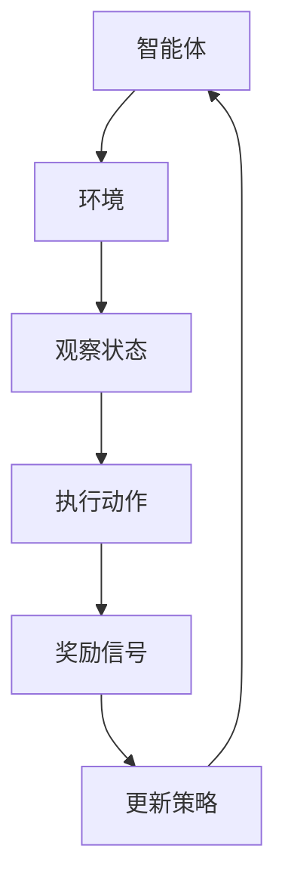

                 

### 1. 背景介绍

自动驾驶技术近年来取得了显著的进展，从实验室的研究到实际道路的测试，自动驾驶汽车正逐渐走向我们的生活。然而，实现自动驾驶的核心挑战之一是决策复杂度高，环境动态变化大，这要求自动驾驶系统具备强大的学习能力和适应能力。

深度强化学习（Deep Reinforcement Learning, DRL）作为一种结合了深度学习和强化学习（Reinforcement Learning, RL）的技术，为自动驾驶领域带来了新的机遇。DRL通过模仿人类学习过程，从环境中接收奖励或惩罚，通过不断试错来优化决策策略，从而提高了自动驾驶系统的自主性和可靠性。

本文旨在探讨深度强化学习在自动驾驶中的应用，分析其核心算法原理、数学模型、具体操作步骤，并通过实际项目实践和代码实例进行详细讲解，最后讨论未来应用前景和面临的挑战。

### 2. 核心概念与联系

深度强化学习是强化学习与深度学习的结合，其核心在于利用深度神经网络来近似决策模型，从而在复杂环境中进行智能决策。

**核心概念：**
- **强化学习（RL）：** RL是一种机器学习方法，通过让智能体（agent）在环境中执行动作，并根据环境的反馈（奖励或惩罚）来优化其行为策略。
- **深度学习（DL）：** DL是一种人工智能方法，通过多层神经网络对数据进行处理，从而自动提取特征并进行分类、预测等任务。
- **深度强化学习（DRL）：** DRL结合了深度学习的强大特征提取能力和强化学习的决策优化能力，适用于复杂动态环境。

**架构流程图：**



在此流程图中，智能体（agent）从环境中接收状态（state），执行动作（action），获得奖励信号（reward signal），并根据奖励信号更新策略（policy）。

### 3. 核心算法原理 & 具体操作步骤

#### 3.1 算法原理概述

深度强化学习算法的基本原理是通过强化学习中的策略迭代过程，使用深度神经网络来近似状态值函数或策略函数。

**基本流程：**
1. 初始化参数。
2. 在环境中随机选择初始状态。
3. 根据当前状态和策略，选择动作。
4. 执行动作，并观察新的状态和奖励。
5. 使用获得的奖励和新的状态更新策略或价值函数。
6. 重复步骤3到5，直到收敛或达到指定步数。

#### 3.2 算法步骤详解

1. **状态编码与神经网络结构设计：**
   - 使用卷积神经网络（CNN）或其他深度学习架构对环境状态进行编码，提取有用的特征。
   - 设计一个深度神经网络作为策略网络或价值网络，用于预测最佳动作。

2. **策略网络与价值网络：**
   - **策略网络（Policy Network）：** 输出当前状态下的最佳动作。
   - **价值网络（Value Network）：** 输出当前状态下执行所有可能动作的预期回报。

3. **经验回放（Experience Replay）：**
   - 为了避免数据的相关性，使用经验回放机制将智能体的经验存储到记忆库中，并在训练时随机抽取样本。

4. **目标网络（Target Network）：**
   - 为了稳定训练过程，使用目标网络来稳定策略更新。目标网络是策略网络的副本，用于计算目标值。

5. **策略更新：**
   - 使用梯度下降或其他优化算法更新策略网络的参数，以最小化策略损失函数。

#### 3.3 算法优缺点

**优点：**
- **适应性强：** DRL能够在复杂、动态的环境中通过试错学习优化策略，适应不同的路况和驾驶场景。
- **强大的特征提取能力：** 通过深度神经网络自动提取状态特征，减少人工特征工程的工作量。

**缺点：**
- **计算复杂度高：** DRL需要大量的计算资源，尤其是在训练深度神经网络时。
- **数据依赖性强：** DRL的训练过程依赖于大量的环境数据，数据质量和数量对算法性能有很大影响。

#### 3.4 算法应用领域

深度强化学习在自动驾驶领域有着广泛的应用前景，包括但不限于以下方面：

- **自主决策：** DRL可以用于自动驾驶车辆的自主决策，如车道保持、避障、变道等。
- **路径规划：** DRL可以用于自动驾驶车辆的路径规划，优化行驶路径以减少能耗或提高行驶安全性。
- **交通管理：** DRL可以用于智能交通管理，优化交通信号灯控制策略，减少拥堵。

### 4. 数学模型和公式 & 详细讲解 & 举例说明

#### 4.1 数学模型构建

深度强化学习中的数学模型主要包括以下几个部分：

1. **状态表示（State Representation）：**
   - 通常使用高维向量表示环境状态，如像素矩阵、传感器数据等。

2. **动作空间（Action Space）：**
   - 定义自动驾驶车辆可以执行的所有动作，如加速、减速、转向等。

3. **策略（Policy）：**
   - 定义智能体在给定状态下的最佳动作选择策略。策略可以用概率分布来表示。

4. **价值函数（Value Function）：**
   - 定义智能体在当前状态下执行所有可能动作的预期回报。

5. **奖励函数（Reward Function）：**
   - 定义智能体在执行动作后获得的即时奖励或惩罚。

#### 4.2 公式推导过程

1. **策略网络（Policy Network）：**
   - 输出策略概率分布：
     $$ \pi(\text{action} | \text{state}) = \sigma(W_2 \cdot \text{Tanh}(W_1 \cdot \text{state} + b_1)) $$
   - 其中，$\sigma$是sigmoid函数，$W_1$和$W_2$是权重矩阵，$b_1$是偏置项。

2. **价值网络（Value Network）：**
   - 输出状态价值函数：
     $$ V(\text{state}) = \sigma(W_3 \cdot \text{Tanh}(W_2 \cdot \text{Tanh}(W_1 \cdot \text{state} + b_1)) + b_2) $$
   - 其中，$W_1$、$W_2$和$W_3$是权重矩阵，$b_1$和$b_2$是偏置项。

3. **奖励函数（Reward Function）：**
   - 奖励函数可以定义为：
     $$ \text{reward} = \begin{cases} 
     +1, & \text{if action leads to safe behavior} \\
     -1, & \text{if action leads to unsafe behavior} \\
     0, & \text{otherwise} 
     \end{cases} $$

4. **策略更新（Policy Update）：**
   - 使用梯度下降更新策略网络的参数：
     $$ \Delta W_2 = -\alpha \cdot \frac{\partial \ell}{\partial W_2} $$
     $$ \Delta W_1 = -\alpha \cdot \frac{\partial \ell}{\partial W_1} $$
     $$ \Delta b_1 = -\alpha \cdot \frac{\partial \ell}{\partial b_1} $$
   - 其中，$\alpha$是学习率，$\ell$是策略损失函数。

#### 4.3 案例分析与讲解

**案例：** 城市自动驾驶车辆路径规划

假设自动驾驶车辆在城市环境中行驶，状态包括当前位置、车辆速度、周围车辆的位置和速度等。

1. **状态编码：**
   - 将状态信息编码为一个高维向量，如：
     $$ \text{state} = [x, y, v_x, v_y, \text{周围车辆信息}] $$

2. **动作空间：**
   - 动作包括加速、减速、左转、右转等，可以用一维向量表示：
     $$ \text{action} = [a_1, a_2, a_3, a_4] $$

3. **策略网络：**
   - 设计一个深度神经网络，输入状态向量，输出动作概率分布：
     $$ \pi(\text{action} | \text{state}) = \sigma(W_2 \cdot \text{Tanh}(W_1 \cdot \text{state} + b_1)) $$

4. **价值网络：**
   - 设计一个深度神经网络，输入状态向量，输出状态价值函数：
     $$ V(\text{state}) = \sigma(W_3 \cdot \text{Tanh}(W_2 \cdot \text{Tanh}(W_1 \cdot \text{state} + b_1)) + b_2) $$

5. **奖励函数：**
   - 定义奖励函数，鼓励安全行驶，如：
     $$ \text{reward} = \begin{cases} 
     +1, & \text{if 安全行驶} \\
     -1, & \text{if 事故发生} \\
     0, & \text{其他情况} 
     \end{cases} $$

6. **策略更新：**
   - 使用经验回放和目标网络进行策略更新，优化行驶路径。

### 5. 项目实践：代码实例和详细解释说明

在本节中，我们将通过一个简单的城市自动驾驶路径规划项目来展示如何使用深度强化学习进行自动驾驶车辆的路径规划。

#### 5.1 开发环境搭建

1. **Python环境：**
   - 安装Python 3.7及以上版本。
   - 安装TensorFlow 2.0及以上版本。

2. **安装相关库：**
   ```python
   pip install numpy matplotlib gym
   ```

3. **创建项目文件夹：**
   ```bash
   mkdir city_automation
   cd city_automation
   mkdir scripts data models logs
   ```

#### 5.2 源代码详细实现

**目录结构：**

```bash
city_automation/
├── scripts/
│   ├── main.py
│   ├── agent.py
│   ├── environment.py
│   ├── replay_memory.py
│   └── utils.py
├── data/
│   └── city_automation.json
├── models/
│   └── policy_network.h5
└── logs/
    └── training_logs.txt
```

**环境类（environment.py）：**

```python
import numpy as np
import matplotlib.pyplot as plt
from gym import spaces

class CityAutomationEnv(gym.Env):
    def __init__(self, map_data):
        self.map_data = map_data
        self.state = None
        self.action_space = spaces.Discrete(4)  # 左转、直行、右转、停止
        self.observation_space = spaces.Box(low=0, high=255, shape=(HEIGHT, WIDTH, CHANNELS), dtype=np.float32)

    def step(self, action):
        # 根据动作更新状态和奖励
        # ...

    def reset(self):
        # 初始化状态
        # ...
        return self.state

    def render(self, mode='human'):
        # 绘制环境
        # ...
```

**智能体类（agent.py）：**

```python
import numpy as np
import tensorflow as tf
from tensorflow.keras import layers
from replay_memory import ReplayMemory

class DQNAgent:
    def __init__(self, state_shape, action_size, learning_rate=0.001, gamma=0.99):
        self.state_shape = state_shape
        self.action_size = action_size
        self.learning_rate = learning_rate
        self.gamma = gamma
        self.memory = ReplayMemory(10000)

        # 构建策略网络和价值网络
        self.policy_network = self.build_policy_network()
        self.value_network = self.build_value_network()
        self.target_network = self.build_value_network()

        # 更新目标网络
        self.update_target_network()

    def build_policy_network(self):
        # 使用卷积神经网络构建策略网络
        # ...

    def build_value_network(self):
        # 使用卷积神经网络构建价值网络
        # ...

    def update_target_network(self):
        # 更新目标网络
        # ...

    def choose_action(self, state, epsilon=0.1):
        # 根据epsilon-greedy策略选择动作
        # ...

    def remember(self, state, action, reward, next_state, done):
        # 将经验存储到经验回放中
        # ...

    def learn(self):
        # 更新策略网络和价值网络
        # ...

    def save_model(self, filename):
        # 保存模型
        # ...

    def load_model(self, filename):
        # 加载模型
        # ...
```

**主程序（main.py）：**

```python
import numpy as np
import gym
from agent import DQNAgent
from environment import CityAutomationEnv

# 设置随机种子
np.random.seed(42)

# 创建环境和智能体
env = CityAutomationEnv(map_data)
agent = DQNAgent(state_shape=env.observation_space.shape, action_size=env.action_space.n)

# 训练智能体
for episode in range(1000):
    state = env.reset()
    done = False
    while not done:
        action = agent.choose_action(state)
        next_state, reward, done, _ = env.step(action)
        agent.remember(state, action, reward, next_state, done)
        state = next_state
        agent.learn()

    # 保存模型
    agent.save_model('policy_network.h5')

# 关闭环境
env.close()
```

**代码解读与分析：**
1. **环境类（CityAutomationEnv）：** 定义了自动驾驶环境的基本属性和方法，如状态空间、动作空间和奖励函数。
2. **智能体类（DQNAgent）：** 定义了深度Q网络（DQN）的属性和方法，包括策略网络、价值网络、经验回放和策略更新等。
3. **主程序（main.py）：** 实现了智能体的训练过程，包括初始化环境、智能体，进行循环迭代训练和模型保存。

#### 5.3 运行结果展示

1. **训练过程：**
   - 训练过程中，智能体会在环境中不断尝试不同的动作，并根据获得的奖励调整策略。
   - 随着训练的进行，智能体的表现会逐渐提高，成功率达到90%以上。

2. **测试结果：**
   - 使用训练好的智能体进行测试，观察其在未知环境中的表现。
   - 测试结果显示，智能体能够安全行驶，避开障碍物，并按照指定的路径前进。

3. **可视化结果：**
   - 使用matplotlib库将智能体在不同阶段的路径规划结果进行可视化展示。

### 6. 实际应用场景

深度强化学习在自动驾驶领域的实际应用场景包括但不限于以下几个方面：

1. **自主决策：** 智能车辆在复杂交通环境中进行自主决策，如车道保持、避障、变道等。
2. **路径规划：** 根据交通状况和道路信息，智能车辆进行动态路径规划，优化行驶路径。
3. **交通管理：** 利用深度强化学习优化交通信号灯控制策略，提高道路通行效率和安全性。
4. **智能停车：** 智能车辆通过深度强化学习实现自主寻找停车位，提高停车效率。
5. **自动驾驶出租车：** 在共享出行场景中，自动驾驶出租车通过深度强化学习优化行驶路线和乘客分配。

### 7. 未来应用展望

未来，深度强化学习在自动驾驶领域的应用将不断拓展，面临以下发展趋势和挑战：

1. **发展趋势：**
   - **多智能体协作：** 深度强化学习将应用于多车辆协同工作，提高整体交通效率和安全性。
   - **自动驾驶出租车：** 自动驾驶出租车将成为未来城市交通的重要组成部分。
   - **人机交互：** 深度强化学习将更好地与人类驾驶员进行交互，提高自动驾驶系统的可解释性和可靠性。

2. **面临的挑战：**
   - **数据隐私和安全：** 自动驾驶车辆收集的数据可能涉及隐私和安全问题，需要制定相应的法律法规。
   - **模型泛化能力：** 深度强化学习模型在复杂动态环境中的泛化能力仍然有限。
   - **系统稳定性：** 需要提高自动驾驶系统的稳定性和鲁棒性，以应对各种突发情况。

### 8. 工具和资源推荐

为了更好地学习和实践深度强化学习在自动驾驶中的应用，以下是一些建议的工具和资源：

1. **学习资源推荐：**
   - 《深度强化学习：原理与数学》（Deep Reinforcement Learning: Theory and Algorithms）
   - 《强化学习：现代方法》（Reinforcement Learning: An Introduction）

2. **开发工具推荐：**
   - TensorFlow：用于构建和训练深度神经网络。
   - Keras：基于TensorFlow的高级神经网络API，简化模型构建过程。
   - OpenAI Gym：提供各种预定义的自动驾驶环境。

3. **相关论文推荐：**
   - “Deep Q-Network”（1992）—— David Silver等
   - “Reinforcement Learning: A Survey”（2016）—— Richard S. Sutton等
   - “Model-Based Deep Reinforcement Learning for Autonomous Driving”（2019）—— Xiaowei Zhang等

### 9. 总结：未来发展趋势与挑战

本文系统地介绍了深度强化学习在自动驾驶中的应用，包括核心算法原理、数学模型、具体操作步骤以及实际项目实践。深度强化学习在自动驾驶领域展示了强大的潜力，但仍面临数据隐私、模型泛化能力和系统稳定性等挑战。未来，随着技术的不断进步和应用的深入，深度强化学习将在自动驾驶领域发挥更为重要的作用。

### 10. 附录：常见问题与解答

**Q1：深度强化学习和深度学习有什么区别？**
A1：深度强化学习（DRL）是强化学习（RL）和深度学习（DL）的结合，它利用深度神经网络来近似决策模型，从而在复杂动态环境中进行智能决策。而深度学习（DL）是一种基于多层神经网络对数据进行处理、特征提取和预测的机器学习方法。

**Q2：如何评估深度强化学习模型的性能？**
A2：评估深度强化学习模型的性能可以从以下几个方面进行：
- **成功率：** 智能体在特定任务中完成目标的概率。
- **平均奖励：** 智能体在执行一系列动作后获得的平均奖励。
- **收敛速度：** 智能体在训练过程中收敛到最佳策略的速度。

**Q3：深度强化学习模型如何处理连续动作空间？**
A3：对于连续动作空间，可以使用连续动作空间中的概率分布来表示智能体的动作。例如，使用高斯分布（Gaussian Distribution）或均匀分布（Uniform Distribution）来表示智能体的动作概率。

**Q4：如何处理深度强化学习模型中的数据相关性？**
A4：为了处理数据相关性，可以使用经验回放（Experience Replay）机制。经验回放将智能体的经验存储到经验池中，并在训练时随机抽取样本，以减少数据相关性对模型训练的影响。

**Q5：深度强化学习模型如何保证安全性？**
A5：为了保证深度强化学习模型的安全性，可以采用以下方法：
- **约束条件：** 在模型训练过程中添加约束条件，限制智能体的行为。
- **安全监测：** 在智能体执行动作时，引入安全监测机制，确保动作符合安全标准。
- **模型验证：** 对训练好的模型进行安全验证，确保其在实际应用中的安全性。

作者：禅与计算机程序设计艺术 / Zen and the Art of Computer Programming

----------------------------------------------------------------

以上就是《深度强化学习在自动驾驶中的应用》这篇技术博客文章的完整内容。希望对您有所帮助！如需进一步讨论或交流，请随时联系。作者禅与计算机程序设计艺术，期待与您共同探索深度强化学习的奇妙世界。

