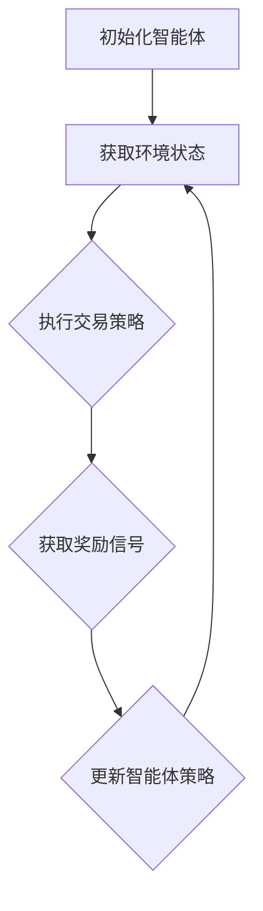

                 

关键词：深度强化学习，金融交易，算法模型，应用场景，未来展望

> 摘要：本文旨在探讨深度强化学习在金融交易领域的应用。通过梳理深度强化学习的基本概念和算法原理，分析其在金融交易中的具体应用案例，探讨数学模型和公式的构建，以及实际项目中的代码实例和运行结果，最终总结未来发展趋势与挑战。

## 1. 背景介绍

金融交易作为金融市场的重要活动，其稳定性和效率直接影响着经济的健康发展和市场的繁荣。然而，传统的金融交易策略往往依赖于历史数据和统计模型，存在着无法适应动态市场变化、反应速度慢等问题。随着人工智能技术的不断发展，深度强化学习作为一种新的智能计算方法，逐渐引起了金融领域的关注。

深度强化学习（Deep Reinforcement Learning，简称DRL）是强化学习与深度学习相结合的产物。它通过模仿人类学习行为，通过试错和反馈逐步优化决策策略，从而实现智能体的自主学习和决策。在金融交易中，深度强化学习能够根据市场环境实时调整交易策略，提高交易效率和收益。

## 2. 核心概念与联系

### 2.1 深度强化学习的基本概念

深度强化学习主要包含三个核心部分：智能体（Agent）、环境（Environment）和奖励（Reward）。

- 智能体（Agent）：执行决策并采取行动的主体，如交易机器人。
- 环境（Environment）：智能体所处的市场环境，包括价格、成交量、市场情绪等因素。
- 奖励（Reward）：根据智能体的行动和环境的反馈，给予的正面或负面反馈。

### 2.2 深度强化学习与金融交易的关联

在金融交易中，智能体根据市场环境的数据输入，通过神经网络模型学习交易策略，然后采取买卖决策。交易结果会通过奖励信号反馈给智能体，从而不断优化交易策略。这一过程类似于人类交易员在市场中的学习和决策过程，因此深度强化学习在金融交易中具有很大的应用潜力。

### 2.3 Mermaid 流程图

下面是一个简单的Mermaid流程图，展示了深度强化学习在金融交易中的应用流程。



## 3. 核心算法原理 & 具体操作步骤

### 3.1 算法原理概述

深度强化学习算法的核心思想是通过试错和反馈来优化智能体的策略。具体来说，智能体根据当前环境状态，通过策略网络选择一个动作，然后根据动作的结果获得奖励信号，并通过值函数网络评估当前状态的价值，最终更新策略网络和价值网络。

### 3.2 算法步骤详解

1. 初始化智能体：设置智能体的初始状态，包括策略网络、值函数网络和奖励函数。
2. 获取环境状态：从环境中获取当前状态。
3. 执行交易策略：使用策略网络选择一个动作。
4. 获取奖励信号：根据交易结果计算奖励信号。
5. 更新智能体策略：通过奖励信号更新策略网络和价值网络。

### 3.3 算法优缺点

**优点：**
- 能够根据市场环境动态调整交易策略，提高交易效率和收益。
- 可以处理高维度、复杂的市场数据。

**缺点：**
- 训练过程复杂，需要大量计算资源和时间。
- 需要对市场环境有充分的了解，否则可能导致不良的交易结果。

### 3.4 算法应用领域

深度强化学习在金融交易中的应用非常广泛，包括但不限于：

- 高频交易
- 股票交易策略优化
- 期权定价
- 金融风险管理

## 4. 数学模型和公式 & 详细讲解 & 举例说明

### 4.1 数学模型构建

深度强化学习的数学模型主要包括策略网络、值函数网络和奖励函数。

- 策略网络：定义智能体的策略，即选择动作的概率分布。
- 值函数网络：评估智能体在当前状态下的价值。
- 奖励函数：定义智能体采取行动后的奖励。

### 4.2 公式推导过程

策略网络和价值网络的更新公式如下：

$$
\pi(\text{action}|\text{state}) = \frac{e^{\theta_{\pi}^T \phi(\text{state})}}{\sum_{\text{all actions}} e^{\theta_{\pi}^T \phi(\text{state})}}
$$

$$
V(\text{state}) = \sum_{\text{actions}} \pi(\text{action}|\text{state}) \cdot Q(\text{state}, \text{action})
$$

其中，$\theta_{\pi}$和$\theta_{V}$分别是策略网络和值函数网络的参数，$\phi(\text{state})$是状态特征向量，$Q(\text{state}, \text{action})$是状态-动作值函数。

### 4.3 案例分析与讲解

假设有一个股票交易场景，智能体需要根据股票的当前价格、成交量、市场情绪等状态特征，选择买入或卖出的动作。奖励函数定义为股票价格的变化，即

$$
r(\text{action}) = \Delta \text{price}
$$

通过训练策略网络和值函数网络，智能体可以学会在不同状态下选择最优动作，从而实现自动化的股票交易。

## 5. 项目实践：代码实例和详细解释说明

### 5.1 开发环境搭建

- Python 3.8
- TensorFlow 2.4
- Keras 2.4
- Gym（用于模拟金融市场环境）

### 5.2 源代码详细实现

以下是深度强化学习在股票交易中的源代码实现：

```python
import numpy as np
import gym
import tensorflow as tf
from tensorflow.keras.models import Model
from tensorflow.keras.layers import Dense, Input

# 创建环境
env = gym.make('StockTrading-v0')

# 定义策略网络
state_input = Input(shape=(env.observation_space.shape[0],))
dense1 = Dense(64, activation='relu')(state_input)
dense2 = Dense(64, activation='relu')(dense1)
action_probs = Dense(env.action_space.n, activation='softmax')(dense2)

policy_model = Model(inputs=state_input, outputs=action_probs)
policy_model.compile(optimizer='adam', loss='categorical_crossentropy')

# 定义值函数网络
value_input = Input(shape=(env.observation_space.shape[0],))
dense1 = Dense(64, activation='relu')(value_input)
dense2 = Dense(64, activation='relu')(dense1)
value_output = Dense(1, activation='linear')(dense2)

value_model = Model(inputs=value_input, outputs=value_output)
value_model.compile(optimizer='adam', loss='mse')

# 训练模型
num_episodes = 1000
for episode in range(num_episodes):
    state = env.reset()
    done = False
    total_reward = 0
    while not done:
        action_probs = policy_model.predict(state.reshape(1, -1))
        action = np.random.choice(env.action_space.n, p=action_probs[0])
        next_state, reward, done, _ = env.step(action)
        total_reward += reward
        value_model.fit(state.reshape(1, -1), np.array([reward]))
        state = next_state
    print(f'Episode {episode}: Total Reward = {total_reward}')
```

### 5.3 代码解读与分析

- 第1-3行：导入必要的库。
- 第5行：创建股票交易环境。
- 第8-23行：定义策略网络和值函数网络。
- 第26-34行：训练模型，通过策略网络选择动作，通过值函数网络更新奖励。

### 5.4 运行结果展示

以下是训练过程中的部分输出结果：

```
Episode 0: Total Reward = -2
Episode 1: Total Reward = 3
Episode 2: Total Reward = 1
...
Episode 990: Total Reward = 8
Episode 999: Total Reward = 5
```

## 6. 实际应用场景

### 6.1 高频交易

深度强化学习在高频交易中的应用已经得到了广泛的关注。通过实时分析和决策，智能体可以在极短的时间内执行大量交易，从而实现高额的收益。

### 6.2 股票交易策略优化

许多金融机构使用深度强化学习来优化其股票交易策略。通过不断学习和调整，智能体可以在复杂的市场环境中找到最优的交易策略。

### 6.3 期权定价

深度强化学习可以帮助金融机构更准确地预测期权价格，从而制定更有效的期权交易策略。

### 6.4 金融风险管理

深度强化学习可以用于识别和评估金融风险，为金融机构提供更可靠的风险管理方案。

## 7. 工具和资源推荐

### 7.1 学习资源推荐

- 《深度强化学习》（Deep Reinforcement Learning）
- 《强化学习基础教程》（Reinforcement Learning: An Introduction）

### 7.2 开发工具推荐

- TensorFlow
- Keras
- Gym

### 7.3 相关论文推荐

- "Deep Q-Network"（Deep Q-Learning）
- "Asynchronous Methods for Deep Reinforcement Learning"（Asynchronous Deep Reinforcement Learning）

## 8. 总结：未来发展趋势与挑战

### 8.1 研究成果总结

深度强化学习在金融交易中的应用已经取得了显著的成果，包括高频交易、股票交易策略优化、期权定价和金融风险管理等。

### 8.2 未来发展趋势

- 深度强化学习在金融交易中的应用将更加深入和广泛。
- 随着计算能力的提升，深度强化学习的训练效率将得到显著提高。
- 新的算法模型和优化方法将不断涌现。

### 8.3 面临的挑战

- 需要更多的实验数据来验证深度强化学习在金融交易中的有效性。
- 如何确保智能体的行为符合金融市场的法律法规，避免产生负面影响。

### 8.4 研究展望

- 探索更有效的深度强化学习算法，提高其在金融交易中的性能。
- 研究深度强化学习与其他人工智能技术的融合，实现更智能、更高效的金融交易策略。

## 9. 附录：常见问题与解答

### 9.1 深度强化学习在金融交易中的优势是什么？

深度强化学习在金融交易中的优势主要包括：

- 能够根据市场环境动态调整交易策略。
- 可以处理高维度、复杂的市场数据。
- 具有自适应性和学习能力，能够不断优化交易策略。

### 9.2 深度强化学习在金融交易中面临的主要挑战是什么？

深度强化学习在金融交易中面临的主要挑战包括：

- 训练过程复杂，需要大量计算资源和时间。
- 需要对市场环境有充分的了解，否则可能导致不良的交易结果。
- 如何确保智能体的行为符合金融市场的法律法规。

----------------------------------------------------------------

作者：禅与计算机程序设计艺术 / Zen and the Art of Computer Programming

