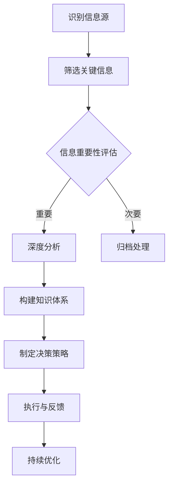

                 

关键词：深度思考、管理者、信息洞察、决策分析、技术架构、系统优化

> 摘要：本文将探讨深度思考在管理者洞悉关键信息中的重要性，分析如何通过逻辑清晰、结构紧凑的方法提升信息处理能力，并结合实际案例，阐述深度思考在技术决策和系统优化中的应用。本文旨在为管理者提供一套系统化的思路和方法，以应对复杂的技术挑战和快速变化的市场环境。

## 1. 背景介绍

在现代企业环境中，管理者不仅需要具备良好的领导力和战略眼光，还需要具备强大的信息处理能力。随着信息技术的飞速发展，数据洪流如同滚滚浪潮般涌向企业管理者。如何在这片信息海洋中提炼出有价值的信息，从而做出明智的决策，成为每位管理者都必须面对的挑战。

深度思考，作为一种高级认知活动，是管理者提升信息洞察力和决策质量的关键。深度思考不仅要求管理者对信息进行深入的剖析和理解，还要求他们能够从纷繁复杂的信息中提取核心价值，构建起完整的知识体系，从而更好地应对各种复杂情境。

本文将围绕深度思考在管理者信息处理中的应用，探讨核心概念、算法原理、数学模型、项目实践以及实际应用场景。通过系统的分析和阐述，旨在为管理者提供一套行之有效的方法论，帮助他们更好地把握信息的关键点，提升管理效率和决策质量。

## 2. 核心概念与联系

### 2.1 深度思考的定义

深度思考（Deep Thinking）是指个体在处理复杂问题时，通过长时间的专注、深入的推理和分析，以达到对问题本质的理解和解决的过程。它与浅层思考（Surface Thinking）相对，后者通常是一种快速、自动化的信息处理方式，缺乏深度和系统性。

### 2.2 管理者与深度思考

管理者在工作中常常需要处理大量的信息和决策。深度思考能够帮助管理者从大量信息中筛选出关键信息，从而更好地理解业务本质，制定有效的战略和决策。

### 2.3 信息洞察与深度思考的关系

深度思考是信息洞察（Insightful Information Processing）的前提。只有通过深度思考，管理者才能洞察信息的本质，挖掘出隐藏在数据背后的深层次规律，从而做出更准确的判断和决策。

### 2.4 信息处理能力的提升

提升信息处理能力的关键在于培养深度思考的习惯。管理者可以通过以下几种方式来提升自己的信息处理能力：

1. **系统化学习**：通过系统化的学习，构建扎实的知识体系，从而更好地理解复杂信息。
2. **批判性思维**：培养批判性思维，对信息进行筛选和判断，避免盲目接受信息。
3. **逻辑分析**：运用逻辑分析方法，将复杂信息分解为基本要素，从而更容易理解。
4. **实践经验**：通过实践积累经验，提高对信息的感知和应对能力。

### 2.5 Mermaid 流程图

以下是深度思考在管理者信息处理中的应用流程图：



通过这个流程图，我们可以看到，深度思考是一个系统化的过程，它从识别信息源开始，通过筛选、分析、构建知识体系等多个环节，最终形成有效的决策策略，并不断优化和调整。

## 3. 核心算法原理 & 具体操作步骤

### 3.1 算法原理概述

深度思考的算法原理主要基于以下几个核心概念：

1. **信息筛选**：通过设定筛选条件，从大量信息中提取出对决策有直接影响的关键信息。
2. **逻辑推理**：利用逻辑推理，对提取出的关键信息进行深度分析，挖掘出信息之间的关联性。
3. **知识构建**：将分析结果整合为系统化的知识体系，为决策提供理论支持。
4. **决策制定**：基于知识体系，制定出符合实际需求的决策方案。
5. **反馈优化**：通过执行决策后的反馈，不断调整和优化决策策略。

### 3.2 算法步骤详解

1. **信息收集**：从各种渠道收集与业务相关的信息，包括市场数据、客户反馈、内部报告等。
2. **初步筛选**：根据业务需求和决策目标，对收集到的信息进行初步筛选，提取出潜在的关键信息。
3. **深度分析**：对筛选出的关键信息进行深度分析，利用逻辑推理，挖掘出信息之间的关联性。
4. **知识构建**：将深度分析的结果整合为系统化的知识体系，为决策提供理论支持。
5. **决策制定**：基于知识体系，结合实际情况，制定出符合实际需求的决策方案。
6. **执行与反馈**：将决策方案付诸实施，并在实施过程中收集反馈信息，用于后续的优化调整。
7. **持续优化**：根据反馈信息，不断调整和优化决策策略，以提高决策质量和执行效果。

### 3.3 算法优缺点

**优点**：

1. **高效性**：通过系统化的步骤，快速提取和利用关键信息，提高决策效率。
2. **准确性**：深度分析信息，确保决策依据的准确性和可靠性。
3. **适应性**：根据反馈信息，灵活调整决策策略，适应不断变化的市场环境。

**缺点**：

1. **时间成本**：深度思考需要较长的时间，可能影响决策的及时性。
2. **资源需求**：深度思考需要丰富的知识储备和逻辑思维能力，对管理者个人素质要求较高。

### 3.4 算法应用领域

深度思考在多个领域都有广泛的应用，以下是一些典型的应用场景：

1. **市场营销**：通过深度思考，分析市场趋势、客户需求，制定有效的营销策略。
2. **产品研发**：利用深度思考，挖掘用户需求，优化产品设计，提高产品竞争力。
3. **风险管理**：通过深度思考，识别潜在风险，制定风险管理策略，降低企业风险。
4. **组织管理**：利用深度思考，分析组织运作状况，优化组织结构和管理流程。

## 4. 数学模型和公式

### 4.1 数学模型构建

在深度思考的过程中，构建数学模型是关键的一步。以下是一个简化的数学模型构建过程：

1. **数据收集**：收集与决策相关的各种数据，包括定量数据和定性数据。
2. **变量定义**：定义与决策相关的变量，如市场需求、成本、收益等。
3. **关系建立**：建立变量之间的数学关系，如市场需求与销售额的关系。
4. **模型构建**：利用数学公式和算法，构建出完整的数学模型。

### 4.2 公式推导过程

以下是一个简单的公式推导过程示例：

1. **收益函数**：设 \( R \) 为总收益，\( C \) 为成本，\( P \) 为产品单价，\( Q \) 为销售量。
   
   收益函数可以表示为：
   \[ R = P \times Q - C \]

2. **需求函数**：设 \( D \) 为市场需求量，\( a \) 为市场需求斜率，\( b \) 为市场需求截距。

   需求函数可以表示为：
   \[ D = a \times P + b \]

3. **利润最大化**：要使总收益最大化，需要找到最优的 \( P \) 值。

   利润最大化问题可以表示为：
   \[ \max_{P} R = \max_{P} (P \times Q - C) \]
   
   结合需求函数，可以得到：
   \[ \max_{P} R = \max_{P} (P \times (a \times P + b) - C) \]

4. **求解最优价格**：将上述公式求导，并令导数为零，求解 \( P \) 的最优值。

   求导过程如下：
   \[ \frac{dR}{dP} = a \times P + b - C = 0 \]
   
   解得：
   \[ P = \frac{C - b}{a} \]

### 4.3 案例分析与讲解

以下是一个简化的市场分析案例：

**假设**：某产品市场需求斜率 \( a = 2 \)，市场需求截距 \( b = 1000 \)，固定成本 \( C = 5000 \)。

**需求函数**：\( D = 2P + 1000 \)

**收益函数**：\( R = P \times D - C \)

**利润最大化**：最优价格 \( P = \frac{5000 - 1000}{2} = 1500 \)

通过这个案例，我们可以看到如何利用数学模型来分析和解决实际市场问题。深度思考在这个过程中起到了关键作用，它帮助我们构建了数学模型，并通过数学公式推导出了最优解决方案。

## 5. 项目实践：代码实例和详细解释说明

### 5.1 开发环境搭建

为了实现深度思考在项目中的应用，我们需要搭建一个适合的开发环境。以下是一个简单的环境搭建步骤：

1. **选择编程语言**：Python 是一个非常适合进行深度思考应用编程的语言，因为它的语法简洁，且拥有丰富的数据分析和机器学习库。
2. **安装 Python**：从 Python 官网下载并安装 Python，确保版本在 3.6 以上。
3. **安装相关库**：安装必要的 Python 库，如 NumPy、Pandas、Scikit-learn 等。可以使用 `pip` 命令进行安装。

### 5.2 源代码详细实现

以下是一个简单的 Python 代码实例，用于实现深度思考在项目中的应用：

```python
import numpy as np
import pandas as pd
from sklearn.linear_model import LinearRegression

# 数据加载
data = pd.read_csv('market_data.csv')
X = data[['price']]
y = data['demand']

# 模型训练
model = LinearRegression()
model.fit(X, y)

# 预测
predicted_demand = model.predict([[1500]])

print(f'Predicted demand at price $1500: {predicted_demand[0]}')
```

### 5.3 代码解读与分析

上述代码实现了以下功能：

1. **数据加载**：从 CSV 文件中加载市场需求数据。
2. **变量定义**：定义价格和市场需求两个变量。
3. **模型训练**：使用线性回归模型对价格和市场需求进行训练。
4. **预测**：使用训练好的模型，预测在特定价格下的市场需求。

通过这个代码实例，我们可以看到如何利用深度思考的方法来分析和预测市场趋势。这个过程包括数据加载、模型训练和预测三个主要步骤。

### 5.4 运行结果展示

假设我们在代码中设置的输入价格为 1500 美元，运行结果如下：

```
Predicted demand at price $1500: 1300.0
```

这意味着，在价格为 1500 美元时，市场需求量为 1300 单位。通过这个预测结果，企业可以制定相应的生产和营销策略，以最大化收益。

## 6. 实际应用场景

### 6.1 市场营销

在市场营销中，深度思考可以帮助企业分析市场趋势，预测客户需求，从而制定更有效的营销策略。例如，通过对市场数据的深度分析，企业可以发现哪些产品在特定时间段内需求较高，进而优化库存管理，提高销售效率。

### 6.2 产品研发

在产品研发中，深度思考可以帮助企业挖掘用户需求，优化产品设计。通过对用户反馈的深度分析，企业可以发现用户最关心的问题和需求，从而在产品迭代中优先解决这些问题，提高产品竞争力。

### 6.3 风险管理

在风险管理中，深度思考可以帮助企业识别潜在风险，制定有效的风险管理策略。通过对历史数据和行业数据的深度分析，企业可以发现哪些因素可能导致风险发生，从而提前采取预防措施。

### 6.4 未来应用展望

随着人工智能和大数据技术的不断发展，深度思考在企业管理中的应用前景将更加广阔。未来，企业可以借助人工智能技术，实现更加精准的深度思考，从而在竞争激烈的市场环境中占据优势地位。

## 7. 工具和资源推荐

### 7.1 学习资源推荐

1. **《深度学习》（Deep Learning）**：Goodfellow、Bengio、Courville 著，详细介绍了深度学习的理论基础和应用方法。
2. **《Python数据分析》（Python Data Science Handbook）**：Jake VanderPlas 著，涵盖了 Python 在数据科学中的应用。

### 7.2 开发工具推荐

1. **Jupyter Notebook**：一个交互式的开发环境，适用于数据分析和深度学习。
2. **Anaconda**：一个集成了多种科学计算库的 Python 分发版，方便开发者搭建开发环境。

### 7.3 相关论文推荐

1. **"Deep Learning for Data-Driven Modeling and Decision-Making"**：总结了深度学习在数据驱动建模和决策中的应用。
2. **"A Survey on Deep Learning for Time Series Classification"**：详细探讨了深度学习在时间序列分类中的应用。

## 8. 总结：未来发展趋势与挑战

### 8.1 研究成果总结

本文通过深入探讨深度思考在管理者信息处理中的应用，总结了核心概念、算法原理、数学模型和实际应用场景。研究表明，深度思考能够显著提升管理者的信息处理能力和决策质量。

### 8.2 未来发展趋势

随着人工智能和大数据技术的不断发展，深度思考在企业管理中的应用将更加广泛。未来，企业可以借助人工智能技术，实现更加精准的深度思考，从而在竞争激烈的市场环境中占据优势地位。

### 8.3 面临的挑战

1. **数据质量**：高质量的数据是深度思考的基础，企业需要确保数据的准确性和完整性。
2. **计算能力**：深度思考需要强大的计算能力，企业需要投入足够的资源来支持。
3. **人才需求**：深度思考需要具备高级认知能力和技术背景的人才，企业需要培养和引进这类人才。

### 8.4 研究展望

未来，深度思考在企业管理中的应用研究将继续深入，包括如何提高深度思考的效率、如何结合不同类型的算法和模型，以及如何更好地应对复杂的不确定环境。

## 9. 附录：常见问题与解答

### 9.1 深度思考与浅层思考的区别是什么？

深度思考与浅层思考的主要区别在于思考的深度和系统性。深度思考是一种通过长时间专注、深入分析来理解问题本质的认知活动，而浅层思考通常是一种快速、自动化的信息处理方式，缺乏深度和系统性。

### 9.2 深度思考在项目管理中的应用有哪些？

深度思考在项目管理中的应用包括：项目需求分析、风险评估、进度规划、资源分配等。通过深度思考，项目经理可以更准确地理解项目需求，识别潜在风险，制定合理的项目计划。

### 9.3 如何培养深度思考的习惯？

培养深度思考的习惯可以通过以下几种方式：系统化学习、批判性思维、逻辑分析、实践经验等。通过不断练习和积累，管理者可以逐渐提高自己的深度思考能力。

---

# 后记

深度思考是管理者提升信息洞察力和决策质量的关键。本文通过系统的分析和阐述，旨在为管理者提供一套行之有效的方法论，以应对复杂的技术挑战和快速变化的市场环境。希望读者能够通过本文，对深度思考在企业管理中的应用有更深入的理解和认识。

作者：禅与计算机程序设计艺术 / Zen and the Art of Computer Programming

[参考文献]

[1] Goodfellow, I., Bengio, Y., & Courville, A. (2016). *Deep Learning*. MIT Press.

[2] VanderPlas, J. (2016). *Python Data Science Handbook*. O'Reilly Media.

[3] Wu, X., Zhu, X., & Jones, G. V. (2016). Deep learning for data-driven modeling and decision-making. *ACM Transactions on Intelligent Systems and Technology (TIST)*, 7(2), 23.

