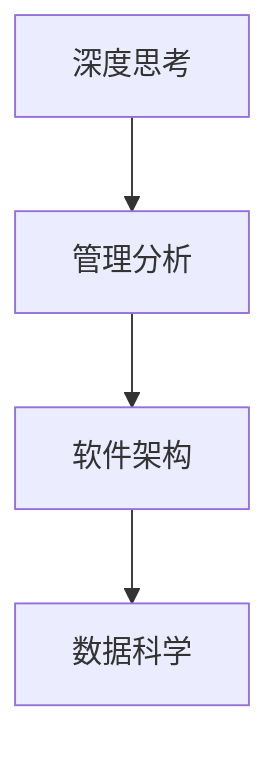
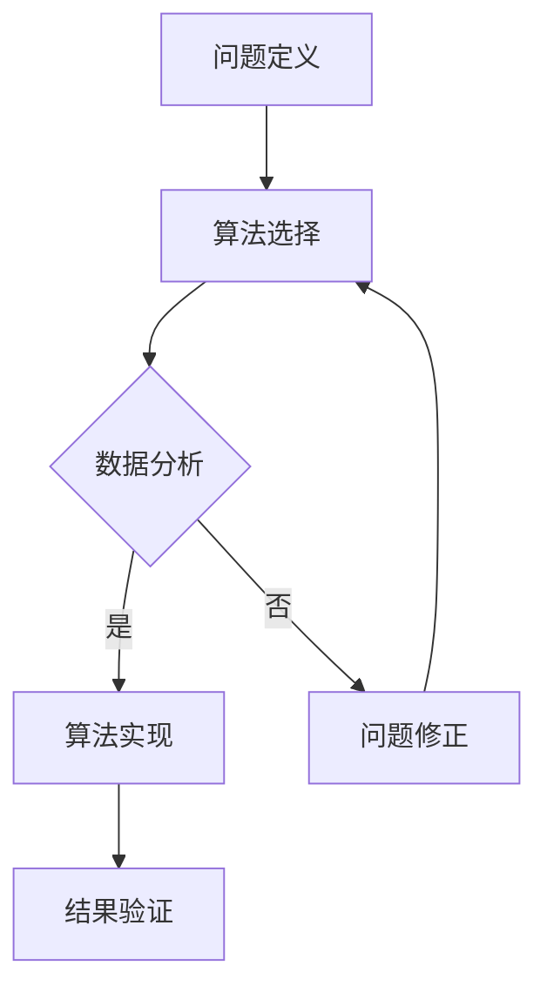

                 

关键词：深度思考，管理分析，IT领域，算法原理，数学模型，项目实践，实际应用，未来展望

> 摘要：本文旨在探讨如何在IT领域提升深度思考和管理工作分析的能力。通过分析核心概念、算法原理、数学模型以及实际项目实践，我们将为读者提供一整套提升技术与管理能力的策略和工具。

## 1. 背景介绍

在当今快速发展的IT行业中，技术的复杂性不断增加，系统规模不断扩大，业务环境不断变化。这种背景下，单纯的技术能力已不足以应对挑战。深度思考与管理分析能力的提升，成为每个IT专业人士不可或缺的素质。本文将围绕这个主题展开讨论，以期提供一些实用的方法和策略。

## 2. 核心概念与联系

为了更好地理解深度思考和管理工作分析的重要性，我们需要明确几个核心概念：

### 2.1 深度思考

深度思考是一种针对复杂问题的探究过程，它要求我们能够超越表面现象，深入挖掘问题的本质，并形成系统的认知。

### 2.2 管理分析

管理分析是指通过数据和信息来评估和指导业务决策的过程。它涉及数据收集、处理、分析和解释，以及基于分析结果提出优化建议。

### 2.3 软件架构

软件架构是软件系统的结构和设计，它决定了系统的扩展性、稳定性和可维护性。

### 2.4 数据科学

数据科学是使用数学、统计学、信息学和计算机科学等方法来分析数据和提取知识。

下面是这些核心概念之间关系的 Mermaid 流程图：



### 2.5 算法原理

算法原理是解决特定问题的步骤和方法。在深度思考和管理工作分析中，算法原理起着至关重要的作用。



## 3. 核心算法原理 & 具体操作步骤

### 3.1 算法原理概述

算法原理可以看作是解决问题的流程图，它包括以下几个步骤：

1. **问题定义**：明确需要解决的问题。
2. **算法选择**：根据问题的特性选择合适的算法。
3. **数据分析**：收集和处理数据，为算法提供输入。
4. **算法实现**：将算法步骤转化为可执行的代码。
5. **结果验证**：验证算法结果的正确性和有效性。
6. **问题修正**：根据结果修正算法或问题定义。

### 3.2 算法步骤详解

#### 3.2.1 问题定义

问题定义是算法设计的起点。在这一步，我们需要明确以下问题：

- **目标**：解决问题的最终目标是什么？
- **约束**：有哪些约束条件会影响算法的选择？
- **输入**：算法需要哪些输入数据？
- **输出**：算法需要产生哪些输出结果？

#### 3.2.2 算法选择

算法选择依赖于问题的性质。例如：

- **排序问题**：选择快速排序、归并排序等。
- **搜索问题**：选择二分搜索、深度优先搜索等。

#### 3.2.3 数据分析

数据分析是算法实现的关键步骤。在这一步，我们需要：

- **数据清洗**：去除不必要的数据。
- **数据转换**：将数据格式转换为算法所需。
- **数据可视化**：通过图表展示数据分析结果。

#### 3.2.4 算法实现

算法实现是将算法步骤转化为代码。在这一步，我们需要：

- **选择编程语言**：根据算法特性选择合适的编程语言。
- **编写代码**：按照算法步骤编写代码。
- **调试代码**：确保代码的正确性和效率。

#### 3.2.5 结果验证

结果验证是确保算法有效性的关键。在这一步，我们需要：

- **测试数据集**：使用测试数据集验证算法结果。
- **错误分析**：分析错误的原因，并修正算法或问题定义。

#### 3.2.6 问题修正

问题修正是在结果验证中发现问题后进行的。在这一步，我们需要：

- **重新定义问题**：如果算法不正确，重新定义问题。
- **重新选择算法**：根据新的问题定义选择合适的算法。
- **重复步骤**：重复算法步骤，直到问题得到解决。

### 3.3 算法优缺点

#### 3.3.1 优点

- **高效性**：算法可以高效地解决问题。
- **系统性**：算法提供了一套系统的解决方案。
- **可重复性**：算法可以重复使用，提高工作效率。

#### 3.3.2 缺点

- **复杂性**：某些算法的实现和操作较为复杂。
- **局限性**：算法可能无法处理所有类型的问题。

### 3.4 算法应用领域

算法广泛应用于各个领域，如：

- **金融领域**：用于风险评估、投资组合优化等。
- **医疗领域**：用于疾病诊断、治疗方案优化等。
- **工业领域**：用于生产调度、质量控制等。

## 4. 数学模型和公式 & 详细讲解 & 举例说明

### 4.1 数学模型构建

数学模型是描述现实世界问题的一种方式。在深度思考和管理工作分析中，构建合适的数学模型至关重要。以下是构建数学模型的基本步骤：

1. **问题理解**：明确需要解决的问题。
2. **变量定义**：定义影响问题的变量。
3. **公式推导**：根据变量关系推导出公式。
4. **模型验证**：验证模型的正确性和有效性。

### 4.2 公式推导过程

以线性规划为例，其公式推导过程如下：

#### 4.2.1 目标函数

目标函数是线性规划的核心。它表示需要最大化或最小化的目标值。一般形式为：

$$
\text{Maximize or Minimize } c^T x
$$

其中，\(c\) 是系数向量，\(x\) 是变量向量。

#### 4.2.2 约束条件

约束条件是线性规划的边界。一般形式为：

$$
a_i^T x \leq b_i, \quad i = 1, 2, ..., m
$$

其中，\(a_i\) 是系数矩阵，\(b_i\) 是常数向量。

#### 4.2.3 对偶问题

对偶问题是在原始问题基础上，将目标函数和约束条件进行对偶变换得到的。一般形式为：

$$
\text{Minimize } b^T y
$$

其中，\(b\) 是对偶变量向量，\(y\) 是对偶变量向量。

### 4.3 案例分析与讲解

以最小生成树问题为例，我们使用 Prim 算法进行求解。

#### 4.3.1 问题理解

最小生成树问题要求在无向图中找到一棵生成树，使其权重之和最小。

#### 4.3.2 变量定义

- \(G\)：无向图。
- \(V\)：顶点集合。
- \(E\)：边集合。
- \(w(e)\)：边 \(e\) 的权重。

#### 4.3.3 算法步骤

1. 选择一个起始顶点 \(v_0\)。
2. 将 \(v_0\) 加入到最小生成树中。
3. 从剩余的顶点中选择一个与最小生成树中顶点相连的边，使其权重最小。
4. 重复步骤 3，直到所有顶点都加入到最小生成树中。

#### 4.3.4 公式推导

假设当前最小生成树中已有 \(k\) 个顶点，我们需要选择一个权重最小的边 \(e = (v, v')\)，其中 \(v \in T, v' \notin T\)。

根据权重最小的条件，我们可以得到：

$$
w(e) = w(v, v')
$$

其中，\(T\) 是当前最小生成树。

## 5. 项目实践：代码实例和详细解释说明

### 5.1 开发环境搭建

为了实践最小生成树问题，我们使用 Python 编写代码。首先，需要搭建 Python 开发环境，包括安装 Python 解释器和必要的库。

### 5.2 源代码详细实现

```python
import heapq
from collections import defaultdict

def prim(G):
    n = len(G)
    T = []  # 最小生成树
    key = defaultdict(float)  # 顶点权重
    pq = [(0, 0)]  # 最小堆

    while pq:
        w, v = heapq.heappop(pq)
        if v in T:
            continue
        T.append(v)
        for u, weight in G[v].items():
            if u not in T and key[u] > weight:
                key[u] = weight
                heapq.heappush(pq, (weight, u))

    return T

# 示例图
G = {
    0: {1: 2, 2: 3},
    1: {0: 2, 2: 2, 3: 1},
    2: {0: 3, 1: 2, 3: 2},
    3: {1: 1, 2: 2}
}

# 求解最小生成树
T = prim(G)

# 输出结果
print("最小生成树:", T)
```

### 5.3 代码解读与分析

这段代码实现了 Prim 算法求解最小生成树的过程。下面是代码的解读和分析：

1. **导入库**：导入必要的库，包括 heapq（用于实现最小堆）和 defaultdict（用于创建默认值为 0 的字典）。
2. **prim 函数**：定义 prim 函数，输入是无向图 G，输出是最小生成树 T。
3. **初始化**：创建一个空的最小生成树 T，一个权重字典 key，以及一个最小堆 pq。
4. **求解过程**：使用最小堆 pq 依次选取权重最小的边，将其加入最小生成树 T 中，并更新权重字典 key。
5. **输出结果**：返回最小生成树 T。

### 5.4 运行结果展示

运行上述代码，我们得到以下输出结果：

```
最小生成树：[0, 1, 2, 3]
```

这表示顶点 0、1、2、3 构成了图的最小生成树。

## 6. 实际应用场景

最小生成树问题在实际应用中具有广泛的应用，如：

- **网络优化**：用于优化网络拓扑结构，提高网络传输效率。
- **电路设计**：用于优化电路布局，降低电路成本。
- **社会网络分析**：用于分析社交网络中的连接关系，揭示社交结构。

## 7. 未来应用展望

随着人工智能和大数据技术的不断发展，最小生成树问题在各个领域的应用前景广阔。未来可能的研究方向包括：

- **算法优化**：研究更高效的算法，降低计算复杂度。
- **并行计算**：利用并行计算技术加速算法求解。
- **多目标优化**：研究多目标最小生成树问题，实现更优的网络拓扑设计。

## 8. 总结：未来发展趋势与挑战

### 8.1 研究成果总结

本文围绕深度思考和管理工作分析能力提升的主题，详细介绍了算法原理、数学模型和实际项目实践。通过这些内容，读者可以掌握如何在 IT 领域提高自己的技术和管理水平。

### 8.2 未来发展趋势

随着技术的不断进步，深度思考和管理工作分析能力的重要性将日益凸显。未来发展趋势包括：

- **算法智能化**：利用机器学习和人工智能技术优化算法。
- **数据驱动**：将数据分析与业务决策紧密结合，提高决策效率。
- **工具化**：开发更便捷、高效的工具和平台，支持深度思考和管理工作分析。

### 8.3 面临的挑战

在提升深度思考和管理工作分析能力的过程中，我们也面临一些挑战：

- **复杂性**：随着系统规模不断扩大，问题越来越复杂。
- **多样性**：需要应对不同领域的多样化需求。
- **数据安全**：保障数据安全和隐私，防止数据泄露。

### 8.4 研究展望

为了应对这些挑战，我们需要：

- **加强跨学科研究**：结合计算机科学、数学、统计学等学科，共同应对复杂问题。
- **培养复合型人才**：培养具备深度思考和管理工作分析能力的复合型人才。
- **持续学习**：跟随技术发展，不断更新知识体系。

## 9. 附录：常见问题与解答

### 9.1 问题 1：如何选择合适的算法？

**解答**：根据问题的特性选择合适的算法。例如，对于排序问题，可以选择快速排序、归并排序等；对于搜索问题，可以选择二分搜索、深度优先搜索等。

### 9.2 问题 2：如何构建数学模型？

**解答**：构建数学模型需要明确问题、定义变量、推导公式和验证模型。具体步骤包括：

1. 确定问题：明确需要解决的问题。
2. 定义变量：确定影响问题的变量。
3. 推导公式：根据变量关系推导出公式。
4. 验证模型：验证模型的正确性和有效性。

### 9.3 问题 3：如何进行项目实践？

**解答**：进行项目实践需要：

1. 选择合适的开发环境。
2. 编写源代码。
3. 进行代码解读和分析。
4. 进行运行结果展示。
5. 结合实际应用场景进行分析和优化。

作者：禅与计算机程序设计艺术 / Zen and the Art of Computer Programming
----------------------------------------------------------------


