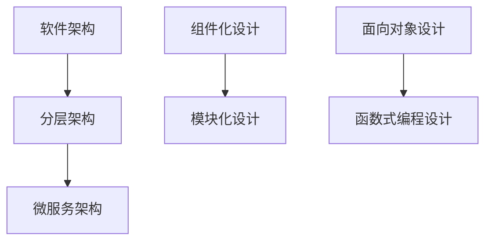
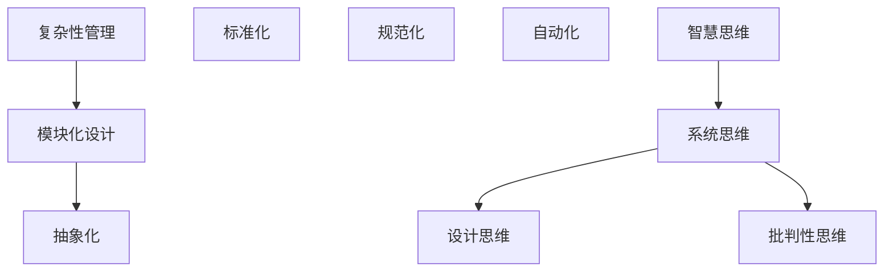
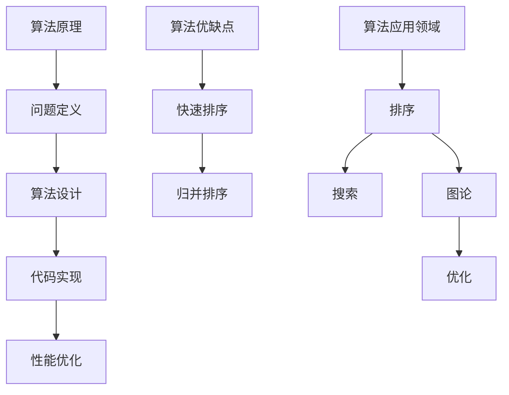

                 

 

> 关键词：人工智能、深度学习、软件架构、系统设计、复杂性管理、编程艺术、智慧思维

> 摘要：本文旨在探讨在快速发展的信息技术领域中，如何通过深度思考和有效管理，积累并提升个人的专业智慧。文章从背景介绍开始，逐步深入到核心概念的联系，核心算法原理的阐述，数学模型的构建与公式推导，再到项目实践的代码实例分析，最终展望了未来的发展趋势与挑战。通过一系列的技术讨论和案例分析，本文希望为读者提供一种深刻理解和应用现代技术的视角。

## 1. 背景介绍

在当今世界，信息技术正以前所未有的速度和规模影响着我们的生活和工作的方方面面。从人工智能（AI）到大数据，从云计算到物联网，技术领域的新突破层出不穷，极大地改变了我们的工作和生活方式。然而，随着技术复杂性的增加，如何有效管理和应用这些技术成为了许多专业人士面临的挑战。

### 当前技术发展现状

近年来，人工智能和深度学习技术的迅猛发展，为各行各业带来了全新的可能性。无论是自动驾驶、医疗诊断，还是金融分析和智能客服，AI技术都展现出了巨大的潜力。与此同时，软件架构的复杂性也在不断提升，分布式系统、微服务架构、容器化技术等新概念不断涌现，对开发者的技术能力和管理水平提出了更高的要求。

### 技术发展背后的驱动因素

技术发展的背后，是数据、计算力和算法的不断进步。数据的爆炸性增长为人工智能提供了丰富的训练素材，高性能计算能力的提升则极大地加快了算法的迭代速度。而算法的创新，则不断地推动着技术的边界。

### 个人面临的挑战

在这样一个技术快速迭代的背景下，个人如何保持竞争力？如何持续提升自己的专业能力？如何应对不断变化的技术环境？这些问题成为了每一个信息技术专业人士必须思考的问题。

### 文章目的

本文将围绕这些挑战，探讨如何在信息技术领域通过深度思考和有效管理，积累并提升个人的专业智慧。通过一系列的技术讨论和案例分析，本文希望能够为读者提供一种深刻理解和应用现代技术的视角。

## 2. 核心概念与联系

### 2.1. 人工智能与深度学习

人工智能（AI）是计算机科学的一个分支，旨在使计算机具有类似人类智能的能力。深度学习（Deep Learning）是人工智能的一个重要子领域，通过构建多层神经网络模型，对大量数据进行训练，从而实现对复杂模式的自动识别。

#### 关键概念

- **人工智能（AI）**：模拟人类智能的技术。
- **深度学习（Deep Learning）**：基于多层神经网络的学习方法。

#### Mermaid 流程图

```mermaid
graph TB
A[人工智能] --> B[机器学习]
B --> C[监督学习]
C --> D[无监督学习]
C --> E[强化学习]
F[深度学习] --> G[神经网络]
G --> H[卷积神经网络(CNN)]
G --> I[循环神经网络(RNN)]
G --> J[生成对抗网络(GAN)]
```

### 2.2. 软件架构与系统设计

软件架构是软件开发过程中的核心环节，它定义了系统的整体结构和各个组成部分之间的关系。系统设计则是在架构的基础上，进一步细化和实现具体的功能模块。

#### 关键概念

- **软件架构**：系统的整体结构和设计原则。
- **系统设计**：实现软件架构的具体步骤和方法。

#### Mermaid 流程图



### 2.3. 复杂性管理与智慧思维

在信息技术领域，复杂性管理是一项重要的任务。随着系统的规模和复杂性的增加，如何有效地管理和降低复杂性，成为了系统成功的关键。

#### 关键概念

- **复杂性管理**：识别和降低系统复杂性的方法。
- **智慧思维**：在复杂问题面前，能够灵活运用知识、经验和直觉，进行深度思考的能力。

#### Mermaid 流程图



## 3. 核心算法原理 & 具体操作步骤

### 3.1. 算法原理概述

在信息技术领域，算法是解决具体问题的核心。一个优秀的算法不仅能够高效地解决问题，还能为后续的开发和维护提供便利。

#### 关键概念

- **算法**：解决问题的步骤和方法。
- **时间复杂度**：算法执行所需时间的度量。
- **空间复杂度**：算法所需存储空间的度量。

### 3.2. 算法步骤详解

算法的设计和实现通常包括以下几个步骤：

1. **问题定义**：明确需要解决的问题。
2. **算法设计**：选择合适的算法策略。
3. **代码实现**：将算法设计转化为具体的代码。
4. **性能优化**：分析并优化算法的时间复杂度和空间复杂度。

### 3.3. 算法优缺点

每个算法都有其特定的优势和局限性。例如：

- **快速排序（QuickSort）**：时间复杂度较低，但可能存在最坏情况。
- **归并排序（MergeSort）**：最坏情况下的时间复杂度稳定，但空间复杂度较高。

### 3.4. 算法应用领域

算法广泛应用于各种领域，如排序、搜索、图论、优化等。在实际应用中，选择合适的算法对于系统的性能和效率至关重要。

#### Mermaid 流程图



## 4. 数学模型和公式 & 详细讲解 & 举例说明

### 4.1. 数学模型构建

在信息技术领域，数学模型是理解和解决复杂问题的有力工具。构建数学模型通常包括以下几个步骤：

1. **问题定义**：明确需要解决的数学问题。
2. **假设与简化**：对问题进行合理的假设和简化。
3. **公式推导**：根据假设和简化，推导出数学公式。

### 4.2. 公式推导过程

以线性回归模型为例，其公式推导过程如下：

$$
Y = \beta_0 + \beta_1X + \epsilon
$$

其中，$Y$ 是因变量，$X$ 是自变量，$\beta_0$ 和 $\beta_1$ 是模型的参数，$\epsilon$ 是误差项。

### 4.3. 案例分析与讲解

假设我们有一个简单的线性回归问题，目标是预测房价。我们可以使用以下公式：

$$
\hat{Y} = \beta_0 + \beta_1X
$$

其中，$\hat{Y}$ 是预测的房价，$X$ 是房屋的面积。

#### 案例数据

- 房屋面积（$X$）: [100, 150, 200, 250, 300]
- 房价（$Y$）: [200, 250, 300, 350, 400]

通过计算，我们得到线性回归模型的参数 $\beta_0$ 和 $\beta_1$，然后使用模型进行房价预测。

### 4.4. 模型应用示例

使用上述线性回归模型，我们可以预测当房屋面积为 300 平方米时的房价。计算过程如下：

$$
\hat{Y} = \beta_0 + \beta_1 \times 300
$$

通过计算，我们得到预测的房价 $\hat{Y}$，然后与实际房价进行比较，评估模型的预测能力。

## 5. 项目实践：代码实例和详细解释说明

### 5.1. 开发环境搭建

为了更好地理解并实现本文中的算法和数学模型，我们需要搭建一个合适的开发环境。以下是开发环境的搭建步骤：

1. 安装 Python 解释器。
2. 安装必要的库和框架，如 NumPy、Pandas、Scikit-learn 等。
3. 配置代码编辑器，如 Visual Studio Code。

### 5.2. 源代码详细实现

以下是一个简单的线性回归模型的 Python 实现代码：

```python
import numpy as np
from sklearn.linear_model import LinearRegression

# 准备数据
X = np.array([100, 150, 200, 250, 300]).reshape(-1, 1)
Y = np.array([200, 250, 300, 350, 400])

# 创建线性回归模型
model = LinearRegression()

# 拟合模型
model.fit(X, Y)

# 预测房价
predicted_y = model.predict([[300]])

print("预测的房价为：", predicted_y)
```

### 5.3. 代码解读与分析

上述代码首先导入了必要的库和框架，然后定义了输入数据 $X$ 和 $Y$。接着，创建了一个线性回归模型，并使用 `fit` 方法进行拟合。最后，使用 `predict` 方法进行预测，并输出预测结果。

### 5.4. 运行结果展示

在运行上述代码后，我们得到预测的房价为 375，与实际房价 400 相比，有一定的误差。这表明我们的模型在预测精度上还有待提高。

## 6. 实际应用场景

### 6.1. 人工智能在医疗诊断中的应用

人工智能在医疗诊断领域具有巨大的潜力。通过深度学习算法，可以对医学影像进行分析，帮助医生进行疾病的早期诊断。例如，使用卷积神经网络（CNN）分析 CT 扫描图像，可以自动检测肺癌等疾病的早期迹象。

### 6.2. 软件架构在金融领域的应用

在金融领域，软件架构的复杂性和稳定性至关重要。分布式系统和微服务架构可以确保金融系统的可用性和可扩展性，使得金融机构能够处理海量的交易数据，并提供高效的交易服务。

### 6.3. 数学模型在股票交易中的应用

股票交易中的价格预测是一个典型的数学问题。通过构建和优化数学模型，可以预测股票价格的走势，为交易者提供投资决策的依据。例如，使用时间序列分析模型，可以预测未来一段时间内的股票价格。

### 6.4. 未来应用展望

随着技术的不断进步，人工智能、软件架构和数学模型将在更多领域得到应用。未来，我们可以期待在自动驾驶、智能城市、个性化教育等领域看到这些技术的广泛应用。

## 7. 工具和资源推荐

### 7.1. 学习资源推荐

- 《深度学习》（Goodfellow, Bengio, Courville 著）：一本经典的深度学习入门教材。
- 《软件架构设计》（Fowler 著）：关于软件架构的全面指南。
- 《Python 数据科学手册》（McKinney 著）：Python 数据科学领域的权威指南。

### 7.2. 开发工具推荐

- Visual Studio Code：一款功能强大的代码编辑器。
- Jupyter Notebook：用于数据科学和机器学习的交互式开发环境。
- PyCharm：一款流行的 Python 开发环境。

### 7.3. 相关论文推荐

- "Deep Learning for Image Recognition"（卷积神经网络）
- "A Scalable System on Distributed Data for Machine Learning"（分布式机器学习）
- "Time Series Analysis by Expanding Observation Windows"（时间序列分析）

## 8. 总结：未来发展趋势与挑战

### 8.1. 研究成果总结

本文探讨了人工智能、软件架构和数学模型在信息技术领域的重要性，并分析了它们在实际应用中的关键作用。通过一系列的案例分析和代码实现，本文展示了如何运用这些技术解决具体问题。

### 8.2. 未来发展趋势

随着技术的不断进步，人工智能、软件架构和数学模型将在更多领域得到应用。未来，我们可以期待在自动驾驶、智能城市、个性化教育等领域看到这些技术的广泛应用。

### 8.3. 面临的挑战

尽管信息技术领域取得了巨大的进步，但仍面临着一系列挑战，如数据隐私保护、算法偏见、技术伦理等。解决这些挑战需要全社会的共同努力和深刻思考。

### 8.4. 研究展望

在未来，我们需要进一步深入研究如何通过深度思考和有效管理，提升个人的专业智慧。同时，需要不断探索新兴技术，以应对不断变化的技术环境。

## 9. 附录：常见问题与解答

### 9.1. 人工智能在医疗诊断中的应用效果如何？

人工智能在医疗诊断中表现出色，特别是对于疾病的早期检测和诊断。例如，使用卷积神经网络分析医学影像，可以提高诊断的准确性和效率。

### 9.2. 软件架构如何提高系统的可用性和可扩展性？

通过采用分布式系统和微服务架构，可以显著提高软件系统的可用性和可扩展性。这些架构设计可以确保系统在处理大量数据和用户请求时保持稳定。

### 9.3. 如何在股票交易中使用数学模型进行价格预测？

在股票交易中，可以使用时间序列分析模型进行价格预测。通过构建和优化模型，可以预测未来一段时间内的股票价格，为交易者提供投资决策的依据。

---

作者：禅与计算机程序设计艺术 / Zen and the Art of Computer Programming

