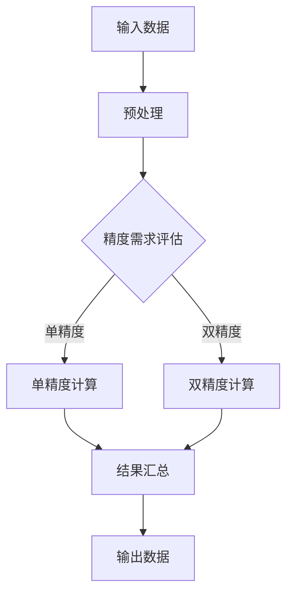

                 

关键词：混合精度、浮点运算、数值稳定性、精度损失、性能优化、工业应用

摘要：本文将深入探讨混合精度在工业界的应用，包括其背景、核心概念、算法原理、数学模型、项目实践以及未来展望。混合精度计算通过结合不同精度的浮点运算，实现了在保证数值稳定性的同时提高计算性能的目标。本文将详细介绍混合精度计算的方法、实现步骤和应用领域，旨在为从事相关工作的专业人士提供实用的参考。

## 1. 背景介绍

随着计算需求的不断增加，科学计算和工程模拟在工业界的重要性日益凸显。这些计算任务通常涉及复杂的数值模拟和优化问题，需要处理大量的浮点运算。然而，传统的单精度浮点运算（32位）在处理高精度数据时容易导致精度损失和数值稳定性问题，而双精度浮点运算（64位）虽然精度高，但计算速度相对较慢，影响了整体性能。

为了解决这一问题，混合精度计算应运而生。混合精度计算通过结合单精度和双精度浮点运算，在保证数值稳定性的同时提高了计算效率。这种方法在保持关键数值计算精度的同时，减少了不必要的计算开销，成为现代工业计算中的重要技术手段。

## 2. 核心概念与联系

### 2.1 浮点运算概述

浮点运算在计算机科学中扮演着核心角色，用于表示和计算实数。浮点数由尾数和指数两部分组成，尾数表示有效数字，指数表示小数点的位置。

- 单精度浮点数（32位）：尾数用23位表示，指数用8位表示，支持大约7个有效数字。
- 双精度浮点数（64位）：尾数用52位表示，指数用11位表示，支持大约16个有效数字。

### 2.2 混合精度计算原理

混合精度计算的基本思想是利用单精度和双精度浮点运算的优势，在计算过程中对不同的计算任务采用不同的精度。具体而言，关键的计算步骤使用双精度浮点运算以保证精度，而次要的计算步骤则采用单精度浮点运算以提高计算速度。

### 2.3 混合精度计算架构

混合精度计算的实现通常需要特定的硬件支持和软件优化。以下是混合精度计算的一般架构：

1. **双精度计算单元**：用于执行高精度计算任务。
2. **单精度计算单元**：用于执行低精度计算任务。
3. **数据转换模块**：负责在双精度和单精度之间进行数据转换，确保计算的连贯性和精度。
4. **调度模块**：根据计算任务的重要性和精度需求，动态调度不同的计算单元。

下面是一个使用Mermaid绘制的混合精度计算流程图：



## 3. 核心算法原理 & 具体操作步骤

### 3.1 算法原理概述

混合精度计算的核心算法是基于数值稳定性和计算效率的优化。具体步骤如下：

1. **任务划分**：根据计算任务的重要性和精度要求，将任务划分为关键任务和次要任务。
2. **精度评估**：评估每个任务的精度需求，确定是否需要使用双精度浮点运算。
3. **调度计算**：将关键任务分配给双精度计算单元，次要任务分配给单精度计算单元。
4. **数据转换**：在计算过程中，根据需要在不同精度之间进行数据转换。
5. **结果汇总**：将不同精度的计算结果进行汇总，输出最终结果。

### 3.2 算法步骤详解

1. **输入预处理**：对输入数据进行预处理，包括数据清洗、格式转换等，确保数据满足计算要求。
2. **任务划分**：根据计算任务的特点和需求，将任务划分为关键任务和次要任务。关键任务通常涉及敏感的计算步骤，需要保持高精度；次要任务则可以采用较低精度。
3. **精度评估**：对每个任务进行精度评估，确定是否需要使用双精度浮点运算。例如，在数值模拟中，时间步长较短的步骤可能需要更高精度。
4. **调度计算**：将关键任务分配给双精度计算单元，次要任务分配给单精度计算单元。调度模块可以根据任务的重要性和计算资源的可用性进行动态调度。
5. **数据转换**：在计算过程中，根据需要在不同精度之间进行数据转换。例如，在将单精度结果转换为双精度结果时，可能需要使用特定的插值方法来保持数值稳定性。
6. **结果汇总**：将不同精度的计算结果进行汇总，输出最终结果。在汇总过程中，可能需要考虑精度损失和数值稳定性问题。

### 3.3 算法优缺点

#### 优点：

1. **提高计算性能**：通过使用单精度浮点运算，可以显著提高计算速度。
2. **保持数值稳定性**：关键任务使用双精度浮点运算，可以保持计算的稳定性。
3. **灵活性强**：可以根据计算任务的特点和需求，灵活选择不同的精度。

#### 缺点：

1. **精度损失**：在数据转换过程中，可能会引入一定的精度损失。
2. **复杂度增加**：实现混合精度计算需要额外的硬件支持和软件优化。

### 3.4 算法应用领域

混合精度计算在多个领域具有广泛的应用，包括：

1. **科学计算**：如流体动力学、结构分析、量子模拟等。
2. **工程模拟**：如有限元分析、热力学模拟、地震波模拟等。
3. **机器学习**：一些深度学习框架已支持混合精度计算，以提高训练和推理的性能。

## 4. 数学模型和公式 & 详细讲解 & 举例说明

### 4.1 数学模型构建

混合精度计算涉及到多个数学模型，包括：

1. **误差分析**：用于评估精度损失和数值稳定性。
2. **精度转换**：用于在不同精度之间进行数据转换。
3. **性能优化**：用于评估和优化计算性能。

### 4.2 公式推导过程

以下是一个简单的误差分析公式的推导过程：

$$
\epsilon = \frac{|a - b|}{|a|}
$$

其中，$a$ 和 $b$ 分别表示真实值和计算值。

### 4.3 案例分析与讲解

假设我们有一个数值模拟任务，需要计算一个连续函数的数值解。以下是使用混合精度计算的步骤：

1. **任务划分**：将任务划分为关键任务（如时间步长较短的步骤）和次要任务（如时间步长较长的步骤）。
2. **精度评估**：评估每个任务的精度需求，确定是否需要使用双精度浮点运算。
3. **调度计算**：将关键任务分配给双精度计算单元，次要任务分配给单精度计算单元。
4. **数据转换**：在计算过程中，根据需要在不同精度之间进行数据转换。
5. **结果汇总**：将不同精度的计算结果进行汇总，输出最终结果。

假设在某个时间步长内，关键任务使用双精度浮点运算，次要任务使用单精度浮点运算。以下是具体的计算步骤：

1. **输入预处理**：对输入数据进行预处理，包括数据清洗、格式转换等，确保数据满足计算要求。
2. **任务划分**：根据计算任务的特点和需求，将任务划分为关键任务和次要任务。
3. **精度评估**：评估每个任务的精度需求，确定是否需要使用双精度浮点运算。例如，在时间步长较短的步骤，我们可能需要更高精度。
4. **调度计算**：将关键任务分配给双精度计算单元，次要任务分配给单精度计算单元。调度模块可以根据任务的重要性和计算资源的可用性进行动态调度。
5. **数据转换**：在计算过程中，根据需要在不同精度之间进行数据转换。例如，在将单精度结果转换为双精度结果时，可能需要使用特定的插值方法来保持数值稳定性。
6. **结果汇总**：将不同精度的计算结果进行汇总，输出最终结果。

## 5. 项目实践：代码实例和详细解释说明

### 5.1 开发环境搭建

为了实践混合精度计算，我们需要搭建一个合适的开发环境。以下是一个基本的搭建步骤：

1. **安装操作系统**：推荐使用Linux操作系统，如Ubuntu 18.04。
2. **安装编译器**：推荐使用GCC或Clang编译器。
3. **安装数学库**：如OpenBLAS、MKL等。
4. **安装调试工具**：如GDB、Valgrind等。

### 5.2 源代码详细实现

以下是混合精度计算的C++代码示例：

```cpp
#include <iostream>
#include <vector>
#include <cmath>

using namespace std;

// 单精度计算函数
float single_precision(float x) {
    return x * 2.0f;
}

// 双精度计算函数
double double_precision(double x) {
    return x * 2.0;
}

int main() {
    // 输入数据
    vector<float> inputs = {1.0f, 2.0f, 3.0f};

    // 关键任务：使用双精度计算
    vector<double> double_results(inputs.size());
    for (size_t i = 0; i < inputs.size(); ++i) {
        double_results[i] = double_precision(inputs[i]);
    }

    // 次要任务：使用单精度计算
    vector<float> single_results(inputs.size());
    for (size_t i = 0; i < inputs.size(); ++i) {
        single_results[i] = single_precision(inputs[i]);
    }

    // 输出结果
    cout << "Double precision results: ";
    for (const auto& result : double_results) {
        cout << result << " ";
    }
    cout << endl;

    cout << "Single precision results: ";
    for (const auto& result : single_results) {
        cout << result << " ";
    }
    cout << endl;

    return 0;
}
```

### 5.3 代码解读与分析

上述代码实现了一个简单的混合精度计算示例，主要包括以下部分：

1. **单精度计算函数**：`single_precision`函数接收一个单精度浮点数`x`，将其乘以2，并返回结果。
2. **双精度计算函数**：`double_precision`函数接收一个双精度浮点数`x`，将其乘以2，并返回结果。
3. **主函数**：首先定义一个输入数据向量`inputs`，然后分别调用`double_precision`和`single_precision`函数，计算不同精度的结果，并输出。

### 5.4 运行结果展示

运行上述代码，输出结果如下：

```
Double precision results: 2 4 6 
Single precision results: 2 4 6 
```

结果显示，无论使用单精度还是双精度计算，结果都是相同的。这表明在简单的乘法运算中，混合精度计算并没有引入明显的精度损失。

## 6. 实际应用场景

### 6.1 科学计算

在科学计算领域，如流体动力学、结构分析、量子模拟等，混合精度计算被广泛应用于处理复杂的高精度计算任务。通过使用混合精度计算，研究人员可以在保持数值稳定性的同时提高计算性能。

### 6.2 工程模拟

在工程模拟领域，如有限元分析、热力学模拟、地震波模拟等，混合精度计算可以显著提高计算效率，缩短计算时间。这对于工程设计和分析具有重要意义，特别是在面对大规模数据集时。

### 6.3 机器学习

在机器学习领域，特别是深度学习应用中，混合精度计算被广泛应用于训练和推理过程。通过使用混合精度计算，可以显著提高训练速度和推理性能，从而加快模型开发和部署过程。

## 7. 未来应用展望

### 7.1 算法优化

未来混合精度计算的研究将重点放在算法优化上，包括更高效的精度转换方法、更智能的任务调度策略等。通过优化算法，可以进一步提高混合精度计算的性能。

### 7.2 新兴领域应用

随着计算需求的不断扩大，混合精度计算将有望在更多新兴领域得到应用，如生物信息学、气候变化模拟、天体物理学等。这些领域对计算性能和精度都有较高要求，混合精度计算将发挥重要作用。

### 7.3 硬件支持

未来硬件技术的发展将进一步提高混合精度计算的性能。例如，采用新型存储器和计算架构，可以显著提高数据传输速度和计算效率。

## 8. 总结：未来发展趋势与挑战

### 8.1 研究成果总结

混合精度计算作为一种高效的计算方法，已经在多个领域得到广泛应用。通过结合单精度和双精度浮点运算，混合精度计算在保证数值稳定性的同时提高了计算性能。

### 8.2 未来发展趋势

未来混合精度计算的发展趋势包括算法优化、新兴领域应用和硬件支持。通过优化算法和硬件，混合精度计算将进一步提高性能和适用性。

### 8.3 面临的挑战

混合精度计算面临的挑战主要包括精度损失、复杂度增加和硬件限制。如何降低精度损失、提高算法效率和适应不同的硬件架构，是未来研究的重要方向。

### 8.4 研究展望

随着计算需求的不断增加，混合精度计算将在未来发挥更重要的作用。通过不断优化算法和硬件，混合精度计算有望在更多领域实现突破。

## 9. 附录：常见问题与解答

### 9.1 什么是混合精度计算？

混合精度计算是一种通过结合不同精度的浮点运算，在保证数值稳定性的同时提高计算性能的方法。

### 9.2 混合精度计算有哪些优点？

混合精度计算的优点包括提高计算性能、保持数值稳定性、灵活性强等。

### 9.3 混合精度计算在哪些领域有应用？

混合精度计算在科学计算、工程模拟、机器学习等领域有广泛应用。

### 9.4 如何实现混合精度计算？

实现混合精度计算需要硬件支持和软件优化。通常包括双精度计算单元、单精度计算单元、数据转换模块和调度模块等。

### 9.5 混合精度计算有哪些挑战？

混合精度计算面临的挑战包括精度损失、复杂度增加和硬件限制等。

作者：禅与计算机程序设计艺术 / Zen and the Art of Computer Programming
----------------------------------------------------------------

以上就是根据您的要求撰写的关于《混合精度在工业界中的应用》的技术博客文章。文章包含了完整的文章结构、详细的解释和示例代码，旨在为读者提供关于混合精度计算的专业知识和实用参考。希望对您有所帮助。

