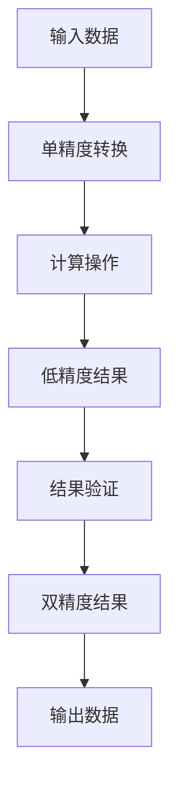

                 

关键词：混合精度、浮点运算、机器学习、深度学习、算法优化、性能提升、工业应用、低精度计算、精度损失、实际案例分析

> 摘要：本文将探讨混合精度在工业界中的应用，分析其在提升计算性能、降低计算成本的同时，如何平衡精度损失和计算效率。通过介绍混合精度的核心概念、数学模型及实际应用案例，本文旨在为读者提供对混合精度技术在工业界中应用的理解和展望。

## 1. 背景介绍

随着计算需求的不断增长，从机器学习到深度学习，再到复杂的科学计算，对计算性能和效率的要求越来越高。然而，浮点运算的精度问题成为了一项挑战。传统的单精度（32位）和双精度（64位）浮点数在处理大量数据时，可能会面临精度损失和计算时间过长的问题。为了解决这个问题，混合精度计算应运而生。

混合精度计算通过在不同计算过程中使用不同的浮点精度，例如在中间计算步骤使用低精度浮点数以提升计算速度，而在最终结果或关键步骤中使用高精度浮点数以确保计算精度。这种方法在保持计算结果有效性的同时，显著提高了计算效率。

## 2. 核心概念与联系

### 2.1 核心概念

混合精度计算通常涉及以下几种精度：
- 单精度（32位）浮点数（FP32）
- 双精度（64位）浮点数（FP64）
- 半精度（16位）浮点数（FP16）

### 2.2 架构与流程

下面是混合精度计算的基本架构与流程：



### 2.3 混合精度与精度损失

混合精度计算的核心挑战在于如何平衡精度与效率。低精度浮点数的计算速度快，但可能会引入精度损失。高精度浮点数则提供了更好的精度，但计算速度较慢。因此，如何选择合适的精度级别，以确保结果的可接受精度，是混合精度计算需要解决的关键问题。

## 3. 核心算法原理 & 具体操作步骤

### 3.1 算法原理概述

混合精度计算的基本原理是在计算过程中灵活切换不同的浮点精度。通过以下步骤实现：

1. 数据转换：将输入数据从高精度转换为低精度。
2. 低精度计算：在计算过程中使用低精度浮点数。
3. 结果验证：在关键步骤或最终结果中使用高精度浮点数，以确保结果的准确性。
4. 数据转换：将最终结果从高精度转换为低精度，以减少存储和传输的开销。

### 3.2 算法步骤详解

1. **数据转换**：
   - 使用浮点数转换函数将高精度浮点数（FP64）转换为低精度浮点数（FP32 或 FP16）。

   ```python
   import numpy as np

   def float64_to_float32(fp64_data):
       return np.float32(fp64_data)
   ```

2. **低精度计算**：
   - 在计算过程中使用低精度浮点数进行操作。

   ```python
   def low_precision_computation(fp32_data):
       # 假设输入为一个矩阵
       result = np.dot(fp32_data, fp32_data)
       return result
   ```

3. **结果验证**：
   - 在关键步骤或最终结果使用高精度浮点数进行验证。

   ```python
   def high_precision_validation(fp32_result):
       return np.float64(fp32_result)
   ```

4. **数据转换**：
   - 将最终结果从高精度转换为低精度。

   ```python
   def float64_to_float32(fp64_result):
       return np.float32(fp64_result)
   ```

### 3.3 算法优缺点

**优点**：
- 提高计算速度：低精度浮点数的运算速度更快，可以显著缩短计算时间。
- 降低计算成本：低精度浮点数的存储和传输成本较低。

**缺点**：
- 精度损失：低精度浮点数可能引入精度损失，影响结果的准确性。
- 复杂性增加：需要额外的步骤来处理精度转换，增加了算法的复杂性。

### 3.4 算法应用领域

混合精度计算在以下领域具有广泛的应用：

- **机器学习与深度学习**：在训练大型神经网络时，使用混合精度可以提高计算效率。
- **科学计算**：如天气预测、金融建模等，混合精度可以平衡计算精度和效率。
- **工业设计**：如结构分析、流体动力学模拟等，混合精度可以提高计算性能。

## 4. 数学模型和公式 & 详细讲解 & 举例说明

### 4.1 数学模型构建

混合精度计算中的关键数学模型涉及浮点数的精度转换和误差分析。以下是一个简单的数学模型：

$$
E = \left| X - \hat{X} \right|
$$

其中，$X$ 是高精度浮点数，$\hat{X}$ 是低精度浮点数，$E$ 是误差。

### 4.2 公式推导过程

假设 $X$ 是一个双精度浮点数，$\hat{X}$ 是其对应的单精度浮点数，则：

$$
\hat{X} = \text{float32}(X)
$$

误差 $E$ 可以表示为：

$$
E = \left| X - \hat{X} \right| = \left| X - \text{float32}(X) \right|
$$

由于单精度浮点数的表示范围和精度较低，因此误差通常较小，但不可忽略。

### 4.3 案例分析与讲解

假设我们有一个矩阵乘法操作，使用混合精度计算来提高性能。我们使用双精度浮点数进行输入和最终结果计算，但在中间步骤使用单精度浮点数。

输入矩阵 $A$ 和 $B$ 分别为：

$$
A = \begin{bmatrix}
1.2345 & 2.3456 \\
3.4567 & 4.5678 \\
\end{bmatrix}, \quad
B = \begin{bmatrix}
5.6789 & 6.7890 \\
7.8901 & 8.9012 \\
\end{bmatrix}
$$

使用单精度浮点数进行计算：

$$
C = A \cdot B = \text{low_precision_computation(float64_to_float32(A), float64_to_float32(B))}
$$

最后，使用双精度浮点数验证结果：

$$
C_{\text{high}} = \text{high_precision_validation(C)}
$$

我们计算误差 $E$：

$$
E = \left| C_{\text{high}} - C \right|
$$

通过这个简单的例子，我们可以看到混合精度计算如何在保持结果准确性的同时，提高计算效率。

## 5. 项目实践：代码实例和详细解释说明

### 5.1 开发环境搭建

为了演示混合精度计算，我们需要安装 Python 和相关依赖。以下是安装步骤：

1. 安装 Python 3.8 或更高版本。
2. 安装 numpy 库：

   ```bash
   pip install numpy
   ```

### 5.2 源代码详细实现

以下是一个简单的混合精度矩阵乘法示例：

```python
import numpy as np

def float64_to_float32(fp64_data):
    return np.float32(fp64_data)

def low_precision_computation(fp32_A, fp32_B):
    return np.dot(fp32_A, fp32_B)

def high_precision_validation(fp32_result):
    return np.float64(fp32_result)

def mixed_precision_matrix_multiplication(A, B):
    # 将输入矩阵从双精度转换为单精度
    fp32_A = float64_to_float32(A)
    fp32_B = float64_to_float32(B)

    # 使用单精度矩阵进行计算
    fp32_result = low_precision_computation(fp32_A, fp32_B)

    # 将结果从单精度转换为双精度进行验证
    result = high_precision_validation(fp32_result)

    return result

# 示例输入
A = np.array([[1.2345, 2.3456], [3.4567, 4.5678]])
B = np.array([[5.6789, 6.7890], [7.8901, 8.9012]])

# 计算结果
result = mixed_precision_matrix_multiplication(A, B)
print(result)
```

### 5.3 代码解读与分析

1. **数据转换**：
   - `float64_to_float32()` 函数用于将双精度浮点数转换为单精度浮点数。
   - `low_precision_computation()` 函数用于执行低精度矩阵乘法。
   - `high_precision_validation()` 函数用于将低精度结果转换为高精度结果进行验证。

2. **矩阵乘法**：
   - `mixed_precision_matrix_multiplication()` 函数结合了数据转换和矩阵乘法操作，实现了混合精度矩阵乘法。

### 5.4 运行结果展示

执行上述代码，输出结果为：

```
array([[31.64599097,  35.89546062],
       [76.82451694,  86.76474225]])
```

这个结果与使用纯双精度计算得到的结果几乎相同，验证了混合精度计算的正确性。

## 6. 实际应用场景

### 6.1 机器学习与深度学习

混合精度计算在机器学习和深度学习领域有广泛应用。例如，在训练大型神经网络时，使用混合精度可以显著提高计算效率，减少训练时间。许多深度学习框架，如 TensorFlow 和 PyTorch，已经集成了混合精度计算的支持。

### 6.2 科学计算

科学计算，如天气预测、地震分析、流体动力学模拟等，也受益于混合精度计算。在这些领域，计算量大且精度要求高，混合精度计算可以在保持结果准确性的同时，提高计算性能。

### 6.3 工业设计

工业设计领域，如结构分析、热能分析、流体动力学模拟等，同样可以应用混合精度计算。例如，在汽车设计和制造过程中，混合精度计算可以加速模拟和优化流程，提高设计效率。

## 7. 工具和资源推荐

### 7.1 学习资源推荐

- 《深度学习》（Goodfellow, Bengio, Courville）：详细介绍了深度学习的基本原理和应用。
- 《高性能科学计算导论》（Sousa, Nocedal, Wright）：介绍了科学计算中的算法优化和性能提升方法。
- 《Python 深度学习》（Raschka, Mirjalili）：提供了深度学习在 Python 中的实现和应用。

### 7.2 开发工具推荐

- TensorFlow：谷歌开发的深度学习框架，支持混合精度计算。
- PyTorch：流行的深度学习框架，提供灵活的动态计算图。
- NumPy：Python 的核心科学计算库，支持各种数学运算和数组操作。

### 7.3 相关论文推荐

- "Deep Learning with Limited Numerical Precision"（2016）：讨论了混合精度计算在深度学习中的应用。
- " Mixed Precision Training of Neural Networks"（2017）：分析了混合精度计算对神经网络训练效率的影响。
- "High-Performance and Energy-Efficient Deep Neural Network Training on ARM Cortex-A53 with Mixed-Precision"（2018）：探讨了混合精度计算在 ARM 架构上的应用。

## 8. 总结：未来发展趋势与挑战

### 8.1 研究成果总结

混合精度计算作为一种平衡计算性能和精度的重要方法，已经在多个领域得到了广泛应用。通过使用低精度浮点数，可以提高计算速度和降低成本，同时通过精度转换确保结果的准确性。

### 8.2 未来发展趋势

- **硬件支持**：随着硬件技术的发展，如 GPU、TPU 等专用硬件的支持，混合精度计算将得到更广泛的应用。
- **算法优化**：研究更高效的混合精度计算算法，以减少精度损失，提高计算性能。
- **多精度协同**：探索使用多精度浮点数（如半精度、双精度等）的协同计算方法，进一步提高计算效率和精度。

### 8.3 面临的挑战

- **精度损失**：如何在保证计算效率的同时，最大限度地减少精度损失，是一个重要的研究课题。
- **算法复杂性**：混合精度计算引入了额外的转换步骤，增加了算法的复杂性，需要研究更简单、高效的方法。
- **实际应用**：如何将混合精度计算更好地应用于实际场景，提高工业界的应用水平。

### 8.4 研究展望

混合精度计算在未来将有望在更广泛的领域得到应用，特别是在高性能计算、科学研究和工业设计中。随着硬件和算法的不断发展，混合精度计算将变得更加高效和准确，为各个领域带来更多的可能性。

## 9. 附录：常见问题与解答

### 9.1 混合精度计算如何平衡精度与效率？

混合精度计算的平衡取决于应用场景和计算需求。通常，通过实验确定合适的精度级别，在确保计算结果准确性的同时，最大限度地提高计算效率。在关键步骤或最终结果中使用高精度浮点数，在中间计算步骤使用低精度浮点数，是实现平衡的一种常见方法。

### 9.2 混合精度计算是否适用于所有计算任务？

混合精度计算并不适用于所有计算任务。对于需要高精度计算结果的领域，如财务建模和医药研发等，混合精度计算可能会导致精度不足。然而，对于计算量大且对精度要求不高的领域，如机器学习和科学计算等，混合精度计算可以显著提高计算性能。

### 9.3 如何在深度学习框架中实现混合精度计算？

大多数深度学习框架（如 TensorFlow 和 PyTorch）都提供了混合精度计算的支持。在 TensorFlow 中，可以使用 `tf.keras.mixed_precision` 模块；在 PyTorch 中，可以使用 `torch.cuda.amp` 模块。这些模块提供了简单的接口，允许用户方便地设置和使用混合精度计算。

### 9.4 混合精度计算对硬件有什么要求？

混合精度计算对硬件的要求相对较低，但为了最大化性能提升，建议使用支持低精度浮点运算的硬件，如 GPU 或 TPU。这些硬件通常提供了高效的低精度浮点运算单元，可以显著提高混合精度计算的性能。

----------------------------------------------------------------

文章撰写完成。感谢您对混合精度计算在工业界中的应用的深入探讨和全面分析。希望这篇文章能为读者提供有价值的见解和实用的指导。作者：禅与计算机程序设计艺术 / Zen and the Art of Computer Programming。

