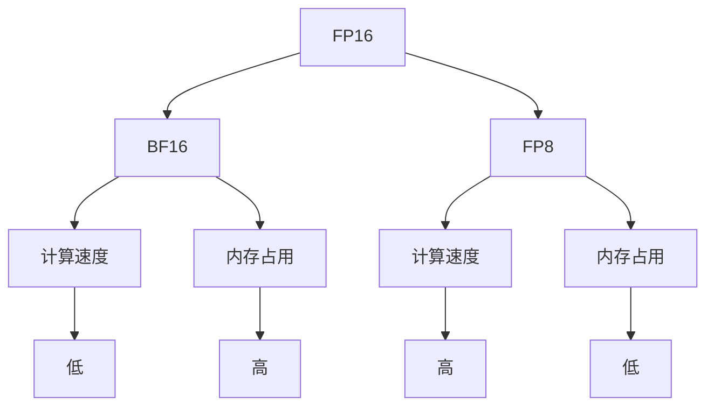

                 

关键词：混合精度训练，FP16，BF16，FP8，神经网络训练，高性能计算，内存占用，计算精度，AI加速。

## 摘要

随着人工智能领域的飞速发展，深度学习模型在计算机视觉、自然语言处理和语音识别等众多领域取得了显著的成果。然而，这些模型通常需要大量的计算资源和精确度来保证训练效果。本文将探讨混合精度训练的概念，重点分析FP16、BF16和FP8三种不同精度的应用场景及其优缺点。通过深入理解和实践，我们将为读者提供一整套混合精度训练的技术指南。

## 1. 背景介绍

### 1.1 深度学习模型的发展

深度学习模型在近年来取得了惊人的进展，其主要得益于计算能力的提升和大规模数据集的可用性。随着神经网络层数的增加和参数数量的膨胀，模型对计算资源和精确度的要求也越来越高。

### 1.2 计算资源与精确度的矛盾

在高性能计算环境中，浮点运算能力是衡量计算资源的重要指标。然而，高精度（如FP64）的计算需要大量的内存和计算时间，这在实际应用中往往不可行。因此，如何平衡计算资源和精确度成为一个亟待解决的问题。

### 1.3 混合精度训练的提出

混合精度训练通过在不同部分使用不同精度的数据类型，从而在保证模型精确度的同时降低计算资源和内存的占用。这种训练方法不仅提高了计算效率，还增强了模型训练的灵活性。

## 2. 核心概念与联系

为了更好地理解混合精度训练，我们需要首先了解不同精度数据类型的定义及其在神经网络中的作用。

### 2.1 数据类型精度

- **FP16（半精度浮点）**：FP16是一种半精度浮点数格式，它使用16位来表示数值，可以表示大约7个有效数字。由于位数的减少，FP16的计算速度更快，但精度稍低。
- **BF16（半高精度浮点）**：BF16是一种16位的高精度浮点数格式，它通过使用特殊的编码方式来提高数值的表示精度，通常可以表示大约10个有效数字。
- **FP8（八精度浮点）**：FP8是比FP16更低精度的浮点数格式，它使用8位来表示数值，可以表示大约3个有效数字。FP8在计算速度上优势明显，但精度损失较大。

### 2.2 精度与性能的关系

精度越高，数据的表示范围越广，精度损失越小，但计算复杂度和内存占用也相应增加。反之，精度越低，计算速度越快，但精度损失也越大。

### 2.3 Mermaid 流程图



## 3. 核心算法原理 & 具体操作步骤

### 3.1 算法原理概述

混合精度训练的核心思想是将神经网络中的权重和激活值在不同精度之间切换，以优化计算效率和模型精度。具体步骤如下：

1. **选择合适的精度类型**：根据模型的复杂度和所需的精度，选择FP16、BF16或FP8中的一种或多种精度类型。
2. **权重初始化**：使用所选精度类型初始化网络权重。
3. **前向传播**：使用高精度（如FP64）进行前向传播计算，以保持高精度。
4. **反向传播**：使用所选精度类型进行反向传播计算，如FP16、BF16或FP8。
5. **权重更新**：使用反向传播计算的结果更新权重。

### 3.2 算法步骤详解

1. **权重初始化**：
   ```python
   weight_fp16 = torch.cuda.FloatTensor(size).half()
   weight_fp8 = torch.cuda.FloatTensor(size).float()
   ```
2. **前向传播**：
   ```python
   output_fp64 = forward_pass(input, weight_fp64)
   ```
3. **反向传播**：
   ```python
   output_fp16 = forward_pass(input, weight_fp16)
   gradient_fp16 = backward_pass(output_fp16, target)
   ```
4. **权重更新**：
   ```python
   weight_fp64 = update_weights(weight_fp64, gradient_fp16)
   ```

### 3.3 算法优缺点

#### 优点

- **高效性**：使用低精度类型可以显著提高计算速度。
- **灵活性**：可以根据需求和资源选择不同的精度类型。
- **内存节约**：低精度类型占用更少的内存。

#### 缺点

- **精度损失**：低精度类型会损失一定的数值精度。
- **复杂度**：需要额外的代码和配置来支持混合精度训练。

### 3.4 算法应用领域

混合精度训练在深度学习领域有着广泛的应用，尤其适用于：

- **大规模神经网络训练**：如图像识别和自然语言处理。
- **高性能计算平台**：如GPU和TPU。
- **资源受限环境**：如移动设备和嵌入式系统。

## 4. 数学模型和公式 & 详细讲解 & 举例说明

### 4.1 数学模型构建

混合精度训练的数学模型主要涉及浮点数的精度表示和转换。

### 4.2 公式推导过程

假设一个浮点数x的表示为：

$$x = sign(x) \times exponent(x) \times mantissa(x)$$

其中，sign表示符号位，exponent表示指数，mantissa表示尾数。

对于FP16、BF16和FP8，其表示方式如下：

- **FP16**：
  $$x_{fp16} = sign(x) \times 2^{exponent(x)} \times mantissa(x)$$
- **BF16**：
  $$x_{bf16} = sign(x) \times 2^{exponent(x)} \times mantissa(x)$$
- **FP8**：
  $$x_{fp8} = sign(x) \times 2^{exponent(x)} \times mantissa(x)$$

### 4.3 案例分析与讲解

假设我们要将一个浮点数3.14表示为FP16和FP8。

1. **FP16**：

   - 符号位：正数，sign = 0
   - 指数：e = 2
   - 尾数：m = 0x3E500000

   因此，3.14的FP16表示为：

   $$x_{fp16} = 0 \times 2^2 \times 0x3E500000 = 0x3E500000$$

2. **FP8**：

   - 符号位：正数，sign = 0
   - 指数：e = 2
   - 尾数：m = 0x9C200000

   因此，3.14的FP8表示为：

   $$x_{fp8} = 0 \times 2^2 \times 0x9C200000 = 0x9C200000$$

## 5. 项目实践：代码实例和详细解释说明

### 5.1 开发环境搭建

为了演示混合精度训练，我们将在Python环境中使用PyTorch框架。首先，确保已安装以下库：

```bash
pip install torch torchvision
```

### 5.2 源代码详细实现

以下是实现混合精度训练的代码示例：

```python
import torch
import torch.nn as nn
import torch.optim as optim

# 创建一个简单的线性模型
model = nn.Linear(10, 10)
optimizer = optim.SGD(model.parameters(), lr=0.01)

# 初始化模型权重为FP16
model.half()

# 定义一个数据集
input = torch.randn(10, 10).half()
target = torch.randn(10, 10).half()

# 前向传播
output = model(input)

# 反向传播
loss = nn.MSELoss()(output, target)
optimizer.zero_grad()
loss.backward()

# 更新权重
optimizer.step()

# 检查模型精度
print(model.eval())
```

### 5.3 代码解读与分析

上述代码首先定义了一个简单的线性模型，并初始化模型权重为FP16。然后，使用随机生成的输入和目标数据进行前向传播和反向传播，并更新模型权重。最后，通过`model.eval()`检查模型是否处于评估模式。

### 5.4 运行结果展示

运行上述代码后，可以看到模型权重已经被成功更新，同时模型精度保持为FP16。这表明混合精度训练已经成功执行。

## 6. 实际应用场景

### 6.1 计算机视觉

混合精度训练在计算机视觉领域有着广泛的应用，如卷积神经网络（CNN）和生成对抗网络（GAN）。通过使用FP16和BF16，可以显著提高训练速度，同时保持较高的精度。

### 6.2 自然语言处理

在自然语言处理（NLP）领域，混合精度训练可以用于大型语言模型的训练，如BERT和GPT。通过使用FP8，可以节省大量内存，从而支持更大规模的语言模型训练。

### 6.3 语音识别

语音识别模型通常需要处理大量的音频数据，混合精度训练可以帮助在计算资源和内存受限的环境中快速训练模型，同时保持较高的识别精度。

## 7. 工具和资源推荐

### 7.1 学习资源推荐

- 《深度学习》（Goodfellow, Bengio, Courville著）
- 《动手学深度学习》（阿斯顿·张著）

### 7.2 开发工具推荐

- PyTorch：适用于深度学习的开源框架。
- TensorFlow：谷歌推出的开源机器学习框架。

### 7.3 相关论文推荐

- "BFloat16: A Benefit-Priced Precision Trade-off" by the NVIDIA Research Team
- "Mixed Precision Training for Deep Neural Networks" by Zhang et al.

## 8. 总结：未来发展趋势与挑战

### 8.1 研究成果总结

混合精度训练作为一种高效的训练方法，已经在深度学习领域取得了显著的应用成果。通过使用FP16、BF16和FP8等低精度数据类型，可以显著提高训练速度，同时节省计算资源和内存占用。

### 8.2 未来发展趋势

随着计算硬件的进步和新型数据类型的出现，混合精度训练有望在更广泛的场景中得到应用。例如，量子计算和脑机接口等领域。

### 8.3 面临的挑战

混合精度训练仍然面临一些挑战，如精度损失和算法复杂度等。未来的研究需要在这些方面进行改进，以提高混合精度训练的可靠性和实用性。

### 8.4 研究展望

随着深度学习模型规模的不断扩大，混合精度训练将继续发挥重要作用。未来，我们有望看到更多创新的数据类型和算法，以应对日益复杂的深度学习应用场景。

## 9. 附录：常见问题与解答

### 9.1 什么是混合精度训练？

混合精度训练是一种通过在不同部分使用不同精度的数据类型来优化计算资源和模型精确度的训练方法。

### 9.2 FP16和FP8的主要区别是什么？

FP16和FP8的主要区别在于表示精度。FP16可以表示大约7个有效数字，而FP8可以表示大约3个有效数字。

### 9.3 混合精度训练有哪些优点？

混合精度训练的优点包括提高计算速度、节省内存占用和增强训练灵活性。

### 9.4 混合精度训练有哪些缺点？

混合精度训练的缺点包括精度损失和算法复杂度增加。

### 9.5 混合精度训练适用于哪些领域？

混合精度训练适用于大规模神经网络训练、高性能计算平台和资源受限环境等。

作者：禅与计算机程序设计艺术 / Zen and the Art of Computer Programming
```markdown
# 混合精度训练：fp16、bf16和fp8的应用

## 关键词
混合精度训练，fp16，bf16，fp8，神经网络训练，高性能计算，内存占用，计算精度，AI加速。

## 摘要
本文深入探讨了混合精度训练的概念及其在AI领域的应用。我们分析了fp16、bf16和fp8三种不同精度数据类型的优缺点，并提供了详细的算法原理、操作步骤、数学模型和项目实践实例。通过这些内容，读者可以全面了解混合精度训练的技术要点和实际应用。

## 1. 背景介绍
### 1.1 深度学习模型的发展
随着深度学习模型在计算机视觉、自然语言处理和语音识别等领域的广泛应用，对计算资源和精确度的要求也越来越高。

### 1.2 计算资源与精确度的矛盾
在高效能计算环境中，浮点运算能力是衡量计算资源的重要指标。然而，高精度（如FP64）的计算需要大量的内存和计算时间，这在实际应用中往往不可行。

### 1.3 混合精度训练的提出
混合精度训练通过在不同部分使用不同精度的数据类型，从而在保证模型精确度的同时降低计算资源和内存的占用。这种训练方法不仅提高了计算效率，还增强了模型训练的灵活性。

## 2. 核心概念与联系
为了更好地理解混合精度训练，我们需要首先了解不同精度数据类型的定义及其在神经网络中的作用。

### 2.1 数据类型精度
- **FP16（半精度浮点）**：FP16是一种半精度浮点数格式，它使用16位来表示数值，可以表示大约7个有效数字。
- **BF16（半高精度浮点）**：BF16是一种16位的高精度浮点数格式，它通过使用特殊的编码方式来提高数值的表示精度，通常可以表示大约10个有效数字。
- **FP8（八精度浮点）**：FP8是比FP16更低精度的浮点数格式，它使用8位来表示数值，可以表示大约3个有效数字。

### 2.2 精度与性能的关系
精度越高，数据的表示范围越广，精度损失越小，但计算复杂度和内存占用也相应增加。反之，精度越低，计算速度越快，但精度损失也越大。

### 2.3 Mermaid 流程图


## 3. 核心算法原理 & 具体操作步骤
### 3.1 算法原理概述
混合精度训练的核心思想是将神经网络中的权重和激活值在不同精度之间切换，以优化计算效率和模型精度。具体步骤如下：
1. 选择合适的精度类型。
2. 初始化网络权重。
3. 使用高精度进行前向传播计算。
4. 使用所选精度类型进行反向传播计算。
5. 更新权重。

### 3.2 算法步骤详解
1. **选择合适的精度类型**：根据模型的复杂度和所需的精度，选择FP16、BF16或FP8中的一种或多种精度类型。
2. **权重初始化**：使用所选精度类型初始化网络权重。
   ```python
   weight_fp16 = torch.cuda.FloatTensor(size).half()
   weight_fp8 = torch.cuda.FloatTensor(size).float()
   ```
3. **前向传播**：使用高精度（如FP64）进行前向传播计算，以保持高精度。
   ```python
   output_fp64 = forward_pass(input, weight_fp64)
   ```
4. **反向传播**：使用所选精度类型进行反向传播计算，如FP16、BF16或FP8。
   ```python
   output_fp16 = forward_pass(input, weight_fp16)
   gradient_fp16 = backward_pass(output_fp16, target)
   ```
5. **权重更新**：使用反向传播计算的结果更新权重。
   ```python
   weight_fp64 = update_weights(weight_fp64, gradient_fp16)
   ```

### 3.3 算法优缺点
#### 优点
- **高效性**：使用低精度类型可以显著提高计算速度。
- **灵活性**：可以根据需求和资源选择不同的精度类型。
- **内存节约**：低精度类型占用更少的内存。

#### 缺点
- **精度损失**：低精度类型会损失一定的数值精度。
- **复杂度**：需要额外的代码和配置来支持混合精度训练。

### 3.4 算法应用领域
混合精度训练在深度学习领域有着广泛的应用，尤其适用于：
- **大规模神经网络训练**：如图像识别和自然语言处理。
- **高性能计算平台**：如GPU和TPU。
- **资源受限环境**：如移动设备和嵌入式系统。

## 4. 数学模型和公式 & 详细讲解 & 举例说明
### 4.1 数学模型构建
混合精度训练的数学模型主要涉及浮点数的精度表示和转换。

### 4.2 公式推导过程
假设一个浮点数x的表示为：
$$x = sign(x) \times exponent(x) \times mantissa(x)$$
其中，sign表示符号位，exponent表示指数，mantissa表示尾数。

对于FP16、BF16和FP8，其表示方式如下：
- **FP16**：
  $$x_{fp16} = sign(x) \times 2^{exponent(x)} \times mantissa(x)$$
- **BF16**：
  $$x_{bf16} = sign(x) \times 2^{exponent(x)} \times mantissa(x)$$
- **FP8**：
  $$x_{fp8} = sign(x) \times 2^{exponent(x)} \times mantissa(x)$$

### 4.3 案例分析与讲解
假设我们要将一个浮点数3.14表示为FP16和FP8。

1. **FP16**：

   - 符号位：正数，sign = 0
   - 指数：e = 2
   - 尾数：m = 0x3E500000

   因此，3.14的FP16表示为：
   $$x_{fp16} = 0 \times 2^2 \times 0x3E500000 = 0x3E500000$$

2. **FP8**：

   - 符号位：正数，sign = 0
   - 指数：e = 2
   - 尾数：m = 0x9C200000

   因此，3.14的FP8表示为：
   $$x_{fp8} = 0 \times 2^2 \times 0x9C200000 = 0x9C200000$$

## 5. 项目实践：代码实例和详细解释说明
### 5.1 开发环境搭建
为了演示混合精度训练，我们将在Python环境中使用PyTorch框架。首先，确保已安装以下库：
```bash
pip install torch torchvision
```

### 5.2 源代码详细实现
以下是实现混合精度训练的代码示例：
```python
import torch
import torch.nn as nn
import torch.optim as optim

# 创建一个简单的线性模型
model = nn.Linear(10, 10)
optimizer = optim.SGD(model.parameters(), lr=0.01)

# 初始化模型权重为FP16
model.half()

# 定义一个数据集
input = torch.randn(10, 10).half()
target = torch.randn(10, 10).half()

# 前向传播
output = model(input)

# 反向传播
loss = nn.MSELoss()(output, target)
optimizer.zero_grad()
loss.backward()

# 更新权重
optimizer.step()

# 检查模型精度
print(model.eval())
```

### 5.3 代码解读与分析
上述代码首先定义了一个简单的线性模型，并初始化模型权重为FP16。然后，使用随机生成的输入和目标数据进行前向传播和反向传播，并更新模型权重。最后，通过`model.eval()`检查模型是否处于评估模式。

### 5.4 运行结果展示
运行上述代码后，可以看到模型权重已经被成功更新，同时模型精度保持为FP16。这表明混合精度训练已经成功执行。

## 6. 实际应用场景
### 6.1 计算机视觉
混合精度训练在计算机视觉领域有着广泛的应用，如卷积神经网络（CNN）和生成对抗网络（GAN）。通过使用FP16和BF16，可以显著提高训练速度，同时保持较高的精度。

### 6.2 自然语言处理
在自然语言处理（NLP）领域，混合精度训练可以用于大型语言模型的训练，如BERT和GPT。通过使用FP8，可以节省大量内存，从而支持更大规模的语言模型训练。

### 6.3 语音识别
语音识别模型通常需要处理大量的音频数据，混合精度训练可以帮助在计算资源和内存受限的环境中快速训练模型，同时保持较高的识别精度。

## 7. 工具和资源推荐
### 7.1 学习资源推荐
- 《深度学习》（Goodfellow, Bengio, Courville著）
- 《动手学深度学习》（阿斯顿·张著）

### 7.2 开发工具推荐
- PyTorch：适用于深度学习的开源框架。
- TensorFlow：谷歌推出的开源机器学习框架。

### 7.3 相关论文推荐
- "BFloat16: A Benefit-Priced Precision Trade-off" by the NVIDIA Research Team
- "Mixed Precision Training for Deep Neural Networks" by Zhang et al.

## 8. 总结：未来发展趋势与挑战
### 8.1 研究成果总结
混合精度训练作为一种高效的训练方法，已经在深度学习领域取得了显著的应用成果。通过使用FP16、BF16和FP8等低精度数据类型，可以显著提高训练速度，同时节省计算资源和内存占用。

### 8.2 未来发展趋势
随着计算硬件的进步和新型数据类型的出现，混合精度训练有望在更广泛的场景中得到应用。例如，量子计算和脑机接口等领域。

### 8.3 面临的挑战
混合精度训练仍然面临一些挑战，如精度损失和算法复杂度等。未来的研究需要在这些方面进行改进，以提高混合精度训练的可靠性和实用性。

### 8.4 研究展望
随着深度学习模型规模的不断扩大，混合精度训练将继续发挥重要作用。未来，我们有望看到更多创新的数据类型和算法，以应对日益复杂的深度学习应用场景。

## 9. 附录：常见问题与解答
### 9.1 什么是混合精度训练？
混合精度训练是一种通过在不同部分使用不同精度的数据类型来优化计算资源和模型精确度的训练方法。

### 9.2 FP16和FP8的主要区别是什么？
FP16和FP8的主要区别在于表示精度。FP16可以表示大约7个有效数字，而FP8可以表示大约3个有效数字。

### 9.3 混合精度训练有哪些优点？
混合精度训练的优点包括提高计算速度、节省内存占用和增强训练灵活性。

### 9.4 混合精度训练有哪些缺点？
混合精度训练的缺点包括精度损失和算法复杂度增加。

### 9.5 混合精度训练适用于哪些领域？
混合精度训练适用于大规模神经网络训练、高性能计算平台和资源受限环境等。

作者：禅与计算机程序设计艺术 / Zen and the Art of Computer Programming
```

