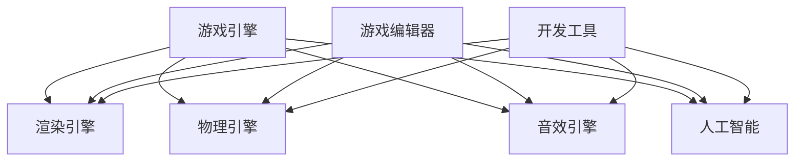

                 

关键词：游戏开发框架、游戏引擎、游戏编程、Unity、Unreal Engine、性能优化、跨平台、开发流程、工具链、模块化设计、游戏架构

> 摘要：本文深入探讨了游戏开发框架的选择与应用，重点分析了当前主流的游戏引擎Unity和Unreal Engine的特点、优缺点以及适用场景。通过对比分析，为开发者提供了有针对性的建议，帮助他们根据项目需求选择合适的游戏开发框架。

## 1. 背景介绍

随着游戏产业的蓬勃发展，游戏开发技术也在不断创新和进步。游戏开发框架作为游戏开发过程中的核心组成部分，极大地影响了游戏开发的效率和质量。游戏开发框架提供了丰富的功能和模块，使得开发者能够专注于游戏内容的创作，而无需从头开始编写底层代码。

游戏开发框架可以分为以下几类：

- **游戏引擎**：如Unity和Unreal Engine，提供了一整套的游戏开发环境，包括渲染、物理、音效、网络等功能。
- **游戏编辑器**：如Godot和Blender，专注于游戏世界的构建和场景设计。
- **游戏工具**：如Visual Studio和Xcode，提供了游戏开发所需的IDE和开发工具。

本文将重点关注游戏引擎的选择与应用，特别是Unity和Unreal Engine这两个目前最为流行的游戏引擎。

### 1.1 Unity

Unity是一家成立于2004年的公司，其Unity游戏引擎是当前最广泛使用的游戏开发框架之一。Unity以其跨平台能力、易用性和强大的社区支持而著称。Unity适合小型团队和独立开发者，同时也被许多大型游戏公司所采用。

### 1.2 Unreal Engine

Unreal Engine由Epic Games开发，自从2002年首次亮相以来，一直以其强大的视觉效果和高效的渲染技术闻名于世。Unreal Engine适合大型项目和高性能游戏开发，尤其适合需要高质量图形和复杂物理模拟的游戏。

## 2. 核心概念与联系

### 2.1 游戏引擎的基本概念

游戏引擎是一种软件框架，提供了一套通用的工具和模块，用于创建和管理游戏中的各种元素，包括场景、角色、动画、物理和人工智能等。游戏引擎的核心功能包括：

- **渲染引擎**：负责处理图形渲染，实现3D模型和场景的渲染。
- **物理引擎**：负责处理游戏中的物理现象，如碰撞检测、重力等。
- **音效引擎**：负责处理游戏中的音效，包括音乐和声音效果。
- **人工智能**：负责游戏中的角色行为和决策。

### 2.2 游戏引擎的工作流程

游戏引擎的工作流程通常包括以下几个步骤：

1. **设计阶段**：在这个阶段，开发者会使用游戏引擎的编辑器设计游戏世界，包括场景布局、角色建模和动画等。
2. **开发阶段**：开发者会编写游戏代码，实现游戏逻辑、交互和用户界面。
3. **测试阶段**：在这个阶段，开发者会进行游戏测试，修复bug并优化性能。
4. **发布阶段**：游戏经过测试后，会被发布到不同的平台上。

### 2.3 Unity与Unreal Engine的对比

Unity和Unreal Engine在功能、性能和适用场景上都有显著的差异，下面是两者的对比：

| 特点       | Unity                         | Unreal Engine                   |
| ---------- | ---------------------------- | ------------------------------ |
| **跨平台能力** | 强大，支持多种平台           | 非常强大，尤其擅长高性能游戏   |
| **易用性**   | 易于上手，适合初学者         | 较为复杂，但功能强大           |
| **性能**     | 中等，但优化空间较大         | 极佳，特别适合高图形质量游戏   |
| **视觉效果** | 良好，但不及Unreal Engine    | 极佳，以其高质量的渲染著称     |
| **社区支持** | 强大，有庞大的社区和资源     | 强大，尤其是通过Epic Games Store支持 |
| **适用场景** | 小型团队、独立开发者、移动端游戏 | 大型游戏、复杂模拟和视觉效果要求高的游戏 |

### 2.4 Mermaid 流程图



## 3. 核心算法原理 & 具体操作步骤

### 3.1 算法原理概述

游戏开发框架中的核心算法通常包括渲染算法、物理算法、音效算法和人工智能算法等。这些算法共同工作，实现游戏的实时渲染、物理交互、音效处理和角色行为。

### 3.2 算法步骤详解

1. **渲染算法**：渲染算法负责将3D场景转换为2D图像。其基本步骤包括：
   - **几何转换**：将3D模型转换为屏幕上的2D坐标。
   - **光照计算**：计算模型表面的光照效果。
   - **纹理映射**：将纹理应用到模型表面。
   - **渲染排序**：根据透明度对物体进行排序并渲染。

2. **物理算法**：物理算法负责处理游戏中的物理现象。其基本步骤包括：
   - **碰撞检测**：检测物体之间的碰撞。
   - **运动计算**：计算物体的运动轨迹。
   - **物理模拟**：模拟物体之间的相互作用。

3. **音效算法**：音效算法负责处理游戏中的音效。其基本步骤包括：
   - **音频播放**：播放音频文件。
   - **音效处理**：对音效进行混音、淡入淡出等处理。
   - **音效反馈**：根据游戏状态调整音效。

4. **人工智能算法**：人工智能算法负责处理游戏中的角色行为。其基本步骤包括：
   - **决策树**：根据当前状态选择最佳行动。
   - **路径规划**：计算角色移动的路径。
   - **学习算法**：让角色根据经验改进行为。

### 3.3 算法优缺点

- **渲染算法**：
  - 优点：实时渲染，提供丰富的视觉效果。
  - 缺点：计算量大，可能影响性能。

- **物理算法**：
  - 优点：准确模拟物理现象，提高游戏的真实感。
  - 缺点：计算复杂，可能影响性能。

- **音效算法**：
  - 优点：增强游戏的沉浸感。
  - 缺点：音效处理复杂，可能影响性能。

- **人工智能算法**：
  - 优点：让游戏更具挑战性和趣味性。
  - 缺点：算法复杂，可能影响性能。

### 3.4 算法应用领域

- **渲染算法**：广泛应用于各类游戏，特别是追求高质量视觉效果的3D游戏。
- **物理算法**：适用于需要物理模拟的游戏，如赛车、动作和冒险游戏。
- **音效算法**：适用于所有需要音效的游戏，特别是追求高度沉浸感的游戏。
- **人工智能算法**：适用于所有需要智能行为的游戏，如角色扮演、策略和模拟游戏。

## 4. 数学模型和公式 & 详细讲解 & 举例说明

### 4.1 数学模型构建

在游戏开发中，数学模型广泛应用于物理模拟、渲染计算和人工智能算法。以下是一个简单的物理模型——牛顿运动定律的数学模型。

### 4.2 公式推导过程

牛顿运动定律描述了物体受力后的运动状态，其基本公式为：

$$
F = m \cdot a
$$

其中，\( F \) 表示力，\( m \) 表示质量，\( a \) 表示加速度。

### 4.3 案例分析与讲解

假设一个质量为\( m = 5 \)千克的物体受到\( F = 10 \)牛顿的力作用，根据牛顿第二定律，可以计算出物体的加速度：

$$
a = \frac{F}{m} = \frac{10}{5} = 2 \text{ m/s}^2
$$

假设物体初始速度为0，经过1秒后，物体的速度可以计算为：

$$
v = a \cdot t = 2 \text{ m/s}^2 \cdot 1 \text{ s} = 2 \text{ m/s}
$$

## 5. 项目实践：代码实例和详细解释说明

### 5.1 开发环境搭建

在开始项目实践之前，我们需要搭建合适的开发环境。以下是Unity和Unreal Engine的开发环境搭建步骤：

#### Unity开发环境搭建

1. 访问Unity官网（https://unity.com/），下载并安装Unity Hub。
2. 打开Unity Hub，创建一个新的Unity项目。
3. 安装必要的插件和工具，如Unity Collaborate和Unity Ads。

#### Unreal Engine开发环境搭建

1. 访问Epic Games官网（https://www.unrealengine.com/），注册并登录账号。
2. 下载并安装Unreal Engine。
3. 打开Unreal Engine，创建一个新的项目。

### 5.2 源代码详细实现

以下是一个简单的Unity项目实例，实现了一个简单的2D游戏，包括角色移动和碰撞检测。

```csharp
using UnityEngine;

public class PlayerController : MonoBehaviour
{
    public float speed = 5.0f;

    private Rigidbody2D rb;

    void Start()
    {
        rb = GetComponent<Rigidbody2D>();
    }

    void Update()
    {
        float moveX = Input.GetAxis("Horizontal");
        float moveY = Input.GetAxis("Vertical");

        Vector2 moveDirection = new Vector2(moveX, moveY);
        rb.AddForce(moveDirection * speed);
    }

    void OnCollisionEnter2D(Collision2D collision)
    {
        if (collision.gameObject.CompareTag("Ground"))
        {
            // 触地逻辑
        }
    }
}
```

### 5.3 代码解读与分析

这段代码实现了角色的移动和碰撞检测。`PlayerController` 脚本通过 `Update` 方法监听用户的输入，并根据输入更新角色的移动方向。`OnCollisionEnter2D` 方法在角色与地砖碰撞时触发，实现触地逻辑。

### 5.4 运行结果展示

运行该项目后，玩家可以通过键盘控制角色在2D世界中移动，并实现与地砖的碰撞检测。

## 6. 实际应用场景

### 6.1 移动游戏开发

Unity和Unreal Engine都非常适合移动游戏开发。Unity因其强大的跨平台能力和丰富的社区资源而受到独立开发者的青睐。而Unreal Engine则以其高质量的图形和渲染技术，被广泛应用于需要高性能图形的移动游戏。

### 6.2 大型网络游戏开发

Unreal Engine在大型网络游戏开发中具有显著优势，特别是在需要复杂物理模拟和高性能渲染的场景中。Unity则因其强大的社区支持和易于上手的特性，适合小型团队和独立开发者进行网络游戏开发。

### 6.3 VR/AR游戏开发

Unity和Unreal Engine都支持VR/AR游戏开发。Unity因其跨平台能力和强大的社区支持，被广泛应用于VR/AR游戏开发。而Unreal Engine则因其高质量的图形和渲染技术，特别适合需要高性能VR/AR游戏开发。

## 6.4 未来应用展望

随着游戏技术的不断进步，游戏开发框架的应用前景将更加广阔。未来，游戏开发框架将朝着以下方向发展：

- **更高效的渲染技术**：采用新的渲染技术，如光线追踪，提高游戏画面质量。
- **更智能的人工智能算法**：通过深度学习和强化学习，提升游戏角色的智能程度。
- **更强大的物理引擎**：实现更真实的物理模拟，提高游戏的真实感。
- **更丰富的跨平台支持**：支持更多平台，如物联网设备、智能手表等。

## 7. 工具和资源推荐

### 7.1 学习资源推荐

- **Unity官方文档**：https://docs.unity3d.com/
- **Unreal Engine官方文档**：https://docs.unrealengine.com/
- **游戏编程入门教程**：https://gameprogrammingpatterns.com/

### 7.2 开发工具推荐

- **Visual Studio**：https://visualstudio.microsoft.com/
- **Xcode**：https://developer.apple.com/xcode/
- **Unity Hub**：https://unity.com/unity-hub
- **Unreal Engine Launcher**：https://www.unrealengine.com/unreal-engine

### 7.3 相关论文推荐

- **"Real-Time Rendering"** by Tomas Akenine-Möller, Eric Haines, and Naty Hoffman
- **"Game Engine Architecture"** by Jason Gregory
- **"The Art of Game Design: A Book of Lenses"** by Jesse Schell

## 8. 总结：未来发展趋势与挑战

### 8.1 研究成果总结

本文通过对Unity和Unreal Engine的深入分析，总结了两者在游戏开发中的特点、优缺点和适用场景。同时，介绍了游戏开发框架的基本概念、算法原理、数学模型和实际应用场景。

### 8.2 未来发展趋势

- **更高效的渲染技术**：光线追踪等新技术将在游戏开发中得到广泛应用。
- **更智能的人工智能算法**：深度学习和强化学习将提升游戏角色的智能程度。
- **更强大的物理引擎**：实现更真实的物理模拟，提高游戏的真实感。
- **更丰富的跨平台支持**：支持更多平台，如物联网设备、智能手表等。

### 8.3 面临的挑战

- **性能优化**：如何在保证高质量图形和流畅运行之间找到平衡。
- **人工智能算法**：如何设计出既智能又高效的算法，提高游戏体验。
- **跨平台兼容性**：如何在不同平台上实现一致的游戏体验。

### 8.4 研究展望

未来的研究将在更高效的渲染技术、更智能的人工智能算法和更强大的物理引擎方面展开。同时，如何解决跨平台兼容性和性能优化问题将是研究的重点。

## 9. 附录：常见问题与解答

### 9.1 Unity和Unreal Engine哪个更适合初学者？

Unity更适合初学者，因为它具有更友好的用户界面和丰富的社区资源。

### 9.2 如何在Unity中实现路径规划？

在Unity中，可以使用A*算法或Dijkstra算法实现路径规划。Unity Asset Store中也有许多现成的路径规划插件。

### 9.3 Unreal Engine支持跨平台吗？

是的，Unreal Engine支持跨平台开发，包括Windows、Mac、iOS、Android等。

### 9.4 如何在Unity中实现碰撞检测？

在Unity中，可以使用Rigidbody组件和Collider组件实现碰撞检测。通过触发器（Trigger）和碰撞体（Collider）可以检测到物体之间的碰撞。

作者：禅与计算机程序设计艺术 / Zen and the Art of Computer Programming

----------------------------------------------------------------

以上便是本文的完整内容，希望对您在游戏开发框架选择与应用方面有所启发。如果您有任何问题或建议，欢迎在评论区留言。谢谢！

