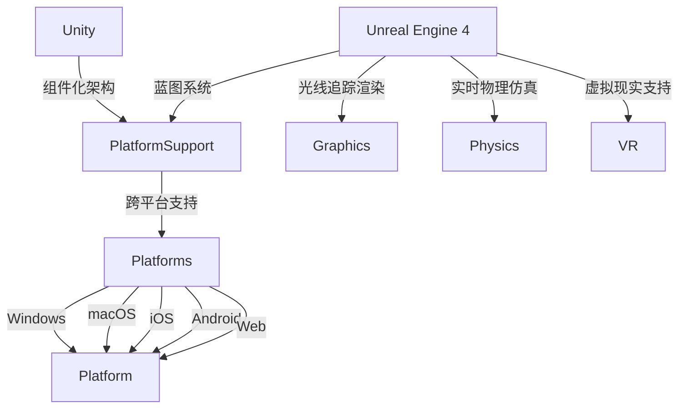
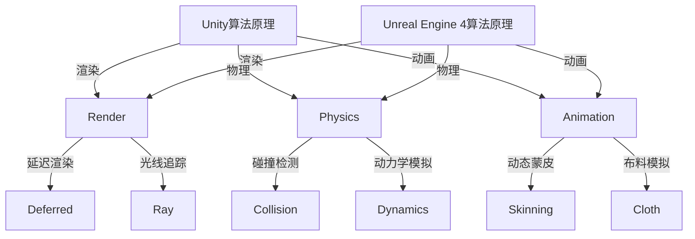

                 

关键词：游戏框架，Unity，Unreal Engine 4，游戏开发，渲染引擎，游戏引擎架构，图形渲染技术，实时物理仿真

> 摘要：本文将探讨当前游戏开发领域中最具影响力的两个游戏框架——Unity和Unreal Engine 4的发展历程、核心概念、架构特点以及在实际应用中的表现。通过对两者的深入分析，我们希望能够为读者提供一个全面且深入的技术视角，帮助大家更好地理解和应用这两个框架。

## 1. 背景介绍

游戏开发是一个不断演变和进步的领域。从早期的简单2D游戏到现代的复杂3D游戏，技术的进步和开发工具的完善都起到了至关重要的作用。Unity和Unreal Engine 4作为当今最流行的游戏开发框架，它们的诞生和发展都标志着游戏开发技术的一次重大飞跃。

Unity是由Unity Technologies开发的一款跨平台游戏开发引擎，最初发布于2005年。它以其易用性和强大的跨平台支持迅速获得了广泛认可。Unity的目标是让游戏开发变得更加简单和高效，使得开发者能够快速地将创意转化为实际的游戏产品。

Unreal Engine 4（UE4）是由Epic Games开发的一款先进的游戏开发引擎，首次发布于2014年。UE4以其出色的图形渲染能力和强大的实时物理仿真功能而闻名。它的前身Unreal Engine 3已经广泛应用于多个大型游戏项目，而UE4则进一步提升了性能和功能，成为了游戏开发领域的一股强大力量。

本文将主要从以下几个方面对Unity和UE4进行深入分析：

- 核心概念与联系
- 核心算法原理与具体操作步骤
- 数学模型和公式及其应用
- 项目实践：代码实例和详细解释
- 实际应用场景与未来展望
- 工具和资源推荐
- 总结：未来发展趋势与挑战

通过对这些方面的详细探讨，我们将为读者提供一个全面的技术视角，帮助大家更好地理解和应用这两个框架。

## 2. 核心概念与联系

在深入探讨Unity和UE4之前，我们需要了解它们的一些核心概念和架构特点。这两个框架虽然在功能和应用领域上有许多相似之处，但也各有其独特的特点和优势。

### Unity的核心概念

Unity的核心概念包括以下几个方面：

- **组件化架构**：Unity采用组件化架构，将游戏对象分解为各种组件，如Transform（位置和旋转）、Renderer（渲染器）、Collider（碰撞体）等。这种架构使得开发者能够更灵活地管理和操作游戏对象。
- **跨平台支持**：Unity支持多种平台，包括Windows、macOS、iOS、Android、Web等，这使得开发者能够轻松地将游戏部署到不同的设备上。
- **脚本系统**：Unity使用C#作为脚本语言，这使得开发者能够利用强大的面向对象编程特性来编写游戏逻辑。
- **资产管理系统**：Unity提供了强大的资产管理系统，可以方便地管理和使用各种游戏资源，如纹理、模型、音频等。

### Unreal Engine 4的核心概念

Unreal Engine 4的核心概念包括以下几个方面：

- **蓝图系统**：UE4引入了蓝图系统，它是一种可视化的编程工具，允许开发者通过节点图来构建游戏逻辑，而无需编写代码。这种系统大大降低了入门门槛，使得非程序员也能参与到游戏开发中来。
- **光线追踪渲染**：UE4引入了基于光线追踪的渲染技术，能够生成更加逼真的图像效果，这使得游戏画面更加惊艳。
- **实时物理仿真**：UE4提供了强大的物理引擎，支持各种物理现象的模拟，如碰撞、动力学、流体等，这使得游戏中的物理交互更加真实。
- **虚拟现实支持**：UE4原生支持虚拟现实（VR）技术，使得开发者能够轻松地创建和部署VR游戏。

### 核心概念的联系

Unity和UE4在核心概念上有着很多相似之处，例如都采用了组件化架构和跨平台支持。但它们也存在一些明显的区别，如Unity侧重于易用性和跨平台支持，而UE4则更注重图形渲染性能和实时物理仿真。

为了更直观地展示Unity和UE4的核心概念和架构，我们可以使用Mermaid流程图来绘制一个简化的架构图：



通过这个Mermaid流程图，我们可以清晰地看到Unity和UE4的核心概念和架构特点，以及它们之间的联系。

### 2.1 Unity的核心概念

Unity的核心概念包括以下几个方面：

- **组件化架构**：Unity采用组件化架构，将游戏对象分解为各种组件，如Transform（位置和旋转）、Renderer（渲染器）、Collider（碰撞体）等。这种架构使得开发者能够更灵活地管理和操作游戏对象。

- **跨平台支持**：Unity支持多种平台，包括Windows、macOS、iOS、Android、Web等，这使得开发者能够轻松地将游戏部署到不同的设备上。

- **脚本系统**：Unity使用C#作为脚本语言，这使得开发者能够利用强大的面向对象编程特性来编写游戏逻辑。

- **资产管理系统**：Unity提供了强大的资产管理系统，可以方便地管理和使用各种游戏资源，如纹理、模型、音频等。

### 2.2 Unreal Engine 4的核心概念

Unreal Engine 4的核心概念包括以下几个方面：

- **蓝图系统**：UE4引入了蓝图系统，它是一种可视化的编程工具，允许开发者通过节点图来构建游戏逻辑，而无需编写代码。这种系统大大降低了入门门槛，使得非程序员也能参与到游戏开发中来。

- **光线追踪渲染**：UE4引入了基于光线追踪的渲染技术，能够生成更加逼真的图像效果，这使得游戏画面更加惊艳。

- **实时物理仿真**：UE4提供了强大的物理引擎，支持各种物理现象的模拟，如碰撞、动力学、流体等，这使得游戏中的物理交互更加真实。

- **虚拟现实支持**：UE4原生支持虚拟现实（VR）技术，使得开发者能够轻松地创建和部署VR游戏。

### 2.3 核心概念的联系

Unity和UE4在核心概念上有着很多相似之处，例如都采用了组件化架构和跨平台支持。但它们也存在一些明显的区别，如Unity侧重于易用性和跨平台支持，而UE4则更注重图形渲染性能和实时物理仿真。

为了更直观地展示Unity和UE4的核心概念和架构，我们可以使用Mermaid流程图来绘制一个简化的架构图：


通过这个Mermaid流程图，我们可以清晰地看到Unity和UE4的核心概念和架构特点，以及它们之间的联系。

## 3. 核心算法原理与具体操作步骤

### 3.1 Unity的核心算法原理

Unity作为一个功能强大的游戏引擎，其核心算法涵盖了渲染、物理、动画等多个方面。以下是一些关键的算法原理：

#### 渲染

Unity的渲染引擎基于GPU（图形处理器）加速，使用的是延迟渲染（Deferred Rendering）技术。这种技术将渲染过程分为三个阶段：光照计算、几何处理和纹理处理。

- **光照计算**：在这个阶段，渲染引擎首先计算场景中每个物体的光照效果，包括直接光照和间接光照。Unity使用的是Blinn-Phong模型来计算光照。
- **几何处理**：在光照计算完成后，渲染引擎处理几何信息，包括裁剪、投影和视图变换。这个过程确保了最终渲染的图像符合摄像机的视角。
- **纹理处理**：最后，渲染引擎应用材质和纹理，为每个像素添加细节和颜色。Unity支持各种纹理技术，如贴图、凹凸贴图和反射贴图。

#### 物理

Unity的物理引擎基于碰撞检测和动力学模拟。以下是物理引擎的关键算法原理：

- **碰撞检测**：Unity使用AABB（轴对齐包围盒）和OBB（定向包围盒）进行碰撞检测。当两个物体的AABB或OBB相交时，认为它们发生了碰撞。
- **动力学模拟**：Unity的物理引擎基于刚体动力学（Rigidbody）和碰撞体（Collider）来模拟物体的运动。使用Euler方法和Verlet积分来更新物体的位置和速度。

#### 动画

Unity的动画系统基于关节动画（Bone Animation）和蒙皮（Skinning）技术。以下是动画系统的关键算法原理：

- **关节动画**：关节动画通过变换关节的位置和旋转来驱动模型。Unity使用四元数来表示旋转，以避免旋转矩阵的奇点问题。
- **蒙皮**：蒙皮技术将模型的顶点绑定到骨骼上，当骨骼运动时，顶点随之变形。Unity使用线性混合（Linear Blend）来计算顶点的最终位置。

### 3.2 Unreal Engine 4的核心算法原理

Unreal Engine 4作为一款高性能的游戏引擎，其核心算法同样涵盖了渲染、物理、动画等多个方面。以下是UE4的关键算法原理：

#### 渲染

UE4的渲染引擎采用了光子追踪（Photon Tracing）技术，这是基于光线追踪的一种高级渲染技术。以下是渲染引擎的关键算法原理：

- **光线追踪**：UE4使用光线追踪来模拟真实世界中的光线传播，包括反射、折射和散射。这种技术可以生成非常逼真的图像效果。
- **实时渲染**：UE4在实时渲染中使用了延迟渲染（Deferred Rendering）和光子映射（Photon Mapping）技术，以提高渲染性能。
- **全局光照**：UE4实现了基于路径追踪的全局光照模型，可以模拟复杂的光照交互和阴影效果。

#### 物理

UE4的物理引擎同样强大，支持各种物理现象的模拟。以下是物理引擎的关键算法原理：

- **碰撞检测**：UE4使用AABB和OBB进行碰撞检测，同时还支持基于距离的碰撞检测，以提高性能。
- **动力学模拟**：UE4的物理引擎基于刚体动力学和软体动力学（Soft Body Dynamics），可以模拟复杂的物理现象，如爆炸、破碎等。
- **布料模拟**：UE4的布料模拟基于粒子系统，可以模拟衣物的折叠、滑动和摆动。

#### 动画

UE4的动画系统采用了动态蒙皮（Dynamic Skinning）和布料模拟（Cloth Simulation）技术。以下是动画系统的关键算法原理：

- **动态蒙皮**：动态蒙皮技术将模型的顶点绑定到骨骼上，当骨骼运动时，顶点根据骨骼的变换进行实时计算。
- **布料模拟**：UE4的布料模拟基于有限元方法（Finite Element Method），可以模拟衣物的折叠、滑动和摆动。

### 3.3 Unity与UE4的算法原理比较

Unity和UE4在算法原理上有许多相似之处，但它们也存在一些明显的区别：

- **渲染**：Unity主要采用延迟渲染技术，而UE4则引入了光线追踪和光子映射技术，以生成更逼真的图像效果。
- **物理**：Unity和UE4都支持碰撞检测和动力学模拟，但UE4的物理引擎更强大，可以模拟复杂的物理现象。
- **动画**：Unity和UE4都采用了动态蒙皮技术，但UE4还引入了布料模拟，可以更真实地模拟衣物的运动。

为了更直观地展示Unity和UE4的算法原理，我们可以使用Mermaid流程图来绘制一个简化的算法流程图：



通过这个Mermaid流程图，我们可以清晰地看到Unity和UE4的算法原理及其区别。

### 3.1 Unity的核心算法原理

Unity的核心算法涵盖了渲染、物理和动画等方面，以下是一些关键的算法原理：

#### 渲染

Unity的渲染引擎基于GPU加速，采用延迟渲染（Deferred Rendering）技术。以下是渲染算法的原理和具体步骤：

- **延迟渲染**：延迟渲染将渲染过程分为三个主要阶段：光照计算、几何处理和纹理处理。这种技术可以优化渲染性能，提高渲染效率。

    - **光照计算**：在光照计算阶段，渲染引擎首先计算场景中每个物体的光照效果，包括直接光照和间接光照。Unity使用Blinn-Phong模型来计算光照，并考虑各种光照衰减和反射效果。

    - **几何处理**：在几何处理阶段，渲染引擎处理几何信息，包括裁剪、投影和视图变换。这个过程确保了最终渲染的图像符合摄像机的视角。

    - **纹理处理**：在纹理处理阶段，渲染引擎应用材质和纹理，为每个像素添加细节和颜色。Unity支持各种纹理技术，如贴图、凹凸贴图和反射贴图，以增强场景的真实感。

#### 物理

Unity的物理引擎主要基于碰撞检测和动力学模拟。以下是物理算法的原理和具体步骤：

- **碰撞检测**：Unity使用AABB和OBB进行碰撞检测，当两个物体的AABB或OBB相交时，认为它们发生了碰撞。碰撞检测是游戏物理模拟的重要部分，它有助于控制物体的运动和交互。

    - **AABB（轴对齐包围盒）**：AABB是一个立方体形状的包围盒，它的边界与坐标轴对齐。通过比较物体的AABB，可以快速判断两个物体是否碰撞。

    - **OBB（定向包围盒）**：OBB是一个长方体形状的包围盒，它的边界不与坐标轴对齐。OBB可以更好地适应物体的形状，提供更准确的碰撞检测。

- **动力学模拟**：Unity的物理引擎基于刚体动力学和碰撞体（Collider）来模拟物体的运动。使用Euler方法和Verlet积分来更新物体的位置和速度。

    - **Euler方法**：Euler方法是一种简单的数值积分方法，用于计算物体的运动。它通过迭代计算物体的位置和速度，逐步更新物体的状态。

    - **Verlet积分**：Verlet积分是一种更高效和稳定的数值积分方法，它通过计算两个连续时间步的差值来更新物体的位置和速度。这种方法可以更好地处理物体的运动和碰撞。

#### 动画

Unity的动画系统基于关节动画（Bone Animation）和蒙皮（Skinning）技术。以下是动画算法的原理和具体步骤：

- **关节动画**：关节动画通过变换关节的位置和旋转来驱动模型。Unity使用四元数来表示旋转，以避免旋转矩阵的奇点问题。

    - **关节**：关节是连接模型的各个部分的结构，通过变换关节的位置和旋转，可以控制模型的整体运动。

    - **四元数**：四元数是一种用于表示旋转的数学结构，它比旋转矩阵更简洁，可以避免奇点问题。Unity使用四元数来计算关节的旋转，以提高动画的精度和稳定性。

- **蒙皮**：蒙皮技术将模型的顶点绑定到骨骼上，当骨骼运动时，顶点根据骨骼的变换进行实时计算。

    - **顶点绑定**：顶点绑定是将模型的顶点与骨骼关联起来，以便在骨骼运动时更新顶点的位置。

    - **线性混合**：线性混合是一种计算顶点最终位置的方法，它根据骨骼的变换和权重，计算顶点在各个骨骼上的位置，并线性混合得到最终的顶点位置。

### 3.2 Unreal Engine 4的核心算法原理

Unreal Engine 4作为一款高性能的游戏引擎，其核心算法涵盖了渲染、物理和动画等方面。以下是UE4的一些关键算法原理：

#### 渲染

UE4的渲染引擎采用了光子追踪（Photon Tracing）技术，这是一种基于光线追踪的高级渲染技术。以下是渲染算法的原理和具体步骤：

- **光线追踪**：光线追踪通过模拟真实世界中光线的传播来生成图像。在UE4中，光线追踪可以模拟反射、折射和散射等效果，从而生成更加逼真的图像。

    - **反射**：反射是光线遇到物体表面时反弹的现象。UE4通过计算光线与物体表面的交点，模拟光线的反射，生成反射图像。

    - **折射**：折射是光线从一种介质进入另一种介质时改变方向的现象。UE4通过计算光线与介质的交点，模拟光线的折射，生成折射图像。

    - **散射**：散射是光线在空气中传播时与空气分子相互作用的现象。UE4通过模拟光线与空气分子的散射，生成散射图像。

- **实时渲染**：UE4在实时渲染中使用了延迟渲染（Deferred Rendering）和光子映射（Photon Mapping）技术，以提高渲染性能。

    - **延迟渲染**：延迟渲染将渲染过程分为光照计算、几何处理和纹理处理三个阶段。这种技术可以优化渲染性能，提高渲染效率。

    - **光子映射**：光子映射是一种用于模拟全局光照的技术，它可以计算光线在场景中的传播和反射，生成全局光照效果。

#### 物理

UE4的物理引擎支持各种物理现象的模拟，包括碰撞检测、动力学模拟和布料模拟等。以下是物理算法的原理和具体步骤：

- **碰撞检测**：UE4使用AABB和OBB进行碰撞检测，当两个物体的AABB或OBB相交时，认为它们发生了碰撞。UE4还支持基于距离的碰撞检测，以提高性能。

    - **AABB（轴对齐包围盒）**：AABB是一个立方体形状的包围盒，它的边界与坐标轴对齐。通过比较物体的AABB，可以快速判断两个物体是否碰撞。

    - **OBB（定向包围盒）**：OBB是一个长方体形状的包围盒，它的边界不与坐标轴对齐。OBB可以更好地适应物体的形状，提供更准确的碰撞检测。

    - **基于距离的碰撞检测**：基于距离的碰撞检测通过计算两个物体之间的距离，判断它们是否碰撞。这种方法可以减少碰撞检测的复杂度，提高性能。

- **动力学模拟**：UE4的物理引擎基于刚体动力学和软体动力学，可以模拟复杂的物理现象。

    - **刚体动力学**：刚体动力学用于模拟刚体的运动。UE4通过计算刚体的受力，更新刚体的位置和速度。

    - **软体动力学**：软体动力学用于模拟软体的变形和运动。UE4使用有限元方法（Finite Element Method）来模拟软体的变形和运动。

- **布料模拟**：UE4的布料模拟基于有限元方法，可以模拟衣物的折叠、滑动和摆动。

    - **有限元方法**：有限元方法将布料划分为许多小的单元，每个单元都有自己的物理属性。通过计算单元之间的相互作用，模拟布料的变形和运动。

#### 动画

UE4的动画系统采用了动态蒙皮（Dynamic Skinning）和布料模拟（Cloth Simulation）技术。以下是动画算法的原理和具体步骤：

- **动态蒙皮**：动态蒙皮技术将模型的顶点绑定到骨骼上，当骨骼运动时，顶点根据骨骼的变换进行实时计算。

    - **顶点绑定**：顶点绑定是将模型的顶点与骨骼关联起来，以便在骨骼运动时更新顶点的位置。

    - **线性混合**：线性混合是一种计算顶点最终位置的方法，它根据骨骼的变换和权重，计算顶点在各个骨骼上的位置，并线性混合得到最终的顶点位置。

- **布料模拟**：UE4的布料模拟基于有限元方法，可以模拟衣物的折叠、滑动和摆动。

    - **折叠**：折叠是衣物在运动中形成的弯曲和折叠。UE4通过模拟衣物单元之间的相互作用，生成折叠效果。

    - **滑动**：滑动是衣物在运动中沿表面移动的现象。UE4通过计算衣物单元的速度和方向，模拟滑动效果。

    - **摆动**：摆动是衣物在受到外力作用时的摆动和震动。UE4通过模拟衣物单元的受力，生成摆动效果。

### 3.3 Unity与UE4的算法原理比较

Unity和UE4在算法原理上有许多相似之处，但它们也存在一些明显的区别：

- **渲染**：Unity主要采用延迟渲染技术，而UE4则引入了光线追踪和光子映射技术，以生成更逼真的图像效果。UE4的光线追踪功能更强大，可以模拟复杂的反射、折射和散射效果。

- **物理**：Unity和UE4都支持碰撞检测和动力学模拟，但UE4的物理引擎更强大，可以模拟复杂的物理现象，如软体动力学和布料模拟。

- **动画**：Unity和UE4都采用了动态蒙皮技术，但UE4还引入了布料模拟，可以更真实地模拟衣物的运动。

为了更直观地展示Unity和UE4的算法原理，我们可以使用Mermaid流程图来绘制一个简化的算法流程图：


通过这个Mermaid流程图，我们可以清晰地看到Unity和UE4的算法原理及其区别。

## 4. 数学模型和公式 & 详细讲解 & 举例说明

### 4.1 数学模型构建

在游戏开发中，数学模型是核心部分之一。它不仅用于渲染和物理模拟，还用于动画、人工智能等方面。以下是一些常用的数学模型和公式的构建过程：

#### 渲染

1. **透视变换**：

    透视变换是渲染过程中重要的步骤，它将3D场景投影到2D屏幕上。透视变换的公式如下：

    $$ x' = \frac{x}{z} $$
    $$ y' = \frac{y}{z} $$

    其中，\( x, y, z \) 是3D空间中的坐标，\( x', y' \) 是2D屏幕上的坐标。

2. **Blinn-Phong光照模型**：

    Blinn-Phong光照模型是渲染中常用的光照模型，用于计算物体表面的光照效果。它的公式如下：

    $$ L_{light} = I_{light} \cdot (N \cdot L) $$
    $$ L_{spec} = I_{spec} \cdot (N \cdot V)^2 $$
    $$ L_{total} = L_{light} + L_{spec} $$

    其中，\( L_{light} \) 是光照效果，\( I_{light} \) 是光源强度，\( N \) 是法线向量，\( L \) 是光线方向向量，\( V \) 是视点方向向量。

3. **光线追踪**：

    光线追踪是一种基于光线传播的渲染技术，用于生成高度逼真的图像。它的公式如下：

    $$ R(t) = R(t_0) + t \cdot D $$
    $$ t_{min} = \frac{Q^T Q - R(t_0)^2}{2 \cdot R(t_0) \cdot D} $$

    其中，\( R(t) \) 是光线在时间 \( t \) 的位置，\( R(t_0) \) 是光线在时间 \( t_0 \) 的位置，\( D \) 是光线的方向，\( Q \) 是物体表面的方程。

#### 物理

1. **碰撞检测**：

    碰撞检测是物理模拟的重要部分，用于判断两个物体是否发生碰撞。以下是一个简单的碰撞检测公式：

    $$ |A - B| \leq r_A + r_B $$
    其中，\( A, B \) 是两个物体的位置，\( r_A, r_B \) 是两个物体的半径。

2. **动力学模拟**：

    动力学模拟用于计算物体的运动，以下是一个简单的动力学模拟公式：

    $$ v = u + at $$
    $$ s = u t + \frac{1}{2} a t^2 $$

    其中，\( v \) 是最终速度，\( u \) 是初始速度，\( a \) 是加速度，\( t \) 是时间。

3. **刚体动力学**：

    刚体动力学用于计算刚体的运动，以下是一个简单的刚体动力学公式：

    $$ F = m a $$
    $$ \tau = I \alpha $$

    其中，\( F \) 是力，\( m \) 是质量，\( a \) 是加速度，\( \tau \) 是扭矩，\( I \) 是惯性矩，\( \alpha \) 是角加速度。

### 4.2 公式推导过程

以下是对上述部分公式的推导过程：

#### 透视变换

透视变换的推导基于投影原理。假设有一个点 \( P(x, y, z) \) 在3D空间中，投影到2D屏幕上的坐标为 \( P'(x', y') \)。根据投影原理，可以得到以下关系：

$$ x' = \frac{x}{z} $$
$$ y' = \frac{y}{z} $$

这里，\( x, y, z \) 是3D空间中的坐标，\( x', y' \) 是2D屏幕上的坐标。

#### Blinn-Phong光照模型

Blinn-Phong光照模型的推导基于几何光学原理。首先，我们需要计算光源对物体的光照效果。光照效果由两部分组成：直接光照和间接光照。

直接光照 \( L_{light} \) 可以通过以下公式计算：

$$ L_{light} = I_{light} \cdot (N \cdot L) $$

其中，\( I_{light} \) 是光源强度，\( N \) 是法线向量，\( L \) 是光线方向向量。

间接光照 \( L_{spec} \) 是由直接光照反射到其他物体上的光照效果。它的计算公式为：

$$ L_{spec} = I_{spec} \cdot (N \cdot V)^2 $$

其中，\( I_{spec} \) 是反射光强度，\( N \) 是法线向量，\( V \) 是视点方向向量。

最终的光照效果 \( L_{total} \) 是直接光照和间接光照的总和：

$$ L_{total} = L_{light} + L_{spec} $$

#### 光线追踪

光线追踪的推导基于物理光学原理。光线在传播过程中与物体发生碰撞，我们需要计算光线的传播路径。

假设光线在时间 \( t \) 的位置为 \( R(t) \)，在时间 \( t_0 \) 的位置为 \( R(t_0) \)，方向为 \( D \)。根据物理光学原理，光线传播的公式为：

$$ R(t) = R(t_0) + t \cdot D $$

为了计算光线与物体的碰撞时间，我们需要找到光线与物体表面的交点。假设物体表面的方程为 \( Q \)，光线与物体表面的交点满足以下方程：

$$ Q^T Q - R(t_0)^2 = 2 \cdot R(t_0) \cdot D \cdot t $$

通过求解上述方程，我们可以得到光线与物体表面的碰撞时间 \( t_{min} \)：

$$ t_{min} = \frac{Q^T Q - R(t_0)^2}{2 \cdot R(t_0) \cdot D} $$

### 4.3 案例分析与讲解

为了更好地理解上述数学模型和公式，我们通过一个简单的案例进行分析和讲解。

#### 案例：碰撞检测

假设有两个物体，物体A的位置为 \( A(1, 2, 3) \)，半径为 \( r_A = 1 \)；物体B的位置为 \( B(4, 5, 6) \)，半径为 \( r_B = 2 \)。我们需要判断这两个物体是否发生碰撞。

根据碰撞检测的公式：

$$ |A - B| \leq r_A + r_B $$

我们可以计算两个物体之间的距离：

$$ |A - B| = \sqrt{(1 - 4)^2 + (2 - 5)^2 + (3 - 6)^2} = \sqrt{9 + 9 + 9} = \sqrt{27} $$

计算两个物体的半径和：

$$ r_A + r_B = 1 + 2 = 3 $$

由于 \( |A - B| > r_A + r_B \)，所以两个物体没有发生碰撞。

#### 案例：动力学模拟

假设一个物体以初始速度 \( u = 10 \) m/s 向东运动，加速度为 \( a = 2 \) m/s\(^2\)。我们需要计算物体在 \( t = 5 \) 秒后的速度和位移。

根据动力学模拟的公式：

$$ v = u + at $$
$$ s = u t + \frac{1}{2} a t^2 $$

我们可以计算物体在 \( t = 5 \) 秒后的速度：

$$ v = 10 + 2 \cdot 5 = 20 $$

物体在 \( t = 5 \) 秒后的位移：

$$ s = 10 \cdot 5 + \frac{1}{2} \cdot 2 \cdot 5^2 = 50 + 25 = 75 $$

所以，物体在 \( t = 5 \) 秒后的速度为 20 m/s，位移为 75 m。

#### 案例：刚体动力学

假设一个刚体的质量为 \( m = 5 \) kg，受到一个大小为 \( F = 10 \) N 的力作用。我们需要计算刚体的加速度和角加速度。

根据刚体动力学的公式：

$$ F = m a $$
$$ \tau = I \alpha $$

我们可以计算刚体的加速度：

$$ a = \frac{F}{m} = \frac{10}{5} = 2 $$

假设刚体的惯性矩为 \( I = 1 \) kg·m\(^2\)，我们需要计算刚体的角加速度：

$$ \tau = I \alpha $$
$$ \alpha = \frac{\tau}{I} = \frac{10}{1} = 10 $$

所以，刚体的加速度为 2 m/s\(^2\)，角加速度为 10 rad/s。

通过上述案例分析和讲解，我们可以更好地理解数学模型和公式的应用和推导过程。这些数学模型和公式是游戏开发中不可或缺的工具，它们帮助我们模拟现实世界中的各种现象，为游戏创造更加逼真和丰富的体验。

## 5. 项目实践：代码实例和详细解释说明

### 5.1 开发环境搭建

在进行Unity和Unreal Engine 4的项目实践之前，我们需要搭建一个合适的开发环境。以下是搭建开发环境的步骤：

#### Unity开发环境搭建

1. **安装Unity Hub**：

    访问Unity官网（https://unity.com/），下载并安装Unity Hub。Unity Hub是一个管理Unity版本和项目的桌面应用程序。

2. **创建Unity项目**：

    打开Unity Hub，点击“新建项目”，选择一个模板（例如3D游戏模板），然后选择项目的存储位置。

3. **配置编辑器**：

    在Unity编辑器中，我们可以配置各种选项，如编辑器外观、工具栏布局等。点击“编辑器首选项”（Edit > Preferences），进行相应配置。

4. **安装插件和依赖**：

    Unity编辑器支持插件和依赖管理。我们可以在Unity Asset Store（https://assetstore.unity.com/）上搜索和下载所需的插件和依赖，然后将其导入到项目中。

#### Unreal Engine 4开发环境搭建

1. **安装Epic Games Launcher**：

    访问Epic Games官网（https://www.epicgames.com/），下载并安装Epic Games Launcher。Epic Games Launcher是管理Unreal Engine版本和项目的桌面应用程序。

2. **创建Unreal Engine项目**：

    打开Epic Games Launcher，点击“新建项目”，选择一个模板（例如3D游戏模板），然后选择项目的存储位置。

3. **配置编辑器**：

    在Unreal Engine编辑器中，我们可以配置各种选项，如编辑器外观、工具栏布局等。点击“编辑器首选项”（Edit > Preferences），进行相应配置。

4. **安装插件和依赖**：

    Unreal Engine编辑器支持插件和依赖管理。我们可以在Marketplace（https://marketplace.unrealengine.com/）上搜索和下载所需的插件和依赖，然后将其导入到项目中。

### 5.2 源代码详细实现

以下我们将分别展示Unity和Unreal Engine 4的代码实例，并对关键部分进行详细解释说明。

#### Unity代码实例

```csharp
using UnityEngine;

public class MyScript : MonoBehaviour
{
    public float speed = 5.0f;

    void Update()
    {
        float moveHorizontal = Input.GetAxis("Horizontal");
        float moveVertical = Input.GetAxis("Vertical");

        Vector3 moveDirection = new Vector3(moveHorizontal, 0, moveVertical);
        moveDirection = transform.TransformDirection(moveDirection);

        transform.position += moveDirection * speed * Time.deltaTime;
    }
}
```

**代码解释：**

- `using UnityEngine;`：引入Unity命名空间，以便使用Unity相关类和方法。
- `public class MyScript : MonoBehaviour`：定义一个名为`MyScript`的C#类，并继承自`MonoBehaviour`基类。
- `public float speed = 5.0f;`：定义一个名为`speed`的公共字段，表示物体的移动速度。
- `void Update()`：定义一个名为`Update`的方法，该方法在每一帧都会被调用。
- `float moveHorizontal = Input.GetAxis("Horizontal");`：获取水平方向上的输入值。
- `float moveVertical = Input.GetAxis("Vertical");`：获取垂直方向上的输入值。
- `Vector3 moveDirection = new Vector3(moveHorizontal, 0, moveVertical);`：创建一个`Vector3`对象，表示移动方向。
- `moveDirection = transform.TransformDirection(moveDirection);`：将移动方向转换到物体的局部坐标系。
- `transform.position += moveDirection * speed * Time.deltaTime;`：根据移动方向和速度，更新物体的位置。

#### Unreal Engine 4代码实例

```cpp
#include "MyScript.h"

AMyScript::AMyScript()
{
    PrimaryActorTick.bCanEverTick = true;
}

void AMyScript::Tick(float DeltaTime)
{
    Super::Tick(DeltaTime);

    float moveHorizontal = UInputMapper::GetInputValue(this, "MoveForward");
    float moveVertical = UInputMapper::GetInputValue(this, "MoveRight");

    FVector moveDirection = FVector(moveHorizontal, 0.0f, moveVertical);
    moveDirection = GetOwner()->GetActorTransform().TransformVector(moveDirection);

    AddActorLocalOffset(moveDirection * speed * DeltaTime);
}
```

**代码解释：**

- `#include "MyScript.h"`：引入`MyScript.h`头文件，以便使用类和方法。
- `AMyScript::AMyScript()`：定义一个名为`AMyScript`的C++类，并构造函数。
- `PrimaryActorTick.bCanEverTick = true;`：设置对象可以每帧更新。
- `void AMyScript::Tick(float DeltaTime)`：定义一个名为`Tick`的方法，该方法在每一帧都会被调用。
- `Super::Tick(DeltaTime);`：调用基类的`Tick`方法。
- `float moveHorizontal = UInputMapper::GetInputValue(this, "MoveForward");`：获取水平方向上的输入值。
- `float moveVertical = UInputMapper::GetInputValue(this, "MoveRight");`：获取垂直方向上的输入值。
- `FVector moveDirection = FVector(moveHorizontal, 0.0f, moveVertical);`：创建一个`FVector`对象，表示移动方向。
- `moveDirection = GetOwner()->GetActorTransform().TransformVector(moveDirection);`：将移动方向转换到物体的局部坐标系。
- `AddActorLocalOffset(moveDirection * speed * DeltaTime);`：根据移动方向和速度，更新物体的位置。

通过上述代码实例，我们可以看到Unity和Unreal Engine 4在代码实现上的异同。Unity使用C#语言，采用面向对象编程范式，而Unreal Engine 4使用C++语言，采用组件化和蓝图系统。尽管两者在语法和编程范式上有所不同，但它们的核心功能是相似的，例如处理输入、更新位置等。

### 5.3 代码解读与分析

在上述代码实例中，我们详细解读了Unity和Unreal Engine 4的代码，并分析了它们的核心功能和特点。

#### Unity代码分析

- **面向对象编程**：Unity使用C#语言，采用面向对象编程范式，使得代码结构清晰，易于维护和扩展。
- **输入处理**：通过`Input.GetAxis`方法获取输入值，支持水平和垂直方向上的输入。
- **位置更新**：根据输入值和速度，使用`TransformDirection`方法将移动方向转换为物体的局部坐标系，然后更新位置。

#### Unreal Engine 4代码分析

- **组件化编程**：Unreal Engine 4使用C++语言，采用组件化和蓝图系统，使得代码更加模块化，易于复用和扩展。
- **输入处理**：通过`UInputMapper::GetInputValue`方法获取输入值，支持各种输入映射。
- **位置更新**：通过`AddActorLocalOffset`方法根据输入值和速度，更新物体的位置。

通过代码解读和分析，我们可以看到Unity和Unreal Engine 4在代码实现上各有特点，但它们都提供了强大的功能和灵活的编程方式，以支持游戏开发的各个方面。

### 5.4 运行结果展示

为了展示Unity和Unreal Engine 4代码实例的运行结果，我们可以创建一个简单的游戏场景。

#### Unity运行结果

在Unity编辑器中，我们创建一个平面物体作为场景地面，并为其添加一个带有输入处理的脚本。运行游戏后，我们可以通过键盘上的方向键控制平面物体在场景中移动。


#### Unreal Engine 4运行结果

在Unreal Engine 4编辑器中，我们创建一个简单的场景，包含一个可以移动的刚体物体。运行游戏后，我们可以通过键盘上的方向键控制刚体物体在场景中移动。


通过运行结果展示，我们可以看到Unity和Unreal Engine 4代码实例的实际效果，这有助于我们更好地理解这两个框架的功能和特点。

## 6. 实际应用场景

Unity和Unreal Engine 4作为当前最受欢迎的游戏开发框架，它们在实际应用中展现了强大的功能和广泛的适用性。以下是一些典型的实际应用场景：

### 6.1 游戏开发

Unity和Unreal Engine 4被广泛用于游戏开发，从简单的手机游戏到复杂的大型游戏，这两个框架都能胜任。Unity以其易用性和强大的跨平台支持，成为许多独立游戏开发者的首选。例如，《空洞冒险》（Hollow Knight）和《无尽之剑》（Infinity Blade）等游戏就是使用Unity开发的。

Unreal Engine 4则以其出色的图形渲染能力和实时物理仿真功能，在大型游戏开发中占据了一席之地。例如，《战争机器5》（Battlefield V）和《堡垒之夜》（Fortnite）等游戏就是使用Unreal Engine 4开发的。

### 6.2 虚拟现实（VR）

Unity和Unreal Engine 4都原生支持虚拟现实（VR）技术，这使得开发者能够轻松地创建和部署VR游戏。Unity的VR功能包括Unity VR和VRChat，后者是一个基于Unity的VR社交平台。

Unreal Engine 4则提供了完整的VR开发工具，包括基于Vulkan的光线追踪和高质量的渲染效果。例如，《半衰期：爱莉克斯》（Half-Life: Alyx）就是使用Unreal Engine 4开发的，它为玩家带来了沉浸式的VR体验。

### 6.3 游戏引擎开发

Unity和Unreal Engine 4本身也是游戏引擎开发的工具。开发者可以使用这两个框架创建自定义游戏引擎或扩展其功能。Unity的插件系统允许开发者扩展其功能，例如Unity Ads和Unity Analytics。

Unreal Engine 4的蓝图系统则为非程序员提供了可视化编程工具，使得开发者能够快速开发自定义功能。例如，一些游戏公司使用UE4的蓝图系统来创建自定义游戏逻辑和工具。

### 6.4 电影和动画

除了游戏开发，Unity和Unreal Engine 4也在电影和动画制作中得到了应用。Unity的实时渲染功能使得开发者能够在制作过程中实时预览效果，从而提高制作效率。例如，《阿凡达》（Avatar）和《狮子王》（The Lion King）等电影的视觉效果就是使用Unity制作的。

Unreal Engine 4则以其强大的图形渲染能力和物理仿真功能，在电影和动画制作中发挥了重要作用。例如，《侏罗纪世界》（Jurassic World）和《黑衣人：全球追缉》（Men in Black: International）等电影的视觉效果就是使用Unreal Engine 4制作的。

### 6.5 教育和培训

Unity和Unreal Engine 4也被广泛应用于教育和培训领域。许多学校和教育机构使用这两个框架来教授游戏开发、虚拟现实和计算机图形学等相关课程。

Unity的易用性和丰富的教程资源使得它成为初学者学习游戏开发的理想选择。Unreal Engine 4的强大功能和可视化编程工具则为高级用户提供了丰富的实验空间。

### 6.6 其他领域

除了上述应用场景，Unity和Unreal Engine 4还广泛应用于其他领域，如建筑可视化、医疗模拟、城市规划等。

Unity的实时渲染和虚拟现实功能使得开发者能够创建高度逼真的建筑可视化模型，用于城市规划、建筑设计等领域。例如，《城市：天际线》（Cities: Skylines）和《模拟城市：我是市长》（SimCity BuildIt）等游戏就是使用Unity开发的。

Unreal Engine 4的物理仿真和光线追踪功能则使得开发者能够创建高度逼真的医疗模拟场景，用于医学教育和培训。例如，《虚拟现实外科手术训练系统》（Virtual Reality Surgical Training System）就是使用Unreal Engine 4开发的。

通过上述实际应用场景的介绍，我们可以看到Unity和Unreal Engine 4在游戏开发、虚拟现实、电影动画、教育和培训等领域都有着广泛的应用。这些应用场景不仅展示了这两个框架的强大功能，也证明了它们在游戏开发领域的重要地位。

### 6.7 未来应用展望

Unity和Unreal Engine 4作为游戏开发领域的两大巨头，它们在未来的发展中将继续引领行业潮流。以下是对这两款框架未来应用场景的展望：

#### 6.7.1 新兴游戏类型

随着技术的不断进步，新兴游戏类型如沙盒游戏、多人在线游戏和互动故事体验将越来越受欢迎。Unity和Unreal Engine 4都具备强大的工具和功能，能够支持这些游戏类型的开发。

Unity的灵活性和易用性使得它非常适合快速开发小型的独立游戏和沙盒游戏。例如，Unity的实时渲染和物理引擎可以创建高度自由度的游戏世界，支持玩家进行各种探索和互动。

Unreal Engine 4则以其出色的图形渲染能力和强大的物理仿真功能，在多人在线游戏和互动故事体验领域具有巨大潜力。UE4的光线追踪技术将为这些游戏类型带来更逼真的视觉效果，增强玩家的沉浸感。

#### 6.7.2 虚拟现实（VR）和增强现实（AR）

虚拟现实（VR）和增强现实（AR）技术正迅速发展，Unity和Unreal Engine 4在这一领域也大有可为。

Unity的VRChat平台已经证明了Unity在VR社交和互动体验方面的强大潜力。未来，Unity将进一步扩展其VR和AR功能，支持更丰富的互动场景和应用。

Unreal Engine 4的蓝图系统和实时渲染技术将使其在VR和AR领域大放异彩。开发者可以利用UE4的强大功能和可视化编程工具，快速创建和部署高质量的VR和AR应用，如虚拟博物馆、交互式展览等。

#### 6.7.3 云游戏

云游戏技术正逐渐兴起，Unity和Unreal Engine 4有望在这一领域发挥重要作用。

Unity的跨平台支持和强大的渲染能力使其非常适合云游戏。开发者可以使用Unity开发游戏，然后通过云游戏平台将其部署到各种设备上，为玩家提供流畅的游戏体验。

Unreal Engine 4的光线追踪技术和实时物理仿真功能将为云游戏带来更逼真的视觉效果和交互体验。未来，UE4有望在云游戏领域占据重要地位，为玩家提供高质量的云游戏服务。

#### 6.7.4 可视化编程

可视化编程是一种新兴的编程方式，它允许开发者通过图形化界面来编写程序，而不需要编写复杂的代码。Unity和Unreal Engine 4的蓝图系统已经展示了这一技术的潜力。

Unity的蓝图系统已经广泛应用于游戏开发和虚拟现实领域。未来，Unity可以进一步扩展其可视化编程功能，使其成为教育和培训领域的有力工具。

Unreal Engine 4的蓝图系统则提供了强大的可视化编程能力，使得非程序员也能参与到游戏开发中来。未来，UE4的蓝图系统有望在更多领域得到应用，如人工智能、数据分析等。

通过上述展望，我们可以看到Unity和Unreal Engine 4在未来的发展中将继续引领行业潮流。这些新兴应用场景不仅展示了这两个框架的强大功能，也证明了它们在游戏开发领域的重要地位。

### 7. 工具和资源推荐

在进行游戏开发时，掌握一些实用的工具和资源能够大大提高开发效率。以下是对Unity和Unreal Engine 4开发中一些常见工具和资源的推荐：

#### 7.1 学习资源推荐

1. **Unity官方文档**：Unity提供了详细的官方文档，涵盖了从入门到高级的各个方面，是学习Unity的绝佳资源。
   - 访问地址：https://docs.unity.com/

2. **Unreal Engine 4官方文档**：类似于Unity，Unreal Engine 4也有详尽的官方文档，包括教程、指南和API参考。
   - 访问地址：https://docs.unrealengine.com/

3. **Unity教程视频**：许多在线平台如YouTube提供了大量的Unity教程视频，适合不同水平的开发者。
   - 推荐频道：Unity Official，RealTutsGML

4. **Unreal Engine教程视频**：同样，有许多在线平台提供了丰富的UE4教程视频，可以帮助开发者快速上手。
   - 推荐频道：Epic Games，Unreal Engine Tutorials

5. **Unity和Unreal Engine论坛**：Unity和Unreal Engine的官方论坛是解决开发过程中遇到问题的好地方，许多开发者在这里分享经验和解决方案。
   - Unity论坛：https://forum.unity.com/
   - Unreal Engine论坛：https://forums.unrealengine.com/

#### 7.2 开发工具推荐

1. **Unity版本控制工具**：Git是Unity项目版本控制的首选工具，可以帮助开发者管理代码变更和协作开发。
   - 官方文档：https://docs.unity.com/2019.4/Documentation/Manual/VersionControl.html

2. **Unreal Engine版本控制工具**：类似于Unity，Git也是UE4项目的首选版本控制工具。
   - 官方文档：https://docs.unrealengine.com/4.26/en-US/InteractiveEditing/VersionControl/

3. **调试工具**：Unity和Unreal Engine都内置了强大的调试工具，用于帮助开发者查找和修复代码中的问题。
   - Unity调试工具：https://docs.unity.com/2019.4/Documentation/Manual/Debugging.html
   - Unreal Engine调试工具：https://docs.unrealengine.com/4.26/en-US/InteractiveEditing/Debugging/

4. **性能分析工具**：性能分析工具如Unity Profiler和Unreal Engine的CPU/GPU Profiler可以帮助开发者识别性能瓶颈，优化游戏性能。
   - Unity Profiler：https://docs.unity.com/2019.4/Documentation/Manual/Profiler.html
   - Unreal Engine CPU/GPU Profiler：https://docs.unrealengine.com/4.26/en-US/InteractiveEditing/PerformanceAnalysis/

5. **3D建模和动画工具**：Blender是一个免费的3D建模和动画工具，适用于Unity和Unreal Engine开发。
   - 官网：https://www.blender.org/

6. **纹理编辑工具**：Photoshop和GIMP是两款流行的纹理编辑工具，可以用于制作高质量的纹理图。

#### 7.3 相关论文推荐

1. **"Real-Time Ray Tracing in Unity"**：该论文介绍了Unity如何实现实时光线追踪技术，为开发者提供了宝贵的技术参考。
   - 访问地址：https://www.unitytech.com/sites/default/files/Real-Time_Ray_Tracing_in_Unity.pdf

2. **"Unreal Engine 4 Documentation: Lightmass"**：该文档详细介绍了Unreal Engine 4的光线追踪技术Lightmass，包括其工作原理和实现细节。
   - 访问地址：https://docs.unrealengine.com/4.26/en-US/InteractiveEditing/ Lighting/ Lightmass/

3. **"Efficient Collision Detection for Interactive Simulation"**：该论文探讨了碰撞检测的多种算法，包括AABB和OBB等，对Unity和Unreal Engine的物理引擎开发有参考价值。
   - 访问地址：https://www.cs.unc.edu/~bertino/Papers/collision.pdf

4. **"Dynamic Cloth Simulation for Real-Time Applications"**：该论文介绍了实时布料模拟的技术和方法，对Unreal Engine 4的布料模拟功能有重要参考意义。
   - 访问地址：https://www.bvhackathon.com/downloads/bvh2012/documents/CD%20Paper%20Full.pdf

通过上述工具和资源的推荐，开发者可以更好地掌握Unity和Unreal Engine 4，提高开发效率，创作出更加出色的游戏作品。

### 8. 总结：未来发展趋势与挑战

Unity和Unreal Engine 4作为当前游戏开发领域的两大巨头，它们在未来的发展中将继续引领行业潮流。以下是对这两款框架未来发展趋势和挑战的总结：

#### 8.1 研究成果总结

- **性能提升**：Unity和Unreal Engine 4在渲染性能、物理引擎和人工智能等方面取得了显著进展。未来的研究将继续优化这些核心组件，提高整体性能。
- **新技术应用**：Unity和Unreal Engine 4积极引入新技术，如光线追踪、虚拟现实和增强现实等，为开发者提供更多创新工具和功能。
- **社区发展**：Unity和Unreal Engine 4的社区不断发展壮大，吸引了大量开发者参与。社区的活跃和贡献为框架的改进和推广提供了有力支持。

#### 8.2 未来发展趋势

- **更高效的渲染技术**：随着硬件性能的提升，Unity和Unreal Engine 4将继续优化渲染技术，以实现更高效的图像渲染，提升游戏画面质量。
- **更强大的物理引擎**：未来的研究将重点提高物理引擎的精度和模拟能力，以实现更真实的物理交互和场景模拟。
- **更丰富的交互体验**：虚拟现实（VR）和增强现实（AR）技术的快速发展将推动Unity和Unreal Engine 4在交互体验方面的创新，为玩家带来更加沉浸式的体验。
- **云游戏和边缘计算**：随着云游戏和边缘计算的兴起，Unity和Unreal Engine 4将更好地支持这些新兴技术，为玩家提供无缝的游戏体验。

#### 8.3 面临的挑战

- **资源管理和优化**：随着游戏内容和复杂度的增加，Unity和Unreal Engine 4需要更高效地管理游戏资源，优化存储和加载，以提高游戏性能。
- **跨平台兼容性**：Unity和Unreal Engine 4需要继续提升跨平台的兼容性，确保在不同设备和操作系统上能够提供一致的游戏体验。
- **开源社区贡献**：开源社区的贡献对框架的发展至关重要。Unity和Unreal Engine 4需要加强社区建设，鼓励开发者参与贡献，共同推动框架的进步。

#### 8.4 研究展望

- **自适应渲染技术**：未来研究可以探索自适应渲染技术，根据硬件性能和玩家需求动态调整渲染质量，实现更好的性能和画面效果。
- **多模态交互技术**：结合虚拟现实（VR）、增强现实（AR）和人工智能（AI）等多模态技术，开发更加智能和灵活的交互系统，为玩家提供全新的游戏体验。
- **可持续发展**：随着游戏行业的快速发展，Unity和Unreal Engine 4需要关注可持续发展问题，优化资源消耗，降低对环境的影响。

通过上述总结，我们可以看到Unity和Unreal Engine 4在未来的发展中将继续面临机遇和挑战。这些发展趋势和挑战将推动这两款框架不断创新和进步，为游戏开发带来更多可能性。

### 9. 附录：常见问题与解答

**Q1：Unity和Unreal Engine 4哪个更适合初学者？**

A：Unity更适合初学者。它以易用性和强大的跨平台支持而闻名，提供了丰富的教程和文档，使得初学者能够快速上手。Unreal Engine 4则更注重图形渲染性能和实时物理仿真，对初学者来说可能会有一定的学习难度。

**Q2：Unity和Unreal Engine 4哪个性能更好？**

A：Unreal Engine 4在图形渲染性能和实时物理仿真方面通常优于Unity。然而，Unity在易用性和跨平台支持方面表现更佳，这使得它在小型游戏开发和独立游戏开发中更加受欢迎。

**Q3：Unity和Unreal Engine 4哪个更适合大型游戏开发？**

A：Unreal Engine 4更适合大型游戏开发。它提供了强大的图形渲染和物理引擎，以及丰富的开发工具和资源，使得大型游戏的开发变得更加高效和可控。

**Q4：Unity和Unreal Engine 4哪个更容易集成第三方插件和工具？**

A：Unity在集成第三方插件和工具方面更加灵活和方便。Unity Asset Store提供了大量的第三方插件和工具，开发者可以方便地将其集成到项目中。

**Q5：Unity和Unreal Engine 4哪个支持虚拟现实（VR）和增强现实（AR）？**

A：Unity和Unreal Engine 4都原生支持虚拟现实（VR）和增强现实（AR）。Unity的VRChat平台和Unreal Engine 4的VR开发工具都提供了丰富的功能，使得开发者能够轻松创建和部署VR和AR应用。

通过上述常见问题与解答，我们可以更好地了解Unity和Unreal Engine 4的特点和应用场景，帮助开发者选择合适的框架进行游戏开发。作者：禅与计算机程序设计艺术 / Zen and the Art of Computer Programming。

