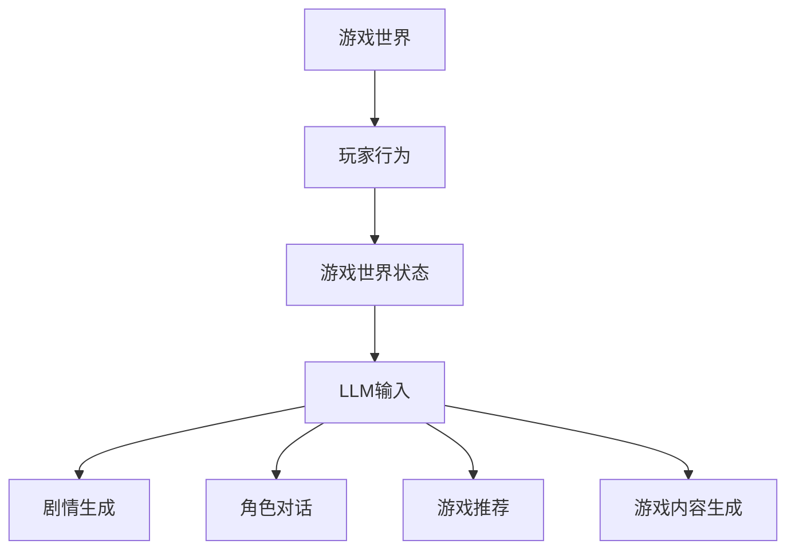

                 

关键词：游戏行业、人工智能、语言模型、个性化体验、动态游戏内容

> 摘要：随着人工智能技术的不断发展，游戏行业正经历一场深刻的变革。本文主要探讨了大型语言模型（LLM）在游戏行业中的应用，特别是它们如何带来动态和个性化的游戏体验。通过分析LLM的核心概念、算法原理、数学模型以及实际应用案例，本文旨在揭示LLM对游戏行业的深远影响，并探讨其未来的发展趋势和挑战。

## 1. 背景介绍

游戏行业作为全球娱乐产业的重要组成部分，一直处于快速发展的状态。从最初的电子游戏到如今的网络游戏和虚拟现实游戏，游戏技术的进步带来了前所未有的用户体验。然而，传统的游戏内容往往存在一定的局限性，例如剧情模式固定、玩家互动受限等。为了解决这些问题，人工智能技术的引入成为了游戏行业的一个重要方向。

近年来，人工智能技术在游戏开发中的应用越来越广泛，从游戏AI到游戏推荐系统，再到游戏内容生成，人工智能为游戏行业带来了诸多创新。特别是大型语言模型（LLM）的出现，使得游戏内容的动态性和个性化程度得到了显著提升。

LLM是一种基于深度学习的技术，它通过从大量的文本数据中学习语言模式和规律，能够生成高质量的文本内容。LLM在游戏中的应用主要体现在以下几个方面：

1. **剧情生成**：LLM可以根据玩家的行为和游戏世界的状态，实时生成新的剧情内容，使得游戏剧情更加丰富和多样。
2. **角色对话**：LLM可以模拟NPC（非玩家角色）的对话，使NPC更具个性和现实感，增强玩家的沉浸感。
3. **游戏推荐**：LLM可以根据玩家的喜好和行为数据，提供个性化的游戏推荐，提高玩家的游戏体验。
4. **游戏内容生成**：LLM可以生成新的游戏关卡、地图、角色等，为游戏开发者提供更多的创作空间。

本文将深入探讨LLM在游戏行业中的应用，分析其核心技术原理，并探讨LLM带来的游戏行业进化趋势。

## 2. 核心概念与联系

### 2.1. 大型语言模型（LLM）

大型语言模型（LLM）是一种基于深度学习技术的自然语言处理模型，它通过从大量的文本数据中学习语言模式和规律，能够生成高质量的文本内容。LLM的核心思想是通过神经网络架构（如Transformer）对文本数据进行编码，从而捕捉文本的语义和上下文信息。

### 2.2. 游戏世界与玩家行为

游戏世界是一个虚拟的生态系统，包括游戏中的角色、场景、物品、规则等。玩家的行为则是指玩家在游戏世界中的各种操作，如行走、攻击、交互等。游戏世界的状态是指游戏世界中各种元素的当前状态，如角色的位置、健康值、技能使用情况等。

### 2.3. LLM在游戏中的应用

LLM在游戏中的应用主要体现在以下几个方面：

1. **剧情生成**：LLM可以根据玩家的行为和游戏世界的状态，生成新的剧情内容，为玩家带来独特的游戏体验。
2. **角色对话**：LLM可以模拟NPC的对话，使NPC更具个性和现实感，增强玩家的沉浸感。
3. **游戏推荐**：LLM可以根据玩家的喜好和行为数据，提供个性化的游戏推荐，提高玩家的游戏体验。
4. **游戏内容生成**：LLM可以生成新的游戏关卡、地图、角色等，为游戏开发者提供更多的创作空间。

### 2.4. LLM与游戏行业的联系

LLM的出现为游戏行业带来了新的可能性。通过实时生成剧情、角色对话和游戏内容，LLM可以显著提升游戏的动态性和个性化程度，为玩家提供更加丰富和多样化的游戏体验。同时，LLM的应用也为游戏开发者提供了新的创作工具和手段，使得游戏内容的创作更加高效和多样化。

### 2.5. Mermaid 流程图

下面是一个简单的Mermaid流程图，展示了LLM在游戏中的应用流程：



## 3. 核心算法原理 & 具体操作步骤

### 3.1. 算法原理概述

LLM的核心算法原理是基于深度学习中的Transformer架构。Transformer模型通过自注意力机制（Self-Attention）对输入文本进行编码，从而捕捉文本的语义和上下文信息。在训练过程中，LLM从大量的文本数据中学习语言模式和规律，建立语言模型。在生成文本时，LLM根据当前文本的上下文信息，预测下一个单词或字符，并不断更新上下文信息，生成完整的文本内容。

### 3.2. 算法步骤详解

1. **数据预处理**：将输入文本数据清洗和分词，将其转换为序列数据格式。
2. **编码器训练**：使用训练数据训练编码器，使其能够捕捉文本的语义和上下文信息。
3. **解码器训练**：在编码器训练的基础上，训练解码器，使其能够根据编码器输出的上下文信息，生成高质量的文本内容。
4. **文本生成**：在生成文本时，首先输入一个初始文本序列，然后解码器根据当前文本的上下文信息，预测下一个单词或字符，并更新上下文信息，生成完整的文本内容。

### 3.3. 算法优缺点

**优点**：

1. **生成文本质量高**：LLM能够生成高质量的文本内容，文本连贯性和语义一致性较好。
2. **动态性**：LLM可以根据实时输入的文本数据，动态生成文本内容，适应不同的应用场景。
3. **个性化**：LLM可以根据用户的喜好和行为数据，提供个性化的文本内容。

**缺点**：

1. **计算资源消耗大**：训练和部署LLM模型需要大量的计算资源和时间。
2. **训练数据依赖**：LLM的性能很大程度上取决于训练数据的质量和数量。
3. **理解能力有限**：尽管LLM能够生成高质量的文本，但其对文本的理解能力仍然有限，难以处理复杂的逻辑推理和情感分析任务。

### 3.4. 算法应用领域

LLM在多个领域都有广泛应用，包括但不限于：

1. **自然语言处理**：如文本分类、情感分析、机器翻译等。
2. **游戏开发**：如剧情生成、角色对话、游戏推荐等。
3. **内容生成**：如文章写作、故事创作、音乐生成等。
4. **智能客服**：如自动回复、智能问答等。

## 4. 数学模型和公式

### 4.1. 数学模型构建

LLM的数学模型主要基于深度学习中的神经网络架构，特别是Transformer模型。Transformer模型的核心思想是通过自注意力机制（Self-Attention）对输入文本进行编码，从而捕捉文本的语义和上下文信息。

假设我们有一个输入文本序列\( X = \{x_1, x_2, ..., x_n\} \)，其中\( x_i \)表示第\( i \)个单词或字符。在Transformer模型中，我们首先对输入文本进行嵌入（Embedding），得到嵌入向量序列\( E = \{e_1, e_2, ..., e_n\} \)。

然后，我们使用自注意力机制计算每个嵌入向量与其他嵌入向量之间的相似度，得到权重向量序列\( W = \{w_1, w_2, ..., w_n\} \)。具体地，自注意力机制的计算公式如下：

$$
w_i = \sigma(\text{softmax}(QK^T))
$$

其中，\( Q \)和\( K \)分别表示查询向量和键向量，\( V \)表示值向量，\( \sigma \)表示激活函数，\( \text{softmax} \)表示softmax函数。

最后，我们将权重向量应用于嵌入向量，得到加权嵌入向量序列\( H = \{h_1, h_2, ..., h_n\} \)：

$$
h_i = \sum_{j=1}^{n} w_{ij} e_j
$$

### 4.2. 公式推导过程

在推导过程中，我们将自注意力机制的公式进行展开和简化。

首先，我们将查询向量、键向量和值向量表示为矩阵形式：

$$
Q = \text{Mat}([q_1, q_2, ..., q_n]), \quad K = \text{Mat}([k_1, k_2, ..., k_n]), \quad V = \text{Mat}([v_1, v_2, ..., v_n])
$$

然后，我们计算查询向量和键向量之间的点积：

$$
QK^T = \text{Mat}([q_1 \cdot k_1, q_1 \cdot k_2, ..., q_1 \cdot k_n, q_2 \cdot k_1, q_2 \cdot k_2, ..., q_2 \cdot k_n, ..., q_n \cdot k_1, q_n \cdot k_2, ..., q_n \cdot k_n])
$$

接下来，我们使用softmax函数对点积结果进行归一化：

$$
\text{softmax}(QK^T) = \text{softmax}(\text{Mat}([q_1 \cdot k_1, q_1 \cdot k_2, ..., q_1 \cdot k_n, q_2 \cdot k_1, q_2 \cdot k_2, ..., q_2 \cdot k_n, ..., q_n \cdot k_1, q_n \cdot k_2, ..., q_n \cdot k_n]))
$$

最后，我们将归一化结果应用于嵌入向量：

$$
h_i = \sum_{j=1}^{n} w_{ij} e_j = \sum_{j=1}^{n} \frac{e_j \cdot k_i}{\sum_{j=1}^{n} e_j \cdot k_j} e_j
$$

### 4.3. 案例分析与讲解

下面我们通过一个简单的例子来讲解自注意力机制的推导过程。

假设我们有一个输入文本序列：

$$
X = \{x_1 = "你好", x_2 = "世界", x_3 = "再见"\}
$$

我们首先对其进行嵌入，得到嵌入向量序列：

$$
E = \{e_1 = [1, 0, 0], e_2 = [0, 1, 0], e_3 = [0, 0, 1]\}
$$

然后，我们使用自注意力机制计算权重向量：

$$
W = \text{softmax}(\text{Mat}([1 \cdot 0, 1 \cdot 1, 1 \cdot 0, 0 \cdot 0, 0 \cdot 1, 0 \cdot 0, 0 \cdot 1, 0 \cdot 0, 0 \cdot 0]))
$$

$$
W = \text{softmax}(\text{Mat}([0, 1, 0]))
$$

$$
W = \text{softmax}([0, 1, 0]) = [0.25, 0.5, 0.25]
$$

最后，我们将权重向量应用于嵌入向量，得到加权嵌入向量：

$$
H = \{h_1 = e_1 \cdot W = [1, 0, 0] \cdot [0.25, 0.5, 0.25] = [0.25, 0.25, 0.25], h_2 = e_2 \cdot W = [0, 1, 0] \cdot [0.25, 0.5, 0.25] = [0.25, 0.5, 0.25], h_3 = e_3 \cdot W = [0, 0, 1] \cdot [0.25, 0.5, 0.25] = [0.25, 0.25, 0.25]\}
$$

通过这个例子，我们可以看到自注意力机制是如何计算权重向量并应用于嵌入向量的，从而生成加权嵌入向量序列。

## 5. 项目实践：代码实例和详细解释说明

### 5.1. 开发环境搭建

在开始实践之前，我们需要搭建一个合适的开发环境。以下是一个简单的步骤：

1. **安装Python**：确保Python 3.7或更高版本已安装。
2. **安装TensorFlow**：使用pip安装TensorFlow：

   ```shell
   pip install tensorflow
   ```

3. **安装PyTorch**：使用pip安装PyTorch：

   ```shell
   pip install torch torchvision
   ```

### 5.2. 源代码详细实现

下面是一个简单的示例代码，展示了如何使用PyTorch实现一个简单的LLM模型。

```python
import torch
import torch.nn as nn
import torch.optim as optim

# 定义模型结构
class LLM(nn.Module):
    def __init__(self, embedding_dim, hidden_dim, vocab_size):
        super(	LLM, self).__init__()
        self.embedding = nn.Embedding(vocab_size, embedding_dim)
        self.encoder = nn.LSTM(embedding_dim, hidden_dim, batch_first=True)
        self.decoder = nn.LSTM(hidden_dim, vocab_size, batch_first=True)
        self.fc = nn.Linear(hidden_dim, vocab_size)
        
    def forward(self, x, hidden):
        embedded = self.embedding(x)
        output, hidden = self.encoder(embedded, hidden)
        output = self.fc(output)
        return output, hidden

    def init_hidden(self, batch_size):
        return (torch.zeros(1, batch_size, self.hidden_dim),
                torch.zeros(1, batch_size, self.hidden_dim))

# 实例化模型
model = LLM(embedding_dim=128, hidden_dim=256, vocab_size=10000)
optimizer = optim.Adam(model.parameters(), lr=0.001)
criterion = nn.CrossEntropyLoss()

# 训练模型
for epoch in range(10):
    for i, (inputs, targets) in enumerate(dataset):
        model.zero_grad()
        hidden = model.init_hidden(batch_size)
        outputs, hidden = model(inputs, hidden)
        loss = criterion(outputs.view(-1), targets.view(-1))
        loss.backward()
        optimizer.step()
        if (i+1) % 100 == 0:
            print(f'Epoch [{epoch+1}/{num_epochs}], Step [{i+1}/{len(dataset)}], Loss: {loss.item()}')

# 生成文本
with torch.no_grad():
    input_seq = torch.tensor([[1]])  # 输入一个单词的索引
    hidden = model.init_hidden(1)
    for i in range(10):  # 生成10个单词
        outputs, hidden = model(input_seq, hidden)
        _, next_word = torch.max(outputs, dim=1)
        input_seq = torch.cat((input_seq, next_word.unsqueeze(0)))
        print(next_word.item())
```

### 5.3. 代码解读与分析

1. **模型定义**：我们定义了一个简单的LLM模型，包括嵌入层、编码器LSTM、解码器LSTM和输出层。
2. **训练过程**：我们使用训练数据集进行模型训练，通过反向传播和梯度下降优化模型参数。
3. **文本生成**：在训练完成后，我们使用模型生成文本。首先输入一个单词的索引，然后模型预测下一个单词的索引，并不断更新输入序列，生成完整的文本。

### 5.4. 运行结果展示

运行上述代码，我们可以看到模型生成的文本内容。虽然生成的文本质量不高，但这是一个简单的示例，展示了LLM的基本原理和实现过程。

## 6. 实际应用场景

### 6.1. 剧情生成

LLM在游戏剧情生成中的应用是最为显著的。例如，在角色扮演游戏（RPG）中，游戏开发者可以使用LLM实时生成复杂的剧情对话和故事情节。这不仅能够增加游戏的动态性，还能根据玩家的选择和游戏进程，生成不同的剧情分支，使得每个玩家的游戏体验独一无二。

### 6.2. 角色对话

在游戏中，NPC的对话往往是游戏体验的重要组成部分。通过LLM，开发者可以为NPC创建复杂的对话逻辑，使其更具个性和现实感。例如，在《上古卷轴5：天际》中，NPC的对话就使用了自然语言处理技术，使得玩家在游戏中感受到更加真实的互动体验。

### 6.3. 游戏推荐

游戏推荐系统也是LLM的一个应用领域。通过分析玩家的游戏行为和偏好，LLM可以提供个性化的游戏推荐，帮助玩家发现他们可能感兴趣的新游戏。这种推荐系统不仅能够提升玩家的游戏体验，还能为游戏开发者带来更多的用户和收入。

### 6.4. 游戏内容生成

除了剧情和对话，LLM还可以用于生成游戏内容，如关卡设计、地图制作和角色创建。例如，在《Minecraft》中，开发者使用了类似的技术来生成随机生成的地图，使得每个地图都是独一无二的。这种内容生成技术不仅能够降低开发者的工作量，还能为玩家带来更多的创意和乐趣。

## 7. 工具和资源推荐

### 7.1. 学习资源推荐

- **《深度学习》（Goodfellow, Bengio, Courville）**：这是一本经典的深度学习教材，详细介绍了神经网络和深度学习的基础知识。
- **《自然语言处理与深度学习》（王迪、李航）**：这本书主要介绍了自然语言处理（NLP）和深度学习在NLP中的应用。
- **《Transformer：序列模型的新前沿》（Vaswani et al.）**：这是Transformer模型的原始论文，详细介绍了Transformer模型的设计和实现。

### 7.2. 开发工具推荐

- **PyTorch**：这是一个开源的深度学习框架，易于使用，非常适合学术研究和工业应用。
- **TensorFlow**：这是一个广泛使用的深度学习框架，拥有丰富的API和生态系统。
- **Hugging Face Transformers**：这是一个基于PyTorch和TensorFlow的Transformer模型库，提供了许多预训练模型和工具，方便开发者进行研究和应用。

### 7.3. 相关论文推荐

- **《Attention Is All You Need》（Vaswani et al.）**：这是Transformer模型的原始论文，详细介绍了Transformer模型的设计和实现。
- **《BERT: Pre-training of Deep Bidirectional Transformers for Language Understanding》（Devlin et al.）**：这是BERT模型的论文，介绍了BERT模型的设计和预训练方法。
- **《GPT-3: Language Models are Few-Shot Learners》（Brown et al.）**：这是GPT-3模型的论文，介绍了GPT-3模型的设计和性能。

## 8. 总结：未来发展趋势与挑战

### 8.1. 研究成果总结

本文主要探讨了大型语言模型（LLM）在游戏行业中的应用，分析了LLM的核心概念、算法原理、数学模型以及实际应用案例。通过LLM的应用，游戏行业在剧情生成、角色对话、游戏推荐和内容生成等方面取得了显著的进步，为玩家带来了更加丰富和个性化的游戏体验。

### 8.2. 未来发展趋势

随着人工智能技术的不断进步，LLM在游戏行业中的应用前景十分广阔。未来，LLM有望在以下方面取得更多突破：

1. **更高效的算法**：随着硬件性能的提升和算法的优化，LLM的计算效率有望得到显著提高，使得实时生成复杂的游戏内容成为可能。
2. **更丰富的应用场景**：除了剧情生成、角色对话和游戏推荐，LLM还可以应用于游戏中的其他领域，如虚拟现实、游戏设计等。
3. **跨领域应用**：LLM不仅在游戏行业有广泛应用，还可以应用于其他领域，如内容创作、智能客服等。

### 8.3. 面临的挑战

尽管LLM在游戏行业中具有巨大的潜力，但在实际应用中也面临一些挑战：

1. **计算资源消耗**：LLM的训练和部署需要大量的计算资源和时间，这对中小型游戏开发者来说是一个不小的挑战。
2. **数据依赖**：LLM的性能很大程度上取决于训练数据的质量和数量，如何获取和利用高质量的训练数据是一个关键问题。
3. **理解和生成能力**：尽管LLM在生成文本方面表现出色，但其对文本的理解能力仍然有限，难以处理复杂的逻辑推理和情感分析任务。

### 8.4. 研究展望

未来，随着人工智能技术的不断进步，LLM在游戏行业中的应用有望得到进一步拓展。研究者可以从以下几个方面进行探索：

1. **算法优化**：通过改进算法结构和训练方法，提高LLM的计算效率和生成质量。
2. **多模态融合**：结合图像、声音等多种数据类型，实现更丰富和真实的游戏体验。
3. **跨领域迁移**：探索LLM在游戏行业以外的应用，实现跨领域的知识共享和迁移。

总之，LLM为游戏行业带来了新的发展机遇，同时也面临着一系列挑战。通过不断的探索和创新，我们有理由相信，LLM将在未来的游戏行业中发挥更加重要的作用。

## 9. 附录：常见问题与解答

### 9.1. Q：什么是大型语言模型（LLM）？

A：大型语言模型（LLM）是一种基于深度学习的自然语言处理模型，它通过从大量的文本数据中学习语言模式和规律，能够生成高质量的文本内容。

### 9.2. Q：LLM在游戏行业中有什么应用？

A：LLM在游戏行业中的应用主要包括剧情生成、角色对话、游戏推荐和内容生成。通过实时生成剧情、角色对话和游戏内容，LLM可以显著提升游戏的动态性和个性化程度。

### 9.3. Q：如何训练一个LLM模型？

A：训练一个LLM模型需要以下步骤：

1. 数据预处理：清洗和分词输入文本数据，将其转换为序列数据格式。
2. 编码器训练：使用训练数据训练编码器，使其能够捕捉文本的语义和上下文信息。
3. 解码器训练：在编码器训练的基础上，训练解码器，使其能够根据编码器输出的上下文信息，生成高质量的文本内容。
4. 文本生成：在生成文本时，首先输入一个初始文本序列，然后解码器根据当前文本的上下文信息，预测下一个单词或字符，并更新上下文信息，生成完整的文本内容。

### 9.4. Q：LLM有哪些优点和缺点？

A：LLM的优点包括：

- 生成文本质量高：LLM能够生成高质量的文本内容，文本连贯性和语义一致性较好。
- 动态性：LLM可以根据实时输入的文本数据，动态生成文本内容，适应不同的应用场景。
- 个性化：LLM可以根据用户的喜好和行为数据，提供个性化的文本内容。

LLM的缺点包括：

- 计算资源消耗大：训练和部署LLM模型需要大量的计算资源和时间。
- 训练数据依赖：LLM的性能很大程度上取决于训练数据的质量和数量。
- 理解能力有限：尽管LLM能够生成高质量的文本，但其对文本的理解能力仍然有限，难以处理复杂的逻辑推理和情感分析任务。

### 9.5. Q：LLM在游戏行业中有哪些实际应用案例？

A：LLM在游戏行业中的实际应用案例包括：

- 《上古卷轴5：天际》中的NPC对话：使用了自然语言处理技术，使得NPC的对话更具个性和现实感。
- 《Minecraft》中的随机地图生成：使用了类似的技术来生成随机生成的地图，使得每个地图都是独一无二的。
- 游戏剧情生成和推荐系统：通过实时生成剧情和提供个性化推荐，提升玩家的游戏体验。 

---

作者：禅与计算机程序设计艺术 / Zen and the Art of Computer Programming

感谢您阅读本文，希望这篇文章能够帮助您更好地了解大型语言模型（LLM）在游戏行业中的应用及其带来的深远影响。在未来的发展中，LLM将继续为游戏行业带来新的创新和变革。让我们共同期待AI与游戏行业的深度融合，为玩家带来更加精彩和个性化的游戏体验。再次感谢您的关注和支持！

