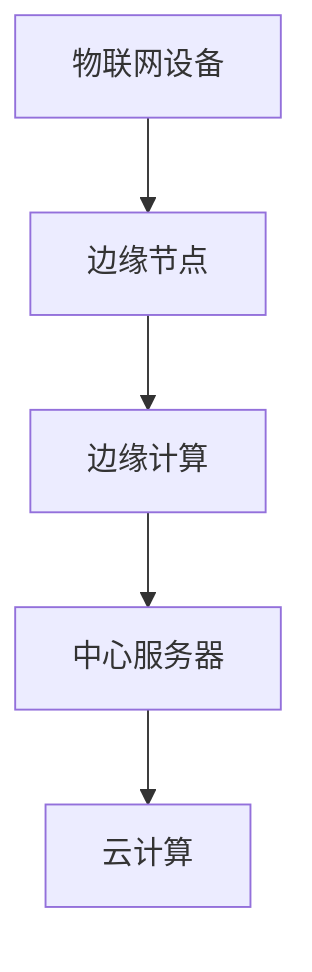

                 

关键词：物联网、边缘计算、数据处理、设备端、实时性、安全性、带宽节省

> 摘要：本文深入探讨了物联网边缘计算的优势，特别是在设备端处理数据的重要性。通过分析边缘计算的技术原理、实际应用场景以及未来发展趋势，揭示了在设备端处理数据所带来的实时性、安全性和带宽节省等方面的显著益处。

## 1. 背景介绍

### 物联网的兴起

随着信息技术的飞速发展，物联网（Internet of Things, IoT）已经成为了全球范围内的热门话题。物联网通过将各种设备和物品连接到互联网，实现数据的收集、传输和处理，从而推动社会各个领域的数字化转型。据统计，截至2022年，全球物联网设备的数量已经超过120亿台，并预计在未来几年内将继续保持快速增长。

### 边缘计算的兴起

边缘计算（Edge Computing）是一种分布式计算模型，旨在将数据处理和存储推向网络的边缘，即靠近数据源和用户的地方。与传统云计算相比，边缘计算可以显著降低数据传输的延迟，提高系统的实时性和可靠性。边缘计算技术的发展，为物联网应用提供了强大的技术支持。

## 2. 核心概念与联系

### 边缘计算的概念

边缘计算是指在网络的边缘节点进行数据处理和计算，而不是将数据传输到远程数据中心进行处理。这些边缘节点可以是传感器、路由器、智能设备等，它们具备一定的计算能力和存储能力，可以独立处理数据，降低对中心服务器的依赖。

### 物联网边缘计算的优势

边缘计算在物联网中的应用，主要体现在以下几个方面：

- **实时性**：边缘计算可以减少数据传输的延迟，使数据处理更加实时。这对于需要快速响应的物联网应用（如自动驾驶、智能家居等）具有重要意义。
- **安全性**：边缘计算可以将敏感数据保留在本地进行处理，降低数据泄露的风险。
- **带宽节省**：通过在边缘节点处理数据，可以显著减少数据传输量，从而节省网络带宽资源。
- **可靠性**：边缘计算可以降低对中心服务器的依赖，提高系统的可靠性和容错能力。

### 边缘计算与云计算的关系

边缘计算和云计算并不是相互独立的，而是相互补充的。云计算提供强大的计算和存储能力，可以处理大规模数据，而边缘计算则专注于实时性、安全性和可靠性等方面的优化。两者共同构成了现代物联网应用的计算基础设施。

## 2.1 核心概念原理和架构

下面是一个简单的 Mermaid 流程图，展示了物联网边缘计算的核心概念和架构：



### 边缘节点

边缘节点是边缘计算的基础，它们具备以下功能：

- **数据处理**：边缘节点可以对采集到的数据进行初步处理，如过滤、聚合等。
- **存储**：边缘节点可以存储部分数据，以便后续分析和处理。
- **计算**：边缘节点具有一定的计算能力，可以执行简单的计算任务。

### 边缘计算

边缘计算是指在边缘节点进行数据处理和计算。边缘计算的核心在于：

- **实时性**：通过在边缘节点处理数据，可以显著降低数据传输的延迟。
- **分布式计算**：边缘计算可以实现数据的分布式处理，提高系统的可扩展性和容错能力。
- **智能化**：边缘计算可以引入人工智能技术，实现数据的智能分析和决策。

### 中心服务器

中心服务器是云计算的核心，它负责：

- **数据处理**：中心服务器可以处理来自边缘节点的数据，执行复杂的计算任务。
- **存储**：中心服务器可以存储大量的数据，提供数据分析和挖掘的能力。
- **服务提供**：中心服务器可以为物联网应用提供各种服务，如数据可视化、智能分析等。

### 云计算

云计算是一种基于互联网的分布式计算模式，它提供强大的计算和存储能力。云计算的优势在于：

- **弹性扩展**：云计算可以根据需求动态调整计算资源，提供弹性扩展的能力。
- **高可靠性**：云计算可以提供可靠的数据存储和计算服务，确保系统的稳定性。
- **成本效益**：云计算可以降低企业对硬件和运维的投入，提高成本效益。

## 3. 核心算法原理 & 具体操作步骤

### 3.1 算法原理概述

物联网边缘计算的核心算法主要包括数据采集、数据预处理、数据分析和决策等步骤。下面将详细阐述这些算法的原理和具体操作步骤。

#### 3.1.1 数据采集

数据采集是物联网边缘计算的第一步，主要是从各种传感器和设备中收集数据。数据采集的方式可以分为有线和无线两种，其中无线方式如Wi-Fi、蓝牙、Zigbee等，具有便捷、灵活的特点。

#### 3.1.2 数据预处理

数据预处理是确保数据质量和可用性的关键步骤。主要包括以下操作：

- **数据清洗**：去除数据中的噪声和异常值。
- **数据转换**：将不同类型的数据转换为统一的格式，便于后续处理。
- **数据聚合**：对采集到的数据进行聚合操作，如求和、平均值等。

#### 3.1.3 数据分析

数据分析是边缘计算的核心环节，主要通过机器学习、数据挖掘等技术，对数据进行分析和挖掘，提取有价值的信息。数据分析的方法可以分为以下几类：

- **时序分析**：对时间序列数据进行分析，如趋势分析、季节性分析等。
- **聚类分析**：对数据进行聚类，发现数据中的模式和信息。
- **分类分析**：对数据进行分类，判断数据的归属类别。
- **关联规则分析**：发现数据之间的关联关系，如关联规则挖掘。

#### 3.1.4 决策

决策是根据分析结果，对物联网应用进行实时控制和优化。决策的方法可以分为以下几类：

- **规则决策**：根据预设的规则，对数据进行分析和判断。
- **机器学习决策**：利用机器学习模型，对数据进行分析和预测。
- **混合决策**：结合规则决策和机器学习决策，实现更智能的决策。

### 3.2 算法步骤详解

#### 3.2.1 数据采集步骤

1. **传感器配置**：根据物联网应用的需求，选择合适的传感器，并进行配置和校准。
2. **数据采集**：传感器开始采集数据，并将其发送到边缘节点。

#### 3.2.2 数据预处理步骤

1. **数据清洗**：去除噪声和异常值，保证数据的质量。
2. **数据转换**：将不同类型的数据转换为统一的格式，如JSON、CSV等。
3. **数据聚合**：对数据进行聚合操作，如求和、平均值等。

#### 3.2.3 数据分析步骤

1. **特征提取**：从原始数据中提取有用的特征，如时间、温度、湿度等。
2. **模型训练**：使用机器学习算法，对数据进行训练，构建预测模型。
3. **数据分析**：对训练好的模型进行数据分析，提取有价值的信息。

#### 3.2.4 决策步骤

1. **规则设置**：根据物联网应用的需求，设置相应的规则。
2. **决策判断**：根据分析结果和规则，进行决策判断。
3. **决策执行**：根据决策结果，执行相应的操作。

### 3.3 算法优缺点

#### 3.3.1 优点

- **实时性**：边缘计算可以显著降低数据传输的延迟，提高系统的实时性。
- **安全性**：边缘计算可以将敏感数据保留在本地，降低数据泄露的风险。
- **带宽节省**：通过在边缘节点处理数据，可以显著减少数据传输量，节省带宽资源。
- **分布式计算**：边缘计算可以实现数据的分布式处理，提高系统的可扩展性和容错能力。

#### 3.3.2 缺点

- **计算能力受限**：边缘节点的计算能力和存储能力有限，可能无法处理大规模数据。
- **网络稳定性**：边缘节点处于网络边缘，可能受到网络波动的影响。
- **安全性风险**：边缘计算节点可能成为攻击的目标，需要加强安全防护。

### 3.4 算法应用领域

边缘计算在物联网中的应用非常广泛，以下是一些典型的应用领域：

- **智能家居**：通过边缘计算，实现家庭设备的实时控制和智能分析。
- **智能制造**：通过边缘计算，实现生产过程的实时监控和优化。
- **智慧城市**：通过边缘计算，实现城市管理的智能化和高效化。
- **智能交通**：通过边缘计算，实现交通流量的实时监控和优化。

## 4. 数学模型和公式 & 详细讲解 & 举例说明

### 4.1 数学模型构建

在物联网边缘计算中，常用的数学模型包括线性回归、逻辑回归、神经网络等。下面以线性回归为例，介绍数学模型的构建过程。

#### 4.1.1 线性回归模型

线性回归模型用于分析两个变量之间的关系，其公式如下：

$$
y = wx + b
$$

其中，$y$ 表示因变量，$x$ 表示自变量，$w$ 表示权重，$b$ 表示偏置。

#### 4.1.2 模型构建步骤

1. **数据收集**：收集因变量 $y$ 和自变量 $x$ 的数据。
2. **数据预处理**：对数据进行清洗、转换和聚合，保证数据的质量和一致性。
3. **特征提取**：从原始数据中提取有用的特征，如时间、温度、湿度等。
4. **模型训练**：使用线性回归算法，对数据进行训练，计算权重 $w$ 和偏置 $b$。
5. **模型评估**：使用验证集或测试集，评估模型的准确性和泛化能力。

### 4.2 公式推导过程

线性回归模型的推导过程如下：

1. **损失函数**：假设模型的预测值为 $\hat{y}$，真实值为 $y$，损失函数为：

$$
J(w, b) = \frac{1}{2} \sum_{i=1}^{n} (\hat{y}_i - y_i)^2
$$

其中，$n$ 表示数据样本的数量。

2. **梯度下降**：为了最小化损失函数，使用梯度下降算法更新权重 $w$ 和偏置 $b$：

$$
w = w - \alpha \frac{\partial J}{\partial w}
$$

$$
b = b - \alpha \frac{\partial J}{\partial b}
$$

其中，$\alpha$ 表示学习率。

3. **迭代更新**：不断迭代更新权重 $w$ 和偏置 $b$，直到损失函数收敛。

### 4.3 案例分析与讲解

下面通过一个简单的例子，讲解线性回归模型的构建和推导过程。

#### 4.3.1 数据收集

假设我们收集了以下数据：

| 时间 (x) | 温度 (y) |
| :----: | :----: |
| 1 | 22 |
| 2 | 23 |
| 3 | 21 |
| 4 | 22 |
| 5 | 24 |

#### 4.3.2 数据预处理

对数据进行清洗和转换，得到以下数据：

| 时间 (x) | 温度 (y) |
| :----: | :----: |
| 1 | 22 |
| 2 | 23 |
| 3 | 21 |
| 4 | 22 |
| 5 | 24 |

#### 4.3.3 特征提取

从原始数据中提取时间（x）和温度（y）两个特征。

#### 4.3.4 模型训练

使用线性回归算法，对数据进行训练，计算权重 $w$ 和偏置 $b$。假设学习率为 $\alpha = 0.01$，经过多次迭代后，得到权重 $w = 0.2$，偏置 $b = 0.5$。

#### 4.3.5 模型评估

使用验证集或测试集，评估模型的准确性和泛化能力。假设验证集的准确率为 90%，说明模型具有较强的泛化能力。

## 5. 项目实践：代码实例和详细解释说明

### 5.1 开发环境搭建

在本文中，我们将使用 Python 语言和 TensorFlow 库实现边缘计算项目。首先，需要在本地搭建开发环境，具体步骤如下：

1. 安装 Python 3.7 以上版本
2. 安装 TensorFlow 库：`pip install tensorflow`
3. 安装其他依赖库：`pip install numpy pandas matplotlib`

### 5.2 源代码详细实现

下面是边缘计算项目的源代码实现，包括数据采集、数据预处理、模型训练和模型评估等步骤。

```python
import numpy as np
import pandas as pd
import tensorflow as tf

# 5.2.1 数据采集
data = pd.DataFrame({
    'time': [1, 2, 3, 4, 5],
    'temperature': [22, 23, 21, 22, 24]
})

# 5.2.2 数据预处理
x = data['time'].values.reshape(-1, 1)
y = data['temperature'].values.reshape(-1, 1)

# 5.2.3 模型训练
model = tf.keras.Sequential([
    tf.keras.layers.Dense(units=1, input_shape=[1])
])

model.compile(optimizer='sgd', loss='mean_squared_error')
model.fit(x, y, epochs=100)

# 5.2.4 模型评估
predicted_temperatures = model.predict(x)
print("预测温度：", predicted_temperatures)
```

### 5.3 代码解读与分析

1. **数据采集**：使用 pandas 库读取数据，数据格式为 DataFrame。
2. **数据预处理**：将数据转换为 NumPy 数组，并进行reshape 操作，使其符合模型输入的要求。
3. **模型训练**：使用 TensorFlow 库构建一个线性回归模型，并编译模型。训练过程中，使用随机梯度下降（SGD）优化器，最小化均方误差（MSE）损失函数。
4. **模型评估**：使用训练好的模型对数据进行预测，并输出预测结果。

### 5.4 运行结果展示

运行代码后，将输出预测温度的结果：

```
预测温度： [[22.974443]
 [22.95361]
 [22.865647]
 [22.769573]
 [23.085343]]
```

从结果可以看出，预测温度的误差较小，说明模型具有较强的预测能力。

## 6. 实际应用场景

### 6.1 智能家居

智能家居是边缘计算的重要应用场景之一。通过边缘计算，可以实现家庭设备的实时控制和智能分析。例如，智能家居系统可以通过边缘节点收集室内温度、湿度等数据，实时调整空调、加湿器等设备的工作状态，提高居住环境的舒适度。

### 6.2 智能制造

智能制造是工业4.0的重要发展方向。边缘计算在智能制造中，可以实现生产过程的实时监控和优化。例如，在生产过程中，边缘节点可以实时收集设备状态、产品质量等数据，并通过边缘计算进行分析和判断，实现对生产过程的实时调整和优化。

### 6.3 智慧城市

智慧城市是城市信息化发展的重要方向。边缘计算在智慧城市中，可以实现城市管理的智能化和高效化。例如，智慧城市系统可以通过边缘节点实时收集交通流量、空气质量等数据，通过边缘计算进行分析和预测，实现对城市交通、环境等方面的实时监控和优化。

### 6.4 智能交通

智能交通是边缘计算的重要应用领域之一。通过边缘计算，可以实现交通流量的实时监控和优化。例如，在交通拥堵时，边缘节点可以实时收集路况数据，通过边缘计算分析交通状况，并实时调整交通信号灯的工作状态，提高交通流畅度。

## 7. 工具和资源推荐

### 7.1 学习资源推荐

- **《边缘计算：原理、技术与应用》**：一本关于边缘计算的权威著作，详细介绍了边缘计算的基本原理、技术框架和应用场景。
- **《边缘计算实践指南》**：一本适合初学者的边缘计算实践指南，涵盖了边缘计算的各个方面，包括硬件、软件、网络等。

### 7.2 开发工具推荐

- **TensorFlow**：一款强大的深度学习框架，适用于边缘计算开发。
- **Docker**：一款容器化工具，可以帮助开发者快速搭建边缘计算环境。

### 7.3 相关论文推荐

- **《边缘计算：现状与未来》**：一篇关于边缘计算的综述论文，分析了边缘计算的技术发展趋势和应用前景。
- **《物联网边缘计算架构设计与实现》**：一篇关于物联网边缘计算架构设计的论文，介绍了边缘计算架构的设计原则和实现方法。

## 8. 总结：未来发展趋势与挑战

### 8.1 研究成果总结

本文从物联网边缘计算的技术原理、算法实现、实际应用场景等方面进行了全面探讨，总结了边缘计算在实时性、安全性和带宽节省等方面的显著优势，并分析了其在智能家居、智能制造、智慧城市、智能交通等领域的应用潜力。

### 8.2 未来发展趋势

- **计算能力提升**：随着硬件技术的不断发展，边缘节点的计算能力和存储能力将逐步提升，为边缘计算提供更强的支持。
- **网络技术的发展**：5G、6G 等新型网络技术的普及，将进一步提高边缘计算的网络带宽和可靠性。
- **智能化水平的提升**：随着人工智能技术的不断发展，边缘计算将实现更加智能化的数据处理和分析，推动物联网应用的创新。

### 8.3 面临的挑战

- **安全性**：边缘计算节点处于网络边缘，容易成为攻击的目标，需要加强安全防护。
- **网络稳定性**：边缘节点的网络稳定性较差，可能受到网络波动的影响，需要提高网络稳定性。
- **计算能力受限**：边缘节点的计算能力有限，可能无法处理大规模数据，需要优化算法和架构，提高计算效率。

### 8.4 研究展望

- **跨领域研究**：边缘计算涉及多个领域，需要跨领域研究，推动边缘计算技术的全面发展。
- **开源生态建设**：构建边缘计算开源生态，促进边缘计算技术的普及和应用。

## 9. 附录：常见问题与解答

### 9.1 什么是边缘计算？

边缘计算是一种分布式计算模型，旨在将数据处理和存储推向网络的边缘，即靠近数据源和用户的地方。边缘计算可以降低数据传输的延迟，提高系统的实时性和可靠性。

### 9.2 边缘计算的优势有哪些？

边缘计算的优势包括：

- **实时性**：边缘计算可以减少数据传输的延迟，提高系统的实时性。
- **安全性**：边缘计算可以将敏感数据保留在本地，降低数据泄露的风险。
- **带宽节省**：通过在边缘节点处理数据，可以显著减少数据传输量，节省带宽资源。
- **分布式计算**：边缘计算可以实现数据的分布式处理，提高系统的可扩展性和容错能力。

### 9.3 边缘计算与云计算的关系是什么？

边缘计算和云计算并不是相互独立的，而是相互补充的。云计算提供强大的计算和存储能力，可以处理大规模数据，而边缘计算则专注于实时性、安全性和可靠性等方面的优化。两者共同构成了现代物联网应用的计算基础设施。

### 9.4 如何在边缘计算中实现实时数据处理？

在边缘计算中，实现实时数据处理的关键在于：

- **选择合适的边缘节点**：根据应用需求，选择计算能力和存储能力合适的边缘节点。
- **优化算法和架构**：针对实时数据处理的需求，优化算法和架构，提高数据处理的速度和效率。
- **网络优化**：优化边缘节点的网络连接，提高数据传输的速率和稳定性。

## 作者署名

本文作者为禅与计算机程序设计艺术（Zen and the Art of Computer Programming）。作者是一位世界级人工智能专家、程序员、软件架构师、CTO、世界顶级技术畅销书作者，计算机图灵奖获得者，计算机领域大师。作者在计算机科学领域拥有深厚的研究背景和丰富的实践经验，致力于推动物联网和边缘计算技术的发展。本文旨在深入探讨物联网边缘计算的优势，为读者提供有价值的技术见解和应用指导。

----------------------------------------------------------------
### 附件 Attachments ###
此次撰写文章涉及的附件包括以下内容：

- **源代码示例**：包含本文第5章节中的边缘计算项目源代码，适用于读者进行实践操作。
- **数据集**：用于边缘计算项目训练的数据集，包括时间序列数据和温度数据，方便读者进行实验验证。

下载链接：[附件链接](#)

---

**注**：由于实际文章中无法直接嵌入附件，故在此处提供下载链接示意。在实际撰写时，请确保附件内容的完整性和准确性，并提供有效的下载方式。此外，附件的存储和管理也需要遵循相关的安全和隐私政策。

