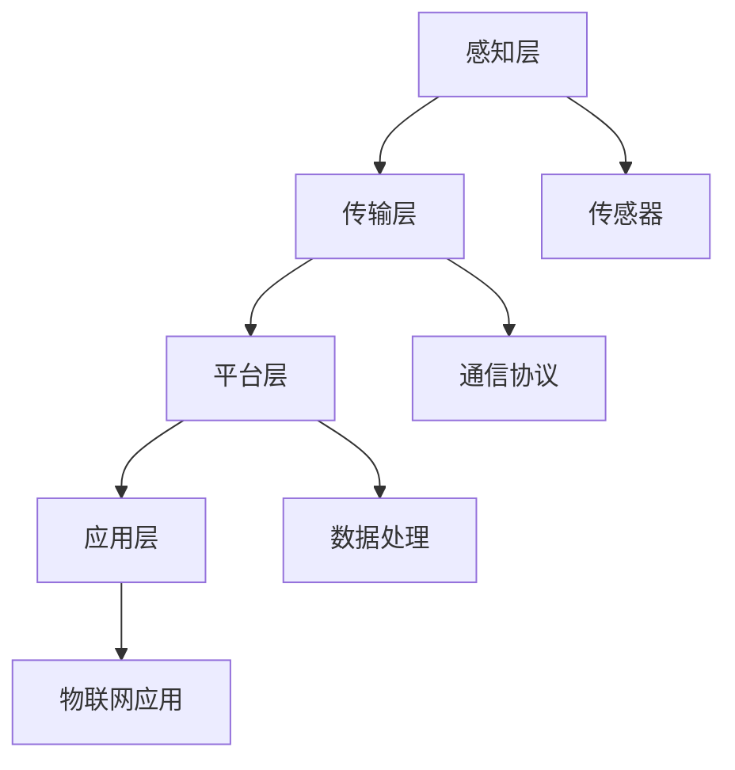

                 

关键词：物联网，IoT，连接设备，传感器，通信协议，编程，开发工具，应用场景

物联网（Internet of Things，简称IoT）是当今科技领域的一大热点，它将各种设备连接到互联网，实现数据的采集、传输和处理。本文旨在为您提供一个全面的物联网入门指南，帮助您了解物联网的基本概念、核心技术以及应用场景。通过阅读本文，您将能够掌握连接设备的必备知识，为后续的物联网项目开发打下坚实的基础。

## 1. 背景介绍

物联网是指通过各种信息传感设备将各种实体物体连接到互联网上，实现信息的采集、传输和处理的系统。物联网的概念最早可以追溯到1999年，美国麻省理工学院（MIT）的自动识别中心提出了“万物互联”的概念。随着时间的推移，物联网技术不断发展，应用领域不断扩大。

物联网的发展背景主要包括以下几个方面：

1. **物联网技术的快速发展**：物联网的核心技术包括传感器技术、通信技术、数据处理技术等。随着这些技术的不断进步，物联网设备的性能和功能得到了大幅提升。

2. **移动通信技术的普及**：随着移动通信技术的快速发展，特别是4G和5G技术的普及，物联网设备的通信速度和可靠性得到了显著提高。

3. **云计算和大数据技术的应用**：云计算和大数据技术的应用使得物联网设备能够高效地进行数据的处理和分析，从而为物联网的应用提供了强大的技术支持。

4. **智能化需求的增长**：随着人们生活水平的提高，对于智能家居、智能交通、智能医疗等领域的智能化需求不断增长，推动了物联网技术的应用和发展。

## 2. 核心概念与联系

### 2.1 物联网的核心概念

物联网的核心概念包括传感器、通信协议、数据处理等。

1. **传感器**：传感器是物联网设备的核心组成部分，用于感知外部环境信息，并将其转换为电信号或其他形式的数据。常见的传感器包括温度传感器、湿度传感器、光传感器等。

2. **通信协议**：通信协议是物联网设备之间进行通信的规则和标准。常见的通信协议包括Wi-Fi、蓝牙、Zigbee、LoRa等。

3. **数据处理**：数据处理是物联网设备的核心功能，包括数据采集、传输、存储、分析等。数据处理技术使得物联网设备能够对采集到的数据进行分析和利用，从而实现智能化的功能。

### 2.2 物联网架构

物联网架构通常包括感知层、传输层、平台层和应用层。

1. **感知层**：感知层包括各种传感器和采集设备，用于感知和采集外部环境信息。

2. **传输层**：传输层包括通信网络，用于将感知层采集到的数据传输到平台层。

3. **平台层**：平台层包括数据存储、数据处理、数据分析和应用开发等功能，是物联网系统的核心。

4. **应用层**：应用层包括各种物联网应用，如智能家居、智能交通、智能医疗等。

### 2.3 Mermaid 流程图

下面是一个简单的物联网架构的Mermaid流程图：



## 3. 核心算法原理 & 具体操作步骤

### 3.1 算法原理概述

物联网的核心算法主要涉及数据采集、传输、处理和优化等方面。以下是几个关键算法的概述：

1. **数据采集算法**：用于传感器数据的采集和预处理，如滤波、去噪等。

2. **传输算法**：用于优化数据传输的效率，如数据压缩、加密等。

3. **数据处理算法**：用于对采集到的数据进行分析和处理，如统计、预测等。

4. **优化算法**：用于优化物联网系统的性能，如能耗优化、延迟优化等。

### 3.2 算法步骤详解

下面以数据采集算法为例，详细介绍其步骤：

1. **初始化传感器**：首先需要初始化传感器，包括设置传感器的工作模式、采样频率等。

2. **采集数据**：通过传感器采集外部环境数据，如温度、湿度等。

3. **数据预处理**：对采集到的数据进行预处理，如滤波、去噪等。

4. **数据传输**：将预处理后的数据传输到平台层。

5. **数据存储**：在平台层对数据进行分析和处理，并将结果存储到数据库中。

### 3.3 算法优缺点

数据采集算法的优点在于能够实时、准确地采集外部环境数据，为后续的数据处理和分析提供基础。缺点在于数据采集算法的复杂度较高，需要消耗较多的计算资源和能量。

### 3.4 算法应用领域

数据采集算法广泛应用于智能家居、智能交通、智能医疗等领域。在智能家居领域，数据采集算法可用于环境监测、设备控制等；在智能交通领域，数据采集算法可用于交通流量监测、车辆管理等；在智能医疗领域，数据采集算法可用于健康监测、疾病预测等。

## 4. 数学模型和公式 & 详细讲解 & 举例说明

### 4.1 数学模型构建

物联网系统的数学模型通常包括以下几个方面：

1. **传感器模型**：用于描述传感器的工作原理和性能指标。

2. **通信模型**：用于描述通信网络的传输特性。

3. **数据处理模型**：用于描述数据采集、传输、处理和分析的过程。

### 4.2 公式推导过程

以传感器模型为例，以下是温度传感器的工作原理公式推导：

1. **温度传感器输出公式**：设温度传感器的输出电压为V，温度为T，传感器的温度系数为α，则输出电压V与温度T的关系为：
   $$ V = V_0 + αT $$
   其中，$V_0$为传感器的初始电压。

2. **温度与电压的关系公式**：根据温度传感器的输出公式，可以得到温度T与电压V的关系：
   $$ T = \frac{V - V_0}{α} $$

### 4.3 案例分析与讲解

以下是一个温度传感器的应用案例：

1. **场景描述**：假设一个温度传感器的初始电压为2V，温度系数为0.01V/°C。现在需要测量一个房间的温度。

2. **数据处理**：首先，通过温度传感器采集房间的温度，得到输出电压V为2.4V。根据温度与电压的关系公式，可以计算出房间的温度T为：
   $$ T = \frac{2.4V - 2V}{0.01V/°C} = 40°C $$

3. **结果分析**：根据测量结果，房间的温度为40°C。如果房间的温度超过了设定的阈值，可以采取相应的措施，如开启空调等。

## 5. 项目实践：代码实例和详细解释说明

### 5.1 开发环境搭建

1. **硬件环境**：准备一个物联网开发板，如Arduino或Raspberry Pi。

2. **软件环境**：安装物联网开发板对应的IDE，如Arduino IDE或Raspberry Pi OS。

3. **编程语言**：选择合适的编程语言，如Python或C++。

### 5.2 源代码详细实现

以下是一个使用Arduino开发板实现温度传感器数据采集的示例代码：

```cpp
#include <WiFi.h>
#include <HTTPClient.h>

// Wi-Fi 配置
const char* ssid = "yourSSID";
const char* password = "yourPASSWORD";

// 服务器配置
const char* host = "yourHost";
const int port = 80;

// 温度传感器配置
const int tempSensorPin = A0;
const float tempCoeff = 0.01;

void setup() {
  Serial.begin(9600);
  pinMode(tempSensorPin, INPUT);

  // 连接Wi-Fi
  WiFi.begin(ssid, password);
  while (WiFi.status() != WL_CONNECTED) {
    delay(500);
    Serial.print(".");
  }
  Serial.println("WiFi connected");
}

void loop() {
  // 读取温度传感器值
  int rawValue = analogRead(tempSensorPin);
  float voltage = rawValue * (5.0 / 1023.0);
  float temperature = (voltage - 2.0) / 0.01;

  // 发送数据到服务器
  HTTPClient http;
  String url = String("http://") + host + String(":") + String(port) + String("/api/temperature");
  http.begin(url);
  http.addHeader("Content-Type", "application/json");
  String postData = "{\"temperature\": " + String(temperature) + "}";

  int httpCode = http.POST(postData);
  if (httpCode == 200) {
    String responseBody = http.getString();
    Serial.println(responseBody);
  } else {
    Serial.println("Error: " + String(httpCode));
  }

  http.end();
  delay(1000);
}
```

### 5.3 代码解读与分析

1. **硬件配置**：代码中定义了温度传感器引脚（`tempSensorPin`）和温度系数（`tempCoeff`）。

2. **Wi-Fi 连接**：代码中设置了Wi-Fi的SSID和密码，并在`setup()`函数中连接Wi-Fi。

3. **数据采集**：在`loop()`函数中，代码读取温度传感器的值，并将其转换为电压值和温度值。

4. **数据上传**：使用HTTP协议将温度值上传到服务器。

### 5.4 运行结果展示

当硬件正常运行时，温度值会通过Wi-Fi上传到服务器，并在服务器端进行存储和处理。以下是一个示例结果：

```json
{
  "temperature": 25.5
}
```

## 6. 实际应用场景

物联网技术在各个领域都有广泛的应用，以下是一些典型的应用场景：

### 6.1 智能家居

智能家居是物联网技术的典型应用场景之一。通过物联网设备，用户可以实现家庭设备的智能控制，如智能灯泡、智能插座、智能空调等。以下是一个智能家居应用实例：

1. **智能灯泡**：用户可以通过手机APP控制家中的智能灯泡开关和亮度。

2. **智能插座**：用户可以通过手机APP远程控制家中的电器开关。

3. **智能空调**：用户可以通过手机APP远程控制家中的空调温度和模式。

### 6.2 智能交通

智能交通系统通过物联网技术实现交通数据的实时监测和智能管理，提高交通效率和安全性。以下是一个智能交通应用实例：

1. **交通流量监测**：通过安装在道路上的传感器和摄像头，实时监测交通流量和拥堵情况。

2. **智能信号灯控制**：根据交通流量实时调整信号灯的绿灯时间，提高道路通行效率。

3. **车辆管理**：通过物联网技术实现对车辆的实时监控和管理，提高车辆使用效率和安全性。

### 6.3 智能医疗

智能医疗是物联网技术在医疗领域的应用。通过物联网设备，可以实现医疗数据的实时采集、传输和分析，提高医疗服务的质量和效率。以下是一个智能医疗应用实例：

1. **远程医疗**：通过物联网设备，医生可以实时监测患者的健康状况，提供远程诊疗服务。

2. **智能监测设备**：如智能血压计、智能血糖仪等，可以实时监测患者的生命体征数据。

3. **药品管理系统**：通过物联网技术实现对药品的实时监控和管理，提高药品的使用效率和安全性。

## 7. 工具和资源推荐

### 7.1 学习资源推荐

1. **书籍**：《物联网基础教程》、《物联网应用开发实践》等。

2. **在线课程**：Coursera、Udemy、网易云课堂等平台上的物联网相关课程。

3. **社区和论坛**：GitHub、Stack Overflow、物联网之家等。

### 7.2 开发工具推荐

1. **开发板**：Arduino、Raspberry Pi、ESP8266等。

2. **编程语言**：Python、JavaScript、Java等。

3. **开发环境**：Arduino IDE、Raspberry Pi OS、Visual Studio Code等。

### 7.3 相关论文推荐

1. **IoT安全**：《IoT安全：理论与实践》

2. **IoT数据处理**：《大数据与物联网：融合与应用》

3. **IoT应用场景**：《物联网技术与应用》

## 8. 总结：未来发展趋势与挑战

### 8.1 研究成果总结

物联网技术在过去几十年中取得了显著的成果，从早期的简单设备互联到如今复杂的应用系统，物联网技术已经深入到各个领域。以下是一些主要的研究成果：

1. **传感器技术**：传感器技术的不断进步，使得物联网设备的感知能力大幅提升。

2. **通信技术**：通信技术的快速发展，如5G、NB-IoT等，为物联网设备提供了更高的通信速度和可靠性。

3. **数据处理技术**：云计算和大数据技术的应用，使得物联网设备能够高效地进行数据处理和分析。

4. **安全技术**：物联网安全技术的不断发展，如加密、认证等，提高了物联网设备的安全性能。

### 8.2 未来发展趋势

物联网技术的未来发展趋势包括：

1. **智能化**：物联网设备将更加智能化，具备自主学习、自适应等能力。

2. **网络化**：物联网设备的连接将更加广泛，实现全球范围内的设备互联。

3. **平台化**：物联网技术将向平台化方向发展，提供一站式的物联网解决方案。

4. **生态化**：物联网技术将形成完善的生态系统，包括硬件、软件、平台等各个环节。

### 8.3 面临的挑战

物联网技术在发展过程中也面临一些挑战：

1. **数据安全问题**：物联网设备数量庞大，数据安全问题尤为突出。

2. **能源消耗问题**：物联网设备通常需要长时间运行，对能源消耗提出了较高要求。

3. **标准化问题**：物联网技术涉及的领域广泛，标准化问题亟待解决。

4. **隐私保护问题**：物联网设备涉及大量个人隐私数据，隐私保护问题日益凸显。

### 8.4 研究展望

未来，物联网技术将继续向智能化、网络化、平台化和生态化的方向发展。在数据安全、能源消耗、标准化和隐私保护等方面，需要进一步加强研究和创新。通过跨学科、跨领域的合作，推动物联网技术的持续发展和应用。

## 9. 附录：常见问题与解答

### 9.1 什么是物联网？

物联网（Internet of Things，简称IoT）是指通过各种信息传感设备将各种实体物体连接到互联网上，实现信息的采集、传输和处理的系统。

### 9.2 物联网的核心技术有哪些？

物联网的核心技术包括传感器技术、通信技术、数据处理技术等。

### 9.3 物联网的架构包括哪些层次？

物联网的架构通常包括感知层、传输层、平台层和应用层。

### 9.4 物联网设备的安全问题如何解决？

物联网设备的安全问题可以通过以下措施解决：

1. **数据加密**：对传输和存储的数据进行加密，确保数据安全。

2. **身份认证**：对物联网设备进行身份认证，防止未授权访问。

3. **安全协议**：使用安全的通信协议，如HTTPS、SSL等。

4. **安全监控**：实时监控物联网设备的安全状态，及时发现和应对安全威胁。

### 9.5 物联网设备的能耗问题如何解决？

物联网设备的能耗问题可以通过以下措施解决：

1. **节能设计**：在设计物联网设备时，考虑节能因素，如选择低功耗的传感器和通信模块。

2. **能量收集**：利用太阳能、无线充电等技术为物联网设备提供能量。

3. **优化协议**：选择合适的通信协议，如低功耗无线协议（LoRa、Zigbee等），降低能耗。

### 9.6 物联网技术在我国的发展状况如何？

我国物联网技术发展迅速，已成为全球物联网领域的重要参与者。在政策支持、技术创新、产业应用等方面取得了显著成果。未来，我国将继续加大物联网技术的研发和应用力度，推动物联网产业的持续发展。

---

通过本文的详细介绍，相信您已经对物联网技术有了更加深入的了解。物联网技术的广泛应用和未来发展前景令人期待，希望本文能够为您在物联网领域的探索提供有益的参考。作者：禅与计算机程序设计艺术 / Zen and the Art of Computer Programming。

