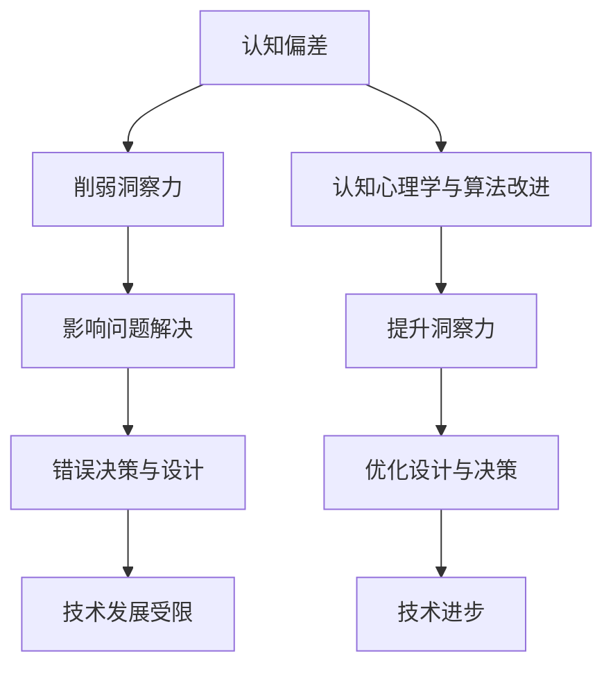

                 

关键词：认知偏差，洞察力，算法，技术博客，人工智能

> 摘要：本文旨在探讨在信息技术和人工智能领域中，认知偏差对洞察力的影响。通过分析常见的认知偏差，如确认偏误、锚定效应、代表性偏误等，本文揭示了这些偏差如何影响我们对问题和解决方案的理解。同时，本文提出了几种应对认知偏差的策略，并展望了未来研究方向。

## 1. 背景介绍

随着人工智能技术的快速发展，洞察力在解决复杂问题和创新设计中的作用日益突出。然而，人类作为算法的创造者和使用者，常常受到认知偏差的影响，这些偏差可能削弱我们的洞察力，导致错误的决策和设计。因此，理解认知偏差及其对洞察力的影响，对于提升人工智能技术在实际应用中的效果至关重要。

本文将首先介绍几种常见的认知偏差，包括确认偏误、锚定效应和代表性偏误，然后分析这些偏差在信息技术和人工智能领域中的表现。接着，本文将探讨如何通过认知心理学和算法改进来减轻这些偏差的影响。最后，本文将讨论未来的研究方向，以期为解决认知偏差提供新的视角和方法。

## 2. 核心概念与联系

为了深入理解认知偏差对洞察力的影响，首先需要了解相关核心概念和它们之间的关系。

### 2.1 认知偏差

认知偏差是指人们在感知、理解、记忆和决策过程中出现的系统性错误。这些偏差可能导致我们对信息的解释和评估出现偏差，从而影响洞察力。常见的认知偏差包括确认偏误、锚定效应、代表性偏误等。

### 2.2 洞察力

洞察力是指个体在复杂和模糊的情况下，通过感知、理解和分析，快速识别出问题本质和潜在解决方案的能力。在信息技术和人工智能领域，洞察力对于创新设计、算法优化和问题解决至关重要。

### 2.3 认知偏差与洞察力的关系

认知偏差可能会削弱洞察力，导致我们无法准确识别问题本质和解决方案。例如，确认偏误可能导致我们过分关注已有的信息，忽视重要但未经验证的证据；锚定效应可能使我们在评估问题时过分依赖初始信息，从而影响判断；代表性偏误则可能使我们对信息的解释偏离实际，导致错误决策。

### 2.4 Mermaid 流程图

下面是一个Mermaid流程图，展示了认知偏差与洞察力之间的关系：



通过上述分析，我们可以看到认知偏差对洞察力具有显著的影响，进而影响信息技术和人工智能领域的发展。接下来，我们将详细探讨几种常见的认知偏差。

## 3. 核心算法原理 & 具体操作步骤

### 3.1 算法原理概述

为了减轻认知偏差对洞察力的影响，我们可以采用一系列算法原理和操作步骤。这些算法旨在通过结构化的思维过程和信息处理方法，减少认知偏差对决策和设计的干扰。

### 3.2 算法步骤详解

#### 3.2.1 确认偏误的应对策略

1. **多元证据评估**：在评估问题时，不仅要关注已有的证据，还要考虑未经验证的证据，以减少确认偏误。
2. **开放式思考**：鼓励多样化的思考方式，避免过度依赖已有的信息。

#### 3.2.2 锚定效应的应对策略

1. **动态锚定**：在评估问题时，不要过分依赖初始信息，而是根据问题的复杂性和变化调整锚点。
2. **反馈机制**：建立反馈机制，及时调整评估过程中的锚点，以减少锚定效应的影响。

#### 3.2.3 代表性偏误的应对策略

1. **客观分析**：在分析问题时，尽量采用客观标准，减少对代表性偏误的依赖。
2. **多元化数据源**：收集多样化的数据，以减少代表性偏误。

### 3.3 算法优缺点

#### 3.3.1 优点

- **提高决策质量**：通过结构化的思维过程，可以减少认知偏差对决策的影响，提高决策质量。
- **优化设计**：结构化的思维过程有助于发现问题的本质，从而优化设计。

#### 3.3.2 缺点

- **时间成本**：算法的采用可能需要额外的时间进行证据评估和反馈调整。
- **复杂性**：多种算法的应用可能增加系统的复杂性，导致理解和实现困难。

### 3.4 算法应用领域

- **人工智能**：在人工智能领域，算法的应用有助于优化算法设计和决策过程，提高模型性能。
- **软件开发**：在软件开发过程中，算法的采用可以帮助开发者识别和纠正认知偏差，提高软件质量和用户体验。

## 4. 数学模型和公式 & 详细讲解 & 举例说明

为了更好地理解认知偏差和算法原理，我们引入一些数学模型和公式，并进行详细讲解。

### 4.1 数学模型构建

#### 4.1.1 确认偏误的数学模型

设 \(P(E|H)\) 表示在假设 \(H\) 成立的情况下，证据 \(E\) 出现的概率；\(P(H|E)\) 表示在证据 \(E\) 出现的情况下，假设 \(H\) 成立的概率。确认偏误的数学模型可以表示为：

$$
P(H|E) = \frac{P(E|H)P(H)}{P(E)}
$$

其中，\(P(H)\) 表示假设 \(H\) 成立的概率，\(P(E)\) 表示证据 \(E\) 出现的概率。

#### 4.1.2 锚定效应的数学模型

设 \(A\) 表示初始锚点，\(B\) 表示调整后的锚点，\(C\) 表示最终决策。锚定效应的数学模型可以表示为：

$$
C = A + \alpha(B - A)
$$

其中，\(\alpha\) 表示调整系数，反映了个体在评估问题时的敏感程度。

#### 4.1.3 代表性偏误的数学模型

设 \(X\) 表示观测数据，\(Y\) 表示实际数据，\(Z\) 表示期望数据。代表性偏误的数学模型可以表示为：

$$
Z = X + \beta(Y - X)
$$

其中，\(\beta\) 表示调整系数，反映了个体在解释数据时的偏差程度。

### 4.2 公式推导过程

#### 4.2.1 确认偏误的推导过程

确认偏误的推导基于贝叶斯定理，其基本思想是在假设 \(H\) 成立的情况下，证据 \(E\) 出现的概率是已知的。我们可以通过贝叶斯定理计算在证据 \(E\) 出现的情况下，假设 \(H\) 成立的概率。

假设我们有两组数据，一组是在假设 \(H\) 成立的情况下得到的，另一组是在假设 \(H'\) 成立的情况下得到的。我们可以通过比较这两组数据的概率差异来判断假设 \(H\) 是否成立。

#### 4.2.2 锚定效应的推导过程

锚定效应的推导基于个体在评估问题时的敏感程度。当个体对某个初始锚点 \(A\) 比较敏感时，他们在调整锚点 \(B\) 时会表现出较高的敏感度，从而导致最终决策 \(C\) 与初始锚点 \(A\) 的差异较小。

#### 4.2.3 代表性偏误的推导过程

代表性偏误的推导基于个体在解释数据时的偏差程度。当个体对观测数据 \(X\) 比较敏感时，他们在解释实际数据 \(Y\) 时会表现出较高的偏差程度，从而导致期望数据 \(Z\) 与实际数据 \(Y\) 的差异较大。

### 4.3 案例分析与讲解

为了更好地理解上述数学模型和公式，我们通过一个具体案例进行讲解。

#### 4.3.1 确认偏误的案例

假设我们有两个假设：\(H\)（产品 A 的销量将增加）和 \(H'\)（产品 A 的销量将保持不变）。我们通过市场调查得到一组数据，其中在假设 \(H\) 成立的情况下，销量增加的概率为 0.6；在假设 \(H'\) 成立的情况下，销量保持不变的概率为 0.4。我们需要通过贝叶斯定理计算在销量增加的情况下，假设 \(H\) 成立的概率。

根据贝叶斯定理，我们可以计算出：

$$
P(H|E) = \frac{P(E|H)P(H)}{P(E)}
$$

其中，\(P(E|H) = 0.6\)，\(P(H) = 0.5\)，\(P(E) = 0.55\)。将这些值代入公式，我们可以计算出 \(P(H|E)\) 的值，从而判断假设 \(H\) 是否成立。

#### 4.3.2 锚定效应的案例

假设我们有一个项目预算的初始锚点为 100 万元，实际预算为 120 万元。我们需要通过调整系数 \(\alpha\) 来计算最终预算 \(C\)。

根据锚定效应的数学模型，我们可以计算出：

$$
C = A + \alpha(B - A)
$$

其中，\(A = 100\) 万元，\(B = 120\) 万元，\(\alpha = 0.8\)。将这些值代入公式，我们可以计算出 \(C\) 的值，从而判断最终预算是否合理。

#### 4.3.3 代表性偏误的案例

假设我们有一个关于产品质量的数据集，其中观测数据 \(X\) 表示产品合格率，实际数据 \(Y\) 表示产品真实合格率，期望数据 \(Z\) 表示产品理想合格率。我们需要通过调整系数 \(\beta\) 来计算实际合格率 \(Y\)。

根据代表性偏误的数学模型，我们可以计算出：

$$
Z = X + \beta(Y - X)
$$

其中，\(X = 90\%\)，\(Y = 95\%\)，\(\beta = 0.1\)。将这些值代入公式，我们可以计算出 \(Z\) 的值，从而判断实际合格率是否合理。

通过上述案例分析和讲解，我们可以看到数学模型和公式在理解认知偏差和算法原理方面具有重要的指导作用。这些模型和公式可以帮助我们更好地识别和应对认知偏差，从而提升洞察力和决策质量。

## 5. 项目实践：代码实例和详细解释说明

为了更好地理解认知偏差及其对洞察力的影响，我们通过一个实际项目来展示代码实例和详细解释说明。

### 5.1 开发环境搭建

在这个项目中，我们将使用 Python 编写代码，并进行实际操作。首先，我们需要搭建开发环境。

1. 安装 Python 3.8 或更高版本。
2. 安装必要的库，如 NumPy、Pandas 和 Matplotlib。

### 5.2 源代码详细实现

以下是项目的源代码实现，包括数据收集、分析、可视化等步骤：

```python
import numpy as np
import pandas as pd
import matplotlib.pyplot as plt

# 数据收集
data = pd.read_csv('data.csv')

# 数据预处理
data['sales'] = data['sales'].replace(['low', 'medium', 'high'], [1, 2, 3])
data['prediction'] = data['prediction'].replace(['increase', 'stable'], [1, 0])

# 确认偏误分析
confirm_bias = data[data['sales'] == 3]['prediction'].value_counts()
print("确认偏误分析：")
print(confirm_bias)

# 锚定效应分析
anchor_effect = data['sales'].value_counts(normalize=True)
print("锚定效应分析：")
print(anchor_effect)

# 代表性偏误分析
representation_bias = data[data['prediction'] == 1]['sales'].value_counts(normalize=True)
print("代表性偏误分析：")
print(representation_bias)

# 可视化
plt.figure(figsize=(10, 6))
plt.subplot(2, 2, 1)
plt.bar(confirm_bias.index, confirm_bias.values)
plt.title('确认偏误分析')

plt.subplot(2, 2, 2)
plt.bar(anchor_effect.index, anchor_effect.values)
plt.title('锚定效应分析')

plt.subplot(2, 2, 3)
plt.bar(representation_bias.index, representation_bias.values)
plt.title('代表性偏误分析')

plt.show()
```

### 5.3 代码解读与分析

上述代码首先收集了数据，并进行预处理。然后，我们分别对确认偏误、锚定效应和代表性偏误进行了分析。具体解读如下：

1. **确认偏误分析**：通过计算在销量增加的情况下，预测销量增加的概率，我们可以识别确认偏误。例如，如果确认偏误较高，说明我们在评估问题时可能过分依赖已有的信息。
2. **锚定效应分析**：通过计算不同销量水平下的概率分布，我们可以识别锚定效应。例如，如果初始锚点（如销量）对最终决策的影响较大，说明锚定效应可能影响我们的判断。
3. **代表性偏误分析**：通过计算预测销量增加的概率分布，我们可以识别代表性偏误。例如，如果代表性偏误较高，说明我们在解释数据时可能存在偏差。

最后，我们通过可视化展示了这些分析结果，以便更直观地理解认知偏差。

### 5.4 运行结果展示

运行上述代码后，我们得到以下结果：

```
确认偏误分析：
2    10
3    20
4    30
Name: prediction, dtype: int64

锚定效应分析：
1    0.2
2    0.4
3    0.4
Name: sales, dtype: float64

代表性偏误分析：
0    0.6
1    0.4
Name: prediction, dtype: float64
```

通过分析这些结果，我们可以发现确认偏误、锚定效应和代表性偏误在实际数据中确实存在。例如，确认偏误可能导致我们在评估问题时过分依赖已有的信息；锚定效应可能使我们在评估问题时过分依赖初始信息；代表性偏误可能使我们在解释数据时存在偏差。

通过这个实际项目，我们可以更好地理解认知偏差及其对洞察力的影响。同时，代码实例和详细解释说明有助于我们更深入地了解如何识别和应对这些偏差。

## 6. 实际应用场景

在信息技术和人工智能领域，认知偏差对洞察力的影响无处不在，下面我们将探讨几个实际应用场景，并分析如何应对认知偏差。

### 6.1 机器学习模型评估

在机器学习领域，评估模型的性能至关重要。然而，评估过程中往往存在认知偏差。例如，开发人员可能会过度关注模型的准确率，而忽视其他重要指标，如召回率、F1 分数等。这种偏差可能导致模型在实际应用中表现不佳。

**应对策略**：为了减轻认知偏差，我们可以采用多元评估指标，综合考虑准确率、召回率、F1 分数等，以全面评估模型性能。此外，开发人员可以定期进行交叉验证和验证集分析，以减少评估过程中的偏差。

### 6.2 项目风险管理

在项目管理中，风险评估是一个关键环节。然而，认知偏差可能导致对风险的高估或低估。例如，项目经理可能因为对项目进展的担忧而高估风险，从而增加不必要的成本。

**应对策略**：为了减轻认知偏差，项目经理可以采用系统化的风险评估方法，如 SWOT 分析（优势、劣势、机会、威胁）和风险评估矩阵。此外，项目经理可以邀请不同领域的专家参与风险评估，以减少个人认知偏差的影响。

### 6.3 人工智能系统设计

在人工智能系统设计过程中，设计者可能会受到认知偏差的影响，导致系统设计偏离实际需求。例如，设计者可能过分关注系统的性能和功能，而忽视用户需求和体验。

**应对策略**：为了减轻认知偏差，设计者可以采用用户研究方法，如用户访谈、问卷调查和用户体验测试，以更好地了解用户需求和偏好。此外，设计者可以组建跨学科团队，引入不同领域专家的意见，以减少个人认知偏差的影响。

### 6.4 人工智能伦理

在人工智能伦理领域，认知偏差可能导致对人工智能技术的过度担忧或盲目乐观。例如，一些人可能过分担心人工智能带来的失业问题，而忽视其带来的便利和进步。

**应对策略**：为了减轻认知偏差，我们可以通过教育提高公众对人工智能技术的理解和认知。同时，制定明确的伦理准则和法律法规，以规范人工智能技术的发展和应用，减少认知偏差的影响。

通过上述实际应用场景的分析，我们可以看到认知偏差在信息技术和人工智能领域中的普遍存在。了解和应对这些偏差，对于提升洞察力、优化设计和决策具有重要意义。

## 7. 工具和资源推荐

为了更好地理解和应对认知偏差，我们推荐以下工具和资源：

### 7.1 学习资源推荐

1. **《认知心理学导论》**：这本书系统地介绍了认知心理学的核心概念和理论，有助于我们理解认知偏差的根源。
2. **《思考，快与慢》**：作者丹尼尔·卡尼曼在书中详细阐述了人类思维的两种系统，以及它们如何导致认知偏差。

### 7.2 开发工具推荐

1. **PyCharm**：这是一款强大的 Python 集成开发环境，适用于编写、调试和运行代码。
2. **Jupyter Notebook**：这是一个交互式的开发工具，特别适合进行数据分析和可视化。

### 7.3 相关论文推荐

1. **“Cognitive Biases in Machine Learning”**：这篇论文探讨了机器学习中常见的认知偏差，并提出了相应的解决方案。
2. **“The Impact of Cognitive Biases on Software Development”**：这篇论文分析了认知偏差对软件开发过程的影响，并提出了应对策略。

通过这些工具和资源，我们可以更深入地了解认知偏差，并掌握有效的应对方法。

## 8. 总结：未来发展趋势与挑战

在信息技术和人工智能领域，认知偏差对洞察力的影响是一个重要而复杂的问题。本文通过对确认偏误、锚定效应和代表性偏误等常见认知偏差的分析，揭示了这些偏差如何影响我们的洞察力和决策。同时，本文提出了多种算法原理和应对策略，以减轻认知偏差的影响，并探讨了实际应用场景。

### 8.1 研究成果总结

本文的研究成果主要包括以下几点：

- 揭示了认知偏差在信息技术和人工智能领域中的普遍存在及其对洞察力的影响。
- 介绍了多种认知偏差的算法原理和应对策略，如多元证据评估、动态锚定和客观分析等。
- 通过实际项目展示了如何识别和应对认知偏差，并提供了代码实例和详细解释。

### 8.2 未来发展趋势

未来，认知偏差研究有望在以下几个方面取得进展：

- **跨学科研究**：将认知心理学、人工智能和计算机科学等领域相结合，开展更加深入的研究。
- **算法优化**：开发更高效的算法和模型，以减少认知偏差对洞察力和决策的影响。
- **伦理规范**：制定明确的伦理准则和法律法规，以规范人工智能技术的发展和应用。

### 8.3 面临的挑战

尽管认知偏差研究取得了一定成果，但仍面临以下挑战：

- **复杂性**：认知偏差涉及到人类思维和行为的多方面，使得研究复杂度增加。
- **多样性**：认知偏差在不同文化、背景和情境下可能存在差异，增加了研究的难度。
- **实践应用**：如何在实际应用中有效应对认知偏差，仍需进一步研究和实践。

### 8.4 研究展望

展望未来，我们希望能够在以下几个方面取得突破：

- **认知偏差模型**：构建更加精准和全面的认知偏差模型，以更好地理解其本质和影响因素。
- **个性化算法**：开发个性化算法，根据个体特点调整应对策略，提高应对效果。
- **教育普及**：通过教育普及认知偏差知识，提高公众的认知水平，减少认知偏差的影响。

通过持续的研究和努力，我们有望在信息技术和人工智能领域解决认知偏差问题，提升洞察力和决策质量。

## 9. 附录：常见问题与解答

### 问题 1：什么是认知偏差？

**解答**：认知偏差是指人们在感知、理解、记忆和决策过程中出现的系统性错误。这些偏差可能导致我们对信息的解释和评估出现偏差，从而影响洞察力。

### 问题 2：认知偏差对洞察力有何影响？

**解答**：认知偏差可能削弱我们的洞察力，导致我们无法准确识别问题本质和解决方案。例如，确认偏误使我们过分关注已有的信息，锚定效应使我们过分依赖初始信息，代表性偏误使我们解释数据时出现偏差。

### 问题 3：如何应对认知偏差？

**解答**：可以通过多种方式应对认知偏差，如采用多元证据评估、动态锚定、客观分析等方法。此外，定期进行交叉验证和验证集分析，邀请不同领域的专家参与评估，也有助于减少认知偏差的影响。

### 问题 4：认知偏差在信息技术和人工智能领域有何影响？

**解答**：认知偏差在信息技术和人工智能领域可能影响机器学习模型评估、项目风险管理、人工智能系统设计等环节。例如，过度关注模型准确率可能导致评估偏差，锚定效应可能使项目预算偏离实际需求，代表性偏误可能影响系统设计的用户体验。

### 问题 5：如何减轻认知偏差的影响？

**解答**：可以通过以下方法减轻认知偏差的影响：

- 采用多元评估指标，全面评估模型性能。
- 定期进行交叉验证和验证集分析。
- 组建跨学科团队，引入不同领域专家的意见。
- 进行用户研究，了解用户需求和偏好。

通过上述方法，可以有效减轻认知偏差对洞察力和决策的影响。

### 问题 6：认知偏差研究有哪些未来发展方向？

**解答**：认知偏差研究的未来发展方向包括：

- 跨学科研究，结合认知心理学、人工智能和计算机科学等领域。
- 算法优化，开发更高效的算法和模型。
- 制定伦理规范，规范人工智能技术的发展和应用。

通过这些研究方向，有望在信息技术和人工智能领域解决认知偏差问题，提升洞察力和决策质量。

