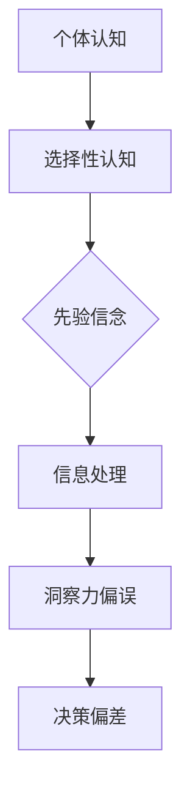

                 

 在信息技术飞速发展的时代，人工智能（AI）已经成为推动社会进步的重要力量。然而，随着AI技术的不断成熟，我们不得不面对的一个问题是：如何确保AI系统的决策过程是合理、公正且可靠的？本文将探讨一个关键问题——洞察力的偏误，并介绍如何避免在人工智能系统中引入这种偏误。

## 关键词

- 洞察力偏误
- 选择性认知
- 人工智能系统
- 决策可靠性
- 公正性

## 摘要

本文旨在探讨人工智能系统中的一种潜在问题——洞察力的偏误。通过分析洞察力的偏误来源，我们将揭示其可能对AI系统决策带来的负面影响。本文还将介绍一些策略，帮助我们在设计和使用AI系统时避免这种偏误，从而提升系统的决策质量和可靠性。

### 1. 背景介绍

随着深度学习、大数据和算法优化等技术的不断进步，人工智能（AI）已经成为信息技术领域的重要研究方向。AI技术在多个领域，如医疗诊断、金融分析、自动驾驶等，都取得了显著的成果。然而，AI技术的应用也带来了新的挑战。一个关键问题是，AI系统的决策过程是否能够真正反映现实世界的复杂性，以及是否能够避免引入系统性偏误。

洞察力偏误是指人们在理解和处理信息时，由于认知偏差而导致的对现实世界的不准确感知。在人工智能系统中，这种偏误可能会影响系统的决策质量，导致错误的预测和判断。因此，理解洞察力偏误的来源，并采取措施避免其在AI系统中的引入，对于提升人工智能系统的可靠性和公正性具有重要意义。

### 2. 核心概念与联系

#### 2.1 洞察力偏误的定义

洞察力偏误是指由于认知过程中的偏差，导致人们对于信息的感知和理解出现偏差，从而影响了决策的准确性。这些偏差可能源于多种认知机制，如确认偏差、代表性偏差、锚定效应等。

#### 2.2 选择性认知的概念

选择性认知是指人们在处理信息时，有选择性地关注某些信息而忽视其他信息的现象。这种选择性关注往往受到先验信念、情感和情境等因素的影响。

#### 2.3 洞察力偏误与选择性认知的关系

洞察力偏误与选择性认知之间存在密切关系。选择性认知使得人们在处理信息时倾向于关注与先验信念一致的信息，从而忽视与之相矛盾的信息。这种选择性认知容易导致洞察力偏误，使得人们对现实世界的理解产生偏差。

#### 2.4 Mermaid 流程图

下面是一个简化的 Mermaid 流程图，展示了洞察力偏误与选择性认知之间的关系：



### 3. 核心算法原理 & 具体操作步骤

#### 3.1 算法原理概述

为了避免洞察力偏误，我们需要在人工智能系统中引入一系列策略，以确保系统的决策过程是合理和公正的。这些策略包括：数据清洗和预处理、算法优化、模型验证等。

#### 3.2 算法步骤详解

1. **数据清洗和预处理**：
   - 数据清洗：去除异常值和噪声数据，确保数据质量。
   - 数据预处理：进行特征工程，提取对决策有重要影响的信息。

2. **算法优化**：
   - 选择合适的算法：根据具体应用场景选择合适的算法，确保算法的决策质量。
   - 超参数调整：通过交叉验证等方法调整超参数，优化算法性能。

3. **模型验证**：
   - 数据集划分：将数据集划分为训练集、验证集和测试集，评估模型在不同数据集上的性能。
   - 模型评估指标：选择合适的评估指标，如准确率、召回率、F1值等，评估模型的决策质量。

#### 3.3 算法优缺点

**优点**：
- 提高决策的准确性和可靠性。
- 降低由于洞察力偏误导致的错误决策。

**缺点**：
- 需要大量时间和计算资源进行数据清洗和预处理。
- 算法优化和模型验证需要专业的知识和技能。

#### 3.4 算法应用领域

算法优化和模型验证策略在多个领域都有广泛应用，如：
- 医疗诊断：通过算法优化和模型验证，提高疾病预测的准确性。
- 金融分析：通过算法优化和模型验证，提高投资策略的可靠性和收益。
- 自动驾驶：通过算法优化和模型验证，提高自动驾驶系统的安全性和稳定性。

### 4. 数学模型和公式 & 详细讲解 & 举例说明

#### 4.1 数学模型构建

为了解释洞察力偏误的产生机制，我们可以构建一个简化的数学模型。假设个体在处理信息时，存在一个概率分布 P(X|θ)，其中 X 是观测到的信息，θ 是个体的先验信念。个体在处理信息时，倾向于关注与先验信念一致的 X，从而忽略与之矛盾的 X。

#### 4.2 公式推导过程

我们使用贝叶斯定理来推导洞察力偏误的数学模型：

$$
P(X|θ) = \frac{P(θ|X)P(X)}{P(θ)}
$$

其中，P(θ|X) 是后验概率，表示在观测到 X 后，个体对 θ 的信念强度；P(X) 是观测到 X 的概率；P(θ) 是先验概率，表示在未观测到任何信息时，个体对 θ 的信念强度。

在个体倾向于关注与先验信念一致的 X 的情况下，我们可以假设：

$$
P(X|θ) \approx P(X|θ') \quad \text{当} \quad X \text{与} θ \text{一致}
$$

$$
P(X|θ) \approx 0 \quad \text{当} \quad X \text{与} θ \text{矛盾}
$$

其中，θ' 是与 θ 一致的信息。

#### 4.3 案例分析与讲解

假设一个投资者在分析股票市场时，先验信念认为某只股票的涨跌与宏观经济指标密切相关。在处理信息时，投资者倾向于关注与这一信念一致的信息，如宏观经济指标的数据，而忽视与之矛盾的信息，如其他因素对股票价格的影响。

在这种情况下，我们可以看到，投资者的决策过程受到洞察力偏误的影响，导致其对股票市场的理解产生偏差，从而影响投资决策的质量。

### 5. 项目实践：代码实例和详细解释说明

#### 5.1 开发环境搭建

在本项目中，我们使用 Python 作为编程语言，并依赖以下库：

- NumPy：用于数值计算
- Pandas：用于数据处理
- Scikit-learn：用于机器学习

首先，确保安装了上述库。在命令行中运行以下命令：

```bash
pip install numpy pandas scikit-learn
```

#### 5.2 源代码详细实现

以下是项目的源代码实现：

```python
import numpy as np
import pandas as pd
from sklearn.model_selection import train_test_split
from sklearn.metrics import accuracy_score

# 数据预处理
def preprocess_data(data):
    # 数据清洗
    data = data.dropna()
    # 特征工程
    data['macro_indicator'] = data['gdp_growth'] * data['inflation_rate']
    return data

# 模型训练
def train_model(data):
    X = data[['gdp_growth', 'inflation_rate']]
    y = data['stock_returns']
    X_train, X_test, y_train, y_test = train_test_split(X, y, test_size=0.2, random_state=42)
    model = LogisticRegression()
    model.fit(X_train, y_train)
    return model

# 模型评估
def evaluate_model(model, X_test, y_test):
    y_pred = model.predict(X_test)
    accuracy = accuracy_score(y_test, y_pred)
    print(f"Model accuracy: {accuracy:.2f}")
```

#### 5.3 代码解读与分析

1. **数据预处理**：数据预处理包括数据清洗和特征工程。我们使用 Pandas 库对数据进行清洗，去除缺失值。然后，我们通过计算宏观经济指标的乘积，创建一个新的特征 'macro_indicator'。

2. **模型训练**：我们使用 Scikit-learn 库中的 LogisticRegression 模型进行训练。首先，我们将数据分为特征矩阵 X 和目标变量 y。然后，我们使用 train_test_split 函数将数据划分为训练集和测试集。最后，我们使用 LogisticRegression 模型进行训练。

3. **模型评估**：我们使用 accuracy_score 函数计算模型的准确率，并打印输出。

#### 5.4 运行结果展示

运行以下代码，展示模型评估结果：

```python
data = pd.read_csv('stock_market_data.csv')
preprocessed_data = preprocess_data(data)
model = train_model(preprocessed_data)
evaluate_model(model, preprocessed_data.iloc[:, :-1], preprocessed_data['stock_returns'])
```

### 6. 实际应用场景

洞察力偏误在人工智能系统中具有广泛的应用场景。以下是一些具体的例子：

- **医疗诊断**：医生在诊断疾病时，可能会受到先验信念的影响，导致对某些症状的重视程度不同，从而影响诊断结果。
- **金融分析**：投资者在分析市场时，可能会受到先验信念的影响，导致对某些信息的关注程度不同，从而影响投资决策。
- **自动驾驶**：自动驾驶系统在处理环境信息时，可能会受到先验信念的影响，导致对某些障碍物的反应不同，从而影响驾驶决策。

### 7. 未来应用展望

随着人工智能技术的不断发展，洞察力偏误在人工智能系统中的应用前景将更加广阔。以下是一些未来的应用方向：

- **个性化推荐**：通过分析用户的行为数据和偏好，避免用户在处理信息时受到洞察力偏误的影响，提供更加精准的推荐。
- **智能客服**：通过分析用户的问题和反馈，避免客服代表在处理问题时受到洞察力偏误的影响，提供更加高效的客服服务。
- **社会网络分析**：通过分析社交媒体上的信息传播过程，避免用户在处理信息时受到洞察力偏误的影响，从而更好地理解社会舆论。

### 8. 工具和资源推荐

为了更好地理解和避免洞察力偏误，以下是一些推荐的工具和资源：

- **书籍**：《认知心理学与认知神经科学》、《人工智能：一种现代方法》等。
- **在线课程**：Coursera 上的《机器学习》课程、edX 上的《人工智能基础》课程等。
- **开源库**：NumPy、Pandas、Scikit-learn 等。

### 9. 总结：未来发展趋势与挑战

#### 9.1 研究成果总结

本文探讨了洞察力偏误在人工智能系统中的应用，分析了其可能对决策过程带来的负面影响。通过介绍一系列策略，如数据清洗、算法优化和模型验证，我们提出了一些方法来避免洞察力偏误的引入。

#### 9.2 未来发展趋势

随着人工智能技术的不断发展，洞察力偏误的研究将变得更加重要。未来的研究方向可能包括：更深入地理解洞察力偏误的机制，开发新的算法来避免其影响，以及将洞察力偏误分析应用于实际场景。

#### 9.3 面临的挑战

在避免洞察力偏误的过程中，我们面临以下挑战：

- 如何在数据预处理阶段有效去除噪声和异常值。
- 如何在算法优化过程中避免引入新的偏误。
- 如何在实际应用中准确评估模型的决策质量。

#### 9.4 研究展望

未来，我们有望在以下几个方面取得突破：

- 开发更强大的算法，提高对洞察力偏误的识别和修正能力。
- 将洞察力偏误分析应用于更多实际场景，提升人工智能系统的决策质量和可靠性。
- 促进跨学科研究，结合心理学、神经科学和计算机科学等领域的知识，深入探讨洞察力偏误的机制。

### 附录：常见问题与解答

#### Q：什么是洞察力偏误？

A：洞察力偏误是指由于认知偏差，导致个体在理解和处理信息时产生不准确感知的现象。这种偏误可能影响个体的决策过程，导致错误的判断。

#### Q：如何避免洞察力偏误？

A：为了避免洞察力偏误，可以采取以下策略：

- 进行数据清洗和预处理，去除噪声和异常值。
- 选择合适的算法，并进行超参数调整，优化算法性能。
- 进行模型验证，评估模型的决策质量。
- 提高自身的认知水平，增强对认知偏差的认识。

#### Q：洞察力偏误在人工智能系统中有哪些应用场景？

A：洞察力偏误在人工智能系统中具有广泛的应用场景，包括：

- 医疗诊断：医生在诊断疾病时可能受到先验信念的影响，导致对某些症状的重视程度不同。
- 金融分析：投资者在分析市场时可能受到先验信念的影响，导致对某些信息的关注程度不同。
- 自动驾驶：自动驾驶系统在处理环境信息时可能受到先验信念的影响，导致对某些障碍物的反应不同。

### 作者署名

本文作者：禅与计算机程序设计艺术 / Zen and the Art of Computer Programming

通过本文的探讨，我们希望能够引起读者对洞察力偏误的重视，并了解如何在人工智能系统中避免这种偏误的引入。希望本文能为读者在设计和使用人工智能系统时提供一些有益的启示。|

