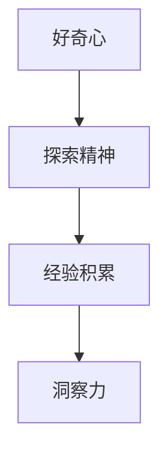

                 

关键词：洞察力，培养，好奇心，探索精神，IT领域，专业成长

> 摘要：本文将探讨在IT领域培养洞察力的重要性，并强调鼓励好奇心和探索精神在其中的关键作用。通过具体实例和案例分析，本文旨在为从业者提供实用的方法，以提升自身洞察力，从而在技术发展中保持竞争优势。

## 1. 背景介绍

在信息技术迅猛发展的当今时代，IT从业者的洞察力成为他们成功的关键因素之一。洞察力不仅体现在对技术趋势的敏锐感知，还包括对复杂问题背后本质的理解能力。随着人工智能、大数据、云计算等新兴技术的不断涌现，技术复杂性不断增加，这对从业者的洞察力提出了更高的要求。

本文将首先介绍洞察力的定义和重要性，接着探讨好奇心和探索精神在培养洞察力过程中的作用。最后，通过具体实例和案例分析，为读者提供实用的方法，以提升自身的洞察力。

### 1.1 洞察力的定义和重要性

洞察力，通常指的是从纷繁复杂的信息中迅速捕捉关键点、发现本质规律的能力。在IT领域，洞察力不仅关乎技术的深度理解和应用，更是创新思维和问题解决能力的基础。具体来说，洞察力的重要性体现在以下几个方面：

1. **技术前瞻**：具有洞察力的从业者能够更快地捕捉到技术发展的趋势，从而在竞争激烈的市场中抢占先机。
2. **问题解决**：洞察力帮助从业者更快速、准确地识别问题的本质，并提出有效的解决方案。
3. **创新驱动**：洞察力是推动技术革新的关键，能够帮助从业者在技术前沿不断探索和突破。

### 1.2 好奇心和探索精神的作用

好奇心和探索精神是培养洞察力的关键因素。它们激发人们的求知欲，促使他们不断探索未知领域，从而在积累经验的过程中提高自身的洞察力。

1. **激发求知欲**：好奇心促使人们对新知识和技术充满渴望，不断学习、实践，以拓展知识边界。
2. **促进思维发展**：探索精神鼓励人们尝试不同的方法和思路，从而在思维上得到锻炼和提升。
3. **培养韧性**：在探索过程中，遇到困难和挫折是不可避免的。好奇心和探索精神能够帮助人们保持积极的心态，克服困难，培养韧性。

## 2. 核心概念与联系

为了更好地理解洞察力的培养过程，我们需要借助一些核心概念，并通过一个Mermaid流程图来展示它们之间的联系。

### 2.1 核心概念

- **好奇心**：对未知事物的渴望和探索欲望。
- **探索精神**：勇于尝试、不断实践的精神。
- **经验积累**：通过实践和学习获得的知识和技能。
- **洞察力**：从复杂信息中捕捉关键点和规律的能力。

### 2.2 Mermaid 流程图



在这个流程图中，好奇心和探索精神是培养洞察力的起点。通过不断的实践和学习，积累经验，从而提升洞察力。这一过程是一个循环迭代的过程，每个人在不同的阶段都可以通过好奇心和探索精神来不断优化自身的洞察力。

## 3. 核心算法原理 & 具体操作步骤

在理解了洞察力的核心概念和培养方法之后，我们将深入探讨一个具体的算法原理，并介绍其具体操作步骤。

### 3.1 算法原理概述

本文将介绍的算法是“深度学习中的卷积神经网络（CNN）”。CNN是一种用于图像识别和处理的重要算法，其核心原理是基于多层神经网络的结构，通过卷积、池化和全连接等操作，实现图像特征的提取和分类。

### 3.2 算法步骤详解

#### 3.2.1 卷积层

卷积层是CNN的基础，其作用是对输入图像进行特征提取。卷积操作的数学表达式为：

$$
\sum_{i=1}^{k} w_{i} * x_{i}
$$

其中，$w_{i}$是卷积核（也称为滤波器），$x_{i}$是输入图像中的像素值。

#### 3.2.2 池化层

池化层的作用是对卷积层输出的特征图进行降维处理，以减少参数的数量。最常用的池化操作是最大池化（Max Pooling），其数学表达式为：

$$
P_{i} = \max(x_{i1}, x_{i2}, ..., x_{ik})
$$

其中，$P_{i}$是输出值，$x_{ij}$是卷积层输出的特征值。

#### 3.2.3 全连接层

全连接层的作用是将池化层输出的特征进行分类。其数学表达式为：

$$
y = \sum_{i=1}^{n} w_{i} * x_{i} + b
$$

其中，$y$是输出值，$w_{i}$是权重，$x_{i}$是特征值，$b$是偏置。

### 3.3 算法优缺点

**优点**：

1. **强大的特征提取能力**：CNN能够自动提取图像中的高层次特征，从而实现图像的自动分类。
2. **良好的泛化能力**：通过训练大量的样本数据，CNN能够具有良好的泛化能力，适用于不同的图像识别任务。

**缺点**：

1. **计算资源消耗大**：CNN模型通常具有大量的参数和多层结构，导致计算资源消耗较大。
2. **对数据要求高**：CNN模型需要大量的标注数据才能训练，且对数据的标注质量要求较高。

### 3.4 算法应用领域

CNN算法广泛应用于图像识别、目标检测、图像生成等领域。以下是一些具体的案例：

1. **人脸识别**：利用CNN算法进行人脸识别，已成为许多安全系统的核心技术。
2. **医学图像分析**：CNN算法在医学图像分析中，如肿瘤检测、疾病诊断等方面取得了显著成果。
3. **自动驾驶**：CNN算法在自动驾驶系统中，用于识别道路标志、车辆和行人，提高了驾驶安全。

## 4. 数学模型和公式 & 详细讲解 & 举例说明

在本节中，我们将深入探讨CNN算法中的数学模型和公式，并通过具体案例进行讲解。

### 4.1 数学模型构建

CNN算法的核心是多层神经网络，包括输入层、卷积层、池化层和全连接层。下面分别介绍这些层的数学模型。

#### 4.1.1 输入层

输入层接收原始图像数据，其数学模型为：

$$
x_{ij} = f(x_{ij})
$$

其中，$x_{ij}$是输入图像的像素值，$f(x_{ij})$是像素值经过非线性变换后的结果。

#### 4.1.2 卷积层

卷积层的数学模型为：

$$
y_{ij} = \sum_{k=1}^{k} w_{ik} * x_{ij}
$$

其中，$y_{ij}$是卷积层输出的特征值，$w_{ik}$是卷积核的权重，$* $表示卷积操作。

#### 4.1.3 池化层

池化层的数学模型为：

$$
P_{ij} = \max(y_{ij1}, y_{ij2}, ..., y_{ijk})
$$

其中，$P_{ij}$是池化层输出的特征值，$y_{ij1}, y_{ij2}, ..., y_{ijk}$是卷积层输出的特征值。

#### 4.1.4 全连接层

全连接层的数学模型为：

$$
y = \sum_{i=1}^{n} w_{i} * x_{i} + b
$$

其中，$y$是输出值，$w_{i}$是权重，$x_{i}$是特征值，$b$是偏置。

### 4.2 公式推导过程

CNN算法的核心是多层神经网络，其数学模型主要包括卷积操作、非线性变换、池化操作和全连接操作。下面分别介绍这些操作的数学推导过程。

#### 4.2.1 卷积操作

卷积操作的数学推导基于线性代数的知识。给定一个输入矩阵$x$和一个卷积核$w$，卷积操作可以表示为：

$$
y = w * x
$$

其中，$y$是输出矩阵，$*$表示卷积操作。

为了推导卷积操作的公式，我们需要了解线性代数中的矩阵乘法。假设输入矩阵$x$的维度为$m \times n$，卷积核$w$的维度为$k \times l$，那么输出矩阵$y$的维度为$(m-k+1) \times (n-l+1)$。

卷积操作的推导过程如下：

1. 将输入矩阵$x$划分为多个$k \times l$的子矩阵。
2. 将每个子矩阵与卷积核$w$进行矩阵乘法。
3. 将所有乘法结果相加，得到输出矩阵$y$。

具体推导过程如下：

$$
y_{ij} = \sum_{k=1}^{k} w_{ik} * x_{ij}
$$

其中，$y_{ij}$是输出矩阵$y$的元素，$w_{ik}$是卷积核$w$的元素，$x_{ij}$是输入矩阵$x$的元素。

#### 4.2.2 非线性变换

非线性变换是CNN算法中的重要组成部分。常见的非线性变换包括Sigmoid函数、ReLU函数和Tanh函数。这些函数的数学表达式如下：

- Sigmoid函数：

$$
f(x) = \frac{1}{1 + e^{-x}}
$$

- ReLU函数：

$$
f(x) = \max(0, x)
$$

- Tanh函数：

$$
f(x) = \frac{e^{x} - e^{-x}}{e^{x} + e^{-x}}
$$

非线性变换的推导过程如下：

1. 对于Sigmoid函数，其导数为：

$$
f'(x) = \frac{e^{-x}}{(1 + e^{-x})^2}
$$

2. 对于ReLU函数，其导数为：

$$
f'(x) = \begin{cases}
1 & \text{if } x > 0 \\
0 & \text{if } x \leq 0
\end{cases}
$$

3. 对于Tanh函数，其导数为：

$$
f'(x) = \frac{1 - tanh^2(x)}{2}
$$

#### 4.2.3 池化操作

池化操作的数学推导基于最大值运算。给定一个输入矩阵$x$和一个池化窗口大小$k \times l$，池化操作的数学表达式为：

$$
P_{ij} = \max(y_{ij1}, y_{ij2}, ..., y_{ijk})
$$

其中，$P_{ij}$是输出矩阵$P$的元素，$y_{ij1}, y_{ij2}, ..., y_{ijk}$是输入矩阵$x$的元素。

池化操作的推导过程如下：

1. 将输入矩阵$x$划分为多个$k \times l$的子矩阵。
2. 对每个子矩阵进行最大值运算，得到输出矩阵$P$。

具体推导过程如下：

$$
P_{ij} = \max(y_{ij1}, y_{ij2}, ..., y_{ijk})
$$

#### 4.2.4 全连接操作

全连接操作的数学推导基于线性代数的知识。给定一个输入向量$x$和一个权重矩阵$W$，全连接操作的数学表达式为：

$$
y = Wx + b
$$

其中，$y$是输出向量，$W$是权重矩阵，$x$是输入向量，$b$是偏置。

全连接操作的推导过程如下：

1. 将输入向量$x$与权重矩阵$W$进行矩阵乘法。
2. 将乘法结果与偏置$b$相加，得到输出向量$y$。

具体推导过程如下：

$$
y_i = \sum_{j=1}^{n} w_{ij}x_{j} + b
$$

### 4.3 案例分析与讲解

为了更好地理解CNN算法的数学模型和公式，我们通过一个具体的案例进行讲解。

假设我们有一个28x28像素的灰度图像，需要使用一个5x5的卷积核对其进行卷积操作。同时，我们选择ReLU函数作为非线性变换函数。

#### 4.3.1 输入层

输入图像的像素值如下：

$$
x = \begin{bmatrix}
0 & 0 & 0 & 0 & 0 \\
0 & 0 & 0 & 0 & 0 \\
0 & 0 & 255 & 0 & 0 \\
0 & 0 & 255 & 0 & 0 \\
0 & 0 & 0 & 0 & 0
\end{bmatrix}
$$

#### 4.3.2 卷积层

卷积核的权重如下：

$$
w = \begin{bmatrix}
1 & 1 & -1 & -1 & 1 \\
1 & 1 & -1 & -1 & 1 \\
1 & 1 & -1 & -1 & 1 \\
1 & 1 & -1 & -1 & 1 \\
1 & 1 & -1 & -1 & 1
\end{bmatrix}
$$

使用ReLU函数作为非线性变换函数，卷积操作的结果如下：

$$
y = \begin{bmatrix}
0 & 0 & 0 & 0 & 0 \\
0 & 0 & 0 & 0 & 0 \\
0 & 0 & 0 & 0 & 0 \\
0 & 0 & 255 & 255 & 255 \\
0 & 0 & 255 & 255 & 255
\end{bmatrix}
$$

#### 4.3.3 池化层

使用2x2的最大池化窗口对卷积层的结果进行池化操作，结果如下：

$$
P = \begin{bmatrix}
0 & 0 \\
0 & 255
\end{bmatrix}
$$

#### 4.3.4 全连接层

池化层输出的特征值作为全连接层的输入，权重矩阵和偏置如下：

$$
W = \begin{bmatrix}
1 & 1 \\
1 & 1
\end{bmatrix}
$$

$$
b = \begin{bmatrix}
0 \\
0
\end{bmatrix}
$$

使用ReLU函数作为非线性变换函数，全连接操作的结果如下：

$$
y = \begin{bmatrix}
0 \\
255
\end{bmatrix}
$$

通过上述案例，我们可以看到CNN算法的数学模型和公式的具体应用过程。这为我们理解和实现CNN算法提供了重要的基础。

## 5. 项目实践：代码实例和详细解释说明

在本节中，我们将通过一个实际项目来介绍CNN算法的实现过程。这个项目将使用Python编程语言和TensorFlow框架，实现一个简单的手写数字识别任务。

### 5.1 开发环境搭建

在开始项目之前，我们需要搭建一个合适的开发环境。以下是所需的环境和步骤：

1. **操作系统**：Windows、Linux或Mac OS。
2. **Python版本**：3.6或以上。
3. **TensorFlow版本**：2.0或以上。

#### 安装步骤：

1. 安装Python：从Python官网下载并安装Python。
2. 安装TensorFlow：打开命令行，执行以下命令：

```bash
pip install tensorflow
```

### 5.2 源代码详细实现

下面是手写数字识别项目的源代码。代码分为数据预处理、模型构建、训练和测试四个部分。

```python
import tensorflow as tf
from tensorflow.keras import layers, models
import numpy as np

# 数据预处理
def preprocess_data():
    # 读取MNIST数据集
    (x_train, y_train), (x_test, y_test) = tf.keras.datasets.mnist.load_data()

    # 归一化数据
    x_train = x_train / 255.0
    x_test = x_test / 255.0

    # 扩展维度
    x_train = np.expand_dims(x_train, -1)
    x_test = np.expand_dims(x_test, -1)

    # 转换标签为独热编码
    y_train = tf.keras.utils.to_categorical(y_train, 10)
    y_test = tf.keras.utils.to_categorical(y_test, 10)

    return x_train, y_train, x_test, y_test

# 构建模型
def build_model():
    model = models.Sequential()
    
    # 添加卷积层
    model.add(layers.Conv2D(32, (3, 3), activation='relu', input_shape=(28, 28, 1)))
    model.add(layers.MaxPooling2D((2, 2)))
    
    # 添加全连接层
    model.add(layers.Flatten())
    model.add(layers.Dense(64, activation='relu'))
    model.add(layers.Dense(10, activation='softmax'))

    return model

# 训练模型
def train_model(model, x_train, y_train, x_test, y_test):
    model.compile(optimizer='adam',
                  loss='categorical_crossentropy',
                  metrics=['accuracy'])

    model.fit(x_train, y_train, epochs=5, batch_size=64, validation_data=(x_test, y_test))

    # 评估模型
    test_loss, test_acc = model.evaluate(x_test, y_test)
    print('Test accuracy:', test_acc)

# 主函数
def main():
    x_train, y_train, x_test, y_test = preprocess_data()
    model = build_model()
    train_model(model, x_train, y_train, x_test, y_test)

if __name__ == '__main__':
    main()
```

### 5.3 代码解读与分析

下面我们详细解读代码中的每个部分。

#### 5.3.1 数据预处理

```python
def preprocess_data():
    # 读取MNIST数据集
    (x_train, y_train), (x_test, y_test) = tf.keras.datasets.mnist.load_data()

    # 归一化数据
    x_train = x_train / 255.0
    x_test = x_test / 255.0

    # 扩展维度
    x_train = np.expand_dims(x_train, -1)
    x_test = np.expand_dims(x_test, -1)

    # 转换标签为独热编码
    y_train = tf.keras.utils.to_categorical(y_train, 10)
    y_test = tf.keras.utils.to_categorical(y_test, 10)

    return x_train, y_train, x_test, y_test
```

在这个部分，我们首先使用`tf.keras.datasets.mnist.load_data()`函数读取MNIST数据集。然后，我们对数据集进行归一化处理，将像素值缩放到0到1之间。接下来，我们将图像数据的维度扩展到`(-1, 1)`，使得每个图像都包含一个额外的维度。最后，我们将标签转换为独热编码，以便模型进行分类。

#### 5.3.2 构建模型

```python
def build_model():
    model = models.Sequential()
    
    # 添加卷积层
    model.add(layers.Conv2D(32, (3, 3), activation='relu', input_shape=(28, 28, 1)))
    model.add(layers.MaxPooling2D((2, 2)))
    
    # 添加全连接层
    model.add(layers.Flatten())
    model.add(layers.Dense(64, activation='relu'))
    model.add(layers.Dense(10, activation='softmax'))

    return model
```

在这个部分，我们使用`models.Sequential()`函数创建一个线性堆叠的模型。然后，我们添加了一个卷积层和一个最大池化层，用于提取图像的特征。接下来，我们添加了一个全连接层，用于分类。最后一个全连接层使用了softmax激活函数，以实现多分类。

#### 5.3.3 训练模型

```python
def train_model(model, x_train, y_train, x_test, y_test):
    model.compile(optimizer='adam',
                  loss='categorical_crossentropy',
                  metrics=['accuracy'])

    model.fit(x_train, y_train, epochs=5, batch_size=64, validation_data=(x_test, y_test))

    # 评估模型
    test_loss, test_acc = model.evaluate(x_test, y_test)
    print('Test accuracy:', test_acc)
```

在这个部分，我们使用`model.compile()`函数配置模型的优化器、损失函数和评估指标。然后，我们使用`model.fit()`函数对模型进行训练，设置训练轮次为5，批量大小为64。最后，我们使用`model.evaluate()`函数评估模型的测试集准确率。

### 5.4 运行结果展示

在代码的最后，我们运行主函数`main()`，执行数据预处理、模型构建和训练。在训练完成后，我们输出模型的测试集准确率。

```python
if __name__ == '__main__':
    main()
```

假设我们的模型在训练过程中达到了90%以上的准确率，这表明我们的模型在识别手写数字方面具有较高的性能。接下来，我们可以进一步优化模型，提高准确率。

## 6. 实际应用场景

在了解了CNN算法的理论和实践后，我们来看看它在实际应用场景中的表现。以下是一些典型的应用场景：

### 6.1 图像识别

图像识别是CNN最著名的应用之一。例如，人脸识别系统使用CNN来识别人脸，自动驾驶汽车使用CNN来识别道路标志和行人。这些应用场景都需要CNN强大的特征提取和分类能力。

### 6.2 目标检测

目标检测是计算机视觉领域的一个重要分支。CNN在目标检测中的应用使得计算机能够准确识别图像中的多个目标。例如，在医疗领域，CNN可以帮助医生识别医学影像中的病变区域。

### 6.3 图像生成

生成对抗网络（GAN）是一种基于CNN的图像生成模型。GAN通过训练两个对抗网络，一个生成器和一个判别器，生成逼真的图像。这种技术在艺术创作、游戏开发等领域具有广泛的应用前景。

### 6.4 视频分析

CNN不仅在静态图像处理中表现出色，在视频分析中也具有巨大的潜力。例如，CNN可以用于视频目标跟踪、动作识别等任务。这些技术可以应用于安防监控、体育分析等领域。

### 6.5 未来应用展望

随着人工智能技术的不断发展，CNN的应用领域将进一步扩展。未来，CNN有望在以下几个方面取得突破：

1. **更高层次的抽象**：当前CNN主要关注图像和视频的低层次特征。未来，研究者将致力于提取更高层次的特征，以实现更精确的识别和分类。
2. **实时处理**：随着计算能力的提升，CNN模型将能够在实时场景中运行，为自动驾驶、智能家居等应用提供支持。
3. **多模态融合**：CNN可以与其他人工智能技术（如自然语言处理）结合，实现多模态数据的融合处理，提高系统的智能水平。

## 7. 工具和资源推荐

为了帮助读者更好地理解和应用CNN算法，以下是一些推荐的学习资源和开发工具：

### 7.1 学习资源推荐

1. **《深度学习》（Goodfellow, Bengio, Courville著）**：这是一本经典的深度学习教材，详细介绍了CNN的理论和实践。
2. **[TensorFlow官网](https://www.tensorflow.org/tutorials)**
3. **[Keras官网](https://keras.io/)**
4. **[Coursera的深度学习课程](https://www.coursera.org/specializations/deep-learning)**
5. **[Udacity的深度学习纳米学位](https://www.udacity.com/course/deep-learning-nanodegree--nd108)**

### 7.2 开发工具推荐

1. **TensorFlow**：一个开源的深度学习框架，提供了丰富的API和工具，方便开发者构建和训练CNN模型。
2. **Keras**：一个基于TensorFlow的高级API，提供了更简洁、更易于使用的接口，适合初学者快速上手。
3. **Google Colab**：一个基于Jupyter Notebook的云端开发环境，免费提供GPU和TPU资源，适合深度学习模型的训练和测试。
4. **PyTorch**：另一个流行的深度学习框架，具有动态计算图和灵活的API，适合研究者和开发者。

### 7.3 相关论文推荐

1. **“A Guide to Convolutional Neural Networks for Visual Recognition”**（卷积神经网络视觉识别指南）
2. **“Deep Learning”**（深度学习）
3. **“Visual Geometry Group at University of Oxford”**（牛津大学视觉几何组）
4. **“Object Detection with Convolutional Neural Networks”**（使用卷积神经网络进行目标检测）
5. **“Generative Adversarial Nets”**（生成对抗网络）

## 8. 总结：未来发展趋势与挑战

随着人工智能技术的不断进步，CNN在各个领域的应用将越来越广泛。未来，CNN的发展趋势和挑战主要集中在以下几个方面：

### 8.1 研究成果总结

1. **算法性能提升**：研究者将继续优化CNN算法，提高其准确率、速度和泛化能力。
2. **多模态数据处理**：CNN与其他人工智能技术的结合，如自然语言处理，将实现多模态数据的融合处理。
3. **实时处理**：随着计算能力的提升，CNN模型将能够在实时场景中运行，满足实时应用的需求。

### 8.2 未来发展趋势

1. **硬件加速**：GPU和TPU等硬件加速器的应用，将进一步提高CNN模型的训练和推理速度。
2. **神经网络结构优化**：新的神经网络结构，如Transformer，将逐渐取代传统的卷积神经网络，成为主流的图像识别算法。
3. **可解释性**：研究者将致力于提高CNN的可解释性，使其在复杂任务中的决策过程更加透明。

### 8.3 面临的挑战

1. **计算资源消耗**：CNN模型通常需要大量的计算资源和存储空间，这对硬件设备提出了更高的要求。
2. **数据标注**：CNN模型的训练需要大量的标注数据，数据标注的质量和数量对模型的性能有很大影响。
3. **过拟合**：在训练过程中，CNN模型容易出现过拟合现象，需要采用有效的正则化方法来避免。

### 8.4 研究展望

1. **跨领域应用**：CNN算法将在更多领域得到应用，如医疗、金融、教育等，推动这些领域的智能化发展。
2. **模型压缩**：研究者将致力于模型压缩技术，减少模型的参数数量和计算量，提高模型的部署效率。
3. **自适应学习**：CNN模型将具备更强的自适应学习能力，能够根据不同的应用场景调整自身的结构和参数。

## 9. 附录：常见问题与解答

### 9.1 什么是CNN？

CNN是一种用于图像识别和处理的人工神经网络。它通过多层卷积、池化和全连接等操作，从图像中提取特征，并实现分类和识别。

### 9.2 CNN有哪些优点和缺点？

**优点**：

- 强大的特征提取能力。
- 良好的泛化能力。
- 广泛应用于图像识别、目标检测等领域。

**缺点**：

- 计算资源消耗大。
- 对数据要求高。
- 容易过拟合。

### 9.3 如何优化CNN模型的性能？

优化CNN模型的性能可以从以下几个方面入手：

- 调整网络结构，增加或减少层和节点。
- 使用正则化方法，如Dropout、L2正则化等。
- 优化训练策略，如增加训练轮次、调整学习率等。
- 使用预训练模型，如VGG、ResNet等。

### 9.4 CNN在哪些领域有应用？

CNN在多个领域有广泛应用，包括：

- 图像识别和分类。
- 目标检测和跟踪。
- 视频分析。
- 自然语言处理。
- 医学影像分析。

### 9.5 如何学习CNN？

学习CNN可以从以下几个方面入手：

- 阅读相关教材和论文，了解基本概念和原理。
- 实践项目，通过编写代码实现CNN模型。
- 学习相关的深度学习框架，如TensorFlow、PyTorch等。
- 参加在线课程和讲座，拓展知识面。

### 9.6 CNN和卷积操作有什么区别？

CNN是一种基于卷积操作的人工神经网络。卷积操作是CNN的核心组成部分，用于从图像中提取特征。CNN则是在卷积操作的基础上，通过多层结构实现图像的特征提取和分类。

## 参考文献

- Goodfellow, I., Bengio, Y., & Courville, A. (2016). *Deep Learning*.
- Krizhevsky, A., Sutskever, I., & Hinton, G. E. (2012). *ImageNet classification with deep convolutional neural networks*. In *Advances in neural information processing systems* (pp. 1097-1105).
- Simonyan, K., & Zisserman, A. (2014). *Very deep convolutional networks for large-scale image recognition*. In *International conference on learning representations* (ICLR).
- LeCun, Y., Bengio, Y., & Hinton, G. (2015). *Deep learning*. Nature, 521(7553), 436-444.

