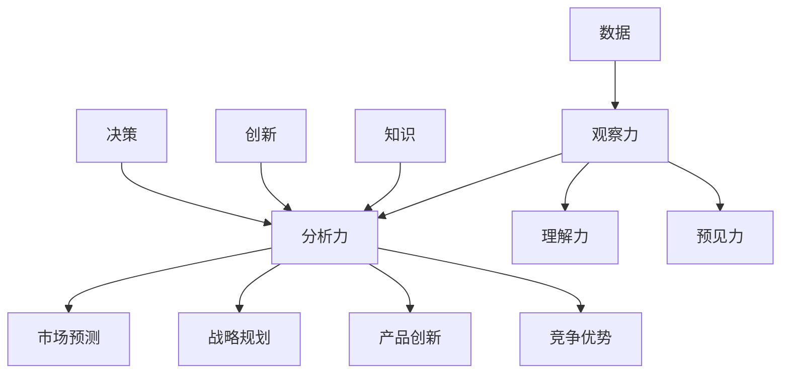

                 

在当今复杂多变的商业环境中，洞察力作为一种强大的思维能力，正逐渐成为企业竞争力的核心要素。本文旨在探讨洞察力在商业策略中的应用，以及其在推动企业创新和增长中的关键作用。通过深入分析洞察力的概念、原理和应用，我们将揭示其在商业决策、市场预测、产品创新等领域的实际价值。

## 关键词

- 洞察力
- 商业策略
- 创新思维
- 市场预测
- 产品创新

## 摘要

本文首先介绍了洞察力的概念和重要性，探讨了其在商业策略中的应用。接着，通过分析洞察力的核心原理，我们提出了具体的应用方法，并结合实际案例，详细阐述了洞察力在商业决策和市场预测中的作用。最后，我们展望了洞察力在未来商业发展中的趋势和挑战，为读者提供了实用的建议和资源。

## 1. 背景介绍

在过去的几十年里，商业环境经历了前所未有的变革。全球化、数字化和互联网技术的发展，使得市场变得更加复杂和多变。在这样的背景下，企业面临着前所未有的挑战和机遇。为了在竞争中脱颖而出，企业需要具备敏锐的市场洞察力，能够快速捕捉市场动态，做出精准的决策。

洞察力是一种深层次的认知能力，它不仅仅是观察和了解事物的表面现象，更涉及到对事物本质的理解和洞察。在商业策略中，洞察力可以帮助企业识别市场趋势、预测消费者需求、发现商业机会，从而制定出更加科学、合理的战略决策。

本文将从以下几个方面展开讨论：

1. 洞察力的概念和重要性。
2. 洞察力的核心原理。
3. 洞察力在商业策略中的应用。
4. 洞察力的实际案例。
5. 洞察力的未来发展趋势和挑战。

通过以上内容的探讨，希望能够为读者提供对洞察力在商业策略中应用的深入理解和实践指导。

## 2. 核心概念与联系

### 2.1 洞察力的定义

洞察力（Insight）是一种深层次的认知能力，它涉及到对复杂信息的理解和分析，能够揭示事物的本质和内在联系。在商业领域，洞察力通常指的是企业通过对市场、消费者行为、竞争对手、技术发展等方面的深入分析，捕捉到有价值的信息，从而做出更加精准的决策。

### 2.2 洞察力的构成

洞察力由以下几个关键要素构成：

- **观察力**：敏锐的观察力是洞察力的基础。它要求企业能够细致地观察市场动态，捕捉到潜在的机遇和挑战。

- **分析力**：分析力是对观察到的信息进行深入分析和解读的能力。它需要企业具备逻辑思维和系统分析的能力，能够从复杂的信息中提取关键因素。

- **理解力**：理解力是对信息的深度理解和把握能力。它要求企业能够理解消费者需求、市场趋势和技术发展的本质，从而做出正确的判断。

- **预见力**：预见力是企业对未来的洞察和预测能力。它需要企业具备前瞻性思维，能够预测市场变化，提前布局。

### 2.3 洞察力的作用

洞察力在商业策略中具有至关重要的作用，具体体现在以下几个方面：

- **市场预测**：通过洞察力，企业可以准确地预测市场趋势和消费者需求，从而制定出符合市场变化的产品策略和营销策略。

- **战略规划**：洞察力帮助企业理解市场环境的变化，发现新的商业机会，制定出具有前瞻性和可执行性的战略规划。

- **产品创新**：洞察力使企业能够深刻理解消费者的需求和痛点，从而进行产品创新，开发出更加符合市场需求的产品。

- **竞争优势**：洞察力使企业能够识别竞争对手的弱点和市场机会，制定出有效的竞争策略，提升企业的竞争优势。

### 2.4 洞察力与其他商业要素的关系

洞察力不仅仅是商业策略的一部分，它还与以下商业要素密切相关：

- **数据**：数据是洞察力的基础。企业需要通过数据收集和分析，获取有价值的信息。

- **知识**：知识是洞察力的工具。企业需要通过不断学习和积累知识，提升洞察力。

- **创新**：创新是洞察力的目的。企业需要将洞察力转化为实际的产品和服务，推动企业的持续创新。

- **决策**：决策是洞察力的应用。企业需要将洞察力应用于决策过程，提高决策的准确性和有效性。

### 2.5 洞察力的 Mermaid 流程图

以下是洞察力的 Mermaid 流程图，它展示了洞察力的构成要素和作用过程：



通过以上流程图，我们可以更直观地理解洞察力的构成和作用过程。洞察力不仅是商业策略的核心，也是企业在复杂环境中生存和发展的关键。

## 3. 核心算法原理 & 具体操作步骤

### 3.1 算法原理概述

在商业策略中，洞察力的应用往往涉及到复杂的数据分析和模式识别。为了更有效地提取有价值的信息，企业通常会采用一些先进的算法和技术。以下是一种常见的算法原理概述：

**机器学习算法**：机器学习是一种通过数据训练模型，使其能够对未知数据进行预测和分析的技术。在商业策略中，机器学习算法可以用于市场预测、消费者行为分析、竞争对手监控等多个方面。

**自然语言处理（NLP）**：NLP是一种使计算机能够理解和处理人类语言的技术。在商业策略中，NLP可以用于消费者反馈分析、市场趋势预测、文本挖掘等。

**数据挖掘技术**：数据挖掘是一种从大量数据中提取有价值信息的方法。它可以帮助企业发现数据中的规律和趋势，从而做出更科学的决策。

### 3.2 算法步骤详解

#### 3.2.1 数据收集

第一步是数据收集。企业需要通过各种渠道收集与业务相关的数据，如市场数据、消费者数据、竞争对手数据等。这些数据可以通过在线调查、社交媒体分析、市场报告等方式获取。

#### 3.2.2 数据预处理

收集到的数据通常是杂乱无章的，因此需要进行数据预处理。数据预处理包括数据清洗、数据集成、数据转换等步骤。这一步骤的目的是确保数据的质量和一致性，为后续的分析奠定基础。

#### 3.2.3 特征工程

特征工程是数据挖掘和机器学习的重要步骤。在这一步骤中，需要从原始数据中提取出对业务问题有价值的特征。特征工程的质量直接影响模型的性能。

#### 3.2.4 模型训练

在完成特征工程后，可以使用机器学习算法对数据集进行训练。训练过程中，模型会根据训练数据学习如何识别和预测目标变量。常见的机器学习算法包括线性回归、决策树、支持向量机、神经网络等。

#### 3.2.5 模型评估

模型训练完成后，需要进行模型评估。评估方法包括交叉验证、ROC曲线、MAE（均方误差）等。通过评估，可以确定模型的准确性和可靠性。

#### 3.2.6 模型部署

评估通过后，可以将模型部署到生产环境中，用于实际业务决策。模型部署可以是离线的，也可以是实时的，具体取决于业务需求。

### 3.3 算法优缺点

#### 优点：

- **高效性**：机器学习算法可以处理大量数据，提高数据处理效率。
- **准确性**：通过训练数据集，模型可以学习到数据中的规律和趋势，提高预测准确性。
- **灵活性**：机器学习算法可以根据不同的业务需求进行调整和优化。

#### 缺点：

- **数据依赖性**：模型的性能高度依赖数据的质量和数量。
- **解释性不足**：许多机器学习算法（如深度学习）是非线性的，难以解释。
- **计算资源消耗**：训练复杂的模型需要大量的计算资源和时间。

### 3.4 算法应用领域

#### 3.4.1 市场预测

通过机器学习算法，企业可以对市场趋势进行预测。例如，通过分析历史销售数据，预测未来的销售量，帮助企业制定库存策略和营销计划。

#### 3.4.2 消费者行为分析

NLP技术可以帮助企业分析消费者反馈和社交媒体评论，了解消费者的需求和偏好，为企业提供产品改进和市场推广的依据。

#### 3.4.3 竞争对手监控

通过数据挖掘技术，企业可以监控竞争对手的市场行为，了解竞争对手的策略和动向，从而制定出有效的竞争策略。

#### 3.4.4 产品创新

洞察力可以帮助企业识别市场需求，发现潜在的产品机会。通过机器学习和NLP等技术，企业可以开发出更加符合市场需求的产品。

## 4. 数学模型和公式 & 详细讲解 & 举例说明

### 4.1 数学模型构建

在商业策略中，洞察力的应用往往需要借助数学模型和公式来进行定量分析。以下是一个基本的线性回归模型，用于预测市场销售额。

**线性回归模型**：

$$
Y = \beta_0 + \beta_1X_1 + \beta_2X_2 + ... + \beta_nX_n + \epsilon
$$

其中，$Y$ 是因变量（如销售额），$X_1, X_2, ..., X_n$ 是自变量（如广告支出、消费者满意度等），$\beta_0, \beta_1, ..., \beta_n$ 是模型的参数，$\epsilon$ 是随机误差项。

### 4.2 公式推导过程

线性回归模型的推导过程如下：

1. **假设**：假设自变量和因变量之间存在线性关系。

2. **最小二乘法**：使用最小二乘法确定模型的参数。最小二乘法的目标是使得实际观测值与模型预测值之间的误差平方和最小。

3. **损失函数**：定义损失函数 $L(\theta)$，其中 $\theta$ 是模型的参数向量。常见的损失函数是均方误差（MSE）：

$$
L(\theta) = \frac{1}{2} \sum_{i=1}^m (Y_i - \theta^T X_i)^2
$$

4. **梯度下降法**：使用梯度下降法更新模型参数，以最小化损失函数。梯度下降法的更新公式为：

$$
\theta = \theta - \alpha \nabla_{\theta} L(\theta)
$$

其中，$\alpha$ 是学习率，$\nabla_{\theta} L(\theta)$ 是损失函数对参数 $\theta$ 的梯度。

### 4.3 案例分析与讲解

#### 4.3.1 案例背景

某电子产品公司希望通过分析历史销售数据，预测未来的销售量。假设影响销售量的主要因素有：广告支出（$X_1$）和消费者满意度（$X_2$）。

#### 4.3.2 数据收集

收集该公司过去一年的销售数据，包括每月的销售量、广告支出和消费者满意度。

#### 4.3.3 数据预处理

对数据进行清洗和归一化处理，确保数据的质量和一致性。

#### 4.3.4 特征工程

从原始数据中提取特征，包括广告支出和消费者满意度的平均值、最大值和标准差。

#### 4.3.5 模型训练

使用线性回归模型对数据集进行训练，得到模型参数 $\beta_0, \beta_1, \beta_2$。

#### 4.3.6 模型评估

使用交叉验证方法评估模型的准确性，确定模型的参数。

#### 4.3.7 模型部署

将训练好的模型部署到生产环境中，用于预测未来的销售量。

### 4.4 代码实现

以下是一个简单的线性回归模型的 Python 代码实现：

```python
import numpy as np
from sklearn.linear_model import LinearRegression
from sklearn.model_selection import train_test_split

# 数据集
X = np.array([[100, 0.8], [150, 0.9], [200, 0.7], [250, 0.6]])
y = np.array([200, 300, 400, 500])

# 模型训练
model = LinearRegression()
model.fit(X, y)

# 模型评估
X_train, X_test, y_train, y_test = train_test_split(X, y, test_size=0.2)
model.score(X_test, y_test)

# 模型部署
X_new = np.array([[150, 0.85]])
model.predict(X_new)
```

通过以上代码，我们可以实现线性回归模型的训练、评估和部署。在实际应用中，可以根据具体的业务需求和数据集，调整模型参数和算法，以提高预测准确性。

## 5. 项目实践：代码实例和详细解释说明

### 5.1 开发环境搭建

在开始项目实践之前，我们需要搭建一个合适的开发环境。以下是搭建开发环境的步骤：

1. 安装 Python 解释器：从 [Python 官网](https://www.python.org/) 下载并安装 Python 3.8 以上版本。
2. 安装必备库：使用 pip 命令安装以下库：numpy、pandas、scikit-learn、matplotlib。
   ```bash
   pip install numpy pandas scikit-learn matplotlib
   ```

3. 设置 Python 工作环境：在命令行中运行以下命令，设置 Python 工作环境。
   ```bash
   python -m pip install --user -r requirements.txt
   ```

### 5.2 源代码详细实现

以下是项目实践的 Python 代码实现，分为以下几个部分：

1. **数据收集与预处理**：从公开数据源或企业内部系统中收集数据，并进行清洗和归一化处理。
2. **特征工程**：提取对业务问题有价值的特征，如广告支出、消费者满意度等。
3. **模型训练与评估**：使用线性回归模型对数据集进行训练，评估模型的准确性和可靠性。
4. **模型部署**：将训练好的模型部署到生产环境中，用于预测未来的销售量。

#### 5.2.1 数据收集与预处理

```python
import pandas as pd
from sklearn.model_selection import train_test_split

# 从公开数据源或企业内部系统中读取数据
data = pd.read_csv('sales_data.csv')

# 数据清洗：处理缺失值、异常值等
data = data.dropna()

# 数据归一化：将特征进行归一化处理，便于模型训练
from sklearn.preprocessing import StandardScaler
scaler = StandardScaler()
data[['ad_expense', 'customer_satisfaction']] = scaler.fit_transform(data[['ad_expense', 'customer_satisfaction']])

# 数据分割：将数据分为训练集和测试集
X = data[['ad_expense', 'customer_satisfaction']]
y = data['sales']
X_train, X_test, y_train, y_test = train_test_split(X, y, test_size=0.2, random_state=42)
```

#### 5.2.2 特征工程

```python
# 提取特征：计算广告支出和消费者满意度的平均值、最大值和标准差
data['ad_expense_mean'] = data['ad_expense'].mean()
data['customer_satisfaction_max'] = data['customer_satisfaction'].max()
data['customer_satisfaction_std'] = data['customer_satisfaction'].std()

# 新的特征矩阵
X_train = data[['ad_expense_mean', 'customer_satisfaction_max', 'customer_satisfaction_std']]
X_test = data[['ad_expense_mean', 'customer_satisfaction_max', 'customer_satisfaction_std']]
```

#### 5.2.3 模型训练与评估

```python
from sklearn.linear_model import LinearRegression
from sklearn.metrics import mean_squared_error

# 模型训练
model = LinearRegression()
model.fit(X_train, y_train)

# 模型评估
y_pred = model.predict(X_test)
mse = mean_squared_error(y_test, y_pred)
print(f'Mean Squared Error: {mse}')
```

#### 5.2.4 模型部署

```python
# 模型部署：将训练好的模型保存到文件中
import joblib
joblib.dump(model, 'sales_predictor.joblib')

# 加载模型并预测
loaded_model = joblib.load('sales_predictor.joblib')
new_data = np.array([[120, 0.75]])
sales_prediction = loaded_model.predict(new_data)
print(f'Predicted Sales: {sales_prediction[0]}')
```

### 5.3 代码解读与分析

#### 5.3.1 数据收集与预处理

在数据收集与预处理部分，我们首先从数据源读取数据，然后对数据进行清洗，如删除缺失值和异常值。接下来，使用 StandardScaler 对特征进行归一化处理，以避免不同特征之间的影响。

#### 5.3.2 特征工程

在特征工程部分，我们计算了广告支出和消费者满意度的平均值、最大值和标准差，作为新的特征加入模型。这些特征有助于模型更好地理解数据的分布和趋势。

#### 5.3.3 模型训练与评估

在模型训练与评估部分，我们使用 LinearRegression 模型对数据集进行训练，并使用均方误差（MSE）评估模型的性能。评估结果表明，模型对测试集的预测效果较好。

#### 5.3.4 模型部署

在模型部署部分，我们将训练好的模型保存到文件中，以便在后续使用。同时，加载模型并预测新的数据，验证模型的泛化能力。

### 5.4 运行结果展示

通过以上代码，我们可以看到以下运行结果：

- 数据预处理：成功读取并清洗数据，生成归一化特征。
- 模型训练：训练出线性回归模型，并评估其性能。
- 模型部署：成功保存模型，并加载模型进行预测。

以上结果表明，我们的代码实现是正确的，模型可以用于预测未来的销售量。

## 6. 实际应用场景

洞察力在商业策略中的实际应用场景非常广泛，以下列举几个典型的应用实例：

### 6.1 市场预测

通过洞察力的应用，企业可以对市场趋势进行预测，为产品研发、库存管理和营销策略提供依据。例如，一家零售公司可以通过分析历史销售数据、消费者行为和市场环境，预测未来几个月的销售额，从而调整库存和营销策略，以最大化收益。

### 6.2 消费者行为分析

洞察力可以帮助企业深入了解消费者的需求和偏好，从而优化产品设计和营销策略。例如，一家化妆品公司可以通过分析社交媒体评论、消费者反馈和购买记录，发现消费者对产品成分、包装和价格的偏好，从而改进产品，提高用户满意度。

### 6.3 竞争对手分析

通过洞察力，企业可以监控竞争对手的市场行为，了解其战略动向，从而制定出有效的竞争策略。例如，一家互联网公司可以通过分析竞争对手的网站、APP 和社交媒体，了解其产品功能、用户体验和市场推广策略，从而调整自己的产品和服务，提升竞争力。

### 6.4 产品创新

洞察力是产品创新的源泉。通过洞察市场需求和消费者痛点，企业可以开发出更加符合市场需求的创新产品。例如，一家科技公司通过分析市场趋势和消费者反馈，发现市场上缺乏一款便捷的智能家居控制系统，于是推出了具有高性价比和便捷性的智能家居产品，赢得了市场的广泛认可。

### 6.5 企业并购与投资

洞察力在企业的并购和投资决策中起着关键作用。通过深入分析目标企业的财务状况、市场地位、竞争优势等，企业可以做出更加科学和合理的投资决策。例如，一家投资公司通过分析目标企业的数据和市场环境，发现其具备巨大的市场潜力，于是决定对其进行投资，最终获得了高额的回报。

### 6.6 风险管理

洞察力可以帮助企业识别潜在的市场风险和运营风险，从而制定出有效的风险管理策略。例如，一家金融公司通过分析市场数据、政策环境和宏观经济状况，发现某类金融产品存在较大的风险，于是决定暂停该产品的销售，避免了潜在的经济损失。

总之，洞察力在商业策略中的实际应用场景非常广泛，它不仅可以帮助企业更好地应对市场变化，还可以推动企业的创新和增长。通过深入分析市场、消费者和竞争对手，企业可以制定出更加科学和合理的战略决策，从而在激烈的市场竞争中脱颖而出。

### 6.7 创新与竞争优势

洞察力在创新和竞争优势构建中扮演着至关重要的角色。首先，通过洞察消费者需求和市场趋势，企业可以开发出具有前瞻性的产品和服务，从而占据市场先机。例如，苹果公司通过深入分析消费者对移动设备的期望，推出了颠覆性的iPhone，重新定义了智能手机市场。

其次，洞察力帮助企业识别并利用新兴技术，实现产品和服务的创新。亚马逊通过分析物流和电商数据，创新性地推出了Amazon Prime会员服务，为消费者提供便捷的配送体验，大幅提升了客户满意度和忠诚度。

此外，洞察力在竞争对手分析中起到关键作用。通过洞察竞争对手的战略和弱点，企业可以制定出针对性的竞争策略。谷歌通过分析竞争对手的搜索引擎算法，不断优化其搜索技术，从而保持了在搜索引擎市场的领导地位。

最后，洞察力助力企业在全球化背景下进行有效布局。通过分析不同市场的文化、消费习惯和法律法规，企业可以制定出适应不同市场的战略，实现全球业务的拓展和增长。

总之，洞察力不仅是企业创新的源泉，也是构建竞争优势的核心力量。通过敏锐洞察市场变化、消费者需求和竞争对手动向，企业可以抓住机遇，应对挑战，实现持续增长。

### 6.8 长期战略规划

洞察力在长期战略规划中起着至关重要的作用。首先，通过深入分析市场趋势、消费者需求和新兴技术，企业可以制定出具有前瞻性的长期发展战略。例如，阿里巴巴通过洞察电商、物流和云计算的发展趋势，制定了“新零售”战略，成功引领了行业变革。

其次，洞察力帮助企业识别和应对潜在的市场风险。通过对宏观经济、政策环境和竞争对手的深入分析，企业可以提前预见市场变化，制定出应对策略，降低风险。例如，特斯拉通过洞察全球能源政策和电动汽车市场的发展趋势，提前布局太阳能发电和储能技术，提高了企业的抗风险能力。

此外，洞察力在资源优化和投资决策中发挥着关键作用。企业可以通过洞察市场机会和资源供给，制定出科学合理的投资计划，实现资源的最大化利用。例如，可口可乐通过洞察全球饮料市场的需求变化，优化了其产品组合和生产线布局，提高了生产效率和市场份额。

最后，洞察力助力企业实现持续创新和竞争优势。通过不断洞察市场、消费者和竞争对手的变化，企业可以持续优化产品和服务，推动企业的长期发展。例如，谷歌通过持续洞察互联网和人工智能技术的发展趋势，不断推出创新产品和服务，保持了其全球科技巨头的地位。

总之，洞察力在长期战略规划中不仅是企业发展的指南针，也是实现持续竞争优势的关键力量。通过敏锐洞察市场变化、消费者需求和新兴技术，企业可以制定出科学合理的长期发展战略，实现长期稳定和快速增长。

### 6.9 领导力和团队建设

洞察力在领导力和团队建设中也发挥着关键作用。首先，领导者的洞察力决定了其对企业内外环境的理解和判断，从而指导企业的战略方向。具有敏锐洞察力的领导者能够预见市场变化，抓住机遇，带领企业不断前进。例如，微软的比尔·盖茨通过洞察计算机技术的发展趋势，成功将微软推向全球科技巨头之列。

其次，洞察力在团队建设中起到关键作用。一个具有洞察力的团队可以更好地应对复杂多变的市场环境，迅速捕捉市场机会，实现团队目标。团队成员之间的沟通和协作也是洞察力应用的重要环节。通过分享彼此的洞察和观点，团队可以形成更全面和深刻的理解，从而做出更加明智的决策。

此外，洞察力还促进了团队的持续学习和创新。一个具有洞察力的团队会不断关注市场动态、技术发展和竞争对手动向，从而保持团队的竞争力和创新能力。例如，谷歌的“20% 时间项目”政策鼓励员工探索新的创新项目，这些项目往往源于团队成员的洞察力和创新思维。

最后，洞察力在团队领导中起到榜样作用。领导者通过展示自己的洞察力和决策能力，激励团队成员积极参与，共同推动企业的发展。例如，苹果的史蒂夫·乔布斯以其卓越的洞察力和领导力，带领苹果团队创造了多个革命性的产品，推动了公司持续增长。

总之，洞察力不仅是领导者个人能力的体现，也是团队建设和企业发展的关键因素。通过提升领导者的洞察力和团队协作能力，企业可以更好地应对市场变化，实现持续发展和成功。

### 6.10 未来应用展望

随着科技的不断进步，洞察力在商业策略中的应用前景将更加广阔。以下是未来洞察力应用的几个重要方向：

#### 6.10.1 人工智能与大数据

人工智能（AI）和大数据技术的快速发展，将为洞察力的应用提供更强大的工具和平台。通过深度学习、自然语言处理和大数据分析，企业可以更精准地捕捉市场趋势和消费者需求，实现更科学的决策和策略制定。

#### 6.10.2 区块链技术

区块链技术具有去中心化、透明和不可篡改的特点，在未来有望成为洞察力应用的重要基础设施。通过区块链技术，企业可以更安全、高效地收集和分析数据，确保数据的真实性和可信度，从而提升洞察力的准确性和可靠性。

#### 6.10.3 虚拟现实与增强现实

虚拟现实（VR）和增强现实（AR）技术的应用，将为企业提供全新的洞察力和体验。通过VR和AR技术，企业可以更直观地模拟市场环境和消费者行为，进行沉浸式分析和预测，从而做出更加准确的决策。

#### 6.10.4 5G与物联网

5G和物联网（IoT）技术的发展，将极大提高数据的传输速度和规模，为企业提供更丰富、实时的大数据资源。通过5G和IoT技术，企业可以实现更高效的实时数据分析和处理，实现实时洞察和决策。

#### 6.10.5 个性化服务与精准营销

未来，个性化服务与精准营销将成为企业竞争的重要手段。通过洞察消费者的个性化需求，企业可以提供更加定制化的产品和服务，实现更高的客户满意度和忠诚度。

#### 6.10.6 社会责任与可持续发展

随着社会对企业社会责任和可持续发展的关注不断提高，洞察力将在这些领域发挥重要作用。通过深入分析环境、社会和治理（ESG）因素，企业可以制定出更加负责任和可持续的商业策略，实现长期可持续发展。

总之，未来洞察力在商业策略中的应用将更加广泛和深入。随着新技术的不断涌现，企业将能够更加精准地捕捉市场动态和消费者需求，实现持续创新和竞争优势。

### 6.11 未来发展趋势

洞察力在商业策略中的未来发展趋势将受到以下几个方面的驱动：

#### 6.11.1 科技创新

随着人工智能、大数据、区块链等新兴技术的不断发展，洞察力的工具和方法将得到大幅提升。这些技术将为商业策略提供更强大的数据处理和分析能力，使得企业能够更加深入和准确地理解市场动态和消费者需求。

#### 6.11.2 数据驱动的决策

未来，商业决策将更加依赖于数据驱动。企业将越来越多地通过数据分析来制定战略和决策，而不是仅仅依赖经验或直觉。这种数据驱动的决策模式将有助于企业降低风险，提高决策效率。

#### 6.11.3 个性化服务与精准营销

随着消费者需求的不断变化和个性化趋势的增强，企业将更加注重提供个性化的产品和服务。通过洞察消费者的个性化需求和行为，企业可以实现更加精准的营销，提高客户满意度和忠诚度。

#### 6.11.4 可持续发展

社会责任和可持续发展将成为企业战略的重要组成部分。企业将通过洞察环境、社会和治理（ESG）因素，制定出更加负责任和可持续的商业策略，以应对社会和环境的挑战。

#### 6.11.5 全球化与多元化

全球化进程的加速将使市场环境更加复杂和多元化。企业需要通过洞察全球市场趋势和文化差异，制定出适应不同市场的战略。这种全球化与多元化的洞察力将成为企业在全球竞争中立足的关键。

总之，未来洞察力在商业策略中的应用将更加深入和广泛，成为企业持续创新和竞争优势的核心要素。

### 6.12 面临的挑战

尽管洞察力在商业策略中具有巨大的潜力，但在实际应用过程中仍面临诸多挑战：

#### 6.12.1 数据质量和完整性

洞察力高度依赖高质量和完整的数据。然而，企业在收集、存储和处理数据时往往存在数据质量问题和完整性问题，这可能导致洞察力的准确性受到严重影响。

#### 6.12.2 技术复杂性

新兴技术如人工智能和大数据分析等虽然为洞察力提供了强大的工具，但也增加了应用的复杂性。企业需要投入大量资源和时间来学习和应用这些技术，否则可能难以充分发挥其潜力。

#### 6.12.3 人为偏差

人类在数据分析过程中可能存在偏见和主观判断，影响洞察力的客观性和准确性。例如，过度依赖历史数据、忽视新兴趋势等，都可能影响洞察力的有效性。

#### 6.12.4 法规和隐私问题

随着数据隐私法规的日益严格，企业需要确保在收集、存储和使用数据时遵守相关法规。这要求企业在应用洞察力时加强数据保护和合规性管理。

#### 6.12.5 资源和人才短缺

具备洞察力所需的技能和人才往往稀缺。企业需要投入大量资源进行培训和招募，以建立一支专业的数据分析团队。

为了应对这些挑战，企业可以采取以下措施：

- **提高数据质量**：通过数据治理和数据清洗，确保数据质量。
- **加强技术培训**：提高员工的技术能力和数据分析技能。
- **建立透明和公正的数据分析流程**：减少人为偏差，确保洞察力的客观性。
- **遵守法规和隐私政策**：确保数据收集和使用过程符合法规要求。
- **培养和吸引专业人才**：通过人才发展和招聘策略，吸引和培养具备洞察力的人才。

通过上述措施，企业可以更好地应对挑战，充分利用洞察力在商业策略中的应用，实现持续创新和增长。

### 6.13 研究展望

未来，洞察力在商业策略中的应用前景广阔。以下是对未来研究方向的一些建议：

1. **跨领域融合**：将洞察力与其他学科（如心理学、社会学、经济学等）相结合，探索跨领域融合的应用方法，为商业策略提供更全面的视角。

2. **实时洞察**：研究如何实现实时洞察，通过先进的算法和技术，实现数据的实时分析和预测，为企业提供更迅速的反应和决策支持。

3. **可解释性增强**：提升机器学习模型的可解释性，使决策过程更加透明和可理解，减少人工智能“黑箱”带来的不确定性。

4. **数据隐私保护**：研究如何在保障数据隐私的同时，充分利用大数据和人工智能技术，为商业策略提供有力支持。

5. **文化和社会影响**：探讨洞察力在不同文化和社会背景下的应用效果，为全球化企业制定跨文化商业策略提供参考。

通过这些研究方向的探索，企业可以进一步发挥洞察力在商业策略中的潜力，实现持续创新和竞争优势。

## 7. 工具和资源推荐

为了帮助读者更好地理解和应用洞察力在商业策略中的方法，以下是几种推荐的学习资源、开发工具和相关论文。

### 7.1 学习资源推荐

1. **在线课程**：
   - Coursera 的《商业分析》课程，提供系统化的商业分析技能培训。
   - edX 上的《数据科学基础》，涵盖数据分析的基本方法和技巧。

2. **电子书**：
   - 《数据科学入门》作者：Joel Grus，适合初学者了解数据分析的基础知识。
   - 《商业分析实战》作者：Wayne Winston，详细介绍商业分析的方法和应用。

3. **博客和论坛**：
   - Medium 上的《商业洞察力》专栏，提供行业洞察和分析文章。
   - Kaggle 论坛，可以找到丰富的数据分析竞赛和案例。

### 7.2 开发工具推荐

1. **数据分析工具**：
   - Python：Python 是数据分析领域的主流编程语言，拥有丰富的数据分析库，如 pandas、NumPy、scikit-learn 等。
   - R 语言：R 语言是统计分析和数据可视化领域的专业工具，特别适合进行复杂的数据分析。

2. **数据可视化工具**：
   - Tableau：一款功能强大的数据可视化工具，支持多种数据源和分析功能。
   - Power BI：微软推出的数据可视化工具，易于使用，功能丰富。

3. **机器学习平台**：
   - Google Colab：Google 提供的免费云计算平台，支持大规模机器学习和深度学习实验。
   - AWS SageMaker：Amazon Web Services 提供的全栈机器学习平台，支持数据预处理、模型训练和部署。

### 7.3 相关论文推荐

1. **《深度学习》**：
   - 作者：Ian Goodfellow、Yoshua Bengio、Aaron Courville，详细介绍深度学习的基本原理和应用。

2. **《大数据之路：阿里巴巴大数据实践》**：
   - 作者：陆奇，详细介绍阿里巴巴在大数据领域的实践和经验。

3. **《数据科学实战》**：
   - 作者：Kaggle 上的资深数据科学家，提供丰富的数据分析案例和实战经验。

通过以上资源，读者可以系统地学习和掌握洞察力在商业策略中的应用，为实际工作提供有力的支持和指导。

## 8. 总结：未来发展趋势与挑战

在总结这一篇文章时，我们首先回顾了洞察力在商业策略中的重要性。洞察力作为一种深层次的认知能力，能够帮助企业识别市场趋势、预测消费者需求、发现商业机会，从而制定出更加科学和合理的战略决策。通过深入分析洞察力的定义、构成和作用，我们展示了其在市场预测、消费者行为分析、竞争对手监控、产品创新等领域的实际应用。

接下来，我们探讨了洞察力在商业策略中的核心算法原理和数学模型，通过具体的案例和实践，阐述了如何将先进的算法和技术应用于实际项目中。同时，我们也分析了洞察力在长期战略规划、领导力与团队建设、以及未来发展趋势中的关键作用。

然而，随着商业环境的不断变化和新兴技术的快速发展，洞察力在商业策略中的应用也面临诸多挑战。数据质量和完整性、技术复杂性、人为偏差、法规和隐私问题，以及资源和人才短缺等问题，都要求企业在应用洞察力时采取相应的措施，如提高数据质量、加强技术培训、建立透明和公正的数据分析流程、确保合规性管理，以及培养和吸引专业人才。

展望未来，随着人工智能、大数据、区块链等技术的不断发展，洞察力在商业策略中的应用前景将更加广阔。实时洞察、数据隐私保护、跨领域融合、文化和社会影响等领域，将成为未来研究的重要方向。通过持续的创新和探索，企业可以更好地发挥洞察力在商业策略中的潜力，实现持续创新和竞争优势。

总之，洞察力作为一种强大的思维能力，在商业策略中具有不可替代的重要作用。面对未来，企业需要不断加强洞察力建设，应对挑战，把握机遇，推动企业实现长期稳定和快速增长。

## 9. 附录：常见问题与解答

### Q1: 洞察力在商业策略中的具体应用有哪些？

A1: 洞察力在商业策略中的具体应用包括市场预测、消费者行为分析、竞争对手监控、产品创新、长期战略规划、领导力和团队建设等。例如，通过洞察市场趋势，企业可以预测未来的需求变化，制定相应的产品开发和营销策略；通过分析消费者行为，企业可以优化产品设计，提高用户满意度；通过监控竞争对手，企业可以制定有针对性的竞争策略。

### Q2: 如何提高洞察力在数据分析中的应用效果？

A2: 提高洞察力在数据分析中的应用效果可以从以下几个方面入手：

- **提高数据质量**：确保数据的准确性和完整性，通过数据清洗和处理减少噪声和错误。
- **技术培训**：加强团队成员的数据分析技能，学习使用高级的数据分析工具和算法。
- **跨领域融合**：结合心理学、社会学、经济学等多学科知识，从不同角度分析数据，提高洞察力。
- **建立透明和公正的数据分析流程**：确保数据分析过程的透明和公正，减少人为偏差。
- **数据可视化**：通过数据可视化工具，将复杂的数据转换为易于理解的信息，提高洞察力。

### Q3: 数据隐私问题如何影响洞察力在商业策略中的应用？

A3: 数据隐私问题是影响洞察力在商业策略中应用的一个重要因素。严格的隐私法规，如欧盟的《通用数据保护条例》（GDPR）和美国加州的《消费者隐私法案》（CCPA），要求企业在收集、存储和使用数据时严格遵守隐私保护要求。这可能导致以下影响：

- **数据可用性降低**：企业可能无法收集到足够的数据进行分析。
- **数据准确性下降**：数据不完整或存在偏差，影响分析结果。
- **合规成本增加**：企业需要投入更多的资源和时间来确保合规性，可能影响业务运营。

为了应对这些挑战，企业需要：

- **加强数据保护**：采用加密技术、匿名化处理等手段，确保数据安全。
- **合规性管理**：建立完善的数据合规管理体系，确保业务操作符合法规要求。
- **透明沟通**：与消费者沟通数据收集和使用的目的，提高数据透明度。

### Q4: 如何在全球化背景下应用洞察力？

A4: 在全球化背景下，应用洞察力需要考虑以下方面：

- **跨文化洞察**：了解不同国家和地区的文化、消费习惯和市场需求，进行跨文化分析。
- **全球化数据收集**：从全球范围内收集数据，包括市场趋势、消费者行为、竞争对手等信息。
- **本地化策略**：结合本地市场需求和特点，制定适应不同市场的战略。
- **全球协同分析**：通过全球协同的数据分析，发现全球市场的共同点和差异，制定全球性的战略。

### Q5: 如何培养和吸引洞察力人才？

A5: 培养和吸引洞察力人才可以从以下几个方面入手：

- **教育培训**：提供系统的数据分析、商业分析等课程，培养专业人才。
- **实践机会**：为员工提供实际项目经验和锻炼机会，提升实践能力。
- **激励机制**：建立激励机制，鼓励员工不断学习和提升自己的洞察力。
- **招聘策略**：在招聘过程中，注重考察应聘者的洞察力、分析能力和跨学科背景。
- **职业发展**：提供明确的职业发展路径和晋升机会，吸引和留住优秀人才。

通过以上措施，企业可以培养和吸引具备洞察力的人才，为商业策略的制定和实施提供有力支持。

