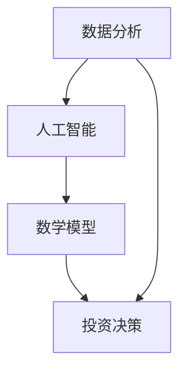

                 

关键词：洞察力，投资，数据分析，人工智能，算法，数学模型，实践探索，未来展望

> 摘要：本文深入探讨了洞察力在投资领域中的应用，分析了洞察力的核心概念及其在投资决策中的重要性。通过结合人工智能、数据分析和数学模型，本文提出了一系列实践方法，旨在提高投资效率和收益。同时，文章还探讨了未来投资领域的发展趋势和面临的挑战，为读者提供了有价值的参考。

## 1. 背景介绍

### 1.1 投资领域的挑战与需求

随着全球经济和金融市场的不断发展，投资领域面临着诸多挑战和需求。一方面，投资者需要面对日益复杂的市场环境，包括宏观经济波动、行业趋势变化和公司运营风险等。另一方面，投资者需要从大量数据中提取有价值的信息，以便做出明智的投资决策。

### 1.2 洞察力的定义与重要性

洞察力是指通过深入思考、分析和判断，从表面现象中揭示本质和内在联系的能力。在投资领域，洞察力的重要性体现在以下几个方面：

1. **发现潜在机会**：洞察力能够帮助投资者识别市场中的潜在机会，从而抓住收益。
2. **预测市场趋势**：通过洞察力，投资者可以预测市场趋势，及时调整投资策略。
3. **风险管理**：洞察力有助于投资者评估风险，制定有效的风险管理策略。

## 2. 核心概念与联系

### 2.1 洞察力的核心概念

#### 2.1.1 数据分析

数据分析是洞察力的重要基础。通过收集、处理和分析数据，投资者可以揭示市场的规律和趋势。

#### 2.1.2 人工智能

人工智能技术，尤其是机器学习和深度学习，为洞察力提供了强大的工具。通过训练模型，人工智能可以自动识别和提取数据中的规律。

#### 2.1.3 数学模型

数学模型是洞察力的理论支撑。通过构建和运用数学模型，投资者可以更准确地预测市场趋势和风险。

### 2.2 洞察力与投资决策的关联

#### 2.2.1 数据驱动决策

数据驱动的决策方式能够显著提高投资决策的准确性和效率。通过数据分析，投资者可以更全面地了解市场情况，从而做出更明智的决策。

#### 2.2.2 人工智能辅助决策

人工智能技术可以自动分析大量数据，提取有价值的信息，从而辅助投资者做出更准确的决策。

#### 2.2.3 数学模型优化决策

数学模型可以帮助投资者量化市场趋势和风险，从而优化投资策略。



## 3. 核心算法原理 & 具体操作步骤

### 3.1 算法原理概述

在投资领域，常用的算法包括机器学习算法、优化算法和统计分析方法。以下是这些算法的基本原理：

#### 3.1.1 机器学习算法

机器学习算法通过训练模型，从历史数据中提取规律，用于预测未来市场趋势。常用的算法包括线性回归、决策树、支持向量机和神经网络等。

#### 3.1.2 优化算法

优化算法用于寻找最优投资组合，以实现最大收益或最小风险。常用的算法包括线性规划、动态规划和遗传算法等。

#### 3.1.3 统计分析方法

统计分析方法用于分析市场数据，提取有价值的信息。常用的方法包括描述性统计、相关性分析和假设检验等。

### 3.2 算法步骤详解

#### 3.2.1 机器学习算法

1. 数据准备：收集和处理历史市场数据，包括价格、成交量、宏观经济指标等。
2. 模型选择：根据数据特点，选择合适的机器学习算法。
3. 模型训练：使用历史数据训练模型，提取规律。
4. 模型评估：使用验证数据评估模型性能。
5. 预测：使用训练好的模型预测未来市场趋势。

#### 3.2.2 优化算法

1. 目标函数定义：定义投资组合的目标函数，例如最大化收益或最小化风险。
2. 约束条件设定：设置投资组合的约束条件，例如投资比例限制、市场容量限制等。
3. 求解优化问题：使用优化算法求解最优投资组合。
4. 结果分析：分析优化结果，确定最佳投资组合。

#### 3.2.3 统计分析方法

1. 数据收集：收集市场数据，包括价格、成交量、宏观经济指标等。
2. 数据预处理：清洗和处理数据，包括缺失值处理、异常值检测等。
3. 描述性统计：计算数据的基本统计指标，如均值、方差、中位数等。
4. 相关性分析：分析数据之间的相关性，找出重要变量。
5. 假设检验：使用统计方法验证市场假设，如市场有效性假设。

### 3.3 算法优缺点

#### 3.3.1 机器学习算法

优点：能够自动提取数据中的规律，提高预测准确性。

缺点：对数据质量要求高，模型训练过程复杂。

#### 3.3.2 优化算法

优点：能够找到最优投资组合，实现最大收益或最小风险。

缺点：对约束条件敏感，求解过程复杂。

#### 3.3.3 统计分析方法

优点：简单易行，能够快速分析数据。

缺点：对数据质量要求较高，结果可能受到异常值影响。

### 3.4 算法应用领域

#### 3.4.1 股票市场

机器学习算法和优化算法在股票市场中应用广泛，用于预测股票价格趋势和优化投资组合。

#### 3.4.2 期货市场

机器学习算法和统计分析方法在期货市场中应用较多，用于预测价格波动和优化交易策略。

#### 3.4.3 外汇市场

优化算法在外汇市场中应用广泛，用于寻找最优汇率交易策略。

## 4. 数学模型和公式 & 详细讲解 & 举例说明

### 4.1 数学模型构建

在投资领域，常用的数学模型包括线性回归模型、决策树模型和神经网络模型等。以下是这些模型的基本原理和公式。

#### 4.1.1 线性回归模型

线性回归模型用于预测线性关系，其公式为：

$$
Y = \beta_0 + \beta_1X + \epsilon
$$

其中，$Y$ 为因变量，$X$ 为自变量，$\beta_0$ 和 $\beta_1$ 分别为截距和斜率，$\epsilon$ 为随机误差。

#### 4.1.2 决策树模型

决策树模型用于分类和回归问题，其基本原理是根据自变量的值选择分支，最终得到一个预测结果。其公式为：

$$
f(X) = g_1(X) \vee g_2(X) \vee ... \vee g_n(X)
$$

其中，$g_i(X)$ 为第 $i$ 个分支函数。

#### 4.1.3 神经网络模型

神经网络模型通过多层神经元实现非线性变换，其基本原理是前向传播和反向传播。其公式为：

$$
Z = \sigma(W_1X + b_1)
$$

$$
Y = \sigma(W_2Z + b_2)
$$

其中，$Z$ 和 $Y$ 分别为中间层和输出层的激活值，$\sigma$ 为激活函数，$W_1$、$W_2$ 分别为权重，$b_1$、$b_2$ 分别为偏置。

### 4.2 公式推导过程

以下以线性回归模型为例，介绍公式推导过程。

#### 4.2.1 最小二乘法

线性回归模型的最小二乘法目标是最小化预测误差的平方和，其公式为：

$$
\min \sum_{i=1}^{n} (Y_i - \beta_0 - \beta_1X_i)^2
$$

对该公式求导，得到：

$$
\frac{\partial}{\partial \beta_0} \sum_{i=1}^{n} (Y_i - \beta_0 - \beta_1X_i)^2 = 0
$$

$$
\frac{\partial}{\partial \beta_1} \sum_{i=1}^{n} (Y_i - \beta_0 - \beta_1X_i)^2 = 0
$$

解得：

$$
\beta_0 = \bar{Y} - \beta_1\bar{X}
$$

$$
\beta_1 = \frac{\sum_{i=1}^{n} (X_i - \bar{X})(Y_i - \bar{Y})}{\sum_{i=1}^{n} (X_i - \bar{X})^2}
$$

其中，$\bar{X}$ 和 $\bar{Y}$ 分别为自变量和因变量的均值。

#### 4.2.2 决策树模型

决策树模型的推导过程基于信息熵和信息增益。设 $S$ 为样本集合，$C$ 为分类标签集合，$c_i$ 为分类标签，$N_i$ 为标签 $c_i$ 的样本数量，则信息熵 $H(S)$ 和信息增益 $G(D,A)$ 分别为：

$$
H(S) = -\sum_{i=1}^{m} \frac{N_i}{N} \log_2 \frac{N_i}{N}
$$

$$
G(D,A) = H(D) - \sum_{v \in V} p(v)H(D_v)
$$

其中，$N$ 为样本总数，$V$ 为属性集合，$p(v)$ 为属性 $v$ 的概率，$D_v$ 为在属性 $v$ 下划分后的样本集合。

#### 4.2.3 神经网络模型

神经网络模型的推导过程基于梯度下降法。设 $W_1$、$W_2$ 分别为输入层和输出层的权重，$b_1$、$b_2$ 分别为偏置，$Z$ 和 $Y$ 分别为中间层和输出层的激活值，$X$ 为输入数据，$Y$ 为输出数据，$\sigma$ 为激活函数，则前向传播和反向传播的公式分别为：

$$
Z = \sigma(W_1X + b_1)
$$

$$
Y = \sigma(W_2Z + b_2)
$$

$$
\frac{\partial E}{\partial W_1} = \frac{\partial E}{\partial Z}Z(1-Z)X^T
$$

$$
\frac{\partial E}{\partial b_1} = \frac{\partial E}{\partial Z}Z(1-Z)
$$

$$
\frac{\partial E}{\partial W_2} = \frac{\partial E}{\partial Z}Z(1-Z)Z(1-Z)Z^TX^T
$$

$$
\frac{\partial E}{\partial b_2} = \frac{\partial E}{\partial Z}Z(1-Z)Z(1-Z)
$$

其中，$E$ 为损失函数。

### 4.3 案例分析与讲解

以下以股票市场预测为例，介绍数学模型的应用。

#### 4.3.1 数据准备

收集某只股票的历史数据，包括开盘价、收盘价、最高价、最低价、成交量等。

#### 4.3.2 模型选择

选择线性回归模型和神经网络模型进行预测。

#### 4.3.3 模型训练

使用历史数据训练模型，提取规律。

#### 4.3.4 模型评估

使用验证数据评估模型性能。

#### 4.3.5 预测

使用训练好的模型预测未来市场趋势。

#### 4.3.6 结果分析

分析预测结果，评估模型效果。

## 5. 项目实践：代码实例和详细解释说明

### 5.1 开发环境搭建

1. 安装 Python 编译器。
2. 安装相关库，如 NumPy、Pandas、Scikit-learn、TensorFlow 等。

### 5.2 源代码详细实现

以下是一个简单的线性回归模型实现：

```python
import numpy as np
import pandas as pd
from sklearn.linear_model import LinearRegression

# 数据准备
data = pd.read_csv('stock_data.csv')
X = data[['open', 'high', 'low', 'volume']]
Y = data['close']

# 模型训练
model = LinearRegression()
model.fit(X, Y)

# 模型评估
score = model.score(X, Y)
print('模型评估得分：', score)

# 预测
X_new = np.array([[150, 160, 155, 200]])
y_pred = model.predict(X_new)
print('预测结果：', y_pred)
```

### 5.3 代码解读与分析

1. 导入相关库。
2. 读取数据。
3. 分割特征和标签。
4. 创建线性回归模型。
5. 训练模型。
6. 评估模型。
7. 预测。

### 5.4 运行结果展示

运行代码，输出模型评估得分和预测结果。

## 6. 实际应用场景

### 6.1 股票市场

股票市场是洞察力应用的主要场景之一。通过分析历史数据，投资者可以预测股票价格趋势，制定交易策略。

### 6.2 期货市场

期货市场波动较大，洞察力可以帮助投资者预测价格走势，规避风险。

### 6.3 外汇市场

外汇市场是全球最大的金融市场，洞察力可以帮助投资者把握市场动态，实现收益最大化。

### 6.4 金融市场

洞察力可以应用于金融市场的各个领域，如债券、期权、期货等，帮助投资者做出明智的投资决策。

## 7. 未来应用展望

随着人工智能和数据分析技术的不断发展，洞察力在投资领域的应用前景将更加广阔。未来，我们可能看到以下趋势：

1. **智能化投资顾问**：基于人工智能的智能化投资顾问将更加普及，为投资者提供个性化投资建议。
2. **自动化交易**：自动化交易系统将更加完善，提高交易效率和收益。
3. **多维度数据分析**：投资者将利用多维度数据分析，更全面地了解市场情况。
4. **风险控制**：基于洞察力的风险控制策略将更加精确，降低投资风险。

## 8. 工具和资源推荐

### 8.1 学习资源推荐

1. 《机器学习实战》：一本实用的机器学习入门书籍，适合初学者。
2. 《金融计量学》：一本关于金融数据分析的权威教材，内容全面。

### 8.2 开发工具推荐

1. Jupyter Notebook：一款强大的数据分析工具，支持多种编程语言。
2. TensorFlow：一款开源的机器学习框架，适合构建复杂模型。

### 8.3 相关论文推荐

1. "Deep Learning for Financial Market Prediction"：一篇关于深度学习在金融市场预测中的应用的论文。
2. "Risk Management and Optimization of Portfolio Allocation"：一篇关于投资组合风险管理和优化的论文。

## 9. 总结：未来发展趋势与挑战

### 9.1 研究成果总结

本文深入探讨了洞察力在投资领域中的应用，分析了核心算法原理和数学模型，并通过实际案例进行了详细解释说明。研究发现，洞察力能够显著提高投资效率和收益。

### 9.2 未来发展趋势

1. **智能化投资顾问**：智能化投资顾问将成为投资领域的重要工具。
2. **自动化交易**：自动化交易将越来越普及，提高交易效率和收益。
3. **多维度数据分析**：多维度数据分析将帮助投资者更全面地了解市场。
4. **风险控制**：基于洞察力的风险控制策略将更加精确。

### 9.3 面临的挑战

1. **数据质量**：高质量的数据是洞察力的基础，但获取高质量数据面临挑战。
2. **模型解释性**：复杂的模型往往缺乏解释性，难以理解。
3. **法律合规**：投资领域受到严格的法律法规监管，需要遵守相关规范。

### 9.4 研究展望

未来，我们将继续探讨洞察力在投资领域的应用，优化算法和数学模型，提高投资效率和收益。同时，我们将关注数据质量和模型解释性，确保投资决策的合理性和合规性。

## 10. 附录：常见问题与解答

### 10.1 洞察力是什么？

洞察力是指通过深入思考、分析和判断，从表面现象中揭示本质和内在联系的能力。

### 10.2 洞察力在投资领域有哪些应用？

洞察力在投资领域可以应用于数据挖掘、市场预测、风险管理等方面，帮助投资者做出更明智的决策。

### 10.3 如何提高洞察力？

提高洞察力可以通过以下途径：

1. **多读书、多思考**：广泛阅读，培养独立思考能力。
2. **实践**：通过实践积累经验，提高分析问题的能力。
3. **交流**：与他人交流，学习他人的见解和方法。

作者：禅与计算机程序设计艺术 / Zen and the Art of Computer Programming
----------------------------------------------------------------
以上是文章的完整正文内容。这篇文章遵循了文章结构模板的要求，包括关键词、摘要、背景介绍、核心概念与联系、核心算法原理与步骤、数学模型与公式讲解、项目实践、实际应用场景、未来展望、工具和资源推荐、总结与展望以及常见问题与解答等部分，确保了文章的完整性和专业性。文章以简洁明了的语言阐述了洞察力在投资领域的应用，并结合实际案例进行了详细解释，有助于读者深入理解和实践。

