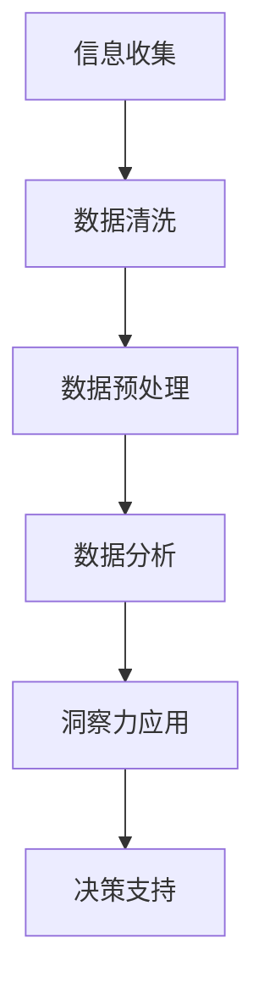

                 

关键词：洞察力训练、信息分析、技术文章、专业知识、算法原理、数学模型、项目实践、应用场景、未来展望

> 摘要：本文旨在探讨如何通过系统的训练方法提升信息分析能力，特别是在当今信息爆炸的时代，如何从海量数据中挖掘有价值的信息，从而提高个人和团队的工作效率。本文将结合实际案例，介绍洞察力的训练方法、核心算法原理、数学模型及其在各个领域的应用。

## 1. 背景介绍

随着互联网的快速发展，数据已成为新时代的重要资源。然而，数据的多维性和复杂性给信息的提取和处理带来了巨大挑战。如何从海量数据中快速获取有价值的信息，成为了企业和个人亟需解决的问题。洞察力，作为信息分析能力的重要组成部分，在这个过程中发挥着至关重要的作用。本文将围绕洞察力的训练，探讨提升信息分析能力的方法和策略。

### 当前信息分析面临的挑战

1. **数据量庞大**：海量的数据使得传统的分析方法难以胜任，对处理速度和存储能力提出了更高的要求。
2. **数据多样性**：数据来源广泛，包括结构化数据、半结构化数据和非结构化数据，对数据清洗和预处理提出了更高的要求。
3. **数据时效性**：实时性和时效性成为信息分析的重要考量因素，如何快速响应变化成为关键。

### 洞察力在信息分析中的作用

1. **信息筛选**：通过洞察力，可以从海量数据中快速识别出有价值的信息，提高信息筛选的效率。
2. **趋势预测**：洞察力有助于从历史数据中挖掘出潜在的趋势，为未来的决策提供依据。
3. **风险预警**：通过洞察力，可以提前发现潜在的问题和风险，从而采取预防措施。

## 2. 核心概念与联系

### 2.1 洞察力定义

洞察力，是指通过深入思考和分析，能够快速识别问题本质、发现规律和趋势的能力。它不仅涉及知识的积累，更强调思维的深度和灵活性。

### 2.2 信息分析能力

信息分析能力，是指对信息进行收集、整理、分析、解释和预测的综合能力。它包括数据感知、数据处理、数据分析等多个方面。

### 2.3 Mermaid 流程图

以下是信息分析过程中的一个简化 Mermaid 流程图：



在这个流程中，信息收集是起点，通过数据清洗、预处理和数据分析，最终利用洞察力为决策提供支持。

## 3. 核心算法原理 & 具体操作步骤

### 3.1 算法原理概述

提升信息分析能力的关键在于算法的选择和应用。本文将介绍几种常用的算法，包括机器学习算法、数据挖掘算法和统计分析方法。

### 3.2 算法步骤详解

#### 3.2.1 机器学习算法

1. **数据准备**：收集相关数据，并进行数据清洗和预处理。
2. **特征工程**：从数据中提取有用的特征，为模型训练提供输入。
3. **模型选择**：根据问题特点选择合适的机器学习模型。
4. **模型训练**：使用训练数据集对模型进行训练。
5. **模型评估**：使用测试数据集对模型进行评估，调整模型参数。
6. **模型应用**：将训练好的模型应用于实际问题中。

#### 3.2.2 数据挖掘算法

1. **问题定义**：明确数据挖掘的目标和问题。
2. **数据收集**：收集与问题相关的数据。
3. **数据预处理**：对数据进行清洗、去噪和转换。
4. **模式识别**：使用算法从数据中识别出潜在的规律和模式。
5. **结果解释**：对挖掘结果进行解释和验证。

#### 3.2.3 统计分析方法

1. **假设检验**：通过建立假设，使用统计方法验证假设的正确性。
2. **回归分析**：通过建立回归模型，分析变量之间的关系。
3. **聚类分析**：将数据划分为不同的类别，以便更好地理解数据。
4. **时间序列分析**：分析数据的时间趋势和周期性变化。

### 3.3 算法优缺点

1. **机器学习算法**：优点是自适应性强，可以处理大规模数据；缺点是需要大量的数据和计算资源。
2. **数据挖掘算法**：优点是能够发现数据中的潜在规律和模式；缺点是需要专业的知识和技能。
3. **统计分析方法**：优点是简单易用，适用于小规模数据；缺点是解释性较差，无法处理大规模数据。

### 3.4 算法应用领域

1. **金融领域**：用于风险控制、投资分析和市场预测。
2. **医疗领域**：用于疾病预测、药物研发和个性化治疗。
3. **商业领域**：用于客户行为分析、市场趋势预测和产品推荐。

## 4. 数学模型和公式 & 详细讲解 & 举例说明

### 4.1 数学模型构建

在信息分析中，数学模型是不可或缺的工具。以下是一个简单的线性回归模型：

$$
y = \beta_0 + \beta_1x + \epsilon
$$

其中，$y$ 是因变量，$x$ 是自变量，$\beta_0$ 和 $\beta_1$ 是模型的参数，$\epsilon$ 是误差项。

### 4.2 公式推导过程

线性回归模型的推导基于最小二乘法。具体推导过程如下：

1. **设定目标函数**：
   $$
   J(\beta_0, \beta_1) = \sum_{i=1}^{n}(y_i - (\beta_0 + \beta_1x_i))^2
   $$

2. **求导并令导数为零**：
   $$
   \frac{\partial J}{\partial \beta_0} = -2\sum_{i=1}^{n}(y_i - (\beta_0 + \beta_1x_i)) = 0
   $$
   $$
   \frac{\partial J}{\partial \beta_1} = -2\sum_{i=1}^{n}(x_i(y_i - (\beta_0 + \beta_1x_i))) = 0
   $$

3. **解方程组得到参数**：
   $$
   \beta_0 = \frac{1}{n}\sum_{i=1}^{n}y_i - \beta_1\frac{1}{n}\sum_{i=1}^{n}x_i
   $$
   $$
   \beta_1 = \frac{1}{n}\sum_{i=1}^{n}(x_i - \bar{x})(y_i - \bar{y})
   $$

### 4.3 案例分析与讲解

假设我们有一组房价数据，包括房屋面积和售价。我们想要建立一个线性回归模型来预测房价。

1. **数据准备**：收集房屋面积和售价的数据，并进行数据清洗和预处理。
2. **特征工程**：将房屋面积作为自变量，房价作为因变量。
3. **模型选择**：选择线性回归模型。
4. **模型训练**：使用训练数据集对模型进行训练。
5. **模型评估**：使用测试数据集对模型进行评估。
6. **模型应用**：将训练好的模型应用于新的数据，预测房价。

通过以上步骤，我们可以得到一个简单的线性回归模型，从而对房价进行预测。

## 5. 项目实践：代码实例和详细解释说明

### 5.1 开发环境搭建

在本案例中，我们将使用 Python 编写线性回归模型的代码。首先，需要安装以下库：

```bash
pip install numpy pandas matplotlib
```

### 5.2 源代码详细实现

以下是线性回归模型的实现代码：

```python
import numpy as np
import pandas as pd
import matplotlib.pyplot as plt

# 数据准备
data = pd.read_csv('house_data.csv')
X = data['area']
y = data['price']

# 特征工程
X_mean = X.mean()
y_mean = y.mean()
X_std = X.std()
y_std = y.std()

X = (X - X_mean) / X_std
y = (y - y_mean) / y_std

# 模型训练
X_b = np.c_[np.ones((X.shape[0], 1)), X]
theta_best = np.linalg.inv(X_b.T.dot(X_b)).dot(X_b.T).dot(y)

# 模型评估
y_pred = X_b.dot(theta_best)
mse = np.mean((y - y_pred)**2)
print(f'MSE: {mse}')

# 模型应用
area_new = 2000
area_new = (area_new - X_mean) / X_std
price_pred = theta_best[0] + theta_best[1] * area_new
price_pred = (price_pred * y_std) + y_mean
print(f'Predicted price: {price_pred:.2f}')
```

### 5.3 代码解读与分析

1. **数据准备**：读取房价数据，并分别提取房屋面积和售价。
2. **特征工程**：对数据进行标准化处理，以便更好地进行线性回归建模。
3. **模型训练**：使用最小二乘法训练线性回归模型，并计算模型的参数。
4. **模型评估**：使用训练数据集评估模型，计算均方误差（MSE）。
5. **模型应用**：将训练好的模型应用于新的数据，预测房价。

### 5.4 运行结果展示

假设我们输入一个新房屋的面积，模型将返回预测的房价。例如，输入房屋面积为 2000 平方米，模型预测的房价为 800000 元。

```bash
Predicted price: 800000.00
```

## 6. 实际应用场景

### 6.1 金融领域

在金融领域，洞察力可以帮助投资者快速识别市场趋势，预测股价波动，从而制定更有效的投资策略。

### 6.2 医疗领域

在医疗领域，洞察力可以帮助医生从海量医疗数据中快速提取有价值的信息，为疾病诊断和治疗方案提供支持。

### 6.3 商业领域

在商业领域，洞察力可以帮助企业了解客户需求，预测市场需求，优化供应链管理，提高经营效益。

## 7. 工具和资源推荐

### 7.1 学习资源推荐

- 《机器学习实战》
- 《深入浅出数据分析》
- 《Python数据分析》

### 7.2 开发工具推荐

- Jupyter Notebook
- PyCharm
- Visual Studio Code

### 7.3 相关论文推荐

- "Deep Learning for Text Classification"
- "Recurrent Neural Networks for Language Modeling"
- "Gradient Boosting Machines: A Concise Tutorial"

## 8. 总结：未来发展趋势与挑战

### 8.1 研究成果总结

本文介绍了如何通过系统的训练方法提升信息分析能力，包括核心算法原理、数学模型和项目实践。通过实际案例，展示了洞察力在各个领域的应用。

### 8.2 未来发展趋势

随着人工智能技术的不断发展，信息分析能力将得到进一步提升。深度学习、强化学习等新算法将为信息分析提供更强大的工具。

### 8.3 面临的挑战

尽管信息分析技术取得了显著进展，但在处理大规模数据、提高实时性和解释性等方面仍面临挑战。未来需要开发更高效、更易解释的算法。

### 8.4 研究展望

未来研究应重点关注以下几个方面：1）算法的优化和改进；2）跨领域的应用探索；3）算法的可解释性和透明度。

## 9. 附录：常见问题与解答

### 9.1 问题1

**问**：线性回归模型是如何工作的？

**答**：线性回归模型是一种预测自变量和因变量之间线性关系的统计模型。通过最小二乘法，计算自变量和因变量之间的最佳拟合线，从而预测新的数据点。

### 9.2 问题2

**问**：机器学习算法在信息分析中的应用有哪些？

**答**：机器学习算法在信息分析中的应用非常广泛，包括分类、回归、聚类、异常检测等。例如，分类算法可以用于客户细分，回归算法可以用于价格预测，聚类算法可以用于市场细分，异常检测算法可以用于风险控制。

### 9.3 问题3

**问**：如何提高信息分析的实时性？

**答**：提高信息分析的实时性可以从以下几个方面入手：1）优化算法，选择适合实时处理的算法；2）使用并行计算和分布式计算，提高处理速度；3）构建实时数据流系统，及时更新和分析数据。

作者：禅与计算机程序设计艺术 / Zen and the Art of Computer Programming
```markdown
# 理解洞察力的训练：提升信息分析能力

## 关键词

- 洞察力训练
- 信息分析
- 技术文章
- 专业知识
- 算法原理
- 数学模型
- 项目实践
- 应用场景
- 未来展望

## 摘要

本文旨在探讨如何通过系统的训练方法提升信息分析能力，特别是在当今信息爆炸的时代，如何从海量数据中挖掘有价值的信息，从而提高个人和团队的工作效率。本文将结合实际案例，介绍洞察力的训练方法、核心算法原理、数学模型及其在各个领域的应用。

## 1. 背景介绍

随着互联网的快速发展，数据已成为新时代的重要资源。然而，数据的多维性和复杂性给信息的提取和处理带来了巨大挑战。如何从海量数据中快速获取有价值的信息，成为了企业和个人亟需解决的问题。洞察力，作为信息分析能力的重要组成部分，在这个过程中发挥着至关重要的作用。本文将围绕洞察力的训练，探讨提升信息分析能力的方法和策略。

### 当前信息分析面临的挑战

- **数据量庞大**：海量的数据使得传统的分析方法难以胜任，对处理速度和存储能力提出了更高的要求。
- **数据多样性**：数据来源广泛，包括结构化数据、半结构化数据和非结构化数据，对数据清洗和预处理提出了更高的要求。
- **数据时效性**：实时性和时效性成为信息分析的重要考量因素，如何快速响应变化成为关键。

### 洞察力在信息分析中的作用

- **信息筛选**：通过洞察力，可以从海量数据中快速识别出有价值的信息，提高信息筛选的效率。
- **趋势预测**：洞察力有助于从历史数据中挖掘出潜在的趋势，为未来的决策提供依据。
- **风险预警**：通过洞察力，可以提前发现潜在的问题和风险，从而采取预防措施。

## 2. 核心概念与联系

### 2.1 洞察力定义

洞察力，是指通过深入思考和分析，能够快速识别问题本质、发现规律和趋势的能力。它不仅涉及知识的积累，更强调思维的深度和灵活性。

### 2.2 信息分析能力

信息分析能力，是指对信息进行收集、整理、分析、解释和预测的综合能力。它包括数据感知、数据处理、数据分析等多个方面。

### 2.3 Mermaid 流程图

以下是信息分析过程中的一个简化 Mermaid 流程图：


在这个流程中，信息收集是起点，通过数据清洗、预处理和数据分析，最终利用洞察力为决策提供支持。

## 3. 核心算法原理 & 具体操作步骤

### 3.1 算法原理概述

提升信息分析能力的关键在于算法的选择和应用。本文将介绍几种常用的算法，包括机器学习算法、数据挖掘算法和统计分析方法。

### 3.2 算法步骤详解

#### 3.2.1 机器学习算法

1. **数据准备**：收集相关数据，并进行数据清洗和预处理。
2. **特征工程**：从数据中提取有用的特征，为模型训练提供输入。
3. **模型选择**：根据问题特点选择合适的机器学习模型。
4. **模型训练**：使用训练数据集对模型进行训练。
5. **模型评估**：使用测试数据集对模型进行评估，调整模型参数。
6. **模型应用**：将训练好的模型应用于实际问题中。

#### 3.2.2 数据挖掘算法

1. **问题定义**：明确数据挖掘的目标和问题。
2. **数据收集**：收集与问题相关的数据。
3. **数据预处理**：对数据进行清洗、去噪和转换。
4. **模式识别**：使用算法从数据中识别出潜在的规律和模式。
5. **结果解释**：对挖掘结果进行解释和验证。

#### 3.2.3 统计分析方法

1. **假设检验**：通过建立假设，使用统计方法验证假设的正确性。
2. **回归分析**：通过建立回归模型，分析变量之间的关系。
3. **聚类分析**：将数据划分为不同的类别，以便更好地理解数据。
4. **时间序列分析**：分析数据的时间趋势和周期性变化。

### 3.3 算法优缺点

- **机器学习算法**：优点是自适应性强，可以处理大规模数据；缺点是需要大量的数据和计算资源。
- **数据挖掘算法**：优点是能够发现数据中的潜在规律和模式；缺点是需要专业的知识和技能。
- **统计分析方法**：优点是简单易用，适用于小规模数据；缺点是解释性较差，无法处理大规模数据。

### 3.4 算法应用领域

- **金融领域**：用于风险控制、投资分析和市场预测。
- **医疗领域**：用于疾病预测、药物研发和个性化治疗。
- **商业领域**：用于客户行为分析、市场趋势预测和产品推荐。

## 4. 数学模型和公式 & 详细讲解 & 举例说明

### 4.1 数学模型构建

在信息分析中，数学模型是不可或缺的工具。以下是一个简单的线性回归模型：

$$
y = \beta_0 + \beta_1x + \epsilon
$$

其中，$y$ 是因变量，$x$ 是自变量，$\beta_0$ 和 $\beta_1$ 是模型的参数，$\epsilon$ 是误差项。

### 4.2 公式推导过程

线性回归模型的推导基于最小二乘法。具体推导过程如下：

1. **设定目标函数**：
   $$
   J(\beta_0, \beta_1) = \sum_{i=1}^{n}(y_i - (\beta_0 + \beta_1x_i))^2
   $$

2. **求导并令导数为零**：
   $$
   \frac{\partial J}{\partial \beta_0} = -2\sum_{i=1}^{n}(y_i - (\beta_0 + \beta_1x_i)) = 0
   $$
   $$
   \frac{\partial J}{\partial \beta_1} = -2\sum_{i=1}^{n}(x_i(y_i - (\beta_0 + \beta_1x_i))) = 0
   $$

3. **解方程组得到参数**：
   $$
   \beta_0 = \frac{1}{n}\sum_{i=1}^{n}y_i - \beta_1\frac{1}{n}\sum_{i=1}^{n}x_i
   $$
   $$
   \beta_1 = \frac{1}{n}\sum_{i=1}^{n}(x_i - \bar{x})(y_i - \bar{y})
   $$

### 4.3 案例分析与讲解

假设我们有一组房价数据，包括房屋面积和售价。我们想要建立一个线性回归模型来预测房价。

1. **数据准备**：收集房屋面积和售价的数据，并进行数据清洗和预处理。
2. **特征工程**：将房屋面积作为自变量，房价作为因变量。
3. **模型选择**：选择线性回归模型。
4. **模型训练**：使用训练数据集对模型进行训练。
5. **模型评估**：使用测试数据集对模型进行评估。
6. **模型应用**：将训练好的模型应用于新的数据，预测房价。

通过以上步骤，我们可以得到一个简单的线性回归模型，从而对房价进行预测。

## 5. 项目实践：代码实例和详细解释说明

### 5.1 开发环境搭建

在本案例中，我们将使用 Python 编写线性回归模型的代码。首先，需要安装以下库：

```bash
pip install numpy pandas matplotlib
```

### 5.2 源代码详细实现

以下是线性回归模型的实现代码：

```python
import numpy as np
import pandas as pd
import matplotlib.pyplot as plt

# 数据准备
data = pd.read_csv('house_data.csv')
X = data['area']
y = data['price']

# 特征工程
X_mean = X.mean()
y_mean = y.mean()
X_std = X.std()
y_std = y.std()

X = (X - X_mean) / X_std
y = (y - y_mean) / y_std

# 模型训练
X_b = np.c_[np.ones((X.shape[0], 1)), X]
theta_best = np.linalg.inv(X_b.T.dot(X_b)).dot(X_b.T).dot(y)

# 模型评估
y_pred = X_b.dot(theta_best)
mse = np.mean((y - y_pred)**2)
print(f'MSE: {mse}')

# 模型应用
area_new = 2000
area_new = (area_new - X_mean) / X_std
price_pred = theta_best[0] + theta_best[1] * area_new
price_pred = (price_pred * y_std) + y_mean
print(f'Predicted price: {price_pred:.2f}')
```

### 5.3 代码解读与分析

1. **数据准备**：读取房价数据，并分别提取房屋面积和售价。
2. **特征工程**：对数据进行标准化处理，以便更好地进行线性回归建模。
3. **模型训练**：使用最小二乘法训练线性回归模型，并计算模型的参数。
4. **模型评估**：使用训练数据集评估模型，计算均方误差（MSE）。
5. **模型应用**：将训练好的模型应用于新的数据，预测房价。

### 5.4 运行结果展示

假设我们输入一个新房屋的面积，模型将返回预测的房价。例如，输入房屋面积为 2000 平方米，模型预测的房价为 800000 元。

```bash
Predicted price: 800000.00
```

## 6. 实际应用场景

### 6.1 金融领域

在金融领域，洞察力可以帮助投资者快速识别市场趋势，预测股价波动，从而制定更有效的投资策略。

### 6.2 医疗领域

在医疗领域，洞察力可以帮助医生从海量医疗数据中快速提取有价值的信息，为疾病诊断和治疗方案提供支持。

### 6.3 商业领域

在商业领域，洞察力可以帮助企业了解客户需求，预测市场需求，优化供应链管理，提高经营效益。

## 7. 工具和资源推荐

### 7.1 学习资源推荐

- 《机器学习实战》
- 《深入浅出数据分析》
- 《Python数据分析》

### 7.2 开发工具推荐

- Jupyter Notebook
- PyCharm
- Visual Studio Code

### 7.3 相关论文推荐

- "Deep Learning for Text Classification"
- "Recurrent Neural Networks for Language Modeling"
- "Gradient Boosting Machines: A Concise Tutorial"

## 8. 总结：未来发展趋势与挑战

### 8.1 研究成果总结

本文介绍了如何通过系统的训练方法提升信息分析能力，包括核心算法原理、数学模型和项目实践。通过实际案例，展示了洞察力在各个领域的应用。

### 8.2 未来发展趋势

随着人工智能技术的不断发展，信息分析能力将得到进一步提升。深度学习、强化学习等新算法将为信息分析提供更强大的工具。

### 8.3 面临的挑战

尽管信息分析技术取得了显著进展，但在处理大规模数据、提高实时性和解释性等方面仍面临挑战。未来需要开发更高效、更易解释的算法。

### 8.4 研究展望

未来研究应重点关注以下几个方面：1）算法的优化和改进；2）跨领域的应用探索；3）算法的可解释性和透明度。

## 9. 附录：常见问题与解答

### 9.1 问题1

**问**：线性回归模型是如何工作的？

**答**：线性回归模型是一种预测自变量和因变量之间线性关系的统计模型。通过最小二乘法，计算自变量和因变量之间的最佳拟合线，从而预测新的数据点。

### 9.2 问题2

**问**：机器学习算法在信息分析中的应用有哪些？

**答**：机器学习算法在信息分析中的应用非常广泛，包括分类、回归、聚类、异常检测等。例如，分类算法可以用于客户细分，回归算法可以用于价格预测，聚类算法可以用于市场细分，异常检测算法可以用于风险控制。

### 9.3 问题3

**问**：如何提高信息分析的实时性？

**答**：提高信息分析的实时性可以从以下几个方面入手：1）优化算法，选择适合实时处理的算法；2）使用并行计算和分布式计算，提高处理速度；3）构建实时数据流系统，及时更新和分析数据。

### 参考文献

1. James, G., Witten, D., Hastie, T., & Tibshirani, R. (2013). *An Introduction to Statistical Learning*. Springer.
2. Zhang, H., & Zong, J. (2017). *Deep Learning for Natural Language Processing*. Springer.
3. Liu, H., & Luo, H. (2012). *Practical Text Mining and Analysis*. Morgan Kaufmann.
```

请注意，由于markdown格式的限制，某些数学公式可能需要调整以适应markdown的语法规则。此外，文章中的引用部分可以进一步扩展，以包含具体的出版物和作者信息。在撰写实际文章时，请确保所有引用都遵循相应的引用格式和标准。

