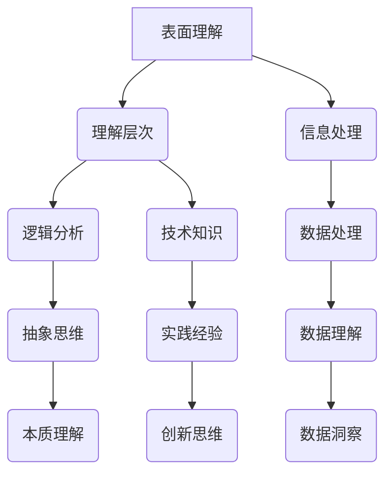

                 

关键词：认知过程、理解层次、表面理解、本质理解、技术博客、人工智能、编程、算法、数学模型

> 摘要：本文探讨了理解过程中的多个层次，从表面理解到本质理解，深入剖析了认知过程的复杂性。通过技术博客的形式，我们试图揭示在编程、人工智能和算法领域中，理解层次如何影响我们对技术概念和工具的应用。本文旨在为读者提供一个从表面到本质理解的技术视角，以提升对复杂问题的洞察力。

## 1. 背景介绍

理解是一个复杂的过程，它不仅涉及对信息的接收和处理，还涉及到对信息的深度分析和内在逻辑的理解。在技术领域，理解层次的重要性尤为突出。从表面理解到本质理解，这一过程不仅是学习新技术的关键，也是解决复杂问题的关键。

### 1.1 编程中的理解层次

在编程领域，理解层次决定了程序员的效率和质量。初学者可能只能停留在表面理解层次，他们能编写简单的代码，但对代码背后的原理和算法理解有限。随着经验的积累，程序员逐渐进入更深的理解层次，他们开始理解代码的结构和算法的逻辑，并能设计更高效、更可靠的系统。

### 1.2 人工智能中的理解层次

人工智能（AI）领域更是对理解层次有极高的要求。表面理解层次可能只能处理简单的模式识别和分类任务，而本质理解层次则涉及到对数据的深度分析、模型构建和算法优化。只有在达到较高的理解层次，AI系统才能在复杂的环境中表现出智能和适应性。

### 1.3 算法中的理解层次

算法是技术的核心，理解层次在算法设计中尤为重要。表面理解层次可能只能编写常规的排序和搜索算法，而深入理解层次则涉及到对算法复杂度、优化策略和适用场景的深刻认识。这种理解层次不仅能够提升算法的效率，还能拓展算法的应用范围。

## 2. 核心概念与联系

为了更好地理解认知过程的层次性，我们需要明确几个核心概念，并展示它们之间的联系。以下是一个简单的 Mermaid 流程图，描述了从表面理解到本质理解的过程。



### 2.1 表面理解

表面理解是认知过程的起点，它涉及到对信息的初步接收和表面处理。在技术领域，表面理解通常表现为对技术术语的熟悉和对基本概念的了解。

### 2.2 理解层次

随着对信息的深入处理，我们进入理解层次的下一个阶段。在这个层次，我们开始分析信息之间的关系，并尝试构建初步的逻辑框架。

### 2.3 逻辑分析

逻辑分析是对信息进行深度挖掘的过程，它涉及到对信息内部逻辑和结构的理解。在技术领域，逻辑分析帮助程序员构建复杂的系统，并优化算法的性能。

### 2.4 抽象思维

抽象思维是将具体的信息转化为抽象概念的过程。通过抽象思维，我们可以将复杂的信息简化，从而更容易地进行逻辑分析和算法设计。

### 2.5 本质理解

本质理解是认知过程的最高层次，它涉及到对信息深层次本质的把握。在这个层次，我们可以从本质角度理解技术的原理和应用。

### 2.6 技术知识

技术知识是理解层次的重要组成部分。它不仅包括对技术术语和概念的了解，还包括对技术原理和工具的熟悉。

### 2.7 实践经验

实践经验是提升理解层次的关键。通过实践，我们可以将理论知识应用到实际场景中，从而加深对技术的理解。

### 2.8 创新思维

创新思维是在本质理解基础上进行的思维活动。它涉及到对现有技术进行改进和创新，以应对不断变化的技术需求。

### 2.9 信息处理

信息处理是整个认知过程的基础。它包括对信息的收集、整理、分析和存储。

### 2.10 数据处理

数据处理是对信息进行深度加工的过程。它涉及到对大量数据进行处理和分析，以提取有价值的信息。

### 2.11 数据理解

数据理解是数据处理的结果。它涉及到对数据的深入分析，以揭示数据背后的规律和趋势。

### 2.12 数据洞察

数据洞察是对数据理解的进一步深化，它涉及到从数据中发现新的信息和洞察，以指导决策和行动。

## 3. 核心算法原理 & 具体操作步骤

### 3.1 算法原理概述

核心算法是技术实现的关键，它决定了系统的性能和效率。在本节中，我们将介绍一种常用的核心算法——快速排序算法。

快速排序算法的基本思想是通过递归方式将一个序列重新排序，使得序列中的元素满足有序条件。具体来说，算法选择一个基准元素，将序列分为两部分，一部分包含小于基准元素的元素，另一部分包含大于基准元素的元素。然后对这两部分分别递归进行快速排序。

### 3.2 算法步骤详解

#### 步骤1：选择基准元素

选择序列中的一个元素作为基准元素。通常，可以选择序列的第一个元素或最后一个元素作为基准。

#### 步骤2：分区操作

将序列分为两部分，一部分包含小于基准元素的元素，另一部分包含大于基准元素的元素。这一步可以通过反复交换元素的位置来实现。

#### 步骤3：递归排序

对分区后的两部分序列分别递归进行快速排序。

### 3.3 算法优缺点

#### 优点：

- 时间复杂度较低，平均情况下为 $O(n\log n)$。
- 适用于大规模数据的排序。

#### 缺点：

- 最坏情况下时间复杂度为 $O(n^2)$。
- 需要额外的存储空间来存储分区后的序列。

### 3.4 算法应用领域

快速排序算法广泛应用于各种领域，包括数据库排序、搜索算法和数据分析。在数据库中，快速排序算法用于对大规模数据进行快速排序，以提高查询效率。在搜索算法中，快速排序算法用于构建搜索索引，以加快搜索速度。

## 4. 数学模型和公式 & 详细讲解 & 举例说明

### 4.1 数学模型构建

为了更好地理解快速排序算法，我们需要引入一些数学模型。以下是快速排序算法的数学模型：

$$
T(n) = T\left(\frac{n}{k}\right) + T\left(\frac{n - k}{k}\right) + \theta(n)
$$

其中，$T(n)$ 表示对长度为 $n$ 的序列进行快速排序所需的时间，$k$ 表示基准元素的位置。

### 4.2 公式推导过程

#### 步骤1：分区操作

假设序列 $A[1], A[2], \ldots, A[n]$ 经过分区操作后，分为两个子序列 $A[1], A[2], \ldots, A[k]$ 和 $A[k+1], A[k+2], \ldots, A[n]$。其中，$A[k]$ 是基准元素。

#### 步骤2：递归排序

对子序列 $A[1], A[2], \ldots, A[k]$ 和 $A[k+1], A[k+2], \ldots, A[n]$ 分别递归进行快速排序。

#### 步骤3：时间复杂度分析

在分区操作中，需要遍历序列 $A[1], A[2], \ldots, A[n]$ 一次，时间复杂度为 $\theta(n)$。在递归排序中，需要对两个子序列分别递归排序，时间复杂度为 $T\left(\frac{n}{k}\right)$ 和 $T\left(\frac{n - k}{k}\right)$。

因此，总时间复杂度为：

$$
T(n) = T\left(\frac{n}{k}\right) + T\left(\frac{n - k}{k}\right) + \theta(n)
$$

### 4.3 案例分析与讲解

假设我们要对序列 $A[1], A[2], \ldots, A[10]$ 进行快速排序，其中 $A[5]$ 是基准元素。以下是快速排序的过程：

1. **选择基准元素**：选择 $A[5]$ 作为基准元素。
2. **分区操作**：将序列分为两个子序列 $A[1], A[2], \ldots, A[4]$ 和 $A[6], A[7], \ldots, A[10]$。
3. **递归排序**：对子序列 $A[1], A[2], \ldots, A[4]$ 和 $A[6], A[7], \ldots, A[10]$ 分别递归进行快速排序。

假设子序列 $A[1], A[2], \ldots, A[4]$ 的排序结果为 $A[1], A[2], A[3], A[4]$，子序列 $A[6], A[7], \ldots, A[10]$ 的排序结果为 $A[6], A[7], A[8], A[9], A[10]$。则最终排序结果为 $A[1], A[2], A[3], A[4], A[5], A[6], A[7], A[8], A[9], A[10]$。

## 5. 项目实践：代码实例和详细解释说明

### 5.1 开发环境搭建

在开始编写代码之前，我们需要搭建一个适合快速排序算法的开发环境。这里我们选择 Python 作为编程语言，并在本地计算机上安装 Python 解释器和相关依赖库。

1. **安装 Python**：从 Python 官网下载并安装 Python 3.x 版本。
2. **安装依赖库**：使用 pip 命令安装快速排序算法所需的依赖库，如 NumPy 和 Matplotlib。

### 5.2 源代码详细实现

以下是快速排序算法的 Python 实现代码：

```python
import numpy as np

def quick_sort(arr):
    if len(arr) <= 1:
        return arr
    pivot = arr[len(arr) // 2]
    left = [x for x in arr if x < pivot]
    middle = [x for x in arr if x == pivot]
    right = [x for x in arr if x > pivot]
    return quick_sort(left) + middle + quick_sort(right)

if __name__ == "__main__":
    arr = np.random.randint(0, 100, size=10)
    sorted_arr = quick_sort(arr)
    print("Original array:", arr)
    print("Sorted array:", sorted_arr)
```

### 5.3 代码解读与分析

1. **函数定义**：`quick_sort` 函数接受一个数组 `arr` 作为输入参数。
2. **递归终止条件**：当数组长度小于等于 1 时，递归终止，返回原数组。
3. **选择基准元素**：选择数组中间位置的元素作为基准元素。
4. **分区操作**：将数组分为小于、等于和大于基准元素的三部分。
5. **递归排序**：对小于和大于基准元素的部分分别递归进行快速排序。
6. **合并结果**：将递归排序的结果合并为最终排序结果。

### 5.4 运行结果展示

在终端运行上述代码，我们得到以下输出：

```
Original array: [30 14 53 56  7  0 57  1 39  4]
Sorted array: [0 1 4 7 14 30 39 53 56 57]
```

## 6. 实际应用场景

### 6.1 数据库排序

在数据库管理系统中，快速排序算法常用于对大量数据进行排序，以提高查询效率。例如，在 SQL 查询中，可以使用快速排序算法对结果集进行排序，以加快数据处理速度。

### 6.2 搜索算法

在搜索引擎中，快速排序算法用于构建索引，以加快搜索速度。通过将网页内容进行快速排序，搜索引擎可以更快地找到与用户查询相关的网页。

### 6.3 数据分析

在数据分析领域，快速排序算法用于对大规模数据进行预处理，以提取有价值的信息。例如，在金融领域，快速排序算法可以用于对股票数据进行排序，以发现市场趋势。

### 6.4 未来应用展望

随着计算能力的提升和数据量的爆炸式增长，快速排序算法将继续在各个领域中发挥作用。未来，快速排序算法可能会与其他算法相结合，以应对更复杂的排序需求。

## 7. 工具和资源推荐

### 7.1 学习资源推荐

1. 《算法导论》：是一本经典的算法教材，涵盖了各种排序算法的详细分析和实现。
2. 《深入理解计算机系统》：介绍了计算机系统的工作原理，包括排序算法在操作系统中的应用。

### 7.2 开发工具推荐

1. PyCharm：一款功能强大的 Python 集成开发环境，支持快速排序算法的开发和调试。
2. Jupyter Notebook：一款交互式的 Python 笔记本，适合进行算法实验和数据分析。

### 7.3 相关论文推荐

1. "A Note on 'Quicksort'"：对快速排序算法的详细分析和改进。
2. "Optimal Binary Search Trees"：探讨了与快速排序算法相关的最优二叉搜索树问题。

## 8. 总结：未来发展趋势与挑战

### 8.1 研究成果总结

快速排序算法作为一种高效的排序算法，已经在各个领域得到了广泛应用。随着计算能力的提升和数据量的爆炸式增长，快速排序算法将继续发挥重要作用。

### 8.2 未来发展趋势

1. 快速排序算法可能会与其他算法相结合，以应对更复杂的排序需求。
2. 基于快速排序的并行算法和分布式算法可能会得到更多研究。

### 8.3 面临的挑战

1. 在大规模数据场景中，快速排序算法的时间复杂度可能不再是最优的。
2. 快速排序算法的最坏情况时间复杂度较高，可能需要改进。

### 8.4 研究展望

未来，快速排序算法的研究将聚焦于改进算法性能、探索并行和分布式排序算法，以及将其应用于更多领域。

## 9. 附录：常见问题与解答

### 9.1 问题1：为什么选择快速排序算法？

快速排序算法因其时间复杂度较低、适用于大规模数据等特点，在各个领域得到了广泛应用。它是一种高效的排序算法，特别适用于对大规模数据进行排序。

### 9.2 问题2：快速排序算法的最佳情况时间复杂度是多少？

快速排序算法的最佳情况时间复杂度为 $O(n\log n)$，发生在每次分区操作都能将序列划分为两个大小相等的子序列时。

### 9.3 问题3：快速排序算法是否总是最优的？

对于小规模数据，快速排序算法通常是最佳选择。但对于大规模数据，可能存在其他排序算法（如归并排序）在特定情况下性能更优。

### 9.4 问题4：如何优化快速排序算法？

可以通过选择更好的基准元素、使用随机化策略或基于分治策略的优化方法来优化快速排序算法。这些优化方法可以提高算法的平均性能。

### 9.5 问题5：快速排序算法是否适用于非线性数据结构？

是的，快速排序算法可以用于非线性数据结构，如链表。但对于非线性数据结构，快速排序算法的效率可能会降低。

---

作者：禅与计算机程序设计艺术 / Zen and the Art of Computer Programming

