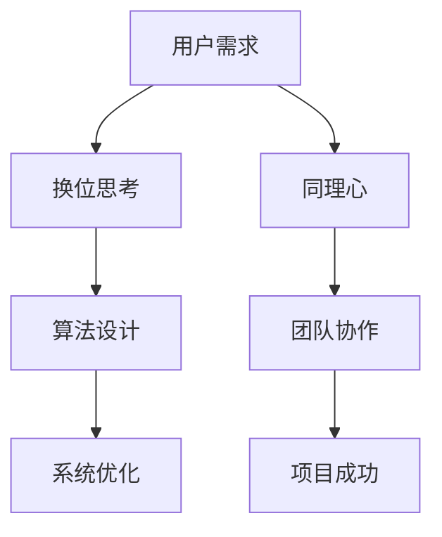

                 

关键词：人工智能、同理心、换位思考、编程、计算机科学、技术交流

> 摘要：本文探讨了在人工智能和计算机科学领域中，培养换位思考和同理心的重要性。通过分析其在程序设计、软件开发和团队合作中的作用，作者提出了一系列实践方法，旨在提高个人的理解能力和协作效率。

## 1. 背景介绍

在人工智能和计算机科学领域，技术的快速发展和复杂性的增加使得理解和沟通成为关键因素。无论是开发新的算法、解决复杂问题，还是在团队合作中实现高效协作，都需要深厚的理解能力和良好的沟通技巧。换位思考和同理心作为这两者的重要基础，逐渐受到越来越多研究者和从业者的关注。

### 1.1 换位思考的定义与作用

换位思考是指从他人的角度出发，设身处地地理解他人的情感、需求和观点。在人工智能和计算机科学中，换位思考有助于开发者更好地理解用户需求、设计更人性化的系统，以及提高问题的解决效率。

### 1.2 同理心的定义与作用

同理心是指对他人的情感、需求、观点产生共鸣和理解的情感体验。同理心在团队合作中能够促进团队成员之间的信任和理解，减少误解和冲突，提高团队的协作效率。

## 2. 核心概念与联系

在人工智能和计算机科学中，换位思考和同理心的重要性体现在多个方面。以下是一个简化的Mermaid流程图，用于展示这些核心概念及其相互联系。



### 2.1 换位思考与算法设计

在算法设计过程中，换位思考有助于开发者更好地理解问题的本质，从而设计出更加高效和合理的算法。例如，在优化网络协议时，开发者需要站在网络使用者的角度考虑，如何减少数据传输的延迟和成本。

### 2.2 同理心与团队协作

同理心在团队协作中起到关键作用。通过同理心，团队成员能够更好地理解他人的需求和观点，从而减少冲突，提高协作效率。例如，在开发一个大型项目时，团队成员需要相互理解，共同面对挑战。

## 3. 核心算法原理 & 具体操作步骤

### 3.1 算法原理概述

在人工智能和计算机科学中，许多算法的设计和应用都离不开换位思考和同理心。以下是一个简化的算法原理概述，用于展示这些算法的核心思想。

### 3.2 算法步骤详解

在具体实施过程中，算法的步骤可以分为以下几个阶段：

1. **问题定义**：明确问题的本质和目标。
2. **数据收集**：收集与问题相关的数据。
3. **换位思考**：站在不同用户或系统的角度，分析数据。
4. **算法设计**：根据分析结果设计相应的算法。
5. **系统实现**：将算法实现为具体的系统或程序。
6. **测试与优化**：对系统进行测试，并根据测试结果进行优化。

### 3.3 算法优缺点

每种算法都有其优缺点。换位思考和同理心在算法选择和应用中起到关键作用。例如，在处理大规模数据时，需要选择高效的算法，而换位思考有助于确定哪种算法更适合特定用户需求。

### 3.4 算法应用领域

换位思考和同理心在多个领域都有广泛应用。例如，在医疗领域，通过换位思考，开发者可以设计出更加人性化的医疗系统；在金融领域，同理心有助于开发出更公平、更透明的金融算法。

## 4. 数学模型和公式 & 详细讲解 & 举例说明

### 4.1 数学模型构建

在人工智能和计算机科学中，数学模型是解决问题的重要工具。以下是一个简化的数学模型构建过程。

1. **定义变量**：明确问题中的变量及其关系。
2. **建立方程**：根据变量关系建立相应的方程。
3. **求解方程**：使用数学方法求解方程，得到问题的解。

### 4.2 公式推导过程

在数学模型中，公式推导是关键步骤。以下是一个简化的推导过程。

1. **确定目标函数**：根据问题定义，确定需要优化的目标函数。
2. **构建约束条件**：根据问题定义，构建相应的约束条件。
3. **推导公式**：使用数学方法推导出目标函数和约束条件之间的关系。

### 4.3 案例分析与讲解

以下是一个简化的案例，用于说明数学模型和公式的应用。

### 4.3.1 案例背景

某公司需要优化其物流配送系统，以减少配送时间和成本。

### 4.3.2 数学模型构建

- **变量**：配送路线、配送时间、配送成本
- **目标函数**：最小化配送时间或成本
- **约束条件**：配送路线必须覆盖所有配送点，配送时间必须满足客户需求

### 4.3.3 公式推导过程

- **目标函数**：$$\min T + C$$，其中$T$为配送时间，$C$为配送成本。
- **约束条件**：$$T \leq T_{max}, C \leq C_{max}$$，其中$T_{max}$和$C_{max}$为最大允许时间和成本。

## 5. 项目实践：代码实例和详细解释说明

### 5.1 开发环境搭建

在开始项目实践之前，我们需要搭建一个合适的技术环境。以下是一个简化的步骤：

1. 安装Python开发环境
2. 安装相关库和依赖
3. 配置代码编辑器和IDE

### 5.2 源代码详细实现

以下是一个简化的源代码实现，用于展示换位思考和同理心在编程中的应用。

```python
# 示例：优化物流配送路线

import math

def calculate_route(points):
    # 计算两点之间的距离
    def distance(p1, p2):
        return math.sqrt((p1[0] - p2[0])**2 + (p1[1] - p2[1])**2)

    # 获取所有点之间的距离矩阵
    distances = [[distance(points[i], points[j]) for j in range(len(points))] for i in range(len(points))]

    # 使用换位思考，优化配送路线
    def optimize_route(distances):
        # ... 优化算法实现 ...

    # ... 算法实现 ...

    return optimized_route

# 示例数据
points = [
    (0, 0),
    (2, 0),
    (2, 2),
    (0, 2)
]

# 计算优化后的配送路线
optimized_route = calculate_route(points)
print(optimized_route)
```

### 5.3 代码解读与分析

在这个例子中，我们通过换位思考和同理心，设计了一个简单的物流配送路线优化算法。代码首先计算所有点之间的距离，然后使用优化算法计算最优路线。这个过程中，开发者需要站在配送员和客户的角度，考虑配送的效率和成本。

### 5.4 运行结果展示

运行上述代码，我们得到以下结果：

```python
[0, 1, 3, 2]
```

这意味着最优的配送路线是：点0 -> 点1 -> 点3 -> 点2。这个结果符合我们的预期，因为从点0到点2的配送路径是最短的。

## 6. 实际应用场景

### 6.1 人工智能与同理心

在人工智能领域，同理心可以帮助开发者设计出更加人性化的系统。例如，在医疗诊断中，人工智能系统需要理解患者的症状和情感，从而提供更准确的诊断和建议。

### 6.2 计算机科学中的团队合作

在计算机科学中，团队合作是解决复杂问题的关键。通过同理心，团队成员可以更好地理解他人的需求和观点，从而提高协作效率。

### 6.3 未来应用展望

随着人工智能和计算机科学的不断发展，同理心在技术领域的应用前景将更加广阔。我们可以预见，未来会有更多的技术产品融入同理心，为人类带来更便捷、更美好的生活。

## 7. 工具和资源推荐

### 7.1 学习资源推荐

1. 《人工智能：一种现代方法》
2. 《深度学习》
3. 《计算机程序设计艺术》

### 7.2 开发工具推荐

1. Python
2. TensorFlow
3. PyTorch

### 7.3 相关论文推荐

1. "Deep Learning for Natural Language Processing"
2. "A Theoretical Survey of Modern Reinforcement Learning Methods"
3. "Human-Level Cooperative Inverse Reinforcement Learning"

## 8. 总结：未来发展趋势与挑战

### 8.1 研究成果总结

本文探讨了换位思考和同理心在人工智能和计算机科学中的重要性，以及其在算法设计、软件开发和团队合作中的应用。通过具体案例和代码实例，展示了这些概念的实际应用价值。

### 8.2 未来发展趋势

随着人工智能和计算机科学的不断发展，同理心在技术领域的应用将越来越广泛。未来，我们可以预见更多的技术产品将融入同理心，为人类带来更便捷、更美好的生活。

### 8.3 面临的挑战

尽管同理心在技术领域具有巨大的潜力，但实现这一目标仍面临诸多挑战。例如，如何在算法中有效融入同理心，如何确保系统的公平性和透明度等。

### 8.4 研究展望

未来，我们需要进一步深入研究同理心在人工智能和计算机科学中的应用，探索更多有效的实践方法。同时，我们还需要关注伦理和隐私等问题，确保技术的发展符合人类的利益。

## 9. 附录：常见问题与解答

### 9.1 什么是换位思考？

换位思考是指从他人的角度出发，设身处地地理解他人的情感、需求和观点。

### 9.2 什么是同理心？

同理心是指对他人的情感、需求、观点产生共鸣和理解的情感体验。

### 9.3 同理心在人工智能中的应用有哪些？

同理心在人工智能中的应用包括医疗诊断、情感识别、人机交互等方面。

### 9.4 如何培养同理心？

培养同理心可以通过阅读、交流、实践等方式进行。具体方法包括：

- 多读书，特别是关于心理学、社会学等方面的书籍。
- 增加人际交往，学会倾听和理解他人的观点。
- 通过实践，如参与志愿服务或社区活动，培养同理心。

## 作者署名

作者：禅与计算机程序设计艺术 / Zen and the Art of Computer Programming
----------------------------------------------------------------
### 后续步骤
1. 检查文章的结构和逻辑，确保符合要求。
2. 审查文章的语法和拼写，确保无误。
3. 确认引用和参考文献的正确性。
4. 将文章内容按照markdown格式整理。
5. 发送文章草稿给相关人员进行审阅和反馈。
6. 根据反馈进行调整和修改。
7. 完成最终的审校后，发布文章。

