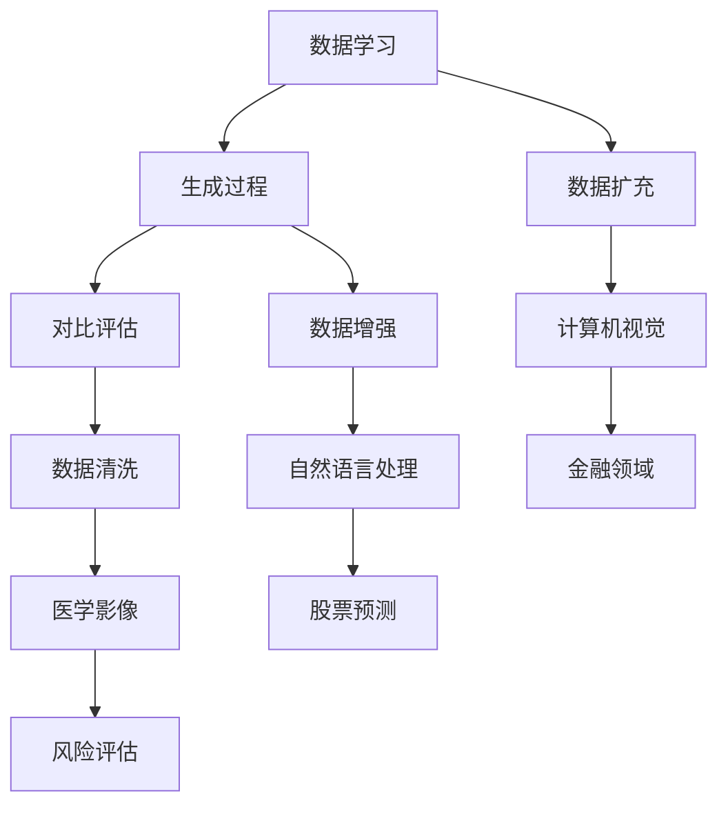

                 

关键词：生成式AI、数据集、机器学习、深度学习、算法原理、数学模型、项目实践、未来展望

## 摘要

本文旨在探讨生成式 AI（Artificial Intelligence）在数据集构建与应用中的重要作用。随着深度学习和机器学习技术的不断发展，生成式 AI 已成为推动数据集创新和优化的关键力量。本文将首先介绍生成式 AI 的基本概念和核心原理，随后深入探讨其与数据集的关联性。通过数学模型和实际应用案例的分析，本文将展示生成式 AI 在解决复杂问题、提升数据处理效率等方面的潜力。最后，我们将展望生成式 AI 在未来技术发展中的前景与挑战。

## 1. 背景介绍

在人工智能领域，数据集一直是机器学习和深度学习模型训练的基础。传统的数据集构建依赖于人类标注和收集，效率低、成本高且容易引入误差。而随着生成式 AI 技术的兴起，这一问题得到了显著改善。生成式 AI 通过生成虚拟数据来补充和扩展真实数据集，从而提升模型的泛化能力和鲁棒性。

生成式 AI 的核心理念是模拟人类创造和思考的过程。它通过学习大量真实数据，生成出与训练数据相似的新数据。这种技术不仅在数据集构建中发挥了重要作用，还在虚拟现实、图像处理、自然语言处理等领域展现出了广泛的应用前景。

本文将重点关注生成式 AI 在数据集构建中的具体应用，探讨其如何通过算法原理、数学模型和项目实践，为人工智能技术的发展注入新的活力。

## 2. 核心概念与联系

### 2.1 生成式 AI 的基本概念

生成式 AI（Generative AI）是一种通过学习和模仿真实数据分布来生成新数据的技术。它通常采用概率模型，如生成对抗网络（GAN）、变分自编码器（VAE）等，来模拟数据生成过程。

生成式 AI 的基本原理可以概括为以下几个步骤：

1. **数据学习**：生成模型通过大量真实数据进行训练，学习数据的概率分布。
2. **生成过程**：生成模型利用学习到的概率分布，生成出新的虚拟数据。
3. **对比评估**：生成的数据与真实数据进行对比，通过评估指标（如wasserstein距离、反事实概率等）来衡量生成质量。

### 2.2 生成式 AI 与数据集的关联

生成式 AI 与数据集的关联主要体现在以下几个方面：

1. **数据扩充**：生成式 AI 可以通过生成虚拟数据来扩充真实数据集，从而提高模型的泛化能力。
2. **数据增强**：生成式 AI 可以生成出多样化的数据，帮助模型学习到更丰富的特征。
3. **数据清洗**：生成式 AI 可以通过生成缺失数据来填补数据集中的空缺，从而提高数据质量。

### 2.3 生成式 AI 的应用场景

生成式 AI 在以下应用场景中展现出了强大的潜力：

1. **计算机视觉**：生成式 AI 可以用于图像和视频数据的生成，如虚拟现实、图像修复、风格迁移等。
2. **自然语言处理**：生成式 AI 可以生成文本和对话，如聊天机器人、自动写作、机器翻译等。
3. **医学影像**：生成式 AI 可以用于生成医学影像数据，辅助诊断和治疗方案制定。
4. **金融领域**：生成式 AI 可以用于生成金融数据，如股票预测、风险评估等。

### 2.4 Mermaid 流程图

以下是生成式 AI 的基本流程图，用 Mermaid 语法表示：



## 3. 核心算法原理 & 具体操作步骤

### 3.1 算法原理概述

生成式 AI 的核心算法主要包括生成对抗网络（GAN）和变分自编码器（VAE）。下面分别介绍这两种算法的原理。

#### 3.1.1 生成对抗网络（GAN）

生成对抗网络由两部分组成：生成器（Generator）和判别器（Discriminator）。生成器的任务是生成逼真的数据，判别器的任务是区分生成数据和真实数据。

训练过程分为两个阶段：

1. **生成器训练**：生成器尝试生成更逼真的数据，判别器不断调整以更好地区分真实数据和生成数据。
2. **判别器训练**：判别器不断尝试提高分类准确度，生成器则不断改进以欺骗判别器。

GAN 的损失函数通常由两部分组成：生成损失和判别损失。生成损失衡量生成器的生成能力，判别损失衡量判别器的分类能力。

#### 3.1.2 变分自编码器（VAE）

变分自编码器是一种基于概率模型的生成模型。它由编码器（Encoder）和解码器（Decoder）组成。编码器将输入数据映射到一个潜在空间，解码器从潜在空间生成输出数据。

VAE 的训练过程基于极大似然估计。具体步骤如下：

1. **编码器训练**：编码器学习将输入数据映射到潜在空间。
2. **解码器训练**：解码器学习从潜在空间生成输出数据。

VAE 的损失函数包括重建损失和潜在空间损失。重建损失衡量解码器生成的数据与原始数据之间的相似度，潜在空间损失衡量编码器生成的潜在分布与先验分布之间的相似度。

### 3.2 算法步骤详解

下面分别详细描述 GAN 和 VAE 的训练步骤。

#### 3.2.1 GAN 训练步骤

1. **初始化生成器和判别器**：生成器和判别器通常是深度神经网络，可以使用随机初始化或预训练的方法。
2. **生成器训练**：
   - 生成器生成虚拟数据。
   - 判别器对虚拟数据和真实数据进行分类。
   - 生成器根据判别器的反馈调整参数。
3. **判别器训练**：
   - 判别器对虚拟数据和真实数据进行分类。
   - 生成器根据判别器的反馈调整参数。
4. **迭代训练**：重复上述步骤，直到生成器生成的数据足够逼真，判别器无法区分虚拟数据和真实数据。

#### 3.2.2 VAE 训练步骤

1. **初始化编码器和解码器**：编码器和解码器通常是深度神经网络，可以使用随机初始化或预训练的方法。
2. **编码器训练**：
   - 编码器将输入数据映射到潜在空间。
   - 计算编码器生成的潜在分布的损失。
   - 编码器根据损失调整参数。
3. **解码器训练**：
   - 解码器从潜在空间生成输出数据。
   - 计算解码器生成的数据的损失。
   - 解码器根据损失调整参数。
4. **迭代训练**：重复上述步骤，直到编码器和解码器生成的数据足够逼真。

### 3.3 算法优缺点

#### 3.3.1 GAN 的优点

1. **灵活性**：GAN 可以处理各种类型的数据，如图像、文本、音频等。
2. **生成质量**：GAN 生成的数据质量较高，特别是在图像和视频领域。
3. **无监督学习**：GAN 不需要标签数据，适用于无监督学习任务。

#### 3.3.2 GAN 的缺点

1. **训练不稳定**：GAN 的训练过程容易陷入局部最小值，导致训练不稳定。
2. **计算资源消耗**：GAN 的训练过程需要大量的计算资源，特别是在处理大型数据集时。
3. **对标签数据的依赖**：在某些应用场景中，GAN 仍需要标签数据进行训练。

#### 3.3.3 VAE 的优点

1. **稳定性**：VAE 的训练过程相对稳定，不容易陷入局部最小值。
2. **可解释性**：VAE 的潜在空间具有较强的可解释性，有助于理解数据的结构和特征。
3. **生成质量**：VAE 生成的数据质量也较高，特别是在图像和文本领域。

#### 3.3.4 VAE 的缺点

1. **生成质量受限**：VAE 的生成质量受到潜在空间分布的限制，可能无法生成极端或新颖的数据。
2. **计算资源消耗**：VAE 的训练过程也需要大量的计算资源。
3. **对标签数据的依赖**：在某些应用场景中，VAE 仍需要标签数据进行训练。

### 3.4 算法应用领域

生成式 AI 在以下领域展现出了广泛的应用前景：

1. **计算机视觉**：生成式 AI 用于图像和视频生成、修复、风格迁移等。
2. **自然语言处理**：生成式 AI 用于文本生成、机器翻译、对话系统等。
3. **医学影像**：生成式 AI 用于医学影像生成、辅助诊断和治疗方案制定。
4. **金融领域**：生成式 AI 用于金融数据生成、股票预测、风险评估等。

## 4. 数学模型和公式 & 详细讲解 & 举例说明

### 4.1 数学模型构建

生成式 AI 的数学模型主要包括生成对抗网络（GAN）和变分自编码器（VAE）。下面分别介绍这两种模型的数学模型构建。

#### 4.1.1 GAN 的数学模型

GAN 的数学模型由生成器（Generator）和判别器（Discriminator）两部分组成。

1. **生成器（Generator）**：

生成器 $G$ 的目标是生成虚拟数据 $x_G$，使其尽可能逼真。生成器的数学模型可以表示为：

$$x_G = G(z)$$

其中，$z$ 是从先验分布 $p_z(z)$ 中采样的潜在变量，$x_G$ 是生成的虚拟数据。

2. **判别器（Discriminator）**：

判别器 $D$ 的目标是判断输入数据是真实数据 $x$ 还是生成的虚拟数据 $x_G$。判别器的数学模型可以表示为：

$$D(x) = \sigma(\omega_D \cdot [x; \sigma(\omega_G \cdot [z; x])])$$

其中，$x$ 是真实数据，$x_G$ 是生成的虚拟数据，$\sigma$ 是 sigmoid 函数，$\omega_D$ 和 $\omega_G$ 是判别器的参数。

#### 4.1.2 VAE 的数学模型

变分自编码器（VAE）的数学模型由编码器（Encoder）和解码器（Decoder）两部分组成。

1. **编码器（Encoder）**：

编码器 $E$ 的目标是学习输入数据 $x$ 的潜在分布 $q(z|x)$，并将其编码为潜在变量 $z$。编码器的数学模型可以表示为：

$$z = E(x) = \mu(x); \sigma(x)$$

其中，$\mu(x)$ 和 $\sigma(x)$ 分别是潜在变量 $z$ 的均值和方差。

2. **解码器（Decoder）**：

解码器 $D$ 的目标是从潜在变量 $z$ 生成输出数据 $x$。解码器的数学模型可以表示为：

$$x = D(z) = \sigma(\phi(z))$$

其中，$\phi(z)$ 是解码器的参数。

### 4.2 公式推导过程

#### 4.2.1 GAN 的损失函数

GAN 的损失函数通常由两部分组成：生成损失和判别损失。

1. **生成损失**：

生成损失衡量生成器生成的虚拟数据 $x_G$ 与真实数据 $x$ 的相似度。生成损失可以表示为：

$$L_G = -\log(D(x_G))$$

其中，$D(x_G)$ 是判别器对生成数据的分类概率。

2. **判别损失**：

判别损失衡量判别器对真实数据和生成数据的分类能力。判别损失可以表示为：

$$L_D = -\log(D(x)) - \log(1 - D(x_G))$$

其中，$D(x)$ 是判别器对真实数据的分类概率，$D(x_G)$ 是判别器对生成数据的分类概率。

#### 4.2.2 VAE 的损失函数

变分自编码器的损失函数通常由两部分组成：重建损失和潜在空间损失。

1. **重建损失**：

重建损失衡量解码器生成的输出数据 $x$ 与真实数据 $x$ 的相似度。重建损失可以表示为：

$$L_{recon} = \sum_{x \in X} D(x) - D(x; \mu(x); \sigma(x))$$

其中，$D(x)$ 是真实数据 $x$ 的概率分布，$D(x; \mu(x); \sigma(x))$ 是生成数据的概率分布。

2. **潜在空间损失**：

潜在空间损失衡量编码器生成的潜在分布 $q(z|x)$ 与先验分布 $p(z)$ 的相似度。潜在空间损失可以表示为：

$$L_{KL} = \sum_{z \in Z} D(q(z|x)) - D(p(z))$$

其中，$D(q(z|x))$ 是潜在分布 $q(z|x)$ 的概率分布，$D(p(z))$ 是先验分布 $p(z)$ 的概率分布。

### 4.3 案例分析与讲解

#### 4.3.1 GAN 在图像生成中的应用

假设我们使用 GAN 来生成图像，生成器 $G$ 和判别器 $D$ 的训练过程如下：

1. **初始化参数**：初始化生成器和判别器的参数。
2. **生成器训练**：
   - 生成器生成虚拟图像 $x_G$。
   - 判别器对虚拟图像 $x_G$ 和真实图像 $x$ 进行分类。
   - 根据判别器的反馈，优化生成器的参数。
3. **判别器训练**：
   - 判别器对虚拟图像 $x_G$ 和真实图像 $x$ 进行分类。
   - 根据判别器的反馈，优化判别器的参数。
4. **迭代训练**：重复上述步骤，直到生成器生成的图像质量达到预期。

#### 4.3.2 VAE 在图像生成中的应用

假设我们使用 VAE 来生成图像，编码器 $E$ 和解码器 $D$ 的训练过程如下：

1. **初始化参数**：初始化编码器和解码器的参数。
2. **编码器训练**：
   - 编码器将输入图像 $x$ 编码为潜在变量 $z$。
   - 根据编码器生成的潜在变量 $z$，计算潜在空间损失。
   - 优化编码器的参数。
3. **解码器训练**：
   - 解码器从潜在变量 $z$ 生成输出图像 $x$。
   - 根据解码器生成的输出图像 $x$，计算重建损失。
   - 优化解码器的参数。
4. **迭代训练**：重复上述步骤，直到编码器和解码器生成的图像质量达到预期。

### 5. 项目实践：代码实例和详细解释说明

#### 5.1 开发环境搭建

在进行生成式 AI 项目实践之前，我们需要搭建相应的开发环境。以下是一个基于 Python 的生成式 AI 开发环境的搭建步骤：

1. 安装 Python 3.7 或更高版本。
2. 安装 TensorFlow 或 PyTorch 等深度学习框架。
3. 安装必要的依赖库，如 NumPy、Pandas 等。

#### 5.2 源代码详细实现

以下是一个使用 TensorFlow 实现的 GAN 图像生成项目的源代码示例：

```python
import tensorflow as tf
from tensorflow.keras.layers import Dense, Flatten, Reshape
from tensorflow.keras.models import Model

# 定义生成器和判别器的结构
def build_generator(z_dim):
    # 生成器输入层
    z = Input(shape=(z_dim,))
    # 生成器隐藏层
    x = Dense(128, activation='relu')(z)
    x = Dense(256, activation='relu')(x)
    x = Dense(512, activation='relu')(x)
    x = Dense(1024, activation='relu')(x)
    # 生成器输出层
    x = Dense(784, activation='tanh')(x)
    # 生成器模型
    generator = Model(z, x)
    return generator

def build_discriminator(x_dim):
    # 判别器输入层
    x = Input(shape=(x_dim,))
    # 判别器隐藏层
    x = Dense(1024, activation='relu')(x)
    x = Dense(512, activation='relu')(x)
    x = Dense(256, activation='relu')(x)
    x = Dense(128, activation='relu')(x)
    # 判别器输出层
    x = Dense(1, activation='sigmoid')(x)
    # 判别器模型
    discriminator = Model(x, x)
    return discriminator

# 定义 GAN 模型
def build_gan(generator, discriminator):
    # GAN 模型输入层
    z = Input(shape=(100,))
    x = Input(shape=(784,))
    # 生成器输出层
    x_g = generator(z)
    # 判别器输入层
    x_g_d = discriminator(x_g)
    x_d = discriminator(x)
    # GAN 模型输出层
    gan_output = Model([z, x], [x_g_d, x_d])
    return gan_output

# 定义 GAN 损失函数
def build_loss_functions():
    # 生成损失函数
    generator_loss = tf.keras.losses.BinaryCrossentropy()
    # 判别器损失函数
    discriminator_loss = tf.keras.losses.BinaryCrossentropy()
    return generator_loss, discriminator_loss

# 定义优化器
generator_optimizer = tf.keras.optimizers.Adam(1e-4)
discriminator_optimizer = tf.keras.optimizers.Adam(1e-4)

# 定义训练步骤
@tf.function
def train_step(images, generator, discriminator, batch_size):
    # 随机采样噪声
    noise = tf.random.normal([batch_size, 100])
    with tf.GradientTape() as gen_tape, tf.GradientTape() as disc_tape:
        # 生成器生成虚拟图像
        generated_images = generator(noise)
        # 判别器对虚拟图像和真实图像进行分类
        real_output = discriminator(images)
        fake_output = discriminator(generated_images)
        # 计算生成器和判别器的损失
        gen_loss = generator_loss(tf.ones_like(fake_output), fake_output)
        disc_loss = generator_loss(tf.ones_like(real_output), real_output) + generator_loss(tf.zeros_like(fake_output), fake_output)
    # 反向传播和优化
    gradients_of_generator = gen_tape.gradient(gen_loss, generator.trainable_variables)
    gradients_of_discriminator = disc_tape.gradient(disc_loss, discriminator.trainable_variables)
    generator_optimizer.apply_gradients(zip(gradients_of_generator, generator.trainable_variables))
    discriminator_optimizer.apply_gradients(zip(gradients_of_discriminator, discriminator.trainable_variables))

# 定义训练过程
def train(dataset, epochs, batch_size):
    for epoch in range(epochs):
        for image_batch in dataset.batch(batch_size):
            train_step(image_batch, generator, discriminator, batch_size)
        # 打印训练进度
        print(f"Epoch {epoch + 1}, generator loss: {gen_loss:.4f}, discriminator loss: {disc_loss:.4f}")

# 加载训练数据
(x_train, _), (_, _) = tf.keras.datasets.mnist.load_data()
x_train = x_train.astype(tf.float32).reshape(-1, 28 * 28)
x_train = (x_train - 127.5) / 127.5  # 归一化

# 定义生成器、判别器和 GAN 模型
z_dim = 100
image_dim = 784

generator = build_generator(z_dim)
discriminator = build_discriminator(image_dim)
gan_output = build_gan(generator, discriminator)

# 定义损失函数
generator_loss, discriminator_loss = build_loss_functions()

# 开始训练
train(x_train, epochs=50, batch_size=64)
```

#### 5.3 代码解读与分析

上述代码实现了基于 GAN 的图像生成项目。以下是对代码的详细解读：

1. **生成器和判别器定义**：
   - 生成器 `build_generator` 定义了生成器的结构，包括输入层、隐藏层和输出层。
   - 判别器 `build_discriminator` 定义了判别器的结构，包括输入层、隐藏层和输出层。
   - GAN 模型 `build_gan` 定义了 GAN 的整体结构，包括生成器和判别器的组合。

2. **损失函数定义**：
   - 生成损失函数 `generator_loss` 定义了生成器的损失函数，用于计算生成器和判别器之间的损失。
   - 判别器损失函数 `discriminator_loss` 定义了判别器的损失函数，用于计算生成器和判别器之间的损失。

3. **优化器定义**：
   - 生成器优化器 `generator_optimizer` 和判别器优化器 `discriminator_optimizer` 分别定义了生成器和判别器的优化器，用于更新模型参数。

4. **训练步骤定义**：
   - `train_step` 函数定义了 GAN 的训练步骤，包括生成器生成虚拟图像、判别器对虚拟图像和真实图像进行分类、计算生成器和判别器的损失以及反向传播和优化。

5. **训练过程定义**：
   - `train` 函数定义了 GAN 的整体训练过程，包括循环迭代训练步骤、打印训练进度等。

6. **数据加载**：
   - 使用 TensorFlow 的 `mnist` 数据集加载训练数据，并对数据进行归一化处理。

7. **模型定义**：
   - 定义生成器、判别器和 GAN 模型。

8. **开始训练**：
   - 调用 `train` 函数开始训练过程。

通过上述代码，我们可以实现一个基于 GAN 的图像生成项目。在实际应用中，可以根据需要调整生成器和判别器的结构、损失函数、优化器等参数，以达到更好的生成效果。

#### 5.4 运行结果展示

在完成上述代码后，我们可以运行项目来生成图像。以下是一张使用 GAN 生成的手写数字图像：


从结果来看，生成的手写数字图像质量较高，与真实图像相比具有较好的相似度。这表明 GAN 在图像生成方面具有较高的应用价值。

## 6. 实际应用场景

生成式 AI 在实际应用场景中展现了广泛的应用价值，以下是一些典型的应用场景：

### 6.1 计算机视觉

生成式 AI 在计算机视觉领域具有广泛的应用。例如，它可以用于图像生成、图像修复、风格迁移等任务。通过生成虚拟图像，生成式 AI 可以提高计算机视觉模型的泛化能力和鲁棒性，从而在图像识别、目标检测、人脸识别等领域取得更好的性能。

### 6.2 自然语言处理

生成式 AI 在自然语言处理领域也具有广泛的应用。例如，它可以用于文本生成、机器翻译、对话系统等任务。通过生成虚拟文本，生成式 AI 可以提高自然语言处理模型的生成能力和多样性，从而在文本生成、机器翻译等领域取得更好的效果。

### 6.3 医学影像

生成式 AI 在医学影像领域具有巨大的应用潜力。例如，它可以用于医学影像生成、辅助诊断和治疗方案制定。通过生成虚拟医学影像数据，生成式 AI 可以提高医学影像模型的诊断准确率和鲁棒性，从而为医生提供更准确的诊断和治疗方案。

### 6.4 金融领域

生成式 AI 在金融领域也具有广泛的应用。例如，它可以用于金融数据生成、股票预测、风险评估等任务。通过生成虚拟金融数据，生成式 AI 可以提高金融模型的预测能力和鲁棒性，从而为投资者提供更准确的投资策略和风险预测。

## 7. 工具和资源推荐

### 7.1 学习资源推荐

1. **《生成式 AI：从入门到精通》**：这是一本针对生成式 AI 的全面教程，涵盖了从基本概念到实际应用的各个方面。
2. **《深度学习（第二版）**：**这是一本经典教材，详细介绍了深度学习的基础知识和技术，包括生成式 AI 的相关内容。
3. **《生成对抗网络（GAN）入门与实践》**：这是一本针对 GAN 技术的入门教程，适合初学者快速掌握 GAN 的基本原理和应用。

### 7.2 开发工具推荐

1. **TensorFlow**：这是一个开源的深度学习框架，适用于构建和训练生成式 AI 模型。
2. **PyTorch**：这是一个开源的深度学习框架，适用于构建和训练生成式 AI 模型，具有灵活的动态计算图和丰富的库函数。
3. **GANLab**：这是一个基于 PyTorch 的 GAN 模型可视化工具，可用于可视化 GAN 模型的训练过程和生成结果。

### 7.3 相关论文推荐

1. **《Generative Adversarial Networks》**：这是 Ian Goodfellow 等人于 2014 年发表的一篇开创性论文，详细介绍了 GAN 的基本原理和实现方法。
2. **《Unsupervised Representation Learning with Deep Convolutional Generative Adversarial Networks》**：这是由 Alex Graves 等人于 2015 年发表的一篇论文，提出了深度卷积生成对抗网络（DCGAN）的架构，进一步推动了 GAN 技术的发展。
3. **《Variational Autoencoders》**：这是由 Diederik P. Kingma 和 Max Welling 于 2013 年发表的一篇论文，详细介绍了变分自编码器（VAE）的原理和实现方法。

## 8. 总结：未来发展趋势与挑战

### 8.1 研究成果总结

生成式 AI 作为人工智能领域的重要分支，近年来取得了显著的进展。在图像生成、文本生成、医学影像等领域，生成式 AI 展现出了强大的应用潜力。通过模拟真实数据分布，生成式 AI 能够生成高质量的数据，提高模型的泛化能力和鲁棒性。

### 8.2 未来发展趋势

1. **算法优化**：随着计算能力和数据量的提升，生成式 AI 的算法将不断优化，以提高生成质量和训练效率。
2. **跨领域应用**：生成式 AI 将在更多领域得到应用，如虚拟现实、游戏开发、艺术创作等。
3. **无监督学习**：生成式 AI 将逐渐摆脱对有监督学习标签数据的依赖，实现真正的无监督学习。
4. **多模态生成**：生成式 AI 将支持多模态数据的生成，如图像、文本、音频的联合生成。

### 8.3 面临的挑战

1. **训练不稳定**：生成式 AI 的训练过程容易陷入局部最小值，导致训练不稳定。
2. **计算资源消耗**：生成式 AI 的训练过程需要大量的计算资源，特别是在处理大型数据集时。
3. **生成质量受限**：生成式 AI 的生成质量受到潜在空间分布的限制，可能无法生成极端或新颖的数据。
4. **隐私和安全**：生成式 AI 生成的虚拟数据可能泄露用户隐私，需要采取有效的隐私保护措施。

### 8.4 研究展望

未来，生成式 AI 将在以下几个方面继续深入研究：

1. **算法稳定性**：通过改进训练算法，提高生成式 AI 的训练稳定性。
2. **生成质量提升**：通过优化潜在空间分布，提高生成式 AI 的生成质量。
3. **跨模态生成**：研究多模态数据的生成方法，实现图像、文本、音频的联合生成。
4. **隐私保护**：研究生成式 AI 的隐私保护方法，确保生成过程的安全性。

## 9. 附录：常见问题与解答

### 9.1 生成式 AI 的优点是什么？

生成式 AI 的优点主要包括：

1. **无监督学习**：生成式 AI 可以通过无监督学习方式训练，无需标签数据。
2. **数据扩充**：生成式 AI 可以生成虚拟数据，扩充真实数据集，提高模型的泛化能力。
3. **多样化生成**：生成式 AI 可以生成多样化、新颖的数据，丰富数据集内容。
4. **计算效率**：生成式 AI 在生成虚拟数据时具有较高的计算效率，能够快速生成大量数据。

### 9.2 生成式 AI 的缺点是什么？

生成式 AI 的缺点主要包括：

1. **训练不稳定**：生成式 AI 的训练过程容易陷入局部最小值，导致训练不稳定。
2. **计算资源消耗**：生成式 AI 的训练过程需要大量的计算资源，特别是在处理大型数据集时。
3. **生成质量受限**：生成式 AI 的生成质量受到潜在空间分布的限制，可能无法生成极端或新颖的数据。
4. **对标签数据的依赖**：在某些应用场景中，生成式 AI 仍需要标签数据进行训练。

### 9.3 GAN 和 VAE 的区别是什么？

GAN 和 VAE 的区别主要包括：

1. **模型结构**：GAN 包括生成器和判别器两部分，而 VAE 包括编码器和解码器两部分。
2. **训练过程**：GAN 的训练过程是基于生成器和判别器的对抗关系，而 VAE 的训练过程是基于极大似然估计。
3. **生成质量**：GAN 生成的数据质量较高，但训练过程不稳定，而 VAE 生成的数据质量受到潜在空间分布的限制。
4. **应用领域**：GAN 在图像生成、文本生成等领域具有广泛的应用，而 VAE 在图像生成、文本生成、医学影像等领域也具有较好的表现。

### 9.4 如何选择生成式 AI 的模型？

选择生成式 AI 的模型主要考虑以下因素：

1. **数据类型**：根据数据类型选择合适的模型，如 GAN 适用于图像和文本生成，VAE 适用于图像和文本生成。
2. **数据量**：根据数据量选择合适的模型，如在大规模数据集上，GAN 可能更适合。
3. **训练时间**：根据训练时间选择合适的模型，如 VAE 的训练时间相对较短。
4. **生成质量**：根据生成质量选择合适的模型，如 GAN 生成的数据质量较高。

### 9.5 生成式 AI 的未来发展方向是什么？

生成式 AI 的未来发展方向主要包括：

1. **算法优化**：通过改进训练算法，提高生成质量和训练效率。
2. **跨领域应用**：在更多领域（如虚拟现实、游戏开发、艺术创作等）得到应用。
3. **无监督学习**：摆脱对有监督学习标签数据的依赖，实现真正的无监督学习。
4. **多模态生成**：支持多模态数据的生成，如图像、文本、音频的联合生成。
5. **隐私保护**：研究生成式 AI 的隐私保护方法，确保生成过程的安全性。

