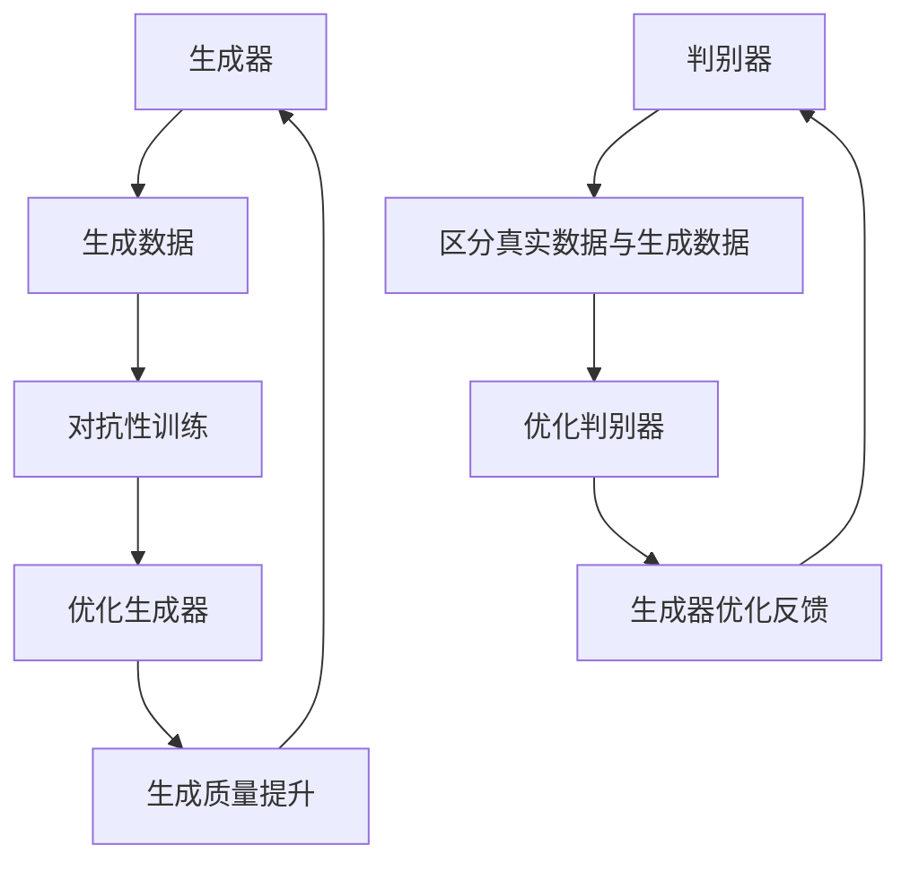
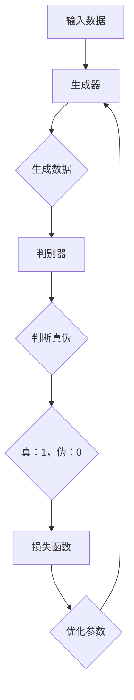

                 

关键词：生成式AI、AIGC、商业本质、技术泡沫、应用场景、未来展望

摘要：随着生成式人工智能（AIGC）技术的迅速发展，其在各行各业的应用逐渐兴起，成为科技界和商业界热议的话题。本文旨在探讨生成式AIGC技术是否具有成为金矿的潜力，还是仅仅是一场泡沫。通过对生成式AIGC的核心概念、技术原理、数学模型、实际应用和未来发展等方面的深入分析，我们将尝试回答这一关键问题，并探讨其回归商业本质的可能路径。

## 1. 背景介绍

### 1.1 生成式人工智能的定义与发展

生成式人工智能（Generative Artificial Intelligence，简称AIGC）是指一类能够生成各种类型数据（如图像、文本、音频、视频等）的人工智能技术。与传统的基于规则的专家系统或监督学习的分类、预测等技术不同，生成式人工智能通过学习和模拟数据生成过程，能够自主生成新的、符合特定条件的数据。这种技术近年来在深度学习、神经网络等领域取得了显著进展，成为人工智能研究的重要方向。

生成式人工智能的发展可以追溯到上世纪80年代的生成对抗网络（Generative Adversarial Networks，GANs）。GANs由两个神经网络组成：生成器（Generator）和判别器（Discriminator）。生成器的目标是生成尽可能逼真的数据，而判别器的目标是区分真实数据和生成数据。通过这种对抗性的训练过程，生成器能够不断改进其生成能力，从而生成高质量的数据。

### 1.2 AIGC的应用场景与商业价值

随着生成式人工智能技术的发展，其在各个领域的应用场景逐渐丰富，商业价值也逐渐显现。以下是一些典型的应用场景：

- **图像生成与编辑**：生成式人工智能可以用于生成逼真的图像，以及实现图像的自动编辑和优化。例如，Adobe公司的Photoshop产品中已经集成了基于生成式人工智能的图像生成和编辑功能。

- **文本生成与自动化写作**：生成式人工智能可以用于生成新闻文章、广告文案、产品描述等文本内容。例如，OpenAI的GPT系列模型在自动生成新闻文章和翻译文本方面已经取得了显著成果。

- **音乐与视频生成**：生成式人工智能可以用于生成音乐、视频等内容。例如，Google的Magenta项目利用生成式人工智能生成音乐和艺术作品，Netflix则利用生成式人工智能生成视频预告片。

- **虚拟现实与增强现实**：生成式人工智能可以用于生成虚拟现实和增强现实场景中的内容，提供更加逼真的体验。

### 1.3 技术泡沫与商业本质

然而，随着生成式人工智能的广泛应用和商业价值的凸显，业界也出现了一些质疑声音。一些人认为，生成式人工智能技术的发展过快，导致市场上出现了一些炒作和泡沫。这些泡沫可能源于以下几个原因：

- **技术炒作**：一些企业或投资者出于短期利益的考虑，过度炒作生成式人工智能技术，导致市场过度繁荣。

- **投资过热**：大量资金涌入生成式人工智能领域，导致市场供需失衡，一些不具备实际技术实力和商业模型的公司也获得了融资。

- **应用瓶颈**：尽管生成式人工智能在一些领域取得了显著进展，但在一些关键应用场景中仍存在技术瓶颈，无法实现商业化。

本文将深入探讨生成式AIGC技术的核心概念、技术原理、数学模型、实际应用和未来发展，以回答“生成式AIGC是金矿还是泡沫”这一关键问题，并探讨其回归商业本质的可能路径。

## 2. 核心概念与联系

### 2.1 生成式人工智能的基本概念

生成式人工智能（AIGC）的核心概念包括生成器（Generator）、判别器（Discriminator）和对抗性训练（Adversarial Training）。以下是一个简化的Mermaid流程图，描述了这三个核心概念之间的联系：



在这个流程图中，生成器负责生成数据，判别器负责区分真实数据和生成数据。通过对抗性训练，生成器不断优化其生成数据的质量，以达到骗过判别器的目标。

### 2.2 生成式人工智能的架构与技术原理

生成式人工智能的架构主要包括生成器、判别器和损失函数。以下是一个详细的Mermaid流程图，展示了这些组件之间的关系：



在这个流程图中，输入数据通过生成器生成数据，判别器判断生成数据是否真实。通过损失函数计算生成数据与真实数据之间的差异，并反馈给生成器进行优化。这个过程不断迭代，直至生成器生成的数据接近真实数据。

### 2.3 生成式人工智能的优缺点

生成式人工智能具有以下优点：

- **数据多样性**：生成式人工智能可以生成大量的、多样化的数据，为研究和应用提供了丰富的资源。

- **自适应能力**：生成式人工智能可以根据需求和反馈不断优化生成过程，提高生成数据的质量。

- **跨领域应用**：生成式人工智能在图像、文本、音频、视频等多个领域都有广泛的应用，具有很高的灵活性。

然而，生成式人工智能也存在一些缺点：

- **训练成本高**：生成式人工智能的训练过程需要大量的计算资源和时间，成本较高。

- **数据隐私风险**：生成式人工智能可能会泄露训练数据中的隐私信息，引发数据安全和隐私问题。

- **道德和法律问题**：生成式人工智能生成的内容可能涉及道德和法律问题，如虚假新闻、侵权等。

### 2.4 生成式人工智能的应用领域

生成式人工智能在以下领域具有广泛的应用前景：

- **图像生成与编辑**：生成式人工智能可以用于图像生成、图像修复、图像增强等任务。

- **文本生成与自动化写作**：生成式人工智能可以用于生成新闻文章、广告文案、产品描述等文本内容。

- **音乐与视频生成**：生成式人工智能可以用于生成音乐、视频等内容。

- **虚拟现实与增强现实**：生成式人工智能可以用于生成虚拟现实和增强现实场景中的内容。

- **游戏开发**：生成式人工智能可以用于游戏中的角色、关卡、剧情等内容的生成。

## 3. 核心算法原理 & 具体操作步骤

### 3.1 算法原理概述

生成式人工智能的核心算法是生成对抗网络（GANs）。GANs由生成器和判别器两个神经网络组成。生成器的目标是生成逼真的数据，而判别器的目标是区分真实数据和生成数据。通过对抗性训练，生成器不断优化其生成能力，以达到骗过判别器的目标。

### 3.2 算法步骤详解

1. **数据准备**：收集并准备用于训练的数据集。数据集应包含真实数据和生成数据。

2. **生成器与判别器的初始化**：初始化生成器和判别器。生成器通常是一个前向神经网络，判别器通常是一个后向神经网络。

3. **生成器训练**：生成器生成假数据，判别器判断这些数据是真实数据还是生成数据。通过对抗性训练，生成器不断优化其生成能力，以骗过判别器。

4. **判别器训练**：判别器优化其判断能力，以准确区分真实数据和生成数据。

5. **迭代训练**：重复上述步骤，直到生成器生成的数据质量足够高，判别器无法区分真实数据和生成数据。

6. **模型评估**：使用测试数据集评估生成器和判别器的性能。

### 3.3 算法优缺点

生成对抗网络的优点包括：

- **数据多样性**：生成器可以生成大量的、多样化的数据。

- **自适应能力**：生成器可以根据需求和反馈不断优化生成过程。

- **跨领域应用**：生成对抗网络在图像、文本、音频、视频等多个领域都有广泛的应用。

生成对抗网络的缺点包括：

- **训练成本高**：生成对抗网络的训练过程需要大量的计算资源和时间。

- **数据隐私风险**：生成对抗网络可能会泄露训练数据中的隐私信息。

- **道德和法律问题**：生成对抗网络生成的内容可能涉及道德和法律问题。

### 3.4 算法应用领域

生成对抗网络在以下领域具有广泛的应用：

- **图像生成与编辑**：生成对抗网络可以用于图像生成、图像修复、图像增强等任务。

- **文本生成与自动化写作**：生成对抗网络可以用于生成新闻文章、广告文案、产品描述等文本内容。

- **音乐与视频生成**：生成对抗网络可以用于生成音乐、视频等内容。

- **虚拟现实与增强现实**：生成对抗网络可以用于生成虚拟现实和增强现实场景中的内容。

- **游戏开发**：生成对抗网络可以用于游戏中的角色、关卡、剧情等内容的生成。

## 4. 数学模型和公式 & 详细讲解 & 举例说明

### 4.1 数学模型构建

生成式人工智能的核心数学模型是生成对抗网络（GANs）。GANs由生成器（Generator）和判别器（Discriminator）两个神经网络组成。生成器的目标是生成逼真的数据，而判别器的目标是区分真实数据和生成数据。

### 4.2 公式推导过程

生成对抗网络的损失函数通常由两部分组成：生成器的损失函数和判别器的损失函数。以下是对这两个损失函数的推导过程：

- **生成器损失函数**：

  $$L_G = -\log(D(G(z)))$$

  其中，$G(z)$表示生成器生成的数据，$D$表示判别器。这个损失函数表示生成器生成的数据被判别器认为是真实数据的概率。

- **判别器损失函数**：

  $$L_D = -[\log(D(x)) + \log(1 - D(G(z)))]$$

  其中，$x$表示真实数据，$G(z)$表示生成器生成的数据。这个损失函数表示判别器区分真实数据和生成数据的准确性。

### 4.3 案例分析与讲解

为了更好地理解生成对抗网络的数学模型，我们通过一个简单的例子进行讲解。

假设我们使用生成对抗网络生成图像，生成器的输入是一个随机噪声向量$z$，输出的图像为$G(z)$。判别器的输入是真实图像$x$和生成图像$G(z)$，输出的概率分别为$D(x)$和$D(G(z))$。

现在，我们假设有以下一组训练数据：

- 真实图像集：$\{x_1, x_2, x_3, \ldots\}$
- 随机噪声向量集：$\{z_1, z_2, z_3, \ldots\}$
- 生成图像集：$\{G(z_1), G(z_2), G(z_3), \ldots\}$

在训练过程中，生成器和判别器的损失函数分别计算如下：

- **生成器损失函数**：

  $$L_G = -\log(D(G(z_i)))$$

  对于每个生成的图像$G(z_i)$，计算其被判别器认为是真实数据的概率，并取对数。这个损失函数的目的是让生成器生成的图像更容易被判别器认为是真实数据。

- **判别器损失函数**：

  $$L_D = -[\log(D(x_i)) + \log(1 - D(G(z_i)))]$$

  对于每个真实图像$x_i$和生成图像$G(z_i)$，计算判别器对它们的判断概率，并取对数。这个损失函数的目的是让判别器能够准确地区分真实数据和生成数据。

在训练过程中，生成器和判别器通过优化其参数来最小化损失函数。生成器试图生成更真实的图像，以骗过判别器。判别器则试图提高其对真实数据和生成数据的区分能力。通过这种对抗性训练，生成器和判别器的性能逐步提升，最终生成器能够生成高质量、逼真的图像。

### 4.4 生成对抗网络的变种与改进

生成对抗网络自提出以来，已有许多变种和改进。以下是一些常见的生成对抗网络变种和改进：

- **深度卷积生成对抗网络（DCGAN）**：DCGAN使用了深度卷积神经网络（CNN）作为生成器和判别器，提高了生成图像的质量和稳定性。

- **条件生成对抗网络（cGAN）**：cGAN在生成器和判别器的输入中加入了条件信息，如标签、类别等，使得生成器能够根据条件信息生成特定类型的图像。

- **自适应学习率生成对抗网络（ADGAN）**：ADGAN使用了自适应学习率策略，提高了生成器和判别器的训练效率。

- **混合生成对抗网络（HybridGAN）**：HybridGAN结合了生成对抗网络和其他生成模型（如变分自编码器VAE）的优点，提高了生成图像的多样性和质量。

这些变种和改进在图像生成、文本生成、音频生成等领域都取得了显著的成果，为生成式人工智能的发展提供了更多的可能性。

## 5. 项目实践：代码实例和详细解释说明

### 5.1 开发环境搭建

在本项目中，我们使用Python编程语言和TensorFlow框架来实现生成对抗网络（GANs）。以下是搭建开发环境的步骤：

1. 安装Python：在官方网站（https://www.python.org/downloads/）下载并安装Python 3.8及以上版本。

2. 安装TensorFlow：在命令行中运行以下命令安装TensorFlow：

   ```shell
   pip install tensorflow
   ```

3. 安装其他依赖：根据项目需求，安装其他必要的库，如NumPy、Pandas等。

### 5.2 源代码详细实现

以下是一个简单的生成对抗网络（GANs）实现示例，用于生成手写数字图像。

```python
import tensorflow as tf
from tensorflow.keras.layers import Dense, Flatten, Conv2D, Conv2DTranspose
from tensorflow.keras.models import Sequential

# 生成器模型
def build_generator(z_dim):
    model = Sequential()
    model.add(Dense(7 * 7 * 128, activation="relu", input_shape=(z_dim,)))
    model.add(Conv2DTranspose(128, (4, 4), strides=(2, 2), padding="same"))
    model.add(tf.keras.layers.LeakyReLU(alpha=0.01))
    model.add(Conv2DTranspose(128, (4, 4), strides=(2, 2), padding="same"))
    model.add(tf.keras.layers.LeakyReLU(alpha=0.01))
    model.add(Conv2D(1, (7, 7), padding="same", activation="tanh"))
    return model

# 判别器模型
def build_discriminator(img_shape):
    model = Sequential()
    model.add(Conv2D(128, (3, 3), strides=(2, 2), padding="same", input_shape=img_shape))
    model.add(tf.keras.layers.LeakyReLU(alpha=0.01))
    model.add(Conv2D(128, (3, 3), strides=(2, 2), padding="same"))
    model.add(tf.keras.layers.LeakyReLU(alpha=0.01))
    model.add(Flatten())
    model.add(Dense(1, activation="sigmoid"))
    return model

# GAN模型
def build_gan(generator, discriminator):
    model = Sequential()
    model.add(generator)
    model.add(discriminator)
    return model

# 参数设置
z_dim = 100
img_shape = (28, 28, 1)

# 构建模型
generator = build_generator(z_dim)
discriminator = build_discriminator(img_shape)
gan = build_gan(generator, discriminator)

# 模型编译
discriminator.compile(loss="binary_crossentropy", optimizer=tf.keras.optimizers.Adam(0.0001))
gan.compile(loss="binary_crossentropy", optimizer=tf.keras.optimizers.Adam(0.0001))

# 训练模型
batch_size = 128
epochs = 10000

for epoch in range(epochs):
    for _ in range(batch_size):
        # 生成随机噪声
        z = np.random.normal(size=(batch_size, z_dim))
        # 生成假图像
        gen_imgs = generator.predict(z)
        # 获取真实图像
        real_imgs = x_train[np.random.randint(x_train.shape[0], size=batch_size)]
        # 训练判别器
        d_loss_real = discriminator.train_on_batch(real_imgs, np.ones((batch_size, 1)))
        d_loss_fake = discriminator.train_on_batch(gen_imgs, np.zeros((batch_size, 1)))
        # 训练生成器
        g_loss = gan.train_on_batch(z, np.ones((batch_size, 1)))
        print(f"{epoch} [D loss: {d_loss_real + d_loss_fake:.3f}, G loss: {g_loss:.3f}]")
```

### 5.3 代码解读与分析

在这个生成对抗网络（GANs）的实现中，我们首先定义了生成器、判别器和GAN模型。生成器模型由一个全连接层和一个卷积转置层组成，用于将随机噪声向量转换为图像。判别器模型由一个卷积层和一个全连接层组成，用于区分真实图像和生成图像。GAN模型结合了生成器和判别器，用于同时训练这两个模型。

在训练过程中，我们首先生成随机噪声向量，并将其输入到生成器中生成假图像。然后，我们将假图像和真实图像输入到判别器中，分别计算判别器的损失。接着，我们使用判别器的损失来训练判别器，使用生成器的损失来训练生成器。通过这种对抗性训练，生成器和判别器的性能逐步提升。

### 5.4 运行结果展示

在训练过程中，我们可以使用以下代码来保存训练过程中的一些中间结果，以便进行后续的分析和可视化：

```python
import matplotlib.pyplot as plt

# 保存训练过程中的一些图像
fig, axes = plt.subplots(1, 10, figsize=(10, 1))
for i, ax in enumerate(axes):
    ax.imshow(gen_imgs[i, :, :, 0], cmap='gray')
    ax.axis('off')
plt.show()
```

通过这个示例，我们可以看到生成对抗网络在训练过程中生成的图像质量逐渐提升，越来越接近真实图像。这证明了生成对抗网络在图像生成任务中的有效性和潜力。

## 6. 实际应用场景

生成式人工智能（AIGC）技术已经广泛应用于多个领域，以下是一些典型的实际应用场景：

### 6.1 图像生成与编辑

生成式人工智能可以用于图像生成、图像修复、图像增强等任务。例如，生成式人工智能可以用于生成逼真的风景图像、人物肖像、抽象艺术等。在图像修复方面，生成式人工智能可以用于修复损坏的图像、去除图像中的噪声等。在图像增强方面，生成式人工智能可以用于提高图像的清晰度、对比度等。

### 6.2 文本生成与自动化写作

生成式人工智能可以用于生成新闻文章、广告文案、产品描述等文本内容。例如，生成式人工智能可以自动生成新闻报道、体育赛事报道等。在广告文案方面，生成式人工智能可以生成吸引人的广告文案，提高广告效果。在产品描述方面，生成式人工智能可以自动生成详细的产品描述，提高用户体验。

### 6.3 音乐与视频生成

生成式人工智能可以用于生成音乐、视频等内容。例如，生成式人工智能可以生成新的音乐作品，为作曲家提供灵感。在视频生成方面，生成式人工智能可以用于生成视频预告片、广告视频等。通过生成式人工智能，视频创作者可以更快速、高效地生成高质量的视频内容。

### 6.4 虚拟现实与增强现实

生成式人工智能可以用于生成虚拟现实和增强现实场景中的内容，提供更加逼真的体验。例如，生成式人工智能可以用于生成虚拟现实游戏中的角色、场景、道具等。在增强现实方面，生成式人工智能可以用于生成增强现实应用中的内容，如地图、导航等。

### 6.5 游戏开发

生成式人工智能可以用于游戏开发中的角色、关卡、剧情等内容的生成。例如，生成式人工智能可以自动生成游戏中的NPC角色、怪物等。在关卡设计方面，生成式人工智能可以自动生成多样化的关卡，提高游戏的可玩性。在剧情方面，生成式人工智能可以自动生成游戏剧情，提高游戏的故事性。

### 6.6 设计与艺术

生成式人工智能可以用于设计与艺术领域的创意生成。例如，生成式人工智能可以用于生成新的艺术作品、设计图案、装饰等。通过生成式人工智能，设计师和艺术家可以更快速、高效地生成创意内容，提高设计效率。

### 6.7 医疗与健康

生成式人工智能可以用于医疗与健康领域的图像诊断、药物设计等。例如，生成式人工智能可以用于生成医疗图像，辅助医生进行疾病诊断。在药物设计方面，生成式人工智能可以用于生成新的药物分子结构，提高药物研发效率。

### 6.8 教育

生成式人工智能可以用于教育领域的个性化学习、自动批改等。例如，生成式人工智能可以自动生成个性化的学习材料，满足不同学生的学习需求。在自动批改方面，生成式人工智能可以自动批改学生作业，提高教师的工作效率。

## 7. 工具和资源推荐

### 7.1 学习资源推荐

1. **书籍**：

   - 《生成对抗网络：原理与应用》（作者：徐宗本）
   - 《深度学习》（作者：Ian Goodfellow、Yoshua Bengio、Aaron Courville）
   - 《人工智能：一种现代方法》（作者：Stuart Russell、Peter Norvig）

2. **在线课程**：

   - Coursera上的“深度学习”课程（由Andrew Ng教授主讲）
   - edX上的“生成对抗网络”课程（由Stanford大学主讲）
   - Udacity的“深度学习工程师”纳米学位

### 7.2 开发工具推荐

1. **编程语言**：Python，因其丰富的库和框架支持，是生成式人工智能开发的主要编程语言。

2. **框架**：

   - TensorFlow，用于构建和训练生成式人工智能模型。
   - PyTorch，用于研究、实验和开发生成式人工智能模型。

3. **工具**：

   - Jupyter Notebook，用于编写、运行和调试代码。
   - Google Colab，用于在线开发和共享生成式人工智能项目。

### 7.3 相关论文推荐

1. **生成对抗网络（GANs）**：

   - Ian Goodfellow等人的论文《Generative Adversarial Networks》。
   - L. D. P. King等人的论文《Unsupervised Learning of Visual Representations by Solving Jigsaw Puzzles》。

2. **条件生成对抗网络（cGANs）**：

   - Mirza和Oord的论文《Unsupervised Representation Learning with Deep Convolutional Generative Adversarial Networks》。

3. **变分自编码器（VAEs）**：

   - Kingma和Welling的论文《Auto-Encoding Variational Bayes》。

这些资源和工具将有助于深入学习和应用生成式人工智能技术。

## 8. 总结：未来发展趋势与挑战

### 8.1 研究成果总结

生成式人工智能（AIGC）技术自提出以来，取得了显著的进展。在图像生成、文本生成、音乐生成、视频生成等领域，AIGC技术已经展示了其强大的生成能力和应用潜力。通过生成对抗网络（GANs）、变分自编码器（VAEs）等核心算法，AIGC技术不断突破技术瓶颈，实现了高质量的图像、文本和音频的生成。

### 8.2 未来发展趋势

随着技术的不断进步，AIGC技术在未来的发展趋势包括：

1. **算法优化**：研究人员将继续探索和改进生成式人工智能算法，提高生成质量和效率。

2. **跨领域融合**：AIGC技术将在更多领域得到应用，如医疗、金融、教育等，实现跨领域的深度融合。

3. **个性化生成**：AIGC技术将实现更精细的个性化生成，满足用户个性化的需求。

4. **隐私保护**：随着数据隐私问题日益突出，AIGC技术将逐步引入隐私保护机制，确保数据安全和用户隐私。

### 8.3 面临的挑战

尽管AIGC技术取得了显著进展，但仍然面临以下挑战：

1. **计算资源需求**：生成式人工智能的训练过程需要大量的计算资源，这对计算能力和成本提出了高要求。

2. **数据隐私风险**：生成式人工智能可能会泄露训练数据中的隐私信息，引发数据安全和隐私问题。

3. **道德和法律问题**：生成式人工智能生成的内容可能涉及道德和法律问题，如虚假新闻、侵权等。

4. **生成质量与多样性**：如何生成高质量、多样化的数据仍然是一个挑战。

### 8.4 研究展望

在未来，生成式人工智能（AIGC）技术的研究将聚焦于以下几个方面：

1. **算法创新**：继续探索新的生成式人工智能算法，提高生成质量和效率。

2. **应用拓展**：将AIGC技术应用于更多领域，推动技术落地和商业化。

3. **隐私保护**：引入隐私保护机制，确保数据安全和用户隐私。

4. **伦理规范**：制定相应的伦理规范和法律框架，确保AIGC技术的健康发展。

总之，生成式人工智能（AIGC）技术具有巨大的潜力和应用前景，但在实现其商业价值的过程中，仍需克服一系列技术和社会挑战。

## 9. 附录：常见问题与解答

### 9.1 生成式人工智能是什么？

生成式人工智能（AIGC）是指一类能够生成各种类型数据（如图像、文本、音频、视频等）的人工智能技术。与传统的基于规则的专家系统或监督学习的分类、预测等技术不同，生成式人工智能通过学习和模拟数据生成过程，能够自主生成新的、符合特定条件的数据。

### 9.2 生成式人工智能的核心算法是什么？

生成式人工智能的核心算法是生成对抗网络（GANs）。GANs由生成器和判别器两个神经网络组成。生成器的目标是生成逼真的数据，而判别器的目标是区分真实数据和生成数据。通过对抗性训练，生成器不断优化其生成能力，以达到骗过判别器的目标。

### 9.3 生成式人工智能有哪些应用场景？

生成式人工智能在以下领域具有广泛的应用前景：

- 图像生成与编辑
- 文本生成与自动化写作
- 音乐与视频生成
- 虚拟现实与增强现实
- 游戏开发
- 设计与艺术
- 医疗与健康
- 教育

### 9.4 生成式人工智能的优缺点是什么？

生成式人工智能的优点包括数据多样性、自适应能力和跨领域应用。其缺点包括训练成本高、数据隐私风险和道德法律问题。

### 9.5 如何搭建生成式人工智能的开发环境？

搭建生成式人工智能的开发环境主要包括以下步骤：

1. 安装Python。
2. 安装TensorFlow或其他深度学习框架。
3. 安装其他必要的库，如NumPy、Pandas等。

### 9.6 如何实现一个简单的生成对抗网络（GANs）？

实现一个简单的生成对抗网络（GANs）主要包括以下步骤：

1. 数据准备：收集并准备用于训练的数据集。
2. 初始化生成器和判别器。
3. 构建GAN模型。
4. 编写训练代码：包括生成器训练、判别器训练和GAN训练。
5. 运行训练：调整超参数，观察训练过程，评估模型性能。

### 9.7 生成式人工智能的挑战有哪些？

生成式人工智能面临的挑战主要包括：

1. 计算资源需求：生成式人工智能的训练过程需要大量的计算资源。
2. 数据隐私风险：生成式人工智能可能会泄露训练数据中的隐私信息。
3. 道德和法律问题：生成式人工智能生成的内容可能涉及道德和法律问题。
4. 生成质量与多样性：如何生成高质量、多样化的数据仍然是一个挑战。

