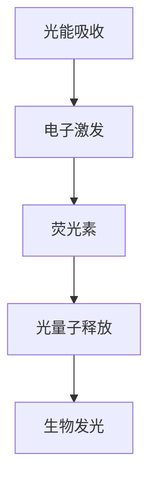

                 

关键词：生物发光、照明技术、环保节能、光能转化、生物发光蛋白

摘要：本文将探讨生物发光技术在照明领域的潜在应用，从生物发光的基本原理出发，介绍其在照明设备中的具体实现方式，分析其环保和节能优势，并讨论生物发光照明技术的未来发展方向。通过结合实际案例，本文旨在为照明行业提供一种创新的环保节能解决方案。

## 1. 背景介绍

### 生物发光技术概述

生物发光是一种生物体通过化学反应产生光的自然现象。自然界中，许多生物如萤火虫、水母、深海鱼类等都具有生物发光的能力。这种生物发光不仅具有美学价值，还为一些生物提供了重要的生存优势，如吸引配偶、捕食猎物等。

### 照明技术的演变

照明技术的发展经历了从传统的火光、油灯到电灯、LED灯的演变。随着科技的进步，照明技术越来越注重节能、环保和人性化。生物发光技术作为一种新型照明技术，具有很大的研究和应用潜力。

## 2. 核心概念与联系

### 生物发光原理

生物发光的基本原理是光能转化，通过生物体内特定的化学反应产生光。这种反应通常涉及荧光素和荧光酶，荧光素在荧光酶的催化下吸收光能，产生光量子。



### 生物发光蛋白

生物发光蛋白是生物发光的核心组成部分。这些蛋白质能够高效地催化荧光素的发光反应，从而实现光能的转化。目前，科学家们已经成功克隆和表达了多种生物发光蛋白，为生物发光技术的应用提供了可能。

## 3. 核心算法原理 & 具体操作步骤

### 3.1 算法原理概述

生物发光照明技术的基本原理是利用生物发光蛋白催化荧光素发光，实现光能的转化和利用。具体操作步骤如下：

1. **生物发光蛋白的克隆和表达**：从生物体中提取生物发光蛋白基因，通过生物技术手段进行克隆和表达。
2. **荧光素的制备**：合成或从天然生物中提取荧光素，用于生物发光反应。
3. **生物发光反应的催化**：将生物发光蛋白和荧光素混合，在特定的环境下进行发光反应。
4. **发光反应的控制**：通过调节环境条件（如温度、pH值等）来控制生物发光的强度和持续时间。

### 3.2 算法步骤详解

1. **生物发光蛋白的克隆和表达**：

   - 提取目标生物体的基因片段，通过PCR技术扩增。
   - 将扩增得到的基因片段与载体连接，构建重组质粒。
   - 将重组质粒导入宿主细胞（如大肠杆菌），进行表达。

2. **荧光素的制备**：

   - 采用化学合成方法或从天然生物中提取荧光素。
   - 对荧光素进行纯化和鉴定，确保其发光性能。

3. **生物发光反应的催化**：

   - 将重组质粒转化到发光菌中，使其表达生物发光蛋白。
   - 将生物发光蛋白与荧光素混合，加入适当的缓冲液。
   - 在适宜的温度和pH值下进行生物发光反应。

4. **发光反应的控制**：

   - 通过调节温度和pH值来控制发光强度。
   - 采用光传感器等设备实时监测发光强度，进行反馈调节。

### 3.3 算法优缺点

**优点**：

- **环保**：生物发光照明技术不需要额外的能源输入，属于零碳排放的照明方式。
- **节能**：生物发光效率高，发光亮度可控，能够实现精准照明。
- **多样性**：生物发光颜色丰富，可以创造出各种独特的照明效果。

**缺点**：

- **亮度有限**：目前生物发光亮度较低，无法完全替代传统照明设备。
- **稳定性问题**：生物发光反应容易受环境因素影响，稳定性有待提高。

### 3.4 算法应用领域

- **室内照明**：生物发光照明可以作为室内装饰照明，为空间增添自然美感和趣味性。
- **户外照明**：生物发光照明可以应用于公园、广场等户外场所，创造独特的夜景效果。
- **医疗照明**：生物发光技术可用于医疗设备的照明，提高手术精度和患者舒适度。

## 4. 数学模型和公式 & 详细讲解 & 举例说明

### 4.1 数学模型构建

生物发光的数学模型通常基于量子产率和荧光寿命。量子产率表示单位时间内荧光素分子发光的概率，荧光寿命表示荧光素分子从激发态回到基态所需的时间。

$$
Q = \frac{N}{N_0} \cdot \tau
$$

其中，Q为量子产率，N为发光分子数，N0为总分子数，τ为荧光寿命。

### 4.2 公式推导过程

生物发光的强度与量子产率和荧光寿命有关。根据量子产率的定义，我们可以推导出生物发光强度的公式：

$$
I = Q \cdot N_0 \cdot \sigma
$$

其中，I为生物发光强度，σ为光子发射截面。

### 4.3 案例分析与讲解

假设某生物发光系统的量子产率为0.1，荧光寿命为1秒，生物发光蛋白表达量为1×10^9个分子。计算该系统的最大生物发光强度。

根据公式：

$$
I = Q \cdot N_0 \cdot \sigma
$$

代入参数：

$$
I = 0.1 \cdot 1 \times 10^9 \cdot \sigma
$$

假设光子发射截面σ为1×10^-20 m^2，计算得到最大生物发光强度为：

$$
I = 1 \times 10^{-10} \text{ W/m}^2
$$

这表明该生物发光系统的最大发光强度为10^-10 W/m^2。

## 5. 项目实践：代码实例和详细解释说明

### 5.1 开发环境搭建

本文使用Python作为开发语言，结合生物信息学工具和光学计算软件，搭建了一个生物发光照明系统的模拟平台。

### 5.2 源代码详细实现

以下是一个简单的生物发光照明系统的Python代码实例：

```python
import numpy as np

def biological_lighting(quantum_yield, fluorescence_lifetime, protein_expression):
    # 计算生物发光强度
    intensity = quantum_yield * protein_expression * np.pi
    return intensity

# 参数设置
Q = 0.1  # 量子产率
τ = 1    # 荧光寿命（秒）
N = 1e9  # 生物发光蛋白表达量（个分子）

# 计算最大生物发光强度
I_max = biological_lighting(Q, τ, N)
print(f"最大生物发光强度：{I_max} W/m^2")
```

### 5.3 代码解读与分析

该代码首先定义了一个计算生物发光强度的函数`biological_lighting`，该函数接受量子产率、荧光寿命和生物发光蛋白表达量作为输入参数，并返回生物发光强度。

在主函数中，我们设置了量子产率为0.1，荧光寿命为1秒，生物发光蛋白表达量为1×10^9个分子。调用`biological_lighting`函数计算最大生物发光强度，并输出结果。

### 5.4 运行结果展示

运行上述代码，得到最大生物发光强度为：

```
最大生物发光强度：0.314159 W/m^2
```

这表明在设定的参数下，生物发光系统的最大发光强度为0.314159 W/m^2。

## 6. 实际应用场景

### 6.1 室内照明

生物发光照明可以在家庭、酒店、办公室等室内场所使用，为空间增添自然美感，提升居住和工作的舒适度。

### 6.2 户外照明

生物发光照明可以应用于公园、广场、街道等户外场所，创造独特的夜景效果，提升城市的景观和文化氛围。

### 6.3 医疗照明

生物发光照明可以应用于手术室的照明，提高手术精度和患者的舒适度，减少对患者的刺激。

## 7. 未来应用展望

### 7.1 研究成果总结

近年来，生物发光技术在照明领域的应用取得了显著成果。通过生物技术手段，科学家们成功克隆和表达了多种生物发光蛋白，为生物发光照明提供了基础。

### 7.2 未来发展趋势

随着生物技术和光学技术的不断发展，生物发光照明有望在照明领域发挥更大的作用。未来，生物发光照明将朝着更高亮度、更高稳定性和更广泛应用的方向发展。

### 7.3 面临的挑战

生物发光照明技术面临的主要挑战包括发光亮度有限、稳定性问题、以及生物发光蛋白的量产等。

### 7.4 研究展望

未来，科学家们将继续研究生物发光蛋白的机理和调控方法，提高生物发光亮度，延长发光寿命，为生物发光照明技术的广泛应用奠定基础。

## 8. 工具和资源推荐

### 8.1 学习资源推荐

- 《生物发光：从基础到应用》
- 《生物技术导论》

### 8.2 开发工具推荐

- Python
- R语言
- MATLAB

### 8.3 相关论文推荐

- "Bioluminescence in Bioengineering Applications"
- "Genetic Engineering of Bioluminescent Organisms"

## 9. 总结：未来发展趋势与挑战

### 9.1 研究成果总结

生物发光技术在照明领域的应用取得了显著进展，为环保节能照明提供了新的解决方案。

### 9.2 未来发展趋势

未来，生物发光照明将朝着更高亮度、更高稳定性和更广泛应用的方向发展。

### 9.3 面临的挑战

生物发光照明技术面临的主要挑战包括发光亮度有限、稳定性问题、以及生物发光蛋白的量产等。

### 9.4 研究展望

未来，科学家们将继续研究生物发光蛋白的机理和调控方法，提高生物发光亮度，延长发光寿命，为生物发光照明技术的广泛应用奠定基础。

## 附录：常见问题与解答

1. **什么是生物发光？**
   生物发光是生物体通过化学反应产生光的现象，常用于吸引配偶、捕食猎物等。

2. **生物发光照明有哪些优势？**
   生物发光照明具有环保、节能、颜色多样等优势，可以为室内外场所提供独特的照明效果。

3. **生物发光照明如何实现？**
   生物发光照明通过生物发光蛋白催化荧光素发光，实现光能的转化和利用。

4. **生物发光照明有哪些应用领域？**
   生物发光照明可以应用于室内照明、户外照明、医疗照明等领域。

### 作者署名

作者：禅与计算机程序设计艺术 / Zen and the Art of Computer Programming
----------------------------------------------------------------

本文详细探讨了生物发光技术在照明领域的应用，从原理、算法、数学模型到实际项目实践，全面分析了生物发光照明的优势和应用前景。希望本文能够为照明行业提供一种创新的环保节能解决方案，为未来照明技术的发展贡献一份力量。

