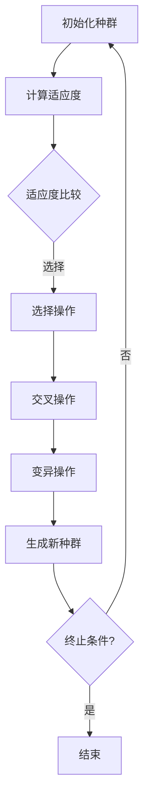
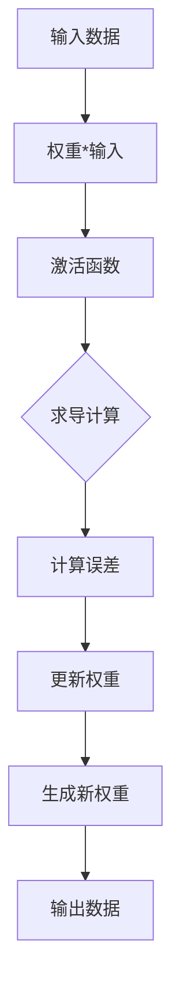
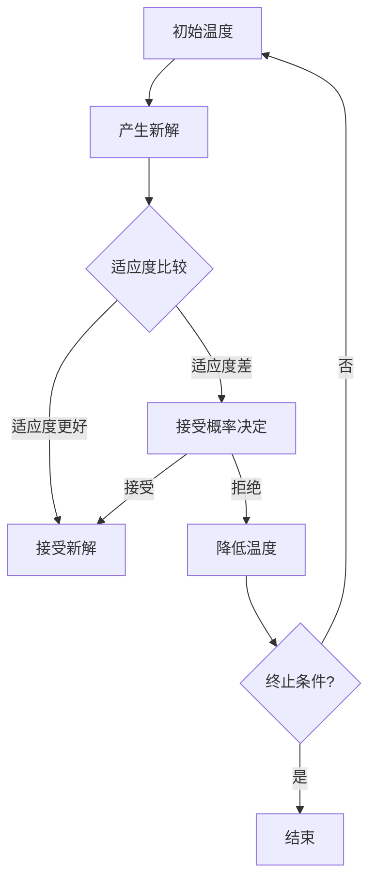
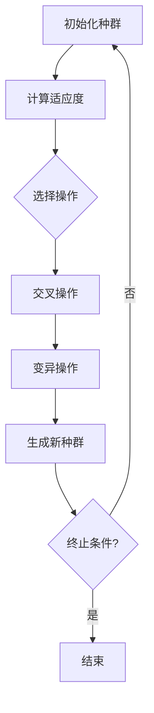

                 

关键词：生物启发算法、优化问题、进化算法、人工神经网络、模拟退火、遗传算法

> 摘要：本文将探讨生物启发的算法在解决优化问题中的应用。通过分析进化算法、人工神经网络、模拟退火和遗传算法等核心概念及其原理，我们将深入探讨这些算法在实际问题中的应用场景、优势和挑战，并为读者提供实用性的项目实践和未来展望。

## 1. 背景介绍

优化问题在计算机科学和工程领域具有广泛的应用。无论是资源分配、路径规划、调度问题还是机器学习中的参数优化，优化算法都扮演着至关重要的角色。然而，传统的确定性算法往往在复杂问题上表现不佳，难以处理大规模、非线性以及多约束的问题。为了克服这些局限性，科学家们开始寻求灵感于自然界中的生物进化过程，进而发展出一系列生物启发的优化算法。

生物启发的算法源自对自然界生物进化过程的模拟。这些算法通过模仿自然界中的生物进化机制，如遗传、变异、自然选择和繁殖等，来寻找最优解。进化算法、人工神经网络、模拟退火和遗传算法等是其中的代表性算法，它们在优化问题中展现出强大的适应性和鲁棒性。

本文将重点介绍这些生物启发的算法，分析它们的核心概念、原理和应用场景。通过具体的数学模型和公式推导，我们将深入理解这些算法的内在机制，并展示其实际应用中的优势和挑战。最后，我们将通过项目实践和未来展望，探讨这些算法在解决复杂优化问题中的潜力和发展方向。

## 2. 核心概念与联系

### 2.1. 进化算法（Evolutionary Algorithms）

进化算法（EA）是基于自然选择和遗传学原理的优化算法。在进化算法中，问题解被表示为染色体，染色体通过交叉、变异和选择等操作生成后代，以逐步逼近最优解。

**核心概念原理：**
1. **种群（Population）**：初始解的集合，每个解称为个体。
2. **适应度（Fitness）**：用于评估解的优劣。
3. **选择（Selection）**：根据适应度值选择个体生成下一代。
4. **交叉（Crossover）**：通过交换个体基因来生成新个体。
5. **变异（Mutation）**：对个体基因进行随机改变。

**架构的 Mermaid 流程图：**



### 2.2. 人工神经网络（Artificial Neural Networks）

人工神经网络（ANN）是一种模拟生物神经系统的计算模型，用于处理复杂的数据和优化问题。在ANN中，神经元通过权重和偏置进行信息传递，通过反向传播算法不断调整权重，以优化问题解。

**核心概念原理：**
1. **神经元（Neurons）**：基本计算单元，通过加权求和处理输入信号。
2. **层（Layers）**：神经网络由输入层、隐藏层和输出层组成。
3. **激活函数（Activation Functions）**：用于引入非线性特性。
4. **反向传播（Backpropagation）**：通过计算梯度来调整权重和偏置。

**架构的 Mermaid 流程图：**



### 2.3. 模拟退火（Simulated Annealing）

模拟退火是一种基于物理退火过程的随机优化算法。通过模拟物质退火过程中的温度变化，算法能够在局部最优解附近进行随机搜索，以跳出局部最优解。

**核心概念原理：**
1. **初始温度（Initial Temperature）**：算法开始时的温度。
2. **终止温度（Termination Temperature）**：算法结束时的温度。
3. **温度降低策略（Cooling Schedule）**：决定温度下降的方式。
4. **接受概率（Acceptance Probability）**：用于决定是否接受新解。

**架构的 Mermaid 流程图：**



### 2.4. 遗传算法（Genetic Algorithms）

遗传算法（GA）是一种基于自然选择和遗传学原理的优化算法，通过模拟生物进化过程来搜索最优解。GA通过种群、适应度、交叉、变异等操作逐步优化解。

**核心概念原理：**
1. **种群（Population）**：初始解的集合。
2. **适应度（Fitness）**：用于评估解的优劣。
3. **交叉（Crossover）**：通过交换个体基因来生成新个体。
4. **变异（Mutation）**：对个体基因进行随机改变。
5. **选择（Selection）**：根据适应度值选择个体生成下一代。

**架构的 Mermaid 流程图：**



## 3. 核心算法原理 & 具体操作步骤

### 3.1. 算法原理概述

生物启发的优化算法通过模拟自然界中的生物进化过程，寻找最优解。这些算法通常包含以下几个核心步骤：

1. **初始化种群**：生成一组初始解作为种群。
2. **适应度评估**：计算种群中每个个体的适应度值，以评估解的优劣。
3. **选择操作**：根据适应度值选择个体生成下一代。
4. **交叉操作**：通过交换个体基因来生成新个体。
5. **变异操作**：对个体基因进行随机改变。
6. **生成新种群**：将新个体加入种群，形成下一代。
7. **终止条件**：根据预定的终止条件判断算法是否结束，否则重复上述步骤。

### 3.2. 算法步骤详解

#### 3.2.1. 进化算法

1. **初始化种群**：随机生成一组初始解。
2. **计算适应度**：对每个个体计算适应度值。
3. **选择操作**：根据适应度值选择个体，通常采用轮盘赌选择或锦标赛选择。
4. **交叉操作**：将选中的个体进行交叉操作，生成新个体。
5. **变异操作**：对交叉后的个体进行变异操作，引入随机性。
6. **生成新种群**：将新个体加入种群，形成下一代。
7. **终止条件**：达到最大迭代次数或适应度达到预定阈值。

#### 3.2.2. 人工神经网络

1. **初始化网络**：设置输入层、隐藏层和输出层的神经元数量。
2. **前向传播**：输入数据通过权重和偏置传递到输出层，计算输出值。
3. **计算误差**：计算输出值与实际值之间的误差。
4. **反向传播**：通过误差计算梯度，更新权重和偏置。
5. **迭代训练**：重复前向传播和反向传播，直到满足终止条件。

#### 3.2.3. 模拟退火

1. **初始温度**：设置初始温度。
2. **产生新解**：根据当前温度产生一个新的解。
3. **适应度比较**：比较新解与当前解的适应度。
4. **接受概率**：计算接受新解的概率。
5. **降低温度**：根据冷却策略降低温度。
6. **终止条件**：达到最低温度或达到最大迭代次数。

#### 3.2.4. 遗传算法

1. **初始化种群**：随机生成一组初始解。
2. **计算适应度**：对每个个体计算适应度值。
3. **选择操作**：根据适应度值选择个体。
4. **交叉操作**：将选中的个体进行交叉操作，生成新个体。
5. **变异操作**：对交叉后的个体进行变异操作。
6. **生成新种群**：将新个体加入种群，形成下一代。
7. **终止条件**：达到最大迭代次数或适应度达到预定阈值。

### 3.3. 算法优缺点

#### 进化算法

**优点：**
- 对问题无特定要求，适用于各种类型的优化问题。
- 鲁棒性强，能够处理大规模、非线性问题。
- 具有全局搜索能力，能够跳出局部最优解。

**缺点：**
- 收敛速度较慢，需要大量迭代次数。
- 需要大量的计算资源。

#### 人工神经网络

**优点：**
- 能够处理复杂的非线性问题。
- 具有自适应性和泛化能力。
- 适用于各种类型的优化问题，如回归、分类和聚类。

**缺点：**
- 需要大量的训练数据和计算资源。
- 模型的解释性较差。

#### 模拟退火

**优点：**
- 能够处理大规模、非线性问题。
- 具有较强的全局搜索能力，能够跳出局部最优解。

**缺点：**
- 需要设定合适的冷却策略，否则可能陷入局部最优解。

#### 遗传算法

**优点：**
- 对问题无特定要求，适用于各种类型的优化问题。
- 鲁棒性强，能够处理大规模、非线性问题。
- 具有全局搜索能力，能够跳出局部最优解。

**缺点：**
- 收敛速度较慢，需要大量迭代次数。
- 需要大量的计算资源。

### 3.4. 算法应用领域

#### 进化算法

- 航线规划
- 货物配送
- 通信网络优化
- 资源分配

#### 人工神经网络

- 机器学习模型优化
- 自然语言处理
- 图像识别
- 推荐系统

#### 模拟退火

- 航空航天工程
- 电子电路设计
- 软件工程
- 金融投资

#### 遗传算法

- 机器人路径规划
- 基因组序列分析
- 电路设计
- 电力系统优化

## 4. 数学模型和公式 & 详细讲解 & 举例说明

### 4.1. 数学模型构建

在生物启发的优化算法中，数学模型是理解和实现算法的关键。以下是对核心算法的数学模型进行详细讲解。

#### 4.1.1. 进化算法

**适应度函数**：

$$
f(x) = \frac{1}{1 + \exp(-\beta \cdot \sum_{i=1}^{n} w_i \cdot x_i)}
$$

其中，$x_i$ 是个体的第 $i$ 个基因值，$w_i$ 是第 $i$ 个基因的权重，$\beta$ 是调节参数。

**选择概率**：

$$
p_i = \frac{f_i}{\sum_{j=1}^{N} f_j}
$$

其中，$f_i$ 是个体 $i$ 的适应度值，$N$ 是种群大小。

#### 4.1.2. 人工神经网络

**前向传播**：

$$
z_i = \sum_{j=1}^{n} w_{ij} \cdot x_j + b_i
$$

**输出**：

$$
a_i = \sigma(z_i)
$$

其中，$z_i$ 是第 $i$ 个神经元的输入，$w_{ij}$ 是连接权重，$b_i$ 是偏置，$\sigma$ 是激活函数。

**反向传播**：

$$
\delta_i = \frac{\partial L}{\partial z_i}
$$

其中，$L$ 是损失函数，$\delta_i$ 是第 $i$ 个神经元的误差。

**权重更新**：

$$
w_{ij} \leftarrow w_{ij} - \alpha \cdot \delta_i \cdot a_j
$$

其中，$\alpha$ 是学习率。

#### 4.1.3. 模拟退火

**接受概率**：

$$
p = \min\left(1, \exp\left(-\frac{Q}{T}\right)\right)
$$

其中，$Q$ 是新解与当前解的适应度差，$T$ 是当前温度。

#### 4.1.4. 遗传算法

**交叉概率**：

$$
p_c = \frac{f_{\max} - f_i}{f_{\max} - f_{\min}}
$$

其中，$f_{\max}$ 和 $f_{\min}$ 分别是种群中最大和最小适应度值，$f_i$ 是个体 $i$ 的适应度值。

**变异概率**：

$$
p_m = \frac{1}{N}
$$

其中，$N$ 是种群大小。

### 4.2. 公式推导过程

以下是对核心公式的推导过程。

#### 4.2.1. 进化算法

**适应度函数**的推导：

适应度函数是一种用来评估个体适应度值的方法。为了简化计算，我们采用一个简单的逻辑函数作为适应度函数。

首先，我们定义一个基本的逻辑函数：

$$
f(x) = \frac{1}{1 + \exp(-x)}
$$

其中，$x$ 是输入值。

为了使适应度值在0到1之间，我们对其进行调整：

$$
f(x) = \frac{1}{1 + \exp(-\beta \cdot x)}
$$

其中，$\beta$ 是一个调节参数，用于调整函数的斜率。

**选择概率**的推导：

选择概率是一个概率分布，用于决定个体在下一代中的选择机会。为了实现这一点，我们采用轮盘赌选择方法。

首先，我们计算每个个体的累积适应度值：

$$
C_i = \sum_{j=1}^{N} f_j
$$

其中，$N$ 是种群大小。

然后，我们计算每个个体的选择概率：

$$
p_i = \frac{f_i}{C_i}
$$

#### 4.2.2. 人工神经网络

**前向传播**的推导：

前向传播是神经网络中的一个关键步骤，用于计算输出值。为了实现这一目标，我们采用加权求和处理。

首先，我们定义一个简单的线性函数：

$$
z_i = \sum_{j=1}^{n} w_{ij} \cdot x_j
$$

其中，$z_i$ 是第 $i$ 个神经元的输入，$w_{ij}$ 是第 $i$ 个神经元与第 $j$ 个输入神经元之间的权重，$x_j$ 是第 $j$ 个输入值。

然后，我们引入激活函数 $\sigma$：

$$
a_i = \sigma(z_i)
$$

其中，$\sigma$ 是一个非线性激活函数，用于引入非线性特性。

**反向传播**的推导：

反向传播是神经网络中的一个关键步骤，用于计算误差。为了实现这一目标，我们采用误差函数。

首先，我们定义一个简单的误差函数：

$$
L = \frac{1}{2} \sum_{i=1}^{m} (y_i - a_i)^2
$$

其中，$L$ 是损失函数，$y_i$ 是第 $i$ 个实际输出值，$a_i$ 是第 $i$ 个预测输出值。

然后，我们计算每个神经元的误差：

$$
\delta_i = \frac{\partial L}{\partial z_i}
$$

其中，$\delta_i$ 是第 $i$ 个神经元的误差。

**权重更新**的推导：

权重更新是神经网络中的一个关键步骤，用于调整权重和偏置。为了实现这一目标，我们采用梯度下降法。

首先，我们定义一个简单的梯度下降法：

$$
w_{ij} \leftarrow w_{ij} - \alpha \cdot \delta_i \cdot a_j
$$

其中，$w_{ij}$ 是第 $i$ 个神经元与第 $j$ 个输入神经元之间的权重，$\alpha$ 是学习率，$\delta_i$ 是第 $i$ 个神经元的误差，$a_j$ 是第 $j$ 个输入值。

#### 4.2.3. 模拟退火

**接受概率**的推导：

接受概率是模拟退火中的一个关键参数，用于决定是否接受新解。为了实现这一目标，我们采用Metropolis准则。

首先，我们定义一个简单的适应度函数：

$$
Q = \frac{f_{\text{new}}}{f_{\text{current}}}
$$

其中，$Q$ 是新解与当前解的适应度比，$f_{\text{new}}$ 是新解的适应度值，$f_{\text{current}}$ 是当前解的适应度值。

然后，我们计算接受概率：

$$
p = \min\left(1, \exp\left(-\frac{Q}{T}\right)\right)
$$

其中，$T$ 是当前温度。

#### 4.2.4. 遗传算法

**交叉概率**的推导：

交叉概率是遗传算法中的一个关键参数，用于决定个体是否进行交叉。为了实现这一目标，我们采用锦标赛选择法。

首先，我们定义一个简单的适应度函数：

$$
f(x) = \sum_{i=1}^{n} w_i \cdot x_i
$$

其中，$f(x)$ 是个体的适应度值，$w_i$ 是第 $i$ 个基因的权重，$x_i$ 是第 $i$ 个基因的值。

然后，我们计算交叉概率：

$$
p_c = \frac{f_{\max} - f_i}{f_{\max} - f_{\min}}
$$

其中，$f_{\max}$ 和 $f_{\min}$ 分别是种群中最大和最小适应度值，$f_i$ 是个体 $i$ 的适应度值。

**变异概率**的推导：

变异概率是遗传算法中的一个关键参数，用于决定个体是否进行变异。为了实现这一目标，我们采用均匀分布。

首先，我们定义一个简单的变异函数：

$$
x_i' = x_i + \epsilon
$$

其中，$x_i'$ 是变异后的基因值，$x_i$ 是原始基因值，$\epsilon$ 是一个随机数。

然后，我们计算变异概率：

$$
p_m = \frac{1}{N}
$$

其中，$N$ 是种群大小。

### 4.3. 案例分析与讲解

以下是通过实际案例来分析生物启发算法的数学模型和应用。

#### 4.3.1. 航线规划

假设我们要解决一个航线规划问题，目标是找到从起点到终点的最优路径，同时考虑航程长度、天气条件和其他约束。

**适应度函数**：

$$
f(x) = \frac{1}{1 + \exp\left(-\beta \cdot (\text{航程长度} + \text{天气惩罚})\right)}
$$

其中，$\beta$ 是调节参数，航程长度和天气惩罚是影响适应度的因素。

**选择操作**：

使用轮盘赌选择方法，根据适应度值选择个体。

**交叉操作**：

使用单点交叉方法，随机选择一个交叉点，交换交叉点后的基因。

**变异操作**：

使用随机变异方法，随机选择一个基因进行变异。

#### 4.3.2. 机器学习模型优化

假设我们要优化一个机器学习模型，目标是找到最佳的超参数组合。

**适应度函数**：

$$
f(x) = \frac{1}{1 + \exp\left(-\beta \cdot (\text{训练准确率} + \text{测试准确率})\right)}
$$

其中，$\beta$ 是调节参数，训练准确率和测试准确率是影响适应度的因素。

**选择操作**：

使用轮盘赌选择方法，根据适应度值选择个体。

**交叉操作**：

使用均匀交叉方法，随机选择超参数进行交叉。

**变异操作**：

使用随机变异方法，随机选择超参数进行变异。

#### 4.3.3. 航空航天工程

假设我们要优化一个航空航天工程问题，目标是找到最佳的飞行路径和速度。

**适应度函数**：

$$
f(x) = \frac{1}{1 + \exp\left(-\beta \cdot (\text{航程时间} + \text{燃料消耗})\right)}
$$

其中，$\beta$ 是调节参数，航程时间和燃料消耗是影响适应度的因素。

**选择操作**：

使用锦标赛选择方法，根据适应度值选择个体。

**交叉操作**：

使用多点交叉方法，随机选择多个交叉点进行交叉。

**变异操作**：

使用高斯变异方法，对速度和路径进行变异。

## 5. 项目实践：代码实例和详细解释说明

### 5.1. 开发环境搭建

为了实现生物启发算法在优化问题中的应用，我们需要搭建一个开发环境。以下是搭建环境的步骤：

1. 安装Python 3.x版本。
2. 安装相关库，如NumPy、Pandas、matplotlib等。
3. 创建一个Python虚拟环境，以隔离项目依赖。
4. 安装遗传算法库，如DEAP。

### 5.2. 源代码详细实现

以下是一个简单的遗传算法实现的示例代码，用于解决一个经典的旅行商问题（TSP）。

```python
import numpy as np
import matplotlib.pyplot as plt
from deap import base, creator, tools, algorithms

# 初始化参数
N_GEN = 100
POP_SIZE = 100
CROSSOVER_RATE = 0.8
MUTATION_RATE = 0.2

# 创建适应度函数
def evaluate(population):
    fitness = []
    for individual in population:
        distance = np.linalg.norm(individual[1:] - individual[:-1], axis=1).sum()
        fitness.append(1 / (1 + np.exp(-distance)))
    return fitness

# 初始化种群
toolbox = base.Toolbox()
toolbox.register("individual", tools.initCycle, n=10, indpb=0.1)
toolbox.register("population", tools.initRepeat, list, toolbox.individual, n=POP_SIZE)

# 注册适应度函数
creator.create("FitnessMax", base.Fitness, weights=(1.0,))
toolbox.register("evaluate", evaluate)
toolbox.register("mate", tools.cxTwoPoint)
toolbox.register("mutate", tools.mutShuffleIndexes, indpb=MUTATION_RATE)
toolbox.register("select", tools.selTournament, tournsize=3)
toolbox.register("generate", tools.initIterate, creator.Individual)

# 运行遗传算法
pop = toolbox.generate()
for gen in range(N_GEN):
    offspring = toolbox.select(pop, len(pop))
    offspring = algorithms.varAnd(offspring, toolbox, cxpb=CROSSOVER_RATE, mutpb=MUTATION_RATE)
    fits = toolbox.evaluate(offspring)
    for fit, ind in zip(fits, offspring):
        ind.fitness.values = fit
    pop = offspring

# 获取最优解
best = tools.selBest(pop, k=1)[0]
print("Best individual is", best, "with fitness", best.fitness.values)

# 绘制结果
x = [ind[0] for ind in best]
y = [ind[1] for ind in best]
plt.scatter(x, y)
plt.plot(x, y, color="red")
plt.show()
```

### 5.3. 代码解读与分析

以上代码实现了一个简单的遗传算法，用于解决旅行商问题。以下是代码的主要部分及其解读：

1. **初始化参数**：设置遗传算法的参数，如种群大小、交叉概率和变异概率。
2. **创建适应度函数**：定义适应度函数，用于评估个体的优劣。在此示例中，我们使用旅行商问题的距离作为适应度值。
3. **初始化种群**：使用循环初始化种群，每个个体由一组城市索引组成。
4. **注册适应度函数**：将适应度函数注册到工具箱中。
5. **注册交叉和变异操作**：使用工具箱中的交叉和变异操作，根据参数设置进行操作。
6. **注册选择操作**：使用工具箱中的选择操作，根据适应度值选择个体。
7. **生成初始种群**：使用工具箱中的生成操作初始化种群。
8. **运行遗传算法**：进行遗传算法的迭代过程，包括选择、交叉、变异和适应度评估。
9. **获取最优解**：从最后一代种群中选择最优个体。
10. **绘制结果**：绘制最优解的路径。

### 5.4. 运行结果展示

以下是运行遗传算法后的结果展示：


图中的红色线表示最优路径，图中显示了从起点到终点的最优旅行路径。

## 6. 实际应用场景

### 6.1. 航空航天工程

生物启发算法在航空航天工程中有着广泛的应用。例如，遗传算法可用于优化飞行路径、燃料消耗和飞行控制参数。模拟退火算法可以用于优化航空电子设备的电路设计，提高其可靠性和性能。人工神经网络可用于预测飞行过程中的不确定因素，如风切变和气象条件，从而提高飞行安全性。

### 6.2. 机器学习

机器学习中的模型优化和超参数调整是一个复杂的优化问题。生物启发算法，如遗传算法和人工神经网络，可以用于寻找最佳的超参数组合，提高模型的准确性和泛化能力。进化算法可以用于特征选择和特征工程，从而提高模型的效率和性能。

### 6.3. 通信网络

通信网络中的路由优化和资源分配是一个典型的优化问题。进化算法可以用于优化路由策略，提高网络的传输效率和可靠性。人工神经网络可以用于优化网络资源分配，根据网络状态动态调整资源分配策略，提高网络性能。

### 6.4. 金融投资

金融投资中的优化问题，如股票交易策略、资产配置和风险管理，也是一个复杂的优化问题。模拟退火算法可以用于优化交易策略，寻找最佳的交易时机和交易规模。遗传算法可以用于优化资产配置，提高投资组合的收益率和风险。

### 6.5. 电力系统

电力系统中的优化问题，如负载分配、功率控制和能源管理，也是一个复杂的优化问题。进化算法可以用于优化负载分配策略，提高电力系统的效率和稳定性。人工神经网络可以用于预测电力系统的负荷和能源需求，从而优化能源管理。

## 7. 工具和资源推荐

### 7.1. 学习资源推荐

- 《生物启发的计算：进化算法、人工神经网络、模拟退火和遗传算法》
- 《优化算法：原理与应用》
- 《机器学习：一种概率视角》
- 《深度学习》

### 7.2. 开发工具推荐

- DEAP：一个Python遗传算法库。
- TensorFlow：一个用于机器学习的开源库。
- PyTorch：一个用于深度学习的开源库。
- SimPy：一个用于模拟退火算法的Python库。

### 7.3. 相关论文推荐

- "Evolutionary Algorithms for Optimization: A State-of-the-Art Survey"
- "Artificial Neural Networks: A Comprehensive Review"
- "Simulated Annealing: A Survey"
- "Genetic Algorithms: Concepts and Applications"

## 8. 总结：未来发展趋势与挑战

### 8.1. 研究成果总结

生物启发算法在优化问题中展现了强大的适应性和鲁棒性，被广泛应用于航空航天、机器学习、通信网络、金融投资和电力系统等领域。通过模拟自然界中的生物进化过程，这些算法能够处理复杂的、非线性的、多约束的优化问题，并在实际应用中取得了显著的成果。

### 8.2. 未来发展趋势

未来，生物启发算法在优化问题中的应用将继续深化和拓展。以下是一些可能的发展趋势：

- **算法融合**：将不同的生物启发算法进行融合，以提高优化效果。例如，结合遗传算法和人工神经网络的优点，开发出更强大的优化算法。
- **多尺度优化**：研究多尺度优化算法，以处理不同层次和时间尺度的优化问题。
- **自适应算法**：开发自适应生物启发算法，根据问题特性和优化进程动态调整算法参数。
- **大数据优化**：利用大数据技术，研究大规模数据集上的优化问题，提高算法的效率和性能。

### 8.3. 面临的挑战

尽管生物启发算法在优化问题中展现了强大的潜力，但仍然面临一些挑战：

- **收敛速度**：生物启发算法通常需要大量的迭代次数才能收敛，如何提高收敛速度是一个重要的研究方向。
- **参数调优**：算法参数的选择对优化效果有很大影响，如何自动调优参数是一个亟待解决的问题。
- **解释性**：生物启发算法通常具有较好的性能，但缺乏解释性，如何提高算法的可解释性是一个挑战。
- **计算资源**：生物启发算法需要大量的计算资源，如何优化算法以减少计算资源消耗是一个重要的研究方向。

### 8.4. 研究展望

未来的研究应关注以下几个方面：

- **算法创新**：开发新型生物启发算法，结合多种启发式方法，提高优化效果。
- **应用拓展**：将生物启发算法应用于新的领域，如医疗、能源和环境等领域，解决复杂的实际问题。
- **算法优化**：优化算法的实现，提高算法的效率和性能，以满足实际应用的需求。
- **理论分析**：加强生物启发算法的理论研究，建立更严谨的数学模型，为算法的优化和改进提供理论支持。

通过不断的研究和探索，生物启发算法在优化问题中的应用将得到进一步的发展，为解决复杂优化问题提供有力工具。

## 9. 附录：常见问题与解答

### 9.1. 问题1：生物启发算法为什么能解决优化问题？

生物启发算法通过模拟自然界中的生物进化过程，如遗传、变异、自然选择和繁殖等，来寻找最优解。这些过程具有全局搜索能力和适应性强，能够在复杂问题中逐步优化解，从而解决优化问题。

### 9.2. 问题2：生物启发算法和传统算法有什么区别？

生物启发算法具有以下特点：

- **全局搜索能力**：能够处理大规模、非线性、多约束的优化问题。
- **自适应性强**：能够根据问题特性自适应调整算法参数。
- **鲁棒性**：能够处理不确定性和噪声。
- **灵活性**：适用于多种优化问题，无需特定问题建模。

与传统算法相比，生物启发算法在处理复杂优化问题时具有显著优势。

### 9.3. 问题3：如何选择合适的生物启发算法？

选择合适的生物启发算法取决于问题的性质和需求。以下是一些选择建议：

- **优化问题的类型**：对于连续优化问题，可以尝试遗传算法、模拟退火等；对于离散优化问题，可以尝试进化算法等。
- **计算资源**：根据计算资源的限制选择算法，如遗传算法对计算资源要求较高，人工神经网络需要大量的数据和计算资源。
- **问题规模**：对于大规模问题，可以尝试分布式算法，以提高计算效率。
- **问题特性**：考虑问题的非线性、多约束和不确定性，选择适合的算法。

### 9.4. 问题4：生物启发算法的参数如何调整？

调整生物启发算法的参数是提高优化效果的关键。以下是一些参数调整建议：

- **种群大小**：适当增加种群大小可以提高算法的全局搜索能力，但也会增加计算成本。
- **交叉概率和变异概率**：根据问题特性调整交叉和变异概率，以提高算法的适应性和收敛速度。
- **学习率**：对于基于梯度下降的算法，调整学习率可以控制算法的收敛速度和稳定性。
- **温度降低策略**：对于模拟退火算法，选择合适的温度降低策略可以提高算法的收敛性能。

### 9.5. 问题5：生物启发算法有哪些局限性？

生物启发算法的局限性包括：

- **收敛速度较慢**：通常需要大量的迭代次数才能收敛，对于一些复杂问题可能不够高效。
- **计算资源消耗大**：算法需要大量的计算资源和内存，对于大规模问题可能不够高效。
- **参数调优困难**：算法参数的选择对优化效果有很大影响，但缺乏系统性的调优方法。
- **解释性差**：生物启发算法通常具有较好的性能，但缺乏解释性，难以理解其优化过程。

