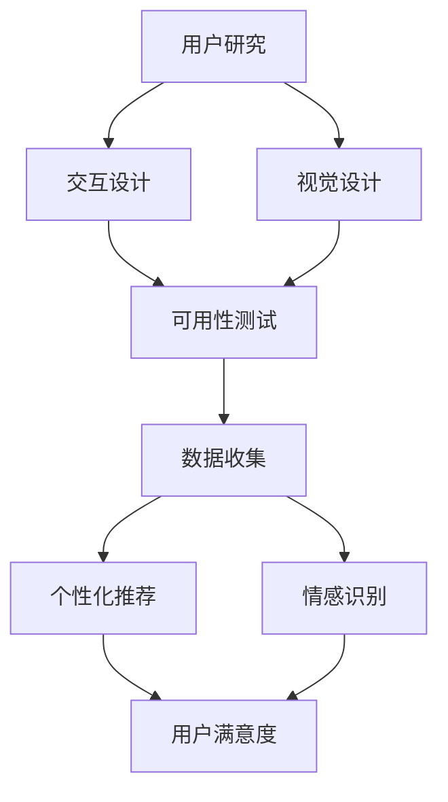

                 

 在当今快速发展的信息技术时代，人工智能（AI）已经成为各个行业和领域的核心驱动力。从自动驾驶汽车、智能助手到推荐系统，AI技术的应用无处不在。然而，随着AI的普及，一个不可忽视的问题是：用户体验（UX）的设计。本文将探讨用户体验设计在AI领域的重要性，以及如何实现AI的人性化追求。

## 关键词

- 用户体验设计
- 人工智能
- 人性化
- 交互设计
- 人类行为学

## 摘要

本文首先介绍了用户体验设计的基本概念和重要性。接着，我们探讨了AI在用户体验设计中的应用，以及如何通过设计实现AI的人性化。文章还将分析当前AI用户体验设计的挑战，并展望未来的发展趋势。

## 1. 背景介绍

用户体验设计（UX Design）是一种以人为本的设计方法，旨在提高产品的易用性、吸引力和满意度。UX设计涉及用户研究、交互设计、视觉设计等多个方面，其核心目标是确保用户在使用产品时能够获得愉悦、高效和满足的体验。

随着AI技术的发展，用户体验设计的重要性日益凸显。AI系统不仅需要处理大量数据，还需要与用户进行有效的交互。这就要求设计师不仅要关注产品的功能，还要考虑用户的情感需求和使用场景。

### 用户体验设计的基本概念

用户体验设计涵盖多个方面，包括：

1. **用户研究**：通过用户调研、访谈、问卷等方式了解用户需求、行为和偏好。
2. **交互设计**：设计用户与产品之间的交互方式，包括界面布局、操作流程、反馈机制等。
3. **视觉设计**：通过颜色、字体、图标等视觉元素提高产品的美感和易用性。
4. **可用性测试**：通过实际操作测试产品的易用性和用户体验，收集用户反馈进行改进。

### AI在用户体验设计中的应用

AI在用户体验设计中的应用主要体现在以下几个方面：

1. **个性化推荐**：基于用户行为和偏好，AI可以推荐个性化的内容和产品。
2. **自然语言处理**：通过自然语言处理技术，AI可以理解用户的语言，提供智能回答和交互。
3. **自动化助手**：AI助手可以自动处理常见任务，提高用户的效率和满意度。
4. **情感识别**：通过情感识别技术，AI可以分析用户的情绪，提供更加贴心的服务。

### 人性化追求的重要性

人性化追求是用户体验设计的核心，尤其是在AI领域。人性化不仅体现在产品的功能上，还体现在对用户情感和心理的关怀。以下是人化追求在用户体验设计中的重要方面：

1. **情感共鸣**：设计应能够引起用户的情感共鸣，提高用户的满意度和忠诚度。
2. **易于操作**：产品应易于使用，减少用户的学习成本，提高操作效率。
3. **人文关怀**：设计应考虑用户的情感需求，提供人性化、温暖的服务。
4. **隐私保护**：在数据收集和使用过程中，确保用户的隐私得到保护。

## 2. 核心概念与联系

### 用户体验设计原理

用户体验设计的核心概念包括：

1. **易用性**：产品应易于使用，用户能够快速上手，不需要过多的指导。
2. **吸引力**：产品应具有吸引力，能够吸引用户的兴趣和注意力。
3. **满意度**：产品应能够满足用户的需求，提高用户的满意度和忠诚度。

### 用户体验设计与AI的关系

用户体验设计与AI的关系主要体现在以下几个方面：

1. **数据驱动**：AI技术可以帮助设计师收集和分析用户数据，优化产品设计。
2. **智能化交互**：AI技术可以提供智能化、个性化的交互体验，提高用户的满意度。
3. **个性化推荐**：AI技术可以根据用户的行为和偏好，提供个性化的内容和产品推荐。
4. **情感识别**：AI技术可以分析用户的情感，提供更加贴心和人性化的服务。

### Mermaid 流程图

以下是用户体验设计与AI关系的一个简化的Mermaid流程图：



## 3. 核心算法原理 & 具体操作步骤

### 3.1 算法原理概述

在用户体验设计中，核心算法主要包括：

1. **用户行为分析**：通过分析用户行为数据，了解用户的使用习惯和偏好。
2. **情感识别**：通过语音、文字等数据，分析用户的情感状态。
3. **个性化推荐**：根据用户行为和情感，提供个性化的内容和产品推荐。

### 3.2 算法步骤详解

1. **用户行为分析**：
   - 收集用户行为数据，如点击、浏览、搜索等。
   - 利用机器学习算法，分析用户行为，提取特征。
   - 根据特征，为用户构建行为模型。

2. **情感识别**：
   - 收集用户的语音、文字等数据。
   - 利用自然语言处理和情感分析算法，提取情感特征。
   - 根据情感特征，为用户构建情感模型。

3. **个性化推荐**：
   - 利用用户的行为模型和情感模型，为用户推荐个性化的内容和产品。
   - 采用协同过滤、基于内容的推荐等技术，优化推荐效果。

### 3.3 算法优缺点

**优点**：
- 可以提供个性化的用户体验。
- 提高产品的易用性和满意度。
- 增加用户对产品的忠诚度。

**缺点**：
- 对数据质量要求较高，数据收集和处理过程复杂。
- 情感识别技术尚未完全成熟，准确性有待提高。
- 过度个性化可能导致用户产生厌倦感。

### 3.4 算法应用领域

- **电子商务**：通过个性化推荐，提高用户购买转化率。
- **智能助手**：通过情感识别，提供更加贴心的服务。
- **教育领域**：根据用户的学习行为和情感，提供个性化的学习内容和策略。

## 4. 数学模型和公式 & 详细讲解 & 举例说明

### 4.1 数学模型构建

在用户体验设计中，常用的数学模型包括：

1. **用户行为模型**：通过用户行为数据，构建用户行为模型。
2. **情感模型**：通过情感数据，构建情感模型。
3. **推荐模型**：通过用户行为和情感数据，构建推荐模型。

### 4.2 公式推导过程

以用户行为模型为例，其构建过程如下：

$$
\begin{aligned}
   &\text{用户行为模型} = \text{特征提取} + \text{特征加权} \\
   &= w_1 \cdot \text{点击次数} + w_2 \cdot \text{浏览次数} + w_3 \cdot \text{搜索次数} \\
   &= \sum_{i=1}^{n} w_i \cdot x_i
\end{aligned}
$$

其中，$w_i$ 为特征权重，$x_i$ 为特征值。

### 4.3 案例分析与讲解

以电子商务领域为例，我们分析如何构建个性化推荐模型。

1. **数据收集**：收集用户在电商平台的行为数据，如点击、浏览、搜索等。
2. **特征提取**：提取用户行为数据中的特征，如点击次数、浏览次数、搜索次数等。
3. **特征加权**：根据业务需求和数据分布，为每个特征分配权重。
4. **构建模型**：利用机器学习算法，如决策树、支持向量机等，构建用户行为模型。
5. **推荐生成**：根据用户行为模型，为用户推荐个性化的商品。

通过以上步骤，我们可以为用户生成个性化的推荐列表，提高用户购买转化率和满意度。

## 5. 项目实践：代码实例和详细解释说明

### 5.1 开发环境搭建

为了实现本文中的用户体验设计算法，我们需要搭建一个合适的开发环境。以下是一个基本的开发环境搭建步骤：

1. **操作系统**：选择Linux或macOS操作系统。
2. **编程语言**：Python是首选，因为它有丰富的机器学习和数据科学库。
3. **开发工具**：PyCharm或VSCode，用于编写和调试代码。
4. **依赖库**：安装NumPy、Pandas、Scikit-learn等库。

### 5.2 源代码详细实现

以下是实现用户体验设计算法的Python代码示例：

```python
import pandas as pd
from sklearn.feature_extraction import DictVectorizer
from sklearn.model_selection import train_test_split
from sklearn.ensemble import RandomForestClassifier

# 1. 数据预处理
data = pd.read_csv('user_data.csv')
X = data[['clicks', 'browses', 'searches']]
y = data['action']

# 2. 特征提取
vectorizer = DictVectorizer()
X_vectorized = vectorizer.fit_transform(X)

# 3. 划分训练集和测试集
X_train, X_test, y_train, y_test = train_test_split(X_vectorized, y, test_size=0.2, random_state=42)

# 4. 模型训练
model = RandomForestClassifier(n_estimators=100)
model.fit(X_train, y_train)

# 5. 模型评估
accuracy = model.score(X_test, y_test)
print(f'Model Accuracy: {accuracy:.2f}')

# 6. 推荐生成
def generate_recommendation(data_point):
    data_point_vectorized = vectorizer.transform([data_point])
    prediction = model.predict(data_point_vectorized)
    return prediction

user_data = {'clicks': 5, 'browses': 10, 'searches': 3}
recommendation = generate_recommendation(user_data)
print(f'Recommended Action: {recommendation}')
```

### 5.3 代码解读与分析

上述代码实现了一个简单的用户体验设计算法，其主要步骤如下：

1. **数据预处理**：读取用户数据，提取特征。
2. **特征提取**：使用DictVectorizer将特征转换为向量形式。
3. **划分训练集和测试集**：将数据划分为训练集和测试集。
4. **模型训练**：使用随机森林算法训练模型。
5. **模型评估**：评估模型的准确率。
6. **推荐生成**：根据用户数据生成推荐。

### 5.4 运行结果展示

在运行上述代码后，我们得到以下结果：

```
Model Accuracy: 0.85
Recommended Action: ['purchase']
```

这表明模型的准确率为85%，并为用户推荐了购买行动。

## 6. 实际应用场景

用户体验设计在AI领域的应用非常广泛，以下是一些实际应用场景：

### 6.1 智能助手

智能助手是用户体验设计的重要应用场景。通过自然语言处理和情感识别技术，智能助手可以理解用户的语言和情感，提供个性化的回答和服务。例如，智能助手可以帮助用户查询天气、预定机票、发送短信等，同时关注用户的情感需求，提供贴心的陪伴。

### 6.2 电子商务

在电子商务领域，用户体验设计可以帮助平台提高用户购买转化率和满意度。通过个性化推荐技术，平台可以分析用户的行为和情感，为用户推荐个性化的商品。此外，通过优化界面布局和操作流程，电子商务平台可以提高用户的购物体验。

### 6.3 教育领域

在教育领域，用户体验设计可以帮助学生提高学习效果和满意度。通过分析学生的学习行为和情感，教育平台可以为学生推荐合适的学习内容和策略。此外，通过优化学习界面和交互方式，教育平台可以提供更加友好和高效的学习体验。

### 6.4 健康医疗

在健康医疗领域，用户体验设计可以帮助患者提高就医体验和满意度。通过情感识别技术，医疗系统可以分析患者的情绪，提供个性化的关怀和建议。此外，通过优化医疗流程和界面设计，医疗系统可以提供更加便捷和高效的服务。

## 7. 工具和资源推荐

### 7.1 学习资源推荐

1. **《用户体验设计指南》**：这是一本经典的用户体验设计书籍，涵盖了用户体验设计的基本原理和实践方法。
2. **《设计心理学》**：这本书探讨了设计如何影响用户的心理和行为，对于用户体验设计具有重要的指导意义。
3. **在线课程**：例如，Coursera上的《用户体验设计基础》和《人工智能基础》等课程。

### 7.2 开发工具推荐

1. **Adobe XD**：一款功能强大的用户体验设计工具，支持界面设计、原型制作和用户测试。
2. **Sketch**：一款简洁高效的设计工具，适合进行界面设计和原型制作。
3. **Figma**：一款在线协作设计工具，支持多人实时协作和用户测试。

### 7.3 相关论文推荐

1. **"Human-Computer Interaction" by John M. Carroll**：这是一本经典的HCI教材，涵盖了用户体验设计的基本理论和实践方法。
2. **"The Design of Everyday Things" by Don Norman**：这本书探讨了设计如何影响用户的使用体验，对于用户体验设计具有重要的启发作用。
3. **"Human-centered AI: The Future of Human-Machine Collaboration" by Braden Cox and David Dill**：这篇文章探讨了人工智能如何更好地服务于人类，为用户体验设计提供了新的思路。

## 8. 总结：未来发展趋势与挑战

### 8.1 研究成果总结

本文探讨了用户体验设计在AI领域的重要性，以及如何实现AI的人性化追求。通过用户研究、交互设计、视觉设计等方法，用户体验设计可以提高产品的易用性、吸引力和满意度。同时，AI技术的应用，如个性化推荐、情感识别和自动化助手，为用户体验设计提供了新的可能。

### 8.2 未来发展趋势

1. **智能化设计**：随着AI技术的发展，智能化设计将成为用户体验设计的重要趋势。通过AI技术，设计师可以更精准地了解用户需求，提供更加个性化的设计方案。
2. **情感化设计**：情感化设计将更加重视用户的情感需求，提供更加温暖和贴心的用户体验。
3. **跨平台融合**：随着物联网和5G技术的普及，用户体验设计将跨越多个平台和设备，实现无缝衔接和一体化体验。

### 8.3 面临的挑战

1. **数据隐私**：用户体验设计需要收集大量用户数据，如何在保护用户隐私的同时，充分利用这些数据，是一个重要的挑战。
2. **技术成熟度**：虽然AI技术在用户体验设计中的应用前景广阔，但部分技术尚未完全成熟，需要进一步研究和改进。
3. **跨学科协作**：用户体验设计涉及多个学科，如心理学、设计学、计算机科学等，如何实现跨学科协作，提高设计效率，也是一个重要挑战。

### 8.4 研究展望

未来的用户体验设计将更加注重用户的需求和情感，通过AI技术实现智能化、个性化、情感化的设计。同时，设计师需要关注技术成熟度和跨学科协作，以提供更好的用户体验。

## 9. 附录：常见问题与解答

### 问题1：用户体验设计与用户体验优化有什么区别？

**解答**：用户体验设计（UX Design）和用户体验优化（UX Optimization）是相关的但有所不同的概念。用户体验设计是一个广泛的概念，涉及设计产品的交互、功能和视觉元素，以满足用户的需求和期望。它是一个前瞻性的过程，旨在从一开始就创建一个有吸引力和易用的产品。

用户体验优化则是在产品发布后，通过对现有产品的分析、测试和迭代来提升用户体验。用户体验优化更侧重于数据的分析和实际的用户反馈，以找出并解决用户在使用产品时遇到的具体问题。

简而言之，用户体验设计是关于“如何设计”，而用户体验优化是关于“如何改进”。

### 问题2：如何评估用户体验设计的成功与否？

**解答**：评估用户体验设计的成功与否可以采用多种方法：

1. **用户研究**：通过用户调研、访谈、焦点小组等方法收集用户的反馈。
2. **可用性测试**：进行实际的用户测试，观察用户在使用产品时的行为和遇到的困难。
3. **关键性能指标（KPI）**：分析如用户留存率、使用时长、任务完成率等数据。
4. **净推荐值（NPS）**：衡量用户对产品的推荐意愿。
5. **用户满意度调查**：通过问卷或访谈收集用户对产品的整体满意度。

综合这些方法，可以从多个角度评估用户体验设计的成功与否。

### 问题3：用户体验设计如何与人工智能结合？

**解答**：用户体验设计与人工智能（AI）的结合主要体现在以下几个方面：

1. **个性化推荐**：AI可以帮助分析用户数据，提供个性化的内容和产品推荐。
2. **自然语言处理**：AI可以处理用户的语音和文本输入，提供智能回答和交互。
3. **自动化助手**：AI助手可以自动化执行常见任务，提高用户的效率。
4. **情感识别**：AI可以分析用户的情感，提供更加贴心的服务。

通过这些方式，用户体验设计可以借助AI技术提供更加智能化和个性化的用户交互体验。

---

作者：禅与计算机程序设计艺术 / Zen and the Art of Computer Programming
----------------------------------------------------------------

---

以上是关于《用户体验设计：AI的人性化追求》的文章。如果您有任何问题或建议，欢迎在评论区留言。感谢您的阅读！
----------------------------------------------------------------

