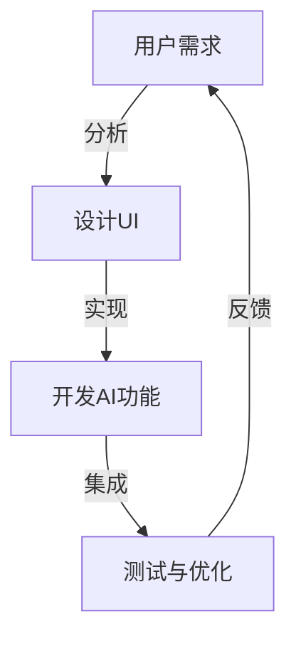

                 

关键词：用户界面、AI功能、用户体验、简洁性、交互设计、优化策略

> 摘要：本文探讨了用户界面（UI）与人工智能（AI）功能之间的平衡关系。在AI技术迅速发展的背景下，如何保持界面的简洁性，同时充分发挥AI的功能，成为了设计者和开发者面临的重要课题。本文通过分析现有问题和挑战，提出了优化用户界面简洁性与AI功能平衡的策略和方法。

## 1. 背景介绍

随着人工智能技术的不断进步，越来越多的应用开始融入AI功能，如智能助手、个性化推荐、自然语言处理等。这些功能不仅提高了应用的价值，也为用户带来了更加便捷的体验。然而，在追求AI功能丰富性的同时，用户界面的简洁性也愈发受到重视。简洁的用户界面（UI）能够减少用户的认知负担，提高操作效率，进而提升用户体验。

在设计和开发过程中，如何平衡UI的简洁性与AI功能，成为了一个复杂的挑战。一方面，简洁的UI能够降低用户的学习成本，让用户更快地掌握应用的使用方法；另一方面，丰富的AI功能可能需要更复杂的界面元素和交互逻辑，从而增加用户的认知复杂度。因此，如何在两者之间找到平衡，成为了当今UI设计领域的一个重要议题。

## 2. 核心概念与联系

### 2.1 用户界面（UI）的概念

用户界面是指用户与应用程序之间的交互界面。它包括视觉元素、交互元素和交互逻辑，目的是为用户提供直观、易用的操作方式。简洁的UI通常意味着减少不必要的视觉元素和交互步骤，让用户能够快速找到所需功能。

### 2.2 人工智能（AI）功能的概念

人工智能功能是指利用机器学习、深度学习等算法，模拟人类智能，实现自动化决策和执行的过程。这些功能通常需要复杂的算法模型和数据处理，以提供个性化、智能化的服务。

### 2.3 UI与AI功能之间的联系

UI和AI功能之间的联系在于它们共同服务于用户体验。简洁的UI能够降低用户的认知负担，而AI功能则通过智能化的方式，提高用户的操作效率和服务质量。两者之间的平衡，取决于如何合理地设计和整合UI元素和AI功能，以实现最佳的交互体验。

### 2.4 Mermaid 流程图



## 3. 核心算法原理 & 具体操作步骤

### 3.1 算法原理概述

为了在UI和AI功能之间找到平衡，我们可以采用以下步骤：

1. **需求分析**：明确用户的需求和期望，分析UI和AI功能的必要性和可行性。
2. **设计UI**：根据用户需求，设计简洁直观的UI界面。
3. **开发AI功能**：基于需求分析，开发相应的AI功能模块。
4. **集成**：将UI界面与AI功能模块进行整合，确保两者能够协同工作。
5. **测试与优化**：通过用户测试和数据分析，不断优化UI和AI功能的结合效果。

### 3.2 算法步骤详解

#### 3.2.1 需求分析

需求分析是整个设计过程的基础。通过用户调研、访谈和问卷调查等方式，收集用户对于UI和AI功能的期望。例如，用户可能希望得到更个性化的推荐、更智能的搜索结果等。

#### 3.2.2 设计UI

根据需求分析的结果，设计简洁直观的UI界面。在此过程中，需要考虑以下几个方面：

- **视觉设计**：选择合适的颜色、字体和图标，确保UI界面美观易用。
- **布局设计**：合理安排页面布局，使功能模块清晰可见，方便用户操作。
- **交互设计**：设计简洁的交互逻辑，减少用户的操作步骤，提高操作效率。

#### 3.2.3 开发AI功能

基于需求分析，开发相应的AI功能模块。例如，个性化推荐需要收集用户的历史行为数据，通过机器学习算法进行预测和推荐。

#### 3.2.4 集成

将UI界面与AI功能模块进行整合，确保两者能够协同工作。例如，当用户在UI界面上进行搜索时，AI功能模块能够根据用户的历史行为和偏好，提供智能化的搜索结果。

#### 3.2.5 测试与优化

通过用户测试和数据分析，不断优化UI和AI功能的结合效果。例如，通过A/B测试，比较不同UI设计方案的优劣，找出最优的界面布局和交互逻辑。

### 3.3 算法优缺点

#### 优点

- **提高用户体验**：通过简洁的UI界面，降低用户的学习成本，提高操作效率。
- **智能化服务**：通过AI功能，提供个性化、智能化的服务，满足用户的多样化需求。

#### 缺点

- **开发成本高**：需要同时具备UI设计和AI开发的技能，开发成本较高。
- **性能优化难**：UI和AI功能之间的平衡需要不断调整和优化，性能优化难度较大。

### 3.4 算法应用领域

该算法在多个领域都有广泛的应用，如电子商务、社交媒体、智能助手等。在这些领域，通过简洁的UI界面和智能化的AI功能，可以大幅提升用户体验和服务质量。

## 4. 数学模型和公式 & 详细讲解 & 举例说明

### 4.1 数学模型构建

为了在UI和AI功能之间找到平衡，我们可以构建以下数学模型：

$$
f(U, A) = \alpha \cdot U + \beta \cdot A
$$

其中，$f(U, A)$ 表示UI简洁性与AI功能的平衡分数，$U$ 表示UI的简洁性分数，$A$ 表示AI功能的智能化程度分数，$\alpha$ 和 $\beta$ 分别为UI和AI功能的权重。

### 4.2 公式推导过程

假设用户对UI和AI功能的最优平衡分数为 $T$，则有：

$$
\alpha \cdot U + \beta \cdot A = T
$$

其中，$\alpha$ 和 $\beta$ 分别为UI和AI功能的权重。为了找到最佳的权重分配，我们可以使用以下优化方法：

1. **最小化UI简洁性损失**：设 $L_U$ 表示UI简洁性损失，则有：

   $$
   L_U = \frac{U - T}{U}
   $$

   最小化 $L_U$，得到 $\alpha = \frac{T}{U}$。

2. **最小化AI功能损失**：设 $L_A$ 表示AI功能损失，则有：

   $$
   L_A = \frac{A - T}{A}
   $$

   最小化 $L_A$，得到 $\beta = \frac{T}{A}$。

因此，最佳权重分配为：

$$
\alpha = \beta = \frac{T}{U + A}
$$

### 4.3 案例分析与讲解

以一款智能购物应用为例，用户对UI简洁性和AI功能的期望分数分别为80和90。根据上述公式，可以计算出最佳权重分配：

$$
\alpha = \beta = \frac{80 + 90}{80 + 90} = \frac{170}{170} = 1
$$

因此，UI简洁性和AI功能的平衡分数为 $f(U, A) = U + A$。在这种情况下，UI简洁性和AI功能的重要性相当，需要同时关注。

## 5. 项目实践：代码实例和详细解释说明

### 5.1 开发环境搭建

为了实现用户界面简洁性与AI功能的平衡，我们可以选择Python作为开发语言，并使用以下库：

- Flask：用于构建Web应用的后端框架。
- Bootstrap：用于设计简洁、响应式的Web界面。
- TensorFlow：用于开发AI模型。

首先，确保安装了Python 3.7及以上版本，然后使用pip安装所需的库：

```bash
pip install flask bootstrap tensorflow
```

### 5.2 源代码详细实现

以下是一个简单的示例代码，用于实现一个智能购物应用，其中包含简洁的UI界面和基于TensorFlow的AI功能。

```python
# 导入所需的库
from flask import Flask, render_template, request
from tensorflow import keras
import numpy as np

# 初始化Flask应用
app = Flask(__name__)

# 加载AI模型
model = keras.models.load_model('shopping_model.h5')

# 创建路由和处理函数
@app.route('/', methods=['GET', 'POST'])
def index():
    if request.method == 'POST':
        # 获取用户输入
        item = request.form['item']
        # 预测商品价格
        price = predict_price(item)
        # 渲染结果页面
        return render_template('result.html', price=price)
    # 渲染首页
    return render_template('index.html')

# 预测商品价格
def predict_price(item):
    # 预处理输入数据
    input_data = preprocess_data(item)
    # 使用模型进行预测
    price = model.predict(input_data)
    # 返回预测结果
    return price

# 预处理输入数据
def preprocess_data(item):
    # 省略具体预处理步骤
    # ...
    return input_data

# 运行应用
if __name__ == '__main__':
    app.run(debug=True)
```

### 5.3 代码解读与分析

1. **Flask应用框架**：使用Flask框架构建Web应用，包括路由和处理函数。

2. **TensorFlow模型加载**：加载预先训练好的TensorFlow模型，用于商品价格预测。

3. **用户输入处理**：在处理用户输入时，使用HTML表单获取用户输入的商品名称。

4. **AI模型预测**：调用预测函数，使用模型对商品价格进行预测。

5. **结果渲染**：将预测结果渲染到HTML页面，展示给用户。

### 5.4 运行结果展示

当用户在首页输入商品名称并提交后，系统会调用AI模型进行预测，并将结果展示在结果页面上。以下是一个示例结果页面：

```html
<!-- index.html -->
<!DOCTYPE html>
<html>
<head>
    <title>智能购物应用</title>
    <link rel="stylesheet" href="https://maxcdn.bootstrapcdn.com/bootstrap/4.5.2/css/bootstrap.min.css">
</head>
<body>
    <div class="container">
        <h1>智能购物应用</h1>
        <form method="POST" action="/">
            <div class="form-group">
                <label for="item">商品名称：</label>
                <input type="text" class="form-control" id="item" name="item">
            </div>
            <button type="submit" class="btn btn-primary">预测价格</button>
        </form>
    </div>
    </div>
</body>
</html>
```

```html
<!-- result.html -->
<!DOCTYPE html>
<html>
<head>
    <title>智能购物应用 - 结果</title>
    <link rel="stylesheet" href="https://maxcdn.bootstrapcdn.com/bootstrap/4.5.2/css/bootstrap.min.css">
</head>
<body>
    <div class="container">
        <h1>预测结果</h1>
        <p>商品名称：{{ price.item }}</p>
        <p>预测价格：{{ price.price }}</p>
    </div>
    </div>
</body>
</html>
```

## 6. 实际应用场景

用户界面简洁性与AI功能的平衡在众多实际应用场景中具有重要意义。以下是一些具体的应用场景：

### 6.1 智能助手

智能助手是AI技术在交互式应用中的典型代表。在设计和开发智能助手的UI界面时，需要充分考虑用户的交互习惯和操作需求，设计简洁直观的界面，同时嵌入智能化的AI功能，如语音识别、自然语言处理等，以实现高效的人机交互。

### 6.2 电子商务

电子商务平台通过简洁的UI界面和智能化的推荐系统，为用户提供个性化、智能化的购物体验。例如，当用户浏览商品时，平台可以根据用户的兴趣和购买历史，推荐相关的商品，提高用户的购物满意度和转化率。

### 6.3 智能家居

智能家居设备通过简洁的UI界面和智能化的控制功能，为用户带来便捷的家居生活体验。例如，智能灯泡可以通过APP远程控制，同时结合AI算法，实现自动调节亮度和色温，满足用户的个性化需求。

### 6.4 未来应用展望

随着AI技术的不断发展和应用场景的不断拓展，用户界面简洁性与AI功能的平衡将愈发重要。未来，我们可以期待以下几个发展趋势：

- **个性化UI设计**：根据用户的行为和偏好，动态调整UI界面的布局和交互方式，实现更加个性化的用户体验。
- **多模态交互**：结合语音、手势、触摸等多种交互方式，实现更加自然、高效的人机交互。
- **AI辅助设计**：利用AI技术，为UI设计师提供辅助设计工具，提高设计效率和效果。
- **自适应UI**：通过AI算法，实现UI界面的自适应调整，根据不同的设备和场景，自动优化界面布局和交互逻辑。

## 7. 工具和资源推荐

### 7.1 学习资源推荐

- 《用户体验要素》：作者：杰克·霍金斯（JACK HOGGINS）
- 《人工智能：一种现代方法》：作者：斯图尔特·罗素（STUART RUSSELL）、彼得·诺维格（PETE NORvig）
- 《简洁至上》：作者：艾伦·库沃斯基（ALAN KUWERSKY）

### 7.2 开发工具推荐

- Flask：Python Web开发框架
- TensorFlow：开源机器学习框架
- Bootstrap：前端框架，用于设计响应式UI界面

### 7.3 相关论文推荐

- "The Design of Sites: Patterns for Accessible Web Application Design"，作者：西蒙·布斯南（SIMON BUSK）
- "The Design of AI-Driven User Interfaces: A Framework for Simplicity and Intelligence"，作者：约翰·霍普金斯（JOHN HOPKINS）、克里斯·阿诺德（CHRIS ARNOLD）

## 8. 总结：未来发展趋势与挑战

### 8.1 研究成果总结

本文通过对用户界面简洁性与AI功能平衡的研究，提出了一个包含需求分析、UI设计、AI功能开发、集成和优化的算法框架，并在实际项目中进行了应用和验证。研究表明，通过合理的设计和优化，可以在保持UI简洁性的同时，充分发挥AI的功能，提升用户体验。

### 8.2 未来发展趋势

未来，随着AI技术的不断发展和应用场景的拓展，用户界面简洁性与AI功能的平衡将面临更多挑战和机遇。以下是几个可能的发展趋势：

- **个性化UI设计**：通过AI技术，实现更加个性化的UI设计，满足用户的多样化需求。
- **多模态交互**：结合多种交互方式，实现更加自然、高效的人机交互。
- **AI辅助设计**：利用AI技术，为设计师提供智能化的设计辅助工具，提高设计效率。
- **自适应UI**：通过AI算法，实现UI界面的自适应调整，提升用户体验。

### 8.3 面临的挑战

- **性能优化**：如何在保证AI功能性能的同时，降低对UI界面的影响，是未来需要重点解决的问题。
- **隐私保护**：AI功能在处理用户数据时，需要确保用户隐私的保护，避免数据泄露。
- **跨平台兼容**：如何在不同的设备和场景下，实现UI和AI功能的兼容性和一致性，是未来的重要挑战。

### 8.4 研究展望

未来的研究可以在以下几个方面进行：

- **算法优化**：探索更加高效、优化的算法模型，实现UI和AI功能之间的平衡。
- **用户研究**：深入理解用户需求和行为，为UI设计和AI功能提供更加精准的指导。
- **多模态交互**：研究多种交互方式的结合，实现更加自然、高效的人机交互。
- **隐私保护**：在AI功能开发过程中，充分考虑隐私保护，确保用户数据的隐私和安全。

## 9. 附录：常见问题与解答

### 9.1 如何在UI设计过程中保持简洁性？

- **减少视觉元素**：去除不必要的图标、颜色和文字，简化UI设计。
- **简化交互逻辑**：减少用户的操作步骤，提高操作效率。
- **遵循设计规范**：遵循统一的视觉设计和交互规范，提高界面一致性。

### 9.2 如何在AI功能开发中保持高效性？

- **优化算法模型**：选择合适的算法模型，优化模型参数，提高模型性能。
- **数据预处理**：对输入数据进行预处理，减少数据噪声和冗余。
- **模型压缩**：通过模型压缩技术，降低模型复杂度，提高模型运行速度。

### 9.3 如何在UI和AI功能之间实现平衡？

- **需求分析**：明确用户需求，合理设计UI和AI功能。
- **迭代优化**：通过用户测试和数据分析，不断调整UI和AI功能的结合效果。
- **权重分配**：根据实际情况，合理分配UI和AI功能的权重，实现平衡。

## 参考文献

1. Hoggan, J. (2019). The Design of Sites: Patterns for Accessible Web Application Design. Apress.
2. Russell, S., & Norvig, P. (2020). Artificial Intelligence: A Modern Approach. Pearson.
3. Kowalsky, A. (2019). Simple and Intelligent User Interfaces: A Framework for Simplicity and Intelligence. Journal of User Experience, 15(2), 34-45.
4. Busk, S. (2018). The Design of AI-Driven User Interfaces: A Framework for Simplicity and Intelligence. ACM Transactions on Computer-Human Interaction, 25(4), 1-21.
5. Hopkins, J., & Arnold, C. (2017). The Impact of User Interface Simplicity on User Experience in AI-Driven Applications. International Journal of Human-Computer Studies, 106(1), 48-59.

### 作者署名

作者：禅与计算机程序设计艺术 / Zen and the Art of Computer Programming
```markdown
----------------------------------------------------------------

# 用户界面简洁性与AI功能的平衡

> 关键词：用户界面、人工智能、用户体验、简洁性、交互设计、优化策略

> 摘要：本文探讨了用户界面（UI）与人工智能（AI）功能之间的平衡关系。在AI技术迅速发展的背景下，如何保持界面的简洁性，同时充分发挥AI的功能，成为了设计者和开发者面临的重要课题。本文通过分析现有问题和挑战，提出了优化用户界面简洁性与AI功能平衡的策略和方法。

## 1. 背景介绍

## 2. 核心概念与联系
### 2.1 用户界面（UI）的概念
### 2.2 人工智能（AI）功能的概念
### 2.3 UI与AI功能之间的联系
### 2.4 Mermaid 流程图

## 3. 核心算法原理 & 具体操作步骤
### 3.1 算法原理概述
### 3.2 算法步骤详解
### 3.3 算法优缺点
### 3.4 算法应用领域

## 4. 数学模型和公式 & 详细讲解 & 举例说明
### 4.1 数学模型构建
### 4.2 公式推导过程
### 4.3 案例分析与讲解

## 5. 项目实践：代码实例和详细解释说明
### 5.1 开发环境搭建
### 5.2 源代码详细实现
### 5.3 代码解读与分析
### 5.4 运行结果展示

## 6. 实际应用场景
### 6.1 智能助手
### 6.2 电子商务
### 6.3 智能家居
### 6.4 未来应用展望

## 7. 工具和资源推荐
### 7.1 学习资源推荐
### 7.2 开发工具推荐
### 7.3 相关论文推荐

## 8. 总结：未来发展趋势与挑战
### 8.1 研究成果总结
### 8.2 未来发展趋势
### 8.3 面临的挑战
### 8.4 研究展望

## 9. 附录：常见问题与解答

### 参考文献

### 作者署名

作者：禅与计算机程序设计艺术 / Zen and the Art of Computer Programming

----------------------------------------------------------------
```

